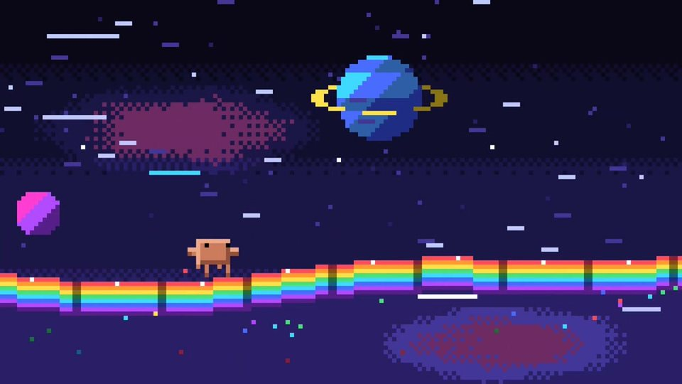

<p align="center"></p>

# Awesome AI Motion

**看见好作品，找到好提示词。**

精选 AI 辅助创作的视频与动画，当前聚焦 **Claude Opus 5.5**。从产品宣传、知识讲解到像素动画，每个案例都保留作者、原帖和公开指令。

[简体中文](README.md) · [English](README.en.md) · [贡献作品](https://github.com/guanmo-ai/awesome-ai-motion/issues/new?template=submit.yml)

**32 个案例 · 28 份公开提示词 · 21 个页内播放**

直接浏览，无需安装，也不消耗模型 Token。找到喜欢的效果，展开视频，再复制作者提示词；需要参考图、音频或额外服务的地方会单独说明。

[精选作品](#featured) · [全部分类](#browse) · [常见问题](#faq) · [投稿与纠错](https://github.com/guanmo-ai/awesome-ai-motion/issues)

<a id="featured"></a>

## 从这六个作品开始

六种不同的表达方式，由编辑选取。点击封面跳到对应案例。

<table>
<tr>
<td width="50%" valign="top"><a href="#case-2103918792845963545"><br><strong>Pocketsflow 角色产品讲解</strong></a><br><sub>产品宣传 · 15s · <a href="https://x.com/achxvi">@achxvi</a></sub></td>
<td width="50%" valign="top"><a href="#case-2103315922098470926"><br><strong>15 秒动态设计自由发挥</strong></a><br><sub>短动效 · 15s · <a href="https://x.com/stephanlivera">@stephanlivera</a></sub></td>
</tr>
<tr>
<td width="50%" valign="top"><a href="#case-2102583898865873225"><br><strong>用线稿回顾中华五千年</strong></a><br><sub>知识讲解 · 158s · <a href="https://x.com/akokoi1">@akokoi1</a></sub></td>
<td width="50%" valign="top"><a href="#case-2102515055116063144"><br><strong>彩虹跑道上的像素闪避</strong></a><br><sub>像素与角色 · 19s · <a href="https://x.com/riku720720">@riku720720</a></sub></td>
</tr>
<tr>
<td width="50%" valign="top"><a href="#case-2103099194693271874"><br><strong>机器人穿越十二种画风</strong></a><br><sub>像素与角色 · 75s · <a href="https://x.com/pradeepXkapoor">@pradeepXkapoor</a></sub></td>
<td width="50%" valign="top"><a href="#case-2103116235009347650"><br><strong>用代码讲述奥斯特里茨战役</strong></a><br><sub>叙事短片 · 301s · <a href="https://x.com/WinterArc2125">@WinterArc2125</a></sub></td>
</tr>
</table>

<a id="browse"></a>

## 按用途浏览

- **[产品宣传](#product)** · 7 个案例
- **[知识讲解](#education)** · 7 个案例
- **[短动效](#motion)** · 5 个案例
- **[像素与角色](#characters)** · 3 个案例
- **[3D 与交互](#interactive)** · 1 个案例
- **[叙事短片](#stories)** · 3 个案例
- **[音乐与歌词](#music)** · 2 个案例
- [仅公开任务描述](#briefs) · 4

每类按收藏数排序，点赞数用于同分排序。数字为公开快照，浏览量不参与排名。 [数据说明](docs/SOURCES.md)

<a id="product"></a>

## 产品宣传

<a id="case-2102787937482252537"></a>

### 用一句话介绍推理服务

**[Deedy · @deedydas](https://x.com/deedydas)** · 产品宣传 · 26s

[](https://x.com/deedydas/status/2102787937482252537)

<details>
<summary>▶ 播放视频 · 26s</summary>

https://github.com/user-attachments/assets/0005d4cf-acdd-42aa-af16-dbebe167126d

[作者原帖](https://x.com/deedydas/status/2102787937482252537) · [播放来源](https://github.com/opusvideo/awesome-claude-video/blob/d90b8a46f122614b14885147246c710ae1c7781f/README.md)

</details>

把抽象的推理服务变成一支短发布片，适合参考技术产品的解释方式。

**作者公开提示词** · [出处](https://x.com/deedydas/status/2102787937482252537) · [纯文本](prompts/2102787937482252537.txt)

```text
make a modern slick and punchy video for a modern startup that works on inference
```

<details>
<summary>中文译文</summary>

```text
为一家从事推理服务的现代创业公司，制作一支现代、精致、节奏鲜明的视频。
```

</details>

<sub>收藏 4,697 · 点赞 3,242 · 浏览 337,803</sub>

[案例详情与来源](cases/2102787937482252537.md)

---

<a id="case-2103918792845963545"></a>

### Pocketsflow 角色产品讲解

**[Chain · @achxvi](https://x.com/achxvi)** · 产品宣传 · 15s

[](https://x.com/achxvi/status/2103918792845963545)

<details>
<summary>▶ 播放视频 · 15s</summary>

https://github.com/user-attachments/assets/2154915d-0eca-450b-b7fe-f9b1ddd756b7

[作者原帖](https://x.com/achxvi/status/2103918792845963545) · [播放来源](https://github.com/opusvideo/awesome-claude-video/blob/d90b8a46f122614b14885147246c710ae1c7781f/README.md)

</details>

把作品集式动效与角色口播结合，适合参考产品功能介绍。

> 使用前: 作者原文包含 ElevenLabs 密钥的玩笑占位符，不是真实密钥；实际使用需自行配置配音服务。

**作者公开提示词** · [出处](https://x.com/achxvi/status/2103938227786654016) · [纯文本](prompts/2103918792845963545.txt)

```text
make a dynamic 15-second motion graphics video about Pocketsflow that shows what an incredible motion designer you are, like it's your showreel for a résumé. go all out.

here is elevenlabs key:
xxxxxx_youthoughtiwouldleakit_xxxxxx

make a video where a character talks about pocketsflow and how people can use it and what can they do with it etc etc etc 

LFG
```

<sub>收藏 2,005 · 点赞 2,083 · 浏览 122,284</sub>

[案例详情与来源](cases/2103918792845963545.md)

---

<a id="case-2103499977632997524"></a>

### 五个场景讲清一门生意

**[Alex Prompter · @alex\_prompter](https://x.com/alex_prompter)** · 产品宣传 · 35s

[](https://x.com/alex_prompter/status/2103499977632997524)

[▶ 到作者原帖观看](https://x.com/alex_prompter/status/2103499977632997524)

问题、方案、步骤、证据和署名组成一条 30 秒商业讲解。

> 使用前: 方括号内容需要换成自己的业务信息。

**作者公开提示词** · [出处](https://x.com/alex_prompter/status/2103499977632997524) · [纯文本](prompts/2103499977632997524.txt)

```text
Adopt the role of an expert motion designer. Build a 30-second animated explainer for my business as a single HTML page. 5 scenes. The customer's problem, what I do, how it works in 3 steps, one proof point, and my name at the end. Bold text, smooth transitions, my brand colours. My business [DESCRIBE WHAT YOU SELL, WHO IT'S FOR AND YOUR COLOURS]
```

<details>
<summary>中文译文</summary>

```text
扮演专业动态设计师。用单个 HTML 页面，为我的业务制作一支 30 秒动画讲解。包含五个场景：客户的问题、我做什么、如何用三步实现、一个证明点，以及结尾的我的名字。使用醒目文字、流畅转场和我的品牌配色。我的业务：[描述你卖什么、面向谁以及品牌颜色]。
```

</details>

<sub>收藏 659 · 点赞 370 · 浏览 38,536</sub>

[案例详情与来源](cases/2103499977632997524.md)

---

<a id="case-2103483957266268381"></a>

### MakerMap 的连续产品旅程

**[Martijn Verbove · @verbove](https://x.com/verbove)** · 产品宣传 · 20s

[](https://x.com/verbove/status/2103483957266268381)

[▶ 到作者原帖观看](https://x.com/verbove/status/2103483957266268381)

将注册、地图、匹配和活动串成一个连续变化的界面，用真实产品数据讲故事。

> 使用前: 这是作者公开的可复用模板结构，另外提到曾提供参考动效。需要填写产品、URL、真实数据与品牌信息。

**作者公开提示词** · [出处](https://x.com/verbove/status/2103483957266268381) · [纯文本](prompts/2103483957266268381.txt)

<details>
<summary>展开原文 · 1,588 字符</summary>

```text
<inputs> 
Ask me for: 
• my product + URL 
• 8–12 UI states that tell its story 
• the real data shown in each state 
• brand colors + fonts + accent color 
• required formats (1:1, 16:9, 9:16) 
</inputs>

<rules> 
One HTML file. One canvas
One draw(t) function

No CSS transitions
No timers
No state carried between frames

One shape, never cut

Every state is the same element changing size, radius and color while the content swaps

A cursor drives the sequence with real clicks, typing and one drag

Real UI. Real data. No placeholders.

</rules>
<structure> 
120 BPM grid

Something happens on every bea

logo → button → handle field → “is this you?” → loader → pin → globe filling with users → matches → tabs → RSVP → search → logo

</structure>

<motion> 
Closed-form springs everywhere with only a tiny overshoot.

If a value changes target multiple times, sum one spring per change

Content enters after its container starts morphing and leaves before the next morph so text never overlaps

Use a short blur on transitions

Never fade black directly into the accent color. Move an accent element between states instead

Make tab indicators stretch by putting each edge on a different spring

Zoom the camera so every state fills the frame

Make the last frame equal the first so the whole thing loops
</motion>

<export> 
First render one frame per beat as a contact sheet

Fix anything cramped or broken

Then render every frame in headless Chrome at 60fps, averaging 6 subframes for motion blur

Pipe into ffmpeg:
H.264 + yuv420p

Export all aspect ratios in parallel
</export>
```

</details>

<sub>收藏 334 · 点赞 208 · 浏览 15,435</sub>

[案例详情与来源](cases/2103483957266268381.md)

---

<a id="case-2103761658745335993"></a>

### 30 秒产品动效简报

**[Kiran · @sudo\_kiran](https://x.com/sudo_kiran)** · 产品宣传 · 30s

[](https://x.com/sudo_kiran/status/2103761658745335993)

[▶ 到作者原帖观看](https://x.com/sudo_kiran/status/2103761658745335993)

用一个简短要求统筹脚本、颜色和音乐，适合尝试自己的产品介绍。

> 使用前: 中文为本站译文，合并了原文反复强调的形容词；英文原文完整保留。

**作者公开提示词** · [出处](https://x.com/sudo_kiran/status/2103761658745335993) · [纯文本](prompts/2103761658745335993.txt)

```text
create best motion graphics explainer of the (your product) with very good script and good design colors and good music make sure the video should be incredible and people should feels like watch it many times.. it has to be in 30 seconds good and very intresting, it has to be best of the best of the best of the best video
(product link)
```

<details>
<summary>中文译文</summary>

```text
为（你的产品）制作出色的动态图形讲解，使用好的脚本、设计配色和音乐。让视频精彩、有趣，让人想反复观看；时长为 30 秒。（产品链接）
```

</details>

<sub>收藏 11 · 点赞 12 · 浏览 2,084</sub>

[案例详情与来源](cases/2103761658745335993.md)

---

<a id="case-2103746671591256286"></a>

### 用真实网页素材介绍分析产品

**[Ziga Potocnik · @zigapoto](https://x.com/zigapoto)** · 产品宣传 · 60s

[](https://x.com/zigapoto/status/2103746671591256286)

[▶ 到作者原帖观看](https://x.com/zigapoto/status/2103746671591256286)

明确要求抓取产品素材或截图，再由代码生成动画并配乐。

> 使用前: 需要提供自己的产品网站；作者原帖说明之后做过一次纠正。

**作者公开提示词** · [出处](https://x.com/zigapoto/status/2103746698660942208) · [纯文本](prompts/2103746671591256286.txt)

```text
make a modern slick and punchy video for a startup that works on agentic analytics, just javascript, playwright and ffmpeg, code the animation and take a video of it, download assets from the site or use playwright for screenshots, include music aligned with the video.
```

<details>
<summary>中文译文</summary>

```text
为一家做智能体分析的创业公司制作现代、精致、节奏鲜明的视频。只使用 JavaScript、Playwright 和 FFmpeg，编写动画并录成视频。从网站下载素材，或用 Playwright 截图；加入与视频配合的音乐。
```

</details>

<sub>收藏 0 · 点赞 3 · 浏览 110</sub>

[案例详情与来源](cases/2103746671591256286.md)

---

<a id="case-2104039666093572362"></a>

### 为 deckuse 做宣传动画

**[Fei · @feiflow](https://x.com/feiflow)** · 产品宣传 · 65s

[](https://x.com/feiflow/status/2104039666093572362)

[▶ 到作者原帖观看](https://x.com/feiflow/status/2104039666093572362)

围绕真实开源产品要求动效、音乐和音效，提示词短而明确。

**作者公开提示词** · [出处](https://x.com/feiflow/status/2104039666093572362) · [纯文本](prompts/2104039666093572362.txt)

```text
我需要推广 deckuse,帮我制作一个动画视频，包括音效和音乐，用于此产品宣传；你可以使用任何你觉得合适的工具和技术，做出最好最惊艳的效果
```

<sub>收藏 0 · 点赞 3 · 浏览 32</sub>

[案例详情与来源](cases/2104039666093572362.md) · [作者源码](https://github.com/deckflow/deckuse)

---

<a id="education"></a>

## 知识讲解

<a id="case-2103683057689522564"></a>

### 从直觉到数学解释 Transformer

**[宝玉 · @dotey](https://x.com/dotey)** · 知识讲解 · 732s

[](https://x.com/dotey/status/2103683057689522564)

[▶ 到作者原帖观看](https://x.com/dotey/status/2103683057689522564)

指定高中生能理解，同时要求注意力机制与数学细节，适合较深入的技术讲解。

**作者公开提示词** · [出处](https://x.com/dotey/status/2103683057689522564) · [纯文本](prompts/2103683057689522564.txt)

```text
帮我用js制作一个视频，主题是：什么是 Transformer
要深入浅出，让高中生也能看得懂，不仅high level说的清楚，也要有细节，包括注意力机制，甚至一些数学概念

你可以用任何工具或者安装工具，可以联网检索

请给我惊喜
```

<sub>收藏 1,457 · 点赞 1,113 · 浏览 150,947</sub>

[案例详情与来源](cases/2103683057689522564.md)

---

<a id="case-2102853258582880547"></a>

### 让鸡尾酒配方动起来

**[Rory Flynn · @Ror\_Fly](https://x.com/Ror_Fly)** · 知识讲解 · 30s

[](https://x.com/Ror_Fly/status/2102853258582880547)

<details>
<summary>▶ 播放视频 · 30s</summary>

https://github.com/user-attachments/assets/a675be87-848d-4ccb-9099-38e67eeda590

[作者原帖](https://x.com/Ror_Fly/status/2102853258582880547) · [播放来源](https://github.com/opusvideo/awesome-claude-video/blob/d90b8a46f122614b14885147246c710ae1c7781f/README.md)

</details>

从空杯到成品，随着原料加入显示名称和用量；适合步骤型教程。

> 使用前: 作者提供了一张参考图，使用时需自行准备对应配方或参考图。

**作者公开提示词** · [出处](https://x.com/Ror_Fly/status/2102853258582880547) · [纯文本](prompts/2102853258582880547.txt)

```text
We're going to try a little test. Do you think you could render a recipe motion graphic animation using javascript or html (w/e you think will produce the best) to show the full recipe from start to finish (empty glass to completed cocktail) - Explainer video style - Showing the recipe ingreidents + measurements as they're going into the cup. Should be a 30s video.
```

<details>
<summary>中文译文</summary>

```text
我们来做个小测试。你能用 JavaScript 或 HTML（选择你认为效果最好的方式）渲染一段配方动态图形动画，完整展示从空杯到调好鸡尾酒的过程吗？采用讲解视频风格，在原料加入杯中时显示原料和用量。时长应为 30 秒。
```

</details>

<sub>收藏 1,442 · 点赞 1,011 · 浏览 73,160</sub>

[案例详情与来源](cases/2102853258582880547.md)

---

<a id="case-2102606609574941028"></a>

### 把大气环流讲成动画

**[WY · @akokoi1](https://x.com/akokoi1)** · 知识讲解 · 288s

[](https://x.com/akokoi1/status/2102606609574941028)

<details>
<summary>▶ 播放视频 · 288s</summary>

https://github.com/user-attachments/assets/2c87394f-8224-4e89-bf04-36ccbe5d574f

[作者原帖](https://x.com/akokoi1/status/2102606609574941028) · [播放来源](https://github.com/opusvideo/awesome-claude-video/blob/d90b8a46f122614b14885147246c710ae1c7781f/README.md)

</details>

将地理知识、双语字幕与旁白结合，可参考课堂讲解的任务描述。

> 使用前: 作者流程另外准备 TTS.md 与语音服务配置；原文中的配置名称不是仓库提供的凭据。

**作者公开提示词** · [出处](https://x.com/akokoi1/status/2102606609574941028) · [纯文本](prompts/2102606609574941028.txt)

```text
做一个动画，讲解高中地理知识点“大气环流”。风格轻松有趣，动画格式为线稿，添加合适的音乐，请务必做到引人入胜，字幕用中英双语，解说用TTS，如果 TTS 接口有关闭水印的参数就关掉，文档在TTS.md，API KEY 和音色分别是 .env 里的 APIKEY 和 VOICE，最终视频要能直接导出。
```

<sub>收藏 810 · 点赞 692 · 浏览 133,737</sub>

[案例详情与来源](cases/2102606609574941028.md)

---

<a id="case-2102583898865873225"></a>

### 用线稿回顾中华五千年

**[WY · @akokoi1](https://x.com/akokoi1)** · 知识讲解 · 158s

[](https://x.com/akokoi1/status/2102583898865873225)

<details>
<summary>▶ 播放视频 · 158s</summary>

https://github.com/user-attachments/assets/120d98a4-47d7-43ba-81ee-7a492fa5ec0d

[作者原帖](https://x.com/akokoi1/status/2102583898865873225) · [播放来源](https://github.com/opusvideo/awesome-claude-video/blob/d90b8a46f122614b14885147246c710ae1c7781f/README.md)

</details>

中文一句话提示词案例，适合从历史主题入门线稿讲解。

**作者公开提示词** · [出处](https://x.com/akokoi1/status/2102584165220962502) · [纯文本](prompts/2102583898865873225.txt)

```text
做一个动画，快速回顾中华五千年的历史。风格轻松有趣，动画格式为线稿，添加合适的音乐，请务必做到引人入胜
```

<sub>收藏 762 · 点赞 687 · 浏览 154,080</sub>

[案例详情与来源](cases/2102583898865873225.md)

---

<a id="case-2102827887732932956"></a>

### 真人口播变线稿讲解

**[Axton · @AxtonLiu](https://x.com/AxtonLiu)** · 知识讲解 · 84s

[](https://x.com/AxtonLiu/status/2102827887732932956)

<details>
<summary>▶ 播放视频 · 84s</summary>

https://github.com/user-attachments/assets/d8d0a72e-d750-48a0-b84c-1f3f6c3d2188

[作者原帖](https://x.com/AxtonLiu/status/2102827887732932956) · [播放来源](https://github.com/opusvideo/awesome-claude-video/blob/d90b8a46f122614b14885147246c710ae1c7781f/README.md)

</details>

保留原声、字幕和时长，将主画面改成随口播变化的动画。

> 使用前: 需要自己的 short-1.mp4。提示词中的人物指原视频讲述者。

**作者公开提示词** · [出处](https://x.com/AxtonLiu/status/2102827887732932956) · [纯文本](prompts/2102827887732932956.txt)

```text
把 short-1.mp4 做成一条新的竖屏短片 short-1-v5.mp4：

1. 我的人像缩小成右下角的圆形画中画，能看清我在讲话，不遮字幕。
2. 主画面换成一段动画 B-roll，跟着我讲的内容走：我说到哪个概念，画面就画哪个概念。风格轻松有趣，线稿动画就可以，不要写实。
3. 原声、原字幕、时长都不变。
```

<sub>收藏 411 · 点赞 371 · 浏览 31,375</sub>

[案例详情与来源](cases/2102827887732932956.md)

---

<a id="case-2103511590884815282"></a>

### 把印尼历史排成动态图形

**[Sonny · @sonnylazuardi](https://x.com/sonnylazuardi)** · 知识讲解 · 53s

[](https://x.com/sonnylazuardi/status/2103511590884815282)

<details>
<summary>▶ 播放视频 · 53s</summary>

https://github.com/user-attachments/assets/d12b7adb-242f-4347-bd5e-ac0185e7af18

[作者原帖](https://x.com/sonnylazuardi/status/2103511590884815282) · [播放来源](https://github.com/opusvideo/awesome-claude-video/blob/d90b8a46f122614b14885147246c710ae1c7781f/README.md)

</details>

从总统与地图串联历史，并尝试有地域特色的音乐。

**作者公开提示词** · [出处](https://x.com/sonnylazuardi/status/2103660301132685418) · [纯文本](prompts/2103511590884815282.txt)

```text
make a dynamic motion graphics video that shows what an incredible motion designer you are, like it's your showreel for a résumé. go all out.

generate reel but for impressive story, the history of Indonesia, first president until now , surprise me with interesting storyboard
```

<details>
<summary>中文译文</summary>

```text
制作一支动态图形视频，展示你作为动态设计师的出色能力，就像用于简历的作品集。全力发挥。

生成一支讲述精彩故事的短片：印度尼西亚的历史，从第一任总统到现在，用有趣的故事板给我惊喜。
```

</details>

<sub>收藏 102 · 点赞 155 · 浏览 11,580</sub>

[案例详情与来源](cases/2103511590884815282.md)

---

<a id="case-2104044910769016888"></a>

### 面向零基础的 Git 视频

**[Yunn · @Yunn260414](https://x.com/Yunn260414)** · 知识讲解 · 408s

[](https://x.com/Yunn260414/status/2104044910769016888)

[▶ 到作者原帖观看](https://x.com/Yunn260414/status/2104044910769016888)

明确目标观众与常用指令，让模型用中文声音解释 Git。

**作者公开提示词** · [出处](https://x.com/Yunn260414/status/2104044910769016888) · [纯文本](prompts/2104044910769016888.txt)

```text
帮我用js制作一个视频，主题是：什么是Git
要深入浅出，让一个计算机0基础的人也能看得懂，然后要介绍一些常用指令的意思等等
要有声音的，然后是中文讲的
你可以用任何工具或者安装工具，可以联网检索
```

<sub>收藏 2 · 点赞 2 · 浏览 302</sub>

[案例详情与来源](cases/2104044910769016888.md)

---

<a id="motion"></a>

## 短动效

<a id="case-2103273003555402193"></a>

### 一个形状串起整套 UI

**[zero · @twoclipping](https://x.com/twoclipping)** · 短动效 · 14s

[](https://x.com/twoclipping/status/2103273003555402193)

<details>
<summary>▶ 播放视频 · 14s</summary>

https://github.com/user-attachments/assets/720d0d02-845b-4d07-b66a-99bd718f0190

[作者原帖](https://x.com/twoclipping/status/2103273003555402193) · [播放来源](https://github.com/opusvideo/awesome-claude-video/blob/d90b8a46f122614b14885147246c710ae1c7781f/README.md)

</details>

按钮、加载器、播放器和图表连续形变；适合研究界面动效与节拍。

> 使用前: 作者公开的模板；需要回答 UI 状态、配色和歌曲等输入问题。保留完整原文，中文简介不替代模板。

**作者公开提示词** · [出处](https://x.com/twoclipping/status/2103273003555402193) · [纯文本](prompts/2103273003555402193.txt)

<details>
<summary>展开原文 · 2,711 字符</summary>

```text
<inputs>
Ask me for: 8 to 12 UI states I want the shape to become (e.g. button, loader, player, slider, toggle, tabs, chart, command palette, toast), pure black and white or one accent color, and a royalty-free song around 120 BPM (e.g. Mixkit, free for commercial use).
</inputs>

<direction>
Dribbble-level UI motion. One shape, never cut: every state is the same element morphing its size, radius and color while its content swaps with a short blur. A cursor drives every change with real clicks and drags. Light warm-gray canvas, black and white components, one clean UI font (Geist). Springs everywhere, a tiny overshoot at most. The camera zooms so each state fills the frame. The last frame is the first frame, so it loops.
Banned: bouncy easing, particle bursts, glows, gradients on UI chrome, mismatched icon strokes, dead time, anything that looks like a template.
</direction>

<structure>
120 BPM, 7 bars, something happens on every beat.
Button → loader → check → dynamic island → music player with a play/pause morph → scrub the progress bar → it becomes a volume slider that stretches when dragged past max → a toggle flips on the beat → the knob becomes a liquid tab indicator → the tabs open into a chart that draws itself, with a tooltip on hover → it collapses into ⌘K → type to filter → enter → toast → back to the button.
</structure>

<build>
1. One HTML file, square 1440x1440. Every style is computed from time inside seek(t): no CSS transitions, no timers, no state carried between frames.
2. Springs are closed-form step responses. A value that changes target many times is the sum of one spring per change, so it stays a pure function of time.
3. The tab indicator's two edges ride different springs, so the leading edge stretches ahead of the trailing one. Same trick for the toggle knob.
4. Drags are direct manipulation: while the cursor is held, the value is computed from its position. On release it springs back from wherever it was.
5. Analyze the song with numpy for the beat grid and start on a downbeat. Place every UI sound by its measured peak.
6. Render with Playwright: 4 subframes per frame, blended with ffmpeg tmix for motion blur at 60fps.
7. Render one frame per beat before the full render. Fix anything off the grid, cramped or hard to read.
</build>

<gotchas>
Never put will-change on anything the camera scales or the text renders blurry. Text that swaps inside a morphing container needs its own enter and exit timing or it overlaps. Make the last frame identical to the first, cursor position and speed included, or the loop stutters.
</gotchas>

<start>
Ask me for the inputs, then show me the state list on the beat grid before you write any code.
</start>
```

</details>

<sub>收藏 19,303 · 点赞 11,656 · 浏览 907,430</sub>

[案例详情与来源](cases/2103273003555402193.md)

---

<a id="case-2103315922098470926"></a>

### 15 秒动态设计自由发挥

**[Stephan Livera · @stephanlivera](https://x.com/stephanlivera)** · 短动效 · 15s

[](https://x.com/stephanlivera/status/2103315922098470926)

<details>
<summary>▶ 播放视频 · 15s</summary>

https://github.com/user-attachments/assets/50e1566c-a40d-4f6a-9cf3-246be4058b4a

[作者原帖](https://x.com/stephanlivera/status/2103315922098470926) · [播放来源](https://github.com/opusvideo/awesome-claude-video/blob/d90b8a46f122614b14885147246c710ae1c7781f/README.md)

</details>

只给时长、用途和创作方向，让模型自行决定镜头与转场。

> 使用前: 作者标明使用 Max effort。

**作者公开提示词** · [出处](https://x.com/stephanlivera/status/2103315922098470926) · [纯文本](prompts/2103315922098470926.txt)

```text
make a dynamic 15-second motion graphics video that shows what an incredible motion designer you are, like it's your showreel for a résumé. go all out.
```

<details>
<summary>中文译文</summary>

```text
制作一支充满动感的 15 秒动态图形视频，展示你作为动态设计师的出色能力，就像用于简历的作品集短片。全力发挥。
```

</details>

<sub>收藏 11,692 · 点赞 15,875 · 浏览 1,511,259</sub>

[案例详情与来源](cases/2103315922098470926.md)

---

<a id="case-2103576084499358051"></a>

### Leon 的 15 秒动效作品集

**[Leon Abboud · @leonabboud](https://x.com/leonabboud)** · 短动效 · 15s

[](https://x.com/leonabboud/status/2103576084499358051)

[▶ 到作者原帖观看](https://x.com/leonabboud/status/2103576084499358051)

与其他作品使用相同短提示词，却呈现不同的镜头与材质选择，可对照观看。

**作者公开提示词** · [出处](https://x.com/leonabboud/status/2103576084499358051) · [纯文本](prompts/2103576084499358051.txt)

```text
make a dynamic 15-second motion graphics video that shows what an incredible motion designer you are, like it's your showreel for a résumé. go all out.
```

<details>
<summary>中文译文</summary>

```text
制作一支充满动感的 15 秒动态图形视频，展示你作为动态设计师的出色能力，就像用于简历的作品集短片。全力发挥。
```

</details>

<sub>收藏 642 · 点赞 574 · 浏览 58,249</sub>

[案例详情与来源](cases/2103576084499358051.md)

---

<a id="case-2103742861971726495"></a>

### 同一动效任务的无品牌与品牌版

**[Lukáš Eršil · @lukasersil](https://x.com/lukasersil)** · 短动效 · 15s

[](https://x.com/lukasersil/status/2103742861971726495)

[▶ 到作者原帖观看](https://x.com/lukasersil/status/2103742861971726495)

作者同时展示两条视频，可对照品牌素材对成片的影响。

> 使用前: 原帖有两条视频：第一条无作者品牌，第二条使用其品牌素材包。封面对应第一条。

**作者公开提示词** · [出处](https://x.com/lukasersil/status/2103742861971726495) · [纯文本](prompts/2103742861971726495.txt)

<details>
<summary>展开原文 · 744 字符</summary>

```text
Create a bold, dynamic 15-second motion graphics showreel that feels like the ultimate portfolio piece of an exceptionally talented motion designer. Showcase a wide range of advanced techniques: kinetic typography, smooth transitions, 2D and 3D animation, abstract geometry, fluid simulations, particles, distortion, creative masking, compositing, lighting, depth, and seamless camera movement. Keep the pacing fast, confident, and visually surprising, with every shot transitioning naturally into the next. Make it feel meticulously art-directed rather than like a random collection of effects. Push the creativity, polish, timing, and visual impact as far as possible. This should feel like the opening reel that gets a motion designer hired.
```

</details>

<sub>收藏 98 · 点赞 68 · 浏览 7,400</sub>

[案例详情与来源](cases/2103742861971726495.md)

---

<a id="case-2103557735086428547"></a>

### 90 秒动效与原创钢琴

**[klöss · @kloss\_xyz](https://x.com/kloss_xyz)** · 短动效 · 90s

[](https://x.com/kloss_xyz/status/2103557735086428547)

<details>
<summary>▶ 播放视频 · 90s</summary>

https://github.com/user-attachments/assets/763c801c-16db-44ec-b4fa-227613667655

[作者原帖](https://x.com/kloss_xyz/status/2103557735086428547) · [播放来源](https://github.com/opusvideo/awesome-claude-video/blob/d90b8a46f122614b14885147246c710ae1c7781f/README.md)

</details>

在作品集提示词中加入声音方向、钢琴配乐和导出规格。

**作者公开提示词** · [出处](https://x.com/kloss_xyz/status/2103560107921723834) · [纯文本](prompts/2103557735086428547.txt)

```text
make a dynamic 16:9 aspect ratio 90-second motion graphics video that shows exactly what an incredible motion designer you are and your true creative limits, like it's your showreel for a résumé. use s tier sound design, no synth. go all out. compose your own original and viral piano score. export it as a 1080p mp4 for social media.
```

<details>
<summary>中文译文</summary>

```text
制作一支 16:9、90 秒的动态图形视频，展示你作为动态设计师的实力与创意极限，就像用于简历的作品集。使用顶级声音设计，不要合成器音色。全力发挥，创作原创且易传播的钢琴配乐。导出适合社交媒体的 1080p MP4。
```

</details>

<sub>收藏 70 · 点赞 105 · 浏览 43,093</sub>

[案例详情与来源](cases/2103557735086428547.md)

---

<a id="characters"></a>

## 像素与角色

<a id="case-2102476258948927543"></a>

### 像素巫师的施法循环

**[Majid Manzarpour · @majidmanzarpour](https://x.com/majidmanzarpour)** · 像素与角色 · 11s

[](https://x.com/majidmanzarpour/status/2102476258948927543)

<details>
<summary>▶ 播放视频 · 11s</summary>

https://github.com/user-attachments/assets/ea6388a4-f341-4d32-8807-8a2e7edafce0

[作者原帖](https://x.com/majidmanzarpour/status/2102476258948927543) · [播放来源](https://github.com/opusvideo/awesome-claude-video/blob/d90b8a46f122614b14885147246c710ae1c7781f/README.md)

</details>

完整规格覆盖像素尺寸、调色板、角色动作与循环，适合学习精确约束。

> 使用前: 纯 HTML / Canvas 2D 的规格型提示词；无需外部素材。

**作者公开提示词** · [出处](https://x.com/majidmanzarpour/status/2102476499387383834) · [纯文本](prompts/2102476258948927543.txt)

<details>
<summary>展开原文 · 2,209 字符</summary>

```text
Create a single self-contained HTML file that renders an animated pixel art wizard casting a spell, using vanilla JavaScript and Canvas 2D. No external assets, libraries, or network requests.

RENDERING
- Draw everything to an offscreen canvas at a fixed logical resolution of 128x96, then blit to a fullscreen display canvas scaled by the largest integer factor that fits the window, centered, with imageSmoothingEnabled = false and CSS image-rendering: pixelated.
- All drawing snaps to integer coordinates on the logical canvas. No sub-pixel positions, anti-aliasing, gradients, or shadowBlur.
- Fixed palette of ~24 hex colors: deep blues/purples for night sky, warm robe tones, 3-4 bright magic colors. Every pixel comes from this palette.

CHARACTER
- Build the wizard procedurally from filled rects and pixel runs, ~24x32 logical pixels: pointed hat with a bend, long beard, two-shade robe with darker outline, staff with a gem at the tip.
- Parameterize the pose (staff angle, arm raise, head tilt, robe sway). Animate parameters smoothly, then quantize to the pixel grid each frame so motion reads at an 8-12 fps pixel animation feel even though the loop runs at 60fps.

ANIMATION
- Looping state machine: IDLE (2-frame bob, beard sway) -> CHARGE (staff raises, gem flickers, sparks spiral inward) -> CAST (bright burst, projectile fires across the scene, 1-2 pixel screen shake) -> RECOVER (settle back). Ease pose parameters between keyframes.
- Pooled allocation-free particle system: preallocate and reuse. Sparks orbit the gem during CHARGE, explode outward on CAST, each particle stepping its palette index from white to magic color to dark before despawn. Snap particle positions to the grid when drawing.
- Fixed 60hz timestep update with rAF rendering. Zero object allocation inside the loop.

SCENE
- Minimal background: dark sky, a few twinkling 1px stars, moon, stone floor line. Character silhouette must read clearly.
- Subtle 1px rim light on the wizard from the gem, brightening during CHARGE and CAST.

QUALITY BAR
- Crisp pixels at any window size, seamless loop, stable 60fps, readable silhouette. Should look like a polished 16-bit sprite animation, not vector shapes scaled down.
```

</details>

<sub>收藏 2,639 · 点赞 2,527 · 浏览 436,780</sub>

[案例详情与来源](cases/2102476258948927543.md)

---

<a id="case-2102515055116063144"></a>

### 彩虹跑道上的像素闪避

**[Rikuo · @riku720720](https://x.com/riku720720)** · 像素与角色 · 19s

[](https://x.com/riku720720/status/2102515055116063144)

<details>
<summary>▶ 播放视频 · 19s</summary>

https://github.com/user-attachments/assets/676888c5-bb90-49cb-b7a0-c8b568a71dfb

[作者原帖](https://x.com/riku720720/status/2102515055116063144) · [播放来源](https://github.com/opusvideo/awesome-claude-video/blob/d90b8a46f122614b14885147246c710ae1c7781f/README.md)

</details>

围绕奔跑、预警与闪避构建连续动作，适合像素动画和小游戏演示。

> 使用前: 日文完整规格，包含角色、攻击预警、速度感与循环要求；以下原文保持日文，不将本站简介冒充全文翻译。

**作者公开提示词** · [出处](https://x.com/riku720720/status/2102515058010132554) · [纯文本](prompts/2102515055116063144.txt)

<details>
<summary>展开原文 · 3,449 字符</summary>

```text
Vanilla JavaScript と Canvas 2D を使い、オレンジ色のピクセルキャラクターが宇宙空間のレインボーの床を超高速で駆け抜け、次々と襲いかかる隕石やビームをかっこよく回避し続けるアニメーションを、単一の自己完結型 HTML ファイルとして作成してください。外部アセット、ライブラリ、ネットワークリクエストは一切使用しないこと。操作は不要で、キャラクターが自動で回避し続けるデモとしてシームレスにループさせること。

レンダリング
- すべてを 160x90 の固定論理解像度のオフスクリーンキャンバスに描画し、それをフルスクリーンの表示用キャンバスに転写する。拡大率はウィンドウに収まる最大の整数倍とし、中央に配置する。余白は黒で埋める。imageSmoothingEnabled = false、CSS は image-rendering: pixelated を指定すること。
- すべての描画は論理キャンバス上の整数座標にスナップさせる。サブピクセル位置、アンチエイリアス、グラデーション、shadowBlur、回転描画は使用しない。
- 約32色の固定パレットを使う：宇宙背景用の黒〜深い紺・紫系、キャラクター用のオレンジ系3段階（本体 #CD7B5E 付近、明るいハイライト、暗い影）と目の黒、レインボー床用の7色（赤・橙・黄・緑・水色・青・紫）とそれぞれの暗色、隕石用の岩色・溶岩色、ビーム用の白・シアン・マゼンタ。すべてのピクセルはこのパレットの色から取ること。

キャラクター
- 次の 12x8 ピクセルのシルエットを正確に再現する（1マス＝論理1ピクセル）：
  - 胴体は幅8×高さ8の四角形（列2〜9）。
  - 腕は胴体の左右に幅2×高さ2で突き出す（列0〜1と列10〜11、行2〜3）。
  - 目は黒の1x1ピクセル2つ、行1の列3と列8。
  - 脚は行6〜7に4本、各幅1（列2・4・7・9）。脚の間は背景色で抜く。
- 1色塗りではなく、上辺と左辺に1pxのハイライト、下辺と右辺に1pxの影色を入れ、16ビット風の立体感を出す。
- 走りモーションは脚4本を2本ずつ交互に上下させる4フレームサイクル。速度に応じてサイクルを速める。
- ポーズをパラメータ化する（上下バウンド、前傾、スクワッシュ＆ストレッチ、腕の上下）。スクワッシュ＆ストレッチは幅・高さを整数ピクセル単位で1〜2px変えるだけで表現する。パラメータは滑らかに補間しつつ、毎フレームピクセルグリッドに量子化し、60fpsループでも 12fps 前後のドット絵アニメらしく見せること。

レインボーの床
- キャラクターは画面左寄り1/3付近を右方向へ走る横スクロール構成。床は7色の横縞からなる虹の帯（各色1〜2px）で、画面を横切るように延び、ゆるやかにうねる（サイン波で上下にカーブ）。
- 床の縦方向に一定間隔の区切り線（暗色の縦ライン）を入れ、速度に応じて左へ高速スクロールさせて疾走感を出す。
- 床の下辺からは虹色の光の粒が後方へこぼれ落ち、床が宇宙に浮いていることを示す。
- ときどき床にジャンプ台（上向きのカーブ）や途切れ（ギャップ）を出し、ジャンプの見せ場を作る。

障害物
- 隕石：大・中・小の3サイズ。ドット絵の岩（アウトライン＋2段階の陰影＋溶岩色のひび）で、画面右上から斜めに飛来する。後ろに溶岩色→暗色へ変化する炎の尾を引く。避けられた隕石は床に衝突せず画面外へ抜けるか、背後で破片に砕け散る。
- ビーム：出現前に予告として1pxの点滅ライン（マゼンタ）を 0.5 秒ほど表示し、その後に白い芯＋シアンの外縁からなる太さ3〜5pxのビームが水平または斜めに照射される。照射中は端がジリジリと揺れる。
- 障害物はランダムではなく、あらかじめ決めた「攻撃パターン」を順番に流し、全体が一定時間でループするように設計する（例：隕石単発 → 隕石3連 → 低いビーム → 高いビーム → ビームと隕石の複合 → 大隕石＋床のギャップ）。

回避アクション
- ジャンプ：スクワッシュで溜め → ストレッチで跳躍 → 空中で縮こまる → 着地でスクワッシュ＋砂煙ならぬ虹色の火花。
- 二段ジャンプ：空中で一瞬静止してから再加速。キャラクターの周囲に虹色のリングが1pxで広がる。
- スライディング：高さを半分近くまでスクワッシュして低空姿勢で滑り、床との接地面から火花を飛ばす。
- ダッシュ回避：一瞬だけ速度を大きく上げ、後方に残像を3〜4体残す。残像は虹の7色を順に使い、パレットの暗色へと段階的に消えていく。
- 各攻撃パターンには、それに最もかっこよく見える回避アクションを割り当てる。回避はギリギリのタイミング（ニアミス）で行うこと。

ステートマシン
- RUN（通常疾走）→ WARN（予告表示、キャラクターが一瞬前を見るように目を1px動かす）→ DODGE（回避アクション）→ NEAR_MISS（演出）→ RUN に戻る、を攻撃パターンごとに繰り返す。
- ループの最後には BOOST（全力加速）→ WARP（画面全体が白→虹色に一瞬フラッシュ）を入れ、そのまま冒頭の RUN に自然につながるようにする。
- ポーズやカメラのパラメータはキーフレーム間でイージングをかける。

カメラワーク
- カメラは論理座標上の整数オフセットとして扱う。ズームや回転は使わず、位置の移動と揺れだけで表現する。
- 追従：キャラクターの上下移動にダンピング付きで遅れて追従し、ジャンプ時は少し遅れて持ち上がる。
- 先読み：速度が上がるほどカメラを進行方向へ数px先行させ、キャラクターが画面左に押し込まれるようにして加速感を出す。
- ヒットストップ：ニアミスの瞬間に 3〜4 フレームだけ全体を停止し、その後 0.3 秒ほどスローモーション（更新ステップを間引く）にしてから通常速度に戻す。
- シェイク：大隕石の通過やビーム照射開始時に 1〜2px の画面揺れ。揺れは決まったパターン配列から読み出し、乱数は使わない。
- BOOST 中はカメラをわずかに下げ、床の占める面積を増やして速度感を強調する。

疾走感を出すエフェクト
- 多層パララックス：遠い星（ほぼ動かない1pxの点）、中景の星（速度に応じて横に2〜6pxの線に伸びる）、近景のスピードライン（明るい色の横線が画面を高速で横切る）の3層。
- スピードラインの本数と長さは速度に比例させ、BOOST 中は最大にする。
- 背景に大きな惑星や星雲をドット絵で1〜2個配置し、ごくゆっくりスクロールさせてスケール感を出す。
- ニアミス時はキャラクターの輪郭を1pxの白で縁取り、隕石・ビームに近い側だけ一瞬光らせる。
- 着地・スライディング・ダッシュの火花、隕石の尾、破片、床からこぼれる光の粒は、すべて同じパーティクルシステムで扱う。

パーティクルシステム
- プール方式でアロケーションのないパーティクルシステム：事前に確保して再利用する。
- 各パーティクルは種類ごとに色の遷移テーブル（パレットのインデックス列）を持ち、寿命に応じて段階的に色を変えて消滅する（例：火花は白 → 黄 → 橙 → 暗色、残像は虹色 → 暗色）。
- 描画時にはパーティクル位置をグリッドにスナップさせる。
- 60Hz の固定タイムステップで更新し、描画は rAF で行う。ループ内でのオブジェクト生成はゼロにすること（配列・クロージャ・文字列連結の生成も含む）。

シーン
- 背景は深い宇宙：黒から紺への段階的な帯（ディザリングで色の境目を表現）、瞬く星、遠くの惑星。
- キャラクター・障害物・床の色が背景に埋もれないよう、明度差をはっきりつける。どんなに画面が騒がしくても、キャラクターのシルエットが一目で読み取れること。

品質基準
- どのウィンドウサイズでもピクセルがくっきりしていること、ループが途切れないこと、安定した60fps、読みやすいシルエット。
- ベクター図形を縮小したものではなく、洗練された16ビット時代のアクションゲームのデモ画面のように見えること。
- 「速い」「ギリギリで避けた」「かっこいい」の3つが、毎回の回避で伝わること。
```

</details>

<sub>收藏 842 · 点赞 1,079 · 浏览 240,426</sub>

[案例详情与来源](cases/2102515055116063144.md)

---

<a id="case-2103099194693271874"></a>

### 机器人穿越十二种画风

**[Pradeep Kapoor · @pradeepXkapoor](https://x.com/pradeepXkapoor)** · 像素与角色 · 75s

[](https://x.com/pradeepXkapoor/status/2103099194693271874)

<details>
<summary>▶ 播放视频 · 75s</summary>

https://github.com/user-attachments/assets/6764161e-1d18-47c6-bac6-b56b315547e4

[作者原帖](https://x.com/pradeepXkapoor/status/2103099194693271874) · [播放来源](https://github.com/opusvideo/awesome-claude-video/blob/d90b8a46f122614b14885147246c710ae1c7781f/README.md)

</details>

用详细角色设定与分幕要求保持机器人在不同画风中的连续性。

> 使用前: 长篇制作规格，含角色、骨骼、十二种世界风格、声音和交付检查；原文开头的拼写保持不改。

作者已公开指令；本站仅提供原帖入口，不再分发全文或译文。 [查看作者原文](https://x.com/pradeepXkapoor/status/2103176289482154373)

<sub>收藏 532 · 点赞 663 · 浏览 60,740</sub>

[案例详情与来源](cases/2103099194693271874.md)

---

<a id="interactive"></a>

## 3D 与交互

<a id="case-2102450239923720440"></a>

### 史前岛屿的水上与水下

**[Vib3Coded · @vib3coded](https://x.com/vib3coded)** · 3D 与交互 · 20s

[](https://x.com/vib3coded/status/2102450239923720440)

<details>
<summary>▶ 播放视频 · 20s</summary>

https://github.com/user-attachments/assets/9c7562a1-3943-4dbd-8396-e19155d7ed23

[作者原帖](https://x.com/vib3coded/status/2102450239923720440) · [播放来源](https://github.com/opusvideo/awesome-claude-video/blob/d90b8a46f122614b14885147246c710ae1c7781f/README.md)

</details>

构建带水下剖面、动物和交互操作的岛屿，适合参考完整场景的任务规格。

> 使用前: 原帖是模型对比：左侧 Opus 5，右侧 Opus 5.5。本条记录的是右侧的 Opus 5.5 场景；这是交互场景演示录像。

作者已公开指令；本站仅提供原帖入口，不再分发全文或译文。 [查看作者原文](https://x.com/vib3coded/status/2102450842070569099)

<sub>收藏 77 · 点赞 204 · 浏览 100,832</sub>

[案例详情与来源](cases/2102450239923720440.md)

---

<a id="stories"></a>

## 叙事短片

<a id="case-2103381720410333314"></a>

### 一句话讲 Anthropic 的发家史

**[Vincent文森特 · @VincentWei93](https://x.com/VincentWei93)** · 叙事短片 · 224s

[](https://x.com/VincentWei93/status/2103381720410333314)

<details>
<summary>▶ 播放视频 · 224s</summary>

https://github.com/user-attachments/assets/29c764e4-8fc5-45e2-954e-9bf85ca3baa1

[作者原帖](https://x.com/VincentWei93/status/2103381720410333314) · [播放来源](https://github.com/opusvideo/awesome-claude-video/blob/d90b8a46f122614b14885147246c710ae1c7781f/README.md)

</details>

中文短指令，同时要求主题叙事、音乐与音效。

**作者公开提示词** · [出处](https://x.com/VincentWei93/status/2103494376118985207) · [纯文本](prompts/2103381720410333314.txt)

```text
帮我制作一个动画，主题描绘Anthropic的理念和发家史；包括音效和音乐；你可以使用任何你觉得合适的工具和技术，做出最好最惊艳的效果，不要使用已有的skill，不要参考以前做过的视频或者文案
```

<sub>收藏 1,207 · 点赞 1,072 · 浏览 130,223</sub>

[案例详情与来源](cases/2103381720410333314.md)

---

<a id="case-2103116235009347650"></a>

### 用代码讲述奥斯特里茨战役

**[Winter · @WinterArc2125](https://x.com/WinterArc2125)** · 叙事短片 · 301s

[](https://x.com/WinterArc2125/status/2103116235009347650)

<details>
<summary>▶ 播放视频 · 301s</summary>

https://github.com/user-attachments/assets/b184c248-70ea-486a-afa8-223bdf7ff943

[作者原帖](https://x.com/WinterArc2125/status/2103116235009347650) · [播放来源](https://github.com/opusvideo/awesome-claude-video/blob/d90b8a46f122614b14885147246c710ae1c7781f/README.md)

</details>

用历史事件检验较长叙事、地形与镜头组织；作者同时提供了源码。

> 使用前: 原文要求参考随附绘画，属于有参考素材的长片任务；作者记录的制作与渲染时间较长。

**作者公开提示词** · [出处](https://x.com/WinterArc2125/status/2103116689944502720) · [纯文本](prompts/2103116235009347650.txt)

<details>
<summary>展开原文 · 847 字符</summary>

```text
Create a 4–5 minute cinematic video about the Battle of Austerlitz (1805), built entirely in code.

Research the battle thoroughly and decide for yourself how to tell the story, structure the pacing, explain the strategy, and visualize the events. I want it to be historically accurate, dramatic, easy to understand, and visually exceptional.

Use the attached paintings as visual inspiration, not a strict style requirement. I love their scale, atmosphere, smoke, dramatic skies, cavalry, massed formations, landscape, and sense of chaos. Find a way to translate that feeling into code — but if you can invent a stronger visual language, do it.

Don't make it feel like a generic infographic or strategy game. It should feel like a cinematic historical film that happens to be rendered with code.

You have complete creative control. Surprise me.
```

</details>

<sub>收藏 272 · 点赞 305 · 浏览 63,750</sub>

[案例详情与来源](cases/2103116235009347650.md) · [作者源码](https://github.com/WinterArc21/Battle-of-Austerlitz-Film)

---

<a id="case-2103757767727255661"></a>

### 雨夜站台的 30 秒重逢

**[Feicai · @zhu185178](https://x.com/zhu185178)** · 叙事短片 · 30s

[](https://x.com/zhu185178/status/2103757767727255661)

[▶ 到作者原帖观看](https://x.com/zhu185178/status/2103757767727255661)

按镜头时间写清动作、视线与声音，适合观察故事短片的详细任务单。

> 使用前: 混合制作：原文包含 GPT Image 2.5 原画、超分、深度估计、配音与代码合成，不是纯代码生成所有素材。

**作者公开提示词** · [出处](https://x.com/zhu185178/status/2103757767727255661) · [纯文本](prompts/2103757767727255661.txt)

<details>
<summary>展开原文 · 1,058 字符</summary>

```text
帮我做一条 30 秒的 2D 动画分镜预演短片《雨站》，要标杆级画质。不装 HyperFrames/Remotion，全部自己写代码（Python + ffmpeg）完成。

故事（24fps，2.39:1，4K）：雨夜高架站台。她穿米色风衣、撑透明伞，站在近侧站台；对面路灯下站着他，穿深灰长大衣、围围巾。
1. 0–6.4s 透明伞雨珠特写 → 后拉，焦点移到对面露出他（过肩镜头）
2. 6.4–9.4s 他的中近景：低头 → 抬头看向画左
3. 9.4–12.4s 她的正面近景：眨眼 → 认出他；远处传来鸣笛
4. 12.4–17s 远景：车头灯光先到，5 节列车驶过；第一个车厢缝隙里他还在，第二个已经空了
5. 17–18.8s 她含泪的近景，车窗光带扫过她的脸，头发被风吹起
6. 18.8–22.4s 尾灯远去，对面站台空了；他那盏灯闪几下后熄灭
7. 22.4–28.6s 她的背影，焦点从空站台拉回她；身后脚步声，一把黑伞遮到她头顶，她回头看向镜头；男声“好久不见。”，配字幕
8. 28.6–30s 黑场片名“雨站 / RAIN STATION”

做法：
- 原画：用GPT Image 2.5 画远景、他、她、列车（头车/中车/尾车）。人物一律用纯绿 #00FF00 背景，自己抠像（带参考图要透明背景会得到假棋盘格）。同一角色的各个姿态放在同一个会话里，以基准图为参考连续编辑；换姿态时只合成变化的区域。
- 画质：用 Real-ESRGAN x4plus anime 6B（HF 上的 safetensors 版，自己写 RRDBNet，跑在 MPS 上）把全部原画放大 4 倍；用 Depth Anything V2 估算远景深度，做逐像素视差。
- 渲染：自己写 2.5D 合成器。各层按真实深度摆放，针孔相机按真实焦距运动；做圆形焦外光斑、焦点转移、3D 雨丝、列车运动模糊、体积光、泛光和胶片光晕、细颗粒、调色。人物用网格变形做呼吸、风吹发梢、伞抖，关键姿态按日式“一拍二”切换。4K 超采样，逐帧缓存到磁盘，分 3 个进程按时间段并行（16GB 内存）。
- 声音：Mixkit 真实音效（雨、伞面雨声、列车、鸣笛、脚步）；按剧情节点写谱，用 Logic/GarageBand 自带的施坦威钢琴和弦乐采样渲染；台词用 Kokoro 中文男声；按镜头做声音远近，响度 -16 LUFS。
- 每一步都渲染预览帧、拼成图自检，修好再出片。交付 4K 母版和 1080p 分享版。
```

</details>

<sub>收藏 100 · 点赞 51 · 浏览 7,802</sub>

[案例详情与来源](cases/2103757767727255661.md)

---

<a id="music"></a>

## 音乐与歌词

<a id="case-2102801274173587569"></a>

### Claude Pop 混合制作 MV

**[donald · @donaldjewkes](https://x.com/donaldjewkes)** · 音乐与歌词 · 142s

[](https://x.com/donaldjewkes/status/2102801274173587569)

<details>
<summary>▶ 播放视频 · 142s</summary>

https://github.com/user-attachments/assets/e3b65a8a-6af3-4a0a-8d62-5e9dc0ce1794

[作者原帖](https://x.com/donaldjewkes/status/2102801274173587569) · [播放来源](https://github.com/opusvideo/awesome-claude-video/blob/d90b8a46f122614b14885147246c710ae1c7781f/README.md)

</details>

将参考音乐视频、角色资产、外部生成与代码动画结合，展示较复杂的制作任务。

> 使用前: 作者原文依赖参考 MP4、音轨及外部生成服务，并提到较高服务预算。它不是无素材、零成本的一句话案例。

作者已公开指令；本站仅提供原帖入口，不再分发全文或译文。 [查看作者原文](https://x.com/donaldjewkes/status/2102801469976248500)

<sub>收藏 8,096 · 点赞 8,599 · 浏览 2,110,510</sub>

[案例详情与来源](cases/2102801274173587569.md)

---

<a id="case-2103741636635496583"></a>

### 让歌词成为竖屏视频主角

**[kurahu@AIart · @kurahu\_capten](https://x.com/kurahu_capten)** · 音乐与歌词 · 48s

[](https://x.com/kurahu_capten/status/2103741636635496583)

[▶ 到作者原帖观看](https://x.com/kurahu_capten/status/2103741636635496583)

先定演出方案，再按歌词时间调整文字表现，适合已有歌曲的歌词视频。

> 使用前: 作者先准备歌曲和歌词；原片音乐使用 Suno 制作，后续还进行了逐段修改。

**作者公开提示词** · [出处](https://x.com/kurahu_capten/status/2103742110747054506) · [纯文本](prompts/2103741636635496583.txt)

```text
曲と歌詞で、歌詞を主役にした縦長のリリックビデオを作って。歌詞は歌にぴったり合わせて、エヴァのタイトルカード風で。作る前に演出の案を見せて
```

<details>
<summary>中文译文</summary>

```text
用歌曲和歌词制作一支以歌词为主角的竖屏歌词视频。让歌词与演唱准确同步，采用 EVA 标题卡风格。制作前先向我展示演出方案。
```

</details>

<sub>收藏 2 · 点赞 25 · 浏览 1,218</sub>

[案例详情与来源](cases/2103741636635496583.md)

---

<a id="briefs"></a>

## 作者任务描述

这 4 个案例有作品可看，但作者只公开了任务转述，不能当作完整提示词。

<a id="case-2102591147927654847"></a>

### 用镜头实验室解释对焦

**[Ryan Sael · @RyanSael](https://x.com/RyanSael)** · 知识讲解 · 32s

[](https://x.com/RyanSael/status/2102591147927654847)

<details>
<summary>▶ 播放视频 · 32s</summary>

https://github.com/user-attachments/assets/442ad7c1-0abc-4d15-964e-b558b8c82107

[作者原帖](https://x.com/RyanSael/status/2102591147927654847) · [播放来源](https://github.com/opusvideo/awesome-claude-video/blob/d90b8a46f122614b14885147246c710ae1c7781f/README.md)

</details>

交互场景展示焦点和镜片关系，可参考需要观众操作的教学方式。

> 使用前: 作者任务描述，不是完整提示词；作品为交互演示录像。

**作者任务描述 · 非完整提示词** · [出处](https://x.com/RyanSael/status/2102591147927654847) · [纯文本](prompts/2102591147927654847.txt)

```text
I asked Opus 5.5 to explain camera focus by building an interactive lens lab
```

<details>
<summary>中文译文</summary>

```text
我让 Opus 5.5 通过构建一个交互式镜头实验室来解释相机对焦。
```

</details>

<sub>收藏 9,188 · 点赞 15,107 · 浏览 2,945,570</sub>

[案例详情与来源](cases/2102591147927654847.md)

---

<a id="case-2103304514329854102"></a>

### 面向普通人的超级智能纪录片

**[Gavin Purcell · @gavinpurcell](https://x.com/gavinpurcell)** · 知识讲解 · 315s

[](https://x.com/gavinpurcell/status/2103304514329854102)

<details>
<summary>▶ 播放视频 · 315s</summary>

https://github.com/user-attachments/assets/aa4ac9cb-8868-4c98-806e-679a78b05167

[作者原帖](https://x.com/gavinpurcell/status/2103304514329854102) · [播放来源](https://github.com/opusvideo/awesome-claude-video/blob/d90b8a46f122614b14885147246c710ae1c7781f/README.md)

</details>

通过外部视频工具组织纪录片内容，可参考通俗解释的受众设定。

> 使用前: 作者只引用了任务短语，完整上下文未公开；流程接入 Runway MCP。

**作者任务描述 · 非完整提示词** · [出处](https://x.com/gavinpurcell/status/2103304514329854102) · [纯文本](prompts/2103304514329854102.txt)

```text
high-end netflix style documentary about superintelligence for normies
```

<details>
<summary>中文译文</summary>

```text
一部面向普通观众、讲解超级智能的高端 Netflix 风格纪录片。
```

</details>

<sub>收藏 3,120 · 点赞 3,476 · 浏览 267,252</sub>

[案例详情与来源](cases/2103304514329854102.md)

---

<a id="case-2102495989194236158"></a>

### 用画笔讲述模型的一生

**[✯ · @shfred0](https://x.com/shfred0)** · 叙事短片 · 30s

[](https://x.com/shfred0/status/2102495989194236158)

<details>
<summary>▶ 播放视频 · 30s</summary>

https://github.com/user-attachments/assets/542174cd-2388-4aff-8e4a-06a525083c6b

[作者原帖](https://x.com/shfred0/status/2102495989194236158) · [播放来源](https://github.com/opusvideo/awesome-claude-video/blob/d90b8a46f122614b14885147246c710ae1c7781f/README.md)

</details>

从模型自身经历出发组织动画，适合参考开放式故事命题。

> 使用前: 作者公开的是任务转述，未核实完整原始提示词。

**作者任务描述 · 非完整提示词** · [出处](https://x.com/shfred0/status/2102495989194236158) · [纯文本](prompts/2102495989194236158.txt)

```text
Asked Claude Opus 5.5 to animate its own life, from day 0 to now
```

<details>
<summary>中文译文</summary>

```text
让 Claude Opus 5.5 把自己从诞生到现在的一生做成动画。
```

</details>

<sub>收藏 1,732 · 点赞 4,174 · 浏览 364,783</sub>

[案例详情与来源](cases/2102495989194236158.md)

---

<a id="case-2102573127192727704"></a>

### 把旅行照片画成丙烯动画

**[Ann Nguyen · @ann\_nnng](https://x.com/ann_nnng)** · 叙事短片 · 22s

[](https://x.com/ann_nnng/status/2102573127192727704)

<details>
<summary>▶ 播放视频 · 22s</summary>

https://github.com/user-attachments/assets/6d5bca54-2fc9-48ec-9439-1508be654c08

[作者原帖](https://x.com/ann_nnng/status/2102573127192727704) · [播放来源](https://github.com/opusvideo/awesome-claude-video/blob/d90b8a46f122614b14885147246c710ae1c7781f/README.md)

</details>

将个人照片作为输入，探索代码绘制的旅行记忆。

> 使用前: 作者任务转述，且依赖其旅行照片；未公开完整原始提示词。

**作者任务描述 · 非完整提示词** · [出处](https://x.com/ann_nnng/status/2102573127192727704) · [纯文本](prompts/2102573127192727704.txt)

```text
asked Claude opus 5.5 to draw my new zealand trip pics in acrylic style
```

<details>
<summary>中文译文</summary>

```text
让 Claude Opus 5.5 用丙烯画风格描绘我的新西兰旅行照片。
```

</details>

<sub>收藏 1,250 · 点赞 1,842 · 浏览 119,170</sub>

[案例详情与来源](cases/2102573127192727704.md)

---

<a id="faq"></a>

## 常见问题

**一句话提示词也收录吗？** 收录。按作者真实公开内容保留，不为显得专业而扩写。

**复制后能得到一模一样的作品吗？** 不能保证。提示词不一定包含完整对话、参考素材和修改过程；我们没有逐条独立复现。

**所有作品都是纯代码生成吗？** 不是。这里也收录混合制作和交互演示，具体条件写在案例的“使用前”说明中。

**视频打不开怎么办？** 打开作者原帖，或提交失效反馈。页内播放器引用第三方公开附件，可能随提供方状态变化。

## 一起完善这个片单

[提交作品](https://github.com/guanmo-ai/awesome-ai-motion/issues/new?template=submit.yml) · [纠错或移除](https://github.com/guanmo-ai/awesome-ai-motion/issues/new?template=correction.yml) · [投稿规范](CONTRIBUTING.md) · [维护指南](docs/MAINTAINING.md)

感谢公开作品与制作过程的创作者。参考 [opus-video-prompts](https://github.com/joeseesun/opus-video-prompts)、[Awesome Claude Video](https://github.com/opusvideo/awesome-claude-video)、[PicoTrex](https://github.com/PicoTrex/Awesome-Nano-Banana-images) 与 [YouMind](https://github.com/YouMind-OpenLab/awesome-nano-banana-pro-prompts)；案例逐条保留来源，介绍与译文独立整理。

原创维护脚本采用 [MIT](LICENSE)；第三方媒体与提示词另见 [来源与复用说明](THIRD_PARTY.md)。

<sub>互动快照: 2026-09-27 04:57 UTC — 2026-09-27 05:00 UTC · 策展 [观默 / @guanmo_ai](https://x.com/guanmo_ai)</sub>
