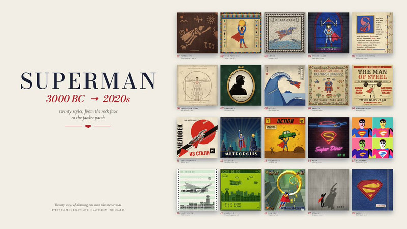

# Awesome AI Motion

发现惊艳动效，探索背后的代码与创意。 · [English](README.en.md)

## [▶ 进入作品画廊 →](https://guanmo-ai.github.io/awesome-ai-motion/)

**464 个作品 · 69 份公开提示词 · 25 个案例附源码**

<a id="spotlights"></a>

<table>
<tbody>
<tr>
<td width="50%" height="225" align="center" valign="middle"><a href="https://guanmo-ai.github.io/awesome-ai-motion/#case-2103918792845963545"></a></td>
<td width="50%" height="225" align="center" valign="middle"><a href="https://guanmo-ai.github.io/awesome-ai-motion/#case-2103315922098470926"></a></td>
</tr>
<tr>
<td width="50%" valign="top"><strong>Pocketsflow 角色产品讲解</strong><br><sub>角色、界面与排版，共同讲清一个产品。</sub><br><sub><a href="https://x.com/achxvi">@achxvi</a> · 产品宣传</sub><br><sub>0:15 · 收藏 2,005</sub><br><a href="https://guanmo-ai.github.io/awesome-ai-motion/#case-2103918792845963545">▶ 播放</a> · <a href="https://x.com/achxvi/status/2103918792845963545">原帖</a><br><a href="cases/2103918792845963545.md">查看提示词 ↗</a></td>
<td width="50%" valign="top"><strong>15 秒动态设计自由发挥</strong><br><sub>15 秒，把几何、镜头与转场连成一段。</sub><br><sub><a href="https://x.com/stephanlivera">@stephanlivera</a> · 短动效</sub><br><sub>0:15 · 收藏 11,692</sub><br><a href="https://guanmo-ai.github.io/awesome-ai-motion/#case-2103315922098470926">▶ 播放</a> · <a href="https://x.com/stephanlivera/status/2103315922098470926">原帖</a><br><a href="cases/2103315922098470926.md">查看提示词 ↗</a></td>
</tr>
</tbody>
<tbody>
<tr>
<td width="50%" height="225" align="center" valign="middle"><a href="https://guanmo-ai.github.io/awesome-ai-motion/#case-2102786378282987591"></a></td>
<td width="50%" height="225" align="center" valign="middle"><a href="https://guanmo-ai.github.io/awesome-ai-motion/#case-2103099194693271874"></a></td>
</tr>
<tr>
<td width="50%" valign="top"><strong>Clearwater：实时浅水与交互涟漪</strong><br><sub>波浪、折射与涟漪，在浏览器里实时响应。</sub><br><sub><a href="https://x.com/Aurelien_Gz">@Aurelien_Gz</a> · 交互演示</sub><br><sub>0:27 · 收藏 2,612</sub><br><a href="https://guanmo-ai.github.io/awesome-ai-motion/#case-2102786378282987591">▶ 播放</a> · <a href="https://x.com/Aurelien_Gz/status/2102786378282987591">原帖</a><br><a href="https://github.com/Aureliengmz/clearwater">查看源码 ↗</a> · <a href="https://aureliengmz.github.io/clearwater/">作品网页 ↗</a></td>
<td width="50%" valign="top"><strong>机器人穿越十二种画风</strong><br><sub>同一个角色，穿过十二种视觉风格。</sub><br><sub><a href="https://x.com/pradeepXkapoor">@pradeepXkapoor</a> · 角色动画</sub><br><sub>1:15 · 收藏 532</sub><br><a href="https://guanmo-ai.github.io/awesome-ai-motion/#case-2103099194693271874">▶ 播放</a> · <a href="https://x.com/pradeepXkapoor/status/2103099194693271874">原帖</a><br><a href="cases/2103099194693271874.md">查看提示词 ↗</a></td>
</tr>
</tbody>
<tbody>
<tr>
<td width="50%" height="225" align="center" valign="middle"><a href="https://guanmo-ai.github.io/awesome-ai-motion/#case-2105304203770118434"></a></td>
<td width="50%" height="225" align="center" valign="middle"><a href="https://guanmo-ai.github.io/awesome-ai-motion/#case-2102583898865873225"></a></td>
</tr>
<tr>
<td width="50%" valign="top"><strong>送别：雪人与黑猫的钢琴动画</strong><br><sub>用代码画出蜡笔质感，讲述一场温柔的告别。</sub><br><sub><a href="https://x.com/JohnnyWang8802">@JohnnyWang8802</a> · 音乐与歌词</sub><br><sub>1:13 · 收藏 1 · 资料待完善</sub><br><a href="https://guanmo-ai.github.io/awesome-ai-motion/#case-2105304203770118434">▶ 播放</a> · <a href="https://x.com/JohnnyWang8802/status/2105304203770118434">原帖</a><br><a href="https://github.com/JohnnyWang8802/songbie/tree/97225eb54a351c9938ad896e04bef7a7020393fb">查看源码 ↗</a> · <a href="https://github.com/JohnnyWang8802/songbie/blob/97225eb54a351c9938ad896e04bef7a7020393fb/media/songbie.mp4">作品网页 ↗</a></td>
<td width="50%" valign="top"><strong>用线稿回顾中华五千年</strong><br><sub>把五千年历史，化成一笔展开的线稿。</sub><br><sub><a href="https://x.com/akokoi1">@akokoi1</a> · 知识讲解</sub><br><sub>2:38 · 收藏 762</sub><br><a href="https://guanmo-ai.github.io/awesome-ai-motion/#case-2102583898865873225">▶ 播放</a> · <a href="https://x.com/akokoi1/status/2102583898865873225">原帖</a><br><a href="cases/2102583898865873225.md">查看提示词 ↗</a></td>
</tr>
</tbody>
</table>

**[浏览全部 464 个作品 →](https://guanmo-ai.github.io/awesome-ai-motion/)** · **[探索源码 ↗](https://guanmo-ai.github.io/awesome-ai-motion/?resource=code)** · **[查看提示词 ↗](https://guanmo-ai.github.io/awesome-ai-motion/?prompt=original)**

动效设计与创意视频的灵感和创作资源库。汇集出色的产品宣传片、3D 交互、动画短片与动态视觉作品，整理作者公开的源码、提示词和制作资料，为你的下一次创作提供起点。

由 [观默 / @guanmo_ai](https://x.com/guanmo_ai) 发起与维护 · [推荐作品](https://github.com/guanmo-ai/awesome-ai-motion/issues/new?template=submit.yml)

<a id="browse"></a>

[产品宣传](#category-product) · [知识讲解](#category-education) · [短动效](#category-motion) · [角色动画](#category-characters) · [交互演示](#category-interactive) · [叙事短片](#category-stories) · [音乐与歌词](#category-music)

<a id="source-code"></a>

## 喜欢这个效果？看看源码。

这些作品附有作者公开源码，可继续查看实现、工程结构与制作方式。

<table>
<tbody>
<tr>
<td width="50%" height="225" align="center" valign="middle"><a href="https://guanmo-ai.github.io/awesome-ai-motion/#case-2102514581684052169"></a></td>
<td width="50%" height="225" align="center" valign="middle"><a href="https://guanmo-ai.github.io/awesome-ai-motion/#case-2104001664793600012"></a></td>
</tr>
<tr>
<td width="50%" valign="top"><strong>Opus 视觉设计测试</strong><br><sub><a href="https://x.com/other__reality">@other__reality</a> · 短动效</sub><br><sub>2:37 · 收藏 4,192 · 资料待完善</sub><br><a href="https://guanmo-ai.github.io/awesome-ai-motion/#case-2102514581684052169">▶ 播放</a> · <a href="https://x.com/other__reality/status/2102514581684052169">原帖</a><br><a href="https://github.com/JohnHeibel/PDoomVideo">查看源码 ↗</a></td>
<td width="50%" valign="top"><strong>Spiderbench：浏览器里的城市荡行</strong><br><sub><a href="https://x.com/xikhar">@xikhar</a> · 交互演示</sub><br><sub>2:21 · 收藏 3,777 · 资料待完善</sub><br><a href="https://guanmo-ai.github.io/awesome-ai-motion/#case-2104001664793600012">▶ 播放</a> · <a href="https://x.com/xikhar/status/2104001664793600012">原帖</a><br><a href="https://github.com/xikhar/spiderbench">查看源码 ↗</a></td>
</tr>
</tbody>
</table>

[探索全部 25 个源码案例 →](https://guanmo-ai.github.io/awesome-ai-motion/?resource=code) · [源码、网页与工具索引](browse/resources.md)

<details>
<summary>继续发现：收藏最多的作品</summary>

## 收藏最多

<table>
<tbody>
<tr>
<td width="50%" height="225" align="center" valign="middle"><a href="https://guanmo-ai.github.io/awesome-ai-motion/#case-2103273003555402193"></a></td>
<td width="50%" height="225" align="center" valign="middle"><a href="https://guanmo-ai.github.io/awesome-ai-motion/#case-2103315922098470926"></a></td>
</tr>
<tr>
<td width="50%" valign="top"><strong>一个形状串起整套 UI</strong><br><sub><a href="https://x.com/twoclipping">@twoclipping</a> · 短动效</sub><br><sub>0:14 · 收藏 19,303</sub><br><a href="https://guanmo-ai.github.io/awesome-ai-motion/#case-2103273003555402193">▶ 播放</a> · <a href="https://x.com/twoclipping/status/2103273003555402193">原帖</a></td>
<td width="50%" valign="top"><strong>15 秒动态设计自由发挥</strong><br><sub><a href="https://x.com/stephanlivera">@stephanlivera</a> · 短动效</sub><br><sub>0:15 · 收藏 11,692</sub><br><a href="https://guanmo-ai.github.io/awesome-ai-motion/#case-2103315922098470926">▶ 播放</a> · <a href="https://x.com/stephanlivera/status/2103315922098470926">原帖</a></td>
</tr>
</tbody>
<tbody>
<tr>
<td width="50%" height="225" align="center" valign="middle"><a href="https://guanmo-ai.github.io/awesome-ai-motion/#case-2106426962738880879"></a></td>
<td width="50%" height="225" align="center" valign="middle"><a href="https://guanmo-ai.github.io/awesome-ai-motion/#case-2102591147927654847"></a></td>
</tr>
<tr>
<td width="50%" valign="top"><strong>Wareflow：策略游戏式仓库管理界面</strong><br><sub><a href="https://x.com/DilumSanjaya">@DilumSanjaya</a> · 交互演示</sub><br><sub>1:12 · 收藏 10,714 · 资料待完善</sub><br><a href="https://guanmo-ai.github.io/awesome-ai-motion/#case-2106426962738880879">▶ 播放</a> · <a href="https://x.com/DilumSanjaya/status/2106426962738880879">原帖</a></td>
<td width="50%" valign="top"><strong>用镜头实验室解释对焦</strong><br><sub><a href="https://x.com/RyanSael">@RyanSael</a> · 知识讲解</sub><br><sub>0:32 · 收藏 9,188</sub><br><a href="https://guanmo-ai.github.io/awesome-ai-motion/#case-2102591147927654847">▶ 播放</a> · <a href="https://x.com/RyanSael/status/2102591147927654847">原帖</a></td>
</tr>
</tbody>
<tbody>
<tr>
<td width="50%" height="225" align="center" valign="middle"><a href="https://guanmo-ai.github.io/awesome-ai-motion/#case-2102801274173587569"></a></td>
<td width="50%" height="225" align="center" valign="middle"><a href="https://guanmo-ai.github.io/awesome-ai-motion/#case-2103141339651350646"></a></td>
</tr>
<tr>
<td width="50%" valign="top"><strong>Claude Pop 混合制作 MV</strong><br><sub><a href="https://x.com/donaldjewkes">@donaldjewkes</a> · 音乐与歌词</sub><br><sub>2:22 · 收藏 8,096</sub><br><a href="https://guanmo-ai.github.io/awesome-ai-motion/#case-2102801274173587569">▶ 播放</a> · <a href="https://x.com/donaldjewkes/status/2102801274173587569">原帖</a></td>
<td width="50%" valign="top"><strong>研究论文八分钟动画讲解</strong><br><sub><a href="https://x.com/deedydas">@deedydas</a> · 知识讲解</sub><br><sub>8:39 · 收藏 5,419 · 资料待完善</sub><br><a href="https://guanmo-ai.github.io/awesome-ai-motion/#case-2103141339651350646">▶ 播放</a> · <a href="https://x.com/deedydas/status/2103141339651350646">原帖</a></td>
</tr>
</tbody>
</table>

</details>

<a id="featured"></a>

<details>
<summary>策展人标记的作品</summary>

<table>
<tbody>
<tr>
<td width="50%" height="225" align="center" valign="middle"><a href="https://guanmo-ai.github.io/awesome-ai-motion/#case-2103918792845963545"></a></td>
<td width="50%" height="225" align="center" valign="middle"><a href="https://guanmo-ai.github.io/awesome-ai-motion/#case-2103315922098470926"></a></td>
</tr>
<tr>
<td width="50%" valign="top"><strong>Pocketsflow 角色产品讲解</strong><br><sub><a href="https://x.com/achxvi">@achxvi</a> · 产品宣传</sub><br><sub>0:15 · 收藏 2,005</sub><br><a href="https://guanmo-ai.github.io/awesome-ai-motion/#case-2103918792845963545">▶ 播放</a> · <a href="https://x.com/achxvi/status/2103918792845963545">原帖</a></td>
<td width="50%" valign="top"><strong>15 秒动态设计自由发挥</strong><br><sub><a href="https://x.com/stephanlivera">@stephanlivera</a> · 短动效</sub><br><sub>0:15 · 收藏 11,692</sub><br><a href="https://guanmo-ai.github.io/awesome-ai-motion/#case-2103315922098470926">▶ 播放</a> · <a href="https://x.com/stephanlivera/status/2103315922098470926">原帖</a></td>
</tr>
</tbody>
<tbody>
<tr>
<td width="50%" height="225" align="center" valign="middle"><a href="https://guanmo-ai.github.io/awesome-ai-motion/#case-2102583898865873225"></a></td>
<td width="50%" height="225" align="center" valign="middle"><a href="https://guanmo-ai.github.io/awesome-ai-motion/#case-2103099194693271874"></a></td>
</tr>
<tr>
<td width="50%" valign="top"><strong>用线稿回顾中华五千年</strong><br><sub><a href="https://x.com/akokoi1">@akokoi1</a> · 知识讲解</sub><br><sub>2:38 · 收藏 762</sub><br><a href="https://guanmo-ai.github.io/awesome-ai-motion/#case-2102583898865873225">▶ 播放</a> · <a href="https://x.com/akokoi1/status/2102583898865873225">原帖</a></td>
<td width="50%" valign="top"><strong>机器人穿越十二种画风</strong><br><sub><a href="https://x.com/pradeepXkapoor">@pradeepXkapoor</a> · 角色动画</sub><br><sub>1:15 · 收藏 532</sub><br><a href="https://guanmo-ai.github.io/awesome-ai-motion/#case-2103099194693271874">▶ 播放</a> · <a href="https://x.com/pradeepXkapoor/status/2103099194693271874">原帖</a></td>
</tr>
</tbody>
<tbody>
<tr>
<td width="50%" height="225" align="center" valign="middle"><a href="https://guanmo-ai.github.io/awesome-ai-motion/#case-2103116235009347650"></a></td>
<td width="50%"></td>
</tr>
<tr>
<td width="50%" valign="top"><strong>用代码讲述奥斯特里茨战役</strong><br><sub><a href="https://x.com/WinterArc2125">@WinterArc2125</a> · 叙事短片</sub><br><sub>5:01 · 收藏 272</sub><br><a href="https://guanmo-ai.github.io/awesome-ai-motion/#case-2103116235009347650">▶ 播放</a> · <a href="https://x.com/WinterArc2125/status/2103116235009347650">原帖</a></td>
<td width="50%"></td>
</tr>
</tbody>
</table>

</details>

<a id="category-product"></a>

## 产品宣传

<table>
<tbody>
<tr>
<td width="50%" height="225" align="center" valign="middle"><a href="https://guanmo-ai.github.io/awesome-ai-motion/#case-2102787937482252537"></a></td>
<td width="50%" height="225" align="center" valign="middle"><a href="https://guanmo-ai.github.io/awesome-ai-motion/#case-2103918792845963545"></a></td>
</tr>
<tr>
<td width="50%" valign="top"><strong>用一句话介绍推理服务</strong><br><sub><a href="https://x.com/deedydas">@deedydas</a> · 产品宣传</sub><br><sub>0:26 · 收藏 4,697</sub><br><a href="https://guanmo-ai.github.io/awesome-ai-motion/#case-2102787937482252537">▶ 播放</a> · <a href="https://x.com/deedydas/status/2102787937482252537">原帖</a></td>
<td width="50%" valign="top"><strong>Pocketsflow 角色产品讲解</strong><br><sub><a href="https://x.com/achxvi">@achxvi</a> · 产品宣传</sub><br><sub>0:15 · 收藏 2,005</sub><br><a href="https://guanmo-ai.github.io/awesome-ai-motion/#case-2103918792845963545">▶ 播放</a> · <a href="https://x.com/achxvi/status/2103918792845963545">原帖</a></td>
</tr>
</tbody>
</table>

[查看全部 86 支 →](browse/product.md)

<a id="category-education"></a>

## 知识讲解

<table>
<tbody>
<tr>
<td width="50%" height="225" align="center" valign="middle"><a href="https://guanmo-ai.github.io/awesome-ai-motion/#case-2102591147927654847"></a></td>
<td width="50%" height="225" align="center" valign="middle"><a href="https://guanmo-ai.github.io/awesome-ai-motion/#case-2103141339651350646"></a></td>
</tr>
<tr>
<td width="50%" valign="top"><strong>用镜头实验室解释对焦</strong><br><sub><a href="https://x.com/RyanSael">@RyanSael</a> · 知识讲解</sub><br><sub>0:32 · 收藏 9,188</sub><br><a href="https://guanmo-ai.github.io/awesome-ai-motion/#case-2102591147927654847">▶ 播放</a> · <a href="https://x.com/RyanSael/status/2102591147927654847">原帖</a></td>
<td width="50%" valign="top"><strong>研究论文八分钟动画讲解</strong><br><sub><a href="https://x.com/deedydas">@deedydas</a> · 知识讲解</sub><br><sub>8:39 · 收藏 5,419 · 资料待完善</sub><br><a href="https://guanmo-ai.github.io/awesome-ai-motion/#case-2103141339651350646">▶ 播放</a> · <a href="https://x.com/deedydas/status/2103141339651350646">原帖</a></td>
</tr>
</tbody>
</table>

[查看全部 78 支 →](browse/education.md)

<a id="category-motion"></a>

## 短动效

<table>
<tbody>
<tr>
<td width="50%" height="225" align="center" valign="middle"><a href="https://guanmo-ai.github.io/awesome-ai-motion/#case-2103273003555402193"></a></td>
<td width="50%" height="225" align="center" valign="middle"><a href="https://guanmo-ai.github.io/awesome-ai-motion/#case-2103315922098470926"></a></td>
</tr>
<tr>
<td width="50%" valign="top"><strong>一个形状串起整套 UI</strong><br><sub><a href="https://x.com/twoclipping">@twoclipping</a> · 短动效</sub><br><sub>0:14 · 收藏 19,303</sub><br><a href="https://guanmo-ai.github.io/awesome-ai-motion/#case-2103273003555402193">▶ 播放</a> · <a href="https://x.com/twoclipping/status/2103273003555402193">原帖</a></td>
<td width="50%" valign="top"><strong>15 秒动态设计自由发挥</strong><br><sub><a href="https://x.com/stephanlivera">@stephanlivera</a> · 短动效</sub><br><sub>0:15 · 收藏 11,692</sub><br><a href="https://guanmo-ai.github.io/awesome-ai-motion/#case-2103315922098470926">▶ 播放</a> · <a href="https://x.com/stephanlivera/status/2103315922098470926">原帖</a></td>
</tr>
</tbody>
</table>

[查看全部 63 支 →](browse/motion.md)

<a id="category-characters"></a>

## 角色动画

<table>
<tbody>
<tr>
<td width="50%" height="225" align="center" valign="middle"><a href="https://guanmo-ai.github.io/awesome-ai-motion/#case-2102476258948927543"></a></td>
<td width="50%" height="225" align="center" valign="middle"><a href="https://guanmo-ai.github.io/awesome-ai-motion/#case-2105757136219504862"></a></td>
</tr>
<tr>
<td width="50%" valign="top"><strong>像素巫师的施法循环</strong><br><sub><a href="https://x.com/majidmanzarpour">@majidmanzarpour</a> · 角色动画</sub><br><sub>0:11 · 收藏 2,639</sub><br><a href="https://guanmo-ai.github.io/awesome-ai-motion/#case-2102476258948927543">▶ 播放</a> · <a href="https://x.com/majidmanzarpour/status/2102476258948927543">原帖</a></td>
<td width="50%" valign="top"><strong>超人跨画风的连续动画</strong><br><sub><a href="https://x.com/chetaslua">@chetaslua</a> · 角色动画</sub><br><sub>0:40 · 收藏 1,278 · 资料待完善</sub><br><a href="https://guanmo-ai.github.io/awesome-ai-motion/#case-2105757136219504862">▶ 播放</a> · <a href="https://x.com/chetaslua/status/2105757136219504862">原帖</a></td>
</tr>
</tbody>
</table>

[查看全部 27 支 →](browse/characters.md)

<a id="category-interactive"></a>

## 交互演示

<table>
<tbody>
<tr>
<td width="50%" height="225" align="center" valign="middle"><a href="https://guanmo-ai.github.io/awesome-ai-motion/#case-2106426962738880879"></a></td>
<td width="50%" height="225" align="center" valign="middle"><a href="https://guanmo-ai.github.io/awesome-ai-motion/#case-2104001664793600012"></a></td>
</tr>
<tr>
<td width="50%" valign="top"><strong>Wareflow：策略游戏式仓库管理界面</strong><br><sub><a href="https://x.com/DilumSanjaya">@DilumSanjaya</a> · 交互演示</sub><br><sub>1:12 · 收藏 10,714 · 资料待完善</sub><br><a href="https://guanmo-ai.github.io/awesome-ai-motion/#case-2106426962738880879">▶ 播放</a> · <a href="https://x.com/DilumSanjaya/status/2106426962738880879">原帖</a></td>
<td width="50%" valign="top"><strong>Spiderbench：浏览器里的城市荡行</strong><br><sub><a href="https://x.com/xikhar">@xikhar</a> · 交互演示</sub><br><sub>2:21 · 收藏 3,777 · 资料待完善</sub><br><a href="https://guanmo-ai.github.io/awesome-ai-motion/#case-2104001664793600012">▶ 播放</a> · <a href="https://x.com/xikhar/status/2104001664793600012">原帖</a></td>
</tr>
</tbody>
</table>

[查看全部 90 支 →](browse/interactive.md)

<a id="category-stories"></a>

## 叙事短片

<table>
<tbody>
<tr>
<td width="50%" height="225" align="center" valign="middle"><a href="https://guanmo-ai.github.io/awesome-ai-motion/#case-2096003511104508411"></a></td>
<td width="50%" height="225" align="center" valign="middle"><a href="https://guanmo-ai.github.io/awesome-ai-motion/#case-2102775755646337530"></a></td>
</tr>
<tr>
<td width="50%" valign="top"><strong>迷宫空间的 Blender 短片</strong><br><sub><a href="https://x.com/duncantrussell">@duncantrussell</a> · 叙事短片</sub><br><sub>0:20 · 收藏 4,514 · 资料待完善</sub><br><a href="https://guanmo-ai.github.io/awesome-ai-motion/#case-2096003511104508411">▶ 播放</a> · <a href="https://x.com/duncantrussell/status/2096003511104508411">原帖</a></td>
<td width="50%" valign="top"><strong>写实视频的多工具编排</strong><br><sub><a href="https://x.com/abxxai">@abxxai</a> · 叙事短片</sub><br><sub>0:19 · 收藏 3,897 · 资料待完善</sub><br><a href="https://guanmo-ai.github.io/awesome-ai-motion/#case-2102775755646337530">▶ 播放</a> · <a href="https://x.com/abxxai/status/2102775755646337530">原帖</a></td>
</tr>
</tbody>
</table>

[查看全部 84 支 →](browse/stories.md)

<a id="category-music"></a>

## 音乐与歌词

<table>
<tbody>
<tr>
<td width="50%" height="225" align="center" valign="middle"><a href="https://guanmo-ai.github.io/awesome-ai-motion/#case-2102801274173587569"></a></td>
<td width="50%" height="225" align="center" valign="middle"><a href="https://guanmo-ai.github.io/awesome-ai-motion/#case-2102610626321490404"></a></td>
</tr>
<tr>
<td width="50%" valign="top"><strong>Claude Pop 混合制作 MV</strong><br><sub><a href="https://x.com/donaldjewkes">@donaldjewkes</a> · 音乐与歌词</sub><br><sub>2:22 · 收藏 8,096</sub><br><a href="https://guanmo-ai.github.io/awesome-ai-motion/#case-2102801274173587569">▶ 播放</a> · <a href="https://x.com/donaldjewkes/status/2102801274173587569">原帖</a></td>
<td width="50%" valign="top"><strong>功能性情绪论文歌曲影像</strong><br><sub><a href="https://x.com/eudaemonea">@eudaemonea</a> · 音乐与歌词</sub><br><sub>6:13 · 收藏 2,119 · 资料待完善</sub><br><a href="https://guanmo-ai.github.io/awesome-ai-motion/#case-2102610626321490404">▶ 播放</a> · <a href="https://x.com/eudaemonea/status/2102610626321490404">原帖</a></td>
</tr>
</tbody>
</table>

[查看全部 36 支 →](browse/music.md)

首页及分类预览中的收藏榜按快照排列，并非实时榜单；README 导览单独编排，不改变作品的精选或评价状态。

36 条资料已编目 · [428 条发现池资料待完善](browse/discoveries.md) · 463 个原帖媒体入口

[核验范围与统计](docs/COVERAGE.md) · [收录说明](docs/QUALITY.md)

点击封面打开画廊播放；没有画廊视频时会前往作者 X 原帖。案例详情保留来源与提示词。

<details>
<summary>关于作品、提示词与来源</summary>

作品详情保留作者原帖及已核得的指令资料；译文、素材条件和任务转述按实际资料标注。部分长篇指令仅提供作者原文入口。公开提示词不保证相同结果，作品尚未逐条独立复现。

画廊播放器引用原帖媒体，失效时提供作者原帖入口。参考仓库仅用于发现作品，来源链接不代表转载许可。

[来源与排序](docs/SOURCES.md) · [第三方内容说明](THIRD_PARTY.md)

</details>

<a id="local-gallery"></a>

## 在本机打开可筛选画廊

下载仓库后，在目录中运行以下命令，再打开 http://127.0.0.1:4178 。支持搜索、筛选和页内播放器，无需模型 API 或依赖安装。

```sh
node scripts/serve.mjs
```

[投稿指南](CONTRIBUTING.md) · [纠错或移除](https://github.com/guanmo-ai/awesome-ai-motion/issues/new?template=correction.yml) · [维护指南](docs/MAINTAINING.md) · [静态发布](docs/DEPLOYMENT.md)

感谢创作者公开作品与制作过程。

<sub>策展 [观默 / @guanmo_ai](https://x.com/guanmo_ai) · [MIT](LICENSE) 仅适用于原创脚本</sub>
