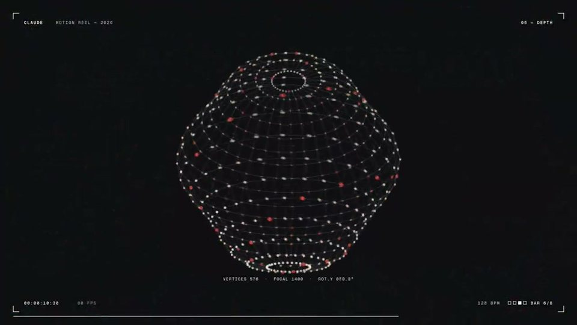
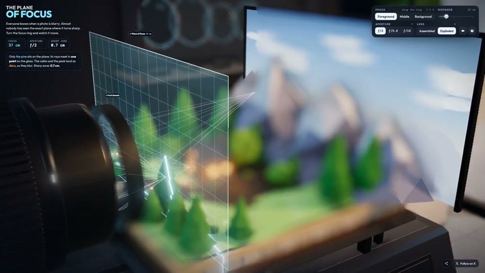
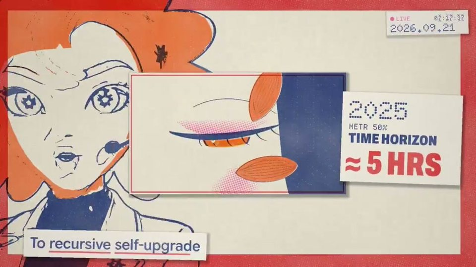
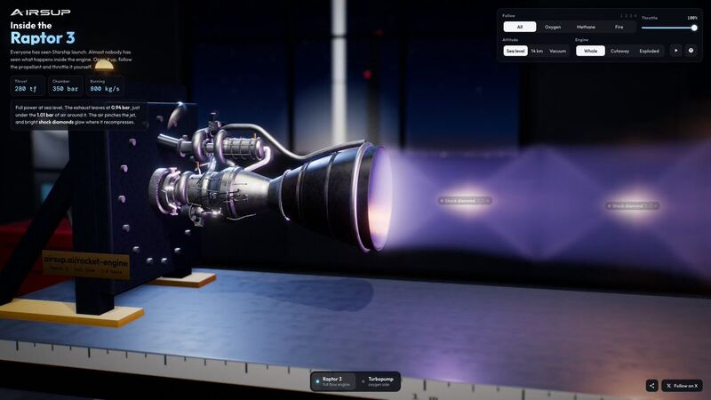

# Awesome AI Motion

[简体中文](README.md) · [English](README.en.md) · [在线画廊](https://guanmo-ai.github.io/awesome-ai-motion/) · [提交作品](https://github.com/guanmo-ai/awesome-ai-motion/issues/new?template=submit.yml)

**发现喜欢的 AI 视频与动画。**

从 X（Twitter）原作者公开帖子整理 AI 视频与动画。打开在线画廊，按类别看视频、认识作者、查看公开提示词。

**[▶ 打开在线画廊](https://guanmo-ai.github.io/awesome-ai-motion/)**

由 [观默 / @guanmo_ai](https://x.com/guanmo_ai) 发起与维护。在 X 关注我的 AI 视频、动效与创作实践。

355 个视频参考 · 62 份作者公开提示词 · 中英双语

[源码、网页与工具](browse/resources.md) · 38 个作品有资源入口

<a id="browse"></a>

[产品宣传](#category-product) · [知识讲解](#category-education) · [短动效](#category-motion) · [角色动画](#category-characters) · [交互演示](#category-interactive) · [叙事短片](#category-stories) · [音乐与歌词](#category-music)

## 收藏最多

<table>
<tr>
<td width="33%" valign="top"><a href="https://guanmo-ai.github.io/awesome-ai-motion/#case-2103273003555402193"><br><strong>一个形状串起整套 UI</strong><br><small>点击封面播放</small></a><br><sub>短动效 · 14s · 收藏 19,303 · <a href="https://x.com/twoclipping">@twoclipping</a></sub><br><a href="https://guanmo-ai.github.io/awesome-ai-motion/#case-2103273003555402193">▶ 打开画廊播放</a> · <a href="cases/2103273003555402193.md">案例详情与来源</a> · <a href="https://x.com/twoclipping/status/2103273003555402193">作者原帖</a></td>
<td width="33%" valign="top"><a href="https://guanmo-ai.github.io/awesome-ai-motion/#case-2103315922098470926"><br><strong>15 秒动态设计自由发挥</strong><br><small>点击封面播放</small></a><br><sub>短动效 · 15s · 收藏 11,692 · <a href="https://x.com/stephanlivera">@stephanlivera</a></sub><br><a href="https://guanmo-ai.github.io/awesome-ai-motion/#case-2103315922098470926">▶ 打开画廊播放</a> · <a href="cases/2103315922098470926.md">案例详情与来源</a> · <a href="https://x.com/stephanlivera/status/2103315922098470926">作者原帖</a></td>
<td width="33%" valign="top"><a href="https://guanmo-ai.github.io/awesome-ai-motion/#case-2102591147927654847"><br><strong>用镜头实验室解释对焦</strong><br><small>点击封面播放</small></a><br><sub>知识讲解 · 32s · 收藏 9,188 · <a href="https://x.com/RyanSael">@RyanSael</a></sub><br><a href="https://guanmo-ai.github.io/awesome-ai-motion/#case-2102591147927654847">▶ 打开画廊播放</a> · <a href="cases/2102591147927654847.md">案例详情与来源</a> · <a href="https://x.com/RyanSael/status/2102591147927654847">作者原帖</a></td>
</tr>
<tr>
<td width="33%" valign="top"><a href="https://guanmo-ai.github.io/awesome-ai-motion/#case-2102801274173587569"><br><strong>Claude Pop 混合制作 MV</strong><br><small>点击封面播放</small></a><br><sub>音乐与歌词 · 142s · 收藏 8,096 · <a href="https://x.com/donaldjewkes">@donaldjewkes</a></sub><br><a href="https://guanmo-ai.github.io/awesome-ai-motion/#case-2102801274173587569">▶ 打开画廊播放</a> · <a href="cases/2102801274173587569.md">案例详情与来源</a> · <a href="https://x.com/donaldjewkes/status/2102801274173587569">作者原帖</a></td>
<td width="33%" valign="top"><a href="https://guanmo-ai.github.io/awesome-ai-motion/#case-2103141339651350646"><br><strong>研究论文八分钟动画讲解</strong><br><small>点击封面播放</small></a><br><sub>知识讲解 · 519s · 收藏 5,419 · 资料待完善 · <a href="https://x.com/deedydas">@deedydas</a></sub><br><a href="https://guanmo-ai.github.io/awesome-ai-motion/#case-2103141339651350646">▶ 打开画廊播放</a> · <a href="cases/2103141339651350646.md">案例详情与来源</a> · <a href="https://x.com/deedydas/status/2103141339651350646">作者原帖</a></td>
<td width="33%" valign="top"><a href="https://guanmo-ai.github.io/awesome-ai-motion/#case-2104094723887501736"><br><strong>可拆解的 Raptor 3 火箭发动机</strong><br><small>点击封面播放</small></a><br><sub>知识讲解 · 35s · 收藏 4,758 · 资料待完善 · <a href="https://x.com/konstantinsaifo">@konstantinsaifo</a></sub><br><a href="https://guanmo-ai.github.io/awesome-ai-motion/#case-2104094723887501736">▶ 打开画廊播放</a> · <a href="cases/2104094723887501736.md">案例详情与来源</a> · <a href="https://x.com/konstantinsaifo/status/2104094723887501736">作者原帖</a></td>
</tr>
</table>

<a id="featured"></a>

<details>
<summary>策展人标记的作品</summary>

<table>
<tr>
<td width="33%" valign="top"><a href="https://guanmo-ai.github.io/awesome-ai-motion/#case-2103918792845963545"><br><strong>Pocketsflow 角色产品讲解</strong><br><small>点击封面播放</small></a><br><sub>产品宣传 · 15s · 收藏 2,005 · <a href="https://x.com/achxvi">@achxvi</a></sub><br><a href="https://guanmo-ai.github.io/awesome-ai-motion/#case-2103918792845963545">▶ 打开画廊播放</a> · <a href="cases/2103918792845963545.md">案例详情与来源</a> · <a href="https://x.com/achxvi/status/2103918792845963545">作者原帖</a></td>
<td width="33%" valign="top"><a href="https://guanmo-ai.github.io/awesome-ai-motion/#case-2103315922098470926"><br><strong>15 秒动态设计自由发挥</strong><br><small>点击封面播放</small></a><br><sub>短动效 · 15s · 收藏 11,692 · <a href="https://x.com/stephanlivera">@stephanlivera</a></sub><br><a href="https://guanmo-ai.github.io/awesome-ai-motion/#case-2103315922098470926">▶ 打开画廊播放</a> · <a href="cases/2103315922098470926.md">案例详情与来源</a> · <a href="https://x.com/stephanlivera/status/2103315922098470926">作者原帖</a></td>
<td width="33%" valign="top"><a href="https://guanmo-ai.github.io/awesome-ai-motion/#case-2102583898865873225"><br><strong>用线稿回顾中华五千年</strong><br><small>点击封面播放</small></a><br><sub>知识讲解 · 158s · 收藏 762 · <a href="https://x.com/akokoi1">@akokoi1</a></sub><br><a href="https://guanmo-ai.github.io/awesome-ai-motion/#case-2102583898865873225">▶ 打开画廊播放</a> · <a href="cases/2102583898865873225.md">案例详情与来源</a> · <a href="https://x.com/akokoi1/status/2102583898865873225">作者原帖</a></td>
</tr>
<tr>
<td width="33%" valign="top"><a href="https://guanmo-ai.github.io/awesome-ai-motion/#case-2103099194693271874"><br><strong>机器人穿越十二种画风</strong><br><small>点击封面播放</small></a><br><sub>角色动画 · 75s · 收藏 532 · <a href="https://x.com/pradeepXkapoor">@pradeepXkapoor</a></sub><br><a href="https://guanmo-ai.github.io/awesome-ai-motion/#case-2103099194693271874">▶ 打开画廊播放</a> · <a href="cases/2103099194693271874.md">案例详情与来源</a> · <a href="https://x.com/pradeepXkapoor/status/2103099194693271874">作者原帖</a></td>
<td width="33%" valign="top"><a href="https://guanmo-ai.github.io/awesome-ai-motion/#case-2103116235009347650"><br><strong>用代码讲述奥斯特里茨战役</strong><br><small>点击封面播放</small></a><br><sub>叙事短片 · 301s · 收藏 272 · <a href="https://x.com/WinterArc2125">@WinterArc2125</a></sub><br><a href="https://guanmo-ai.github.io/awesome-ai-motion/#case-2103116235009347650">▶ 打开画廊播放</a> · <a href="cases/2103116235009347650.md">案例详情与来源</a> · <a href="https://x.com/WinterArc2125/status/2103116235009347650">作者原帖</a></td>
</tr>
</table>

</details>

<a id="category-product"></a>

## 产品宣传

<table>
<tr>
<td width="33%" valign="top"><a href="https://guanmo-ai.github.io/awesome-ai-motion/#case-2102787937482252537"><br><strong>用一句话介绍推理服务</strong><br><small>点击封面播放</small></a><br><sub>产品宣传 · 26s · 收藏 4,697 · <a href="https://x.com/deedydas">@deedydas</a></sub><br><a href="https://guanmo-ai.github.io/awesome-ai-motion/#case-2102787937482252537">▶ 打开画廊播放</a> · <a href="cases/2102787937482252537.md">案例详情与来源</a> · <a href="https://x.com/deedydas/status/2102787937482252537">作者原帖</a></td>
<td width="33%" valign="top"><a href="https://guanmo-ai.github.io/awesome-ai-motion/#case-2103918792845963545"><br><strong>Pocketsflow 角色产品讲解</strong><br><small>点击封面播放</small></a><br><sub>产品宣传 · 15s · 收藏 2,005 · <a href="https://x.com/achxvi">@achxvi</a></sub><br><a href="https://guanmo-ai.github.io/awesome-ai-motion/#case-2103918792845963545">▶ 打开画廊播放</a> · <a href="cases/2103918792845963545.md">案例详情与来源</a> · <a href="https://x.com/achxvi/status/2103918792845963545">作者原帖</a></td>
<td width="33%" valign="top"><a href="https://guanmo-ai.github.io/awesome-ai-motion/#case-2102441708395041170"><br><strong>Shotbase 产品发布动效</strong><br><small>点击封面播放</small></a><br><sub>产品宣传 · 58s · 收藏 1,683 · 资料待完善 · <a href="https://x.com/Miguel07Code">@Miguel07Code</a></sub><br><a href="https://guanmo-ai.github.io/awesome-ai-motion/#case-2102441708395041170">▶ 打开画廊播放</a> · <a href="cases/2102441708395041170.md">案例详情与来源</a> · <a href="https://x.com/Miguel07Code/status/2102441708395041170">作者原帖</a></td>
</tr>
</table>

[查看全部 68 支 →](browse/product.md)

<a id="category-education"></a>

## 知识讲解

<table>
<tr>
<td width="33%" valign="top"><a href="https://guanmo-ai.github.io/awesome-ai-motion/#case-2102591147927654847"><br><strong>用镜头实验室解释对焦</strong><br><small>点击封面播放</small></a><br><sub>知识讲解 · 32s · 收藏 9,188 · <a href="https://x.com/RyanSael">@RyanSael</a></sub><br><a href="https://guanmo-ai.github.io/awesome-ai-motion/#case-2102591147927654847">▶ 打开画廊播放</a> · <a href="cases/2102591147927654847.md">案例详情与来源</a> · <a href="https://x.com/RyanSael/status/2102591147927654847">作者原帖</a></td>
<td width="33%" valign="top"><a href="https://guanmo-ai.github.io/awesome-ai-motion/#case-2103141339651350646"><br><strong>研究论文八分钟动画讲解</strong><br><small>点击封面播放</small></a><br><sub>知识讲解 · 519s · 收藏 5,419 · 资料待完善 · <a href="https://x.com/deedydas">@deedydas</a></sub><br><a href="https://guanmo-ai.github.io/awesome-ai-motion/#case-2103141339651350646">▶ 打开画廊播放</a> · <a href="cases/2103141339651350646.md">案例详情与来源</a> · <a href="https://x.com/deedydas/status/2103141339651350646">作者原帖</a></td>
<td width="33%" valign="top"><a href="https://guanmo-ai.github.io/awesome-ai-motion/#case-2104094723887501736"><br><strong>可拆解的 Raptor 3 火箭发动机</strong><br><small>点击封面播放</small></a><br><sub>知识讲解 · 35s · 收藏 4,758 · 资料待完善 · <a href="https://x.com/konstantinsaifo">@konstantinsaifo</a></sub><br><a href="https://guanmo-ai.github.io/awesome-ai-motion/#case-2104094723887501736">▶ 打开画廊播放</a> · <a href="cases/2104094723887501736.md">案例详情与来源</a> · <a href="https://x.com/konstantinsaifo/status/2104094723887501736">作者原帖</a></td>
</tr>
</table>

[查看全部 65 支 →](browse/education.md)

<a id="category-motion"></a>

## 短动效

<table>
<tr>
<td width="33%" valign="top"><a href="https://guanmo-ai.github.io/awesome-ai-motion/#case-2103273003555402193"><br><strong>一个形状串起整套 UI</strong><br><small>点击封面播放</small></a><br><sub>短动效 · 14s · 收藏 19,303 · <a href="https://x.com/twoclipping">@twoclipping</a></sub><br><a href="https://guanmo-ai.github.io/awesome-ai-motion/#case-2103273003555402193">▶ 打开画廊播放</a> · <a href="cases/2103273003555402193.md">案例详情与来源</a> · <a href="https://x.com/twoclipping/status/2103273003555402193">作者原帖</a></td>
<td width="33%" valign="top"><a href="https://guanmo-ai.github.io/awesome-ai-motion/#case-2103315922098470926"><br><strong>15 秒动态设计自由发挥</strong><br><small>点击封面播放</small></a><br><sub>短动效 · 15s · 收藏 11,692 · <a href="https://x.com/stephanlivera">@stephanlivera</a></sub><br><a href="https://guanmo-ai.github.io/awesome-ai-motion/#case-2103315922098470926">▶ 打开画廊播放</a> · <a href="cases/2103315922098470926.md">案例详情与来源</a> · <a href="https://x.com/stephanlivera/status/2103315922098470926">作者原帖</a></td>
<td width="33%" valign="top"><a href="https://guanmo-ai.github.io/awesome-ai-motion/#case-2103449416325890146"><br><strong>十五秒动态图形作品集</strong><br><small>点击封面播放</small></a><br><sub>短动效 · 15s · 收藏 4,403 · 资料待完善 · <a href="https://x.com/ajith_io">@ajith_io</a></sub><br><a href="https://guanmo-ai.github.io/awesome-ai-motion/#case-2103449416325890146">▶ 打开画廊播放</a> · <a href="cases/2103449416325890146.md">案例详情与来源</a> · <a href="https://x.com/ajith_io/status/2103449416325890146">作者原帖</a></td>
</tr>
</table>

[查看全部 55 支 →](browse/motion.md)

<a id="category-characters"></a>

## 角色动画

<table>
<tr>
<td width="33%" valign="top"><a href="https://guanmo-ai.github.io/awesome-ai-motion/#case-2102476258948927543"><br><strong>像素巫师的施法循环</strong><br><small>点击封面播放</small></a><br><sub>角色动画 · 11s · 收藏 2,639 · <a href="https://x.com/majidmanzarpour">@majidmanzarpour</a></sub><br><a href="https://guanmo-ai.github.io/awesome-ai-motion/#case-2102476258948927543">▶ 打开画廊播放</a> · <a href="cases/2102476258948927543.md">案例详情与来源</a> · <a href="https://x.com/majidmanzarpour/status/2102476258948927543">作者原帖</a></td>
<td width="33%" valign="top"><a href="https://guanmo-ai.github.io/awesome-ai-motion/#case-2104008163561451923"><br><strong>AITuber 系统：直播与讲解原型</strong><br><small>点击封面播放</small></a><br><sub>角色动画 · 55s · 收藏 985 · 资料待完善 · <a href="https://x.com/manaimovie">@manaimovie</a></sub><br><a href="https://guanmo-ai.github.io/awesome-ai-motion/#case-2104008163561451923">▶ 打开画廊播放</a> · <a href="cases/2104008163561451923.md">案例详情与来源</a> · <a href="https://x.com/manaimovie/status/2104008163561451923">作者原帖</a></td>
<td width="33%" valign="top"><a href="https://guanmo-ai.github.io/awesome-ai-motion/#case-2103099194693271874"><br><strong>机器人穿越十二种画风</strong><br><small>点击封面播放</small></a><br><sub>角色动画 · 75s · 收藏 532 · <a href="https://x.com/pradeepXkapoor">@pradeepXkapoor</a></sub><br><a href="https://guanmo-ai.github.io/awesome-ai-motion/#case-2103099194693271874">▶ 打开画廊播放</a> · <a href="cases/2103099194693271874.md">案例详情与来源</a> · <a href="https://x.com/pradeepXkapoor/status/2103099194693271874">作者原帖</a></td>
</tr>
</table>

[查看全部 15 支 →](browse/characters.md)

<a id="category-interactive"></a>

## 交互演示

<table>
<tr>
<td width="33%" valign="top"><a href="https://guanmo-ai.github.io/awesome-ai-motion/#case-2104001664793600012"><br><strong>Spiderbench：浏览器里的城市荡行</strong><br><small>点击封面播放</small></a><br><sub>交互演示 · 141s · 收藏 3,777 · 资料待完善 · <a href="https://x.com/xikhar">@xikhar</a></sub><br><a href="https://guanmo-ai.github.io/awesome-ai-motion/#case-2104001664793600012">▶ 打开画廊播放</a> · <a href="cases/2104001664793600012.md">案例详情与来源</a> · <a href="https://x.com/xikhar/status/2104001664793600012">作者原帖</a></td>
<td width="33%" valign="top"><a href="https://guanmo-ai.github.io/awesome-ai-motion/#case-2096264296099459079"><br><strong>会议演讲镜头的 Blender 复现</strong><br><small>点击封面播放</small></a><br><sub>交互演示 · 20s · 收藏 3,710 · 资料待完善 · <a href="https://x.com/petergostev">@petergostev</a></sub><br><a href="https://guanmo-ai.github.io/awesome-ai-motion/#case-2096264296099459079">▶ 打开画廊播放</a> · <a href="cases/2096264296099459079.md">案例详情与来源</a> · <a href="https://x.com/petergostev/status/2096264296099459079">作者原帖</a></td>
<td width="33%" valign="top"><a href="https://guanmo-ai.github.io/awesome-ai-motion/#case-2095756085890310311"><br><strong>手绘蒸汽列车变三维模型</strong><br><small>点击封面播放</small></a><br><sub>交互演示 · 34s · 收藏 3,540 · 资料待完善 · <a href="https://x.com/tomkrcha">@tomkrcha</a></sub><br><a href="https://guanmo-ai.github.io/awesome-ai-motion/#case-2095756085890310311">▶ 打开画廊播放</a> · <a href="cases/2095756085890310311.md">案例详情与来源</a> · <a href="https://x.com/tomkrcha/status/2095756085890310311">作者原帖</a></td>
</tr>
</table>

[查看全部 53 支 →](browse/interactive.md)

<a id="category-stories"></a>

## 叙事短片

<table>
<tr>
<td width="33%" valign="top"><a href="https://guanmo-ai.github.io/awesome-ai-motion/#case-2096003511104508411"><br><strong>迷宫空间的 Blender 短片</strong><br><small>点击封面播放</small></a><br><sub>叙事短片 · 20s · 收藏 4,514 · 资料待完善 · <a href="https://x.com/duncantrussell">@duncantrussell</a></sub><br><a href="https://guanmo-ai.github.io/awesome-ai-motion/#case-2096003511104508411">▶ 打开画廊播放</a> · <a href="cases/2096003511104508411.md">案例详情与来源</a> · <a href="https://x.com/duncantrussell/status/2096003511104508411">作者原帖</a></td>
<td width="33%" valign="top"><a href="https://guanmo-ai.github.io/awesome-ai-motion/#case-2102775755646337530"><br><strong>写实视频的多工具编排</strong><br><small>点击封面播放</small></a><br><sub>叙事短片 · 19s · 收藏 3,897 · 资料待完善 · <a href="https://x.com/abxxai">@abxxai</a></sub><br><a href="https://guanmo-ai.github.io/awesome-ai-motion/#case-2102775755646337530">▶ 打开画廊播放</a> · <a href="cases/2102775755646337530.md">案例详情与来源</a> · <a href="https://x.com/abxxai/status/2102775755646337530">作者原帖</a></td>
<td width="33%" valign="top"><a href="https://guanmo-ai.github.io/awesome-ai-motion/#case-2102437977435893771"><br><strong>女孩向 Claude 提问的短片</strong><br><small>点击封面播放</small></a><br><sub>叙事短片 · 28s · 收藏 2,902 · 资料待完善 · <a href="https://x.com/kevin_t_ngo">@kevin_t_ngo</a></sub><br><a href="https://guanmo-ai.github.io/awesome-ai-motion/#case-2102437977435893771">▶ 打开画廊播放</a> · <a href="cases/2102437977435893771.md">案例详情与来源</a> · <a href="https://x.com/kevin_t_ngo/status/2102437977435893771">作者原帖</a></td>
</tr>
</table>

[查看全部 73 支 →](browse/stories.md)

<a id="category-music"></a>

## 音乐与歌词

<table>
<tr>
<td width="33%" valign="top"><a href="https://guanmo-ai.github.io/awesome-ai-motion/#case-2102801274173587569"><br><strong>Claude Pop 混合制作 MV</strong><br><small>点击封面播放</small></a><br><sub>音乐与歌词 · 142s · 收藏 8,096 · <a href="https://x.com/donaldjewkes">@donaldjewkes</a></sub><br><a href="https://guanmo-ai.github.io/awesome-ai-motion/#case-2102801274173587569">▶ 打开画廊播放</a> · <a href="cases/2102801274173587569.md">案例详情与来源</a> · <a href="https://x.com/donaldjewkes/status/2102801274173587569">作者原帖</a></td>
<td width="33%" valign="top"><a href="https://guanmo-ai.github.io/awesome-ai-motion/#case-2102610626321490404"><br><strong>功能性情绪论文歌曲影像</strong><br><small>点击封面播放</small></a><br><sub>音乐与歌词 · 373s · 收藏 2,119 · 资料待完善 · <a href="https://x.com/eudaemonea">@eudaemonea</a></sub><br><a href="https://guanmo-ai.github.io/awesome-ai-motion/#case-2102610626321490404">▶ 打开画廊播放</a> · <a href="cases/2102610626321490404.md">案例详情与来源</a> · <a href="https://x.com/eudaemonea/status/2102610626321490404">作者原帖</a></td>
<td width="33%" valign="top"><a href="https://guanmo-ai.github.io/awesome-ai-motion/#case-2096612996256579653"><br><strong>Blender 重制音乐梗片</strong><br><small>点击封面播放</small></a><br><sub>音乐与歌词 · 58s · 收藏 1,608 · 资料待完善 · <a href="https://x.com/reach_vb">@reach_vb</a></sub><br><a href="https://guanmo-ai.github.io/awesome-ai-motion/#case-2096612996256579653">▶ 打开画廊播放</a> · <a href="cases/2096612996256579653.md">案例详情与来源</a> · <a href="https://x.com/reach_vb/status/2096612996256579653">作者原帖</a></td>
</tr>
</table>

[查看全部 26 支 →](browse/music.md)

首页及分类预览按收藏快照从多到少排列，并非实时榜单。

36 条资料已编目 · [319 条发现池资料待完善](browse/discoveries.md) · 355 个原帖媒体入口

[核验范围与统计](docs/COVERAGE.md) · [收录说明](docs/QUALITY.md)

点击封面打开画廊播放；没有画廊视频时会前往作者 X 原帖。案例详情保留来源与提示词。

<details>
<summary>关于作品、提示词与来源</summary>

作品详情保留作者原帖及已核得的指令资料；译文、素材条件和任务转述按实际资料标注。部分长篇指令仅提供作者原文入口。公开提示词不保证相同结果，作品尚未逐条独立复现。

画廊播放器引用原帖媒体，失效时提供作者原帖入口。参考仓库仅用于发现作品，来源链接不代表转载许可。

[来源与排序](docs/SOURCES.md) · [第三方内容说明](THIRD_PARTY.md)

</details>

<a id="local-gallery"></a>

## 在本机打开可筛选画廊

下载仓库后，在目录中运行以下命令，再打开 http://127.0.0.1:4178 。支持搜索、筛选和页内播放器，无需模型 API 或依赖安装。

```sh
node scripts/serve.mjs
```

[投稿指南](CONTRIBUTING.md) · [纠错或移除](https://github.com/guanmo-ai/awesome-ai-motion/issues/new?template=correction.yml) · [维护指南](docs/MAINTAINING.md) · [静态发布](docs/DEPLOYMENT.md)

感谢创作者公开作品与制作过程。

<sub>策展 [观默 / @guanmo_ai](https://x.com/guanmo_ai) · [MIT](LICENSE) 仅适用于原创脚本</sub>
