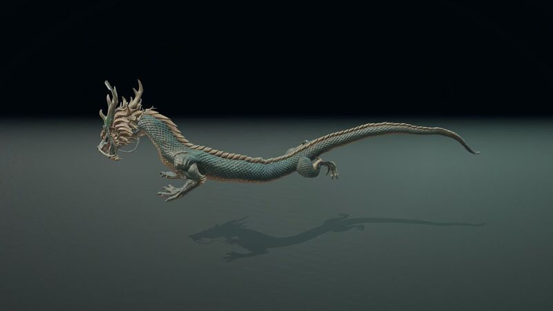
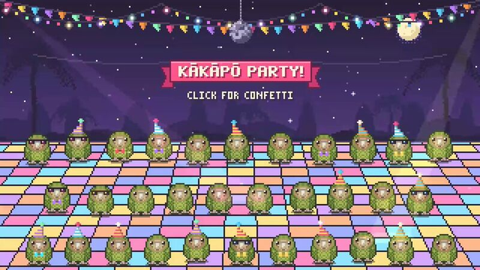
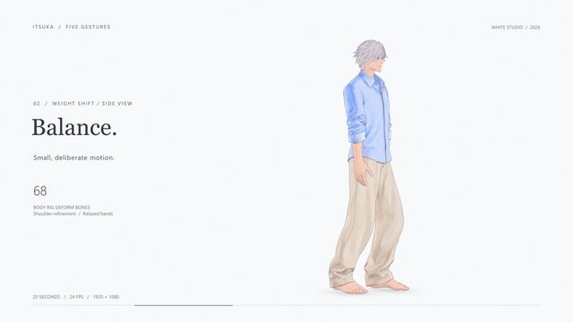
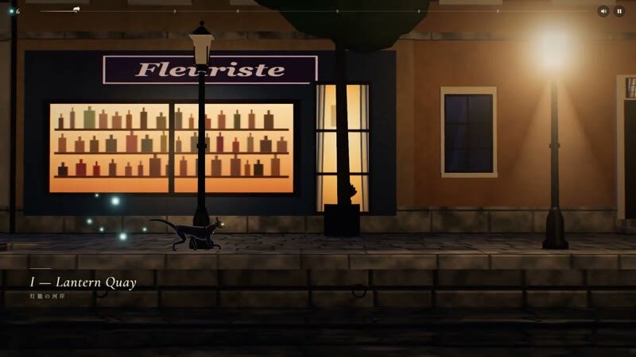
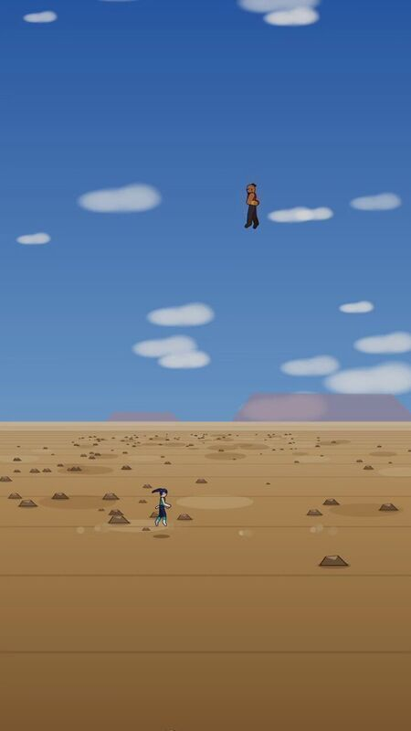
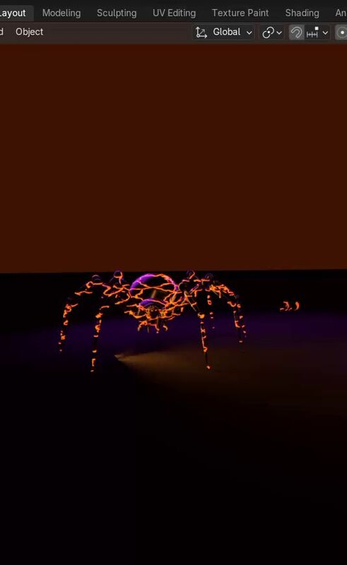

[← All categories](../README.en.md#browse)

# Pixel art & characters

15 works. Click a cover to play; works without gallery video open on X.

<table>
<tr>
<td width="25%" align="center" valign="middle"></td>
<td width="75%" valign="middle"><strong>Pip travels through twelve visual styles</strong> <a href="https://x.com/pradeepXkapoor">@pradeepXkapoor</a> · Pixel art &amp; characters 1:15 · Bookmarks 532 <a href="https://guanmo-ai.github.io/awesome-ai-motion/?lang=en#case-2103099194693271874">▶ Play</a> · <a href="../cases/2103099194693271874.en.md">Details</a> · <a href="https://x.com/pradeepXkapoor/status/2103099194693271874">Original post</a></td>
</tr>
<tr>
<td width="25%" align="center" valign="middle"></td>
<td width="75%" valign="middle"><strong>A pixel wizard casting spells</strong> <a href="https://x.com/majidmanzarpour">@majidmanzarpour</a> · Pixel art &amp; characters 0:11 · Bookmarks 2,639 <a href="https://guanmo-ai.github.io/awesome-ai-motion/?lang=en#case-2102476258948927543">▶ Play</a> · <a href="../cases/2102476258948927543.en.md">Details</a> · <a href="https://x.com/majidmanzarpour/status/2102476258948927543">Original post</a></td>
</tr>
<tr>
<td width="25%" align="center" valign="middle"></td>
<td width="75%" valign="middle"><strong>Blue-Scarf Duckling by a Peach Orchard Stream</strong> <a href="https://x.com/Zarnab_with_Ai">@Zarnab_with_Ai</a> · Pixel art &amp; characters 0:30 · Bookmarks 11 · Details pending <a href="https://guanmo-ai.github.io/awesome-ai-motion/?lang=en#case-2104397688511103374">▶ Play</a> · <a href="../cases/2104397688511103374.en.md">Details</a> · <a href="https://x.com/Zarnab_with_Ai/status/2104397688511103374">Original post</a></td>
</tr>
<tr>
<td width="25%" align="center" valign="middle"></td>
<td width="75%" valign="middle"><strong>Three Vehicles Combine into a Robot</strong> <a href="https://x.com/allforbigfire">@allforbigfire</a> · Pixel art &amp; characters 0:25 · Bookmarks 0 · Details pending <a href="https://guanmo-ai.github.io/awesome-ai-motion/?lang=en#case-2104193522715029657">▶ Play</a> · <a href="../cases/2104193522715029657.en.md">Details</a> · <a href="https://x.com/allforbigfire/status/2104193522715029657">Original post</a></td>
</tr>
<tr>
<td width="25%" align="center" valign="middle"></td>
<td width="75%" valign="middle"><strong>An AITuber Streaming and Explaining Prototype</strong> <a href="https://x.com/manaimovie">@manaimovie</a> · Pixel art &amp; characters 0:55 · Bookmarks 985 · Details pending <a href="https://guanmo-ai.github.io/awesome-ai-motion/?lang=en#case-2104008163561451923">▶ Play</a> · <a href="../cases/2104008163561451923.en.md">Details</a> · <a href="https://x.com/manaimovie/status/2104008163561451923">Original post</a></td>
</tr>
<tr>
<td width="25%" align="center" valign="middle"></td>
<td width="75%" valign="middle"><strong>Candy-Themed Character Animation</strong> <a href="https://x.com/cherry_mx_reds">@cherry_mx_reds</a> · Pixel art &amp; characters 0:30 · Bookmarks 350 · Details pending <a href="https://guanmo-ai.github.io/awesome-ai-motion/?lang=en#case-2102472218269900876">▶ Play</a> · <a href="../cases/2102472218269900876.en.md">Details</a> · <a href="https://x.com/cherry_mx_reds/status/2102472218269900876">Original post</a></td>
</tr>
<tr>
<td width="25%" align="center" valign="middle"></td>
<td width="75%" valign="middle"><strong>Nighttime Pixel Music Demo</strong> <a href="https://x.com/gandamu_ml">@gandamu_ml</a> · Pixel art &amp; characters 4:17 · Bookmarks 76 · Details pending <a href="https://guanmo-ai.github.io/awesome-ai-motion/?lang=en#case-2103116003689550013">▶ Play</a> · <a href="../cases/2103116003689550013.en.md">Details</a> · <a href="https://x.com/gandamu_ml/status/2103116003689550013">Original post</a></td>
</tr>
<tr>
<td width="25%" align="center" valign="middle"></td>
<td width="75%" valign="middle"><strong>Non-Humanoid Rigging and Animation</strong> <a href="https://x.com/BlendiByl">@BlendiByl</a> · Pixel art &amp; characters 0:10 · Bookmarks 65 · Details pending <a href="https://guanmo-ai.github.io/awesome-ai-motion/?lang=en#case-2103989270558167364">▶ Play</a> · <a href="../cases/2103989270558167364.en.md">Details</a> · <a href="https://x.com/BlendiByl/status/2103989270558167364">Original post</a></td>
</tr>
<tr>
<td width="25%" align="center" valign="middle"></td>
<td width="75%" valign="middle"><strong>Kākāpō Celebration in Pixel Art</strong> <a href="https://x.com/simonw">@simonw</a> · Pixel art &amp; characters 0:15 · Bookmarks 12 · Details pending <a href="https://guanmo-ai.github.io/awesome-ai-motion/?lang=en#case-2104002636513206422">▶ Play</a> · <a href="../cases/2104002636513206422.en.md">Details</a> · <a href="https://x.com/simonw/status/2104002636513206422">Original post</a></td>
</tr>
<tr>
<td width="25%" align="center" valign="middle"></td>
<td width="75%" valign="middle"><strong>Retro Computer Demo Scene</strong> <a href="https://x.com/cromwellian">@cromwellian</a> · Pixel art &amp; characters 2:44 · Bookmarks 1 · Details pending <a href="https://guanmo-ai.github.io/awesome-ai-motion/?lang=en#case-2103028027861152225">▶ Play</a> · <a href="../cases/2103028027861152225.en.md">Details</a> · <a href="https://x.com/cromwellian/status/2103028027861152225">Original post</a></td>
</tr>
<tr>
<td width="25%" align="center" valign="middle"></td>
<td width="75%" valign="middle"><strong>Rigging a Tripo Character with Auto-Rig Pro</strong> <a href="https://x.com/Mikami_Gugenka">@Mikami_Gugenka</a> · Pixel art &amp; characters 0:20 · Bookmarks 0 · Details pending <a href="https://guanmo-ai.github.io/awesome-ai-motion/?lang=en#case-2104773451265589544">▶ Play</a> · <a href="../cases/2104773451265589544.en.md">Details</a> · <a href="https://x.com/Mikami_Gugenka/status/2104773451265589544">Original post</a></td>
</tr>
<tr>
<td width="25%" align="center" valign="middle"></td>
<td width="75%" valign="middle"><strong>Fureha Fumu: Original Character in 3D</strong> <a href="https://x.com/Kta_Z">@Kta_Z</a> · Pixel art &amp; characters 0:23 · Bookmarks 0 · Details pending <a href="https://guanmo-ai.github.io/awesome-ai-motion/?lang=en#case-2104721373545558470">▶ Play</a> · <a href="../cases/2104721373545558470.en.md">Details</a> · <a href="https://x.com/Kta_Z/status/2104721373545558470">Original post</a></td>
</tr>
<tr>
<td width="25%" align="center" valign="middle"></td>
<td width="75%" valign="middle"><strong>CatWalk: A Black Cat by a Moonlit Canal</strong> <a href="https://x.com/blitast_studio">@blitast_studio</a> · Pixel art &amp; characters 0:36 · Bookmarks 0 · Details pending <a href="https://guanmo-ai.github.io/awesome-ai-motion/?lang=en#case-2104003920251257328">▶ Play</a> · <a href="../cases/2104003920251257328.en.md">Details</a> · <a href="https://x.com/blitast_studio/status/2104003920251257328">Original post</a></td>
</tr>
<tr>
<td width="25%" align="center" valign="middle"></td>
<td width="75%" valign="middle"><strong>A Remotion Animation Test for an Original Fighting Game</strong> <a href="https://x.com/chriscodling5">@chriscodling5</a> · Pixel art &amp; characters 0:30 · Bookmarks 0 · Details pending <a href="https://guanmo-ai.github.io/awesome-ai-motion/?lang=en#case-2104664355270992140">▶ Play</a> · <a href="../cases/2104664355270992140.en.md">Details</a> · <a href="https://x.com/chriscodling5/status/2104664355270992140">Original post</a></td>
</tr>
<tr>
<td width="25%" align="center" valign="middle"></td>
<td width="75%" valign="middle"><strong>A Blender Spider Animation Challenge</strong> <a href="https://x.com/solvXuk">@solvXuk</a> · Pixel art &amp; characters 0:43 · Bookmarks 0 · Details pending <a href="https://guanmo-ai.github.io/awesome-ai-motion/?lang=en#case-2104719112803062038">▶ Play</a> · <a href="../cases/2104719112803062038.en.md">Details</a> · <a href="https://x.com/solvXuk/status/2104719112803062038">Original post</a></td>
</tr>
</table>
