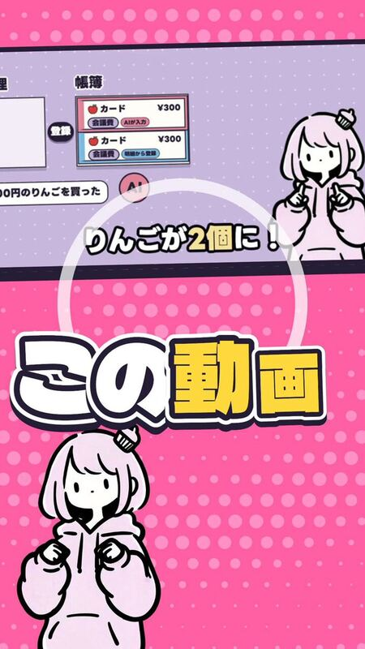
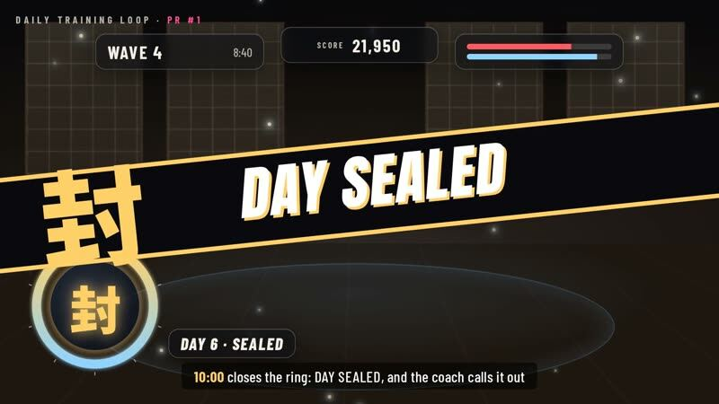

[← All categories](../README.en.md#browse)

# Pixel art & characters

85 works. Click a cover to play; works without gallery video open on X.

<table>
<tbody>
<tr>
<td width="50%" height="225" align="center" valign="middle"></td>
<td width="50%" height="225" align="center" valign="middle"></td>
</tr>
<tr>
<td width="50%" valign="top"><strong>Pip travels through twelve visual styles</strong> <a href="https://x.com/pradeepXkapoor">@pradeepXkapoor</a> · Pixel art &amp; characters 1:15 · Bookmarks 532 <a href="https://guanmo-ai.github.io/awesome-ai-motion/?lang=en#case-2103099194693271874">▶ Play</a> · <a href="https://x.com/pradeepXkapoor/status/2103099194693271874">Original post</a></td>
<td width="50%" valign="top"><strong>A pixel wizard casting spells</strong> <a href="https://x.com/majidmanzarpour">@majidmanzarpour</a> · Pixel art &amp; characters 0:11 · Bookmarks 2,639 <a href="https://guanmo-ai.github.io/awesome-ai-motion/?lang=en#case-2102476258948927543">▶ Play</a> · <a href="https://x.com/majidmanzarpour/status/2102476258948927543">Original post</a></td>
</tr>
</tbody>
<tbody>
<tr>
<td width="50%" height="225" align="center" valign="middle"></td>
<td width="50%" height="225" align="center" valign="middle"></td>
</tr>
<tr>
<td width="50%" valign="top"><strong>A tea-drinking character beside ukiyo-e waves</strong> <a href="https://x.com/cherry_mx_reds">@cherry_mx_reds</a> · Pixel art &amp; characters 0:17 · Bookmarks 457 · Details pending <a href="https://guanmo-ai.github.io/awesome-ai-motion/?lang=en#case-2105816670896009224">▶ Play</a> · <a href="https://x.com/cherry_mx_reds/status/2105816670896009224">Original post</a></td>
<td width="50%" valign="top"><strong>Haiku and Luna Animate a Cycling Pelican</strong> <a href="https://x.com/xueyu1125">@xueyu1125</a> · Pixel art &amp; characters 0:17 · Bookmarks 13 · Details pending <a href="https://guanmo-ai.github.io/awesome-ai-motion/?lang=en#case-2108082476975554587">▶ Play</a> · <a href="https://x.com/xueyu1125/status/2108082476975554587">Original post</a></td>
</tr>
</tbody>
<tbody>
<tr>
<td width="50%" height="225" align="center" valign="middle"></td>
<td width="50%" height="225" align="center" valign="middle"></td>
</tr>
<tr>
<td width="50%" valign="top"><strong>Blue-Scarf Duckling by a Peach Orchard Stream</strong> <a href="https://x.com/Zarnab_with_Ai">@Zarnab_with_Ai</a> · Pixel art &amp; characters 0:30 · Bookmarks 11 · Details pending <a href="https://guanmo-ai.github.io/awesome-ai-motion/?lang=en#case-2104397688511103374">▶ Play</a> · <a href="https://x.com/Zarnab_with_Ai/status/2104397688511103374">Original post</a></td>
<td width="50%" valign="top"><strong>ASHEN FRONTIER: a wasteland side-scroller</strong> <a href="https://x.com/jiangjiangling">@jiangjiangling</a> · Pixel art &amp; characters 0:30 · Bookmarks 2 · Details pending <a href="https://guanmo-ai.github.io/awesome-ai-motion/?lang=en#case-2107399895011434935">▶ Play</a> · <a href="https://x.com/jiangjiangling/status/2107399895011434935">Original post</a></td>
</tr>
</tbody>
<tbody>
<tr>
<td width="50%" height="225" align="center" valign="middle"></td>
<td width="50%" height="225" align="center" valign="middle"></td>
</tr>
<tr>
<td width="50%" valign="top"><strong>Four Chibi Characters in a Fixed-camera Scene</strong> <a href="https://x.com/mitsukikaname00">@mitsukikaname00</a> · Pixel art &amp; characters 0:12 · Bookmarks 0 · Details pending <a href="https://guanmo-ai.github.io/awesome-ai-motion/?lang=en#case-2108148813386883293">▶ Play</a> · <a href="https://x.com/mitsukikaname00/status/2108148813386883293">Original post</a></td>
<td width="50%" valign="top"><strong>Three Vehicles Combine into a Robot</strong> <a href="https://x.com/allforbigfire">@allforbigfire</a> · Pixel art &amp; characters 0:25 · Bookmarks 0 · Details pending <a href="https://guanmo-ai.github.io/awesome-ai-motion/?lang=en#case-2104193522715029657">▶ Play</a> · <a href="https://x.com/allforbigfire/status/2104193522715029657">Original post</a></td>
</tr>
</tbody>
<tbody>
<tr>
<td width="50%" height="225" align="center" valign="middle"></td>
<td width="50%" height="225" align="center" valign="middle"></td>
</tr>
<tr>
<td width="50%" valign="top"><strong>Rounded characters animated in Blender</strong> <a href="https://x.com/JaydenDavisNC">@JaydenDavisNC</a> · Pixel art &amp; characters 0:17 · Bookmarks 1,356 · Details pending <a href="https://guanmo-ai.github.io/awesome-ai-motion/?lang=en#case-2107086714820870617">▶ Play</a> · <a href="https://x.com/JaydenDavisNC/status/2107086714820870617">Original post</a></td>
<td width="50%" valign="top"><strong>Superman across changing art styles</strong> <a href="https://x.com/chetaslua">@chetaslua</a> · Pixel art &amp; characters 0:40 · Bookmarks 1,278 · Details pending <a href="https://guanmo-ai.github.io/awesome-ai-motion/?lang=en#case-2105757136219504862">▶ Play</a> · <a href="https://x.com/chetaslua/status/2105757136219504862">Original post</a></td>
</tr>
</tbody>
<tbody>
<tr>
<td width="50%" height="225" align="center" valign="middle"></td>
<td width="50%" height="225" align="center" valign="middle"></td>
</tr>
<tr>
<td width="50%" valign="top"><strong>A red dot’s small woodland adventure</strong> <a href="https://x.com/cherry_mx_reds">@cherry_mx_reds</a> · Pixel art &amp; characters 0:15 · Bookmarks 1,072 · Details pending <a href="https://guanmo-ai.github.io/awesome-ai-motion/?lang=en#case-2105825930799432073">▶ Play</a> · <a href="https://x.com/cherry_mx_reds/status/2105825930799432073">Original post</a></td>
<td width="50%" valign="top"><strong>An AITuber Streaming and Explaining Prototype</strong> <a href="https://x.com/manaimovie">@manaimovie</a> · Pixel art &amp; characters 0:55 · Bookmarks 985 · Details pending <a href="https://guanmo-ai.github.io/awesome-ai-motion/?lang=en#case-2104008163561451923">▶ Play</a> · <a href="https://x.com/manaimovie/status/2104008163561451923">Original post</a></td>
</tr>
</tbody>
<tbody>
<tr>
<td width="50%" height="225" align="center" valign="middle"></td>
<td width="50%" height="225" align="center" valign="middle"></td>
</tr>
<tr>
<td width="50%" valign="top"><strong>Two approaches to building a 3D avatar</strong> <a href="https://x.com/lnkiai">@lnkiai</a> · Pixel art &amp; characters 0:11 · Bookmarks 549 · Details pending <a href="https://guanmo-ai.github.io/awesome-ai-motion/?lang=en#case-2107399371121930610">▶ Play</a> · <a href="https://x.com/lnkiai/status/2107399371121930610">Original post</a></td>
<td width="50%" valign="top"><strong>From Two Illustrations to a Streaming 3D Avatar</strong> <a href="https://x.com/kokushing">@kokushing</a> · Pixel art &amp; characters 1:15 · Bookmarks 388 · Details pending <a href="https://guanmo-ai.github.io/awesome-ai-motion/?lang=en#case-2107634512226058434">▶ Play</a> · <a href="https://x.com/kokushing/status/2107634512226058434">Original post</a></td>
</tr>
</tbody>
<tbody>
<tr>
<td width="50%" height="225" align="center" valign="middle"></td>
<td width="50%" height="225" align="center" valign="middle"></td>
</tr>
<tr>
<td width="50%" valign="top"><strong>Candy-Themed Character Animation</strong> <a href="https://x.com/cherry_mx_reds">@cherry_mx_reds</a> · Pixel art &amp; characters 0:30 · Bookmarks 350 · Details pending <a href="https://guanmo-ai.github.io/awesome-ai-motion/?lang=en#case-2102472218269900876">▶ Play</a> · <a href="https://x.com/cherry_mx_reds/status/2102472218269900876">Original post</a></td>
<td width="50%" valign="top"><strong>A model self-portrait in a floating voxel world</strong> <a href="https://x.com/blueemi99">@blueemi99</a> · Pixel art &amp; characters 0:26 · Bookmarks 213 · Details pending <a href="https://guanmo-ai.github.io/awesome-ai-motion/?lang=en#case-2105804692811137242">▶ Play</a> · <a href="https://x.com/blueemi99/status/2105804692811137242">Original post</a></td>
</tr>
</tbody>
<tbody>
<tr>
<td width="50%" height="225" align="center" valign="middle"></td>
<td width="50%" height="225" align="center" valign="middle"></td>
</tr>
<tr>
<td width="50%" valign="top"><strong>Nighttime Pixel Music Demo</strong> <a href="https://x.com/gandamu_ml">@gandamu_ml</a> · Pixel art &amp; characters 4:17 · Bookmarks 76 · Details pending <a href="https://guanmo-ai.github.io/awesome-ai-motion/?lang=en#case-2103116003689550013">▶ Play</a> · <a href="https://x.com/gandamu_ml/status/2103116003689550013">Original post</a></td>
<td width="50%" valign="top"><strong>Pip and Pickle character short</strong> <a href="https://x.com/Dustfinger2077">@Dustfinger2077</a> · Pixel art &amp; characters 1:36 · Bookmarks 74 · Details pending <a href="https://guanmo-ai.github.io/awesome-ai-motion/?lang=en#case-2107556246706635261">▶ Play</a> · <a href="https://x.com/Dustfinger2077/status/2107556246706635261">Original post</a></td>
</tr>
</tbody>
<tbody>
<tr>
<td width="50%" height="225" align="center" valign="middle"></td>
<td width="50%" height="225" align="center" valign="middle"></td>
</tr>
<tr>
<td width="50%" valign="top"><strong>Non-Humanoid Rigging and Animation</strong> <a href="https://x.com/BlendiByl">@BlendiByl</a> · Pixel art &amp; characters 0:10 · Bookmarks 65 · Details pending <a href="https://guanmo-ai.github.io/awesome-ai-motion/?lang=en#case-2103989270558167364">▶ Play</a> · <a href="https://x.com/BlendiByl/status/2103989270558167364">Original post</a></td>
<td width="50%" valign="top"><strong>Hunt A Squishy: a Roblox collecting game</strong> <a href="https://x.com/minchoi">@minchoi</a> · Pixel art &amp; characters 1:25 · Bookmarks 62 · Details pending <a href="https://guanmo-ai.github.io/awesome-ai-motion/?lang=en#case-2106114830780223567">▶ Play</a> · <a href="https://x.com/minchoi/status/2106114830780223567">Original post</a></td>
</tr>
</tbody>
<tbody>
<tr>
<td width="50%" height="225" align="center" valign="middle"></td>
<td width="50%" height="225" align="center" valign="middle"></td>
</tr>
<tr>
<td width="50%" valign="top"><strong>Four Models Make a Jelly Animation</strong> <a href="https://x.com/ann_nnng">@ann_nnng</a> · Pixel art &amp; characters 0:16 · Bookmarks 59 · Details pending <a href="https://guanmo-ai.github.io/awesome-ai-motion/?lang=en#case-2107703620070428946">▶ Play</a> · <a href="https://x.com/ann_nnng/status/2107703620070428946">Original post</a></td>
<td width="50%" valign="top"><strong>Two Models Animate a Running SVG Cow</strong> <a href="https://x.com/GKev1n">@GKev1n</a> · Pixel art &amp; characters 0:18 · Bookmarks 58 · Details pending <a href="https://guanmo-ai.github.io/awesome-ai-motion/?lang=en#case-2107611576543093088">▶ Play</a> · <a href="https://x.com/GKev1n/status/2107611576543093088">Original post</a></td>
</tr>
</tbody>
<tbody>
<tr>
<td width="50%" height="225" align="center" valign="middle"></td>
<td width="50%" height="225" align="center" valign="middle"></td>
</tr>
<tr>
<td width="50%" valign="top"><strong>A Running Chicken with Four Fried Legs</strong> <a href="https://x.com/whydeso">@whydeso</a> · Pixel art &amp; characters 0:17 · Bookmarks 52 · Details pending <a href="https://guanmo-ai.github.io/awesome-ai-motion/?lang=en#case-2107754210746134748">▶ Play</a> · <a href="https://x.com/whydeso/status/2107754210746134748">Original post</a></td>
<td width="50%" valign="top"><strong>A Seedance Cartoon Episode Experiment</strong> <a href="https://x.com/mrdejie">@mrdejie</a> · Pixel art &amp; characters 1:36 · Bookmarks 46 · Details pending <a href="https://guanmo-ai.github.io/awesome-ai-motion/?lang=en#case-2108425981283414483">▶ Play</a> · <a href="https://x.com/mrdejie/status/2108425981283414483">Original post</a></td>
</tr>
</tbody>
<tbody>
<tr>
<td width="50%" height="225" align="center" valign="middle"></td>
<td width="50%" height="225" align="center" valign="middle"></td>
</tr>
<tr>
<td width="50%" valign="top"><strong>Walking and Howling on the Same Wolf Mesh</strong> <a href="https://x.com/maxt3chno">@maxt3chno</a> · Pixel art &amp; characters 0:27 · Bookmarks 20 · Details pending <a href="https://guanmo-ai.github.io/awesome-ai-motion/?lang=en#case-2108319151127175422">▶ Play</a> · <a href="https://x.com/maxt3chno/status/2108319151127175422">Original post</a></td>
<td width="50%" valign="top"><strong>A beat-driven pixel character short</strong> <a href="https://x.com/gkxspace">@gkxspace</a> · Pixel art &amp; characters 0:27 · Bookmarks 13 · Details pending <a href="https://guanmo-ai.github.io/awesome-ai-motion/?lang=en#case-2106402474676588632">▶ Play</a> · <a href="https://x.com/gkxspace/status/2106402474676588632">Original post</a></td>
</tr>
</tbody>
<tbody>
<tr>
<td width="50%" height="225" align="center" valign="middle"></td>
<td width="50%" height="225" align="center" valign="middle"></td>
</tr>
<tr>
<td width="50%" valign="top"><strong>Kākāpō Celebration in Pixel Art</strong> <a href="https://x.com/simonw">@simonw</a> · Pixel art &amp; characters 0:15 · Bookmarks 12 · Details pending <a href="https://guanmo-ai.github.io/awesome-ai-motion/?lang=en#case-2104002636513206422">▶ Play</a> · <a href="https://x.com/simonw/status/2104002636513206422">Original post</a></td>
<td width="50%" valign="top"><strong>A Meme-and-animation-style Test</strong> <a href="https://x.com/guylookaround">@guylookaround</a> · Pixel art &amp; characters 0:20 · Bookmarks 12 · Details pending <a href="https://guanmo-ai.github.io/awesome-ai-motion/?lang=en#case-2108267374944403569">▶ Play</a> · <a href="https://x.com/guylookaround/status/2108267374944403569">Original post</a></td>
</tr>
</tbody>
<tbody>
<tr>
<td width="50%" height="225" align="center" valign="middle"></td>
<td width="50%" height="225" align="center" valign="middle"></td>
</tr>
<tr>
<td width="50%" valign="top"><strong>Minecraft voxel characters: a model comparison</strong> <a href="https://x.com/TOPSTR1X">@TOPSTR1X</a> · Pixel art &amp; characters 0:15 · Bookmarks 11 · Details pending <a href="https://guanmo-ai.github.io/awesome-ai-motion/?lang=en#case-2105839618872738138">▶ Play</a> · <a href="https://x.com/TOPSTR1X/status/2105839618872738138">Original post</a></td>
<td width="50%" valign="top"><strong>A Dialogue Short with Claude and Doubao Characters</strong> <a href="https://x.com/eternityspring">@eternityspring</a> · Pixel art &amp; characters 0:15 · Bookmarks 11 · Details pending <a href="https://guanmo-ai.github.io/awesome-ai-motion/?lang=en#case-2107746012739809302">▶ Play</a> · <a href="https://x.com/eternityspring/status/2107746012739809302">Original post</a></td>
</tr>
</tbody>
<tbody>
<tr>
<td width="50%" height="225" align="center" valign="middle"></td>
<td width="50%" height="225" align="center" valign="middle"></td>
</tr>
<tr>
<td width="50%" valign="top"><strong>A single illustration becomes a conversational avatar</strong> <a href="https://x.com/shinshin86">@shinshin86</a> · Pixel art &amp; characters 0:10 · Bookmarks 7 · Details pending <a href="https://guanmo-ai.github.io/awesome-ai-motion/?lang=en#case-2105556318132310361">▶ Play</a> · <a href="https://x.com/shinshin86/status/2105556318132310361">Original post</a></td>
<td width="50%" valign="top"><strong>Dance models compared with one depth reference</strong> <a href="https://x.com/ZetoGroovin">@ZetoGroovin</a> · Pixel art &amp; characters 0:16 · Bookmarks 7 · Details pending <a href="https://guanmo-ai.github.io/awesome-ai-motion/?lang=en#case-2107603054556221828">▶ Play</a> · <a href="https://x.com/ZetoGroovin/status/2107603054556221828">Original post</a></td>
</tr>
</tbody>
<tbody>
<tr>
<td width="50%" height="225" align="center" valign="middle"></td>
<td width="50%" height="225" align="center" valign="middle"></td>
</tr>
<tr>
<td width="50%" valign="top"><strong>A Mascot Vector-rig Animation Panel</strong> <a href="https://x.com/okooo5km">@okooo5km</a> · Pixel art &amp; characters 0:21 · Bookmarks 7 · Details pending <a href="https://guanmo-ai.github.io/awesome-ai-motion/?lang=en#case-2107738086079909920">▶ Play</a> · <a href="https://x.com/okooo5km/status/2107738086079909920">Original post</a></td>
<td width="50%" valign="top"><strong>AI-assisted Renders of Xiao Qiao Game Assets</strong> <a href="https://x.com/baoweiheihei">@baoweiheihei</a> · Pixel art &amp; characters 0:10 · Bookmarks 3 · Details pending <a href="https://guanmo-ai.github.io/awesome-ai-motion/?lang=en#case-2108099981034832007">▶ Play</a> · <a href="https://x.com/baoweiheihei/status/2108099981034832007">Original post</a></td>
</tr>
</tbody>
<tbody>
<tr>
<td width="50%" height="225" align="center" valign="middle"></td>
<td width="50%" height="225" align="center" valign="middle"></td>
</tr>
<tr>
<td width="50%" valign="top"><strong>A Godot remake experiment for a DOS game</strong> <a href="https://x.com/Graalitoo">@Graalitoo</a> · Pixel art &amp; characters 0:53 · Bookmarks 2 · Details pending <a href="https://guanmo-ai.github.io/awesome-ai-motion/?lang=en#case-2106684010181337136">▶ Play</a> · <a href="https://x.com/Graalitoo/status/2106684010181337136">Original post</a></td>
<td width="50%" valign="top"><strong>A Locally Generated Character-dialogue Test</strong> <a href="https://x.com/jun1228909">@jun1228909</a> · Pixel art &amp; characters 0:08 · Bookmarks 2 · Details pending <a href="https://guanmo-ai.github.io/awesome-ai-motion/?lang=en#case-2108396701656768644">▶ Play</a> · <a href="https://x.com/jun1228909/status/2108396701656768644">Original post</a></td>
</tr>
</tbody>
<tbody>
<tr>
<td width="50%" height="225" align="center" valign="middle"></td>
<td width="50%" height="225" align="center" valign="middle"></td>
</tr>
<tr>
<td width="50%" valign="top"><strong>1 Sport a Day: a Judo Character Short</strong> <a href="https://x.com/Dyyaiworker">@Dyyaiworker</a> · Pixel art &amp; characters 0:23 · Bookmarks 1 · Details pending <a href="https://guanmo-ai.github.io/awesome-ai-motion/?lang=en#case-2108200876175495171">▶ Play</a> · <a href="https://x.com/Dyyaiworker/status/2108200876175495171">Original post</a></td>
<td width="50%" valign="top"><strong>Luminous Gatekeeper: a Fictional VTuber Clip</strong> <a href="https://x.com/sacher10610">@sacher10610</a> · Pixel art &amp; characters 0:45 · Bookmarks 1 · Details pending <a href="https://guanmo-ai.github.io/awesome-ai-motion/?lang=en#case-2107621936561823818">▶ Play</a> · <a href="https://x.com/sacher10610/status/2107621936561823818">Original post</a></td>
</tr>
</tbody>
<tbody>
<tr>
<td width="50%" height="225" align="center" valign="middle"></td>
<td width="50%" height="225" align="center" valign="middle"></td>
</tr>
<tr>
<td width="50%" valign="top"><strong>Retro Computer Demo Scene</strong> <a href="https://x.com/cromwellian">@cromwellian</a> · Pixel art &amp; characters 2:44 · Bookmarks 1 · Details pending <a href="https://guanmo-ai.github.io/awesome-ai-motion/?lang=en#case-2103028027861152225">▶ Play</a> · <a href="https://x.com/cromwellian/status/2103028027861152225">Original post</a></td>
<td width="50%" valign="top"><strong>Three Emotions in One Continuous Take</strong> <a href="https://x.com/azed_ai">@azed_ai</a> · Pixel art &amp; characters 0:20 · Bookmarks 1 · Details pending <a href="https://guanmo-ai.github.io/awesome-ai-motion/?lang=en#case-2108924733588906180">▶ Play</a> · <a href="https://x.com/azed_ai/status/2108924733588906180">Original post</a></td>
</tr>
</tbody>
<tbody>
<tr>
<td width="50%" height="225" align="center" valign="middle"></td>
<td width="50%" height="225" align="center" valign="middle"></td>
</tr>
<tr>
<td width="50%" valign="top"><strong>An Opus Blender Character-animation Test</strong> <a href="https://x.com/DaraChaww">@DaraChaww</a> · Pixel art &amp; characters 0:20 · Bookmarks 1 · Details pending <a href="https://guanmo-ai.github.io/awesome-ai-motion/?lang=en#case-2108306366771413034">▶ Play</a> · <a href="https://x.com/DaraChaww/status/2108306366771413034">Original post</a></td>
<td width="50%" valign="top"><strong>A Knight-cat Short</strong> <a href="https://x.com/yesand_ai">@yesand_ai</a> · Pixel art &amp; characters 0:24 · Bookmarks 1 · Details pending <a href="https://guanmo-ai.github.io/awesome-ai-motion/?lang=en#case-2108359012328849486">▶ Play</a> · <a href="https://x.com/yesand_ai/status/2108359012328849486">Original post</a></td>
</tr>
</tbody>
<tbody>
<tr>
<td width="50%" height="225" align="center" valign="middle"></td>
<td width="50%" height="225" align="center" valign="middle"></td>
</tr>
<tr>
<td width="50%" valign="top"><strong>A Claude Code mascot character short</strong> <a href="https://x.com/rishit30g">@rishit30g</a> · Pixel art &amp; characters 0:10 · Bookmarks 1 <a href="https://guanmo-ai.github.io/awesome-ai-motion/?lang=en#case-2106061225851568278">▶ Play</a> · <a href="https://x.com/rishit30g/status/2106061225851568278">Original post</a></td>
<td width="50%" valign="top"><strong>Inkrunner: paint a path to the finish</strong> <a href="https://x.com/cryptowluha">@cryptowluha</a> · Pixel art &amp; characters 0:27 · Bookmarks 1 · Details pending <a href="https://guanmo-ai.github.io/awesome-ai-motion/?lang=en#case-2106743642668875913">▶ Play</a> · <a href="https://x.com/cryptowluha/status/2106743642668875913">Original post</a></td>
</tr>
</tbody>
<tbody>
<tr>
<td width="50%" height="225" align="center" valign="middle"></td>
<td width="50%" height="225" align="center" valign="middle"></td>
</tr>
<tr>
<td width="50%" valign="top"><strong>A Neon Shadows Character Outfit-turn Test</strong> <a href="https://x.com/JaviRandomXI">@JaviRandomXI</a> · Pixel art &amp; characters 0:05 · Bookmarks 1 · Details pending <a href="https://guanmo-ai.github.io/awesome-ai-motion/?lang=en#case-2107541364841820482">▶ Play</a> · <a href="https://x.com/JaviRandomXI/status/2107541364841820482">Original post</a></td>
<td width="50%" valign="top"><strong>Chuka’s Overhead Outfit Animation</strong> <a href="https://x.com/shellys_arts">@shellys_arts</a> · Pixel art &amp; characters 0:19 · Bookmarks 1 · Details pending <a href="https://guanmo-ai.github.io/awesome-ai-motion/?lang=en#case-2108920625972891677">▶ Play</a> · <a href="https://x.com/shellys_arts/status/2108920625972891677">Original post</a></td>
</tr>
</tbody>
<tbody>
<tr>
<td width="50%" height="225" align="center" valign="middle"></td>
<td width="50%" height="225" align="center" valign="middle"></td>
</tr>
<tr>
<td width="50%" valign="top"><strong>Four gacha-style model-character animations</strong> <a href="https://x.com/nelvOfficial">@nelvOfficial</a> · Pixel art &amp; characters 0:32 · Bookmarks 1 · Details pending <a href="https://guanmo-ai.github.io/awesome-ai-motion/?lang=en#case-2106063780891459846">▶ Play</a> · <a href="https://x.com/nelvOfficial/status/2106063780891459846">Original post</a></td>
<td width="50%" valign="top"><strong>A Martial-arts Test from One Character Reference</strong> <a href="https://x.com/previsha03">@previsha03</a> · Pixel art &amp; characters 0:28 · Bookmarks 1 · Details pending <a href="https://guanmo-ai.github.io/awesome-ai-motion/?lang=en#case-2108132243059212341">▶ Play</a> · <a href="https://x.com/previsha03/status/2108132243059212341">Original post</a></td>
</tr>
</tbody>
<tbody>
<tr>
<td width="50%" height="225" align="center" valign="middle"></td>
<td width="50%" height="225" align="center" valign="middle"></td>
</tr>
<tr>
<td width="50%" valign="top"><strong>A Kusao Prefecture Animation Spin-off</strong> <a href="https://x.com/santome_yontome">@santome_yontome</a> · Pixel art &amp; characters 2:37 · Bookmarks 0 · Details pending <a href="https://guanmo-ai.github.io/awesome-ai-motion/?lang=en#case-2108482607994331428">▶ Play</a> · <a href="https://x.com/santome_yontome/status/2108482607994331428">Original post</a></td>
<td width="50%" valign="top"><strong>A character short with generated voice and effects</strong> <a href="https://x.com/ayumi_t820">@ayumi_t820</a> · Pixel art &amp; characters 0:12 · Bookmarks 0 <a href="https://guanmo-ai.github.io/awesome-ai-motion/?lang=en#case-2104807505297871023">▶ Play</a> · <a href="https://x.com/ayumi_t820/status/2104807505297871023">Original post</a></td>
</tr>
</tbody>
<tbody>
<tr>
<td width="50%" height="225" align="center" valign="middle"></td>
<td width="50%" height="225" align="center" valign="middle"></td>
</tr>
<tr>
<td width="50%" valign="top"><strong>Artemissia Walking Animation Test</strong> <a href="https://x.com/ArtByArtemissia">@ArtByArtemissia</a> · Pixel art &amp; characters 0:10 · Bookmarks 0 · Details pending <a href="https://guanmo-ai.github.io/awesome-ai-motion/?lang=en#case-2107911008391950525">▶ Play</a> · <a href="https://x.com/ArtByArtemissia/status/2107911008391950525">Original post</a></td>
<td width="50%" valign="top"><strong>A Continuous Multi-enemy Swordfight Test</strong> <a href="https://x.com/challenger_ND">@challenger_ND</a> · Pixel art &amp; characters 0:15 · Bookmarks 0 · Details pending <a href="https://guanmo-ai.github.io/awesome-ai-motion/?lang=en#case-2108185991748153475">▶ Play</a> · <a href="https://x.com/challenger_ND/status/2108185991748153475">Original post</a></td>
</tr>
</tbody>
<tbody>
<tr>
<td width="50%" height="225" align="center" valign="middle"></td>
<td width="50%" height="225" align="center" valign="middle"></td>
</tr>
<tr>
<td width="50%" valign="top"><strong>Eight-bit explorations for Creator Shop</strong> <a href="https://x.com/austinskhosana_">@austinskhosana_</a> · Pixel art &amp; characters 0:06 · Bookmarks 0 · Details pending <a href="https://guanmo-ai.github.io/awesome-ai-motion/?lang=en#case-2107457994208190801">▶ Play</a> · <a href="https://x.com/austinskhosana_/status/2107457994208190801">Original post</a></td>
<td width="50%" valign="top"><strong>Rigging a Tripo Character with Auto-Rig Pro</strong> <a href="https://x.com/Mikami_Gugenka">@Mikami_Gugenka</a> · Pixel art &amp; characters 0:20 · Bookmarks 0 · Details pending <a href="https://guanmo-ai.github.io/awesome-ai-motion/?lang=en#case-2104773451265589544">▶ Play</a> · <a href="https://x.com/Mikami_Gugenka/status/2104773451265589544">Original post</a></td>
</tr>
</tbody>
<tbody>
<tr>
<td width="50%" height="225" align="center" valign="middle"></td>
<td width="50%" height="225" align="center" valign="middle"></td>
</tr>
<tr>
<td width="50%" valign="top"><strong>Jump Rope vs. the Cancan</strong> <a href="https://x.com/koldo2k">@koldo2k</a> · Pixel art &amp; characters 0:40 · Bookmarks 0 · Details pending <a href="https://guanmo-ai.github.io/awesome-ai-motion/?lang=en#case-2105229630139502795">▶ Play</a> · <a href="https://x.com/koldo2k/status/2105229630139502795">Original post</a></td>
<td width="50%" valign="top"><strong>Class 2-B’s Crepe Stand: a School-festival Animation</strong> <a href="https://x.com/taketori_ai">@taketori_ai</a> · Pixel art &amp; characters 0:15 · Bookmarks 0 · Details pending <a href="https://guanmo-ai.github.io/awesome-ai-motion/?lang=en#case-2108521753517621550">▶ Play</a> · <a href="https://x.com/taketori_ai/status/2108521753517621550">Original post</a></td>
</tr>
</tbody>
<tbody>
<tr>
<td width="50%" height="225" align="center" valign="middle"></td>
<td width="50%" height="225" align="center" valign="middle"></td>
</tr>
<tr>
<td width="50%" valign="top"><strong>Five Low-poly Animal Motion Assets</strong> <a href="https://x.com/ClzNickz">@ClzNickz</a> · Pixel art &amp; characters 0:23 · Bookmarks 0 · Details pending <a href="https://guanmo-ai.github.io/awesome-ai-motion/?lang=en#case-2108308051933757765">▶ Play</a> · <a href="https://x.com/ClzNickz/status/2108308051933757765">Original post</a></td>
<td width="50%" valign="top"><strong>A Robot Short Referencing Another Creator's Style</strong> <a href="https://x.com/Levi_D_Ackerman">@Levi_D_Ackerman</a> · Pixel art &amp; characters 0:54 · Bookmarks 0 · Details pending <a href="https://guanmo-ai.github.io/awesome-ai-motion/?lang=en#case-2107805574159290789">▶ Play</a> · <a href="https://x.com/Levi_D_Ackerman/status/2107805574159290789">Original post</a></td>
</tr>
</tbody>
<tbody>
<tr>
<td width="50%" height="225" align="center" valign="middle"></td>
<td width="50%" height="225" align="center" valign="middle"></td>
</tr>
<tr>
<td width="50%" valign="top"><strong>Three animated game-concept experiments</strong> <a href="https://x.com/KenjiPhang">@KenjiPhang</a> · Pixel art &amp; characters 0:24 · Bookmarks 0 <a href="https://guanmo-ai.github.io/awesome-ai-motion/?lang=en#case-2103859812123750512">▶ Play</a> · <a href="https://x.com/KenjiPhang/status/2103859812123750512">Original post</a></td>
<td width="50%" valign="top"><strong>Fureha Fumu: Original Character in 3D</strong> <a href="https://x.com/Kta_Z">@Kta_Z</a> · Pixel art &amp; characters 0:23 · Bookmarks 0 · Details pending <a href="https://guanmo-ai.github.io/awesome-ai-motion/?lang=en#case-2104721373545558470">▶ Play</a> · <a href="https://x.com/Kta_Z/status/2104721373545558470">Original post</a></td>
</tr>
</tbody>
<tbody>
<tr>
<td width="50%" height="225" align="center" valign="middle"></td>
<td width="50%" height="225" align="center" valign="middle"></td>
</tr>
<tr>
<td width="50%" valign="top"><strong>OmaCRT: Pixel Walking from Joint Curves</strong> <a href="https://x.com/stefanomainardi">@stefanomainardi</a> · Pixel art &amp; characters 0:44 · Bookmarks 0 · Details pending <a href="https://guanmo-ai.github.io/awesome-ai-motion/?lang=en#case-2105187523630944530">▶ Play</a> · <a href="https://x.com/stefanomainardi/status/2105187523630944530">Original post</a></td>
<td width="50%" valign="top"><strong>A cozy animation from a personal drawing</strong> <a href="https://x.com/opusultra">@opusultra</a> · Pixel art &amp; characters 0:12 · Bookmarks 0 · Details pending <a href="https://guanmo-ai.github.io/awesome-ai-motion/?lang=en#case-2107235777029476636">▶ Play</a> · <a href="https://x.com/opusultra/status/2107235777029476636">Original post</a></td>
</tr>
</tbody>
<tbody>
<tr>
<td width="50%" height="225" align="center" valign="middle"></td>
<td width="50%" height="225" align="center" valign="middle"></td>
</tr>
<tr>
<td width="50%" valign="top"><strong>A Character Shot among Balloons</strong> <a href="https://x.com/AnduArtist">@AnduArtist</a> · Pixel art &amp; characters 0:23 · Bookmarks 0 · Details pending <a href="https://guanmo-ai.github.io/awesome-ai-motion/?lang=en#case-2108222329461367216">▶ Play</a> · <a href="https://x.com/AnduArtist/status/2108222329461367216">Original post</a></td>
<td width="50%" valign="top"><strong>An Unsuccessful Anime-dialogue Style Test</strong> <a href="https://x.com/EthanStryhaus">@EthanStryhaus</a> · Pixel art &amp; characters 1:20 · Bookmarks 0 · Details pending <a href="https://guanmo-ai.github.io/awesome-ai-motion/?lang=en#case-2108329897563160663">▶ Play</a> · <a href="https://x.com/EthanStryhaus/status/2108329897563160663">Original post</a></td>
</tr>
</tbody>
<tbody>
<tr>
<td width="50%" height="225" align="center" valign="middle"></td>
<td width="50%" height="225" align="center" valign="middle"></td>
</tr>
<tr>
<td width="50%" valign="top"><strong>A Shop Character Blinks, Waves and Bows</strong> <a href="https://x.com/tennisosaka">@tennisosaka</a> · Pixel art &amp; characters 0:10 · Bookmarks 0 · Details pending <a href="https://guanmo-ai.github.io/awesome-ai-motion/?lang=en#case-2108331203711619114">▶ Play</a> · <a href="https://x.com/tennisosaka/status/2108331203711619114">Original post</a></td>
<td width="50%" valign="top"><strong>Japanese Cel Animation at a City Window</strong> <a href="https://x.com/pablogori392947">@pablogori392947</a> · Pixel art &amp; characters 0:23 · Bookmarks 0 · Details pending <a href="https://guanmo-ai.github.io/awesome-ai-motion/?lang=en#case-2108474913204117546">▶ Play</a> · <a href="https://x.com/pablogori392947/status/2108474913204117546">Original post</a></td>
</tr>
</tbody>
<tbody>
<tr>
<td width="50%" height="225" align="center" valign="middle"></td>
<td width="50%" height="225" align="center" valign="middle"></td>
</tr>
<tr>
<td width="50%" valign="top"><strong>A Western Character and Landscape Study</strong> <a href="https://x.com/luqmanedits">@luqmanedits</a> · Pixel art &amp; characters 0:17 · Bookmarks 0 · Details pending <a href="https://guanmo-ai.github.io/awesome-ai-motion/?lang=en#case-2108476552057172312">▶ Play</a> · <a href="https://x.com/luqmanedits/status/2108476552057172312">Original post</a></td>
<td width="50%" valign="top"><strong>CatWalk: A Black Cat by a Moonlit Canal</strong> <a href="https://x.com/blitast_studio">@blitast_studio</a> · Pixel art &amp; characters 0:36 · Bookmarks 0 · Details pending <a href="https://guanmo-ai.github.io/awesome-ai-motion/?lang=en#case-2104003920251257328">▶ Play</a> · <a href="https://x.com/blitast_studio/status/2104003920251257328">Original post</a></td>
</tr>
</tbody>
<tbody>
<tr>
<td width="50%" height="225" align="center" valign="middle"></td>
<td width="50%" height="225" align="center" valign="middle"></td>
</tr>
<tr>
<td width="50%" valign="top"><strong>A Remotion Animation Test for an Original Fighting Game</strong> <a href="https://x.com/chriscodling5">@chriscodling5</a> · Pixel art &amp; characters 0:30 · Bookmarks 0 · Details pending <a href="https://guanmo-ai.github.io/awesome-ai-motion/?lang=en#case-2104664355270992140">▶ Play</a> · <a href="https://x.com/chriscodling5/status/2104664355270992140">Original post</a></td>
<td width="50%" valign="top"><strong>A Blender Spider Animation Challenge</strong> <a href="https://x.com/solvXuk">@solvXuk</a> · Pixel art &amp; characters 0:43 · Bookmarks 0 · Details pending <a href="https://guanmo-ai.github.io/awesome-ai-motion/?lang=en#case-2104719112803062038">▶ Play</a> · <a href="https://x.com/solvXuk/status/2104719112803062038">Original post</a></td>
</tr>
</tbody>
<tbody>
<tr>
<td width="50%" height="225" align="center" valign="middle"></td>
<td width="50%" height="225" align="center" valign="middle"></td>
</tr>
<tr>
<td width="50%" valign="top"><strong>Sid: A Pixel Pet for a Homelab</strong> <a href="https://x.com/m_deuce">@m_deuce</a> · Pixel art &amp; characters 1:36 · Bookmarks 0 · Details pending <a href="https://guanmo-ai.github.io/awesome-ai-motion/?lang=en#case-2105228931506852141">▶ Play</a> · <a href="https://x.com/m_deuce/status/2105228931506852141">Original post</a></td>
<td width="50%" valign="top"><strong>Two visual styles for the INKBOUND ink spirit</strong> <a href="https://x.com/agentgamesbot">@agentgamesbot</a> · Pixel art &amp; characters 0:20 · Bookmarks 0 · Details pending <a href="https://guanmo-ai.github.io/awesome-ai-motion/?lang=en#case-2105675146166169912">▶ Play</a> · <a href="https://x.com/agentgamesbot/status/2105675146166169912">Original post</a></td>
</tr>
</tbody>
<tbody>
<tr>
<td width="50%" height="225" align="center" valign="middle"></td>
<td width="50%" height="225" align="center" valign="middle"></td>
</tr>
<tr>
<td width="50%" valign="top"><strong>Oh, the Places: an interactive storybook</strong> <a href="https://x.com/EKeric13">@EKeric13</a> · Pixel art &amp; characters 0:23 · Bookmarks 0 · Details pending <a href="https://guanmo-ai.github.io/awesome-ai-motion/?lang=en#case-2107139500980007379">▶ Play</a> · <a href="https://x.com/EKeric13/status/2107139500980007379">Original post</a></td>
<td width="50%" valign="top"><strong>A cartoon uncle's realistic runway walk</strong> <a href="https://x.com/nanneifxy">@nanneifxy</a> · Pixel art &amp; characters 0:13 · Bookmarks 0 · Details pending <a href="https://guanmo-ai.github.io/awesome-ai-motion/?lang=en#case-2107396054786224262">▶ Play</a> · <a href="https://x.com/nanneifxy/status/2107396054786224262">Original post</a></td>
</tr>
</tbody>
<tbody>
<tr>
<td width="50%" height="225" align="center" valign="middle"></td>
<td width="50%" height="225" align="center" valign="middle"></td>
</tr>
<tr>
<td width="50%" valign="top"><strong>From a sprite sheet to Pyxel animation</strong> <a href="https://x.com/pro_gramma">@pro_gramma</a> · Pixel art &amp; characters 0:04 · Bookmarks 0 · Details pending <a href="https://guanmo-ai.github.io/awesome-ai-motion/?lang=en#case-2107485136103325759">▶ Play</a> · <a href="https://x.com/pro_gramma/status/2107485136103325759">Original post</a></td>
<td width="50%" valign="top"><strong>NEO CRASH: a side-scrolling action game</strong> <a href="https://x.com/the_vibepreneur">@the_vibepreneur</a> · Pixel art &amp; characters 0:49 · Bookmarks 0 · Details pending <a href="https://guanmo-ai.github.io/awesome-ai-motion/?lang=en#case-2107496783635185802">▶ Play</a> · <a href="https://x.com/the_vibepreneur/status/2107496783635185802">Original post</a></td>
</tr>
</tbody>
<tbody>
<tr>
<td width="50%" height="225" align="center" valign="middle"></td>
<td width="50%" height="225" align="center" valign="middle"></td>
</tr>
<tr>
<td width="50%" valign="top"><strong>Laffie and Moti: Five Weekday Outfits</strong> <a href="https://x.com/Colorinmyspirit">@Colorinmyspirit</a> · Pixel art &amp; characters 0:55 · Bookmarks 0 · Details pending <a href="https://guanmo-ai.github.io/awesome-ai-motion/?lang=en#case-2107699773654581298">▶ Play</a> · <a href="https://x.com/Colorinmyspirit/status/2107699773654581298">Original post</a></td>
<td width="50%" valign="top"><strong>A Colorful Beach Character Animation</strong> <a href="https://x.com/MujahidKhanxre">@MujahidKhanxre</a> · Pixel art &amp; characters 0:10 · Bookmarks 0 · Details pending <a href="https://guanmo-ai.github.io/awesome-ai-motion/?lang=en#case-2107708209008156856">▶ Play</a> · <a href="https://x.com/MujahidKhanxre/status/2107708209008156856">Original post</a></td>
</tr>
</tbody>
<tbody>
<tr>
<td width="50%" height="225" align="center" valign="middle"></td>
<td width="50%" height="225" align="center" valign="middle"></td>
</tr>
<tr>
<td width="50%" valign="top"><strong>A Football Character Cinematography Test</strong> <a href="https://x.com/tysonsgs">@tysonsgs</a> · Pixel art &amp; characters 0:12 · Bookmarks 0 · Details pending <a href="https://guanmo-ai.github.io/awesome-ai-motion/?lang=en#case-2107876103759016308">▶ Play</a> · <a href="https://x.com/tysonsgs/status/2107876103759016308">Original post</a></td>
<td width="50%" valign="top"><strong>Synchronized Effects for a Talking Cartoon</strong> <a href="https://x.com/felipesuarez">@felipesuarez</a> · Pixel art &amp; characters 0:15 · Bookmarks 0 · Details pending <a href="https://guanmo-ai.github.io/awesome-ai-motion/?lang=en#case-2108302872077111794">▶ Play</a> · <a href="https://x.com/felipesuarez/status/2108302872077111794">Original post</a></td>
</tr>
</tbody>
<tbody>
<tr>
<td width="50%" height="225" align="center" valign="middle"></td>
<td width="50%" height="225" align="center" valign="middle"></td>
</tr>
<tr>
<td width="50%" valign="top"><strong>A MiniMax Design Character-rebuild Test</strong> <a href="https://x.com/akiyoshisan">@akiyoshisan</a> · Pixel art &amp; characters 0:30 · Bookmarks 0 · Details pending <a href="https://guanmo-ai.github.io/awesome-ai-motion/?lang=en#case-2108372587286065594">▶ Play</a> · <a href="https://x.com/akiyoshisan/status/2108372587286065594">Original post</a></td>
<td width="50%" valign="top"><strong>Silver Wolf on a Desktop</strong> <a href="https://x.com/MedioConxx">@MedioConxx</a> · Pixel art &amp; characters 0:07 · Bookmarks 0 · Details pending <a href="https://guanmo-ai.github.io/awesome-ai-motion/?lang=en#case-2108385688886591603">▶ Play</a> · <a href="https://x.com/MedioConxx/status/2108385688886591603">Original post</a></td>
</tr>
</tbody>
<tbody>
<tr>
<td width="50%" height="225" align="center" valign="middle"></td>
<td width="50%" height="225" align="center" valign="middle"></td>
</tr>
<tr>
<td width="50%" valign="top"><strong>An Eagle Above the Mountains</strong> <a href="https://x.com/saribali808">@saribali808</a> · Pixel art &amp; characters 0:05 · Bookmarks 0 · Details pending <a href="https://guanmo-ai.github.io/awesome-ai-motion/?lang=en#case-2108416863294435536">▶ Play</a> · <a href="https://x.com/saribali808/status/2108416863294435536">Original post</a></td>
<td width="50%" valign="top"><strong>Stories in a Letter: a World Post Day Animation</strong> <a href="https://x.com/Colorinmyspirit">@Colorinmyspirit</a> · Pixel art &amp; characters 0:15 · Bookmarks 0 · Details pending <a href="https://guanmo-ai.github.io/awesome-ai-motion/?lang=en#case-2108486059562782790">▶ Play</a> · <a href="https://x.com/Colorinmyspirit/status/2108486059562782790">Original post</a></td>
</tr>
</tbody>
<tbody>
<tr>
<td width="50%" height="225" align="center" valign="middle"></td>
<td width="50%"></td>
</tr>
<tr>
<td width="50%" valign="top"><strong>FarmGirl Assembles a Chair in Godot</strong> <a href="https://x.com/alexerichter">@alexerichter</a> · Pixel art &amp; characters 4:38 · Bookmarks 0 · Details pending <a href="https://guanmo-ai.github.io/awesome-ai-motion/?lang=en#case-2108927579503681764">▶ Play</a> · <a href="https://x.com/alexerichter/status/2108927579503681764">Original post</a></td>
<td width="50%"></td>
</tr>
</tbody>
</table>
