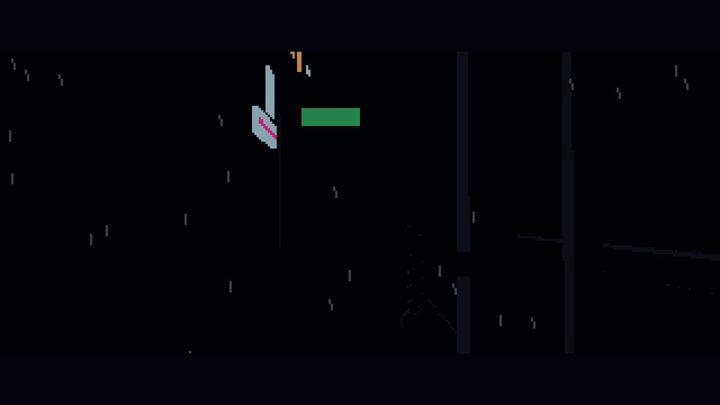

[← 全部分类](../README.md#browse)

# 角色动画

6 个作品。点击封面播放；没有画廊视频时会前往 X 原帖。

<table>
<tr>
<td width="50%" valign="top"><a href="https://guanmo-ai.github.io/awesome-ai-motion/#case-2103099194693271874"> <strong>机器人穿越十二种画风</strong> <small>点击封面播放</small></a> 角色动画 · 75s · 收藏 532 · <a href="https://x.com/pradeepXkapoor">@pradeepXkapoor</a> <a href="https://guanmo-ai.github.io/awesome-ai-motion/#case-2103099194693271874">▶ 打开画廊播放</a> · <a href="../cases/2103099194693271874.md">案例详情与来源</a> · <a href="https://x.com/pradeepXkapoor/status/2103099194693271874">作者原帖</a></td>
<td width="50%" valign="top"><a href="https://guanmo-ai.github.io/awesome-ai-motion/#case-2102476258948927543"> <strong>像素巫师的施法循环</strong> <small>点击封面播放</small></a> 角色动画 · 11s · 收藏 2,639 · <a href="https://x.com/majidmanzarpour">@majidmanzarpour</a> <a href="https://guanmo-ai.github.io/awesome-ai-motion/#case-2102476258948927543">▶ 打开画廊播放</a> · <a href="../cases/2102476258948927543.md">案例详情与来源</a> · <a href="https://x.com/majidmanzarpour/status/2102476258948927543">作者原帖</a></td>
</tr>
<tr>
<td width="50%" valign="top"><a href="https://guanmo-ai.github.io/awesome-ai-motion/#case-2104397688511103374"> <strong>蓝围巾小鸭的桃园溪流动画</strong> <small>点击封面播放</small></a> 角色动画 · 30s · 收藏 11 · 资料待完善 · <a href="https://x.com/Zarnab_with_Ai">@Zarnab_with_Ai</a> <a href="https://guanmo-ai.github.io/awesome-ai-motion/#case-2104397688511103374">▶ 打开画廊播放</a> · <a href="../cases/2104397688511103374.md">案例详情与来源</a> · <a href="https://x.com/Zarnab_with_Ai/status/2104397688511103374">作者原帖</a></td>
<td width="50%" valign="top"><a href="https://guanmo-ai.github.io/awesome-ai-motion/#case-2102472218269900876"> <strong>糖果主题角色动画</strong> <small>点击封面播放</small></a> 角色动画 · 30s · 收藏 350 · 资料待完善 · <a href="https://x.com/cherry_mx_reds">@cherry_mx_reds</a> <a href="https://guanmo-ai.github.io/awesome-ai-motion/#case-2102472218269900876">▶ 打开画廊播放</a> · <a href="../cases/2102472218269900876.md">案例详情与来源</a> · <a href="https://x.com/cherry_mx_reds/status/2102472218269900876">作者原帖</a></td>
</tr>
<tr>
<td width="50%" valign="top"><a href="https://guanmo-ai.github.io/awesome-ai-motion/#case-2103116003689550013"> <strong>夜色像素风音乐演示</strong> <small>点击封面播放</small></a> 角色动画 · 257s · 收藏 76 · 资料待完善 · <a href="https://x.com/gandamu_ml">@gandamu_ml</a> <a href="https://guanmo-ai.github.io/awesome-ai-motion/#case-2103116003689550013">▶ 打开画廊播放</a> · <a href="../cases/2103116003689550013.md">案例详情与来源</a> · <a href="https://x.com/gandamu_ml/status/2103116003689550013">作者原帖</a></td>
<td width="50%" valign="top"><a href="https://guanmo-ai.github.io/awesome-ai-motion/#case-2103028027861152225"> <strong>复古电脑演示场景</strong> <small>点击封面播放</small></a> 角色动画 · 164s · 收藏 1 · 资料待完善 · <a href="https://x.com/cromwellian">@cromwellian</a> <a href="https://guanmo-ai.github.io/awesome-ai-motion/#case-2103028027861152225">▶ 打开画廊播放</a> · <a href="../cases/2103028027861152225.md">案例详情与来源</a> · <a href="https://x.com/cromwellian/status/2103028027861152225">作者原帖</a></td>
</tr>
</table>
