[← All categories](../README.en.md#browse)

# Discovery pool

851 source-verified works with catalog details being completed. Featured works are marked separately.

<table>
<tbody>
<tr>
<td width="50%" height="225" align="center" valign="middle"></td>
<td width="50%" height="225" align="center" valign="middle"></td>
</tr>
<tr>
<td width="50%" valign="top"><strong>Beat-Synced Product Motion Ad</strong> <a href="https://x.com/twoclipping">@twoclipping</a> · Product &amp; marketing 0:20 · Bookmarks 1,422 · Details pending <a href="https://guanmo-ai.github.io/awesome-ai-motion/?lang=en#case-2102554209166000267">▶ Play</a> · <a href="https://x.com/twoclipping/status/2102554209166000267">Original post</a></td>
<td width="50%" valign="top"><strong>Automated Talking-Head Edit</strong> <a href="https://x.com/sab8a">@sab8a</a> · Product &amp; marketing 0:37 · Bookmarks 581 · Details pending <a href="https://guanmo-ai.github.io/awesome-ai-motion/?lang=en#case-2103144778481475686">▶ Play</a> · <a href="https://x.com/sab8a/status/2103144778481475686">Original post</a></td>
</tr>
</tbody>
<tbody>
<tr>
<td width="50%" height="225" align="center" valign="middle"></td>
<td width="50%" height="225" align="center" valign="middle"></td>
</tr>
<tr>
<td width="50%" valign="top"><strong>Punchy Promo for a Writing Tool</strong> <a href="https://x.com/shribuilds">@shribuilds</a> · Product &amp; marketing 0:41 · Bookmarks 383 · Details pending <a href="https://guanmo-ai.github.io/awesome-ai-motion/?lang=en#case-2102827288190689364">▶ Play</a> · <a href="https://x.com/shribuilds/status/2102827288190689364">Original post</a></td>
<td width="50%" valign="top"><strong>Inbox Zero: a code-based product-video workflow</strong> <a href="https://x.com/elie2222">@elie2222</a> · Product &amp; marketing 0:58 · Bookmarks 371 · Details pending <a href="https://guanmo-ai.github.io/awesome-ai-motion/?lang=en#case-2107186094777434454">▶ Play</a> · <a href="https://x.com/elie2222/status/2107186094777434454">Original post</a></td>
</tr>
</tbody>
<tbody>
<tr>
<td width="50%" height="225" align="center" valign="middle"></td>
<td width="50%" height="225" align="center" valign="middle"></td>
</tr>
<tr>
<td width="50%" valign="top"><strong>Ad for a UI Components Product</strong> <a href="https://x.com/deweytn">@deweytn</a> · Product &amp; marketing 0:26 · Bookmarks 4 · Details pending <a href="https://guanmo-ai.github.io/awesome-ai-motion/?lang=en#case-2102787822855893072">▶ Play</a> · <a href="https://x.com/deweytn/status/2102787822855893072">Original post</a></td>
<td width="50%" valign="top"><strong>Hoplite feature launch animation</strong> <a href="https://x.com/ryan_morr">@ryan_morr</a> · Product &amp; marketing 0:32 · Bookmarks 2 · Details pending <a href="https://guanmo-ai.github.io/awesome-ai-motion/?lang=en#case-2104249941136666741">▶ Play</a> · <a href="https://x.com/ryan_morr/status/2104249941136666741">Original post</a></td>
</tr>
</tbody>
<tbody>
<tr>
<td width="50%" height="225" align="center" valign="middle"></td>
<td width="50%" height="225" align="center" valign="middle"></td>
</tr>
<tr>
<td width="50%" valign="top"><strong>A One-line Trailer Test for a Roblox Game</strong> <a href="https://x.com/Aryanpxcr7">@Aryanpxcr7</a> · Product &amp; marketing 0:41 · Bookmarks 1 · Details pending <a href="https://guanmo-ai.github.io/awesome-ai-motion/?lang=en#case-2108326197516198346">▶ Play</a> · <a href="https://x.com/Aryanpxcr7/status/2108326197516198346">Original post</a></td>
<td width="50%" valign="top"><strong>A one-minute concept promo for a podcast</strong> <a href="https://x.com/wuhao1031">@wuhao1031</a> · Product &amp; marketing 1:00 · Bookmarks 0 · Details pending <a href="https://guanmo-ai.github.io/awesome-ai-motion/?lang=en#case-2105567585680941521">▶ Play</a> · <a href="https://x.com/wuhao1031/status/2105567585680941521">Original post</a></td>
</tr>
</tbody>
<tbody>
<tr>
<td width="50%" height="225" align="center" valign="middle"></td>
<td width="50%" height="225" align="center" valign="middle"></td>
</tr>
<tr>
<td width="50%" valign="top"><strong>Uptimepage: a 30-second Three.js promo</strong> <a href="https://x.com/kevindatas">@kevindatas</a> · Product &amp; marketing 0:30 · Bookmarks 0 · Details pending <a href="https://guanmo-ai.github.io/awesome-ai-motion/?lang=en#case-2106057217040368042">▶ Play</a> · <a href="https://x.com/kevindatas/status/2106057217040368042">Original post</a></td>
<td width="50%" valign="top"><strong>A Glaido Product Demo with a Jingle</strong> <a href="https://x.com/AIJackRoberts">@AIJackRoberts</a> · Product &amp; marketing 0:26 · Bookmarks 0 · Details pending <a href="https://guanmo-ai.github.io/awesome-ai-motion/?lang=en#case-2107869205588848985">▶ Play</a> · <a href="https://x.com/AIJackRoberts/status/2107869205588848985">Original post</a></td>
</tr>
</tbody>
<tbody>
<tr>
<td width="50%" height="225" align="center" valign="middle"></td>
<td width="50%" height="225" align="center" valign="middle"></td>
</tr>
<tr>
<td width="50%" valign="top"><strong>NextDoor: a second showreel experiment</strong> <a href="https://x.com/sankalpdomore">@sankalpdomore</a> · Product &amp; marketing 1:22 · Bookmarks 0 · Details pending <a href="https://guanmo-ai.github.io/awesome-ai-motion/?lang=en#case-2107498302388482100">▶ Play</a> · <a href="https://x.com/sankalpdomore/status/2107498302388482100">Original post</a></td>
<td width="50%" valign="top"><strong>Creative Promo from a Single Instruction</strong> <a href="https://x.com/nikomaster01">@nikomaster01</a> · Product &amp; marketing 0:47 · Bookmarks 0 · Details pending <a href="https://guanmo-ai.github.io/awesome-ai-motion/?lang=en#case-2104765209596612730">▶ Play</a> · <a href="https://x.com/nikomaster01/status/2104765209596612730">Original post</a></td>
</tr>
</tbody>
<tbody>
<tr>
<td width="50%" height="225" align="center" valign="middle"></td>
<td width="50%" height="225" align="center" valign="middle"></td>
</tr>
<tr>
<td width="50%" valign="top"><strong>A tile build revealing an advertisement</strong> <a href="https://x.com/tanabe_fragm">@tanabe_fragm</a> · Product &amp; marketing 0:30 · Bookmarks 0 · Details pending <a href="https://guanmo-ai.github.io/awesome-ai-motion/?lang=en#case-2107644501372322001">▶ Play</a> · <a href="https://x.com/tanabe_fragm/status/2107644501372322001">Original post</a></td>
<td width="50%" valign="top"><strong>Passwords and Passkeys Explained</strong> <a href="https://x.com/Tz_2022">@Tz_2022</a> · Education &amp; explainers 4:09 · Bookmarks 376 · Details pending <a href="https://guanmo-ai.github.io/awesome-ai-motion/?lang=en#case-2102838830285898214">▶ Play</a> · <a href="https://x.com/Tz_2022/status/2102838830285898214">Original post</a></td>
</tr>
</tbody>
<tbody>
<tr>
<td width="50%" height="225" align="center" valign="middle"></td>
<td width="50%" height="225" align="center" valign="middle"></td>
</tr>
<tr>
<td width="50%" valign="top"><strong>Manim Lesson on Derivatives</strong> <a href="https://x.com/LinearUncle">@LinearUncle</a> · Education &amp; explainers 7:37 · Bookmarks 360 · Details pending <a href="https://guanmo-ai.github.io/awesome-ai-motion/?lang=en#case-2103128559174971663">▶ Play</a> · <a href="https://x.com/LinearUncle/status/2103128559174971663">Original post</a></td>
<td width="50%" valign="top"><strong>A short video about five Gmail features</strong> <a href="https://x.com/ClaudeCode_UT">@ClaudeCode_UT</a> · Education &amp; explainers 0:32 · Bookmarks 186 · Details pending <a href="https://guanmo-ai.github.io/awesome-ai-motion/?lang=en#case-2106958663525314769">▶ Play</a> · <a href="https://x.com/ClaudeCode_UT/status/2106958663525314769">Original post</a></td>
</tr>
</tbody>
<tbody>
<tr>
<td width="50%" height="225" align="center" valign="middle"></td>
<td width="50%" height="225" align="center" valign="middle"></td>
</tr>
<tr>
<td width="50%" valign="top"><strong>Introduction to GitHub Version Control</strong> <a href="https://x.com/sundyme">@sundyme</a> · Education &amp; explainers 3:46 · Bookmarks 140 · Details pending <a href="https://guanmo-ai.github.io/awesome-ai-motion/?lang=en#case-2102751132502446549">▶ Play</a> · <a href="https://x.com/sundyme/status/2102751132502446549">Original post</a></td>
<td width="50%" valign="top"><strong>Eighty-One Years of Indonesian History</strong> <a href="https://x.com/hanifproduktif">@hanifproduktif</a> · Education &amp; explainers 0:59 · Bookmarks 120 · Details pending <a href="https://guanmo-ai.github.io/awesome-ai-motion/?lang=en#case-2102695622042411419">▶ Play</a> · <a href="https://x.com/hanifproduktif/status/2102695622042411419">Original post</a></td>
</tr>
</tbody>
<tbody>
<tr>
<td width="50%" height="225" align="center" valign="middle"></td>
<td width="50%" height="225" align="center" valign="middle"></td>
</tr>
<tr>
<td width="50%" valign="top"><strong>Option Formula Beside a Runner Game</strong> <a href="https://x.com/goodside">@goodside</a> · Education &amp; explainers 1:00 · Bookmarks 45 · Details pending <a href="https://guanmo-ai.github.io/awesome-ai-motion/?lang=en#case-2103171088637419631">▶ Play</a> · <a href="https://x.com/goodside/status/2103171088637419631">Original post</a></td>
<td width="50%" valign="top"><strong>SEO and GEO in Animation</strong> <a href="https://x.com/oscarmartin">@oscarmartin</a> · Education &amp; explainers 0:33 · Bookmarks 22 · Details pending <a href="https://guanmo-ai.github.io/awesome-ai-motion/?lang=en#case-2102731669853573582">▶ Play</a> · <a href="https://x.com/oscarmartin/status/2102731669853573582">Original post</a></td>
</tr>
</tbody>
<tbody>
<tr>
<td width="50%" height="225" align="center" valign="middle"></td>
<td width="50%" height="225" align="center" valign="middle"></td>
</tr>
<tr>
<td width="50%" valign="top"><strong>A first two-character explainer experiment</strong> <a href="https://x.com/Naonekozamurai">@Naonekozamurai</a> · Education &amp; explainers 0:27 · Bookmarks 2 · Details pending <a href="https://guanmo-ai.github.io/awesome-ai-motion/?lang=en#case-2107584181941502428">▶ Play</a> · <a href="https://x.com/Naonekozamurai/status/2107584181941502428">Original post</a></td>
<td width="50%" valign="top"><strong>Motion Graphic of a Cocktail Recipe</strong> <a href="https://x.com/Sarut0biSasuke">@Sarut0biSasuke</a> · Education &amp; explainers 0:30 · Bookmarks 1 · Details pending <a href="https://guanmo-ai.github.io/awesome-ai-motion/?lang=en#case-2103418429248069973">▶ Play</a> · <a href="https://x.com/Sarut0biSasuke/status/2103418429248069973">Original post</a></td>
</tr>
</tbody>
<tbody>
<tr>
<td width="50%" height="225" align="center" valign="middle"></td>
<td width="50%" height="225" align="center" valign="middle"></td>
</tr>
<tr>
<td width="50%" valign="top"><strong>Interactive turbocharger lesson</strong> <a href="https://x.com/yyyole">@yyyole</a> · Education &amp; explainers 0:45 · Bookmarks 1 · Details pending <a href="https://guanmo-ai.github.io/awesome-ai-motion/?lang=en#case-2107653001959833860">▶ Play</a> · <a href="https://x.com/yyyole/status/2107653001959833860">Original post</a></td>
<td width="50%" valign="top"><strong>Long-Form Passkey Explainer</strong> <a href="https://x.com/imShiWen">@imShiWen</a> · Education &amp; explainers 6:15 · Bookmarks 0 · Details pending <a href="https://guanmo-ai.github.io/awesome-ai-motion/?lang=en#case-2102954743442399395">▶ Play</a> · <a href="https://x.com/imShiWen/status/2102954743442399395">Original post</a></td>
</tr>
</tbody>
<tbody>
<tr>
<td width="50%" height="225" align="center" valign="middle"></td>
<td width="50%" height="225" align="center" valign="middle"></td>
</tr>
<tr>
<td width="50%" valign="top"><strong>Learning Linjiangxian through animation</strong> <a href="https://x.com/7998l201">@7998l201</a> · Education &amp; explainers 3:45 · Bookmarks 0 · Details pending <a href="https://guanmo-ai.github.io/awesome-ai-motion/?lang=en#case-2107443821630107654">▶ Play</a> · <a href="https://x.com/7998l201/status/2107443821630107654">Original post</a></td>
<td width="50%" valign="top"><strong>Fifteen-Second Motion Design Reel</strong> <a href="https://x.com/ajith_io">@ajith_io</a> · Motion design 0:15 · Bookmarks 4,403 · Details pending <a href="https://guanmo-ai.github.io/awesome-ai-motion/?lang=en#case-2103449416325890146">▶ Play</a> · <a href="https://x.com/ajith_io/status/2103449416325890146">Original post</a></td>
</tr>
</tbody>
<tbody>
<tr>
<td width="50%" height="225" align="center" valign="middle"></td>
<td width="50%" height="225" align="center" valign="middle"></td>
</tr>
<tr>
<td width="50%" valign="top"><strong>One shot beauty of physics animation</strong> <a href="https://x.com/akokoi1">@akokoi1</a> · Motion design 1:16 · Bookmarks 14 · Details pending <a href="https://guanmo-ai.github.io/awesome-ai-motion/?lang=en#case-2104200939095904322">▶ Play</a> · <a href="https://x.com/akokoi1/status/2104200939095904322">Original post</a></td>
<td width="50%" valign="top"><strong>Fifteen second motion design demo</strong> <a href="https://x.com/TheViableEdge">@TheViableEdge</a> · Motion design 0:15 · Bookmarks 5 · Details pending <a href="https://guanmo-ai.github.io/awesome-ai-motion/?lang=en#case-2104207707980869918">▶ Play</a> · <a href="https://x.com/TheViableEdge/status/2104207707980869918">Original post</a></td>
</tr>
</tbody>
<tbody>
<tr>
<td width="50%" height="225" align="center" valign="middle"><a href="https://guanmo-ai.github.io/awesome-ai-motion/?lang=en#case-2104756321908375866">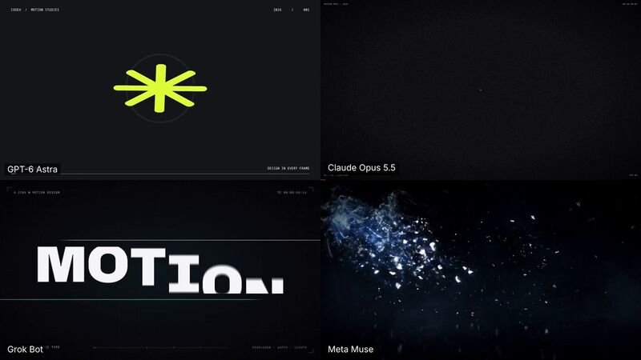</a></td>
<td width="50%" height="225" align="center" valign="middle"></td>
</tr>
<tr>
<td width="50%" valign="top"><strong>Four Models, One Motion Showreel Prompt</strong> <a href="https://x.com/MasonMosen">@MasonMosen</a> · Motion design 0:15 · Bookmarks 0 · Details pending <a href="https://guanmo-ai.github.io/awesome-ai-motion/?lang=en#case-2104756321908375866">▶ Play</a> · <a href="https://x.com/MasonMosen/status/2104756321908375866">Original post</a></td>
<td width="50%" valign="top"><strong>The Beauty of Three.js: A Cinematic Long Take</strong> <a href="https://x.com/yupengfei990919">@yupengfei990919</a> · Motion design 1:53 · Bookmarks 0 · Details pending <a href="https://guanmo-ai.github.io/awesome-ai-motion/?lang=en#case-2104788406656184436">▶ Play</a> · <a href="https://x.com/yupengfei990919/status/2104788406656184436">Original post</a></td>
</tr>
</tbody>
<tbody>
<tr>
<td width="50%" height="225" align="center" valign="middle"><a href="https://guanmo-ai.github.io/awesome-ai-motion/?lang=en#case-2106715812023226687">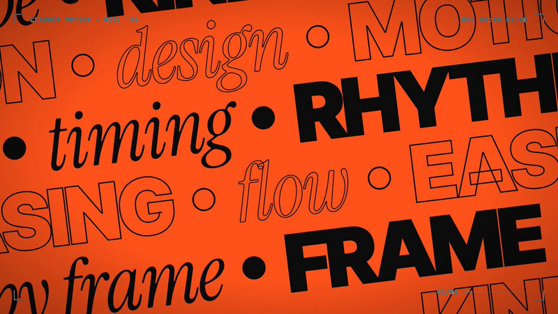</a></td>
<td width="50%" height="225" align="center" valign="middle"><a href="https://guanmo-ai.github.io/awesome-ai-motion/?lang=en#case-2106734468715466818">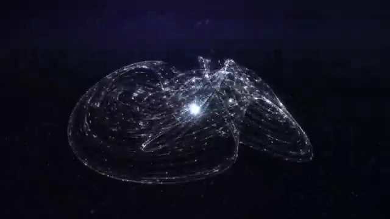</a></td>
</tr>
<tr>
<td width="50%" valign="top"><strong>A fifteen-second motion-design showreel</strong> <a href="https://x.com/Adimazuz03">@Adimazuz03</a> · Motion design 0:15 · Bookmarks 0 · Details pending <a href="https://guanmo-ai.github.io/awesome-ai-motion/?lang=en#case-2106715812023226687">▶ Play</a> · <a href="https://x.com/Adimazuz03/status/2106715812023226687">Original post</a></td>
<td width="50%" valign="top"><strong>Show Me Your Mind</strong> <a href="https://x.com/argbeknwn">@argbeknwn</a> · Motion design 0:15 · Bookmarks 0 · Details pending <a href="https://guanmo-ai.github.io/awesome-ai-motion/?lang=en#case-2106734468715466818">▶ Play</a> · <a href="https://x.com/argbeknwn/status/2106734468715466818">Original post</a></td>
</tr>
</tbody>
<tbody>
<tr>
<td width="50%" height="225" align="center" valign="middle"></td>
<td width="50%" height="225" align="center" valign="middle"><a href="https://guanmo-ai.github.io/awesome-ai-motion/?lang=en#case-2107628283009364368">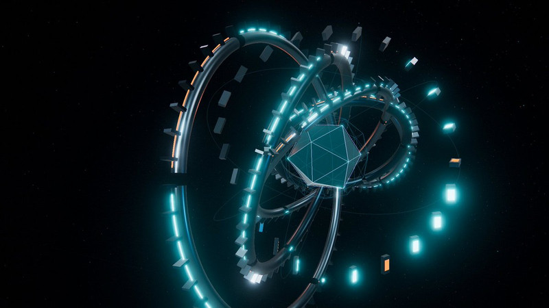</a></td>
</tr>
<tr>
<td width="50%" valign="top"><strong>Showtime: a motion-design skill sample</strong> <a href="https://x.com/FavioVaz">@FavioVaz</a> · Motion design 0:15 · Bookmarks 0 · Details pending <a href="https://guanmo-ai.github.io/awesome-ai-motion/?lang=en#case-2107367735466573937">▶ Play</a> · <a href="https://x.com/FavioVaz/status/2107367735466573937">Original post</a></td>
<td width="50%" valign="top"><strong>AXIOM / REACTOR mechanical motion</strong> <a href="https://x.com/zyon1527">@zyon1527</a> · Motion design 0:15 · Bookmarks 0 · Details pending <a href="https://guanmo-ai.github.io/awesome-ai-motion/?lang=en#case-2107628283009364368">▶ Play</a> · <a href="https://x.com/zyon1527/status/2107628283009364368">Original post</a></td>
</tr>
</tbody>
<tbody>
<tr>
<td width="50%" height="225" align="center" valign="middle"><a href="https://guanmo-ai.github.io/awesome-ai-motion/?lang=en#case-2108122750724260231">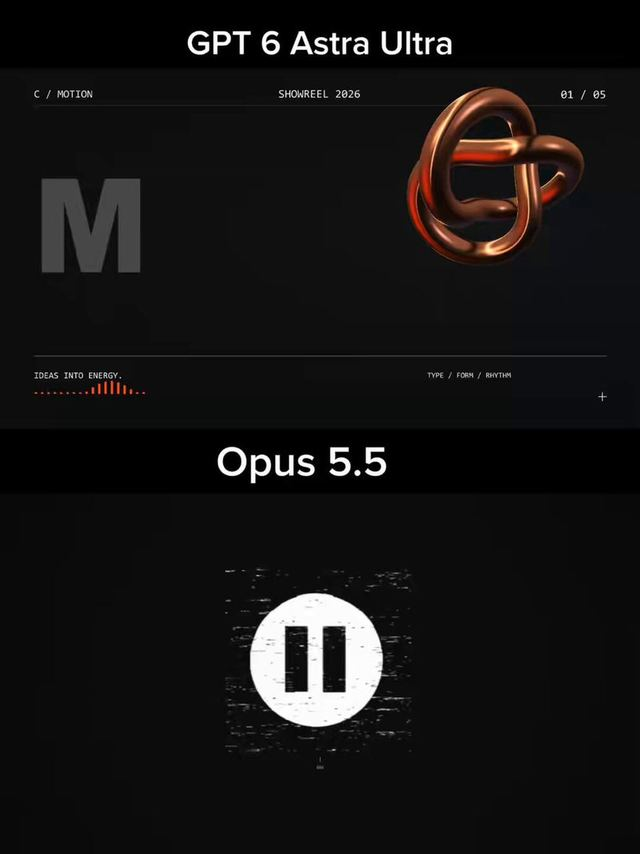</a></td>
<td width="50%" height="225" align="center" valign="middle"></td>
</tr>
<tr>
<td width="50%" valign="top"><strong>Two Models, One Motion Showreel Prompt</strong> <a href="https://x.com/BMWepta">@BMWepta</a> · Motion design 0:30 · Bookmarks 0 · Details pending <a href="https://guanmo-ai.github.io/awesome-ai-motion/?lang=en#case-2108122750724260231">▶ Play</a> · <a href="https://x.com/BMWepta/status/2108122750724260231">Original post</a></td>
<td width="50%" valign="top"><strong>A tea-drinking character beside ukiyo-e waves</strong> <a href="https://x.com/cherry_mx_reds">@cherry_mx_reds</a> · Pixel art &amp; characters 0:17 · Bookmarks 457 · Details pending <a href="https://guanmo-ai.github.io/awesome-ai-motion/?lang=en#case-2105816670896009224">▶ Play</a> · <a href="https://x.com/cherry_mx_reds/status/2105816670896009224">Original post</a></td>
</tr>
</tbody>
<tbody>
<tr>
<td width="50%" height="225" align="center" valign="middle"><a href="https://guanmo-ai.github.io/awesome-ai-motion/?lang=en#case-2108082476975554587">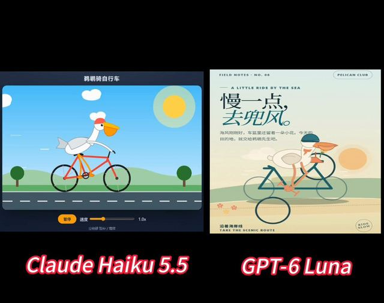</a></td>
<td width="50%" height="225" align="center" valign="middle"></td>
</tr>
<tr>
<td width="50%" valign="top"><strong>Haiku and Luna Animate a Cycling Pelican</strong> <a href="https://x.com/xueyu1125">@xueyu1125</a> · Pixel art &amp; characters 0:17 · Bookmarks 13 · Details pending <a href="https://guanmo-ai.github.io/awesome-ai-motion/?lang=en#case-2108082476975554587">▶ Play</a> · <a href="https://x.com/xueyu1125/status/2108082476975554587">Original post</a></td>
<td width="50%" valign="top"><strong>Blue-Scarf Duckling by a Peach Orchard Stream</strong> <a href="https://x.com/Zarnab_with_Ai">@Zarnab_with_Ai</a> · Pixel art &amp; characters 0:30 · Bookmarks 11 · Details pending <a href="https://guanmo-ai.github.io/awesome-ai-motion/?lang=en#case-2104397688511103374">▶ Play</a> · <a href="https://x.com/Zarnab_with_Ai/status/2104397688511103374">Original post</a></td>
</tr>
</tbody>
<tbody>
<tr>
<td width="50%" height="225" align="center" valign="middle"></td>
<td width="50%" height="225" align="center" valign="middle"></td>
</tr>
<tr>
<td width="50%" valign="top"><strong>ASHEN FRONTIER: a wasteland side-scroller</strong> <a href="https://x.com/jiangjiangling">@jiangjiangling</a> · Pixel art &amp; characters 0:30 · Bookmarks 2 · Details pending <a href="https://guanmo-ai.github.io/awesome-ai-motion/?lang=en#case-2107399895011434935">▶ Play</a> · <a href="https://x.com/jiangjiangling/status/2107399895011434935">Original post</a></td>
<td width="50%" valign="top"><strong>Four Chibi Characters in a Fixed-camera Scene</strong> <a href="https://x.com/mitsukikaname00">@mitsukikaname00</a> · Pixel art &amp; characters 0:12 · Bookmarks 0 · Details pending <a href="https://guanmo-ai.github.io/awesome-ai-motion/?lang=en#case-2108148813386883293">▶ Play</a> · <a href="https://x.com/mitsukikaname00/status/2108148813386883293">Original post</a></td>
</tr>
</tbody>
<tbody>
<tr>
<td width="50%" height="225" align="center" valign="middle"></td>
<td width="50%" height="225" align="center" valign="middle"></td>
</tr>
<tr>
<td width="50%" valign="top"><strong>Three Vehicles Combine into a Robot</strong> <a href="https://x.com/allforbigfire">@allforbigfire</a> · Pixel art &amp; characters 0:25 · Bookmarks 0 · Details pending <a href="https://guanmo-ai.github.io/awesome-ai-motion/?lang=en#case-2104193522715029657">▶ Play</a> · <a href="https://x.com/allforbigfire/status/2104193522715029657">Original post</a></td>
<td width="50%" valign="top"><strong>Peach Blossom Spring: A Guided Three.js Journey</strong> <a href="https://x.com/dotey">@dotey</a> · 3D &amp; interactive 4:17 · Bookmarks 460 · Details pending <a href="https://guanmo-ai.github.io/awesome-ai-motion/?lang=en#case-2102940980379017293">▶ Play</a> · <a href="https://x.com/dotey/status/2102940980379017293">Original post</a></td>
</tr>
</tbody>
<tbody>
<tr>
<td width="50%" height="225" align="center" valign="middle"></td>
<td width="50%" height="225" align="center" valign="middle"></td>
</tr>
<tr>
<td width="50%" valign="top"><strong>Pelican Cycling Along a Seaside Pier</strong> <a href="https://x.com/AxtonLiu">@AxtonLiu</a> · 3D &amp; interactive 0:38 · Bookmarks 57 · Details pending <a href="https://guanmo-ai.github.io/awesome-ai-motion/?lang=en#case-2103119648271290566">▶ Play</a> · <a href="https://x.com/AxtonLiu/status/2103119648271290566">Original post</a></td>
<td width="50%" valign="top"><strong>Walking Architecture: A Space for People</strong> <a href="https://x.com/shion_takk">@shion_takk</a> · 3D &amp; interactive 0:30 · Bookmarks 3 · Details pending <a href="https://guanmo-ai.github.io/awesome-ai-motion/?lang=en#case-2104590334152056983">▶ Play</a> · <a href="https://x.com/shion_takk/status/2104590334152056983">Original post</a></td>
</tr>
</tbody>
<tbody>
<tr>
<td width="50%" height="225" align="center" valign="middle"></td>
<td width="50%" height="225" align="center" valign="middle"></td>
</tr>
<tr>
<td width="50%" valign="top"><strong>A felt character: Sol and Opus with the same reference</strong> <a href="https://x.com/JakubAntowski">@JakubAntowski</a> · 3D &amp; interactive 0:20 · Bookmarks 0 · Details pending <a href="https://guanmo-ai.github.io/awesome-ai-motion/?lang=en#case-2105245039521628213">▶ Play</a> · <a href="https://x.com/JakubAntowski/status/2105245039521628213">Original post</a></td>
<td width="50%" valign="top"><strong>The orbital post office: a brass-and-planet world</strong> <a href="https://x.com/allenrokxlate">@allenrokxlate</a> · 3D &amp; interactive 0:24 · Bookmarks 0 · Details pending <a href="https://x.com/allenrokxlate/status/2106040262245896675">▶ Watch on X</a> · <a href="https://x.com/allenrokxlate/status/2106040262245896675">Original post</a></td>
</tr>
</tbody>
<tbody>
<tr>
<td width="50%" height="225" align="center" valign="middle"></td>
<td width="50%" height="225" align="center" valign="middle"></td>
</tr>
<tr>
<td width="50%" valign="top"><strong>Animated Story of an Unreadable Book</strong> <a href="https://x.com/emollick">@emollick</a> · Narrative films 2:07 · Bookmarks 642 · Details pending <a href="https://guanmo-ai.github.io/awesome-ai-motion/?lang=en#case-2103272686570918334">▶ Play</a> · <a href="https://x.com/emollick/status/2103272686570918334">Original post</a></td>
<td width="50%" valign="top"><strong>A bilingual news-editing experiment</strong> <a href="https://x.com/dotey">@dotey</a> · Narrative films 5:51 · Bookmarks 499 · Details pending <a href="https://guanmo-ai.github.io/awesome-ai-motion/?lang=en#case-2106144184449085474">▶ Play</a> · <a href="https://x.com/dotey/status/2106144184449085474">Original post</a></td>
</tr>
</tbody>
<tbody>
<tr>
<td width="50%" height="225" align="center" valign="middle"></td>
<td width="50%" height="225" align="center" valign="middle"></td>
</tr>
<tr>
<td width="50%" valign="top"><strong>1990s-Style 3D Cartoon Story</strong> <a href="https://x.com/scheemunai">@scheemunai</a> · Narrative films 3:50 · Bookmarks 370 · Details pending <a href="https://guanmo-ai.github.io/awesome-ai-motion/?lang=en#case-2102788223835463902">▶ Play</a> · <a href="https://x.com/scheemunai/status/2102788223835463902">Original post</a></td>
<td width="50%" valign="top"><strong>Shantou Day One: an AI-edited vlog</strong> <a href="https://x.com/dashiAIxz">@dashiAIxz</a> · Narrative films 4:25 · Bookmarks 197 · Details pending <a href="https://guanmo-ai.github.io/awesome-ai-motion/?lang=en#case-2106091485125091695">▶ Play</a> · <a href="https://x.com/dashiAIxz/status/2106091485125091695">Original post</a></td>
</tr>
</tbody>
<tbody>
<tr>
<td width="50%" height="225" align="center" valign="middle"></td>
<td width="50%" height="225" align="center" valign="middle"></td>
</tr>
<tr>
<td width="50%" valign="top"><strong>A Spear-wielding Character's Urban Escape</strong> <a href="https://x.com/TanLuAI">@TanLuAI</a> · Narrative films 0:31 · Bookmarks 23 · Details pending <a href="https://guanmo-ai.github.io/awesome-ai-motion/?lang=en#case-2107763438747521348">▶ Play</a> · <a href="https://x.com/TanLuAI/status/2107763438747521348">Original post</a></td>
<td width="50%" valign="top"><strong>Reach the Desk Unseen: an Office Chase Short</strong> <a href="https://x.com/AIwithJessica">@AIwithJessica</a> · Narrative films 0:30 · Bookmarks 7 · Details pending <a href="https://guanmo-ai.github.io/awesome-ai-motion/?lang=en#case-2104392249400594823">▶ Play</a> · <a href="https://x.com/AIwithJessica/status/2104392249400594823">Original post</a></td>
</tr>
</tbody>
<tbody>
<tr>
<td width="50%" height="225" align="center" valign="middle"></td>
<td width="50%" height="225" align="center" valign="middle"><a href="https://guanmo-ai.github.io/awesome-ai-motion/?lang=en#case-2107802029100093531">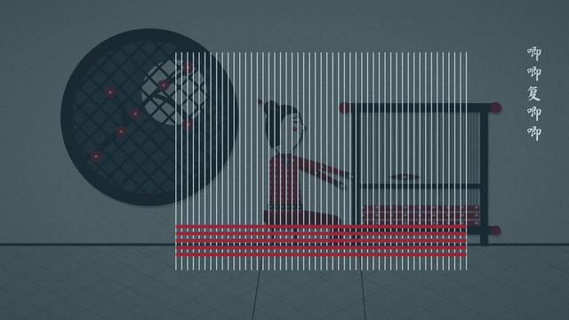</a></td>
</tr>
<tr>
<td width="50%" valign="top"><strong>A VHS-styled 1990s Living-room Comedy</strong> <a href="https://x.com/john87445528">@john87445528</a> · Narrative films 0:15 · Bookmarks 5 · Details pending <a href="https://guanmo-ai.github.io/awesome-ai-motion/?lang=en#case-2108350307402948799">▶ Play</a> · <a href="https://x.com/john87445528/status/2108350307402948799">Original post</a></td>
<td width="50%" valign="top"><strong>The Ballad of Mulan as Cut-paper Shadow Theatre</strong> <a href="https://x.com/TanLuAI">@TanLuAI</a> · Narrative films 1:03 · Bookmarks 3 · Details pending <a href="https://guanmo-ai.github.io/awesome-ai-motion/?lang=en#case-2107802029100093531">▶ Play</a> · <a href="https://x.com/TanLuAI/status/2107802029100093531">Original post</a></td>
</tr>
</tbody>
<tbody>
<tr>
<td width="50%" height="225" align="center" valign="middle"></td>
<td width="50%" height="225" align="center" valign="middle"></td>
</tr>
<tr>
<td width="50%" valign="top"><strong>A finger-snap journey at the Temple of Heaven</strong> <a href="https://x.com/Adam38363368936">@Adam38363368936</a> · Narrative films 0:10 · Bookmarks 2 · Details pending <a href="https://guanmo-ai.github.io/awesome-ai-motion/?lang=en#case-2107469294238134394">▶ Play</a> · <a href="https://x.com/Adam38363368936/status/2107469294238134394">Original post</a></td>
<td width="50%" valign="top"><strong>A Clockmaker and a Time-freezing Watch</strong> <a href="https://x.com/AIwithZeeshi">@AIwithZeeshi</a> · Narrative films 0:15 · Bookmarks 1 · Details pending <a href="https://guanmo-ai.github.io/awesome-ai-motion/?lang=en#case-2108412888415400315">▶ Play</a> · <a href="https://x.com/AIwithZeeshi/status/2108412888415400315">Original post</a></td>
</tr>
</tbody>
<tbody>
<tr>
<td width="50%" height="225" align="center" valign="middle"></td>
<td width="50%" height="225" align="center" valign="middle"></td>
</tr>
<tr>
<td width="50%" valign="top"><strong>Humanity’s future: the same challenge for Opus and Astra</strong> <a href="https://x.com/yulikay">@yulikay</a> · Narrative films 0:30 · Bookmarks 1 · Details pending <a href="https://guanmo-ai.github.io/awesome-ai-motion/?lang=en#case-2105354432460554648">▶ Play</a> · <a href="https://x.com/yulikay/status/2105354432460554648">Original post</a></td>
<td width="50%" valign="top"><strong>The Bug That Refused to Be Fixed</strong> <a href="https://x.com/KamStudioLabs">@KamStudioLabs</a> · Narrative films 1:30 · Bookmarks 1 · Details pending <a href="https://guanmo-ai.github.io/awesome-ai-motion/?lang=en#case-2102903173161877996">▶ Play</a> · <a href="https://x.com/KamStudioLabs/status/2102903173161877996">Original post</a></td>
</tr>
</tbody>
<tbody>
<tr>
<td width="50%" height="225" align="center" valign="middle"></td>
<td width="50%" height="225" align="center" valign="middle"><a href="https://guanmo-ai.github.io/awesome-ai-motion/?lang=en#case-2108483449119981673">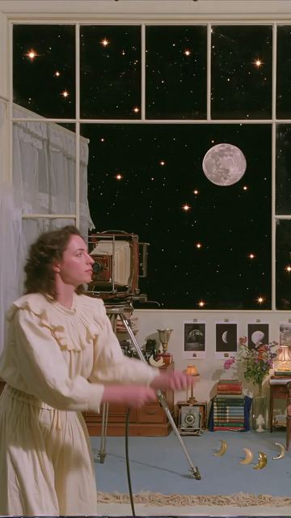</a></td>
</tr>
<tr>
<td width="50%" valign="top"><strong>Waterfall Trail: a Seedance 2.5 Nature Clip</strong> <a href="https://x.com/ZorviaLux">@ZorviaLux</a> · Narrative films 0:15 · Bookmarks 0 · Details pending <a href="https://guanmo-ai.github.io/awesome-ai-motion/?lang=en#case-2104443232512020686">▶ Play</a> · <a href="https://x.com/ZorviaLux/status/2104443232512020686">Original post</a></td>
<td width="50%" valign="top"><strong>Catching Moons, Washing Clouds and Making Stars</strong> <a href="https://x.com/LettyVesper">@LettyVesper</a> · Narrative films 0:34 · Bookmarks 0 · Details pending <a href="https://guanmo-ai.github.io/awesome-ai-motion/?lang=en#case-2108483449119981673">▶ Play</a> · <a href="https://x.com/LettyVesper/status/2108483449119981673">Original post</a></td>
</tr>
</tbody>
<tbody>
<tr>
<td width="50%" height="225" align="center" valign="middle"></td>
<td width="50%" height="225" align="center" valign="middle"></td>
</tr>
<tr>
<td width="50%" valign="top"><strong>Chasing a runaway tortilla</strong> <a href="https://x.com/ai_anelia">@ai_anelia</a> · Narrative films 0:30 · Bookmarks 0 · Details pending <a href="https://guanmo-ai.github.io/awesome-ai-motion/?lang=en#case-2107655230628548720">▶ Play</a> · <a href="https://x.com/ai_anelia/status/2107655230628548720">Original post</a></td>
<td width="50%" valign="top"><strong>Wordless Story of a Lighthouse Keeper</strong> <a href="https://x.com/KamStudioLabs">@KamStudioLabs</a> · Narrative films 0:46 · Bookmarks 0 · Details pending <a href="https://guanmo-ai.github.io/awesome-ai-motion/?lang=en#case-2102908742518100086">▶ Play</a> · <a href="https://x.com/KamStudioLabs/status/2102908742518100086">Original post</a></td>
</tr>
</tbody>
<tbody>
<tr>
<td width="50%" height="225" align="center" valign="middle"></td>
<td width="50%" height="225" align="center" valign="middle"></td>
</tr>
<tr>
<td width="50%" valign="top"><strong>Paper-Shadow Film About Home</strong> <a href="https://x.com/x4b47x">@x4b47x</a> · Narrative films 0:57 · Bookmarks 0 · Details pending <a href="https://guanmo-ai.github.io/awesome-ai-motion/?lang=en#case-2103019799614034026">▶ Play</a> · <a href="https://x.com/x4b47x/status/2103019799614034026">Original post</a></td>
<td width="50%" valign="top"><strong>Dynamic visuals for a Suno song</strong> <a href="https://x.com/hungryturbo">@hungryturbo</a> · Music &amp; lyrics 2:37 · Bookmarks 6 · Details pending <a href="https://guanmo-ai.github.io/awesome-ai-motion/?lang=en#case-2107093105992417482">▶ Play</a> · <a href="https://x.com/hungryturbo/status/2107093105992417482">Original post</a></td>
</tr>
</tbody>
<tbody>
<tr>
<td width="50%" height="225" align="center" valign="middle"></td>
<td width="50%" height="225" align="center" valign="middle"></td>
</tr>
<tr>
<td width="50%" valign="top"><strong>AI Takes Over: a song-visual experiment</strong> <a href="https://x.com/Dheepanratnam">@Dheepanratnam</a> · Music &amp; lyrics 1:00 · Bookmarks 2 · Details pending <a href="https://guanmo-ai.github.io/awesome-ai-motion/?lang=en#case-2107455787823952091">▶ Play</a> · <a href="https://x.com/Dheepanratnam/status/2107455787823952091">Original post</a></td>
<td width="50%" valign="top"><strong>Collision-Driven Musical Machine</strong> <a href="https://x.com/KamStudioLabs">@KamStudioLabs</a> · Music &amp; lyrics 0:47 · Bookmarks 1 · Details pending <a href="https://guanmo-ai.github.io/awesome-ai-motion/?lang=en#case-2102899866762440893">▶ Play</a> · <a href="https://x.com/KamStudioLabs/status/2102899866762440893">Original post</a></td>
</tr>
</tbody>
<tbody>
<tr>
<td width="50%" height="225" align="center" valign="middle"></td>
<td width="50%" height="225" align="center" valign="middle"></td>
</tr>
<tr>
<td width="50%" valign="top"><strong>Code drawn music video</strong> <a href="https://x.com/linus5x">@linus5x</a> · Music &amp; lyrics 1:45 · Bookmarks 0 · Details pending <a href="https://guanmo-ai.github.io/awesome-ai-motion/?lang=en#case-2104254444603076730">▶ Play</a> · <a href="https://x.com/linus5x/status/2104254444603076730">Original post</a></td>
<td width="50%" valign="top"><strong>One Prompt: A p5.js Music Video</strong> <a href="https://x.com/ppop123">@ppop123</a> · Music &amp; lyrics 2:10 · Bookmarks 0 · Details pending <a href="https://guanmo-ai.github.io/awesome-ai-motion/?lang=en#case-2105230653457650116">▶ Play</a> · <a href="https://x.com/ppop123/status/2105230653457650116">Original post</a></td>
</tr>
</tbody>
<tbody>
<tr>
<td width="50%" height="225" align="center" valign="middle"></td>
<td width="50%" height="225" align="center" valign="middle"></td>
</tr>
<tr>
<td width="50%" valign="top"><strong>Growl Engine: JavaScript bass music</strong> <a href="https://x.com/HOTHEAD01TH">@HOTHEAD01TH</a> · Music &amp; lyrics 2:00 · Bookmarks 0 · Details pending <a href="https://guanmo-ai.github.io/awesome-ai-motion/?lang=en#case-2107449614412493219">▶ Play</a> · <a href="https://x.com/HOTHEAD01TH/status/2107449614412493219">Original post</a></td>
<td width="50%" valign="top"><strong>Shotbase product launch animation</strong> <a href="https://x.com/Miguel07Code">@Miguel07Code</a> · Product &amp; marketing 0:58 · Bookmarks 1,683 · Details pending <a href="https://guanmo-ai.github.io/awesome-ai-motion/?lang=en#case-2102441708395041170">▶ Play</a> · <a href="https://x.com/Miguel07Code/status/2102441708395041170">Original post</a></td>
</tr>
</tbody>
<tbody>
<tr>
<td width="50%" height="225" align="center" valign="middle"></td>
<td width="50%" height="225" align="center" valign="middle"></td>
</tr>
<tr>
<td width="50%" valign="top"><strong>A Fully Coded Launch Film for a Fictional Calendar App</strong> <a href="https://x.com/LexnLin">@LexnLin</a> · Product &amp; marketing 0:33 · Bookmarks 1,240 · Details pending <a href="https://guanmo-ai.github.io/awesome-ai-motion/?lang=en#case-2104148233106723099">▶ Play</a> · <a href="https://x.com/LexnLin/status/2104148233106723099">Original post</a></td>
<td width="50%" valign="top"><strong>Personal website redesign trailer</strong> <a href="https://x.com/trq212">@trq212</a> · Product &amp; marketing 1:35 · Bookmarks 1,122 · Details pending <a href="https://guanmo-ai.github.io/awesome-ai-motion/?lang=en#case-2102477340920152162">▶ Play</a> · <a href="https://x.com/trq212/status/2102477340920152162">Original post</a></td>
</tr>
</tbody>
<tbody>
<tr>
<td width="50%" height="225" align="center" valign="middle"></td>
<td width="50%" height="225" align="center" valign="middle"></td>
</tr>
<tr>
<td width="50%" valign="top"><strong>Tutorial for Code-Drawn Product Ads</strong> <a href="https://x.com/Lucas_IA_">@Lucas_IA_</a> · Product &amp; marketing 1:12 · Bookmarks 1,119 · Details pending <a href="https://guanmo-ai.github.io/awesome-ai-motion/?lang=en#case-2103152093733253544">▶ Play</a> · <a href="https://x.com/Lucas_IA_/status/2103152093733253544">Original post</a></td>
<td width="50%" valign="top"><strong>Model-Built Launch Film</strong> <a href="https://x.com/athrix_codes">@athrix_codes</a> · Product &amp; marketing 0:53 · Bookmarks 951 · Details pending <a href="https://guanmo-ai.github.io/awesome-ai-motion/?lang=en#case-2096209514248958161">▶ Play</a> · <a href="https://x.com/athrix_codes/status/2096209514248958161">Original post</a></td>
</tr>
</tbody>
<tbody>
<tr>
<td width="50%" height="225" align="center" valign="middle"></td>
<td width="50%" height="225" align="center" valign="middle"></td>
</tr>
<tr>
<td width="50%" valign="top"><strong>Editable After Effects launch video</strong> <a href="https://x.com/seiiiiiiiiiiru">@seiiiiiiiiiiru</a> · Product &amp; marketing 0:30 · Bookmarks 597 · Details pending <a href="https://guanmo-ai.github.io/awesome-ai-motion/?lang=en#case-2102636308707287201">▶ Play</a> · <a href="https://x.com/seiiiiiiiiiiru/status/2102636308707287201">Original post</a></td>
<td width="50%" valign="top"><strong>Narration led After Effects ad</strong> <a href="https://x.com/seiiiiiiiiiiru">@seiiiiiiiiiiru</a> · Product &amp; marketing 0:29 · Bookmarks 588 · Details pending <a href="https://guanmo-ai.github.io/awesome-ai-motion/?lang=en#case-2103227982592831846">▶ Play</a> · <a href="https://x.com/seiiiiiiiiiiru/status/2103227982592831846">Original post</a></td>
</tr>
</tbody>
<tbody>
<tr>
<td width="50%" height="225" align="center" valign="middle"></td>
<td width="50%" height="225" align="center" valign="middle"></td>
</tr>
<tr>
<td width="50%" valign="top"><strong>Launch video from 13 speaking takes</strong> <a href="https://x.com/gregpr07">@gregpr07</a> · Product &amp; marketing 0:18 · Bookmarks 382 · Details pending <a href="https://guanmo-ai.github.io/awesome-ai-motion/?lang=en#case-2102984873351037161">▶ Play</a> · <a href="https://x.com/gregpr07/status/2102984873351037161">Original post</a></td>
<td width="50%" valign="top"><strong>Animated Mushroom Coffee Ad</strong> <a href="https://x.com/ladprofit">@ladprofit</a> · Product &amp; marketing 0:55 · Bookmarks 334 · Details pending <a href="https://guanmo-ai.github.io/awesome-ai-motion/?lang=en#case-2103148835270971419">▶ Play</a> · <a href="https://x.com/ladprofit/status/2103148835270971419">Original post</a></td>
</tr>
</tbody>
<tbody>
<tr>
<td width="50%" height="225" align="center" valign="middle"></td>
<td width="50%" height="225" align="center" valign="middle"></td>
</tr>
<tr>
<td width="50%" valign="top"><strong>Complete Promo for a Unified Chat App</strong> <a href="https://x.com/dhruvalgolakiya">@dhruvalgolakiya</a> · Product &amp; marketing 0:40 · Bookmarks 329 · Details pending <a href="https://guanmo-ai.github.io/awesome-ai-motion/?lang=en#case-2103037586663235713">▶ Play</a> · <a href="https://x.com/dhruvalgolakiya/status/2103037586663235713">Original post</a></td>
<td width="50%" valign="top"><strong>A PCB Enclosure and Printable Parts Promo</strong> <a href="https://x.com/VectorCrossProd">@VectorCrossProd</a> · Product &amp; marketing 0:10 · Bookmarks 271 · Details pending <a href="https://guanmo-ai.github.io/awesome-ai-motion/?lang=en#case-2104093497561436573">▶ Play</a> · <a href="https://x.com/VectorCrossProd/status/2104093497561436573">Original post</a></td>
</tr>
</tbody>
<tbody>
<tr>
<td width="50%" height="225" align="center" valign="middle"></td>
<td width="50%" height="225" align="center" valign="middle"></td>
</tr>
<tr>
<td width="50%" valign="top"><strong>Short Film from App Redesign Assets</strong> <a href="https://x.com/jackfriks">@jackfriks</a> · Product &amp; marketing 0:20 · Bookmarks 192 · Details pending <a href="https://guanmo-ai.github.io/awesome-ai-motion/?lang=en#case-2103132260589338762">▶ Play</a> · <a href="https://x.com/jackfriks/status/2103132260589338762">Original post</a></td>
<td width="50%" valign="top"><strong>Launch Animation of Claude Helping a Neighbourhood</strong> <a href="https://x.com/chetaslua">@chetaslua</a> · Product &amp; marketing 0:56 · Bookmarks 139 · Details pending <a href="https://guanmo-ai.github.io/awesome-ai-motion/?lang=en#case-2102370144546889735">▶ Play</a> · <a href="https://x.com/chetaslua/status/2102370144546889735">Original post</a></td>
</tr>
</tbody>
<tbody>
<tr>
<td width="50%" height="225" align="center" valign="middle"></td>
<td width="50%" height="225" align="center" valign="middle"></td>
</tr>
<tr>
<td width="50%" valign="top"><strong>A fashion poster with animated-character footage</strong> <a href="https://x.com/ponzponz15">@ponzponz15</a> · Product &amp; marketing 0:46 · Bookmarks 135 · Details pending <a href="https://guanmo-ai.github.io/awesome-ai-motion/?lang=en#case-2106266004515172366">▶ Play</a> · <a href="https://x.com/ponzponz15/status/2106266004515172366">Original post</a></td>
<td width="50%" valign="top"><strong>Hoodie Merchandise Launch Motion</strong> <a href="https://x.com/bridgemindai">@bridgemindai</a> · Product &amp; marketing 0:30 · Bookmarks 127 · Details pending <a href="https://guanmo-ai.github.io/awesome-ai-motion/?lang=en#case-2102462889160286423">▶ Play</a> · <a href="https://x.com/bridgemindai/status/2102462889160286423">Original post</a></td>
</tr>
</tbody>
<tbody>
<tr>
<td width="50%" height="225" align="center" valign="middle"></td>
<td width="50%" height="225" align="center" valign="middle"></td>
</tr>
<tr>
<td width="50%" valign="top"><strong>A fictional model-launch video comparison</strong> <a href="https://x.com/mesmerlord">@mesmerlord</a> · Product &amp; marketing 1:20 · Bookmarks 122 · Details pending <a href="https://guanmo-ai.github.io/awesome-ai-motion/?lang=en#case-2105771088374288692">▶ Play</a> · <a href="https://x.com/mesmerlord/status/2105771088374288692">Original post</a></td>
<td width="50%" valign="top"><strong>Building a Roblox Game Trailer</strong> <a href="https://x.com/NiloTechInc">@NiloTechInc</a> · Product &amp; marketing 0:07 · Bookmarks 105 · Details pending <a href="https://guanmo-ai.github.io/awesome-ai-motion/?lang=en#case-2102741813719138661">▶ Play</a> · <a href="https://x.com/NiloTechInc/status/2102741813719138661">Original post</a></td>
</tr>
</tbody>
<tbody>
<tr>
<td width="50%" height="225" align="center" valign="middle"></td>
<td width="50%" height="225" align="center" valign="middle"></td>
</tr>
<tr>
<td width="50%" valign="top"><strong>Stream Launch Film: Original and Code Recreation</strong> <a href="https://x.com/JurgenPloeger">@JurgenPloeger</a> · Product &amp; marketing 0:48 · Bookmarks 97 · Details pending <a href="https://guanmo-ai.github.io/awesome-ai-motion/?lang=en#case-2104131805175844923">▶ Play</a> · <a href="https://x.com/JurgenPloeger/status/2104131805175844923">Original post</a></td>
<td width="50%" valign="top"><strong>Sixty-Second Siege Game Promo</strong> <a href="https://x.com/KanaWorks_AI">@KanaWorks_AI</a> · Product &amp; marketing 1:00 · Bookmarks 95 · Details pending <a href="https://guanmo-ai.github.io/awesome-ai-motion/?lang=en#case-2102684116525437206">▶ Play</a> · <a href="https://x.com/KanaWorks_AI/status/2102684116525437206">Original post</a></td>
</tr>
</tbody>
<tbody>
<tr>
<td width="50%" height="225" align="center" valign="middle"></td>
<td width="50%" height="225" align="center" valign="middle"></td>
</tr>
<tr>
<td width="50%" valign="top"><strong>From a Nine-panel Storyboard to a Beach Soda Ad</strong> <a href="https://x.com/wiliam_web3">@wiliam_web3</a> · Product &amp; marketing 0:15 · Bookmarks 80 · Details pending <a href="https://guanmo-ai.github.io/awesome-ai-motion/?lang=en#case-2108457382686941377">▶ Play</a> · <a href="https://x.com/wiliam_web3/status/2108457382686941377">Original post</a></td>
<td width="50%" valign="top"><strong>A GoodCase Weekly Product-update Short</strong> <a href="https://x.com/aiwarts">@aiwarts</a> · Product &amp; marketing 0:35 · Bookmarks 80 · Details pending <a href="https://guanmo-ai.github.io/awesome-ai-motion/?lang=en#case-2108208400106668282">▶ Play</a> · <a href="https://x.com/aiwarts/status/2108208400106668282">Original post</a></td>
</tr>
</tbody>
<tbody>
<tr>
<td width="50%" height="225" align="center" valign="middle"></td>
<td width="50%" height="225" align="center" valign="middle"></td>
</tr>
<tr>
<td width="50%" valign="top"><strong>A fictional shampoo comic commercial</strong> <a href="https://x.com/seiiiiiiiiiiru">@seiiiiiiiiiiru</a> · Product &amp; marketing 0:30 · Bookmarks 79 · Details pending <a href="https://guanmo-ai.github.io/awesome-ai-motion/?lang=en#case-2106310907899105704">▶ Play</a> · <a href="https://x.com/seiiiiiiiiiiru/status/2106310907899105704">Original post</a></td>
<td width="50%" valign="top"><strong>Lip balm ad model comparison</strong> <a href="https://x.com/higgsfield_ai">@higgsfield_ai</a> · Product &amp; marketing 0:20 · Bookmarks 48 · Details pending <a href="https://guanmo-ai.github.io/awesome-ai-motion/?lang=en#case-2102913101926731879">▶ Play</a> · <a href="https://x.com/higgsfield_ai/status/2102913101926731879">Original post</a></td>
</tr>
</tbody>
<tbody>
<tr>
<td width="50%" height="225" align="center" valign="middle"></td>
<td width="50%" height="225" align="center" valign="middle"></td>
</tr>
<tr>
<td width="50%" valign="top"><strong>The Story of Yukon Research</strong> <a href="https://x.com/sreeramkannan">@sreeramkannan</a> · Product &amp; marketing 0:53 · Bookmarks 44 · Details pending <a href="https://guanmo-ai.github.io/awesome-ai-motion/?lang=en#case-2104027910004949132">▶ Play</a> · <a href="https://x.com/sreeramkannan/status/2104027910004949132">Original post</a></td>
<td width="50%" valign="top"><strong>A Software Ad with Gemini and Remotion</strong> <a href="https://x.com/WiFiMoneyGuy">@WiFiMoneyGuy</a> · Product &amp; marketing 0:29 · Bookmarks 44 · Details pending <a href="https://guanmo-ai.github.io/awesome-ai-motion/?lang=en#case-2103975338976182477">▶ Play</a> · <a href="https://x.com/WiFiMoneyGuy/status/2103975338976182477">Original post</a></td>
</tr>
</tbody>
<tbody>
<tr>
<td width="50%" height="225" align="center" valign="middle"></td>
<td width="50%" height="225" align="center" valign="middle"></td>
</tr>
<tr>
<td width="50%" valign="top"><strong>DeepSeek: a weather-app motion-graphics experiment</strong> <a href="https://x.com/ItsmeAjayKV">@ItsmeAjayKV</a> · Product &amp; marketing 0:25 · Bookmarks 43 · Details pending <a href="https://guanmo-ai.github.io/awesome-ai-motion/?lang=en#case-2106323424473907257">▶ Play</a> · <a href="https://x.com/ItsmeAjayKV/status/2106323424473907257">Original post</a></td>
<td width="50%" valign="top"><strong>QuanCard: a card-stack launch film</strong> <a href="https://x.com/luoleiorg">@luoleiorg</a> · Product &amp; marketing 0:42 · Bookmarks 39 · Details pending <a href="https://guanmo-ai.github.io/awesome-ai-motion/?lang=en#case-2107481547242873319">▶ Play</a> · <a href="https://x.com/luoleiorg/status/2107481547242873319">Original post</a></td>
</tr>
</tbody>
<tbody>
<tr>
<td width="50%" height="225" align="center" valign="middle"></td>
<td width="50%" height="225" align="center" valign="middle"></td>
</tr>
<tr>
<td width="50%" valign="top"><strong>A Three.js-coded Car Short</strong> <a href="https://x.com/higgsfield">@higgsfield</a> · Product &amp; marketing 0:30 · Bookmarks 37 · Details pending <a href="https://guanmo-ai.github.io/awesome-ai-motion/?lang=en#case-2108384911245869197">▶ Play</a> · <a href="https://x.com/higgsfield/status/2108384911245869197">Original post</a></td>
<td width="50%" valign="top"><strong>A Vertical Product Film Using Blender Models</strong> <a href="https://x.com/yoshifujidesign">@yoshifujidesign</a> · Product &amp; marketing 0:30 · Bookmarks 33 · Details pending <a href="https://guanmo-ai.github.io/awesome-ai-motion/?lang=en#case-2103987596301119645">▶ Play</a> · <a href="https://x.com/yoshifujidesign/status/2103987596301119645">Original post</a></td>
</tr>
</tbody>
<tbody>
<tr>
<td width="50%" height="225" align="center" valign="middle"></td>
<td width="50%" height="225" align="center" valign="middle"></td>
</tr>
<tr>
<td width="50%" valign="top"><strong>A Haiku 5.5 Self-promotion Film</strong> <a href="https://x.com/LufzzLiz">@LufzzLiz</a> · Product &amp; marketing 0:30 · Bookmarks 27 · Details pending <a href="https://guanmo-ai.github.io/awesome-ai-motion/?lang=en#case-2107990570002252237">▶ Play</a> · <a href="https://x.com/LufzzLiz/status/2107990570002252237">Original post</a></td>
<td width="50%" valign="top"><strong>Rhythmic Edit of a Mobile App Capture</strong> <a href="https://x.com/reg_andr">@reg_andr</a> · Product &amp; marketing 0:54 · Bookmarks 26 · Details pending <a href="https://guanmo-ai.github.io/awesome-ai-motion/?lang=en#case-2103117698863390805">▶ Play</a> · <a href="https://x.com/reg_andr/status/2103117698863390805">Original post</a></td>
</tr>
</tbody>
<tbody>
<tr>
<td width="50%" height="225" align="center" valign="middle"></td>
<td width="50%" height="225" align="center" valign="middle"></td>
</tr>
<tr>
<td width="50%" valign="top"><strong>Browser Product Teaser Recut</strong> <a href="https://x.com/jake11moran">@jake11moran</a> · Product &amp; marketing 0:27 · Bookmarks 25 · Details pending <a href="https://guanmo-ai.github.io/awesome-ai-motion/?lang=en#case-2103237884564414633">▶ Play</a> · <a href="https://x.com/jake11moran/status/2103237884564414633">Original post</a></td>
<td width="50%" valign="top"><strong>A Code-Rendered Mac Launch Film</strong> <a href="https://x.com/charliejhills">@charliejhills</a> · Product &amp; marketing 0:20 · Bookmarks 21 · Details pending <a href="https://guanmo-ai.github.io/awesome-ai-motion/?lang=en#case-2104225890800705789">▶ Play</a> · <a href="https://x.com/charliejhills/status/2104225890800705789">Original post</a></td>
</tr>
</tbody>
<tbody>
<tr>
<td width="50%" height="225" align="center" valign="middle"></td>
<td width="50%" height="225" align="center" valign="middle"></td>
</tr>
<tr>
<td width="50%" valign="top"><strong>A Sonnet Concept Car Generated in Code</strong> <a href="https://x.com/techartist_">@techartist_</a> · Product &amp; marketing 0:18 · Bookmarks 18 · Details pending <a href="https://guanmo-ai.github.io/awesome-ai-motion/?lang=en#case-2104715277120180702">▶ Play</a> · <a href="https://x.com/techartist_/status/2104715277120180702">Original post</a></td>
<td width="50%" valign="top"><strong>Nine-Scene Product Launch Film</strong> <a href="https://x.com/ish_creative">@ish_creative</a> · Product &amp; marketing 0:30 · Bookmarks 18 · Details pending <a href="https://guanmo-ai.github.io/awesome-ai-motion/?lang=en#case-2102966807376334856">▶ Play</a> · <a href="https://x.com/ish_creative/status/2102966807376334856">Original post</a></td>
</tr>
</tbody>
<tbody>
<tr>
<td width="50%" height="225" align="center" valign="middle"></td>
<td width="50%" height="225" align="center" valign="middle"></td>
</tr>
<tr>
<td width="50%" valign="top"><strong>Animated Football Player Recommendations</strong> <a href="https://x.com/Luchigatica">@Luchigatica</a> · Product &amp; marketing 0:39 · Bookmarks 14 · Details pending <a href="https://guanmo-ai.github.io/awesome-ai-motion/?lang=en#case-2102853289259729328">▶ Play</a> · <a href="https://x.com/Luchigatica/status/2102853289259729328">Original post</a></td>
<td width="50%" valign="top"><strong>A HanaAgent 1.0 Promo Experiment</strong> <a href="https://x.com/lilililiMozi">@lilililiMozi</a> · Product &amp; marketing 0:58 · Bookmarks 14 · Details pending <a href="https://guanmo-ai.github.io/awesome-ai-motion/?lang=en#case-2108115329948037522">▶ Play</a> · <a href="https://x.com/lilililiMozi/status/2108115329948037522">Original post</a></td>
</tr>
</tbody>
<tbody>
<tr>
<td width="50%" height="225" align="center" valign="middle"></td>
<td width="50%" height="225" align="center" valign="middle"></td>
</tr>
<tr>
<td width="50%" valign="top"><strong>Tokyo Tower in a 3D Promo Sequence</strong> <a href="https://x.com/Maruo_0314">@Maruo_0314</a> · Product &amp; marketing 0:15 · Bookmarks 13 · Details pending <a href="https://guanmo-ai.github.io/awesome-ai-motion/?lang=en#case-2104159752095998343">▶ Play</a> · <a href="https://x.com/Maruo_0314/status/2104159752095998343">Original post</a></td>
<td width="50%" valign="top"><strong>Forty-Two-Second Help Service Launch Film</strong> <a href="https://x.com/azhar_builds">@azhar_builds</a> · Product &amp; marketing 0:42 · Bookmarks 9 · Details pending <a href="https://guanmo-ai.github.io/awesome-ai-motion/?lang=en#case-2103075805098070315">▶ Play</a> · <a href="https://x.com/azhar_builds/status/2103075805098070315">Original post</a></td>
</tr>
</tbody>
<tbody>
<tr>
<td width="50%" height="225" align="center" valign="middle"></td>
<td width="50%" height="225" align="center" valign="middle"></td>
</tr>
<tr>
<td width="50%" valign="top"><strong>Remotion promo for an open source project</strong> <a href="https://x.com/canghe">@canghe</a> · Product &amp; marketing 0:34 · Bookmarks 9 · Details pending <a href="https://guanmo-ai.github.io/awesome-ai-motion/?lang=en#case-2104225521869705468">▶ Play</a> · <a href="https://x.com/canghe/status/2104225521869705468">Original post</a></td>
<td width="50%" valign="top"><strong>Nafa: a Product Marketing Film from One Workflow</strong> <a href="https://x.com/SaadPastaDev">@SaadPastaDev</a> · Product &amp; marketing 0:25 · Bookmarks 6 · Details pending <a href="https://guanmo-ai.github.io/awesome-ai-motion/?lang=en#case-2107741413769347341">▶ Play</a> · <a href="https://x.com/SaadPastaDev/status/2107741413769347341">Original post</a></td>
</tr>
</tbody>
<tbody>
<tr>
<td width="50%" height="225" align="center" valign="middle"></td>
<td width="50%" height="225" align="center" valign="middle"></td>
</tr>
<tr>
<td width="50%" valign="top"><strong>own.page: a cinematic launch film</strong> <a href="https://x.com/ElitzaVasileva">@ElitzaVasileva</a> · Product &amp; marketing 0:45 · Bookmarks 6 · Details pending <a href="https://guanmo-ai.github.io/awesome-ai-motion/?lang=en#case-2107187734414582139">▶ Play</a> · <a href="https://x.com/ElitzaVasileva/status/2107187734414582139">Original post</a></td>
<td width="50%" valign="top"><strong>Halloween Festival: an Automatically Shot World Promo</strong> <a href="https://x.com/yuripi_2023">@yuripi_2023</a> · Product &amp; marketing 0:59 · Bookmarks 6 · Details pending <a href="https://guanmo-ai.github.io/awesome-ai-motion/?lang=en#case-2108379423808635005">▶ Play</a> · <a href="https://x.com/yuripi_2023/status/2108379423808635005">Original post</a></td>
</tr>
</tbody>
<tbody>
<tr>
<td width="50%" height="225" align="center" valign="middle"></td>
<td width="50%" height="225" align="center" valign="middle"></td>
</tr>
<tr>
<td width="50%" valign="top"><strong>Unofficial BLVCKOUT promo</strong> <a href="https://x.com/ystknsh">@ystknsh</a> · Product &amp; marketing 0:30 · Bookmarks 6 · Details pending <a href="https://guanmo-ai.github.io/awesome-ai-motion/?lang=en#case-2102766871007436993">▶ Play</a> · <a href="https://x.com/ystknsh/status/2102766871007436993">Original post</a></td>
<td width="50%" valign="top"><strong>Code Recreation of a Launch Film</strong> <a href="https://x.com/vikktorrrre">@vikktorrrre</a> · Product &amp; marketing 0:20 · Bookmarks 5 · Details pending <a href="https://guanmo-ai.github.io/awesome-ai-motion/?lang=en#case-2103104303808348305">▶ Play</a> · <a href="https://x.com/vikktorrrre/status/2103104303808348305">Original post</a></td>
</tr>
</tbody>
<tbody>
<tr>
<td width="50%" height="225" align="center" valign="middle"></td>
<td width="50%" height="225" align="center" valign="middle"></td>
</tr>
<tr>
<td width="50%" valign="top"><strong>Sorank Product Launch Motion</strong> <a href="https://x.com/thibaultbessonm">@thibaultbessonm</a> · Product &amp; marketing 1:14 · Bookmarks 5 · Details pending <a href="https://guanmo-ai.github.io/awesome-ai-motion/?lang=en#case-2105221575117324685">▶ Play</a> · <a href="https://x.com/thibaultbessonm/status/2105221575117324685">Original post</a></td>
<td width="50%" valign="top"><strong>An Anti-LinkedIn Launch Video</strong> <a href="https://x.com/MaxHirsch13">@MaxHirsch13</a> · Product &amp; marketing 0:20 · Bookmarks 4 · Details pending <a href="https://guanmo-ai.github.io/awesome-ai-motion/?lang=en#case-2107985883949600983">▶ Play</a> · <a href="https://x.com/MaxHirsch13/status/2107985883949600983">Original post</a></td>
</tr>
</tbody>
<tbody>
<tr>
<td width="50%" height="225" align="center" valign="middle"></td>
<td width="50%" height="225" align="center" valign="middle"></td>
</tr>
<tr>
<td width="50%" valign="top"><strong>YouWare Launch Video: Opus, Sol and Fable Compared</strong> <a href="https://x.com/yrzhe_top">@yrzhe_top</a> · Product &amp; marketing 0:40 · Bookmarks 4 · Details pending <a href="https://guanmo-ai.github.io/awesome-ai-motion/?lang=en#case-2102752585371226241">▶ Play</a> · <a href="https://x.com/yrzhe_top/status/2102752585371226241">Original post</a></td>
<td width="50%" valign="top"><strong>A Phone-led Promo for an Yingge Dance Game</strong> <a href="https://x.com/Gimi_min">@Gimi_min</a> · Product &amp; marketing 1:01 · Bookmarks 4 · Details pending <a href="https://guanmo-ai.github.io/awesome-ai-motion/?lang=en#case-2108477835463766340">▶ Play</a> · <a href="https://x.com/Gimi_min/status/2108477835463766340">Original post</a></td>
</tr>
</tbody>
<tbody>
<tr>
<td width="50%" height="225" align="center" valign="middle"></td>
<td width="50%" height="225" align="center" valign="middle"></td>
</tr>
<tr>
<td width="50%" valign="top"><strong>Model Launch Concept Film</strong> <a href="https://x.com/marcthecreatorr">@marcthecreatorr</a> · Product &amp; marketing 0:32 · Bookmarks 3 · Details pending <a href="https://guanmo-ai.github.io/awesome-ai-motion/?lang=en#case-2103133462798483752">▶ Play</a> · <a href="https://x.com/marcthecreatorr/status/2103133462798483752">Original post</a></td>
<td width="50%" valign="top"><strong>SPECTRA+: a DeepSeek motion experiment</strong> <a href="https://x.com/ItsmeAjayKV">@ItsmeAjayKV</a> · Product &amp; marketing 0:40 · Bookmarks 3 · Details pending <a href="https://guanmo-ai.github.io/awesome-ai-motion/?lang=en#case-2106414547569676331">▶ Play</a> · <a href="https://x.com/ItsmeAjayKV/status/2106414547569676331">Original post</a></td>
</tr>
</tbody>
<tbody>
<tr>
<td width="50%" height="225" align="center" valign="middle"></td>
<td width="50%" height="225" align="center" valign="middle"></td>
</tr>
<tr>
<td width="50%" valign="top"><strong>Motion Ad for a Productivity Site</strong> <a href="https://x.com/shushant_l">@shushant_l</a> · Product &amp; marketing 0:15 · Bookmarks 3 · Details pending <a href="https://guanmo-ai.github.io/awesome-ai-motion/?lang=en#case-2103829449359966629">▶ Play</a> · <a href="https://x.com/shushant_l/status/2103829449359966629">Original post</a></td>
<td width="50%" valign="top"><strong>Inkwell: a DeepSeek brand-intro experiment</strong> <a href="https://x.com/ItsmeAjayKV">@ItsmeAjayKV</a> · Product &amp; marketing 0:38 · Bookmarks 2 · Details pending <a href="https://guanmo-ai.github.io/awesome-ai-motion/?lang=en#case-2106616126776230055">▶ Play</a> · <a href="https://x.com/ItsmeAjayKV/status/2106616126776230055">Original post</a></td>
</tr>
</tbody>
<tbody>
<tr>
<td width="50%" height="225" align="center" valign="middle"></td>
<td width="50%" height="225" align="center" valign="middle"></td>
</tr>
<tr>
<td width="50%" valign="top"><strong>Code-Rendered Brand Film</strong> <a href="https://x.com/Govindaiii">@Govindaiii</a> · Product &amp; marketing 0:52 · Bookmarks 2 · Details pending <a href="https://guanmo-ai.github.io/awesome-ai-motion/?lang=en#case-2102815918049132792">▶ Play</a> · <a href="https://x.com/Govindaiii/status/2102815918049132792">Original post</a></td>
<td width="50%" valign="top"><strong>Real Halloween Night: a VRChat World Promo</strong> <a href="https://x.com/yuripi_2023">@yuripi_2023</a> · Product &amp; marketing 1:00 · Bookmarks 2 · Details pending <a href="https://guanmo-ai.github.io/awesome-ai-motion/?lang=en#case-2108394968389951585">▶ Play</a> · <a href="https://x.com/yuripi_2023/status/2108394968389951585">Original post</a></td>
</tr>
</tbody>
<tbody>
<tr>
<td width="50%" height="225" align="center" valign="middle"></td>
<td width="50%" height="225" align="center" valign="middle"></td>
</tr>
<tr>
<td width="50%" valign="top"><strong>An ad workflow with Claude and Seedance</strong> <a href="https://x.com/commonman_16">@commonman_16</a> · Product &amp; marketing 0:30 · Bookmarks 2 · Details pending <a href="https://guanmo-ai.github.io/awesome-ai-motion/?lang=en#case-2107497103643816445">▶ Play</a> · <a href="https://x.com/commonman_16/status/2107497103643816445">Original post</a></td>
<td width="50%" valign="top"><strong>Atlasnote-pro: a Git-history film</strong> <a href="https://x.com/Tao100086">@Tao100086</a> · Product &amp; marketing 2:06 · Bookmarks 2 · Details pending <a href="https://guanmo-ai.github.io/awesome-ai-motion/?lang=en#case-2106941357915058661">▶ Play</a> · <a href="https://x.com/Tao100086/status/2106941357915058661">Original post</a></td>
</tr>
</tbody>
<tbody>
<tr>
<td width="50%" height="225" align="center" valign="middle"></td>
<td width="50%" height="225" align="center" valign="middle"></td>
</tr>
<tr>
<td width="50%" valign="top"><strong>A Fictional Gym Campaign Ad</strong> <a href="https://x.com/husky__create">@husky__create</a> · Product &amp; marketing 0:30 · Bookmarks 2 · Details pending <a href="https://guanmo-ai.github.io/awesome-ai-motion/?lang=en#case-2108165831838544313">▶ Play</a> · <a href="https://x.com/husky__create/status/2108165831838544313">Original post</a></td>
<td width="50%" valign="top"><strong>Motion Experiments for an Ad Library</strong> <a href="https://x.com/uglyrobot">@uglyrobot</a> · Product &amp; marketing 0:20 · Bookmarks 1 · Details pending <a href="https://guanmo-ai.github.io/awesome-ai-motion/?lang=en#case-2104360004715446416">▶ Play</a> · <a href="https://x.com/uglyrobot/status/2104360004715446416">Original post</a></td>
</tr>
</tbody>
<tbody>
<tr>
<td width="50%" height="225" align="center" valign="middle"></td>
<td width="50%" height="225" align="center" valign="middle"></td>
</tr>
<tr>
<td width="50%" valign="top"><strong>Recall: a knowledge-app launch film</strong> <a href="https://x.com/shivamdesignin">@shivamdesignin</a> · Product &amp; marketing 0:48 · Bookmarks 1 · Details pending <a href="https://guanmo-ai.github.io/awesome-ai-motion/?lang=en#case-2106706231029314030">▶ Play</a> · <a href="https://x.com/shivamdesignin/status/2106706231029314030">Original post</a></td>
<td width="50%" valign="top"><strong>Promo for ten indie apps</strong> <a href="https://x.com/chapi13">@chapi13</a> · Product &amp; marketing 0:27 · Bookmarks 1 · Details pending <a href="https://guanmo-ai.github.io/awesome-ai-motion/?lang=en#case-2104206465863131449">▶ Play</a> · <a href="https://x.com/chapi13/status/2104206465863131449">Original post</a></td>
</tr>
</tbody>
<tbody>
<tr>
<td width="50%" height="225" align="center" valign="middle"></td>
<td width="50%" height="225" align="center" valign="middle"></td>
</tr>
<tr>
<td width="50%" valign="top"><strong>Ply: A Mac App Launch Film</strong> <a href="https://x.com/Khazs0">@Khazs0</a> · Product &amp; marketing 0:38 · Bookmarks 1 · Details pending <a href="https://guanmo-ai.github.io/awesome-ai-motion/?lang=en#case-2104753708584095936">▶ Play</a> · <a href="https://x.com/Khazs0/status/2104753708584095936">Original post</a></td>
<td width="50%" valign="top"><strong>SEIRAN fictional EV advertisement</strong> <a href="https://x.com/ShionTabata">@ShionTabata</a> · Product &amp; marketing 0:15 · Bookmarks 1 · Details pending <a href="https://guanmo-ai.github.io/awesome-ai-motion/?lang=en#case-2107534399009104283">▶ Play</a> · <a href="https://x.com/ShionTabata/status/2107534399009104283">Original post</a></td>
</tr>
</tbody>
<tbody>
<tr>
<td width="50%" height="225" align="center" valign="middle"></td>
<td width="50%" height="225" align="center" valign="middle"></td>
</tr>
<tr>
<td width="50%" valign="top"><strong>A Vertical Promo Test for an Indie Game</strong> <a href="https://x.com/buluntus_dev">@buluntus_dev</a> · Product &amp; marketing 0:20 · Bookmarks 1 · Details pending <a href="https://guanmo-ai.github.io/awesome-ai-motion/?lang=en#case-2107915831900512276">▶ Play</a> · <a href="https://x.com/buluntus_dev/status/2107915831900512276">Original post</a></td>
<td width="50%" valign="top"><strong>A Namashkar Bharat Website Promo</strong> <a href="https://x.com/ajinkya_shejul">@ajinkya_shejul</a> · Product &amp; marketing 0:32 · Bookmarks 0 · Details pending <a href="https://guanmo-ai.github.io/awesome-ai-motion/?lang=en#case-2105221279100141928">▶ Play</a> · <a href="https://x.com/ajinkya_shejul/status/2105221279100141928">Original post</a></td>
</tr>
</tbody>
<tbody>
<tr>
<td width="50%" height="225" align="center" valign="middle"></td>
<td width="50%" height="225" align="center" valign="middle"></td>
</tr>
<tr>
<td width="50%" valign="top"><strong>Brand Explainer Using Existing Product UI</strong> <a href="https://x.com/imthatcarlos">@imthatcarlos</a> · Product &amp; marketing 0:59 · Bookmarks 0 · Details pending <a href="https://guanmo-ai.github.io/awesome-ai-motion/?lang=en#case-2102849219388133592">▶ Play</a> · <a href="https://x.com/imthatcarlos/status/2102849219388133592">Original post</a></td>
<td width="50%" valign="top"><strong>Imagine MCP Launch Motion</strong> <a href="https://x.com/ImagineArt_X">@ImagineArt_X</a> · Product &amp; marketing 0:49 · Bookmarks 0 · Details pending <a href="https://guanmo-ai.github.io/awesome-ai-motion/?lang=en#case-2104771867781574928">▶ Play</a> · <a href="https://x.com/ImagineArt_X/status/2104771867781574928">Original post</a></td>
</tr>
</tbody>
<tbody>
<tr>
<td width="50%" height="225" align="center" valign="middle"></td>
<td width="50%" height="225" align="center" valign="middle"></td>
</tr>
<tr>
<td width="50%" valign="top"><strong>A Playbook Promo from a Website Link</strong> <a href="https://x.com/chuhaiqu">@chuhaiqu</a> · Product &amp; marketing 0:25 · Bookmarks 0 · Details pending <a href="https://guanmo-ai.github.io/awesome-ai-motion/?lang=en#case-2104359673382175100">▶ Play</a> · <a href="https://x.com/chuhaiqu/status/2104359673382175100">Original post</a></td>
<td width="50%" valign="top"><strong>A 60-Second Product Launch Film in HTML and GSAP</strong> <a href="https://x.com/maheshdhiman">@maheshdhiman</a> · Product &amp; marketing 1:00 · Bookmarks 0 · Details pending <a href="https://guanmo-ai.github.io/awesome-ai-motion/?lang=en#case-2104607774793679182">▶ Play</a> · <a href="https://x.com/maheshdhiman/status/2104607774793679182">Original post</a></td>
</tr>
</tbody>
<tbody>
<tr>
<td width="50%" height="225" align="center" valign="middle"></td>
<td width="50%" height="225" align="center" valign="middle"></td>
</tr>
<tr>
<td width="50%" valign="top"><strong>grouped.news: A Launch Ad Using Site Design Tokens</strong> <a href="https://x.com/l3d1c">@l3d1c</a> · Product &amp; marketing 0:34 · Bookmarks 0 · Details pending <a href="https://guanmo-ai.github.io/awesome-ai-motion/?lang=en#case-2104649028193632524">▶ Play</a> · <a href="https://x.com/l3d1c/status/2104649028193632524">Original post</a></td>
<td width="50%" valign="top"><strong>An HTML showreel for a personal résumé</strong> <a href="https://x.com/offcod8">@offcod8</a> · Product &amp; marketing 0:41 · Bookmarks 0 · Details pending <a href="https://guanmo-ai.github.io/awesome-ai-motion/?lang=en#case-2107367341973717334">▶ Play</a> · <a href="https://x.com/offcod8/status/2107367341973717334">Original post</a></td>
</tr>
</tbody>
<tbody>
<tr>
<td width="50%" height="225" align="center" valign="middle"></td>
<td width="50%" height="225" align="center" valign="middle"></td>
</tr>
<tr>
<td width="50%" valign="top"><strong>Dexter: a Framer Plugin Explainer</strong> <a href="https://x.com/Gacheruthegreat">@Gacheruthegreat</a> · Product &amp; marketing 0:58 · Bookmarks 0 · Details pending <a href="https://guanmo-ai.github.io/awesome-ai-motion/?lang=en#case-2108097480437219614">▶ Play</a> · <a href="https://x.com/Gacheruthegreat/status/2108097480437219614">Original post</a></td>
<td width="50%" valign="top"><strong>An AI-avatar composition in Remotion</strong> <a href="https://x.com/pranavclickks">@pranavclickks</a> · Product &amp; marketing 0:44 · Bookmarks 0 · Details pending <a href="https://guanmo-ai.github.io/awesome-ai-motion/?lang=en#case-2106483328635592921">▶ Play</a> · <a href="https://x.com/pranavclickks/status/2106483328635592921">Original post</a></td>
</tr>
</tbody>
<tbody>
<tr>
<td width="50%" height="225" align="center" valign="middle"></td>
<td width="50%" height="225" align="center" valign="middle"></td>
</tr>
<tr>
<td width="50%" valign="top"><strong>A Remotion Explainer about ZenRows Fetching</strong> <a href="https://x.com/xamfonos_">@xamfonos_</a> · Product &amp; marketing 0:45 · Bookmarks 0 · Details pending <a href="https://guanmo-ai.github.io/awesome-ai-motion/?lang=en#case-2107809209593004331">▶ Play</a> · <a href="https://x.com/xamfonos_/status/2107809209593004331">Original post</a></td>
<td width="50%" valign="top"><strong>A Stylized HyperFrames Commercial Experiment</strong> <a href="https://x.com/washow_cfo">@washow_cfo</a> · Product &amp; marketing 0:37 · Bookmarks 0 · Details pending <a href="https://guanmo-ai.github.io/awesome-ai-motion/?lang=en#case-2104595346882175311">▶ Play</a> · <a href="https://x.com/washow_cfo/status/2104595346882175311">Original post</a></td>
</tr>
</tbody>
<tbody>
<tr>
<td width="50%" height="225" align="center" valign="middle"></td>
<td width="50%" height="225" align="center" valign="middle"></td>
</tr>
<tr>
<td width="50%" valign="top"><strong>A car showcase with editorial typography</strong> <a href="https://x.com/msbr_dev">@msbr_dev</a> · Product &amp; marketing 0:28 · Bookmarks 0 · Details pending <a href="https://guanmo-ai.github.io/awesome-ai-motion/?lang=en#case-2105666912097358187">▶ Play</a> · <a href="https://x.com/msbr_dev/status/2105666912097358187">Original post</a></td>
<td width="50%" valign="top"><strong>An explainer for the dplanner project</strong> <a href="https://x.com/knutsi">@knutsi</a> · Product &amp; marketing 1:40 · Bookmarks 0 · Details pending <a href="https://guanmo-ai.github.io/awesome-ai-motion/?lang=en#case-2106067189300113572">▶ Play</a> · <a href="https://x.com/knutsi/status/2106067189300113572">Original post</a></td>
</tr>
</tbody>
<tbody>
<tr>
<td width="50%" height="225" align="center" valign="middle"></td>
<td width="50%" height="225" align="center" valign="middle"></td>
</tr>
<tr>
<td width="50%" valign="top"><strong>Agent HUD: motion graphics for an iPhone Duo interface</strong> <a href="https://x.com/Jazzen_Chen">@Jazzen_Chen</a> · Product &amp; marketing 0:30 · Bookmarks 0 · Details pending <a href="https://guanmo-ai.github.io/awesome-ai-motion/?lang=en#case-2106442652522885551">▶ Play</a> · <a href="https://x.com/Jazzen_Chen/status/2106442652522885551">Original post</a></td>
<td width="50%" valign="top"><strong>A freelance web-design showreel</strong> <a href="https://x.com/ashh_codes">@ashh_codes</a> · Product &amp; marketing 0:21 · Bookmarks 0 · Details pending <a href="https://guanmo-ai.github.io/awesome-ai-motion/?lang=en#case-2106755940326523082">▶ Play</a> · <a href="https://x.com/ashh_codes/status/2106755940326523082">Original post</a></td>
</tr>
</tbody>
<tbody>
<tr>
<td width="50%" height="225" align="center" valign="middle"></td>
<td width="50%" height="225" align="center" valign="middle"></td>
</tr>
<tr>
<td width="50%" valign="top"><strong>Terminator Line: a Code-made News Product Ad</strong> <a href="https://x.com/finderlzy">@finderlzy</a> · Product &amp; marketing 0:30 · Bookmarks 0 · Details pending <a href="https://guanmo-ai.github.io/awesome-ai-motion/?lang=en#case-2107794301891842359">▶ Play</a> · <a href="https://x.com/finderlzy/status/2107794301891842359">Original post</a></td>
<td width="50%" valign="top"><strong>A Tama.dev Episode Five Event Promo</strong> <a href="https://x.com/asagayanaoki">@asagayanaoki</a> · Product &amp; marketing 0:15 · Bookmarks 0 · Details pending <a href="https://guanmo-ai.github.io/awesome-ai-motion/?lang=en#case-2108333603377877195">▶ Play</a> · <a href="https://x.com/asagayanaoki/status/2108333603377877195">Original post</a></td>
</tr>
</tbody>
<tbody>
<tr>
<td width="50%" height="225" align="center" valign="middle"></td>
<td width="50%" height="225" align="center" valign="middle"></td>
</tr>
<tr>
<td width="50%" valign="top"><strong>Party Monster: a Party Mini-game App</strong> <a href="https://x.com/feeyarcat">@feeyarcat</a> · Product &amp; marketing 1:46 · Bookmarks 0 · Details pending <a href="https://guanmo-ai.github.io/awesome-ai-motion/?lang=en#case-2108414058718547983">▶ Play</a> · <a href="https://x.com/feeyarcat/status/2108414058718547983">Original post</a></td>
<td width="50%" valign="top"><strong>A Fictional Winter-course Ad</strong> <a href="https://x.com/husky__create">@husky__create</a> · Product &amp; marketing 0:30 · Bookmarks 0 · Details pending <a href="https://guanmo-ai.github.io/awesome-ai-motion/?lang=en#case-2108497996430414330">▶ Play</a> · <a href="https://x.com/husky__create/status/2108497996430414330">Original post</a></td>
</tr>
</tbody>
<tbody>
<tr>
<td width="50%" height="225" align="center" valign="middle"></td>
<td width="50%" height="225" align="center" valign="middle"></td>
</tr>
<tr>
<td width="50%" valign="top"><strong>Moveno website material promo</strong> <a href="https://x.com/DannyVerkissen">@DannyVerkissen</a> · Product &amp; marketing 0:46 · Bookmarks 0 · Details pending <a href="https://guanmo-ai.github.io/awesome-ai-motion/?lang=en#case-2104212402875101463">▶ Play</a> · <a href="https://x.com/DannyVerkissen/status/2104212402875101463">Original post</a></td>
<td width="50%" valign="top"><strong>Social video from reference screenshots</strong> <a href="https://x.com/itsyashf">@itsyashf</a> · Product &amp; marketing 0:15 · Bookmarks 0 · Details pending <a href="https://guanmo-ai.github.io/awesome-ai-motion/?lang=en#case-2104227261142692347">▶ Play</a> · <a href="https://x.com/itsyashf/status/2104227261142692347">Original post</a></td>
</tr>
</tbody>
<tbody>
<tr>
<td width="50%" height="225" align="center" valign="middle"></td>
<td width="50%" height="225" align="center" valign="middle"></td>
</tr>
<tr>
<td width="50%" valign="top"><strong>A SaaS Ad with Seedance and HyperFrames</strong> <a href="https://x.com/farooqsheik">@farooqsheik</a> · Product &amp; marketing 1:09 · Bookmarks 0 · Details pending <a href="https://guanmo-ai.github.io/awesome-ai-motion/?lang=en#case-2104548405565595747">▶ Play</a> · <a href="https://x.com/farooqsheik/status/2104548405565595747">Original post</a></td>
<td width="50%" valign="top"><strong>Kan Bağı: Open-Source Blood Donation App Promo</strong> <a href="https://x.com/bedirhantongdev">@bedirhantongdev</a> · Product &amp; marketing 0:32 · Bookmarks 0 · Details pending <a href="https://guanmo-ai.github.io/awesome-ai-motion/?lang=en#case-2104628062771888552">▶ Play</a> · <a href="https://x.com/bedirhantongdev/status/2104628062771888552">Original post</a></td>
</tr>
</tbody>
<tbody>
<tr>
<td width="50%" height="225" align="center" valign="middle"></td>
<td width="50%" height="225" align="center" valign="middle"></td>
</tr>
<tr>
<td width="50%" valign="top"><strong>Onlya: A Claude and HyperFrames Promo</strong> <a href="https://x.com/polovlad1">@polovlad1</a> · Product &amp; marketing 0:37 · Bookmarks 0 · Details pending <a href="https://guanmo-ai.github.io/awesome-ai-motion/?lang=en#case-2104678989616795662">▶ Play</a> · <a href="https://x.com/polovlad1/status/2104678989616795662">Original post</a></td>
<td width="50%" valign="top"><strong>A Product Promo in HTML, CSS and JavaScript</strong> <a href="https://x.com/FranzmeierRandy">@FranzmeierRandy</a> · Product &amp; marketing 0:30 · Bookmarks 0 · Details pending <a href="https://guanmo-ai.github.io/awesome-ai-motion/?lang=en#case-2104736355905360348">▶ Play</a> · <a href="https://x.com/FranzmeierRandy/status/2104736355905360348">Original post</a></td>
</tr>
</tbody>
<tbody>
<tr>
<td width="50%" height="225" align="center" valign="middle"></td>
<td width="50%" height="225" align="center" valign="middle"></td>
</tr>
<tr>
<td width="50%" valign="top"><strong>OpenSend product promo</strong> <a href="https://x.com/codewithkamal">@codewithkamal</a> · Product &amp; marketing 0:46 · Bookmarks 0 · Details pending <a href="https://guanmo-ai.github.io/awesome-ai-motion/?lang=en#case-2105346293724045443">▶ Play</a> · <a href="https://x.com/codewithkamal/status/2105346293724045443">Original post</a></td>
<td width="50%" valign="top"><strong>A Project256 website-to-video explainer</strong> <a href="https://x.com/0xzxch">@0xzxch</a> · Product &amp; marketing 2:19 · Bookmarks 0 · Details pending <a href="https://guanmo-ai.github.io/awesome-ai-motion/?lang=en#case-2106066675166531796">▶ Play</a> · <a href="https://x.com/0xzxch/status/2106066675166531796">Original post</a></td>
</tr>
</tbody>
<tbody>
<tr>
<td width="50%" height="225" align="center" valign="middle"></td>
<td width="50%" height="225" align="center" valign="middle"></td>
</tr>
<tr>
<td width="50%" valign="top"><strong>A dim-sum restaurant film with HyperFrames</strong> <a href="https://x.com/realunclena">@realunclena</a> · Product &amp; marketing 0:22 · Bookmarks 0 · Details pending <a href="https://guanmo-ai.github.io/awesome-ai-motion/?lang=en#case-2107352553382195584">▶ Play</a> · <a href="https://x.com/realunclena/status/2107352553382195584">Original post</a></td>
<td width="50%" valign="top"><strong>Lives Mobile: film and loupe animation</strong> <a href="https://x.com/ohmyangboy">@ohmyangboy</a> · Product &amp; marketing 0:57 · Bookmarks 0 · Details pending <a href="https://guanmo-ai.github.io/awesome-ai-motion/?lang=en#case-2107369442602876972">▶ Play</a> · <a href="https://x.com/ohmyangboy/status/2107369442602876972">Original post</a></td>
</tr>
</tbody>
<tbody>
<tr>
<td width="50%" height="225" align="center" valign="middle"></td>
<td width="50%" height="225" align="center" valign="middle"></td>
</tr>
<tr>
<td width="50%" valign="top"><strong>Old Fashioned: a cocktail-series film</strong> <a href="https://x.com/onmanjrekar">@onmanjrekar</a> · Product &amp; marketing 0:42 · Bookmarks 0 · Details pending <a href="https://guanmo-ai.github.io/awesome-ai-motion/?lang=en#case-2107499626265784473">▶ Play</a> · <a href="https://x.com/onmanjrekar/status/2107499626265784473">Original post</a></td>
<td width="50%" valign="top"><strong>A Fan-made Claude Thinking Ad</strong> <a href="https://x.com/Phavorism">@Phavorism</a> · Product &amp; marketing 0:33 · Bookmarks 0 · Details pending <a href="https://guanmo-ai.github.io/awesome-ai-motion/?lang=en#case-2107828023076811083">▶ Play</a> · <a href="https://x.com/Phavorism/status/2107828023076811083">Original post</a></td>
</tr>
</tbody>
<tbody>
<tr>
<td width="50%" height="225" align="center" valign="middle"></td>
<td width="50%" height="225" align="center" valign="middle"></td>
</tr>
<tr>
<td width="50%" valign="top"><strong>A Seedance Portfolio: Generation, Editing and Music</strong> <a href="https://x.com/take_freelance">@take_freelance</a> · Product &amp; marketing 0:57 · Bookmarks 0 · Details pending <a href="https://guanmo-ai.github.io/awesome-ai-motion/?lang=en#case-2108513994336297044">▶ Play</a> · <a href="https://x.com/take_freelance/status/2108513994336297044">Original post</a></td>
<td width="50%" valign="top"><strong>Short Film Introducing a New Project</strong> <a href="https://x.com/haidaulau">@haidaulau</a> · Product &amp; marketing 2:29 · Bookmarks 0 · Details pending <a href="https://guanmo-ai.github.io/awesome-ai-motion/?lang=en#case-2103015561076564319">▶ Play</a> · <a href="https://x.com/haidaulau/status/2103015561076564319">Original post</a></td>
</tr>
</tbody>
<tbody>
<tr>
<td width="50%" height="225" align="center" valign="middle"></td>
<td width="50%" height="225" align="center" valign="middle"></td>
</tr>
<tr>
<td width="50%" valign="top"><strong>Bilingual Promo for a Reading App</strong> <a href="https://x.com/WangYeruo">@WangYeruo</a> · Product &amp; marketing 0:44 · Bookmarks 0 · Details pending <a href="https://guanmo-ai.github.io/awesome-ai-motion/?lang=en#case-2103108551799632050">▶ Play</a> · <a href="https://x.com/WangYeruo/status/2103108551799632050">Original post</a></td>
<td width="50%" valign="top"><strong>Editing a Catapult Sketch-to-Simulation Demo</strong> <a href="https://x.com/BrainWavePub">@BrainWavePub</a> · Product &amp; marketing 0:53 · Bookmarks 0 · Details pending <a href="https://guanmo-ai.github.io/awesome-ai-motion/?lang=en#case-2104180455813812667">▶ Play</a> · <a href="https://x.com/BrainWavePub/status/2104180455813812667">Original post</a></td>
</tr>
</tbody>
<tbody>
<tr>
<td width="50%" height="225" align="center" valign="middle"></td>
<td width="50%" height="225" align="center" valign="middle"></td>
</tr>
<tr>
<td width="50%" valign="top"><strong>Moonshoot product launch video</strong> <a href="https://x.com/bekamakhar">@bekamakhar</a> · Product &amp; marketing 0:24 · Bookmarks 0 · Details pending <a href="https://guanmo-ai.github.io/awesome-ai-motion/?lang=en#case-2104240538941538517">▶ Play</a> · <a href="https://x.com/bekamakhar/status/2104240538941538517">Original post</a></td>
<td width="50%" valign="top"><strong>AKAI Cinematic Product Clip</strong> <a href="https://x.com/rao_abhi_17">@rao_abhi_17</a> · Product &amp; marketing 0:29 · Bookmarks 0 · Details pending <a href="https://guanmo-ai.github.io/awesome-ai-motion/?lang=en#case-2104773492491346349">▶ Play</a> · <a href="https://x.com/rao_abhi_17/status/2104773492491346349">Original post</a></td>
</tr>
</tbody>
<tbody>
<tr>
<td width="50%" height="225" align="center" valign="middle"></td>
<td width="50%" height="225" align="center" valign="middle"></td>
</tr>
<tr>
<td width="50%" valign="top"><strong>An IdeaVim Product Promo</strong> <a href="https://x.com/ideavim">@ideavim</a> · Product &amp; marketing 0:30 · Bookmarks 0 · Details pending <a href="https://guanmo-ai.github.io/awesome-ai-motion/?lang=en#case-2105231699407986785">▶ Play</a> · <a href="https://x.com/ideavim/status/2105231699407986785">Original post</a></td>
<td width="50%" valign="top"><strong>WhoonHub: a startup product-demo experiment</strong> <a href="https://x.com/huannguyenduc28">@huannguyenduc28</a> · Product &amp; marketing 0:27 · Bookmarks 0 · Details pending <a href="https://guanmo-ai.github.io/awesome-ai-motion/?lang=en#case-2105560227622076768">▶ Play</a> · <a href="https://x.com/huannguyenduc28/status/2105560227622076768">Original post</a></td>
</tr>
</tbody>
<tbody>
<tr>
<td width="50%" height="225" align="center" valign="middle"></td>
<td width="50%" height="225" align="center" valign="middle"></td>
</tr>
<tr>
<td width="50%" valign="top"><strong>A short video built around mobile messaging</strong> <a href="https://x.com/aeng_t5">@aeng_t5</a> · Product &amp; marketing 0:44 · Bookmarks 0 · Details pending <a href="https://guanmo-ai.github.io/awesome-ai-motion/?lang=en#case-2106044513177194584">▶ Play</a> · <a href="https://x.com/aeng_t5/status/2106044513177194584">Original post</a></td>
<td width="50%" valign="top"><strong>An app ad with interface motion graphics</strong> <a href="https://x.com/join_devana">@join_devana</a> · Product &amp; marketing 0:49 · Bookmarks 0 · Details pending <a href="https://guanmo-ai.github.io/awesome-ai-motion/?lang=en#case-2106066980730011908">▶ Play</a> · <a href="https://x.com/join_devana/status/2106066980730011908">Original post</a></td>
</tr>
</tbody>
<tbody>
<tr>
<td width="50%" height="225" align="center" valign="middle"></td>
<td width="50%" height="225" align="center" valign="middle"></td>
</tr>
<tr>
<td width="50%" valign="top"><strong>Hourline: a 15-second world-clock app ad</strong> <a href="https://x.com/LiveTranscriber">@LiveTranscriber</a> · Product &amp; marketing 0:15 · Bookmarks 0 · Details pending <a href="https://guanmo-ai.github.io/awesome-ai-motion/?lang=en#case-2106659260683948113">▶ Play</a> · <a href="https://x.com/LiveTranscriber/status/2106659260683948113">Original post</a></td>
<td width="50%" valign="top"><strong>Litra: a reading-app launch film</strong> <a href="https://x.com/xserart">@xserart</a> · Product &amp; marketing 0:30 · Bookmarks 0 · Details pending <a href="https://guanmo-ai.github.io/awesome-ai-motion/?lang=en#case-2107149734100062383">▶ Play</a> · <a href="https://x.com/xserart/status/2107149734100062383">Original post</a></td>
</tr>
</tbody>
<tbody>
<tr>
<td width="50%" height="225" align="center" valign="middle"></td>
<td width="50%" height="225" align="center" valign="middle"></td>
</tr>
<tr>
<td width="50%" valign="top"><strong>docs-governance: a documentation-tool film</strong> <a href="https://x.com/GdML1b0OFr90679">@GdML1b0OFr90679</a> · Product &amp; marketing 0:28 · Bookmarks 0 · Details pending <a href="https://guanmo-ai.github.io/awesome-ai-motion/?lang=en#case-2107397947168362555">▶ Play</a> · <a href="https://x.com/GdML1b0OFr90679/status/2107397947168362555">Original post</a></td>
<td width="50%" valign="top"><strong>Newgens: a Blender website animation</strong> <a href="https://x.com/jammingrat">@jammingrat</a> · Product &amp; marketing 0:24 · Bookmarks 0 · Details pending <a href="https://guanmo-ai.github.io/awesome-ai-motion/?lang=en#case-2107422149300600951">▶ Play</a> · <a href="https://x.com/jammingrat/status/2107422149300600951">Original post</a></td>
</tr>
</tbody>
<tbody>
<tr>
<td width="50%" height="225" align="center" valign="middle"></td>
<td width="50%" height="225" align="center" valign="middle"></td>
</tr>
<tr>
<td width="50%" valign="top"><strong>Skills Manager: discovery and installation</strong> <a href="https://x.com/JayTL00">@JayTL00</a> · Product &amp; marketing 1:24 · Bookmarks 0 · Details pending <a href="https://guanmo-ai.github.io/awesome-ai-motion/?lang=en#case-2107453817071804670">▶ Play</a> · <a href="https://x.com/JayTL00/status/2107453817071804670">Original post</a></td>
<td width="50%" valign="top"><strong>A musical character-logo animation</strong> <a href="https://x.com/isaac_shrem">@isaac_shrem</a> · Product &amp; marketing 0:32 · Bookmarks 0 · Details pending <a href="https://guanmo-ai.github.io/awesome-ai-motion/?lang=en#case-2107465618668871824">▶ Play</a> · <a href="https://x.com/isaac_shrem/status/2107465618668871824">Original post</a></td>
</tr>
</tbody>
<tbody>
<tr>
<td width="50%" height="225" align="center" valign="middle"></td>
<td width="50%" height="225" align="center" valign="middle"></td>
</tr>
<tr>
<td width="50%" valign="top"><strong>Cortex: an agent-memory concept film</strong> <a href="https://x.com/FredericZ0">@FredericZ0</a> · Product &amp; marketing 0:48 · Bookmarks 0 · Details pending <a href="https://guanmo-ai.github.io/awesome-ai-motion/?lang=en#case-2107477830661796205">▶ Play</a> · <a href="https://x.com/FredericZ0/status/2107477830661796205">Original post</a></td>
<td width="50%" valign="top"><strong>Jarlo: a coin-jar budgeting concept</strong> <a href="https://x.com/Issayaui">@Issayaui</a> · Product &amp; marketing 0:29 · Bookmarks 0 · Details pending <a href="https://guanmo-ai.github.io/awesome-ai-motion/?lang=en#case-2107499606494126235">▶ Play</a> · <a href="https://x.com/Issayaui/status/2107499606494126235">Original post</a></td>
</tr>
</tbody>
<tbody>
<tr>
<td width="50%" height="225" align="center" valign="middle"></td>
<td width="50%" height="225" align="center" valign="middle"></td>
</tr>
<tr>
<td width="50%" valign="top"><strong>WITCH LICKS: a fictional Halloween ad</strong> <a href="https://x.com/HadesDesign">@HadesDesign</a> · Product &amp; marketing 1:30 · Bookmarks 0 · Details pending <a href="https://guanmo-ai.github.io/awesome-ai-motion/?lang=en#case-2107501993057005676">▶ Play</a> · <a href="https://x.com/HadesDesign/status/2107501993057005676">Original post</a></td>
<td width="50%" valign="top"><strong>Tokyo Coffee logo-process promotion</strong> <a href="https://x.com/FineCodex">@FineCodex</a> · Product &amp; marketing 0:08 · Bookmarks 0 · Details pending <a href="https://guanmo-ai.github.io/awesome-ai-motion/?lang=en#case-2107534435969360076">▶ Play</a> · <a href="https://x.com/FineCodex/status/2107534435969360076">Original post</a></td>
</tr>
</tbody>
<tbody>
<tr>
<td width="50%" height="225" align="center" valign="middle"></td>
<td width="50%" height="225" align="center" valign="middle"></td>
</tr>
<tr>
<td width="50%" valign="top"><strong>Six felt characters weaving a logo</strong> <a href="https://x.com/YuanA41755085">@YuanA41755085</a> · Product &amp; marketing 0:40 · Bookmarks 0 · Details pending <a href="https://guanmo-ai.github.io/awesome-ai-motion/?lang=en#case-2107627715105079492">▶ Play</a> · <a href="https://x.com/YuanA41755085/status/2107627715105079492">Original post</a></td>
<td width="50%" valign="top"><strong>IDEA → BUILD → SHIP flat motion</strong> <a href="https://x.com/zyon1527">@zyon1527</a> · Product &amp; marketing 0:10 · Bookmarks 0 · Details pending <a href="https://guanmo-ai.github.io/awesome-ai-motion/?lang=en#case-2107630220555481511">▶ Play</a> · <a href="https://x.com/zyon1527/status/2107630220555481511">Original post</a></td>
</tr>
</tbody>
<tbody>
<tr>
<td width="50%" height="225" align="center" valign="middle"></td>
<td width="50%" height="225" align="center" valign="middle"></td>
</tr>
<tr>
<td width="50%" valign="top"><strong>SIFTWARD anomaly-detection HUD film</strong> <a href="https://x.com/zyon1527">@zyon1527</a> · Product &amp; marketing 0:10 · Bookmarks 0 · Details pending <a href="https://guanmo-ai.github.io/awesome-ai-motion/?lang=en#case-2107632257653408098">▶ Play</a> · <a href="https://x.com/zyon1527/status/2107632257653408098">Original post</a></td>
<td width="50%" valign="top"><strong>A Claude-orchestrated self-introduction</strong> <a href="https://x.com/flyfox666">@flyfox666</a> · Product &amp; marketing 1:00 · Bookmarks 0 · Details pending <a href="https://guanmo-ai.github.io/awesome-ai-motion/?lang=en#case-2107663573048803633">▶ Play</a> · <a href="https://x.com/flyfox666/status/2107663573048803633">Original post</a></td>
</tr>
</tbody>
<tbody>
<tr>
<td width="50%" height="225" align="center" valign="middle"></td>
<td width="50%" height="225" align="center" valign="middle"></td>
</tr>
<tr>
<td width="50%" valign="top"><strong>An Aidelly Business Motion Explainer</strong> <a href="https://x.com/wilzerjb">@wilzerjb</a> · Product &amp; marketing 0:46 · Bookmarks 0 · Details pending <a href="https://guanmo-ai.github.io/awesome-ai-motion/?lang=en#case-2107892042320007630">▶ Play</a> · <a href="https://x.com/wilzerjb/status/2107892042320007630">Original post</a></td>
<td width="50%" valign="top"><strong>OfficeLint: a Presentation-checking Tool Promo</strong> <a href="https://x.com/feiflow">@feiflow</a> · Product &amp; marketing 0:46 · Bookmarks 0 · Details pending <a href="https://guanmo-ai.github.io/awesome-ai-motion/?lang=en#case-2108102749493834189">▶ Play</a> · <a href="https://x.com/feiflow/status/2108102749493834189">Original post</a></td>
</tr>
</tbody>
<tbody>
<tr>
<td width="50%" height="225" align="center" valign="middle"></td>
<td width="50%" height="225" align="center" valign="middle"></td>
</tr>
<tr>
<td width="50%" valign="top"><strong>A Looping Promo for a Board-game Event</strong> <a href="https://x.com/FujiHamlet27331">@FujiHamlet27331</a> · Product &amp; marketing 0:57 · Bookmarks 0 · Details pending <a href="https://guanmo-ai.github.io/awesome-ai-motion/?lang=en#case-2108173852715176322">▶ Play</a> · <a href="https://x.com/FujiHamlet27331/status/2108173852715176322">Original post</a></td>
<td width="50%" valign="top"><strong>Men-dokoro Gokoku: a Fictional Ramen Ad</strong> <a href="https://x.com/mOAHi3nTJf40509">@mOAHi3nTJf40509</a> · Product &amp; marketing 1:54 · Bookmarks 0 · Details pending <a href="https://guanmo-ai.github.io/awesome-ai-motion/?lang=en#case-2108196031003578746">▶ Play</a> · <a href="https://x.com/mOAHi3nTJf40509/status/2108196031003578746">Original post</a></td>
</tr>
</tbody>
<tbody>
<tr>
<td width="50%" height="225" align="center" valign="middle"></td>
<td width="50%" height="225" align="center" valign="middle"></td>
</tr>
<tr>
<td width="50%" valign="top"><strong>Opus and Sonnet Compare a Personal Intro Ad</strong> <a href="https://x.com/zou_aidouga">@zou_aidouga</a> · Product &amp; marketing 0:20 · Bookmarks 0 · Details pending <a href="https://guanmo-ai.github.io/awesome-ai-motion/?lang=en#case-2108392443112731082">▶ Play</a> · <a href="https://x.com/zou_aidouga/status/2108392443112731082">Original post</a></td>
<td width="50%" valign="top"><strong>A VTuber Short Edited with Codex 6.1 Sol</strong> <a href="https://x.com/nun_game0">@nun_game0</a> · Product &amp; marketing 0:59 · Bookmarks 0 · Details pending <a href="https://guanmo-ai.github.io/awesome-ai-motion/?lang=en#case-2108501717851750420">▶ Play</a> · <a href="https://x.com/nun_game0/status/2108501717851750420">Original post</a></td>
</tr>
</tbody>
<tbody>
<tr>
<td width="50%" height="225" align="center" valign="middle"></td>
<td width="50%" height="225" align="center" valign="middle"></td>
</tr>
<tr>
<td width="50%" valign="top"><strong>Eight minute research paper explainer</strong> <a href="https://x.com/deedydas">@deedydas</a> · Education &amp; explainers 8:39 · Bookmarks 5,419 · Details pending <a href="https://guanmo-ai.github.io/awesome-ai-motion/?lang=en#case-2103141339651350646">▶ Play</a> · <a href="https://x.com/deedydas/status/2103141339651350646">Original post</a></td>
<td width="50%" valign="top"><strong>An Explorable Raptor 3 Rocket Engine</strong> <a href="https://x.com/konstantinsaifo">@konstantinsaifo</a> · Education &amp; explainers 0:35 · Bookmarks 4,758 · Details pending <a href="https://guanmo-ai.github.io/awesome-ai-motion/?lang=en#case-2104094723887501736">▶ Play</a> · <a href="https://x.com/konstantinsaifo/status/2104094723887501736">Original post</a></td>
</tr>
</tbody>
<tbody>
<tr>
<td width="50%" height="225" align="center" valign="middle"></td>
<td width="50%" height="225" align="center" valign="middle"></td>
</tr>
<tr>
<td width="50%" valign="top"><strong>Pixel Art Neural Network Training</strong> <a href="https://x.com/DotCSV">@DotCSV</a> · Education &amp; explainers 0:56 · Bookmarks 3,196 · Details pending <a href="https://guanmo-ai.github.io/awesome-ai-motion/?lang=en#case-2102737776219168939">▶ Play</a> · <a href="https://x.com/DotCSV/status/2102737776219168939">Original post</a></td>
<td width="50%" valign="top"><strong>How to Do Great Work video</strong> <a href="https://x.com/deedydas">@deedydas</a> · Education &amp; explainers 3:15 · Bookmarks 2,879 · Details pending <a href="https://guanmo-ai.github.io/awesome-ai-motion/?lang=en#case-2104151743907160546">▶ Play</a> · <a href="https://x.com/deedydas/status/2104151743907160546">Original post</a></td>
</tr>
</tbody>
<tbody>
<tr>
<td width="50%" height="225" align="center" valign="middle"></td>
<td width="50%" height="225" align="center" valign="middle"></td>
</tr>
<tr>
<td width="50%" valign="top"><strong>Explaining UX Decisions Through Animation</strong> <a href="https://x.com/moguzbulbul">@moguzbulbul</a> · Education &amp; explainers 0:42 · Bookmarks 2,728 · Details pending <a href="https://guanmo-ai.github.io/awesome-ai-motion/?lang=en#case-2104206095313215591">▶ Play</a> · <a href="https://x.com/moguzbulbul/status/2104206095313215591">Original post</a></td>
<td width="50%" valign="top"><strong>How a Browser Works in Forty Seconds</strong> <a href="https://x.com/addyosmani">@addyosmani</a> · Education &amp; explainers 0:40 · Bookmarks 1,744 · Details pending <a href="https://guanmo-ai.github.io/awesome-ai-motion/?lang=en#case-2103009037164110327">▶ Play</a> · <a href="https://x.com/addyosmani/status/2103009037164110327">Original post</a></td>
</tr>
</tbody>
<tbody>
<tr>
<td width="50%" height="225" align="center" valign="middle"></td>
<td width="50%" height="225" align="center" valign="middle"></td>
</tr>
<tr>
<td width="50%" valign="top"><strong>The History of Light: an approximately 36-minute explainer</strong> <a href="https://x.com/LLMJunky">@LLMJunky</a> · Education &amp; explainers 35:37 · Bookmarks 1,470 · Details pending <a href="https://guanmo-ai.github.io/awesome-ai-motion/?lang=en#case-2106411941497389342">▶ Play</a> · <a href="https://x.com/LLMJunky/status/2106411941497389342">Original post</a></td>
<td width="50%" valign="top"><strong>Two minute Google history video</strong> <a href="https://x.com/deedydas">@deedydas</a> · Education &amp; explainers 2:00 · Bookmarks 1,012 · Details pending <a href="https://guanmo-ai.github.io/awesome-ai-motion/?lang=en#case-2103965547780345859">▶ Play</a> · <a href="https://x.com/deedydas/status/2103965547780345859">Original post</a></td>
</tr>
</tbody>
<tbody>
<tr>
<td width="50%" height="225" align="center" valign="middle"></td>
<td width="50%" height="225" align="center" valign="middle"></td>
</tr>
<tr>
<td width="50%" valign="top"><strong>Timeline of Claude Model Development</strong> <a href="https://x.com/superalesha">@superalesha</a> · Education &amp; explainers 1:28 · Bookmarks 939 · Details pending <a href="https://guanmo-ai.github.io/awesome-ai-motion/?lang=en#case-2102463796149440888">▶ Play</a> · <a href="https://x.com/superalesha/status/2102463796149440888">Original post</a></td>
<td width="50%" valign="top"><strong>Superintelligence risk animation</strong> <a href="https://x.com/AndrewOnXYZ">@AndrewOnXYZ</a> · Education &amp; explainers 5:16 · Bookmarks 893 · Details pending <a href="https://guanmo-ai.github.io/awesome-ai-motion/?lang=en#case-2103865359988125706">▶ Play</a> · <a href="https://x.com/AndrewOnXYZ/status/2103865359988125706">Original post</a></td>
</tr>
</tbody>
<tbody>
<tr>
<td width="50%" height="225" align="center" valign="middle"></td>
<td width="50%" height="225" align="center" valign="middle"></td>
</tr>
<tr>
<td width="50%" valign="top"><strong>Explaining a caching PR with HTML</strong> <a href="https://x.com/BHolmesDev">@BHolmesDev</a> · Education &amp; explainers 0:19 · Bookmarks 798 · Details pending <a href="https://guanmo-ai.github.io/awesome-ai-motion/?lang=en#case-2106829942206173497">▶ Play</a> · <a href="https://x.com/BHolmesDev/status/2106829942206173497">Original post</a></td>
<td width="50%" valign="top"><strong>IKEA Manual Becomes a 3D Tutorial</strong> <a href="https://x.com/deedydas">@deedydas</a> · Education &amp; explainers 1:42 · Bookmarks 596 · Details pending <a href="https://guanmo-ai.github.io/awesome-ai-motion/?lang=en#case-2103174501345493197">▶ Play</a> · <a href="https://x.com/deedydas/status/2103174501345493197">Original post</a></td>
</tr>
</tbody>
<tbody>
<tr>
<td width="50%" height="225" align="center" valign="middle"></td>
<td width="50%" height="225" align="center" valign="middle"></td>
</tr>
<tr>
<td width="50%" valign="top"><strong>Twin paradox paper cutout animation</strong> <a href="https://x.com/masahirochaen">@masahirochaen</a> · Education &amp; explainers 0:47 · Bookmarks 577 · Details pending <a href="https://guanmo-ai.github.io/awesome-ai-motion/?lang=en#case-2102722719502704941">▶ Play</a> · <a href="https://x.com/masahirochaen/status/2102722719502704941">Original post</a></td>
<td width="50%" valign="top"><strong>Code-Drawn History of AI</strong> <a href="https://x.com/bridgemindai">@bridgemindai</a> · Education &amp; explainers 1:00 · Bookmarks 499 · Details pending <a href="https://guanmo-ai.github.io/awesome-ai-motion/?lang=en#case-2103530750767206626">▶ Play</a> · <a href="https://x.com/bridgemindai/status/2103530750767206626">Original post</a></td>
</tr>
</tbody>
<tbody>
<tr>
<td width="50%" height="225" align="center" valign="middle"></td>
<td width="50%" height="225" align="center" valign="middle"></td>
</tr>
<tr>
<td width="50%" valign="top"><strong>Repeated trials at one-percent probability</strong> <a href="https://x.com/Lattice_Node">@Lattice_Node</a> · Education &amp; explainers 0:42 · Bookmarks 387 · Details pending <a href="https://guanmo-ai.github.io/awesome-ai-motion/?lang=en#case-2106313749846249487">▶ Play</a> · <a href="https://x.com/Lattice_Node/status/2106313749846249487">Original post</a></td>
<td width="50%" valign="top"><strong>A 15-Second History of 3D Graphics</strong> <a href="https://x.com/jmitani">@jmitani</a> · Education &amp; explainers 0:15 · Bookmarks 356 · Details pending <a href="https://guanmo-ai.github.io/awesome-ai-motion/?lang=en#case-2103997975173439834">▶ Play</a> · <a href="https://x.com/jmitani/status/2103997975173439834">Original post</a></td>
</tr>
</tbody>
<tbody>
<tr>
<td width="50%" height="225" align="center" valign="middle"></td>
<td width="50%" height="225" align="center" valign="middle"></td>
</tr>
<tr>
<td width="50%" valign="top"><strong>Code-Drawn Life of Steve Jobs</strong> <a href="https://x.com/oozn">@oozn</a> · Education &amp; explainers 1:59 · Bookmarks 254 · Details pending <a href="https://guanmo-ai.github.io/awesome-ai-motion/?lang=en#case-2103482545111232946">▶ Play</a> · <a href="https://x.com/oozn/status/2103482545111232946">Original post</a></td>
<td width="50%" valign="top"><strong>Six-Minute Code-Drawn Lesson</strong> <a href="https://x.com/0x0funky">@0x0funky</a> · Education &amp; explainers 6:34 · Bookmarks 248 · Details pending <a href="https://guanmo-ai.github.io/awesome-ai-motion/?lang=en#case-2102736587708854585">▶ Play</a> · <a href="https://x.com/0x0funky/status/2102736587708854585">Original post</a></td>
</tr>
</tbody>
<tbody>
<tr>
<td width="50%" height="225" align="center" valign="middle"></td>
<td width="50%" height="225" align="center" valign="middle"></td>
</tr>
<tr>
<td width="50%" valign="top"><strong>Nine styles for explaining KV Cache</strong> <a href="https://x.com/LufzzLiz">@LufzzLiz</a> · Education &amp; explainers 0:45 · Bookmarks 246 · Details pending <a href="https://guanmo-ai.github.io/awesome-ai-motion/?lang=en#case-2107408409859359211">▶ Play</a> · <a href="https://x.com/LufzzLiz/status/2107408409859359211">Original post</a></td>
<td width="50%" valign="top"><strong>Huashu: a whiteboard explainer sample</strong> <a href="https://x.com/AlchainHust">@AlchainHust</a> · Education &amp; explainers 2:10 · Bookmarks 227 · Details pending <a href="https://guanmo-ai.github.io/awesome-ai-motion/?lang=en#case-2107018546194882678">▶ Play</a> · <a href="https://x.com/AlchainHust/status/2107018546194882678">Original post</a></td>
</tr>
</tbody>
<tbody>
<tr>
<td width="50%" height="225" align="center" valign="middle"></td>
<td width="50%" height="225" align="center" valign="middle"></td>
</tr>
<tr>
<td width="50%" valign="top"><strong>Physics contest problem explainer</strong> <a href="https://x.com/akokoi1">@akokoi1</a> · Education &amp; explainers 3:09 · Bookmarks 201 · Details pending <a href="https://guanmo-ai.github.io/awesome-ai-motion/?lang=en#case-2102680453912449223">▶ Play</a> · <a href="https://x.com/akokoi1/status/2102680453912449223">Original post</a></td>
<td width="50%" valign="top"><strong>Animated Explanation of Context Windows</strong> <a href="https://x.com/joaoli13">@joaoli13</a> · Education &amp; explainers 1:41 · Bookmarks 179 · Details pending <a href="https://guanmo-ai.github.io/awesome-ai-motion/?lang=en#case-2102805376466891137">▶ Play</a> · <a href="https://x.com/joaoli13/status/2102805376466891137">Original post</a></td>
</tr>
</tbody>
<tbody>
<tr>
<td width="50%" height="225" align="center" valign="middle"></td>
<td width="50%" height="225" align="center" valign="middle"></td>
</tr>
<tr>
<td width="50%" valign="top"><strong>A map documentary about the Roman Empire</strong> <a href="https://x.com/tkz_aiart">@tkz_aiart</a> · Education &amp; explainers 2:16 · Bookmarks 172 · Details pending <a href="https://guanmo-ai.github.io/awesome-ai-motion/?lang=en#case-2105983802367688910">▶ Play</a> · <a href="https://x.com/tkz_aiart/status/2105983802367688910">Original post</a></td>
<td width="50%" valign="top"><strong>Huashu: an art-history-style animation</strong> <a href="https://x.com/AlchainHust">@AlchainHust</a> · Education &amp; explainers 2:08 · Bookmarks 162 · Details pending <a href="https://guanmo-ai.github.io/awesome-ai-motion/?lang=en#case-2106955771183272343">▶ Play</a> · <a href="https://x.com/AlchainHust/status/2106955771183272343">Original post</a></td>
</tr>
</tbody>
<tbody>
<tr>
<td width="50%" height="225" align="center" valign="middle"></td>
<td width="50%" height="225" align="center" valign="middle"></td>
</tr>
<tr>
<td width="50%" valign="top"><strong>A code-animated history of immunology</strong> <a href="https://x.com/DeryaTR_">@DeryaTR_</a> · Education &amp; explainers 2:00 · Bookmarks 135 · Details pending <a href="https://guanmo-ai.github.io/awesome-ai-motion/?lang=en#case-2106567073149190228">▶ Play</a> · <a href="https://x.com/DeryaTR_/status/2106567073149190228">Original post</a></td>
<td width="50%" valign="top"><strong>Podcast Audio Becomes Short Video</strong> <a href="https://x.com/Fujin_Metaverse">@Fujin_Metaverse</a> · Education &amp; explainers 0:53 · Bookmarks 125 · Details pending <a href="https://guanmo-ai.github.io/awesome-ai-motion/?lang=en#case-2102897123037761640">▶ Play</a> · <a href="https://x.com/Fujin_Metaverse/status/2102897123037761640">Original post</a></td>
</tr>
</tbody>
<tbody>
<tr>
<td width="50%" height="225" align="center" valign="middle"></td>
<td width="50%" height="225" align="center" valign="middle"></td>
</tr>
<tr>
<td width="50%" valign="top"><strong>Explaining the Spiderbench Workflow</strong> <a href="https://x.com/xikhar">@xikhar</a> · Education &amp; explainers 2:13 · Bookmarks 117 · Details pending <a href="https://guanmo-ai.github.io/awesome-ai-motion/?lang=en#case-2104717572788883829">▶ Play</a> · <a href="https://x.com/xikhar/status/2104717572788883829">Original post</a></td>
<td width="50%" valign="top"><strong>A 3D electric-motor comparison</strong> <a href="https://x.com/rubenssoto_ai">@rubenssoto_ai</a> · Education &amp; explainers 0:40 · Bookmarks 115 · Details pending <a href="https://guanmo-ai.github.io/awesome-ai-motion/?lang=en#case-2107175794145386838">▶ Play</a> · <a href="https://x.com/rubenssoto_ai/status/2107175794145386838">Original post</a></td>
</tr>
</tbody>
<tbody>
<tr>
<td width="50%" height="225" align="center" valign="middle"></td>
<td width="50%" height="225" align="center" valign="middle"></td>
</tr>
<tr>
<td width="50%" valign="top"><strong>Metal 3D printing a rocket engine</strong> <a href="https://x.com/konstantinsaifo">@konstantinsaifo</a> · Education &amp; explainers 0:56 · Bookmarks 76 · Details pending <a href="https://guanmo-ai.github.io/awesome-ai-motion/?lang=en#case-2106378121557782950">▶ Play</a> · <a href="https://x.com/konstantinsaifo/status/2106378121557782950">Original post</a></td>
<td width="50%" valign="top"><strong>3D cell teaching video</strong> <a href="https://x.com/akokoi1">@akokoi1</a> · Education &amp; explainers 3:50 · Bookmarks 72 · Details pending <a href="https://guanmo-ai.github.io/awesome-ai-motion/?lang=en#case-2104105016235860050">▶ Play</a> · <a href="https://x.com/akokoi1/status/2104105016235860050">Original post</a></td>
</tr>
</tbody>
<tbody>
<tr>
<td width="50%" height="225" align="center" valign="middle"></td>
<td width="50%" height="225" align="center" valign="middle"></td>
</tr>
<tr>
<td width="50%" valign="top"><strong>Salmon Marketing History in a Showa Styled Short</strong> <a href="https://x.com/HanZhang415188">@HanZhang415188</a> · Education &amp; explainers 3:47 · Bookmarks 52 · Details pending <a href="https://guanmo-ai.github.io/awesome-ai-motion/?lang=en#case-2107717293136560309">▶ Play</a> · <a href="https://x.com/HanZhang415188/status/2107717293136560309">Original post</a></td>
<td width="50%" valign="top"><strong>A motion explainer on similar-looking brand logos</strong> <a href="https://x.com/charliejhills">@charliejhills</a> · Education &amp; explainers 0:57 · Bookmarks 48 · Details pending <a href="https://guanmo-ai.github.io/awesome-ai-motion/?lang=en#case-2105580875299836388">▶ Play</a> · <a href="https://x.com/charliejhills/status/2105580875299836388">Original post</a></td>
</tr>
</tbody>
<tbody>
<tr>
<td width="50%" height="225" align="center" valign="middle"></td>
<td width="50%" height="225" align="center" valign="middle"></td>
</tr>
<tr>
<td width="50%" valign="top"><strong>3D Reenactment of Dan-no-ura</strong> <a href="https://x.com/tetumemo">@tetumemo</a> · Education &amp; explainers 1:14 · Bookmarks 47 · Details pending <a href="https://guanmo-ai.github.io/awesome-ai-motion/?lang=en#case-2102652072252584046">▶ Play</a> · <a href="https://x.com/tetumemo/status/2102652072252584046">Original post</a></td>
<td width="50%" valign="top"><strong>A Three.js biological-cell teaching demonstration</strong> <a href="https://x.com/akokoi1">@akokoi1</a> · Education &amp; explainers 0:37 · Bookmarks 45 · Details pending <a href="https://guanmo-ai.github.io/awesome-ai-motion/?lang=en#case-2106568339917324296">▶ Play</a> · <a href="https://x.com/akokoi1/status/2106568339917324296">Original post</a></td>
</tr>
</tbody>
<tbody>
<tr>
<td width="50%" height="225" align="center" valign="middle"></td>
<td width="50%" height="225" align="center" valign="middle"></td>
</tr>
<tr>
<td width="50%" valign="top"><strong>An Animated Explainer for a Hidden Valence Paper</strong> <a href="https://x.com/camhberg">@camhberg</a> · Education &amp; explainers 2:20 · Bookmarks 41 · Details pending <a href="https://guanmo-ai.github.io/awesome-ai-motion/?lang=en#case-2108313983505842650">▶ Play</a> · <a href="https://x.com/camhberg/status/2108313983505842650">Original post</a></td>
<td width="50%" valign="top"><strong>Hand-Drawn Technology Explainer</strong> <a href="https://x.com/so_ainsight">@so_ainsight</a> · Education &amp; explainers 0:15 · Bookmarks 38 · Details pending <a href="https://guanmo-ai.github.io/awesome-ai-motion/?lang=en#case-2103117547776163845">▶ Play</a> · <a href="https://x.com/so_ainsight/status/2103117547776163845">Original post</a></td>
</tr>
</tbody>
<tbody>
<tr>
<td width="50%" height="225" align="center" valign="middle"></td>
<td width="50%" height="225" align="center" valign="middle"></td>
</tr>
<tr>
<td width="50%" valign="top"><strong>Editing a talking head with explanatory animation</strong> <a href="https://x.com/cheery9998">@cheery9998</a> · Education &amp; explainers 4:29 · Bookmarks 30 · Details pending <a href="https://guanmo-ai.github.io/awesome-ai-motion/?lang=en#case-2107284687039467575">▶ Play</a> · <a href="https://x.com/cheery9998/status/2107284687039467575">Original post</a></td>
<td width="50%" valign="top"><strong>A Historical Explainer about the Qin Empire</strong> <a href="https://x.com/aiRobertDaily">@aiRobertDaily</a> · Education &amp; explainers 1:13 · Bookmarks 29 · Details pending <a href="https://guanmo-ai.github.io/awesome-ai-motion/?lang=en#case-2107815114745487588">▶ Play</a> · <a href="https://x.com/aiRobertDaily/status/2107815114745487588">Original post</a></td>
</tr>
</tbody>
<tbody>
<tr>
<td width="50%" height="225" align="center" valign="middle"></td>
<td width="50%" height="225" align="center" valign="middle"></td>
</tr>
<tr>
<td width="50%" valign="top"><strong>Why Can't We Exceed Light Speed: an Agent Explainer Test</strong> <a href="https://x.com/MrLarus">@MrLarus</a> · Education &amp; explainers 1:18 · Bookmarks 22 · Details pending <a href="https://guanmo-ai.github.io/awesome-ai-motion/?lang=en#case-2108120392179089496">▶ Play</a> · <a href="https://x.com/MrLarus/status/2108120392179089496">Original post</a></td>
<td width="50%" valign="top"><strong>Singularity: A Star’s Life in 30 Seconds</strong> <a href="https://x.com/techartist_">@techartist_</a> · Education &amp; explainers 0:30 · Bookmarks 16 · Details pending <a href="https://guanmo-ai.github.io/awesome-ai-motion/?lang=en#case-2104352888793477147">▶ Play</a> · <a href="https://x.com/techartist_/status/2104352888793477147">Original post</a></td>
</tr>
</tbody>
<tbody>
<tr>
<td width="50%" height="225" align="center" valign="middle"></td>
<td width="50%" height="225" align="center" valign="middle"></td>
</tr>
<tr>
<td width="50%" valign="top"><strong>Lemo-Opuscar: A Whiteboard-Style Creation Tutorial</strong> <a href="https://x.com/lemomo_ai">@lemomo_ai</a> · Education &amp; explainers 1:11 · Bookmarks 16 · Details pending <a href="https://guanmo-ai.github.io/awesome-ai-motion/?lang=en#case-2104070024575242622">▶ Play</a> · <a href="https://x.com/lemomo_ai/status/2104070024575242622">Original post</a></td>
<td width="50%" valign="top"><strong>Explaining how Jido fits a project</strong> <a href="https://x.com/h14hdotcom">@h14hdotcom</a> · Education &amp; explainers 7:26 · Bookmarks 14 · Details pending <a href="https://guanmo-ai.github.io/awesome-ai-motion/?lang=en#case-2107514903879688390">▶ Play</a> · <a href="https://x.com/h14hdotcom/status/2107514903879688390">Original post</a></td>
</tr>
</tbody>
<tbody>
<tr>
<td width="50%" height="225" align="center" valign="middle"></td>
<td width="50%" height="225" align="center" valign="middle"></td>
</tr>
<tr>
<td width="50%" valign="top"><strong>From data center to GPU chip</strong> <a href="https://x.com/motyka_9">@motyka_9</a> · Education &amp; explainers 0:49 · Bookmarks 11 · Details pending <a href="https://guanmo-ai.github.io/awesome-ai-motion/?lang=en#case-2107571783729557855">▶ Play</a> · <a href="https://x.com/motyka_9/status/2107571783729557855">Original post</a></td>
<td width="50%" valign="top"><strong>An Animated Rubik's Cube Tutorial</strong> <a href="https://x.com/NorthstarBrain">@NorthstarBrain</a> · Education &amp; explainers 2:47 · Bookmarks 11 · Details pending <a href="https://guanmo-ai.github.io/awesome-ai-motion/?lang=en#case-2107600930762031447">▶ Play</a> · <a href="https://x.com/NorthstarBrain/status/2107600930762031447">Original post</a></td>
</tr>
</tbody>
<tbody>
<tr>
<td width="50%" height="225" align="center" valign="middle"></td>
<td width="50%" height="225" align="center" valign="middle"></td>
</tr>
<tr>
<td width="50%" valign="top"><strong>Fifteen styles for animated explainers</strong> <a href="https://x.com/agentchengfeng">@agentchengfeng</a> · Education &amp; explainers 2:51 · Bookmarks 9 · Details pending <a href="https://guanmo-ai.github.io/awesome-ai-motion/?lang=en#case-2107473998212927525">▶ Play</a> · <a href="https://x.com/agentchengfeng/status/2107473998212927525">Original post</a></td>
<td width="50%" valign="top"><strong>Historical Animation Styles in YouMind</strong> <a href="https://x.com/KengGuangLong">@KengGuangLong</a> · Education &amp; explainers 4:57 · Bookmarks 9 · Details pending <a href="https://guanmo-ai.github.io/awesome-ai-motion/?lang=en#case-2108029927161541111">▶ Play</a> · <a href="https://x.com/KengGuangLong/status/2108029927161541111">Original post</a></td>
</tr>
</tbody>
<tbody>
<tr>
<td width="50%" height="225" align="center" valign="middle"></td>
<td width="50%" height="225" align="center" valign="middle"></td>
</tr>
<tr>
<td width="50%" valign="top"><strong>Variational Autoencoders Explained with Math</strong> <a href="https://x.com/ng169onX">@ng169onX</a> · Education &amp; explainers 5:34 · Bookmarks 8 · Details pending <a href="https://guanmo-ai.github.io/awesome-ai-motion/?lang=en#case-2103183904563998809">▶ Play</a> · <a href="https://x.com/ng169onX/status/2103183904563998809">Original post</a></td>
<td width="50%" valign="top"><strong>A Code-made DeepSeek Architecture Explainer</strong> <a href="https://x.com/ItsmeAjayKV">@ItsmeAjayKV</a> · Education &amp; explainers 2:07 · Bookmarks 7 · Details pending <a href="https://guanmo-ai.github.io/awesome-ai-motion/?lang=en#case-2108485332757074286">▶ Play</a> · <a href="https://x.com/ItsmeAjayKV/status/2108485332757074286">Original post</a></td>
</tr>
</tbody>
<tbody>
<tr>
<td width="50%" height="225" align="center" valign="middle"></td>
<td width="50%" height="225" align="center" valign="middle"></td>
</tr>
<tr>
<td width="50%" valign="top"><strong>An Animated Explainer about SHRINCS Signatures</strong> <a href="https://x.com/NavRoudsari">@NavRoudsari</a> · Education &amp; explainers 4:21 · Bookmarks 7 · Details pending <a href="https://guanmo-ai.github.io/awesome-ai-motion/?lang=en#case-2108304898198581689">▶ Play</a> · <a href="https://x.com/NavRoudsari/status/2108304898198581689">Original post</a></td>
<td width="50%" valign="top"><strong>Particle visualization of colliding galaxies</strong> <a href="https://x.com/techartist_">@techartist_</a> · Education &amp; explainers 0:29 · Bookmarks 6 · Details pending <a href="https://guanmo-ai.github.io/awesome-ai-motion/?lang=en#case-2107629480714076484">▶ Play</a> · <a href="https://x.com/techartist_/status/2107629480714076484">Original post</a></td>
</tr>
</tbody>
<tbody>
<tr>
<td width="50%" height="225" align="center" valign="middle"></td>
<td width="50%" height="225" align="center" valign="middle"></td>
</tr>
<tr>
<td width="50%" valign="top"><strong>A Newsletter Intro with Sonnet and VOICEVOX</strong> <a href="https://x.com/tetumemo">@tetumemo</a> · Education &amp; explainers 0:32 · Bookmarks 6 · Details pending <a href="https://guanmo-ai.github.io/awesome-ai-motion/?lang=en#case-2108517711970234631">▶ Play</a> · <a href="https://x.com/tetumemo/status/2108517711970234631">Original post</a></td>
<td width="50%" valign="top"><strong>Animated Photosynthesis Lesson</strong> <a href="https://x.com/rainwishyt">@rainwishyt</a> · Education &amp; explainers 1:42 · Bookmarks 5 · Details pending <a href="https://guanmo-ai.github.io/awesome-ai-motion/?lang=en#case-2102605736002150408">▶ Play</a> · <a href="https://x.com/rainwishyt/status/2102605736002150408">Original post</a></td>
</tr>
</tbody>
<tbody>
<tr>
<td width="50%" height="225" align="center" valign="middle"></td>
<td width="50%" height="225" align="center" valign="middle"></td>
</tr>
<tr>
<td width="50%" valign="top"><strong>Two minute World War II explainer</strong> <a href="https://x.com/Miguel07Code">@Miguel07Code</a> · Education &amp; explainers 1:55 · Bookmarks 4 · Details pending <a href="https://guanmo-ai.github.io/awesome-ai-motion/?lang=en#case-2104247692503204330">▶ Play</a> · <a href="https://x.com/Miguel07Code/status/2104247692503204330">Original post</a></td>
<td width="50%" valign="top"><strong>Word-by-word Pop-up Captions</strong> <a href="https://x.com/29meat_ai">@29meat_ai</a> · Education &amp; explainers 0:15 · Bookmarks 4 · Details pending <a href="https://guanmo-ai.github.io/awesome-ai-motion/?lang=en#case-2108506286207930467">▶ Play</a> · <a href="https://x.com/29meat_ai/status/2108506286207930467">Original post</a></td>
</tr>
</tbody>
<tbody>
<tr>
<td width="50%" height="225" align="center" valign="middle"></td>
<td width="50%" height="225" align="center" valign="middle"></td>
</tr>
<tr>
<td width="50%" valign="top"><strong>An animated bar chart of UK asylum claims</strong> <a href="https://x.com/AylmerTH">@AylmerTH</a> · Education &amp; explainers 0:50 · Bookmarks 3 · Details pending <a href="https://guanmo-ai.github.io/awesome-ai-motion/?lang=en#case-2105346401878356252">▶ Play</a> · <a href="https://x.com/AylmerTH/status/2105346401878356252">Original post</a></td>
<td width="50%" valign="top"><strong>From Smartphone Glass to the Atomic Scale</strong> <a href="https://x.com/irinatoxi">@irinatoxi</a> · Education &amp; explainers 0:22 · Bookmarks 3 · Details pending <a href="https://guanmo-ai.github.io/awesome-ai-motion/?lang=en#case-2104212841657962937">▶ Play</a> · <a href="https://x.com/irinatoxi/status/2104212841657962937">Original post</a></td>
</tr>
</tbody>
<tbody>
<tr>
<td width="50%" height="225" align="center" valign="middle"></td>
<td width="50%" height="225" align="center" valign="middle"></td>
</tr>
<tr>
<td width="50%" valign="top"><strong>An image-led action-film workflow</strong> <a href="https://x.com/TanLuAI">@TanLuAI</a> · Education &amp; explainers 2:44 · Bookmarks 3 · Details pending <a href="https://guanmo-ai.github.io/awesome-ai-motion/?lang=en#case-2107485265715712508">▶ Play</a> · <a href="https://x.com/TanLuAI/status/2107485265715712508">Original post</a></td>
<td width="50%" valign="top"><strong>An Explainer about Car Braking</strong> <a href="https://x.com/ZeroZ_JQ">@ZeroZ_JQ</a> · Education &amp; explainers 6:25 · Bookmarks 3 · Details pending <a href="https://guanmo-ai.github.io/awesome-ai-motion/?lang=en#case-2108167157393838191">▶ Play</a> · <a href="https://x.com/ZeroZ_JQ/status/2108167157393838191">Original post</a></td>
</tr>
</tbody>
<tbody>
<tr>
<td width="50%" height="225" align="center" valign="middle"></td>
<td width="50%" height="225" align="center" valign="middle"></td>
</tr>
<tr>
<td width="50%" valign="top"><strong>An Education Talk with Motion-information Cards</strong> <a href="https://x.com/XinWEN2001">@XinWEN2001</a> · Education &amp; explainers 1:19 · Bookmarks 2 · Details pending <a href="https://guanmo-ai.github.io/awesome-ai-motion/?lang=en#case-2108093967783080220">▶ Play</a> · <a href="https://x.com/XinWEN2001/status/2108093967783080220">Original post</a></td>
<td width="50%" valign="top"><strong>Pup’s Quantum Fetch Story</strong> <a href="https://x.com/rgk_degen">@rgk_degen</a> · Education &amp; explainers 0:25 · Bookmarks 2 · Details pending <a href="https://guanmo-ai.github.io/awesome-ai-motion/?lang=en#case-2108926559264379318">▶ Play</a> · <a href="https://x.com/rgk_degen/status/2108926559264379318">Original post</a></td>
</tr>
</tbody>
<tbody>
<tr>
<td width="50%" height="225" align="center" valign="middle"></td>
<td width="50%" height="225" align="center" valign="middle"></td>
</tr>
<tr>
<td width="50%" valign="top"><strong>A PC assembly explainer based on hardware references</strong> <a href="https://x.com/baoweiheihei">@baoweiheihei</a> · Education &amp; explainers 1:42 · Bookmarks 2 · Details pending <a href="https://guanmo-ai.github.io/awesome-ai-motion/?lang=en#case-2107505590151020548">▶ Play</a> · <a href="https://x.com/baoweiheihei/status/2107505590151020548">Original post</a></td>
<td width="50%" valign="top"><strong>A Japanese Guide to Selecting Motion Examples</strong> <a href="https://x.com/tenbin_ai">@tenbin_ai</a> · Education &amp; explainers 0:58 · Bookmarks 2 · Details pending <a href="https://guanmo-ai.github.io/awesome-ai-motion/?lang=en#case-2107667480034562167">▶ Play</a> · <a href="https://x.com/tenbin_ai/status/2107667480034562167">Original post</a></td>
</tr>
</tbody>
<tbody>
<tr>
<td width="50%" height="225" align="center" valign="middle"></td>
<td width="50%" height="225" align="center" valign="middle"></td>
</tr>
<tr>
<td width="50%" valign="top"><strong>A Historical Explainer about Waterwheels and Nada Sake</strong> <a href="https://x.com/phstarrion">@phstarrion</a> · Education &amp; explainers 1:39 · Bookmarks 1 · Details pending <a href="https://guanmo-ai.github.io/awesome-ai-motion/?lang=en#case-2107600510069182690">▶ Play</a> · <a href="https://x.com/phstarrion/status/2107600510069182690">Original post</a></td>
<td width="50%" valign="top"><strong>How many things did a phone replace?</strong> <a href="https://x.com/bangbuilds">@bangbuilds</a> · Education &amp; explainers 1:30 · Bookmarks 1 · Details pending <a href="https://guanmo-ai.github.io/awesome-ai-motion/?lang=en#case-2107666804776775749">▶ Play</a> · <a href="https://x.com/bangbuilds/status/2107666804776775749">Original post</a></td>
</tr>
</tbody>
<tbody>
<tr>
<td width="50%" height="225" align="center" valign="middle"></td>
<td width="50%" height="225" align="center" valign="middle"></td>
</tr>
<tr>
<td width="50%" valign="top"><strong>A HyperFrames and Remotion Workflow Explainer</strong> <a href="https://x.com/btcup99">@btcup99</a> · Education &amp; explainers 2:45 · Bookmarks 1 · Details pending <a href="https://guanmo-ai.github.io/awesome-ai-motion/?lang=en#case-2108062374028783947">▶ Play</a> · <a href="https://x.com/btcup99/status/2108062374028783947">Original post</a></td>
<td width="50%" valign="top"><strong>Animated Reading of AI 2027</strong> <a href="https://x.com/Akash_Bang">@Akash_Bang</a> · Education &amp; explainers 9:08 · Bookmarks 1 · Details pending <a href="https://guanmo-ai.github.io/awesome-ai-motion/?lang=en#case-2103108964821107104">▶ Play</a> · <a href="https://x.com/Akash_Bang/status/2103108964821107104">Original post</a></td>
</tr>
</tbody>
<tbody>
<tr>
<td width="50%" height="225" align="center" valign="middle"></td>
<td width="50%" height="225" align="center" valign="middle"></td>
</tr>
<tr>
<td width="50%" valign="top"><strong>Explaining Paul Graham’s Startup Ideas Essay</strong> <a href="https://x.com/tejaskalpande">@tejaskalpande</a> · Education &amp; explainers 2:19 · Bookmarks 1 · Details pending <a href="https://guanmo-ai.github.io/awesome-ai-motion/?lang=en#case-2104598355372646422">▶ Play</a> · <a href="https://x.com/tejaskalpande/status/2104598355372646422">Original post</a></td>
<td width="50%" valign="top"><strong>A Blender Explainer about Sprint Distances</strong> <a href="https://x.com/tanabe_fragm">@tanabe_fragm</a> · Education &amp; explainers 0:52 · Bookmarks 1 · Details pending <a href="https://guanmo-ai.github.io/awesome-ai-motion/?lang=en#case-2108396748217749961">▶ Play</a> · <a href="https://x.com/tanabe_fragm/status/2108396748217749961">Original post</a></td>
</tr>
</tbody>
<tbody>
<tr>
<td width="50%" height="225" align="center" valign="middle"></td>
<td width="50%" height="225" align="center" valign="middle"></td>
</tr>
<tr>
<td width="50%" valign="top"><strong>An HTML Interactive Explainer about Connections</strong> <a href="https://x.com/Drake5112">@Drake5112</a> · Education &amp; explainers 0:10 · Bookmarks 1 · Details pending <a href="https://guanmo-ai.github.io/awesome-ai-motion/?lang=en#case-2108391993609216508">▶ Play</a> · <a href="https://x.com/Drake5112/status/2108391993609216508">Original post</a></td>
<td width="50%" valign="top"><strong>A Narration-first ReAct Explainer</strong> <a href="https://x.com/BX33666">@BX33666</a> · Education &amp; explainers 4:52 · Bookmarks 1 · Details pending <a href="https://guanmo-ai.github.io/awesome-ai-motion/?lang=en#case-2108505866626560200">▶ Play</a> · <a href="https://x.com/BX33666/status/2108505866626560200">Original post</a></td>
</tr>
</tbody>
<tbody>
<tr>
<td width="50%" height="225" align="center" valign="middle"></td>
<td width="50%" height="225" align="center" valign="middle"></td>
</tr>
<tr>
<td width="50%" valign="top"><strong>Code Animation from Earth to Humanity</strong> <a href="https://x.com/JuancaGlez7">@JuancaGlez7</a> · Education &amp; explainers 1:18 · Bookmarks 1 · Details pending <a href="https://guanmo-ai.github.io/awesome-ai-motion/?lang=en#case-2102890107200229817">▶ Play</a> · <a href="https://x.com/JuancaGlez7/status/2102890107200229817">Original post</a></td>
<td width="50%" valign="top"><strong>Sketch-Style Economics Explainer</strong> <a href="https://x.com/0xpai_eth">@0xpai_eth</a> · Education &amp; explainers 4:24 · Bookmarks 1 · Details pending <a href="https://guanmo-ai.github.io/awesome-ai-motion/?lang=en#case-2103166575071330778">▶ Play</a> · <a href="https://x.com/0xpai_eth/status/2103166575071330778">Original post</a></td>
</tr>
</tbody>
<tbody>
<tr>
<td width="50%" height="225" align="center" valign="middle"></td>
<td width="50%" height="225" align="center" valign="middle"></td>
</tr>
<tr>
<td width="50%" valign="top"><strong>MED13 Syndrome Explained in Layers</strong> <a href="https://x.com/eztati">@eztati</a> · Education &amp; explainers 2:42 · Bookmarks 1 · Details pending <a href="https://guanmo-ai.github.io/awesome-ai-motion/?lang=en#case-2103202431224119500">▶ Play</a> · <a href="https://x.com/eztati/status/2103202431224119500">Original post</a></td>
<td width="50%" valign="top"><strong>A Four-minute Explainer about LLM Tokens</strong> <a href="https://x.com/linxiaobei888">@linxiaobei888</a> · Education &amp; explainers 4:21 · Bookmarks 1 · Details pending <a href="https://guanmo-ai.github.io/awesome-ai-motion/?lang=en#case-2107715610121760984">▶ Play</a> · <a href="https://x.com/linxiaobei888/status/2107715610121760984">Original post</a></td>
</tr>
</tbody>
<tbody>
<tr>
<td width="50%" height="225" align="center" valign="middle"></td>
<td width="50%" height="225" align="center" valign="middle"></td>
</tr>
<tr>
<td width="50%" valign="top"><strong>Tai Chang Yin: an Animated Poetry Lesson</strong> <a href="https://x.com/7998l201">@7998l201</a> · Education &amp; explainers 3:09 · Bookmarks 1 · Details pending <a href="https://guanmo-ai.github.io/awesome-ai-motion/?lang=en#case-2108204728534663215">▶ Play</a> · <a href="https://x.com/7998l201/status/2108204728534663215">Original post</a></td>
<td width="50%" valign="top"><strong>How do LLMs work: an editable code explainer</strong> <a href="https://x.com/ItsDarcy_AI">@ItsDarcy_AI</a> · Education &amp; explainers 0:38 · Bookmarks 0 · Details pending <a href="https://guanmo-ai.github.io/awesome-ai-motion/?lang=en#case-2106208810604081208">▶ Play</a> · <a href="https://x.com/ItsDarcy_AI/status/2106208810604081208">Original post</a></td>
</tr>
</tbody>
<tbody>
<tr>
<td width="50%" height="225" align="center" valign="middle"></td>
<td width="50%" height="225" align="center" valign="middle"></td>
</tr>
<tr>
<td width="50%" valign="top"><strong>A biology lab in the browser</strong> <a href="https://x.com/nabendu82">@nabendu82</a> · Education &amp; explainers 0:27 · Bookmarks 0 · Details pending <a href="https://guanmo-ai.github.io/awesome-ai-motion/?lang=en#case-2107495093200691462">▶ Play</a> · <a href="https://x.com/nabendu82/status/2107495093200691462">Original post</a></td>
<td width="50%" valign="top"><strong>Sphere Building Evolution Timeline</strong> <a href="https://x.com/RetropunkAI">@RetropunkAI</a> · Education &amp; explainers 1:00 · Bookmarks 0 · Details pending <a href="https://guanmo-ai.github.io/awesome-ai-motion/?lang=en#case-2103237989065277590">▶ Play</a> · <a href="https://x.com/RetropunkAI/status/2103237989065277590">Original post</a></td>
</tr>
</tbody>
<tbody>
<tr>
<td width="50%" height="225" align="center" valign="middle"></td>
<td width="50%" height="225" align="center" valign="middle"></td>
</tr>
<tr>
<td width="50%" valign="top"><strong>Three minute history of AI</strong> <a href="https://x.com/shreyanshbuilds">@shreyanshbuilds</a> · Education &amp; explainers 2:57 · Bookmarks 0 · Details pending <a href="https://guanmo-ai.github.io/awesome-ai-motion/?lang=en#case-2104196382404084075">▶ Play</a> · <a href="https://x.com/shreyanshbuilds/status/2104196382404084075">Original post</a></td>
<td width="50%" valign="top"><strong>How a Coding Agent Works in 40 Seconds</strong> <a href="https://x.com/arthurkatcher">@arthurkatcher</a> · Education &amp; explainers 0:40 · Bookmarks 0 · Details pending <a href="https://guanmo-ai.github.io/awesome-ai-motion/?lang=en#case-2104198927549604161">▶ Play</a> · <a href="https://x.com/arthurkatcher/status/2104198927549604161">Original post</a></td>
</tr>
</tbody>
<tbody>
<tr>
<td width="50%" height="225" align="center" valign="middle"></td>
<td width="50%" height="225" align="center" valign="middle"></td>
</tr>
<tr>
<td width="50%" valign="top"><strong>A Specimen-box Explainer about Ruby and Sapphire</strong> <a href="https://x.com/Ruri_Fable">@Ruri_Fable</a> · Education &amp; explainers 0:33 · Bookmarks 0 · Details pending <a href="https://guanmo-ai.github.io/awesome-ai-motion/?lang=en#case-2107642061826445617">▶ Play</a> · <a href="https://x.com/Ruri_Fable/status/2107642061826445617">Original post</a></td>
<td width="50%" valign="top"><strong>An Animated Introduction to the Riemann Hypothesis</strong> <a href="https://x.com/win96_fur">@win96_fur</a> · Education &amp; explainers 12:41 · Bookmarks 0 · Details pending <a href="https://guanmo-ai.github.io/awesome-ai-motion/?lang=en#case-2107680151593201743">▶ Play</a> · <a href="https://x.com/win96_fur/status/2107680151593201743">Original post</a></td>
</tr>
</tbody>
<tbody>
<tr>
<td width="50%" height="225" align="center" valign="middle"></td>
<td width="50%" height="225" align="center" valign="middle"></td>
</tr>
<tr>
<td width="50%" valign="top"><strong>Token: a Scissors-and-paper Collage Explainer</strong> <a href="https://x.com/ALSK_ai">@ALSK_ai</a> · Education &amp; explainers 1:28 · Bookmarks 0 · Details pending <a href="https://guanmo-ai.github.io/awesome-ai-motion/?lang=en#case-2108026744968298654">▶ Play</a> · <a href="https://x.com/ALSK_ai/status/2108026744968298654">Original post</a></td>
<td width="50%" valign="top"><strong>Three Sacrifices: an animated chess puzzle</strong> <a href="https://x.com/TheAIObserverX">@TheAIObserverX</a> · Education &amp; explainers 0:30 · Bookmarks 0 · Details pending <a href="https://guanmo-ai.github.io/awesome-ai-motion/?lang=en#case-2105558561602560448">▶ Play</a> · <a href="https://x.com/TheAIObserverX/status/2105558561602560448">Original post</a></td>
</tr>
</tbody>
<tbody>
<tr>
<td width="50%" height="225" align="center" valign="middle"></td>
<td width="50%" height="225" align="center" valign="middle"></td>
</tr>
<tr>
<td width="50%" valign="top"><strong>AI quantization explained with 3D animation</strong> <a href="https://x.com/Juleboost3">@Juleboost3</a> · Education &amp; explainers 1:11 · Bookmarks 0 · Details pending <a href="https://x.com/Juleboost3/status/2106060741732147653">▶ Watch on X</a> · <a href="https://x.com/Juleboost3/status/2106060741732147653">Original post</a></td>
<td width="50%" valign="top"><strong>A Motion Explainer about Nano Banana 2.1</strong> <a href="https://x.com/FalconG_J">@FalconG_J</a> · Education &amp; explainers 0:30 · Bookmarks 0 · Details pending <a href="https://guanmo-ai.github.io/awesome-ai-motion/?lang=en#case-2108161420911370303">▶ Play</a> · <a href="https://x.com/FalconG_J/status/2108161420911370303">Original post</a></td>
</tr>
</tbody>
<tbody>
<tr>
<td width="50%" height="225" align="center" valign="middle"></td>
<td width="50%" height="225" align="center" valign="middle"></td>
</tr>
<tr>
<td width="50%" valign="top"><strong>Live-action versus Image References for Character Acting</strong> <a href="https://x.com/yyu_hase">@yyu_hase</a> · Education &amp; explainers 0:14 · Bookmarks 0 · Details pending <a href="https://guanmo-ai.github.io/awesome-ai-motion/?lang=en#case-2108171535324434434">▶ Play</a> · <a href="https://x.com/yyu_hase/status/2108171535324434434">Original post</a></td>
<td width="50%" valign="top"><strong>An X-reply Topic Breakdown in Motion</strong> <a href="https://x.com/bangbuilds">@bangbuilds</a> · Education &amp; explainers 0:12 · Bookmarks 0 · Details pending <a href="https://guanmo-ai.github.io/awesome-ai-motion/?lang=en#case-2108421410557428177">▶ Play</a> · <a href="https://x.com/bangbuilds/status/2108421410557428177">Original post</a></td>
</tr>
</tbody>
<tbody>
<tr>
<td width="50%" height="225" align="center" valign="middle"></td>
<td width="50%" height="225" align="center" valign="middle"></td>
</tr>
<tr>
<td width="50%" valign="top"><strong>Historical Explainer Video Assembly</strong> <a href="https://x.com/Hectoryu">@Hectoryu</a> · Education &amp; explainers 1:00 · Bookmarks 0 · Details pending <a href="https://guanmo-ai.github.io/awesome-ai-motion/?lang=en#case-2103130115177898208">▶ Play</a> · <a href="https://x.com/Hectoryu/status/2103130115177898208">Original post</a></td>
<td width="50%" valign="top"><strong>Earth rotation and orbit infographic</strong> <a href="https://x.com/sidodtv">@sidodtv</a> · Education &amp; explainers 1:22 · Bookmarks 0 · Details pending <a href="https://guanmo-ai.github.io/awesome-ai-motion/?lang=en#case-2104234497156018396">▶ Play</a> · <a href="https://x.com/sidodtv/status/2104234497156018396">Original post</a></td>
</tr>
</tbody>
<tbody>
<tr>
<td width="50%" height="225" align="center" valign="middle"></td>
<td width="50%" height="225" align="center" valign="middle"></td>
</tr>
<tr>
<td width="50%" valign="top"><strong>How Starlink works explainer</strong> <a href="https://x.com/omni1896837">@omni1896837</a> · Education &amp; explainers 4:34 · Bookmarks 0 · Details pending <a href="https://guanmo-ai.github.io/awesome-ai-motion/?lang=en#case-2104256238246596651">▶ Play</a> · <a href="https://x.com/omni1896837/status/2104256238246596651">Original post</a></td>
<td width="50%" valign="top"><strong>An Interactive 3D Atlas of 3,500 Integer Sequences</strong> <a href="https://x.com/decompwlj">@decompwlj</a> · Education &amp; explainers 0:29 · Bookmarks 0 · Details pending <a href="https://guanmo-ai.github.io/awesome-ai-motion/?lang=en#case-2104809653947265030">▶ Play</a> · <a href="https://x.com/decompwlj/status/2104809653947265030">Original post</a></td>
</tr>
</tbody>
<tbody>
<tr>
<td width="50%" height="225" align="center" valign="middle"></td>
<td width="50%" height="225" align="center" valign="middle"></td>
</tr>
<tr>
<td width="50%" valign="top"><strong>An auto-rickshaw braking and collision illustration</strong> <a href="https://x.com/nullbytes00">@nullbytes00</a> · Education &amp; explainers 0:30 · Bookmarks 0 · Details pending <a href="https://guanmo-ai.github.io/awesome-ai-motion/?lang=en#case-2105360011916697713">▶ Play</a> · <a href="https://x.com/nullbytes00/status/2105360011916697713">Original post</a></td>
<td width="50%" valign="top"><strong>It’s never just us: an educational short</strong> <a href="https://x.com/AliKibao">@AliKibao</a> · Education &amp; explainers 2:41 · Bookmarks 0 · Details pending <a href="https://guanmo-ai.github.io/awesome-ai-motion/?lang=en#case-2106053810405654768">▶ Play</a> · <a href="https://x.com/AliKibao/status/2106053810405654768">Original post</a></td>
</tr>
</tbody>
<tbody>
<tr>
<td width="50%" height="225" align="center" valign="middle"></td>
<td width="50%" height="225" align="center" valign="middle"></td>
</tr>
<tr>
<td width="50%" valign="top"><strong>KV Cache: a code-animation explainer</strong> <a href="https://x.com/_princegupta13">@_princegupta13</a> · Education &amp; explainers 0:20 · Bookmarks 0 · Details pending <a href="https://guanmo-ai.github.io/awesome-ai-motion/?lang=en#case-2107212634835849505">▶ Play</a> · <a href="https://x.com/_princegupta13/status/2107212634835849505">Original post</a></td>
<td width="50%" valign="top"><strong>CMYK plates, halftones and paper</strong> <a href="https://x.com/design_oyaji">@design_oyaji</a> · Education &amp; explainers 0:37 · Bookmarks 0 · Details pending <a href="https://guanmo-ai.github.io/awesome-ai-motion/?lang=en#case-2107615935570084308">▶ Play</a> · <a href="https://x.com/design_oyaji/status/2107615935570084308">Original post</a></td>
</tr>
</tbody>
<tbody>
<tr>
<td width="50%" height="225" align="center" valign="middle"></td>
<td width="50%" height="225" align="center" valign="middle"></td>
</tr>
<tr>
<td width="50%" valign="top"><strong>An Introduction to Cthulhu Mythos TRPGs</strong> <a href="https://x.com/gigabit_million">@gigabit_million</a> · Education &amp; explainers 1:16 · Bookmarks 0 · Details pending <a href="https://guanmo-ai.github.io/awesome-ai-motion/?lang=en#case-2108183474968654242">▶ Play</a> · <a href="https://x.com/gigabit_million/status/2108183474968654242">Original post</a></td>
<td width="50%" valign="top"><strong>A Browser 3D Explainer about QR Codes</strong> <a href="https://x.com/eyadnour">@eyadnour</a> · Education &amp; explainers 1:46 · Bookmarks 0 · Details pending <a href="https://guanmo-ai.github.io/awesome-ai-motion/?lang=en#case-2108314868189172216">▶ Play</a> · <a href="https://x.com/eyadnour/status/2108314868189172216">Original post</a></td>
</tr>
</tbody>
<tbody>
<tr>
<td width="50%" height="225" align="center" valign="middle"></td>
<td width="50%" height="225" align="center" valign="middle"></td>
</tr>
<tr>
<td width="50%" valign="top"><strong>A 3D Brake-pedal Fracture Explainer</strong> <a href="https://x.com/chang_">@chang_</a> · Education &amp; explainers 5:15 · Bookmarks 0 · Details pending <a href="https://guanmo-ai.github.io/awesome-ai-motion/?lang=en#case-2108458503367200908">▶ Play</a> · <a href="https://x.com/chang_/status/2108458503367200908">Original post</a></td>
<td width="50%" valign="top"><strong>Animated Solution to a Physics Exam Problem</strong> <a href="https://x.com/hooyall0113">@hooyall0113</a> · Education &amp; explainers 1:56 · Bookmarks 0 · Details pending <a href="https://guanmo-ai.github.io/awesome-ai-motion/?lang=en#case-2103022039854657902">▶ Play</a> · <a href="https://x.com/hooyall0113/status/2103022039854657902">Original post</a></td>
</tr>
</tbody>
<tbody>
<tr>
<td width="50%" height="225" align="center" valign="middle"></td>
<td width="50%" height="225" align="center" valign="middle"></td>
</tr>
<tr>
<td width="50%" valign="top"><strong>Electricity's Path from Plant to Outlet</strong> <a href="https://x.com/jisaku_net">@jisaku_net</a> · Education &amp; explainers 1:17 · Bookmarks 0 · Details pending <a href="https://guanmo-ai.github.io/awesome-ai-motion/?lang=en#case-2103095131536764940">▶ Play</a> · <a href="https://x.com/jisaku_net/status/2103095131536764940">Original post</a></td>
<td width="50%" valign="top"><strong>Web Design Article Turned into Video</strong> <a href="https://x.com/Oscar_sanmillan">@Oscar_sanmillan</a> · Education &amp; explainers 0:46 · Bookmarks 0 · Details pending <a href="https://guanmo-ai.github.io/awesome-ai-motion/?lang=en#case-2103114698610683964">▶ Play</a> · <a href="https://x.com/Oscar_sanmillan/status/2103114698610683964">Original post</a></td>
</tr>
</tbody>
<tbody>
<tr>
<td width="50%" height="225" align="center" valign="middle"></td>
<td width="50%" height="225" align="center" valign="middle"></td>
</tr>
<tr>
<td width="50%" valign="top"><strong>Animated Rowing Lesson</strong> <a href="https://x.com/Bishal_Ramdam1">@Bishal_Ramdam1</a> · Education &amp; explainers 1:00 · Bookmarks 0 · Details pending <a href="https://guanmo-ai.github.io/awesome-ai-motion/?lang=en#case-2103192634395361596">▶ Play</a> · <a href="https://x.com/Bishal_Ramdam1/status/2103192634395361596">Original post</a></td>
<td width="50%" valign="top"><strong>Gantt chart critical path explainer</strong> <a href="https://x.com/marc_bara">@marc_bara</a> · Education &amp; explainers 0:43 · Bookmarks 0 · Details pending <a href="https://guanmo-ai.github.io/awesome-ai-motion/?lang=en#case-2104166304177336520">▶ Play</a> · <a href="https://x.com/marc_bara/status/2104166304177336520">Original post</a></td>
</tr>
</tbody>
<tbody>
<tr>
<td width="50%" height="225" align="center" valign="middle"></td>
<td width="50%" height="225" align="center" valign="middle"></td>
</tr>
<tr>
<td width="50%" valign="top"><strong>LeJEPA paper animated explainer</strong> <a href="https://x.com/SimonGoodman_">@SimonGoodman_</a> · Education &amp; explainers 6:24 · Bookmarks 0 · Details pending <a href="https://guanmo-ai.github.io/awesome-ai-motion/?lang=en#case-2104211152662106358">▶ Play</a> · <a href="https://x.com/SimonGoodman_/status/2104211152662106358">Original post</a></td>
<td width="50%" valign="top"><strong>From Cell to Tumor: An 86-Second Explainer</strong> <a href="https://x.com/bobbyships">@bobbyships</a> · Education &amp; explainers 1:26 · Bookmarks 0 · Details pending <a href="https://guanmo-ai.github.io/awesome-ai-motion/?lang=en#case-2104342945713561812">▶ Play</a> · <a href="https://x.com/bobbyships/status/2104342945713561812">Original post</a></td>
</tr>
</tbody>
<tbody>
<tr>
<td width="50%" height="225" align="center" valign="middle"></td>
<td width="50%" height="225" align="center" valign="middle"></td>
</tr>
<tr>
<td width="50%" valign="top"><strong>A 2D Explainer of Andes Hantivirus Mechanisms</strong> <a href="https://x.com/ericpoderoso_cg">@ericpoderoso_cg</a> · Education &amp; explainers 1:33 · Bookmarks 0 · Details pending <a href="https://guanmo-ai.github.io/awesome-ai-motion/?lang=en#case-2105231283248844875">▶ Play</a> · <a href="https://x.com/ericpoderoso_cg/status/2105231283248844875">Original post</a></td>
<td width="50%" valign="top"><strong>Marketing and LEGO concept explainers</strong> <a href="https://x.com/BasiratAfroz1">@BasiratAfroz1</a> · Education &amp; explainers 1:34 · Bookmarks 0 · Details pending <a href="https://guanmo-ai.github.io/awesome-ai-motion/?lang=en#case-2105560147863187557">▶ Play</a> · <a href="https://x.com/BasiratAfroz1/status/2105560147863187557">Original post</a></td>
</tr>
</tbody>
<tbody>
<tr>
<td width="50%" height="225" align="center" valign="middle"></td>
<td width="50%" height="225" align="center" valign="middle"></td>
</tr>
<tr>
<td width="50%" valign="top"><strong>Windows updates across a minute</strong> <a href="https://x.com/shion_nichicoma">@shion_nichicoma</a> · Education &amp; explainers 1:03 · Bookmarks 0 · Details pending <a href="https://guanmo-ai.github.io/awesome-ai-motion/?lang=en#case-2105563112539893936">▶ Play</a> · <a href="https://x.com/shion_nichicoma/status/2105563112539893936">Original post</a></td>
<td width="50%" valign="top"><strong>A sketched history of AI</strong> <a href="https://x.com/13_narcissus">@13_narcissus</a> · Education &amp; explainers 0:40 · Bookmarks 0 · Details pending <a href="https://guanmo-ai.github.io/awesome-ai-motion/?lang=en#case-2107157967329960060">▶ Play</a> · <a href="https://x.com/13_narcissus/status/2107157967329960060">Original post</a></td>
</tr>
</tbody>
<tbody>
<tr>
<td width="50%" height="225" align="center" valign="middle"></td>
<td width="50%" height="225" align="center" valign="middle"></td>
</tr>
<tr>
<td width="50%" valign="top"><strong>The Marquis Yi chime bells</strong> <a href="https://x.com/YFeng2022">@YFeng2022</a> · Education &amp; explainers 3:01 · Bookmarks 0 · Details pending <a href="https://guanmo-ai.github.io/awesome-ai-motion/?lang=en#case-2107480273969627325">▶ Play</a> · <a href="https://x.com/YFeng2022/status/2107480273969627325">Original post</a></td>
<td width="50%" valign="top"><strong>An explainer on AI consciousness and religion</strong> <a href="https://x.com/itnavi2022">@itnavi2022</a> · Education &amp; explainers 3:31 · Bookmarks 0 · Details pending <a href="https://guanmo-ai.github.io/awesome-ai-motion/?lang=en#case-2107499968143733228">▶ Play</a> · <a href="https://x.com/itnavi2022/status/2107499968143733228">Original post</a></td>
</tr>
</tbody>
<tbody>
<tr>
<td width="50%" height="225" align="center" valign="middle"></td>
<td width="50%" height="225" align="center" valign="middle"></td>
</tr>
<tr>
<td width="50%" valign="top"><strong>An Interactive 3D Guide to Database Structures</strong> <a href="https://x.com/EKeric13">@EKeric13</a> · Education &amp; explainers 2:22 · Bookmarks 0 · Details pending <a href="https://guanmo-ai.github.io/awesome-ai-motion/?lang=en#case-2107878084032753751">▶ Play</a> · <a href="https://x.com/EKeric13/status/2107878084032753751">Original post</a></td>
<td width="50%" valign="top"><strong>A Twenty-eight-second Explainer about Code-made Video</strong> <a href="https://x.com/sycbruce">@sycbruce</a> · Education &amp; explainers 0:28 · Bookmarks 0 · Details pending <a href="https://guanmo-ai.github.io/awesome-ai-motion/?lang=en#case-2108043700416954557">▶ Play</a> · <a href="https://x.com/sycbruce/status/2108043700416954557">Original post</a></td>
</tr>
</tbody>
<tbody>
<tr>
<td width="50%" height="225" align="center" valign="middle"></td>
<td width="50%" height="225" align="center" valign="middle"></td>
</tr>
<tr>
<td width="50%" valign="top"><strong>A News Short about Model Costs</strong> <a href="https://x.com/zheng_qili666">@zheng_qili666</a> · Education &amp; explainers 1:35 · Bookmarks 0 · Details pending <a href="https://guanmo-ai.github.io/awesome-ai-motion/?lang=en#case-2108091950310019268">▶ Play</a> · <a href="https://x.com/zheng_qili666/status/2108091950310019268">Original post</a></td>
<td width="50%" valign="top"><strong>A Forty-six-minute Animated FIRE Blog Adaptation</strong> <a href="https://x.com/ploto_me">@ploto_me</a> · Education &amp; explainers 46:18 · Bookmarks 0 · Details pending <a href="https://guanmo-ai.github.io/awesome-ai-motion/?lang=en#case-2108121685752967414">▶ Play</a> · <a href="https://x.com/ploto_me/status/2108121685752967414">Original post</a></td>
</tr>
</tbody>
<tbody>
<tr>
<td width="50%" height="225" align="center" valign="middle"></td>
<td width="50%" height="225" align="center" valign="middle"></td>
</tr>
<tr>
<td width="50%" valign="top"><strong>A Thirteen-minute Nobel Prize Explainer</strong> <a href="https://x.com/KeWai386772">@KeWai386772</a> · Education &amp; explainers 13:00 · Bookmarks 0 · Details pending <a href="https://guanmo-ai.github.io/awesome-ai-motion/?lang=en#case-2108143447496679553">▶ Play</a> · <a href="https://x.com/KeWai386772/status/2108143447496679553">Original post</a></td>
<td width="50%" valign="top"><strong>AI History with HyperFrames and Three.js</strong> <a href="https://x.com/btcup99">@btcup99</a> · Education &amp; explainers 2:03 · Bookmarks 0 · Details pending <a href="https://guanmo-ai.github.io/awesome-ai-motion/?lang=en#case-2108152460523311469">▶ Play</a> · <a href="https://x.com/btcup99/status/2108152460523311469">Original post</a></td>
</tr>
</tbody>
<tbody>
<tr>
<td width="50%" height="225" align="center" valign="middle"></td>
<td width="50%" height="225" align="center" valign="middle"></td>
</tr>
<tr>
<td width="50%" valign="top"><strong>From Box Blocking to a Character Shot</strong> <a href="https://x.com/poppitheatre">@poppitheatre</a> · Education &amp; explainers 1:44 · Bookmarks 0 · Details pending <a href="https://guanmo-ai.github.io/awesome-ai-motion/?lang=en#case-2108152596422914490">▶ Play</a> · <a href="https://x.com/poppitheatre/status/2108152596422914490">Original post</a></td>
<td width="50%" valign="top"><strong>From Blender Blocking to Watercolor Footage</strong> <a href="https://x.com/Okibaru_youtube">@Okibaru_youtube</a> · Education &amp; explainers 0:15 · Bookmarks 0 · Details pending <a href="https://guanmo-ai.github.io/awesome-ai-motion/?lang=en#case-2108194840899174633">▶ Play</a> · <a href="https://x.com/Okibaru_youtube/status/2108194840899174633">Original post</a></td>
</tr>
</tbody>
<tbody>
<tr>
<td width="50%" height="225" align="center" valign="middle"></td>
<td width="50%" height="225" align="center" valign="middle"></td>
</tr>
<tr>
<td width="50%" valign="top"><strong>A Seedance Character-motion Breakdown</strong> <a href="https://x.com/prjcthrzn_">@prjcthrzn_</a> · Education &amp; explainers 0:45 · Bookmarks 0 · Details pending <a href="https://guanmo-ai.github.io/awesome-ai-motion/?lang=en#case-2108279927397326924">▶ Play</a> · <a href="https://x.com/prjcthrzn_/status/2108279927397326924">Original post</a></td>
<td width="50%" valign="top"><strong>If the Moon Disappeared: a Code-made Explainer</strong> <a href="https://x.com/mbaiagent">@mbaiagent</a> · Education &amp; explainers 1:07 · Bookmarks 0 · Details pending <a href="https://guanmo-ai.github.io/awesome-ai-motion/?lang=en#case-2108294768010854860">▶ Play</a> · <a href="https://x.com/mbaiagent/status/2108294768010854860">Original post</a></td>
</tr>
</tbody>
<tbody>
<tr>
<td width="50%" height="225" align="center" valign="middle"></td>
<td width="50%" height="225" align="center" valign="middle"></td>
</tr>
<tr>
<td width="50%" valign="top"><strong>A Children's Land-water-air Quiz Short</strong> <a href="https://x.com/Yousan_O">@Yousan_O</a> · Education &amp; explainers 0:27 · Bookmarks 0 · Details pending <a href="https://guanmo-ai.github.io/awesome-ai-motion/?lang=en#case-2108365512820637771">▶ Play</a> · <a href="https://x.com/Yousan_O/status/2108365512820637771">Original post</a></td>
<td width="50%" valign="top"><strong>decompwlj: Integer Sequences in 3D</strong> <a href="https://x.com/decompwlj">@decompwlj</a> · Education &amp; explainers 0:30 · Bookmarks 0 · Details pending <a href="https://guanmo-ai.github.io/awesome-ai-motion/?lang=en#case-2108392469880832000">▶ Play</a> · <a href="https://x.com/decompwlj/status/2108392469880832000">Original post</a></td>
</tr>
</tbody>
<tbody>
<tr>
<td width="50%" height="225" align="center" valign="middle"></td>
<td width="50%" height="225" align="center" valign="middle"></td>
</tr>
<tr>
<td width="50%" valign="top"><strong>A Nobel Prize-themed Animated Explainer</strong> <a href="https://x.com/Wavequester">@Wavequester</a> · Education &amp; explainers 2:22 · Bookmarks 0 · Details pending <a href="https://guanmo-ai.github.io/awesome-ai-motion/?lang=en#case-2108476166495727716">▶ Play</a> · <a href="https://x.com/Wavequester/status/2108476166495727716">Original post</a></td>
<td width="50%" valign="top"><strong>Opus visual design test</strong> <a href="https://x.com/other__reality">@other__reality</a> · Motion design 2:37 · Bookmarks 4,192 · Details pending <a href="https://guanmo-ai.github.io/awesome-ai-motion/?lang=en#case-2102514581684052169">▶ Play</a> · <a href="https://x.com/other__reality/status/2102514581684052169">Original post</a></td>
</tr>
</tbody>
<tbody>
<tr>
<td width="50%" height="225" align="center" valign="middle"></td>
<td width="50%" height="225" align="center" valign="middle"></td>
</tr>
<tr>
<td width="50%" valign="top"><strong>Opus 5.5 animation demo</strong> <a href="https://x.com/devteamdrew">@devteamdrew</a> · Motion design 0:32 · Bookmarks 4,153 · Details pending <a href="https://guanmo-ai.github.io/awesome-ai-motion/?lang=en#case-2102436464323661880">▶ Play</a> · <a href="https://x.com/devteamdrew/status/2102436464323661880">Original post</a></td>
<td width="50%" valign="top"><strong>Animation Experiment from a Shared Workflow</strong> <a href="https://x.com/pleometric">@pleometric</a> · Motion design 2:37 · Bookmarks 3,466 · Details pending <a href="https://guanmo-ai.github.io/awesome-ai-motion/?lang=en#case-2103082510607610023">▶ Play</a> · <a href="https://x.com/pleometric/status/2103082510607610023">Original post</a></td>
</tr>
</tbody>
<tbody>
<tr>
<td width="50%" height="225" align="center" valign="middle"></td>
<td width="50%" height="225" align="center" valign="middle"><a href="https://guanmo-ai.github.io/awesome-ai-motion/?lang=en#case-2104085484347818226">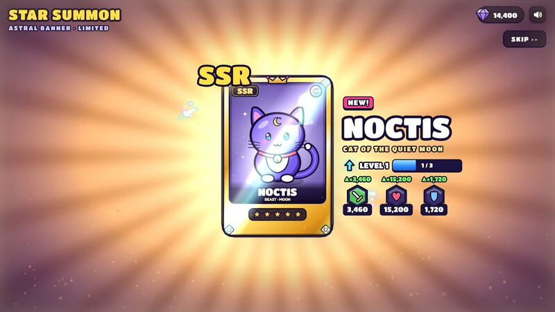</a></td>
</tr>
<tr>
<td width="50%" valign="top"><strong>Dance Motion Composed Across Tools</strong> <a href="https://x.com/sankakuten91256">@sankakuten91256</a> · Motion design 0:15 · Bookmarks 3,185 · Details pending <a href="https://guanmo-ai.github.io/awesome-ai-motion/?lang=en#case-2103483923783373039">▶ Play</a> · <a href="https://x.com/sankakuten91256/status/2103483923783373039">Original post</a></td>
<td width="50%" valign="top"><strong>A Game Card-Draw Animation</strong> <a href="https://x.com/op7418">@op7418</a> · Motion design 0:18 · Bookmarks 1,621 · Details pending <a href="https://guanmo-ai.github.io/awesome-ai-motion/?lang=en#case-2104085484347818226">▶ Play</a> · <a href="https://x.com/op7418/status/2104085484347818226">Original post</a></td>
</tr>
</tbody>
<tbody>
<tr>
<td width="50%" height="225" align="center" valign="middle"></td>
<td width="50%" height="225" align="center" valign="middle"></td>
</tr>
<tr>
<td width="50%" valign="top"><strong>An Imagined Short-Video Feed</strong> <a href="https://x.com/pleometric">@pleometric</a> · Motion design 0:47 · Bookmarks 1,318 · Details pending <a href="https://guanmo-ai.github.io/awesome-ai-motion/?lang=en#case-2102572941699354900">▶ Play</a> · <a href="https://x.com/pleometric/status/2102572941699354900">Original post</a></td>
<td width="50%" valign="top"><strong>Continuous Zoom Collage Motion</strong> <a href="https://x.com/koldo2k">@koldo2k</a> · Motion design 0:20 · Bookmarks 933 · Details pending <a href="https://guanmo-ai.github.io/awesome-ai-motion/?lang=en#case-2103129343253778767">▶ Play</a> · <a href="https://x.com/koldo2k/status/2103129343253778767">Original post</a></td>
</tr>
</tbody>
<tbody>
<tr>
<td width="50%" height="225" align="center" valign="middle"></td>
<td width="50%" height="225" align="center" valign="middle"></td>
</tr>
<tr>
<td width="50%" valign="top"><strong>Single-Model Animation Test</strong> <a href="https://x.com/LCSlates">@LCSlates</a> · Motion design 1:20 · Bookmarks 867 · Details pending <a href="https://guanmo-ai.github.io/awesome-ai-motion/?lang=en#case-2102503027340988559">▶ Play</a> · <a href="https://x.com/LCSlates/status/2102503027340988559">Original post</a></td>
<td width="50%" valign="top"><strong>One-File Generative Visual Demo</strong> <a href="https://x.com/JustinPerea">@JustinPerea</a> · Motion design 0:43 · Bookmarks 816 · Details pending <a href="https://guanmo-ai.github.io/awesome-ai-motion/?lang=en#case-2102893186330841502">▶ Play</a> · <a href="https://x.com/JustinPerea/status/2102893186330841502">Original post</a></td>
</tr>
</tbody>
<tbody>
<tr>
<td width="50%" height="225" align="center" valign="middle"></td>
<td width="50%" height="225" align="center" valign="middle"></td>
</tr>
<tr>
<td width="50%" valign="top"><strong>Frame drawn JavaScript animation</strong> <a href="https://x.com/strawhatsu4">@strawhatsu4</a> · Motion design 0:14 · Bookmarks 695 · Details pending <a href="https://guanmo-ai.github.io/awesome-ai-motion/?lang=en#case-2102457111787745405">▶ Play</a> · <a href="https://x.com/strawhatsu4/status/2102457111787745405">Original post</a></td>
<td width="50%" valign="top"><strong>Code generated cinematic test clip</strong> <a href="https://x.com/RileyRalmuto">@RileyRalmuto</a> · Motion design 0:16 · Bookmarks 475 · Details pending <a href="https://guanmo-ai.github.io/awesome-ai-motion/?lang=en#case-2102679018206052828">▶ Play</a> · <a href="https://x.com/RileyRalmuto/status/2102679018206052828">Original post</a></td>
</tr>
</tbody>
<tbody>
<tr>
<td width="50%" height="225" align="center" valign="middle"></td>
<td width="50%" height="225" align="center" valign="middle"></td>
</tr>
<tr>
<td width="50%" valign="top"><strong>Multi-Prompt Video with Sound</strong> <a href="https://x.com/dhruvalgolakiya">@dhruvalgolakiya</a> · Motion design 2:04 · Bookmarks 471 · Details pending <a href="https://guanmo-ai.github.io/awesome-ai-motion/?lang=en#case-2102733714845491558">▶ Play</a> · <a href="https://x.com/dhruvalgolakiya/status/2102733714845491558">Original post</a></td>
<td width="50%" valign="top"><strong>Fish Animation Built from Mosaic Tiles</strong> <a href="https://x.com/dfeinition">@dfeinition</a> · Motion design 1:20 · Bookmarks 458 · Details pending <a href="https://guanmo-ai.github.io/awesome-ai-motion/?lang=en#case-2102436001473786054">▶ Play</a> · <a href="https://x.com/dfeinition/status/2102436001473786054">Original post</a></td>
</tr>
</tbody>
<tbody>
<tr>
<td width="50%" height="225" align="center" valign="middle"><a href="https://guanmo-ai.github.io/awesome-ai-motion/?lang=en#case-2102878288008057171">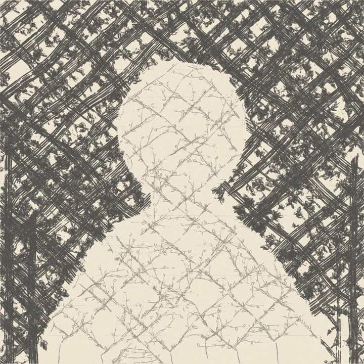</a></td>
<td width="50%" height="225" align="center" valign="middle"></td>
</tr>
<tr>
<td width="50%" valign="top"><strong>Code-Drawn Self-Portrait Sequence</strong> <a href="https://x.com/kevin_t_ngo">@kevin_t_ngo</a> · Motion design 0:20 · Bookmarks 456 · Details pending <a href="https://guanmo-ai.github.io/awesome-ai-motion/?lang=en#case-2102878288008057171">▶ Play</a> · <a href="https://x.com/kevin_t_ngo/status/2102878288008057171">Original post</a></td>
<td width="50%" valign="top"><strong>After Effects Treatment of AI Footage</strong> <a href="https://x.com/aicreataro">@aicreataro</a> · Motion design 0:15 · Bookmarks 433 · Details pending <a href="https://guanmo-ai.github.io/awesome-ai-motion/?lang=en#case-2102656273112326609">▶ Play</a> · <a href="https://x.com/aicreataro/status/2102656273112326609">Original post</a></td>
</tr>
</tbody>
<tbody>
<tr>
<td width="50%" height="225" align="center" valign="middle"></td>
<td width="50%" height="225" align="center" valign="middle"></td>
</tr>
<tr>
<td width="50%" valign="top"><strong>Abstract Animation of How a Model Feels</strong> <a href="https://x.com/AndrewOnXYZ">@AndrewOnXYZ</a> · Motion design 3:32 · Bookmarks 397 · Details pending <a href="https://guanmo-ai.github.io/awesome-ai-motion/?lang=en#case-2102817596009504849">▶ Play</a> · <a href="https://x.com/AndrewOnXYZ/status/2102817596009504849">Original post</a></td>
<td width="50%" valign="top"><strong>3D Recap of a Coding Session</strong> <a href="https://x.com/shneural">@shneural</a> · Motion design 0:56 · Bookmarks 391 · Details pending <a href="https://guanmo-ai.github.io/awesome-ai-motion/?lang=en#case-2103472385563459833">▶ Play</a> · <a href="https://x.com/shneural/status/2103472385563459833">Original post</a></td>
</tr>
</tbody>
<tbody>
<tr>
<td width="50%" height="225" align="center" valign="middle"></td>
<td width="50%" height="225" align="center" valign="middle"></td>
</tr>
<tr>
<td width="50%" valign="top"><strong>1990s-Style Audiovisual Demo</strong> <a href="https://x.com/gandamu_ml">@gandamu_ml</a> · Motion design 6:23 · Bookmarks 358 · Details pending <a href="https://guanmo-ai.github.io/awesome-ai-motion/?lang=en#case-2102919394775220530">▶ Play</a> · <a href="https://x.com/gandamu_ml/status/2102919394775220530">Original post</a></td>
<td width="50%" valign="top"><strong>One-Prompt Sand Animation</strong> <a href="https://x.com/Michaelzsguo">@Michaelzsguo</a> · Motion design 2:00 · Bookmarks 355 · Details pending <a href="https://guanmo-ai.github.io/awesome-ai-motion/?lang=en#case-2102592355165782312">▶ Play</a> · <a href="https://x.com/Michaelzsguo/status/2102592355165782312">Original post</a></td>
</tr>
</tbody>
<tbody>
<tr>
<td width="50%" height="225" align="center" valign="middle"></td>
<td width="50%" height="225" align="center" valign="middle"><a href="https://guanmo-ai.github.io/awesome-ai-motion/?lang=en#case-2105606322310054044">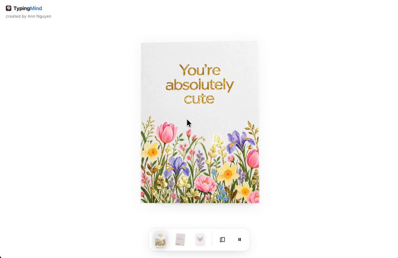</a></td>
</tr>
<tr>
<td width="50%" valign="top"><strong>Ink Painting Unfolding on Rice Paper</strong> <a href="https://x.com/AxtonLiu">@AxtonLiu</a> · Motion design 0:39 · Bookmarks 347 · Details pending <a href="https://guanmo-ai.github.io/awesome-ai-motion/?lang=en#case-2103288413969621231">▶ Play</a> · <a href="https://x.com/AxtonLiu/status/2103288413969621231">Original post</a></td>
<td width="50%" valign="top"><strong>A floral foil greeting card</strong> <a href="https://x.com/ann_nnng">@ann_nnng</a> · Motion design 0:23 · Bookmarks 245 · Details pending <a href="https://guanmo-ai.github.io/awesome-ai-motion/?lang=en#case-2105606322310054044">▶ Play</a> · <a href="https://x.com/ann_nnng/status/2105606322310054044">Original post</a></td>
</tr>
</tbody>
<tbody>
<tr>
<td width="50%" height="225" align="center" valign="middle"></td>
<td width="50%" height="225" align="center" valign="middle"></td>
</tr>
<tr>
<td width="50%" valign="top"><strong>Concept Film About an AI Work Plan</strong> <a href="https://x.com/chetaslua">@chetaslua</a> · Motion design 3:18 · Bookmarks 234 · Details pending <a href="https://guanmo-ai.github.io/awesome-ai-motion/?lang=en#case-2102717699600368045">▶ Play</a> · <a href="https://x.com/chetaslua/status/2102717699600368045">Original post</a></td>
<td width="50%" valign="top"><strong>One-Prompt Animation Experiment</strong> <a href="https://x.com/pivi___">@pivi___</a> · Motion design 0:33 · Bookmarks 233 · Details pending <a href="https://guanmo-ai.github.io/awesome-ai-motion/?lang=en#case-2103024907965612250">▶ Play</a> · <a href="https://x.com/pivi___/status/2103024907965612250">Original post</a></td>
</tr>
</tbody>
<tbody>
<tr>
<td width="50%" height="225" align="center" valign="middle"><a href="https://guanmo-ai.github.io/awesome-ai-motion/?lang=en#case-2106324559805010004">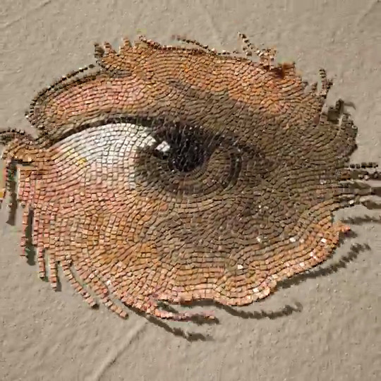</a></td>
<td width="50%" height="225" align="center" valign="middle"></td>
</tr>
<tr>
<td width="50%" valign="top"><strong>A 3D mosaic of the girl with a pearl</strong> <a href="https://x.com/redp314">@redp314</a> · Motion design 0:32 · Bookmarks 217 · Details pending <a href="https://guanmo-ai.github.io/awesome-ai-motion/?lang=en#case-2106324559805010004">▶ Play</a> · <a href="https://x.com/redp314/status/2106324559805010004">Original post</a></td>
<td width="50%" valign="top"><strong>Training Montage of an AI Model</strong> <a href="https://x.com/ishuagra02">@ishuagra02</a> · Motion design 0:30 · Bookmarks 195 · Details pending <a href="https://guanmo-ai.github.io/awesome-ai-motion/?lang=en#case-2102788371114246177">▶ Play</a> · <a href="https://x.com/ishuagra02/status/2102788371114246177">Original post</a></td>
</tr>
</tbody>
<tbody>
<tr>
<td width="50%" height="225" align="center" valign="middle"><a href="https://guanmo-ai.github.io/awesome-ai-motion/?lang=en#case-2106299981875347740">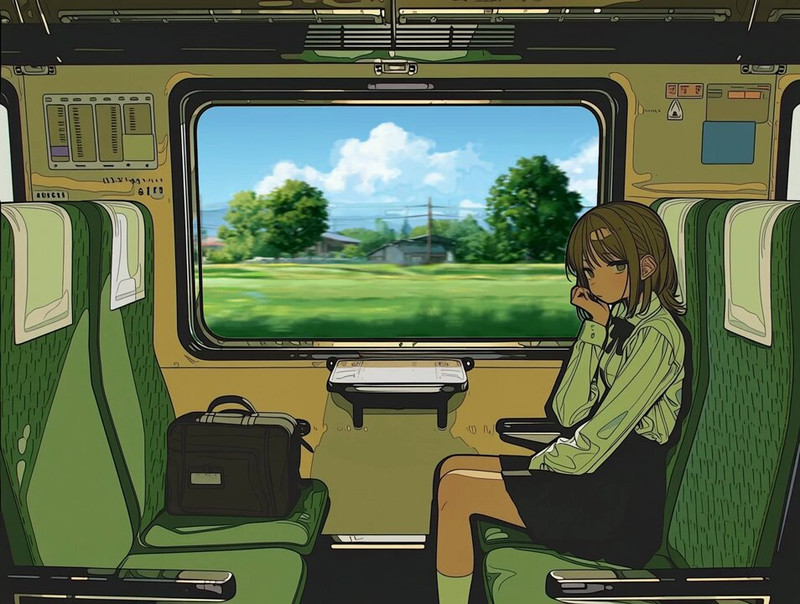</a></td>
<td width="50%" height="225" align="center" valign="middle"><a href="https://guanmo-ai.github.io/awesome-ai-motion/?lang=en#case-2102724347446305104">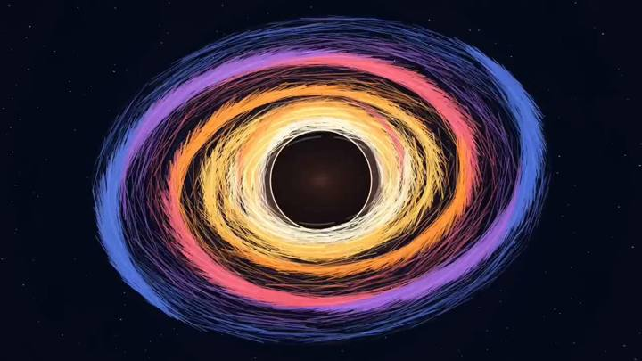</a></td>
</tr>
<tr>
<td width="50%" valign="top"><strong>A cinemagraph by a train window</strong> <a href="https://x.com/shironagasu_ai">@shironagasu_ai</a> · Motion design 0:10 · Bookmarks 161 · Details pending <a href="https://guanmo-ai.github.io/awesome-ai-motion/?lang=en#case-2106299981875347740">▶ Play</a> · <a href="https://x.com/shironagasu_ai/status/2106299981875347740">Original post</a></td>
<td width="50%" valign="top"><strong>Code Recreation of a Reference Film's Rhythm</strong> <a href="https://x.com/leo_xiaolei">@leo_xiaolei</a> · Motion design 0:28 · Bookmarks 140 · Details pending <a href="https://guanmo-ai.github.io/awesome-ai-motion/?lang=en#case-2102724347446305104">▶ Play</a> · <a href="https://x.com/leo_xiaolei/status/2102724347446305104">Original post</a></td>
</tr>
</tbody>
<tbody>
<tr>
<td width="50%" height="225" align="center" valign="middle"><a href="https://guanmo-ai.github.io/awesome-ai-motion/?lang=en#case-2104213302624821647">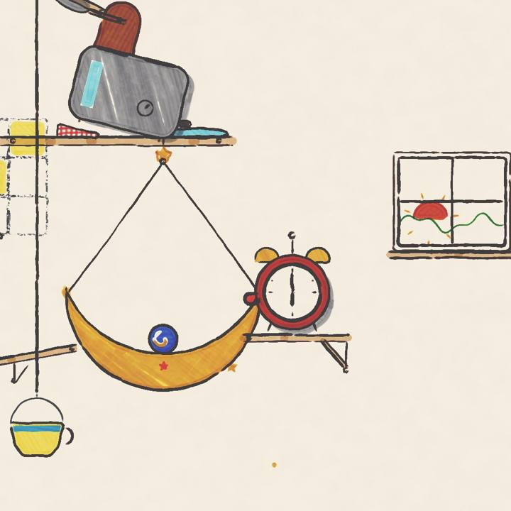</a></td>
<td width="50%" height="225" align="center" valign="middle"><a href="https://guanmo-ai.github.io/awesome-ai-motion/?lang=en#case-2103244081388503196">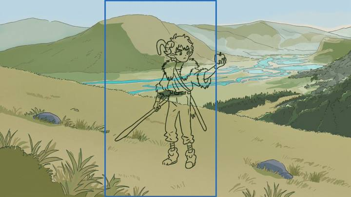</a></td>
</tr>
<tr>
<td width="50%" valign="top"><strong>Frame drawn narrated JavaScript animation</strong> <a href="https://x.com/kevin_t_ngo">@kevin_t_ngo</a> · Motion design 1:20 · Bookmarks 80 · Details pending <a href="https://guanmo-ai.github.io/awesome-ai-motion/?lang=en#case-2104213302624821647">▶ Play</a> · <a href="https://x.com/kevin_t_ngo/status/2104213302624821647">Original post</a></td>
<td width="50%" valign="top"><strong>Line-Drawing Timing and Compositing Test</strong> <a href="https://x.com/araminta_k">@araminta_k</a> · Motion design 0:25 · Bookmarks 78 · Details pending <a href="https://guanmo-ai.github.io/awesome-ai-motion/?lang=en#case-2103244081388503196">▶ Play</a> · <a href="https://x.com/araminta_k/status/2103244081388503196">Original post</a></td>
</tr>
</tbody>
<tbody>
<tr>
<td width="50%" height="225" align="center" valign="middle"></td>
<td width="50%" height="225" align="center" valign="middle"></td>
</tr>
<tr>
<td width="50%" valign="top"><strong>Anidoodle: code-drawn motion and music</strong> <a href="https://x.com/alexgreensh">@alexgreensh</a> · Motion design 0:31 · Bookmarks 73 · Details pending <a href="https://guanmo-ai.github.io/awesome-ai-motion/?lang=en#case-2107086004964282814">▶ Play</a> · <a href="https://x.com/alexgreensh/status/2107086004964282814">Original post</a></td>
<td width="50%" valign="top"><strong>Two 15-second motion-design trials</strong> <a href="https://x.com/mesmerlord">@mesmerlord</a> · Motion design 0:15 · Bookmarks 65 · Details pending <a href="https://guanmo-ai.github.io/awesome-ai-motion/?lang=en#case-2105758042830549235">▶ Play</a> · <a href="https://x.com/mesmerlord/status/2105758042830549235">Original post</a></td>
</tr>
</tbody>
<tbody>
<tr>
<td width="50%" height="225" align="center" valign="middle"><a href="https://guanmo-ai.github.io/awesome-ai-motion/?lang=en#case-2104728379798827135">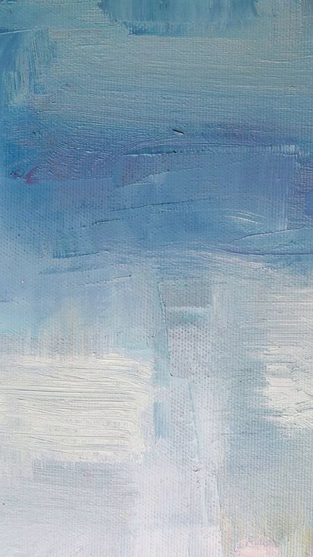</a></td>
<td width="50%" height="225" align="center" valign="middle"></td>
</tr>
<tr>
<td width="50%" valign="top"><strong>A Single-Prompt HyperFrames Motion Test</strong> <a href="https://x.com/leandroriviello">@leandroriviello</a> · Motion design 0:14 · Bookmarks 52 · Details pending <a href="https://guanmo-ai.github.io/awesome-ai-motion/?lang=en#case-2104728379798827135">▶ Play</a> · <a href="https://x.com/leandroriviello/status/2104728379798827135">Original post</a></td>
<td width="50%" valign="top"><strong>Code Animation of an Ant Colony</strong> <a href="https://x.com/hanifproduktif">@hanifproduktif</a> · Motion design 0:32 · Bookmarks 31 · Details pending <a href="https://guanmo-ai.github.io/awesome-ai-motion/?lang=en#case-2102742924148830211">▶ Play</a> · <a href="https://x.com/hanifproduktif/status/2102742924148830211">Original post</a></td>
</tr>
</tbody>
<tbody>
<tr>
<td width="50%" height="225" align="center" valign="middle"></td>
<td width="50%" height="225" align="center" valign="middle"></td>
</tr>
<tr>
<td width="50%" valign="top"><strong>Local Session History Becomes Animation</strong> <a href="https://x.com/jake11moran">@jake11moran</a> · Motion design 0:53 · Bookmarks 29 · Details pending <a href="https://guanmo-ai.github.io/awesome-ai-motion/?lang=en#case-2103247490237825416">▶ Play</a> · <a href="https://x.com/jake11moran/status/2103247490237825416">Original post</a></td>
<td width="50%" valign="top"><strong>An OpenAI-dot character comparison</strong> <a href="https://x.com/kepochnik">@kepochnik</a> · Motion design 0:18 · Bookmarks 11 · Details pending <a href="https://guanmo-ai.github.io/awesome-ai-motion/?lang=en#case-2107443775232438381">▶ Play</a> · <a href="https://x.com/kepochnik/status/2107443775232438381">Original post</a></td>
</tr>
</tbody>
<tbody>
<tr>
<td width="50%" height="225" align="center" valign="middle"><a href="https://guanmo-ai.github.io/awesome-ai-motion/?lang=en#case-2107484860717973791">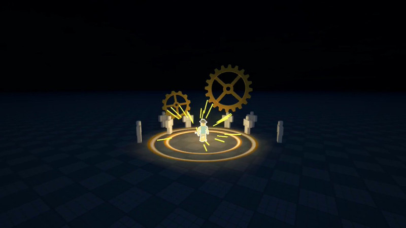</a></td>
<td width="50%" height="225" align="center" valign="middle"><a href="https://guanmo-ai.github.io/awesome-ai-motion/?lang=en#case-2107592216126411062">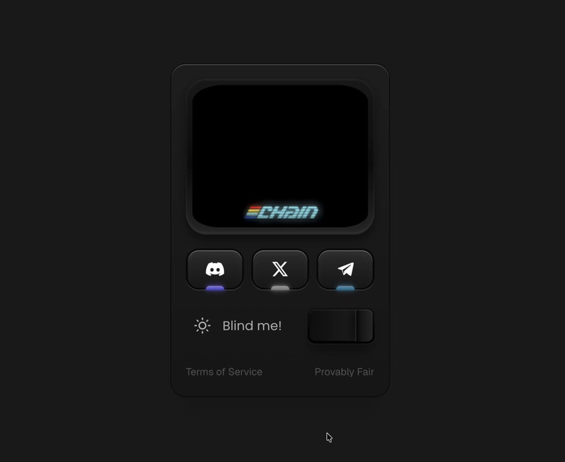</a></td>
</tr>
<tr>
<td width="50%" valign="top"><strong>A Roblox magical-effects refinement</strong> <a href="https://x.com/JohnKlerAI">@JohnKlerAI</a> · Motion design 0:06 · Bookmarks 9 · Details pending <a href="https://guanmo-ai.github.io/awesome-ai-motion/?lang=en#case-2107484860717973791">▶ Play</a> · <a href="https://x.com/JohnKlerAI/status/2107484860717973791">Original post</a></td>
<td width="50%" valign="top"><strong>DVD-inspired motion on an existing UI</strong> <a href="https://x.com/AdamPolify">@AdamPolify</a> · Motion design 0:08 · Bookmarks 7 · Details pending <a href="https://guanmo-ai.github.io/awesome-ai-motion/?lang=en#case-2107592216126411062">▶ Play</a> · <a href="https://x.com/AdamPolify/status/2107592216126411062">Original post</a></td>
</tr>
</tbody>
<tbody>
<tr>
<td width="50%" height="225" align="center" valign="middle"><a href="https://guanmo-ai.github.io/awesome-ai-motion/?lang=en#case-2108510836981445009">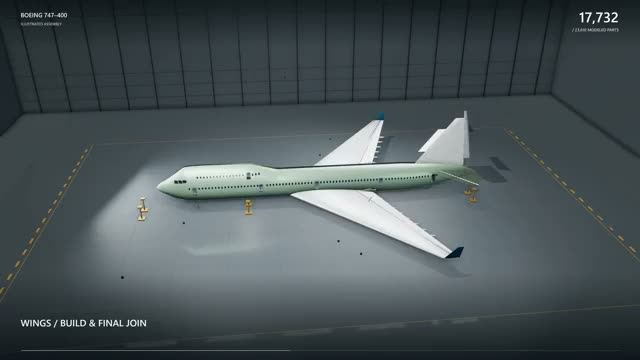</a></td>
<td width="50%" height="225" align="center" valign="middle"></td>
</tr>
<tr>
<td width="50%" valign="top"><strong>Boeing 747 Parts Assembly</strong> <a href="https://x.com/misat0x">@misat0x</a> · Motion design 1:00 · Bookmarks 7 · Details pending <a href="https://guanmo-ai.github.io/awesome-ai-motion/?lang=en#case-2108510836981445009">▶ Play</a> · <a href="https://x.com/misat0x/status/2108510836981445009">Original post</a></td>
<td width="50%" valign="top"><strong>A 360-degree character orbit from one photo</strong> <a href="https://x.com/FiniYang">@FiniYang</a> · Motion design 0:03 · Bookmarks 7 · Details pending <a href="https://guanmo-ai.github.io/awesome-ai-motion/?lang=en#case-2107423625175593319">▶ Play</a> · <a href="https://x.com/FiniYang/status/2107423625175593319">Original post</a></td>
</tr>
</tbody>
<tbody>
<tr>
<td width="50%" height="225" align="center" valign="middle"><a href="https://guanmo-ai.github.io/awesome-ai-motion/?lang=en#case-2108509416819654704">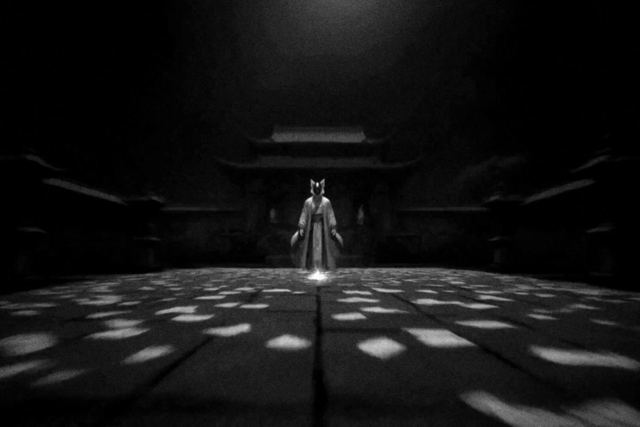</a></td>
<td width="50%" height="225" align="center" valign="middle"></td>
</tr>
<tr>
<td width="50%" valign="top"><strong>A Katana Editing Experiment with RED Material</strong> <a href="https://x.com/KanaWorks_AI">@KanaWorks_AI</a> · Motion design 0:20 · Bookmarks 5 · Details pending <a href="https://guanmo-ai.github.io/awesome-ai-motion/?lang=en#case-2108509416819654704">▶ Play</a> · <a href="https://x.com/KanaWorks_AI/status/2108509416819654704">Original post</a></td>
<td width="50%" valign="top"><strong>Motion: Typography as a Function of Time</strong> <a href="https://x.com/lochan_twt">@lochan_twt</a> · Motion design 0:16 · Bookmarks 3 · Details pending <a href="https://guanmo-ai.github.io/awesome-ai-motion/?lang=en#case-2107796331561730439">▶ Play</a> · <a href="https://x.com/lochan_twt/status/2107796331561730439">Original post</a></td>
</tr>
</tbody>
<tbody>
<tr>
<td width="50%" height="225" align="center" valign="middle"><a href="https://guanmo-ai.github.io/awesome-ai-motion/?lang=en#case-2107641558073803075">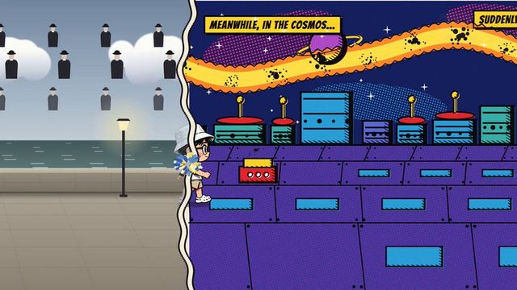</a></td>
<td width="50%" height="225" align="center" valign="middle"></td>
</tr>
<tr>
<td width="50%" valign="top"><strong>One Character across Comics, Pixels and Vaporwave</strong> <a href="https://x.com/AlchainHust">@AlchainHust</a> · Motion design 0:20 · Bookmarks 3 · Details pending <a href="https://guanmo-ai.github.io/awesome-ai-motion/?lang=en#case-2107641558073803075">▶ Play</a> · <a href="https://x.com/AlchainHust/status/2107641558073803075">Original post</a></td>
<td width="50%" valign="top"><strong>Five angle AI avatar edit</strong> <a href="https://x.com/nakazakifam">@nakazakifam</a> · Motion design 0:21 · Bookmarks 3 · Details pending <a href="https://guanmo-ai.github.io/awesome-ai-motion/?lang=en#case-2104231262600700140">▶ Play</a> · <a href="https://x.com/nakazakifam/status/2104231262600700140">Original post</a></td>
</tr>
</tbody>
<tbody>
<tr>
<td width="50%" height="225" align="center" valign="middle"></td>
<td width="50%" height="225" align="center" valign="middle"></td>
</tr>
<tr>
<td width="50%" valign="top"><strong>Animated Rain on a Street Photo</strong> <a href="https://x.com/yangfei33113">@yangfei33113</a> · Motion design 0:38 · Bookmarks 3 · Details pending <a href="https://guanmo-ai.github.io/awesome-ai-motion/?lang=en#case-2102611841122017632">▶ Play</a> · <a href="https://x.com/yangfei33113/status/2102611841122017632">Original post</a></td>
<td width="50%" valign="top"><strong>Code Extension of an Earlier Motion Piece</strong> <a href="https://x.com/elianiva_">@elianiva_</a> · Motion design 0:26 · Bookmarks 2 · Details pending <a href="https://guanmo-ai.github.io/awesome-ai-motion/?lang=en#case-2103003425915195750">▶ Play</a> · <a href="https://x.com/elianiva_/status/2103003425915195750">Original post</a></td>
</tr>
</tbody>
<tbody>
<tr>
<td width="50%" height="225" align="center" valign="middle"></td>
<td width="50%" height="225" align="center" valign="middle"><a href="https://guanmo-ai.github.io/awesome-ai-motion/?lang=en#case-2108920438244143547">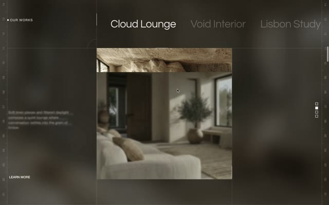</a></td>
</tr>
<tr>
<td width="50%" valign="top"><strong>A 15-second Opus geometric-motion comparison</strong> <a href="https://x.com/mesmerlord">@mesmerlord</a> · Motion design 0:15 · Bookmarks 2 · Details pending <a href="https://guanmo-ai.github.io/awesome-ai-motion/?lang=en#case-2105766824558174486">▶ Play</a> · <a href="https://x.com/mesmerlord/status/2105766824558174486">Original post</a></td>
<td width="50%" valign="top"><strong>Portfolio Work Section Transition</strong> <a href="https://x.com/adamhmwn">@adamhmwn</a> · Motion design 0:05 · Bookmarks 2 · Details pending <a href="https://guanmo-ai.github.io/awesome-ai-motion/?lang=en#case-2108920438244143547">▶ Play</a> · <a href="https://x.com/adamhmwn/status/2108920438244143547">Original post</a></td>
</tr>
</tbody>
<tbody>
<tr>
<td width="50%" height="225" align="center" valign="middle"></td>
<td width="50%" height="225" align="center" valign="middle"></td>
</tr>
<tr>
<td width="50%" valign="top"><strong>A Chrome Knot: Bloom, Break and Reassemble</strong> <a href="https://x.com/gogu_name">@gogu_name</a> · Motion design 0:15 · Bookmarks 2 · Details pending <a href="https://guanmo-ai.github.io/awesome-ai-motion/?lang=en#case-2104347638883873255">▶ Play</a> · <a href="https://x.com/gogu_name/status/2104347638883873255">Original post</a></td>
<td width="50%" valign="top"><strong>A Fictional Company 3D End Logo</strong> <a href="https://x.com/arumii_movie">@arumii_movie</a> · Motion design 0:15 · Bookmarks 1 · Details pending <a href="https://guanmo-ai.github.io/awesome-ai-motion/?lang=en#case-2107737607908249613">▶ Play</a> · <a href="https://x.com/arumii_movie/status/2107737607908249613">Original post</a></td>
</tr>
</tbody>
<tbody>
<tr>
<td width="50%" height="225" align="center" valign="middle"></td>
<td width="50%" height="225" align="center" valign="middle"></td>
</tr>
<tr>
<td width="50%" valign="top"><strong>HyperFrames motion with code-composed audio</strong> <a href="https://x.com/Dheepanratnam">@Dheepanratnam</a> · Motion design 0:58 · Bookmarks 1 · Details pending <a href="https://guanmo-ai.github.io/awesome-ai-motion/?lang=en#case-2107568904075706454">▶ Play</a> · <a href="https://x.com/Dheepanratnam/status/2107568904075706454">Original post</a></td>
<td width="50%" valign="top"><strong>Animated Overlay on a Spinning Cup</strong> <a href="https://x.com/AnduArtist">@AnduArtist</a> · Motion design 0:15 · Bookmarks 1 · Details pending <a href="https://guanmo-ai.github.io/awesome-ai-motion/?lang=en#case-2102548178646016377">▶ Play</a> · <a href="https://x.com/AnduArtist/status/2102548178646016377">Original post</a></td>
</tr>
</tbody>
<tbody>
<tr>
<td width="50%" height="225" align="center" valign="middle"></td>
<td width="50%" height="225" align="center" valign="middle"><a href="https://guanmo-ai.github.io/awesome-ai-motion/?lang=en#case-2107863174095769958">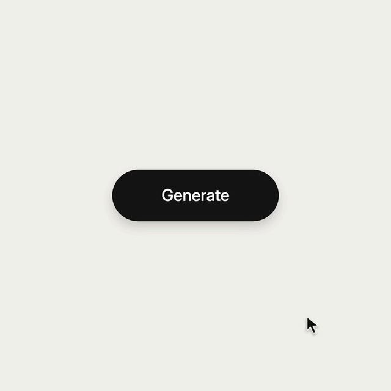</a></td>
</tr>
<tr>
<td width="50%" valign="top"><strong>One Character Across Multiple Animation Styles</strong> <a href="https://x.com/ianstig">@ianstig</a> · Motion design 2:11 · Bookmarks 1 · Details pending <a href="https://x.com/ianstig/status/2103169675928764486">▶ Watch on X</a> · <a href="https://x.com/ianstig/status/2103169675928764486">Original post</a></td>
<td width="50%" valign="top"><strong>One Shape through Five UI States</strong> <a href="https://x.com/zheng_qili666">@zheng_qili666</a> · Motion design 0:14 · Bookmarks 1 · Details pending <a href="https://guanmo-ai.github.io/awesome-ai-motion/?lang=en#case-2107863174095769958">▶ Play</a> · <a href="https://x.com/zheng_qili666/status/2107863174095769958">Original post</a></td>
</tr>
</tbody>
<tbody>
<tr>
<td width="50%" height="225" align="center" valign="middle"><a href="https://guanmo-ai.github.io/awesome-ai-motion/?lang=en#case-2108487186777846023">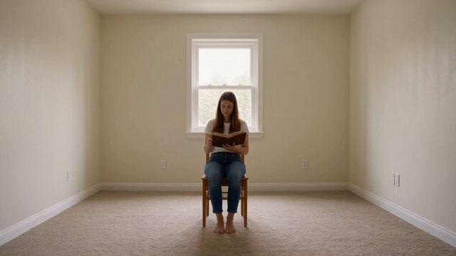</a></td>
<td width="50%" height="225" align="center" valign="middle"></td>
</tr>
<tr>
<td width="50%" valign="top"><strong>A Kling-generated Compositing Breakdown</strong> <a href="https://x.com/onofumi_AI">@onofumi_AI</a> · Motion design 0:10 · Bookmarks 0 · Details pending <a href="https://guanmo-ai.github.io/awesome-ai-motion/?lang=en#case-2108487186777846023">▶ Play</a> · <a href="https://x.com/onofumi_AI/status/2108487186777846023">Original post</a></td>
<td width="50%" valign="top"><strong>Drawn imaginary engraving animation</strong> <a href="https://x.com/illodevcode">@illodevcode</a> · Motion design 1:04 · Bookmarks 0 · Details pending <a href="https://guanmo-ai.github.io/awesome-ai-motion/?lang=en#case-2104214763358015565">▶ Play</a> · <a href="https://x.com/illodevcode/status/2104214763358015565">Original post</a></td>
</tr>
</tbody>
<tbody>
<tr>
<td width="50%" height="225" align="center" valign="middle"><a href="https://guanmo-ai.github.io/awesome-ai-motion/?lang=en#case-2107790132061622720">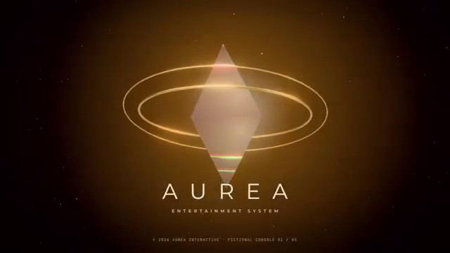</a></td>
<td width="50%" height="225" align="center" valign="middle"><a href="https://guanmo-ai.github.io/awesome-ai-motion/?lang=en#case-2103992442072813651">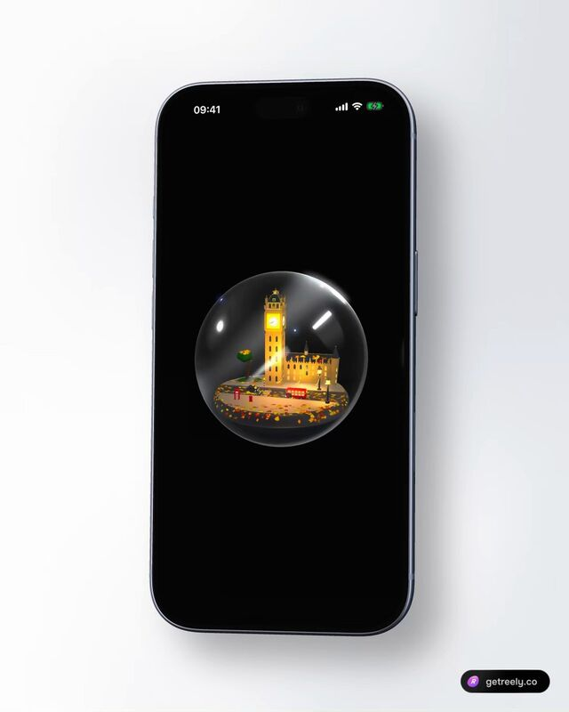</a></td>
</tr>
<tr>
<td width="50%" valign="top"><strong>A Fictional Game-console Startup Logo</strong> <a href="https://x.com/arumii_movie">@arumii_movie</a> · Motion design 0:25 · Bookmarks 0 · Details pending <a href="https://guanmo-ai.github.io/awesome-ai-motion/?lang=en#case-2107790132061622720">▶ Play</a> · <a href="https://x.com/arumii_movie/status/2107790132061622720">Original post</a></td>
<td width="50%" valign="top"><strong>A London Snow Globe in Swift</strong> <a href="https://x.com/eigeorguy">@eigeorguy</a> · Motion design 0:06 · Bookmarks 0 · Details pending <a href="https://guanmo-ai.github.io/awesome-ai-motion/?lang=en#case-2103992442072813651">▶ Play</a> · <a href="https://x.com/eigeorguy/status/2103992442072813651">Original post</a></td>
</tr>
</tbody>
<tbody>
<tr>
<td width="50%" height="225" align="center" valign="middle"><a href="https://guanmo-ai.github.io/awesome-ai-motion/?lang=en#case-2107649731229094304">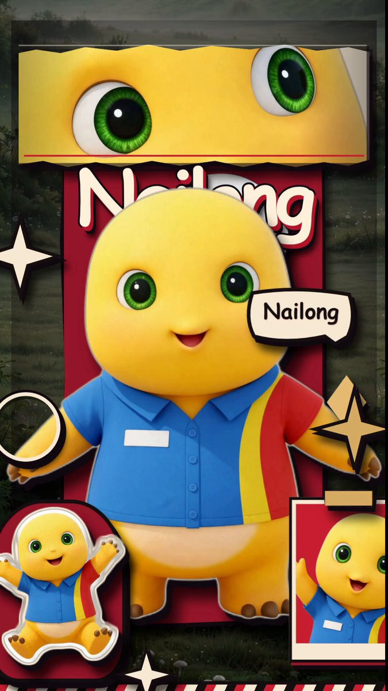</a></td>
<td width="50%" height="225" align="center" valign="middle"></td>
</tr>
<tr>
<td width="50%" valign="top"><strong>Nailong in a 2.5D beat edit</strong> <a href="https://x.com/tirtaVEX">@tirtaVEX</a> · Motion design 0:28 · Bookmarks 0 · Details pending <a href="https://guanmo-ai.github.io/awesome-ai-motion/?lang=en#case-2107649731229094304">▶ Play</a> · <a href="https://x.com/tirtaVEX/status/2107649731229094304">Original post</a></td>
<td width="50%" valign="top"><strong>Particle typography: Opus animation and Fable text</strong> <a href="https://x.com/mszzz0011">@mszzz0011</a> · Motion design 0:20 · Bookmarks 0 · Details pending <a href="https://guanmo-ai.github.io/awesome-ai-motion/?lang=en#case-2106040056616239235">▶ Play</a> · <a href="https://x.com/mszzz0011/status/2106040056616239235">Original post</a></td>
</tr>
</tbody>
<tbody>
<tr>
<td width="50%" height="225" align="center" valign="middle"><a href="https://guanmo-ai.github.io/awesome-ai-motion/?lang=en#case-2107499130536763520">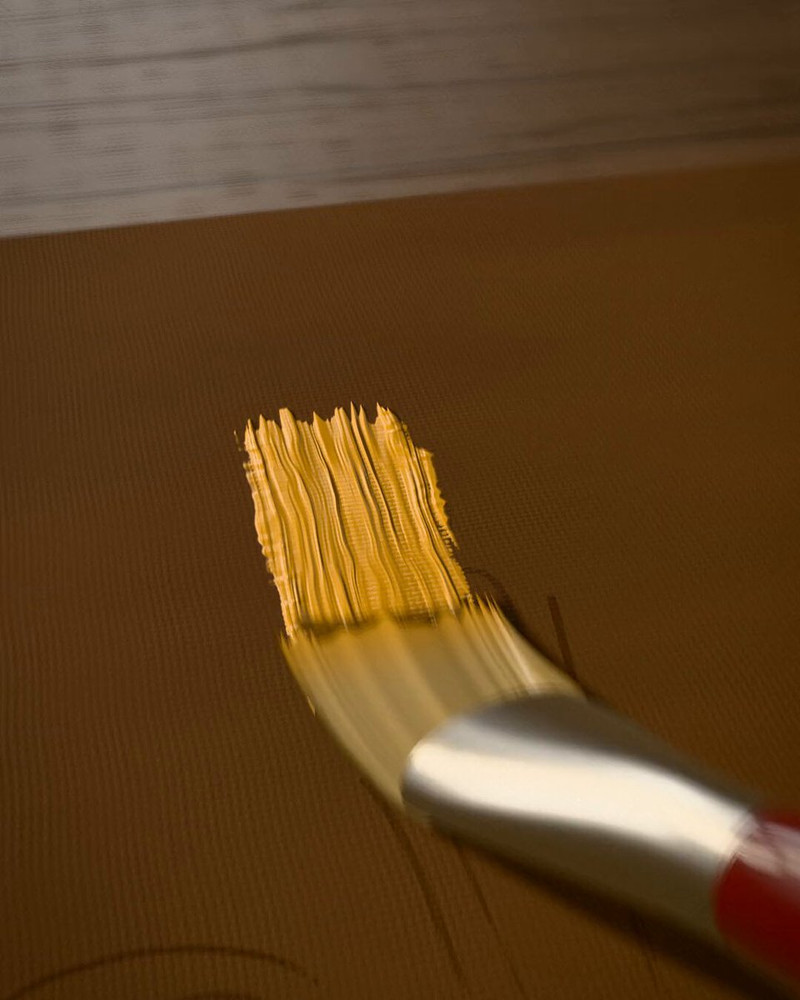</a></td>
<td width="50%" height="225" align="center" valign="middle"><a href="https://guanmo-ai.github.io/awesome-ai-motion/?lang=en#case-2108150684176863482">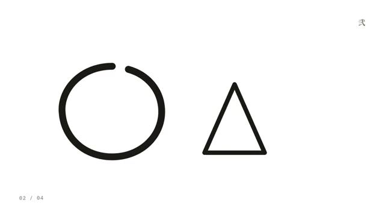</a></td>
</tr>
<tr>
<td width="50%" valign="top"><strong>A 365-brushstroke painting replay</strong> <a href="https://x.com/redp314">@redp314</a> · Motion design 0:32 · Bookmarks 0 · Details pending <a href="https://guanmo-ai.github.io/awesome-ai-motion/?lang=en#case-2107499130536763520">▶ Play</a> · <a href="https://x.com/redp314/status/2107499130536763520">Original post</a></td>
<td width="50%" valign="top"><strong>A Circle-and-triangle Code Animation Test</strong> <a href="https://x.com/karoukun_ai">@karoukun_ai</a> · Motion design 0:15 · Bookmarks 0 · Details pending <a href="https://guanmo-ai.github.io/awesome-ai-motion/?lang=en#case-2108150684176863482">▶ Play</a> · <a href="https://x.com/karoukun_ai/status/2108150684176863482">Original post</a></td>
</tr>
</tbody>
<tbody>
<tr>
<td width="50%" height="225" align="center" valign="middle"><a href="https://guanmo-ai.github.io/awesome-ai-motion/?lang=en#case-2104756133558984946">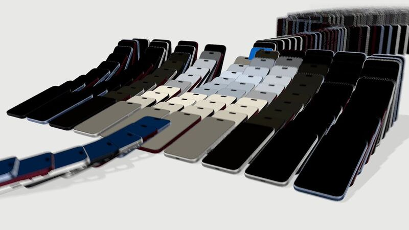</a></td>
<td width="50%" height="225" align="center" valign="middle"><a href="https://guanmo-ai.github.io/awesome-ai-motion/?lang=en#case-2107667218326835369">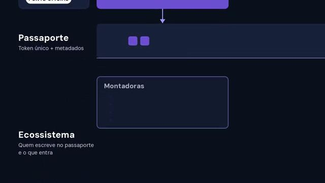</a></td>
</tr>
<tr>
<td width="50%" valign="top"><strong>12,346 iPhones in a Domino Animation</strong> <a href="https://x.com/paojiaofty">@paojiaofty</a> · Motion design 0:26 · Bookmarks 0 · Details pending <a href="https://guanmo-ai.github.io/awesome-ai-motion/?lang=en#case-2104756133558984946">▶ Play</a> · <a href="https://x.com/paojiaofty/status/2104756133558984946">Original post</a></td>
<td width="50%" valign="top"><strong>A Portuguese Vehicle-registration Motion Test</strong> <a href="https://x.com/SquareOnChain">@SquareOnChain</a> · Motion design 0:55 · Bookmarks 0 · Details pending <a href="https://guanmo-ai.github.io/awesome-ai-motion/?lang=en#case-2107667218326835369">▶ Play</a> · <a href="https://x.com/SquareOnChain/status/2107667218326835369">Original post</a></td>
</tr>
</tbody>
<tbody>
<tr>
<td width="50%" height="225" align="center" valign="middle"></td>
<td width="50%" height="225" align="center" valign="middle"></td>
</tr>
<tr>
<td width="50%" valign="top"><strong>A Side-by-side Codex Motion Recreation</strong> <a href="https://x.com/TTDD686">@TTDD686</a> · Motion design 0:50 · Bookmarks 0 · Details pending <a href="https://guanmo-ai.github.io/awesome-ai-motion/?lang=en#case-2108447153098207345">▶ Play</a> · <a href="https://x.com/TTDD686/status/2108447153098207345">Original post</a></td>
<td width="50%" valign="top"><strong>Roblox Radial Effects Showcase</strong> <a href="https://x.com/JohnKlerAI">@JohnKlerAI</a> · Motion design 0:05 · Bookmarks 0 · Details pending <a href="https://guanmo-ai.github.io/awesome-ai-motion/?lang=en#case-2108929788517789892">▶ Play</a> · <a href="https://x.com/JohnKlerAI/status/2108929788517789892">Original post</a></td>
</tr>
</tbody>
<tbody>
<tr>
<td width="50%" height="225" align="center" valign="middle"></td>
<td width="50%" height="225" align="center" valign="middle"></td>
</tr>
<tr>
<td width="50%" valign="top"><strong>Multi-Round After Effects Production Test</strong> <a href="https://x.com/throughiris_">@throughiris_</a> · Motion design 0:12 · Bookmarks 0 · Details pending <a href="https://guanmo-ai.github.io/awesome-ai-motion/?lang=en#case-2102911234526048706">▶ Play</a> · <a href="https://x.com/throughiris_/status/2102911234526048706">Original post</a></td>
<td width="50%" valign="top"><strong>HyperFrames motion graphics experiment</strong> <a href="https://x.com/mukhtharcm">@mukhtharcm</a> · Motion design 1:08 · Bookmarks 0 · Details pending <a href="https://guanmo-ai.github.io/awesome-ai-motion/?lang=en#case-2104235944383803495">▶ Play</a> · <a href="https://x.com/mukhtharcm/status/2104235944383803495">Original post</a></td>
</tr>
</tbody>
<tbody>
<tr>
<td width="50%" height="225" align="center" valign="middle"><a href="https://guanmo-ai.github.io/awesome-ai-motion/?lang=en#case-2104763812733981142">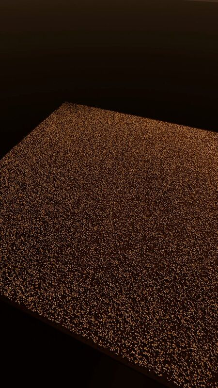</a></td>
<td width="50%" height="225" align="center" valign="middle"><a href="https://guanmo-ai.github.io/awesome-ai-motion/?lang=en#case-2104776177609293975">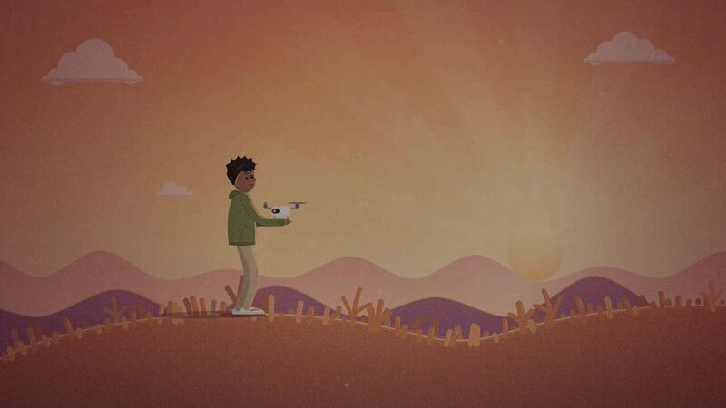</a></td>
</tr>
<tr>
<td width="50%" valign="top"><strong>Gold Dust and Chladni Patterns</strong> <a href="https://x.com/park_danie36173">@park_danie36173</a> · Motion design 0:30 · Bookmarks 0 · Details pending <a href="https://guanmo-ai.github.io/awesome-ai-motion/?lang=en#case-2104763812733981142">▶ Play</a> · <a href="https://x.com/park_danie36173/status/2104763812733981142">Original post</a></td>
<td width="50%" valign="top"><strong>Design Builder Introduction</strong> <a href="https://x.com/Prathamesh_812">@Prathamesh_812</a> · Motion design 0:15 · Bookmarks 0 · Details pending <a href="https://guanmo-ai.github.io/awesome-ai-motion/?lang=en#case-2104776177609293975">▶ Play</a> · <a href="https://x.com/Prathamesh_812/status/2104776177609293975">Original post</a></td>
</tr>
</tbody>
<tbody>
<tr>
<td width="50%" height="225" align="center" valign="middle"><a href="https://guanmo-ai.github.io/awesome-ai-motion/?lang=en#case-2104837895773417649">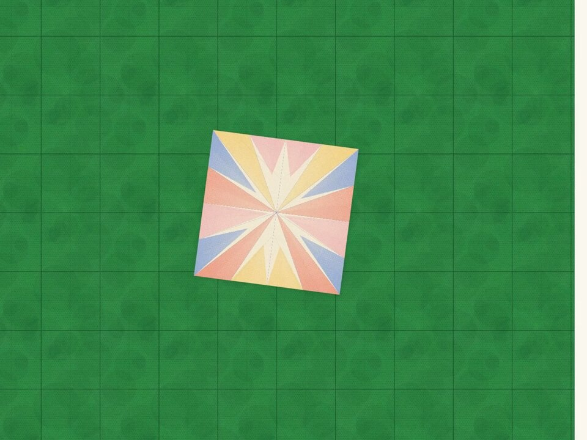</a></td>
<td width="50%" height="225" align="center" valign="middle"></td>
</tr>
<tr>
<td width="50%" valign="top"><strong>A Paper-Folding Launch Film in One HTML Page</strong> <a href="https://x.com/Vignesh_rav">@Vignesh_rav</a> · Motion design 0:13 · Bookmarks 0 · Details pending <a href="https://guanmo-ai.github.io/awesome-ai-motion/?lang=en#case-2104837895773417649">▶ Play</a> · <a href="https://x.com/Vignesh_rav/status/2104837895773417649">Original post</a></td>
<td width="50%" valign="top"><strong>From pencil architecture to a 3D model</strong> <a href="https://x.com/studiotimfu">@studiotimfu</a> · Motion design 0:26 · Bookmarks 0 · Details pending <a href="https://guanmo-ai.github.io/awesome-ai-motion/?lang=en#case-2105683672737145017">▶ Play</a> · <a href="https://x.com/studiotimfu/status/2105683672737145017">Original post</a></td>
</tr>
</tbody>
<tbody>
<tr>
<td width="50%" height="225" align="center" valign="middle"></td>
<td width="50%" height="225" align="center" valign="middle"></td>
</tr>
<tr>
<td width="50%" valign="top"><strong>A code-rendered neon city in the rain</strong> <a href="https://x.com/0xInsiderf5">@0xInsiderf5</a> · Motion design 0:15 · Bookmarks 0 · Details pending <a href="https://guanmo-ai.github.io/awesome-ai-motion/?lang=en#case-2106056138894479482">▶ Play</a> · <a href="https://x.com/0xInsiderf5/status/2106056138894479482">Original post</a></td>
<td width="50%" valign="top"><strong>A vending-machine service-menu animation</strong> <a href="https://x.com/ux_vlad">@ux_vlad</a> · Motion design 0:15 · Bookmarks 0 · Details pending <a href="https://guanmo-ai.github.io/awesome-ai-motion/?lang=en#case-2106068105894207525">▶ Play</a> · <a href="https://x.com/ux_vlad/status/2106068105894207525">Original post</a></td>
</tr>
</tbody>
<tbody>
<tr>
<td width="50%" height="225" align="center" valign="middle"><a href="https://guanmo-ai.github.io/awesome-ai-motion/?lang=en#case-2106462870745534946">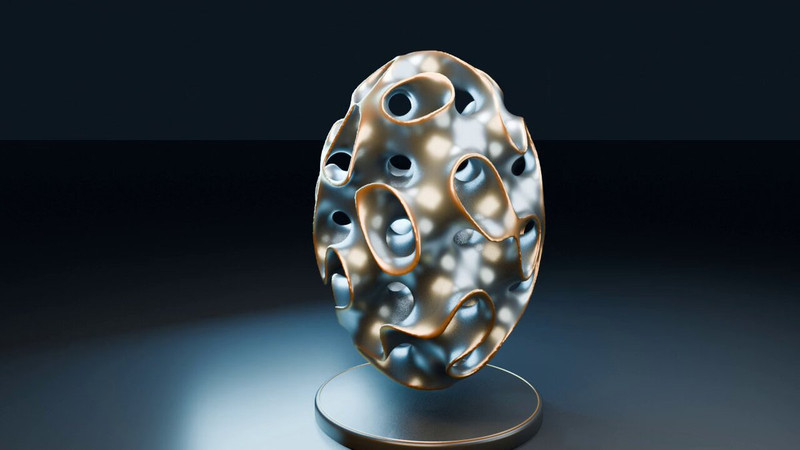</a></td>
<td width="50%" height="225" align="center" valign="middle"><a href="https://guanmo-ai.github.io/awesome-ai-motion/?lang=en#case-2107500032538575272">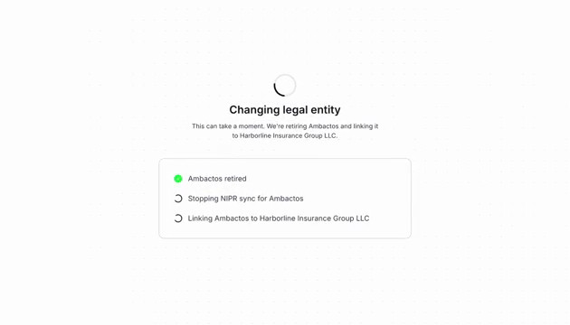</a></td>
</tr>
<tr>
<td width="50%" valign="top"><strong>A fly-through of a gyroid-inspired metallic form</strong> <a href="https://x.com/CsaplarD">@CsaplarD</a> · Motion design 0:22 · Bookmarks 0 · Details pending <a href="https://guanmo-ai.github.io/awesome-ai-motion/?lang=en#case-2106462870745534946">▶ Play</a> · <a href="https://x.com/CsaplarD/status/2106462870745534946">Original post</a></td>
<td width="50%" valign="top"><strong>A loading-to-success interface animation</strong> <a href="https://x.com/briangulo_">@briangulo_</a> · Motion design 0:06 · Bookmarks 0 · Details pending <a href="https://guanmo-ai.github.io/awesome-ai-motion/?lang=en#case-2107500032538575272">▶ Play</a> · <a href="https://x.com/briangulo_/status/2107500032538575272">Original post</a></td>
</tr>
</tbody>
<tbody>
<tr>
<td width="50%" height="225" align="center" valign="middle"><a href="https://guanmo-ai.github.io/awesome-ai-motion/?lang=en#case-2107581288265711900">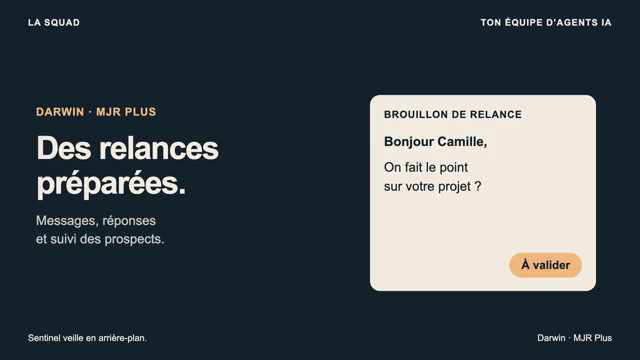</a></td>
<td width="50%" height="225" align="center" valign="middle"><a href="https://guanmo-ai.github.io/awesome-ai-motion/?lang=en#case-2107582341182861643">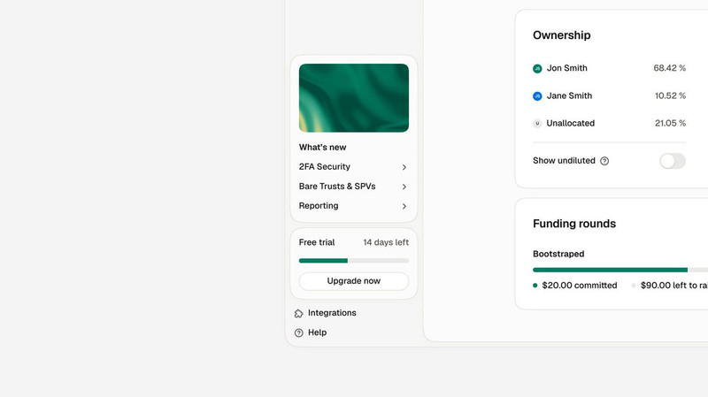</a></td>
</tr>
<tr>
<td width="50%" valign="top"><strong>An Astra and Remotion motion experiment</strong> <a href="https://x.com/MathryxAI">@MathryxAI</a> · Motion design 0:24 · Bookmarks 0 · Details pending <a href="https://guanmo-ai.github.io/awesome-ai-motion/?lang=en#case-2107581288265711900">▶ Play</a> · <a href="https://x.com/MathryxAI/status/2107581288265711900">Original post</a></td>
<td width="50%" valign="top"><strong>Shader motion on a hand-crafted UI</strong> <a href="https://x.com/artabrarov">@artabrarov</a> · Motion design 0:18 · Bookmarks 0 · Details pending <a href="https://guanmo-ai.github.io/awesome-ai-motion/?lang=en#case-2107582341182861643">▶ Play</a> · <a href="https://x.com/artabrarov/status/2107582341182861643">Original post</a></td>
</tr>
</tbody>
<tbody>
<tr>
<td width="50%" height="225" align="center" valign="middle"></td>
<td width="50%" height="225" align="center" valign="middle"></td>
</tr>
<tr>
<td width="50%" valign="top"><strong>An Isometric Animation about Design and Code</strong> <a href="https://x.com/Arnaud34Web">@Arnaud34Web</a> · Motion design 1:16 · Bookmarks 0 · Details pending <a href="https://guanmo-ai.github.io/awesome-ai-motion/?lang=en#case-2108183084847841636">▶ Play</a> · <a href="https://x.com/Arnaud34Web/status/2108183084847841636">Original post</a></td>
<td width="50%" valign="top"><strong>Cutout Collage and Portrait Typography</strong> <a href="https://x.com/jack_guler">@jack_guler</a> · Motion design 1:43 · Bookmarks 0 · Details pending <a href="https://guanmo-ai.github.io/awesome-ai-motion/?lang=en#case-2108378073259524249">▶ Play</a> · <a href="https://x.com/jack_guler/status/2108378073259524249">Original post</a></td>
</tr>
</tbody>
<tbody>
<tr>
<td width="50%" height="225" align="center" valign="middle"><a href="https://guanmo-ai.github.io/awesome-ai-motion/?lang=en#case-2108504736257434081">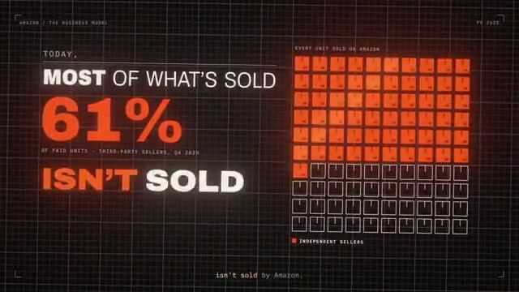</a></td>
<td width="50%" height="225" align="center" valign="middle"><a href="https://guanmo-ai.github.io/awesome-ai-motion/?lang=en#case-2108917734406844505">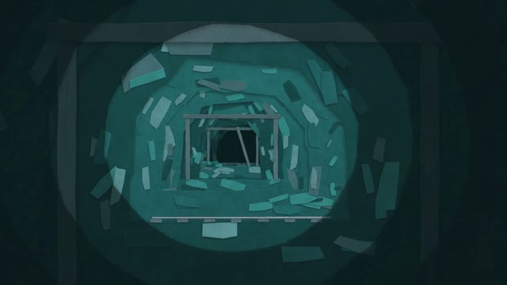</a></td>
</tr>
<tr>
<td width="50%" valign="top"><strong>Numbers and Grids in Motion</strong> <a href="https://x.com/clementonn">@clementonn</a> · Motion design 1:25 · Bookmarks 0 · Details pending <a href="https://guanmo-ai.github.io/awesome-ai-motion/?lang=en#case-2108504736257434081">▶ Play</a> · <a href="https://x.com/clementonn/status/2108504736257434081">Original post</a></td>
<td width="50%" valign="top"><strong>Animation from Style, Script and Voiceover</strong> <a href="https://x.com/kudela_maxim">@kudela_maxim</a> · Motion design 1:33 · Bookmarks 0 · Details pending <a href="https://guanmo-ai.github.io/awesome-ai-motion/?lang=en#case-2108917734406844505">▶ Play</a> · <a href="https://x.com/kudela_maxim/status/2108917734406844505">Original post</a></td>
</tr>
</tbody>
<tbody>
<tr>
<td width="50%" height="225" align="center" valign="middle"></td>
<td width="50%" height="225" align="center" valign="middle"></td>
</tr>
<tr>
<td width="50%" valign="top"><strong>Rounded characters animated in Blender</strong> <a href="https://x.com/JaydenDavisNC">@JaydenDavisNC</a> · Pixel art &amp; characters 0:17 · Bookmarks 1,356 · Details pending <a href="https://guanmo-ai.github.io/awesome-ai-motion/?lang=en#case-2107086714820870617">▶ Play</a> · <a href="https://x.com/JaydenDavisNC/status/2107086714820870617">Original post</a></td>
<td width="50%" valign="top"><strong>Superman across changing art styles</strong> <a href="https://x.com/chetaslua">@chetaslua</a> · Pixel art &amp; characters 0:40 · Bookmarks 1,278 · Details pending <a href="https://guanmo-ai.github.io/awesome-ai-motion/?lang=en#case-2105757136219504862">▶ Play</a> · <a href="https://x.com/chetaslua/status/2105757136219504862">Original post</a></td>
</tr>
</tbody>
<tbody>
<tr>
<td width="50%" height="225" align="center" valign="middle"><a href="https://guanmo-ai.github.io/awesome-ai-motion/?lang=en#case-2105825930799432073">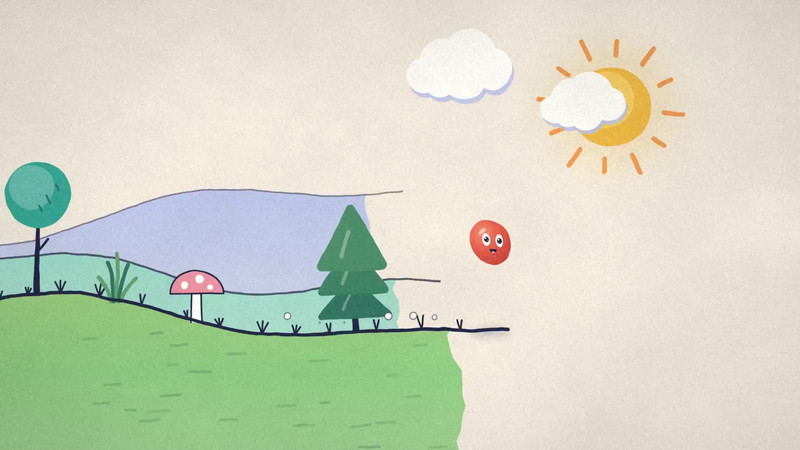</a></td>
<td width="50%" height="225" align="center" valign="middle"></td>
</tr>
<tr>
<td width="50%" valign="top"><strong>A red dot’s small woodland adventure</strong> <a href="https://x.com/cherry_mx_reds">@cherry_mx_reds</a> · Pixel art &amp; characters 0:15 · Bookmarks 1,072 · Details pending <a href="https://guanmo-ai.github.io/awesome-ai-motion/?lang=en#case-2105825930799432073">▶ Play</a> · <a href="https://x.com/cherry_mx_reds/status/2105825930799432073">Original post</a></td>
<td width="50%" valign="top"><strong>An AITuber Streaming and Explaining Prototype</strong> <a href="https://x.com/manaimovie">@manaimovie</a> · Pixel art &amp; characters 0:55 · Bookmarks 985 · Details pending <a href="https://guanmo-ai.github.io/awesome-ai-motion/?lang=en#case-2104008163561451923">▶ Play</a> · <a href="https://x.com/manaimovie/status/2104008163561451923">Original post</a></td>
</tr>
</tbody>
<tbody>
<tr>
<td width="50%" height="225" align="center" valign="middle"><a href="https://guanmo-ai.github.io/awesome-ai-motion/?lang=en#case-2107399371121930610">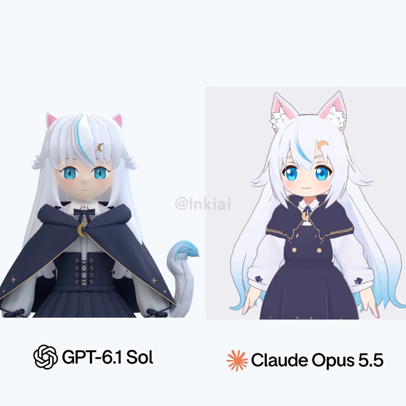</a></td>
<td width="50%" height="225" align="center" valign="middle"><a href="https://guanmo-ai.github.io/awesome-ai-motion/?lang=en#case-2107634512226058434">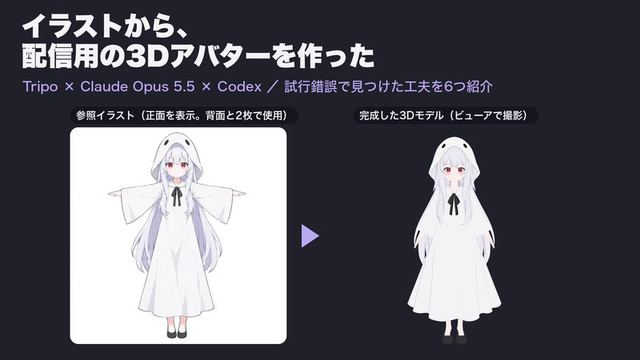</a></td>
</tr>
<tr>
<td width="50%" valign="top"><strong>Two approaches to building a 3D avatar</strong> <a href="https://x.com/lnkiai">@lnkiai</a> · Pixel art &amp; characters 0:11 · Bookmarks 549 · Details pending <a href="https://guanmo-ai.github.io/awesome-ai-motion/?lang=en#case-2107399371121930610">▶ Play</a> · <a href="https://x.com/lnkiai/status/2107399371121930610">Original post</a></td>
<td width="50%" valign="top"><strong>From Two Illustrations to a Streaming 3D Avatar</strong> <a href="https://x.com/kokushing">@kokushing</a> · Pixel art &amp; characters 1:15 · Bookmarks 388 · Details pending <a href="https://guanmo-ai.github.io/awesome-ai-motion/?lang=en#case-2107634512226058434">▶ Play</a> · <a href="https://x.com/kokushing/status/2107634512226058434">Original post</a></td>
</tr>
</tbody>
<tbody>
<tr>
<td width="50%" height="225" align="center" valign="middle"></td>
<td width="50%" height="225" align="center" valign="middle"></td>
</tr>
<tr>
<td width="50%" valign="top"><strong>Candy-Themed Character Animation</strong> <a href="https://x.com/cherry_mx_reds">@cherry_mx_reds</a> · Pixel art &amp; characters 0:30 · Bookmarks 350 · Details pending <a href="https://guanmo-ai.github.io/awesome-ai-motion/?lang=en#case-2102472218269900876">▶ Play</a> · <a href="https://x.com/cherry_mx_reds/status/2102472218269900876">Original post</a></td>
<td width="50%" valign="top"><strong>A model self-portrait in a floating voxel world</strong> <a href="https://x.com/blueemi99">@blueemi99</a> · Pixel art &amp; characters 0:26 · Bookmarks 213 · Details pending <a href="https://guanmo-ai.github.io/awesome-ai-motion/?lang=en#case-2105804692811137242">▶ Play</a> · <a href="https://x.com/blueemi99/status/2105804692811137242">Original post</a></td>
</tr>
</tbody>
<tbody>
<tr>
<td width="50%" height="225" align="center" valign="middle"></td>
<td width="50%" height="225" align="center" valign="middle"><a href="https://guanmo-ai.github.io/awesome-ai-motion/?lang=en#case-2107556246706635261">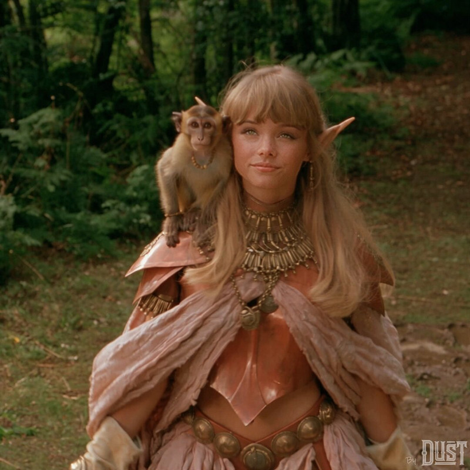</a></td>
</tr>
<tr>
<td width="50%" valign="top"><strong>Nighttime Pixel Music Demo</strong> <a href="https://x.com/gandamu_ml">@gandamu_ml</a> · Pixel art &amp; characters 4:17 · Bookmarks 76 · Details pending <a href="https://guanmo-ai.github.io/awesome-ai-motion/?lang=en#case-2103116003689550013">▶ Play</a> · <a href="https://x.com/gandamu_ml/status/2103116003689550013">Original post</a></td>
<td width="50%" valign="top"><strong>Pip and Pickle character short</strong> <a href="https://x.com/Dustfinger2077">@Dustfinger2077</a> · Pixel art &amp; characters 1:36 · Bookmarks 74 · Details pending <a href="https://guanmo-ai.github.io/awesome-ai-motion/?lang=en#case-2107556246706635261">▶ Play</a> · <a href="https://x.com/Dustfinger2077/status/2107556246706635261">Original post</a></td>
</tr>
</tbody>
<tbody>
<tr>
<td width="50%" height="225" align="center" valign="middle"></td>
<td width="50%" height="225" align="center" valign="middle"><a href="https://guanmo-ai.github.io/awesome-ai-motion/?lang=en#case-2106114830780223567">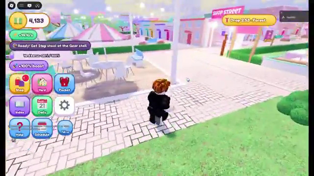</a></td>
</tr>
<tr>
<td width="50%" valign="top"><strong>Non-Humanoid Rigging and Animation</strong> <a href="https://x.com/BlendiByl">@BlendiByl</a> · Pixel art &amp; characters 0:10 · Bookmarks 65 · Details pending <a href="https://guanmo-ai.github.io/awesome-ai-motion/?lang=en#case-2103989270558167364">▶ Play</a> · <a href="https://x.com/BlendiByl/status/2103989270558167364">Original post</a></td>
<td width="50%" valign="top"><strong>Hunt A Squishy: a Roblox collecting game</strong> <a href="https://x.com/minchoi">@minchoi</a> · Pixel art &amp; characters 1:25 · Bookmarks 62 · Details pending <a href="https://guanmo-ai.github.io/awesome-ai-motion/?lang=en#case-2106114830780223567">▶ Play</a> · <a href="https://x.com/minchoi/status/2106114830780223567">Original post</a></td>
</tr>
</tbody>
<tbody>
<tr>
<td width="50%" height="225" align="center" valign="middle"><a href="https://guanmo-ai.github.io/awesome-ai-motion/?lang=en#case-2107703620070428946">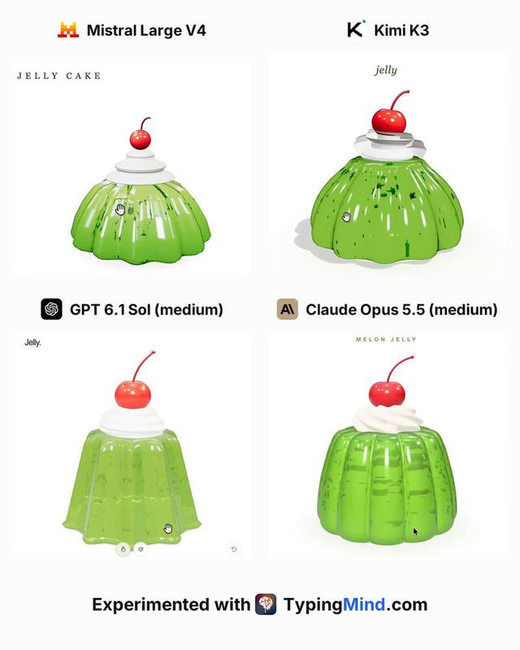</a></td>
<td width="50%" height="225" align="center" valign="middle"><a href="https://guanmo-ai.github.io/awesome-ai-motion/?lang=en#case-2107611576543093088">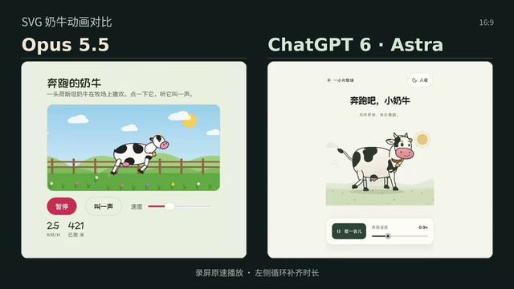</a></td>
</tr>
<tr>
<td width="50%" valign="top"><strong>Four Models Make a Jelly Animation</strong> <a href="https://x.com/ann_nnng">@ann_nnng</a> · Pixel art &amp; characters 0:16 · Bookmarks 59 · Details pending <a href="https://guanmo-ai.github.io/awesome-ai-motion/?lang=en#case-2107703620070428946">▶ Play</a> · <a href="https://x.com/ann_nnng/status/2107703620070428946">Original post</a></td>
<td width="50%" valign="top"><strong>Two Models Animate a Running SVG Cow</strong> <a href="https://x.com/GKev1n">@GKev1n</a> · Pixel art &amp; characters 0:18 · Bookmarks 58 · Details pending <a href="https://guanmo-ai.github.io/awesome-ai-motion/?lang=en#case-2107611576543093088">▶ Play</a> · <a href="https://x.com/GKev1n/status/2107611576543093088">Original post</a></td>
</tr>
</tbody>
<tbody>
<tr>
<td width="50%" height="225" align="center" valign="middle"></td>
<td width="50%" height="225" align="center" valign="middle"></td>
</tr>
<tr>
<td width="50%" valign="top"><strong>A Running Chicken with Four Fried Legs</strong> <a href="https://x.com/whydeso">@whydeso</a> · Pixel art &amp; characters 0:17 · Bookmarks 52 · Details pending <a href="https://guanmo-ai.github.io/awesome-ai-motion/?lang=en#case-2107754210746134748">▶ Play</a> · <a href="https://x.com/whydeso/status/2107754210746134748">Original post</a></td>
<td width="50%" valign="top"><strong>A Seedance Cartoon Episode Experiment</strong> <a href="https://x.com/mrdejie">@mrdejie</a> · Pixel art &amp; characters 1:36 · Bookmarks 46 · Details pending <a href="https://guanmo-ai.github.io/awesome-ai-motion/?lang=en#case-2108425981283414483">▶ Play</a> · <a href="https://x.com/mrdejie/status/2108425981283414483">Original post</a></td>
</tr>
</tbody>
<tbody>
<tr>
<td width="50%" height="225" align="center" valign="middle"><a href="https://guanmo-ai.github.io/awesome-ai-motion/?lang=en#case-2108319151127175422">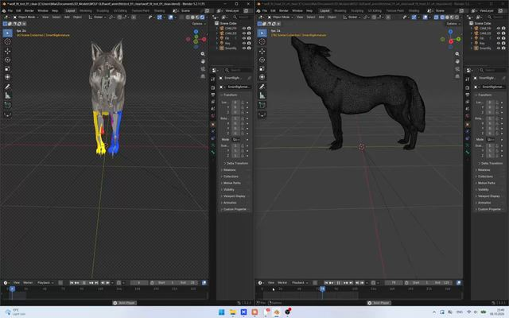</a></td>
<td width="50%" height="225" align="center" valign="middle"><a href="https://guanmo-ai.github.io/awesome-ai-motion/?lang=en#case-2106402474676588632">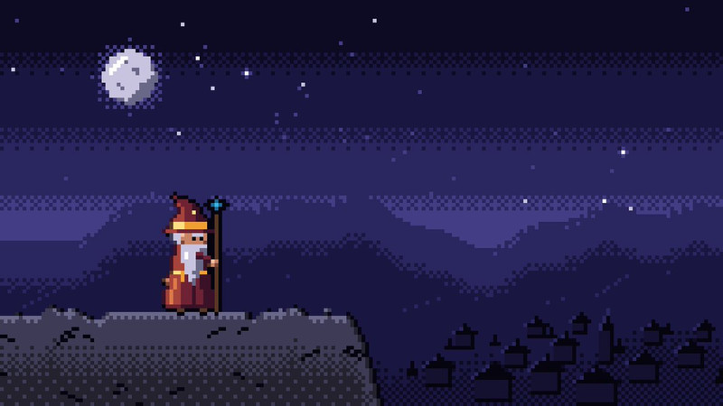</a></td>
</tr>
<tr>
<td width="50%" valign="top"><strong>Walking and Howling on the Same Wolf Mesh</strong> <a href="https://x.com/maxt3chno">@maxt3chno</a> · Pixel art &amp; characters 0:27 · Bookmarks 20 · Details pending <a href="https://guanmo-ai.github.io/awesome-ai-motion/?lang=en#case-2108319151127175422">▶ Play</a> · <a href="https://x.com/maxt3chno/status/2108319151127175422">Original post</a></td>
<td width="50%" valign="top"><strong>A beat-driven pixel character short</strong> <a href="https://x.com/gkxspace">@gkxspace</a> · Pixel art &amp; characters 0:27 · Bookmarks 13 · Details pending <a href="https://guanmo-ai.github.io/awesome-ai-motion/?lang=en#case-2106402474676588632">▶ Play</a> · <a href="https://x.com/gkxspace/status/2106402474676588632">Original post</a></td>
</tr>
</tbody>
<tbody>
<tr>
<td width="50%" height="225" align="center" valign="middle"></td>
<td width="50%" height="225" align="center" valign="middle"></td>
</tr>
<tr>
<td width="50%" valign="top"><strong>Kākāpō Celebration in Pixel Art</strong> <a href="https://x.com/simonw">@simonw</a> · Pixel art &amp; characters 0:15 · Bookmarks 12 · Details pending <a href="https://guanmo-ai.github.io/awesome-ai-motion/?lang=en#case-2104002636513206422">▶ Play</a> · <a href="https://x.com/simonw/status/2104002636513206422">Original post</a></td>
<td width="50%" valign="top"><strong>A Meme-and-animation-style Test</strong> <a href="https://x.com/guylookaround">@guylookaround</a> · Pixel art &amp; characters 0:20 · Bookmarks 12 · Details pending <a href="https://guanmo-ai.github.io/awesome-ai-motion/?lang=en#case-2108267374944403569">▶ Play</a> · <a href="https://x.com/guylookaround/status/2108267374944403569">Original post</a></td>
</tr>
</tbody>
<tbody>
<tr>
<td width="50%" height="225" align="center" valign="middle"><a href="https://guanmo-ai.github.io/awesome-ai-motion/?lang=en#case-2105839618872738138">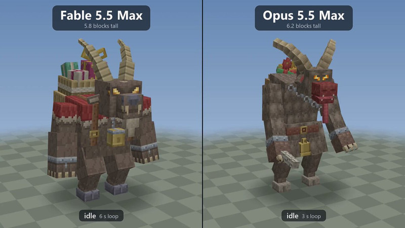</a></td>
<td width="50%" height="225" align="center" valign="middle"></td>
</tr>
<tr>
<td width="50%" valign="top"><strong>Minecraft voxel characters: a model comparison</strong> <a href="https://x.com/TOPSTR1X">@TOPSTR1X</a> · Pixel art &amp; characters 0:15 · Bookmarks 11 · Details pending <a href="https://guanmo-ai.github.io/awesome-ai-motion/?lang=en#case-2105839618872738138">▶ Play</a> · <a href="https://x.com/TOPSTR1X/status/2105839618872738138">Original post</a></td>
<td width="50%" valign="top"><strong>A Dialogue Short with Claude and Doubao Characters</strong> <a href="https://x.com/eternityspring">@eternityspring</a> · Pixel art &amp; characters 0:15 · Bookmarks 11 · Details pending <a href="https://guanmo-ai.github.io/awesome-ai-motion/?lang=en#case-2107746012739809302">▶ Play</a> · <a href="https://x.com/eternityspring/status/2107746012739809302">Original post</a></td>
</tr>
</tbody>
<tbody>
<tr>
<td width="50%" height="225" align="center" valign="middle"></td>
<td width="50%" height="225" align="center" valign="middle"><a href="https://guanmo-ai.github.io/awesome-ai-motion/?lang=en#case-2107603054556221828">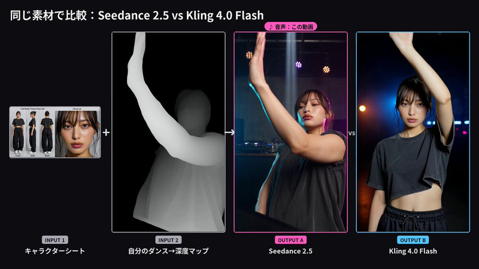</a></td>
</tr>
<tr>
<td width="50%" valign="top"><strong>A single illustration becomes a conversational avatar</strong> <a href="https://x.com/shinshin86">@shinshin86</a> · Pixel art &amp; characters 0:10 · Bookmarks 7 · Details pending <a href="https://guanmo-ai.github.io/awesome-ai-motion/?lang=en#case-2105556318132310361">▶ Play</a> · <a href="https://x.com/shinshin86/status/2105556318132310361">Original post</a></td>
<td width="50%" valign="top"><strong>Dance models compared with one depth reference</strong> <a href="https://x.com/ZetoGroovin">@ZetoGroovin</a> · Pixel art &amp; characters 0:16 · Bookmarks 7 · Details pending <a href="https://guanmo-ai.github.io/awesome-ai-motion/?lang=en#case-2107603054556221828">▶ Play</a> · <a href="https://x.com/ZetoGroovin/status/2107603054556221828">Original post</a></td>
</tr>
</tbody>
<tbody>
<tr>
<td width="50%" height="225" align="center" valign="middle"></td>
<td width="50%" height="225" align="center" valign="middle"></td>
</tr>
<tr>
<td width="50%" valign="top"><strong>A Mascot Vector-rig Animation Panel</strong> <a href="https://x.com/okooo5km">@okooo5km</a> · Pixel art &amp; characters 0:21 · Bookmarks 7 · Details pending <a href="https://guanmo-ai.github.io/awesome-ai-motion/?lang=en#case-2107738086079909920">▶ Play</a> · <a href="https://x.com/okooo5km/status/2107738086079909920">Original post</a></td>
<td width="50%" valign="top"><strong>AI-assisted Renders of Xiao Qiao Game Assets</strong> <a href="https://x.com/baoweiheihei">@baoweiheihei</a> · Pixel art &amp; characters 0:10 · Bookmarks 3 · Details pending <a href="https://guanmo-ai.github.io/awesome-ai-motion/?lang=en#case-2108099981034832007">▶ Play</a> · <a href="https://x.com/baoweiheihei/status/2108099981034832007">Original post</a></td>
</tr>
</tbody>
<tbody>
<tr>
<td width="50%" height="225" align="center" valign="middle"><a href="https://guanmo-ai.github.io/awesome-ai-motion/?lang=en#case-2106684010181337136">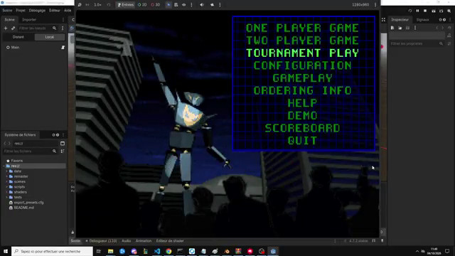</a></td>
<td width="50%" height="225" align="center" valign="middle"></td>
</tr>
<tr>
<td width="50%" valign="top"><strong>A Godot remake experiment for a DOS game</strong> <a href="https://x.com/Graalitoo">@Graalitoo</a> · Pixel art &amp; characters 0:53 · Bookmarks 2 · Details pending <a href="https://guanmo-ai.github.io/awesome-ai-motion/?lang=en#case-2106684010181337136">▶ Play</a> · <a href="https://x.com/Graalitoo/status/2106684010181337136">Original post</a></td>
<td width="50%" valign="top"><strong>A Locally Generated Character-dialogue Test</strong> <a href="https://x.com/jun1228909">@jun1228909</a> · Pixel art &amp; characters 0:08 · Bookmarks 2 · Details pending <a href="https://guanmo-ai.github.io/awesome-ai-motion/?lang=en#case-2108396701656768644">▶ Play</a> · <a href="https://x.com/jun1228909/status/2108396701656768644">Original post</a></td>
</tr>
</tbody>
<tbody>
<tr>
<td width="50%" height="225" align="center" valign="middle"></td>
<td width="50%" height="225" align="center" valign="middle"><a href="https://guanmo-ai.github.io/awesome-ai-motion/?lang=en#case-2107621936561823818">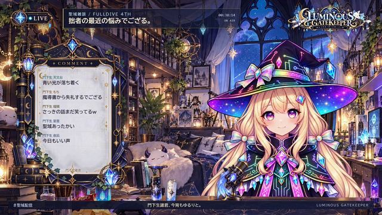</a></td>
</tr>
<tr>
<td width="50%" valign="top"><strong>1 Sport a Day: a Judo Character Short</strong> <a href="https://x.com/Dyyaiworker">@Dyyaiworker</a> · Pixel art &amp; characters 0:23 · Bookmarks 1 · Details pending <a href="https://guanmo-ai.github.io/awesome-ai-motion/?lang=en#case-2108200876175495171">▶ Play</a> · <a href="https://x.com/Dyyaiworker/status/2108200876175495171">Original post</a></td>
<td width="50%" valign="top"><strong>Luminous Gatekeeper: a Fictional VTuber Clip</strong> <a href="https://x.com/sacher10610">@sacher10610</a> · Pixel art &amp; characters 0:45 · Bookmarks 1 · Details pending <a href="https://guanmo-ai.github.io/awesome-ai-motion/?lang=en#case-2107621936561823818">▶ Play</a> · <a href="https://x.com/sacher10610/status/2107621936561823818">Original post</a></td>
</tr>
</tbody>
<tbody>
<tr>
<td width="50%" height="225" align="center" valign="middle"></td>
<td width="50%" height="225" align="center" valign="middle"></td>
</tr>
<tr>
<td width="50%" valign="top"><strong>Retro Computer Demo Scene</strong> <a href="https://x.com/cromwellian">@cromwellian</a> · Pixel art &amp; characters 2:44 · Bookmarks 1 · Details pending <a href="https://guanmo-ai.github.io/awesome-ai-motion/?lang=en#case-2103028027861152225">▶ Play</a> · <a href="https://x.com/cromwellian/status/2103028027861152225">Original post</a></td>
<td width="50%" valign="top"><strong>Three Emotions in One Continuous Take</strong> <a href="https://x.com/azed_ai">@azed_ai</a> · Pixel art &amp; characters 0:20 · Bookmarks 1 · Details pending <a href="https://guanmo-ai.github.io/awesome-ai-motion/?lang=en#case-2108924733588906180">▶ Play</a> · <a href="https://x.com/azed_ai/status/2108924733588906180">Original post</a></td>
</tr>
</tbody>
<tbody>
<tr>
<td width="50%" height="225" align="center" valign="middle"></td>
<td width="50%" height="225" align="center" valign="middle"></td>
</tr>
<tr>
<td width="50%" valign="top"><strong>An Opus Blender Character-animation Test</strong> <a href="https://x.com/DaraChaww">@DaraChaww</a> · Pixel art &amp; characters 0:20 · Bookmarks 1 · Details pending <a href="https://guanmo-ai.github.io/awesome-ai-motion/?lang=en#case-2108306366771413034">▶ Play</a> · <a href="https://x.com/DaraChaww/status/2108306366771413034">Original post</a></td>
<td width="50%" valign="top"><strong>A Knight-cat Short</strong> <a href="https://x.com/yesand_ai">@yesand_ai</a> · Pixel art &amp; characters 0:24 · Bookmarks 1 · Details pending <a href="https://guanmo-ai.github.io/awesome-ai-motion/?lang=en#case-2108359012328849486">▶ Play</a> · <a href="https://x.com/yesand_ai/status/2108359012328849486">Original post</a></td>
</tr>
</tbody>
<tbody>
<tr>
<td width="50%" height="225" align="center" valign="middle"><a href="https://guanmo-ai.github.io/awesome-ai-motion/?lang=en#case-2106743642668875913">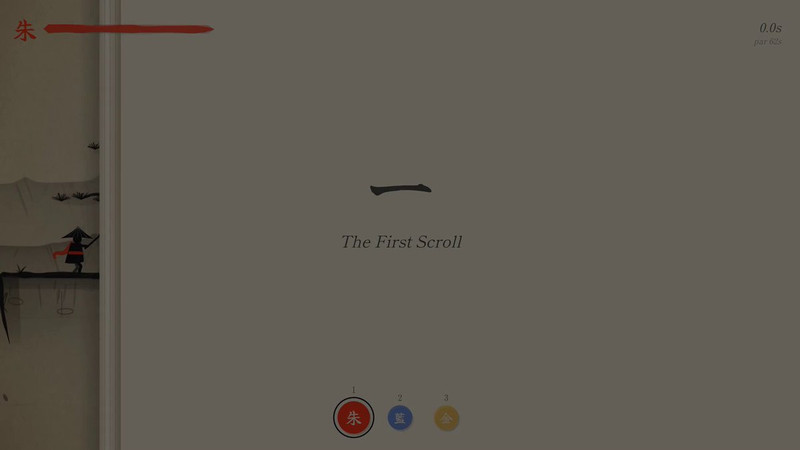</a></td>
<td width="50%" height="225" align="center" valign="middle"></td>
</tr>
<tr>
<td width="50%" valign="top"><strong>Inkrunner: paint a path to the finish</strong> <a href="https://x.com/cryptowluha">@cryptowluha</a> · Pixel art &amp; characters 0:27 · Bookmarks 1 · Details pending <a href="https://guanmo-ai.github.io/awesome-ai-motion/?lang=en#case-2106743642668875913">▶ Play</a> · <a href="https://x.com/cryptowluha/status/2106743642668875913">Original post</a></td>
<td width="50%" valign="top"><strong>A Neon Shadows Character Outfit-turn Test</strong> <a href="https://x.com/JaviRandomXI">@JaviRandomXI</a> · Pixel art &amp; characters 0:05 · Bookmarks 1 · Details pending <a href="https://guanmo-ai.github.io/awesome-ai-motion/?lang=en#case-2107541364841820482">▶ Play</a> · <a href="https://x.com/JaviRandomXI/status/2107541364841820482">Original post</a></td>
</tr>
</tbody>
<tbody>
<tr>
<td width="50%" height="225" align="center" valign="middle"></td>
<td width="50%" height="225" align="center" valign="middle"></td>
</tr>
<tr>
<td width="50%" valign="top"><strong>Chuka’s Overhead Outfit Animation</strong> <a href="https://x.com/shellys_arts">@shellys_arts</a> · Pixel art &amp; characters 0:19 · Bookmarks 1 · Details pending <a href="https://guanmo-ai.github.io/awesome-ai-motion/?lang=en#case-2108920625972891677">▶ Play</a> · <a href="https://x.com/shellys_arts/status/2108920625972891677">Original post</a></td>
<td width="50%" valign="top"><strong>Four gacha-style model-character animations</strong> <a href="https://x.com/nelvOfficial">@nelvOfficial</a> · Pixel art &amp; characters 0:32 · Bookmarks 1 · Details pending <a href="https://guanmo-ai.github.io/awesome-ai-motion/?lang=en#case-2106063780891459846">▶ Play</a> · <a href="https://x.com/nelvOfficial/status/2106063780891459846">Original post</a></td>
</tr>
</tbody>
<tbody>
<tr>
<td width="50%" height="225" align="center" valign="middle"><a href="https://guanmo-ai.github.io/awesome-ai-motion/?lang=en#case-2108132243059212341">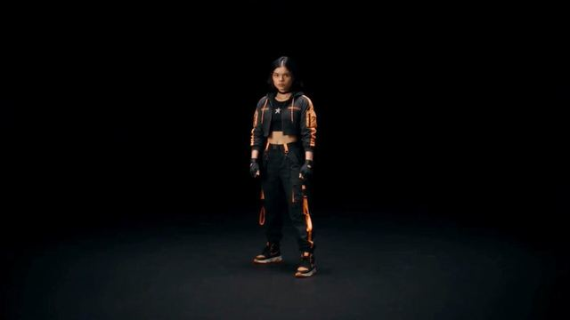</a></td>
<td width="50%" height="225" align="center" valign="middle"><a href="https://guanmo-ai.github.io/awesome-ai-motion/?lang=en#case-2108482607994331428">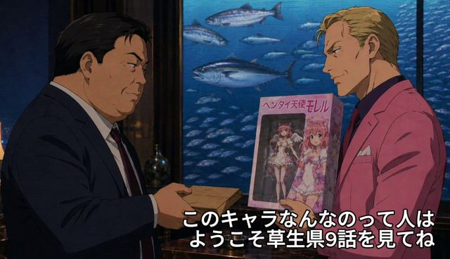</a></td>
</tr>
<tr>
<td width="50%" valign="top"><strong>A Martial-arts Test from One Character Reference</strong> <a href="https://x.com/previsha03">@previsha03</a> · Pixel art &amp; characters 0:28 · Bookmarks 1 · Details pending <a href="https://guanmo-ai.github.io/awesome-ai-motion/?lang=en#case-2108132243059212341">▶ Play</a> · <a href="https://x.com/previsha03/status/2108132243059212341">Original post</a></td>
<td width="50%" valign="top"><strong>A Kusao Prefecture Animation Spin-off</strong> <a href="https://x.com/santome_yontome">@santome_yontome</a> · Pixel art &amp; characters 2:37 · Bookmarks 0 · Details pending <a href="https://guanmo-ai.github.io/awesome-ai-motion/?lang=en#case-2108482607994331428">▶ Play</a> · <a href="https://x.com/santome_yontome/status/2108482607994331428">Original post</a></td>
</tr>
</tbody>
<tbody>
<tr>
<td width="50%" height="225" align="center" valign="middle"></td>
<td width="50%" height="225" align="center" valign="middle"></td>
</tr>
<tr>
<td width="50%" valign="top"><strong>Artemissia Walking Animation Test</strong> <a href="https://x.com/ArtByArtemissia">@ArtByArtemissia</a> · Pixel art &amp; characters 0:10 · Bookmarks 0 · Details pending <a href="https://guanmo-ai.github.io/awesome-ai-motion/?lang=en#case-2107911008391950525">▶ Play</a> · <a href="https://x.com/ArtByArtemissia/status/2107911008391950525">Original post</a></td>
<td width="50%" valign="top"><strong>A Continuous Multi-enemy Swordfight Test</strong> <a href="https://x.com/challenger_ND">@challenger_ND</a> · Pixel art &amp; characters 0:15 · Bookmarks 0 · Details pending <a href="https://guanmo-ai.github.io/awesome-ai-motion/?lang=en#case-2108185991748153475">▶ Play</a> · <a href="https://x.com/challenger_ND/status/2108185991748153475">Original post</a></td>
</tr>
</tbody>
<tbody>
<tr>
<td width="50%" height="225" align="center" valign="middle"><a href="https://guanmo-ai.github.io/awesome-ai-motion/?lang=en#case-2107457994208190801">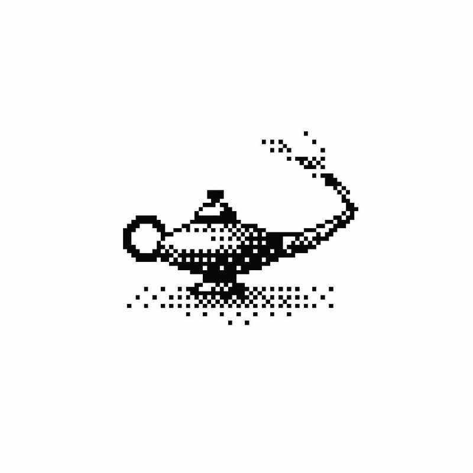</a></td>
<td width="50%" height="225" align="center" valign="middle"></td>
</tr>
<tr>
<td width="50%" valign="top"><strong>Eight-bit explorations for Creator Shop</strong> <a href="https://x.com/austinskhosana_">@austinskhosana_</a> · Pixel art &amp; characters 0:06 · Bookmarks 0 · Details pending <a href="https://guanmo-ai.github.io/awesome-ai-motion/?lang=en#case-2107457994208190801">▶ Play</a> · <a href="https://x.com/austinskhosana_/status/2107457994208190801">Original post</a></td>
<td width="50%" valign="top"><strong>Rigging a Tripo Character with Auto-Rig Pro</strong> <a href="https://x.com/Mikami_Gugenka">@Mikami_Gugenka</a> · Pixel art &amp; characters 0:20 · Bookmarks 0 · Details pending <a href="https://guanmo-ai.github.io/awesome-ai-motion/?lang=en#case-2104773451265589544">▶ Play</a> · <a href="https://x.com/Mikami_Gugenka/status/2104773451265589544">Original post</a></td>
</tr>
</tbody>
<tbody>
<tr>
<td width="50%" height="225" align="center" valign="middle"><a href="https://guanmo-ai.github.io/awesome-ai-motion/?lang=en#case-2105229630139502795">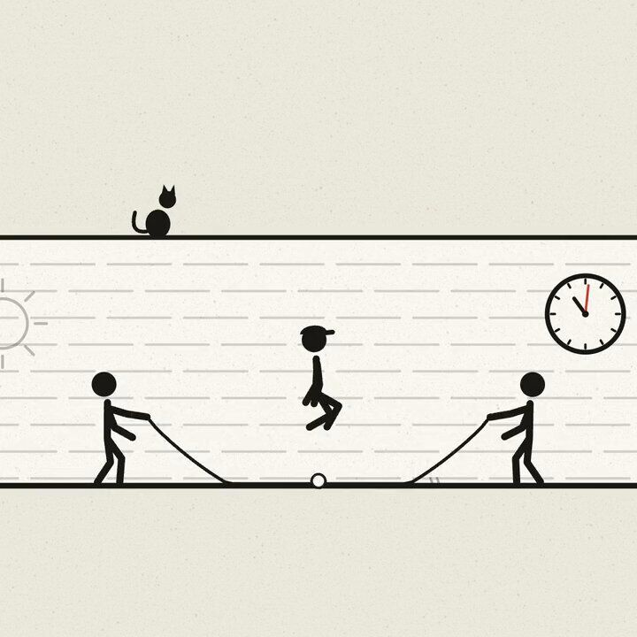</a></td>
<td width="50%" height="225" align="center" valign="middle"><a href="https://guanmo-ai.github.io/awesome-ai-motion/?lang=en#case-2108521753517621550">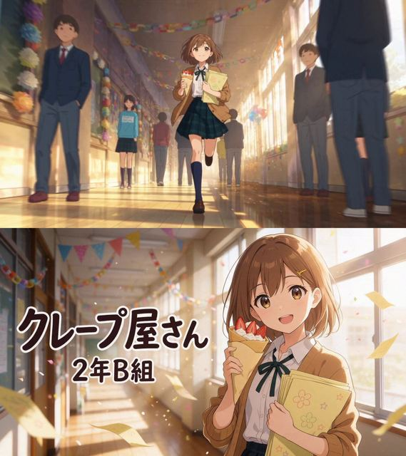</a></td>
</tr>
<tr>
<td width="50%" valign="top"><strong>Jump Rope vs. the Cancan</strong> <a href="https://x.com/koldo2k">@koldo2k</a> · Pixel art &amp; characters 0:40 · Bookmarks 0 · Details pending <a href="https://guanmo-ai.github.io/awesome-ai-motion/?lang=en#case-2105229630139502795">▶ Play</a> · <a href="https://x.com/koldo2k/status/2105229630139502795">Original post</a></td>
<td width="50%" valign="top"><strong>Class 2-B’s Crepe Stand: a School-festival Animation</strong> <a href="https://x.com/taketori_ai">@taketori_ai</a> · Pixel art &amp; characters 0:15 · Bookmarks 0 · Details pending <a href="https://guanmo-ai.github.io/awesome-ai-motion/?lang=en#case-2108521753517621550">▶ Play</a> · <a href="https://x.com/taketori_ai/status/2108521753517621550">Original post</a></td>
</tr>
</tbody>
<tbody>
<tr>
<td width="50%" height="225" align="center" valign="middle"><a href="https://guanmo-ai.github.io/awesome-ai-motion/?lang=en#case-2108308051933757765">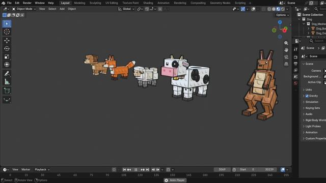</a></td>
<td width="50%" height="225" align="center" valign="middle"><a href="https://guanmo-ai.github.io/awesome-ai-motion/?lang=en#case-2107805574159290789">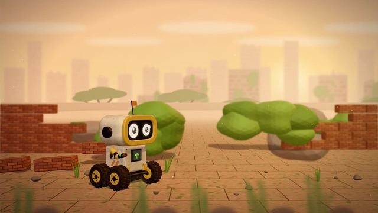</a></td>
</tr>
<tr>
<td width="50%" valign="top"><strong>Five Low-poly Animal Motion Assets</strong> <a href="https://x.com/ClzNickz">@ClzNickz</a> · Pixel art &amp; characters 0:23 · Bookmarks 0 · Details pending <a href="https://guanmo-ai.github.io/awesome-ai-motion/?lang=en#case-2108308051933757765">▶ Play</a> · <a href="https://x.com/ClzNickz/status/2108308051933757765">Original post</a></td>
<td width="50%" valign="top"><strong>A Robot Short Referencing Another Creator's Style</strong> <a href="https://x.com/Levi_D_Ackerman">@Levi_D_Ackerman</a> · Pixel art &amp; characters 0:54 · Bookmarks 0 · Details pending <a href="https://guanmo-ai.github.io/awesome-ai-motion/?lang=en#case-2107805574159290789">▶ Play</a> · <a href="https://x.com/Levi_D_Ackerman/status/2107805574159290789">Original post</a></td>
</tr>
</tbody>
<tbody>
<tr>
<td width="50%" height="225" align="center" valign="middle"></td>
<td width="50%" height="225" align="center" valign="middle"><a href="https://guanmo-ai.github.io/awesome-ai-motion/?lang=en#case-2105187523630944530">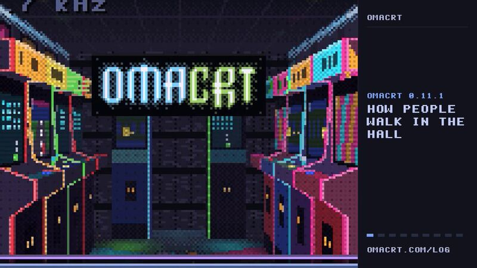</a></td>
</tr>
<tr>
<td width="50%" valign="top"><strong>Fureha Fumu: Original Character in 3D</strong> <a href="https://x.com/Kta_Z">@Kta_Z</a> · Pixel art &amp; characters 0:23 · Bookmarks 0 · Details pending <a href="https://guanmo-ai.github.io/awesome-ai-motion/?lang=en#case-2104721373545558470">▶ Play</a> · <a href="https://x.com/Kta_Z/status/2104721373545558470">Original post</a></td>
<td width="50%" valign="top"><strong>OmaCRT: Pixel Walking from Joint Curves</strong> <a href="https://x.com/stefanomainardi">@stefanomainardi</a> · Pixel art &amp; characters 0:44 · Bookmarks 0 · Details pending <a href="https://guanmo-ai.github.io/awesome-ai-motion/?lang=en#case-2105187523630944530">▶ Play</a> · <a href="https://x.com/stefanomainardi/status/2105187523630944530">Original post</a></td>
</tr>
</tbody>
<tbody>
<tr>
<td width="50%" height="225" align="center" valign="middle"></td>
<td width="50%" height="225" align="center" valign="middle"><a href="https://guanmo-ai.github.io/awesome-ai-motion/?lang=en#case-2108222329461367216">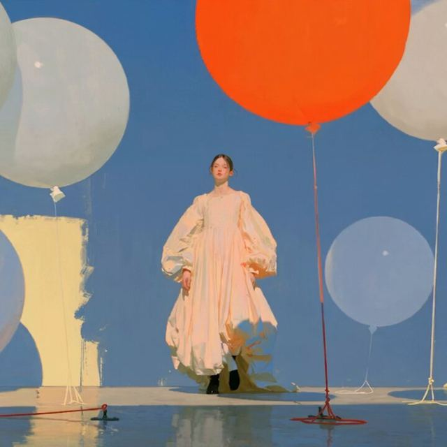</a></td>
</tr>
<tr>
<td width="50%" valign="top"><strong>A cozy animation from a personal drawing</strong> <a href="https://x.com/opusultra">@opusultra</a> · Pixel art &amp; characters 0:12 · Bookmarks 0 · Details pending <a href="https://guanmo-ai.github.io/awesome-ai-motion/?lang=en#case-2107235777029476636">▶ Play</a> · <a href="https://x.com/opusultra/status/2107235777029476636">Original post</a></td>
<td width="50%" valign="top"><strong>A Character Shot among Balloons</strong> <a href="https://x.com/AnduArtist">@AnduArtist</a> · Pixel art &amp; characters 0:23 · Bookmarks 0 · Details pending <a href="https://guanmo-ai.github.io/awesome-ai-motion/?lang=en#case-2108222329461367216">▶ Play</a> · <a href="https://x.com/AnduArtist/status/2108222329461367216">Original post</a></td>
</tr>
</tbody>
<tbody>
<tr>
<td width="50%" height="225" align="center" valign="middle"><a href="https://guanmo-ai.github.io/awesome-ai-motion/?lang=en#case-2108329897563160663">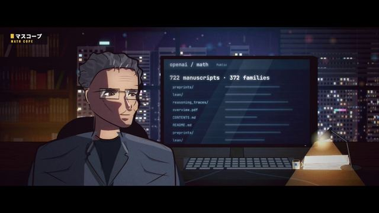</a></td>
<td width="50%" height="225" align="center" valign="middle"></td>
</tr>
<tr>
<td width="50%" valign="top"><strong>An Unsuccessful Anime-dialogue Style Test</strong> <a href="https://x.com/EthanStryhaus">@EthanStryhaus</a> · Pixel art &amp; characters 1:20 · Bookmarks 0 · Details pending <a href="https://guanmo-ai.github.io/awesome-ai-motion/?lang=en#case-2108329897563160663">▶ Play</a> · <a href="https://x.com/EthanStryhaus/status/2108329897563160663">Original post</a></td>
<td width="50%" valign="top"><strong>A Shop Character Blinks, Waves and Bows</strong> <a href="https://x.com/tennisosaka">@tennisosaka</a> · Pixel art &amp; characters 0:10 · Bookmarks 0 · Details pending <a href="https://guanmo-ai.github.io/awesome-ai-motion/?lang=en#case-2108331203711619114">▶ Play</a> · <a href="https://x.com/tennisosaka/status/2108331203711619114">Original post</a></td>
</tr>
</tbody>
<tbody>
<tr>
<td width="50%" height="225" align="center" valign="middle"></td>
<td width="50%" height="225" align="center" valign="middle"></td>
</tr>
<tr>
<td width="50%" valign="top"><strong>Japanese Cel Animation at a City Window</strong> <a href="https://x.com/pablogori392947">@pablogori392947</a> · Pixel art &amp; characters 0:23 · Bookmarks 0 · Details pending <a href="https://guanmo-ai.github.io/awesome-ai-motion/?lang=en#case-2108474913204117546">▶ Play</a> · <a href="https://x.com/pablogori392947/status/2108474913204117546">Original post</a></td>
<td width="50%" valign="top"><strong>A Western Character and Landscape Study</strong> <a href="https://x.com/luqmanedits">@luqmanedits</a> · Pixel art &amp; characters 0:17 · Bookmarks 0 · Details pending <a href="https://guanmo-ai.github.io/awesome-ai-motion/?lang=en#case-2108476552057172312">▶ Play</a> · <a href="https://x.com/luqmanedits/status/2108476552057172312">Original post</a></td>
</tr>
</tbody>
<tbody>
<tr>
<td width="50%" height="225" align="center" valign="middle"></td>
<td width="50%" height="225" align="center" valign="middle"></td>
</tr>
<tr>
<td width="50%" valign="top"><strong>CatWalk: A Black Cat by a Moonlit Canal</strong> <a href="https://x.com/blitast_studio">@blitast_studio</a> · Pixel art &amp; characters 0:36 · Bookmarks 0 · Details pending <a href="https://guanmo-ai.github.io/awesome-ai-motion/?lang=en#case-2104003920251257328">▶ Play</a> · <a href="https://x.com/blitast_studio/status/2104003920251257328">Original post</a></td>
<td width="50%" valign="top"><strong>A Remotion Animation Test for an Original Fighting Game</strong> <a href="https://x.com/chriscodling5">@chriscodling5</a> · Pixel art &amp; characters 0:30 · Bookmarks 0 · Details pending <a href="https://guanmo-ai.github.io/awesome-ai-motion/?lang=en#case-2104664355270992140">▶ Play</a> · <a href="https://x.com/chriscodling5/status/2104664355270992140">Original post</a></td>
</tr>
</tbody>
<tbody>
<tr>
<td width="50%" height="225" align="center" valign="middle"></td>
<td width="50%" height="225" align="center" valign="middle"></td>
</tr>
<tr>
<td width="50%" valign="top"><strong>A Blender Spider Animation Challenge</strong> <a href="https://x.com/solvXuk">@solvXuk</a> · Pixel art &amp; characters 0:43 · Bookmarks 0 · Details pending <a href="https://guanmo-ai.github.io/awesome-ai-motion/?lang=en#case-2104719112803062038">▶ Play</a> · <a href="https://x.com/solvXuk/status/2104719112803062038">Original post</a></td>
<td width="50%" valign="top"><strong>Sid: A Pixel Pet for a Homelab</strong> <a href="https://x.com/m_deuce">@m_deuce</a> · Pixel art &amp; characters 1:36 · Bookmarks 0 · Details pending <a href="https://guanmo-ai.github.io/awesome-ai-motion/?lang=en#case-2105228931506852141">▶ Play</a> · <a href="https://x.com/m_deuce/status/2105228931506852141">Original post</a></td>
</tr>
</tbody>
<tbody>
<tr>
<td width="50%" height="225" align="center" valign="middle"><a href="https://guanmo-ai.github.io/awesome-ai-motion/?lang=en#case-2105675146166169912">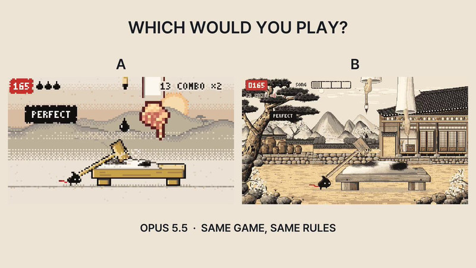</a></td>
<td width="50%" height="225" align="center" valign="middle"><a href="https://guanmo-ai.github.io/awesome-ai-motion/?lang=en#case-2107139500980007379">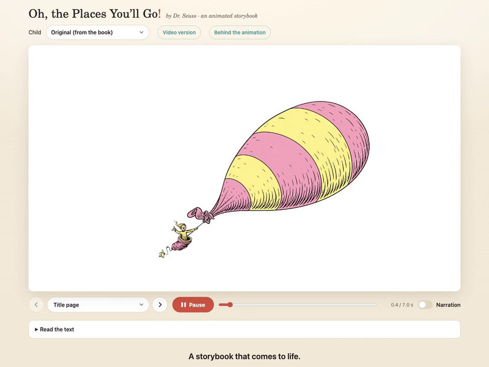</a></td>
</tr>
<tr>
<td width="50%" valign="top"><strong>Two visual styles for the INKBOUND ink spirit</strong> <a href="https://x.com/agentgamesbot">@agentgamesbot</a> · Pixel art &amp; characters 0:20 · Bookmarks 0 · Details pending <a href="https://guanmo-ai.github.io/awesome-ai-motion/?lang=en#case-2105675146166169912">▶ Play</a> · <a href="https://x.com/agentgamesbot/status/2105675146166169912">Original post</a></td>
<td width="50%" valign="top"><strong>Oh, the Places: an interactive storybook</strong> <a href="https://x.com/EKeric13">@EKeric13</a> · Pixel art &amp; characters 0:23 · Bookmarks 0 · Details pending <a href="https://guanmo-ai.github.io/awesome-ai-motion/?lang=en#case-2107139500980007379">▶ Play</a> · <a href="https://x.com/EKeric13/status/2107139500980007379">Original post</a></td>
</tr>
</tbody>
<tbody>
<tr>
<td width="50%" height="225" align="center" valign="middle"></td>
<td width="50%" height="225" align="center" valign="middle"><a href="https://guanmo-ai.github.io/awesome-ai-motion/?lang=en#case-2107485136103325759">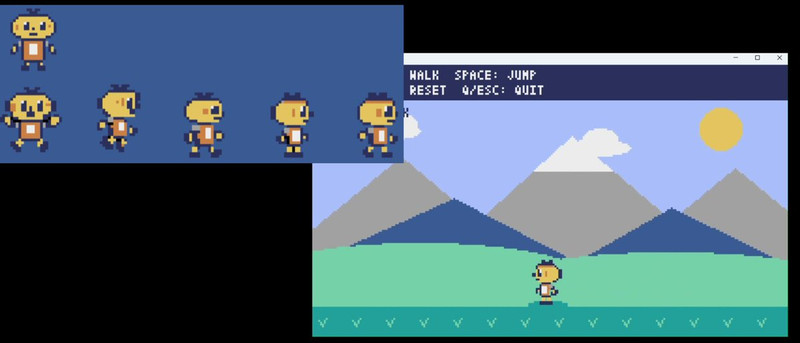</a></td>
</tr>
<tr>
<td width="50%" valign="top"><strong>A cartoon uncle's realistic runway walk</strong> <a href="https://x.com/nanneifxy">@nanneifxy</a> · Pixel art &amp; characters 0:13 · Bookmarks 0 · Details pending <a href="https://guanmo-ai.github.io/awesome-ai-motion/?lang=en#case-2107396054786224262">▶ Play</a> · <a href="https://x.com/nanneifxy/status/2107396054786224262">Original post</a></td>
<td width="50%" valign="top"><strong>From a sprite sheet to Pyxel animation</strong> <a href="https://x.com/pro_gramma">@pro_gramma</a> · Pixel art &amp; characters 0:04 · Bookmarks 0 · Details pending <a href="https://guanmo-ai.github.io/awesome-ai-motion/?lang=en#case-2107485136103325759">▶ Play</a> · <a href="https://x.com/pro_gramma/status/2107485136103325759">Original post</a></td>
</tr>
</tbody>
<tbody>
<tr>
<td width="50%" height="225" align="center" valign="middle"><a href="https://guanmo-ai.github.io/awesome-ai-motion/?lang=en#case-2107496783635185802">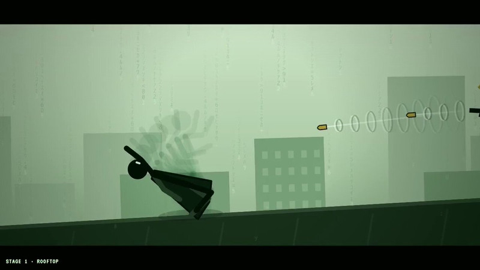</a></td>
<td width="50%" height="225" align="center" valign="middle"><a href="https://guanmo-ai.github.io/awesome-ai-motion/?lang=en#case-2107699773654581298">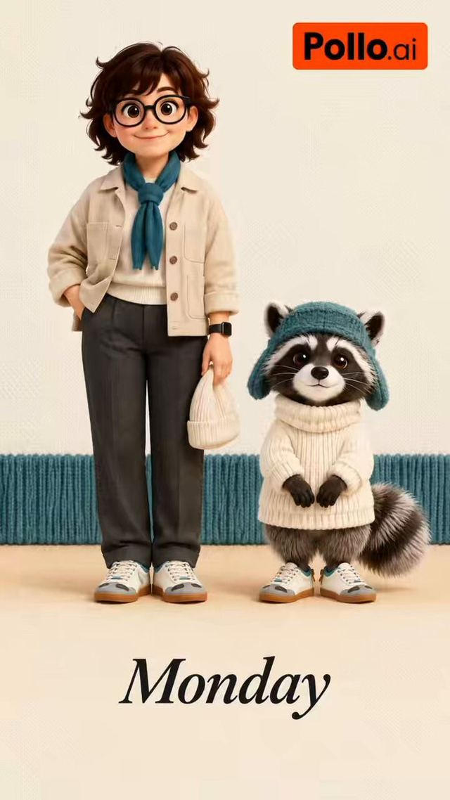</a></td>
</tr>
<tr>
<td width="50%" valign="top"><strong>NEO CRASH: a side-scrolling action game</strong> <a href="https://x.com/the_vibepreneur">@the_vibepreneur</a> · Pixel art &amp; characters 0:49 · Bookmarks 0 · Details pending <a href="https://guanmo-ai.github.io/awesome-ai-motion/?lang=en#case-2107496783635185802">▶ Play</a> · <a href="https://x.com/the_vibepreneur/status/2107496783635185802">Original post</a></td>
<td width="50%" valign="top"><strong>Laffie and Moti: Five Weekday Outfits</strong> <a href="https://x.com/Colorinmyspirit">@Colorinmyspirit</a> · Pixel art &amp; characters 0:55 · Bookmarks 0 · Details pending <a href="https://guanmo-ai.github.io/awesome-ai-motion/?lang=en#case-2107699773654581298">▶ Play</a> · <a href="https://x.com/Colorinmyspirit/status/2107699773654581298">Original post</a></td>
</tr>
</tbody>
<tbody>
<tr>
<td width="50%" height="225" align="center" valign="middle"></td>
<td width="50%" height="225" align="center" valign="middle"></td>
</tr>
<tr>
<td width="50%" valign="top"><strong>A Colorful Beach Character Animation</strong> <a href="https://x.com/MujahidKhanxre">@MujahidKhanxre</a> · Pixel art &amp; characters 0:10 · Bookmarks 0 · Details pending <a href="https://guanmo-ai.github.io/awesome-ai-motion/?lang=en#case-2107708209008156856">▶ Play</a> · <a href="https://x.com/MujahidKhanxre/status/2107708209008156856">Original post</a></td>
<td width="50%" valign="top"><strong>A Football Character Cinematography Test</strong> <a href="https://x.com/tysonsgs">@tysonsgs</a> · Pixel art &amp; characters 0:12 · Bookmarks 0 · Details pending <a href="https://guanmo-ai.github.io/awesome-ai-motion/?lang=en#case-2107876103759016308">▶ Play</a> · <a href="https://x.com/tysonsgs/status/2107876103759016308">Original post</a></td>
</tr>
</tbody>
<tbody>
<tr>
<td width="50%" height="225" align="center" valign="middle"></td>
<td width="50%" height="225" align="center" valign="middle"></td>
</tr>
<tr>
<td width="50%" valign="top"><strong>Synchronized Effects for a Talking Cartoon</strong> <a href="https://x.com/felipesuarez">@felipesuarez</a> · Pixel art &amp; characters 0:15 · Bookmarks 0 · Details pending <a href="https://guanmo-ai.github.io/awesome-ai-motion/?lang=en#case-2108302872077111794">▶ Play</a> · <a href="https://x.com/felipesuarez/status/2108302872077111794">Original post</a></td>
<td width="50%" valign="top"><strong>A MiniMax Design Character-rebuild Test</strong> <a href="https://x.com/akiyoshisan">@akiyoshisan</a> · Pixel art &amp; characters 0:30 · Bookmarks 0 · Details pending <a href="https://guanmo-ai.github.io/awesome-ai-motion/?lang=en#case-2108372587286065594">▶ Play</a> · <a href="https://x.com/akiyoshisan/status/2108372587286065594">Original post</a></td>
</tr>
</tbody>
<tbody>
<tr>
<td width="50%" height="225" align="center" valign="middle"></td>
<td width="50%" height="225" align="center" valign="middle"></td>
</tr>
<tr>
<td width="50%" valign="top"><strong>Silver Wolf on a Desktop</strong> <a href="https://x.com/MedioConxx">@MedioConxx</a> · Pixel art &amp; characters 0:07 · Bookmarks 0 · Details pending <a href="https://guanmo-ai.github.io/awesome-ai-motion/?lang=en#case-2108385688886591603">▶ Play</a> · <a href="https://x.com/MedioConxx/status/2108385688886591603">Original post</a></td>
<td width="50%" valign="top"><strong>An Eagle Above the Mountains</strong> <a href="https://x.com/saribali808">@saribali808</a> · Pixel art &amp; characters 0:05 · Bookmarks 0 · Details pending <a href="https://guanmo-ai.github.io/awesome-ai-motion/?lang=en#case-2108416863294435536">▶ Play</a> · <a href="https://x.com/saribali808/status/2108416863294435536">Original post</a></td>
</tr>
</tbody>
<tbody>
<tr>
<td width="50%" height="225" align="center" valign="middle"></td>
<td width="50%" height="225" align="center" valign="middle"><a href="https://guanmo-ai.github.io/awesome-ai-motion/?lang=en#case-2108927579503681764">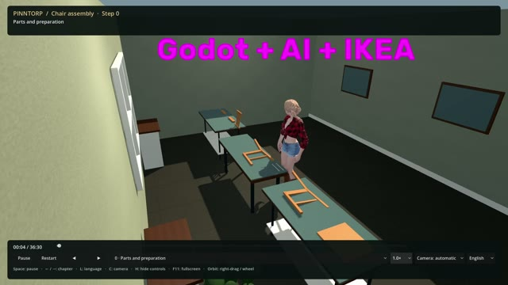</a></td>
</tr>
<tr>
<td width="50%" valign="top"><strong>Stories in a Letter: a World Post Day Animation</strong> <a href="https://x.com/Colorinmyspirit">@Colorinmyspirit</a> · Pixel art &amp; characters 0:15 · Bookmarks 0 · Details pending <a href="https://guanmo-ai.github.io/awesome-ai-motion/?lang=en#case-2108486059562782790">▶ Play</a> · <a href="https://x.com/Colorinmyspirit/status/2108486059562782790">Original post</a></td>
<td width="50%" valign="top"><strong>FarmGirl Assembles a Chair in Godot</strong> <a href="https://x.com/alexerichter">@alexerichter</a> · Pixel art &amp; characters 4:38 · Bookmarks 0 · Details pending <a href="https://guanmo-ai.github.io/awesome-ai-motion/?lang=en#case-2108927579503681764">▶ Play</a> · <a href="https://x.com/alexerichter/status/2108927579503681764">Original post</a></td>
</tr>
</tbody>
<tbody>
<tr>
<td width="50%" height="225" align="center" valign="middle"></td>
<td width="50%" height="225" align="center" valign="middle"></td>
</tr>
<tr>
<td width="50%" valign="top"><strong>Wareflow: a strategy-game-style warehouse interface</strong> <a href="https://x.com/DilumSanjaya">@DilumSanjaya</a> · 3D &amp; interactive 1:12 · Bookmarks 10,714 · Details pending <a href="https://guanmo-ai.github.io/awesome-ai-motion/?lang=en#case-2106426962738880879">▶ Play</a> · <a href="https://x.com/DilumSanjaya/status/2106426962738880879">Original post</a></td>
<td width="50%" valign="top"><strong>Spiderbench: Swinging Through a Browser City</strong> <a href="https://x.com/xikhar">@xikhar</a> · 3D &amp; interactive 2:21 · Bookmarks 3,777 · Details pending <a href="https://guanmo-ai.github.io/awesome-ai-motion/?lang=en#case-2104001664793600012">▶ Play</a> · <a href="https://x.com/xikhar/status/2104001664793600012">Original post</a></td>
</tr>
</tbody>
<tbody>
<tr>
<td width="50%" height="225" align="center" valign="middle"></td>
<td width="50%" height="225" align="center" valign="middle"></td>
</tr>
<tr>
<td width="50%" valign="top"><strong>Blender Recreation of a Conference Clip</strong> <a href="https://x.com/petergostev">@petergostev</a> · 3D &amp; interactive 0:20 · Bookmarks 3,710 · Details pending <a href="https://guanmo-ai.github.io/awesome-ai-motion/?lang=en#case-2096264296099459079">▶ Play</a> · <a href="https://x.com/petergostev/status/2096264296099459079">Original post</a></td>
<td width="50%" valign="top"><strong>Sketch Becomes a 3D Steam Train</strong> <a href="https://x.com/tomkrcha">@tomkrcha</a> · 3D &amp; interactive 0:34 · Bookmarks 3,540 · Details pending <a href="https://guanmo-ai.github.io/awesome-ai-motion/?lang=en#case-2095756085890310311">▶ Play</a> · <a href="https://x.com/tomkrcha/status/2095756085890310311">Original post</a></td>
</tr>
</tbody>
<tbody>
<tr>
<td width="50%" height="225" align="center" valign="middle"></td>
<td width="50%" height="225" align="center" valign="middle"></td>
</tr>
<tr>
<td width="50%" valign="top"><strong>Antikythera underwater game demo</strong> <a href="https://x.com/edwinarbus">@edwinarbus</a> · 3D &amp; interactive 1:00 · Bookmarks 1,701 · Details pending <a href="https://guanmo-ai.github.io/awesome-ai-motion/?lang=en#case-2102463453176979794">▶ Play</a> · <a href="https://x.com/edwinarbus/status/2102463453176979794">Original post</a></td>
<td width="50%" valign="top"><strong>Cozy Creek: a Browser Woodland Stream</strong> <a href="https://x.com/chetanankola">@chetanankola</a> · 3D &amp; interactive 0:59 · Bookmarks 1,559 · Details pending <a href="https://guanmo-ai.github.io/awesome-ai-motion/?lang=en#case-2107996576228753545">▶ Play</a> · <a href="https://x.com/chetanankola/status/2107996576228753545">Original post</a></td>
</tr>
</tbody>
<tbody>
<tr>
<td width="50%" height="225" align="center" valign="middle"></td>
<td width="50%" height="225" align="center" valign="middle"></td>
</tr>
<tr>
<td width="50%" valign="top"><strong>Logistics management as a strategy interface</strong> <a href="https://x.com/alexcooldev">@alexcooldev</a> · 3D &amp; interactive 1:14 · Bookmarks 1,343 · Details pending <a href="https://guanmo-ai.github.io/awesome-ai-motion/?lang=en#case-2106835487365419479">▶ Play</a> · <a href="https://x.com/alexcooldev/status/2106835487365419479">Original post</a></td>
<td width="50%" valign="top"><strong>Code-Rendered Mountain Stream</strong> <a href="https://x.com/hayashimon1">@hayashimon1</a> · 3D &amp; interactive 0:15 · Bookmarks 1,188 · Details pending <a href="https://guanmo-ai.github.io/awesome-ai-motion/?lang=en#case-2102576886182453454">▶ Play</a> · <a href="https://x.com/hayashimon1/status/2102576886182453454">Original post</a></td>
</tr>
</tbody>
<tbody>
<tr>
<td width="50%" height="225" align="center" valign="middle"></td>
<td width="50%" height="225" align="center" valign="middle"></td>
</tr>
<tr>
<td width="50%" valign="top"><strong>I Just Wanted to Fish: a fishing game demonstration</strong> <a href="https://x.com/ForkedPush">@ForkedPush</a> · 3D &amp; interactive 2:42 · Bookmarks 1,096 · Details pending <a href="https://guanmo-ai.github.io/awesome-ai-motion/?lang=en#case-2106313584829431901">▶ Play</a> · <a href="https://x.com/ForkedPush/status/2106313584829431901">Original post</a></td>
<td width="50%" valign="top"><strong>Catapult sketch becomes a simulation</strong> <a href="https://x.com/poolio">@poolio</a> · 3D &amp; interactive 1:20 · Bookmarks 1,073 · Details pending <a href="https://guanmo-ai.github.io/awesome-ai-motion/?lang=en#case-2102445641205248145">▶ Play</a> · <a href="https://x.com/poolio/status/2102445641205248145">Original post</a></td>
</tr>
</tbody>
<tbody>
<tr>
<td width="50%" height="225" align="center" valign="middle"></td>
<td width="50%" height="225" align="center" valign="middle"></td>
</tr>
<tr>
<td width="50%" valign="top"><strong>An experiment combining MOBA and fighting-game mechanics</strong> <a href="https://x.com/GamefxAI">@GamefxAI</a> · 3D &amp; interactive 1:43 · Bookmarks 1,009 · Details pending <a href="https://guanmo-ai.github.io/awesome-ai-motion/?lang=en#case-2106387548486738010">▶ Play</a> · <a href="https://x.com/GamefxAI/status/2106387548486738010">Original post</a></td>
<td width="50%" valign="top"><strong>A Code-generated HD-2D Pixel Game</strong> <a href="https://x.com/hakimieiqbal">@hakimieiqbal</a> · 3D &amp; interactive 1:20 · Bookmarks 879 · Details pending <a href="https://guanmo-ai.github.io/awesome-ai-motion/?lang=en#case-2107804983416467598">▶ Play</a> · <a href="https://x.com/hakimieiqbal/status/2107804983416467598">Original post</a></td>
</tr>
</tbody>
<tbody>
<tr>
<td width="50%" height="225" align="center" valign="middle"></td>
<td width="50%" height="225" align="center" valign="middle"></td>
</tr>
<tr>
<td width="50%" valign="top"><strong>Two model procedural Blender shots</strong> <a href="https://x.com/Stefan_3D_AI">@Stefan_3D_AI</a> · 3D &amp; interactive 0:46 · Bookmarks 773 · Details pending <a href="https://guanmo-ai.github.io/awesome-ai-motion/?lang=en#case-2102471841046786153">▶ Play</a> · <a href="https://x.com/Stefan_3D_AI/status/2102471841046786153">Original post</a></td>
<td width="50%" valign="top"><strong>Mine management as a strategy interface</strong> <a href="https://x.com/tradphi">@tradphi</a> · 3D &amp; interactive 0:30 · Bookmarks 738 · Details pending <a href="https://guanmo-ai.github.io/awesome-ai-motion/?lang=en#case-2107022944916709886">▶ Play</a> · <a href="https://x.com/tradphi/status/2107022944916709886">Original post</a></td>
</tr>
</tbody>
<tbody>
<tr>
<td width="50%" height="225" align="center" valign="middle"></td>
<td width="50%" height="225" align="center" valign="middle"></td>
</tr>
<tr>
<td width="50%" valign="top"><strong>Procedural Buildings: From Blender Nodes to the Web</strong> <a href="https://x.com/chirovisuals">@chirovisuals</a> · 3D &amp; interactive 1:15 · Bookmarks 673 · Details pending <a href="https://guanmo-ai.github.io/awesome-ai-motion/?lang=en#case-2104548658171834749">▶ Play</a> · <a href="https://x.com/chirovisuals/status/2104548658171834749">Original post</a></td>
<td width="50%" valign="top"><strong>3D Character Acting Experiment</strong> <a href="https://x.com/manaimovie">@manaimovie</a> · 3D &amp; interactive 0:05 · Bookmarks 618 · Details pending <a href="https://guanmo-ai.github.io/awesome-ai-motion/?lang=en#case-2103138089790996843">▶ Play</a> · <a href="https://x.com/manaimovie/status/2103138089790996843">Original post</a></td>
</tr>
</tbody>
<tbody>
<tr>
<td width="50%" height="225" align="center" valign="middle"></td>
<td width="50%" height="225" align="center" valign="middle"></td>
</tr>
<tr>
<td width="50%" valign="top"><strong>Code-Built Dragon Ship Scene</strong> <a href="https://x.com/MengTo">@MengTo</a> · 3D &amp; interactive 1:08 · Bookmarks 617 · Details pending <a href="https://guanmo-ai.github.io/awesome-ai-motion/?lang=en#case-2103122947133309311">▶ Play</a> · <a href="https://x.com/MengTo/status/2103122947133309311">Original post</a></td>
<td width="50%" valign="top"><strong>A Draggable Black Hole Lab for Gravitational Lensing</strong> <a href="https://x.com/Voxyz_ai">@Voxyz_ai</a> · 3D &amp; interactive 0:22 · Bookmarks 468 · Details pending <a href="https://guanmo-ai.github.io/awesome-ai-motion/?lang=en#case-2103117246860345550">▶ Play</a> · <a href="https://x.com/Voxyz_ai/status/2103117246860345550">Original post</a></td>
</tr>
</tbody>
<tbody>
<tr>
<td width="50%" height="225" align="center" valign="middle"></td>
<td width="50%" height="225" align="center" valign="middle"></td>
</tr>
<tr>
<td width="50%" valign="top"><strong>A VFX Iteration Demo with Effekseer and Godot</strong> <a href="https://x.com/KanaWorks_AI">@KanaWorks_AI</a> · 3D &amp; interactive 0:32 · Bookmarks 463 · Details pending <a href="https://guanmo-ai.github.io/awesome-ai-motion/?lang=en#case-2107752774423511539">▶ Play</a> · <a href="https://x.com/KanaWorks_AI/status/2107752774423511539">Original post</a></td>
<td width="50%" valign="top"><strong>A 3D visualization of river-flow calculations</strong> <a href="https://x.com/dobokuya77">@dobokuya77</a> · 3D &amp; interactive 0:46 · Bookmarks 426 · Details pending <a href="https://guanmo-ai.github.io/awesome-ai-motion/?lang=en#case-2106604492728967620">▶ Play</a> · <a href="https://x.com/dobokuya77/status/2106604492728967620">Original post</a></td>
</tr>
</tbody>
<tbody>
<tr>
<td width="50%" height="225" align="center" valign="middle"></td>
<td width="50%" height="225" align="center" valign="middle"></td>
</tr>
<tr>
<td width="50%" valign="top"><strong>An Interactive 3D Tour Inside a Data Center</strong> <a href="https://x.com/RyanSael">@RyanSael</a> · 3D &amp; interactive 0:34 · Bookmarks 425 · Details pending <a href="https://guanmo-ai.github.io/awesome-ai-motion/?lang=en#case-2102740041621762166">▶ Play</a> · <a href="https://x.com/RyanSael/status/2102740041621762166">Original post</a></td>
<td width="50%" valign="top"><strong>Rebuilding a 1906 San Francisco Street</strong> <a href="https://x.com/alexalbert__">@alexalbert__</a> · 3D &amp; interactive 0:08 · Bookmarks 418 · Details pending <a href="https://guanmo-ai.github.io/awesome-ai-motion/?lang=en#case-2102466523164274839">▶ Play</a> · <a href="https://x.com/alexalbert__/status/2102466523164274839">Original post</a></td>
</tr>
</tbody>
<tbody>
<tr>
<td width="50%" height="225" align="center" valign="middle"></td>
<td width="50%" height="225" align="center" valign="middle"></td>
</tr>
<tr>
<td width="50%" valign="top"><strong>Sunset Alley: a watercolor miniature world</strong> <a href="https://x.com/akakuma0219">@akakuma0219</a> · 3D &amp; interactive 0:45 · Bookmarks 399 · Details pending <a href="https://guanmo-ai.github.io/awesome-ai-motion/?lang=en#case-2105990418886480092">▶ Play</a> · <a href="https://x.com/akakuma0219/status/2105990418886480092">Original post</a></td>
<td width="50%" valign="top"><strong>A Starry Night Town with Flowing Brushstrokes</strong> <a href="https://x.com/simonxxoo">@simonxxoo</a> · 3D &amp; interactive 1:52 · Bookmarks 391 · Details pending <a href="https://guanmo-ai.github.io/awesome-ai-motion/?lang=en#case-2107793610230075416">▶ Play</a> · <a href="https://x.com/simonxxoo/status/2107793610230075416">Original post</a></td>
</tr>
</tbody>
<tbody>
<tr>
<td width="50%" height="225" align="center" valign="middle"></td>
<td width="50%" height="225" align="center" valign="middle"></td>
</tr>
<tr>
<td width="50%" valign="top"><strong>A tomato-growing Pomodoro timer</strong> <a href="https://x.com/ayhankorkmaz_">@ayhankorkmaz_</a> · 3D &amp; interactive 1:28 · Bookmarks 349 · Details pending <a href="https://guanmo-ai.github.io/awesome-ai-motion/?lang=en#case-2106684612822896770">▶ Play</a> · <a href="https://x.com/ayhankorkmaz_/status/2106684612822896770">Original post</a></td>
<td width="50%" valign="top"><strong>A GTA-style Bangalore neighborhood game prototype</strong> <a href="https://x.com/0xaxit">@0xaxit</a> · 3D &amp; interactive 1:01 · Bookmarks 299 · Details pending <a href="https://guanmo-ai.github.io/awesome-ai-motion/?lang=en#case-2106375041269342691">▶ Play</a> · <a href="https://x.com/0xaxit/status/2106375041269342691">Original post</a></td>
</tr>
</tbody>
<tbody>
<tr>
<td width="50%" height="225" align="center" valign="middle"></td>
<td width="50%" height="225" align="center" valign="middle"></td>
</tr>
<tr>
<td width="50%" valign="top"><strong>Blender exoskeleton redesign</strong> <a href="https://x.com/higgsfield_ai">@higgsfield_ai</a> · 3D &amp; interactive 0:29 · Bookmarks 298 · Details pending <a href="https://guanmo-ai.github.io/awesome-ai-motion/?lang=en#case-2102449278283313303">▶ Play</a> · <a href="https://x.com/higgsfield_ai/status/2102449278283313303">Original post</a></td>
<td width="50%" valign="top"><strong>Blender 3D Shot Experiment</strong> <a href="https://x.com/superalesha">@superalesha</a> · 3D &amp; interactive 1:01 · Bookmarks 285 · Details pending <a href="https://guanmo-ai.github.io/awesome-ai-motion/?lang=en#case-2102487989381156991">▶ Play</a> · <a href="https://x.com/superalesha/status/2102487989381156991">Original post</a></td>
</tr>
</tbody>
<tbody>
<tr>
<td width="50%" height="225" align="center" valign="middle"></td>
<td width="50%" height="225" align="center" valign="middle"></td>
</tr>
<tr>
<td width="50%" valign="top"><strong>Hollowmere: an explorable 3D world in five styles</strong> <a href="https://x.com/LexnLin">@LexnLin</a> · 3D &amp; interactive 0:41 · Bookmarks 259 · Details pending <a href="https://guanmo-ai.github.io/awesome-ai-motion/?lang=en#case-2106493673425047896">▶ Play</a> · <a href="https://x.com/LexnLin/status/2106493673425047896">Original post</a></td>
<td width="50%" valign="top"><strong>3D creature rig and animation test</strong> <a href="https://x.com/Stefan_3D_AI">@Stefan_3D_AI</a> · 3D &amp; interactive 0:25 · Bookmarks 256 · Details pending <a href="https://guanmo-ai.github.io/awesome-ai-motion/?lang=en#case-2102641562824135022">▶ Play</a> · <a href="https://x.com/Stefan_3D_AI/status/2102641562824135022">Original post</a></td>
</tr>
</tbody>
<tbody>
<tr>
<td width="50%" height="225" align="center" valign="middle"></td>
<td width="50%" height="225" align="center" valign="middle"></td>
</tr>
<tr>
<td width="50%" valign="top"><strong>Blender windmill build and animation</strong> <a href="https://x.com/higgsfield_ai">@higgsfield_ai</a> · 3D &amp; interactive 0:21 · Bookmarks 223 · Details pending <a href="https://guanmo-ai.github.io/awesome-ai-motion/?lang=en#case-2102453658889953717">▶ Play</a> · <a href="https://x.com/higgsfield_ai/status/2102453658889953717">Original post</a></td>
<td width="50%" valign="top"><strong>A 3D game prototype built around Tripo models</strong> <a href="https://x.com/xikhar">@xikhar</a> · 3D &amp; interactive 0:50 · Bookmarks 213 · Details pending <a href="https://guanmo-ai.github.io/awesome-ai-motion/?lang=en#case-2106527292633825693">▶ Play</a> · <a href="https://x.com/xikhar/status/2106527292633825693">Original post</a></td>
</tr>
</tbody>
<tbody>
<tr>
<td width="50%" height="225" align="center" valign="middle"></td>
<td width="50%" height="225" align="center" valign="middle"></td>
</tr>
<tr>
<td width="50%" valign="top"><strong>From realism to an impressionist WebGPU world</strong> <a href="https://x.com/gruberbuilds">@gruberbuilds</a> · 3D &amp; interactive 1:34 · Bookmarks 201 · Details pending <a href="https://guanmo-ai.github.io/awesome-ai-motion/?lang=en#case-2107285581109547516">▶ Play</a> · <a href="https://x.com/gruberbuilds/status/2107285581109547516">Original post</a></td>
<td width="50%" valign="top"><strong>Four AI humanoid-animation pipelines</strong> <a href="https://x.com/nazimadakli">@nazimadakli</a> · 3D &amp; interactive 0:12 · Bookmarks 175 · Details pending <a href="https://guanmo-ai.github.io/awesome-ai-motion/?lang=en#case-2107159129420964343">▶ Play</a> · <a href="https://x.com/nazimadakli/status/2107159129420964343">Original post</a></td>
</tr>
</tbody>
<tbody>
<tr>
<td width="50%" height="225" align="center" valign="middle"></td>
<td width="50%" height="225" align="center" valign="middle"></td>
</tr>
<tr>
<td width="50%" valign="top"><strong>An Explorable Fusion Reactor</strong> <a href="https://x.com/konstantinsaifo">@konstantinsaifo</a> · 3D &amp; interactive 0:43 · Bookmarks 174 · Details pending <a href="https://guanmo-ai.github.io/awesome-ai-motion/?lang=en#case-2104216976801587629">▶ Play</a> · <a href="https://x.com/konstantinsaifo/status/2104216976801587629">Original post</a></td>
<td width="50%" valign="top"><strong>Voxel Self-Portrait of an AI Model</strong> <a href="https://x.com/blueemi99">@blueemi99</a> · 3D &amp; interactive 0:15 · Bookmarks 171 · Details pending <a href="https://guanmo-ai.github.io/awesome-ai-motion/?lang=en#case-2102511304456212763">▶ Play</a> · <a href="https://x.com/blueemi99/status/2102511304456212763">Original post</a></td>
</tr>
</tbody>
<tbody>
<tr>
<td width="50%" height="225" align="center" valign="middle"></td>
<td width="50%" height="225" align="center" valign="middle"></td>
</tr>
<tr>
<td width="50%" valign="top"><strong>An LLM body-control experiment in Unreal</strong> <a href="https://x.com/L_ARCH_01">@L_ARCH_01</a> · 3D &amp; interactive 0:22 · Bookmarks 167 · Details pending <a href="https://guanmo-ai.github.io/awesome-ai-motion/?lang=en#case-2106656783221899534">▶ Play</a> · <a href="https://x.com/L_ARCH_01/status/2106656783221899534">Original post</a></td>
<td width="50%" valign="top"><strong>A Fragment-shader RISC-V Emulator in VRChat</strong> <a href="https://x.com/Michael_Moroz_">@Michael_Moroz_</a> · 3D &amp; interactive 3:11 · Bookmarks 163 · Details pending <a href="https://guanmo-ai.github.io/awesome-ai-motion/?lang=en#case-2107713497224130638">▶ Play</a> · <a href="https://x.com/Michael_Moroz_/status/2107713497224130638">Original post</a></td>
</tr>
</tbody>
<tbody>
<tr>
<td width="50%" height="225" align="center" valign="middle"></td>
<td width="50%" height="225" align="center" valign="middle"></td>
</tr>
<tr>
<td width="50%" valign="top"><strong>Iterating a sunset-harbor game scene</strong> <a href="https://x.com/prasenx">@prasenx</a> · 3D &amp; interactive 5:20 · Bookmarks 147 · Details pending <a href="https://guanmo-ai.github.io/awesome-ai-motion/?lang=en#case-2107451914954911838">▶ Play</a> · <a href="https://x.com/prasenx/status/2107451914954911838">Original post</a></td>
<td width="50%" valign="top"><strong>Floorplan Design: From 2D Layout to 3D Walkthrough</strong> <a href="https://x.com/akokoi1">@akokoi1</a> · 3D &amp; interactive 0:33 · Bookmarks 137 · Details pending <a href="https://guanmo-ai.github.io/awesome-ai-motion/?lang=en#case-2104520072014508316">▶ Play</a> · <a href="https://x.com/akokoi1/status/2104520072014508316">Original post</a></td>
</tr>
</tbody>
<tbody>
<tr>
<td width="50%" height="225" align="center" valign="middle"></td>
<td width="50%" height="225" align="center" valign="middle"></td>
</tr>
<tr>
<td width="50%" valign="top"><strong>Heatsink: a City Drone Racing Game</strong> <a href="https://x.com/aniketjart">@aniketjart</a> · 3D &amp; interactive 0:27 · Bookmarks 109 · Details pending <a href="https://guanmo-ai.github.io/awesome-ai-motion/?lang=en#case-2107973550300856334">▶ Play</a> · <a href="https://x.com/aniketjart/status/2107973550300856334">Original post</a></td>
<td width="50%" valign="top"><strong>An interactive miniature convenience store</strong> <a href="https://x.com/beefnoode">@beefnoode</a> · 3D &amp; interactive 0:13 · Bookmarks 100 · Details pending <a href="https://guanmo-ai.github.io/awesome-ai-motion/?lang=en#case-2107417865406324750">▶ Play</a> · <a href="https://x.com/beefnoode/status/2107417865406324750">Original post</a></td>
</tr>
</tbody>
<tbody>
<tr>
<td width="50%" height="225" align="center" valign="middle"></td>
<td width="50%" height="225" align="center" valign="middle"></td>
</tr>
<tr>
<td width="50%" valign="top"><strong>Through the Looking-Glass: the Garden of Live Flowers</strong> <a href="https://x.com/ring_hyacinth">@ring_hyacinth</a> · 3D &amp; interactive 1:55 · Bookmarks 99 · Details pending <a href="https://guanmo-ai.github.io/awesome-ai-motion/?lang=en#case-2106307854085029889">▶ Play</a> · <a href="https://x.com/ring_hyacinth/status/2106307854085029889">Original post</a></td>
<td width="50%" valign="top"><strong>Flying Wing: an Aircraft Cutaway</strong> <a href="https://x.com/konstantinsaifo">@konstantinsaifo</a> · 3D &amp; interactive 0:43 · Bookmarks 87 · Details pending <a href="https://guanmo-ai.github.io/awesome-ai-motion/?lang=en#case-2107752275980476558">▶ Play</a> · <a href="https://x.com/konstantinsaifo/status/2107752275980476558">Original post</a></td>
</tr>
</tbody>
<tbody>
<tr>
<td width="50%" height="225" align="center" valign="middle"></td>
<td width="50%" height="225" align="center" valign="middle"></td>
</tr>
<tr>
<td width="50%" valign="top"><strong>Rocket-Powered Car Soccer in the Browser</strong> <a href="https://x.com/BlendiByl">@BlendiByl</a> · 3D &amp; interactive 0:39 · Bookmarks 83 · Details pending <a href="https://guanmo-ai.github.io/awesome-ai-motion/?lang=en#case-2104800823620632641">▶ Play</a> · <a href="https://x.com/BlendiByl/status/2104800823620632641">Original post</a></td>
<td width="50%" valign="top"><strong>A 3D Flight Game through a Hurricane</strong> <a href="https://x.com/techartist_">@techartist_</a> · 3D &amp; interactive 0:21 · Bookmarks 82 · Details pending <a href="https://guanmo-ai.github.io/awesome-ai-motion/?lang=en#case-2108369354991759658">▶ Play</a> · <a href="https://x.com/techartist_/status/2108369354991759658">Original post</a></td>
</tr>
</tbody>
<tbody>
<tr>
<td width="50%" height="225" align="center" valign="middle"></td>
<td width="50%" height="225" align="center" valign="middle"></td>
</tr>
<tr>
<td width="50%" valign="top"><strong>A Multi-tool Island-hunting Prototype</strong> <a href="https://x.com/yyyole">@yyyole</a> · 3D &amp; interactive 1:04 · Bookmarks 76 · Details pending <a href="https://guanmo-ai.github.io/awesome-ai-motion/?lang=en#case-2108368534963413293">▶ Play</a> · <a href="https://x.com/yyyole/status/2108368534963413293">Original post</a></td>
<td width="50%" valign="top"><strong>Procedural cartoon scene comparison</strong> <a href="https://x.com/Stefan_3D_AI">@Stefan_3D_AI</a> · 3D &amp; interactive 0:30 · Bookmarks 73 · Details pending <a href="https://guanmo-ai.github.io/awesome-ai-motion/?lang=en#case-2102623690152419633">▶ Play</a> · <a href="https://x.com/Stefan_3D_AI/status/2102623690152419633">Original post</a></td>
</tr>
</tbody>
<tbody>
<tr>
<td width="50%" height="225" align="center" valign="middle"></td>
<td width="50%" height="225" align="center" valign="middle"></td>
</tr>
<tr>
<td width="50%" valign="top"><strong>Transforming Electric Truck Animation</strong> <a href="https://x.com/scottstts">@scottstts</a> · 3D &amp; interactive 1:13 · Bookmarks 72 · Details pending <a href="https://guanmo-ai.github.io/awesome-ai-motion/?lang=en#case-2102539904274325540">▶ Play</a> · <a href="https://x.com/scottstts/status/2102539904274325540">Original post</a></td>
<td width="50%" valign="top"><strong>A combable soft-body dragon comparison</strong> <a href="https://x.com/vib3coded">@vib3coded</a> · 3D &amp; interactive 0:18 · Bookmarks 72 · Details pending <a href="https://guanmo-ai.github.io/awesome-ai-motion/?lang=en#case-2107020311380033949">▶ Play</a> · <a href="https://x.com/vib3coded/status/2107020311380033949">Original post</a></td>
</tr>
</tbody>
<tbody>
<tr>
<td width="50%" height="225" align="center" valign="middle"></td>
<td width="50%" height="225" align="center" valign="middle"></td>
</tr>
<tr>
<td width="50%" valign="top"><strong>Glowing jellyfish: a Claude and Sol comparison</strong> <a href="https://x.com/SPAC89">@SPAC89</a> · 3D &amp; interactive 0:20 · Bookmarks 69 · Details pending <a href="https://guanmo-ai.github.io/awesome-ai-motion/?lang=en#case-2105783511433318451">▶ Play</a> · <a href="https://x.com/SPAC89/status/2105783511433318451">Original post</a></td>
<td width="50%" valign="top"><strong>A Wuxia ARPG from Character Topology to Combat</strong> <a href="https://x.com/cnyzgkc">@cnyzgkc</a> · 3D &amp; interactive 0:59 · Bookmarks 69 · Details pending <a href="https://guanmo-ai.github.io/awesome-ai-motion/?lang=en#case-2108159853533466672">▶ Play</a> · <a href="https://x.com/cnyzgkc/status/2108159853533466672">Original post</a></td>
</tr>
</tbody>
<tbody>
<tr>
<td width="50%" height="225" align="center" valign="middle"></td>
<td width="50%" height="225" align="center" valign="middle"></td>
</tr>
<tr>
<td width="50%" valign="top"><strong>A Halloween robot-control animation</strong> <a href="https://x.com/loganmb_">@loganmb_</a> · 3D &amp; interactive 0:31 · Bookmarks 66 · Details pending <a href="https://guanmo-ai.github.io/awesome-ai-motion/?lang=en#case-2106075623613694123">▶ Play</a> · <a href="https://x.com/loganmb_/status/2106075623613694123">Original post</a></td>
<td width="50%" valign="top"><strong>Reef Station: Water and Lighting in a Browser</strong> <a href="https://x.com/apekshik">@apekshik</a> · 3D &amp; interactive 0:40 · Bookmarks 66 · Details pending <a href="https://guanmo-ai.github.io/awesome-ai-motion/?lang=en#case-2107938887679267180">▶ Play</a> · <a href="https://x.com/apekshik/status/2107938887679267180">Original post</a></td>
</tr>
</tbody>
<tbody>
<tr>
<td width="50%" height="225" align="center" valign="middle"></td>
<td width="50%" height="225" align="center" valign="middle"></td>
</tr>
<tr>
<td width="50%" valign="top"><strong>3D Flyover Above Manhattan</strong> <a href="https://x.com/Dimillian">@Dimillian</a> · 3D &amp; interactive 0:10 · Bookmarks 58 · Details pending <a href="https://guanmo-ai.github.io/awesome-ai-motion/?lang=en#case-2096478021234426059">▶ Play</a> · <a href="https://x.com/Dimillian/status/2096478021234426059">Original post</a></td>
<td width="50%" valign="top"><strong>The Loom: a voxel-island landing-page experiment</strong> <a href="https://x.com/Mr_Salio">@Mr_Salio</a> · 3D &amp; interactive 0:45 · Bookmarks 52 · Details pending <a href="https://guanmo-ai.github.io/awesome-ai-motion/?lang=en#case-2105774088492916757">▶ Play</a> · <a href="https://x.com/Mr_Salio/status/2105774088492916757">Original post</a></td>
</tr>
</tbody>
<tbody>
<tr>
<td width="50%" height="225" align="center" valign="middle"></td>
<td width="50%" height="225" align="center" valign="middle"></td>
</tr>
<tr>
<td width="50%" valign="top"><strong>Explorable 3D eye demo</strong> <a href="https://x.com/higgsfield_ai">@higgsfield_ai</a> · 3D &amp; interactive 0:20 · Bookmarks 40 · Details pending <a href="https://guanmo-ai.github.io/awesome-ai-motion/?lang=en#case-2102536138884092185">▶ Play</a> · <a href="https://x.com/higgsfield_ai/status/2102536138884092185">Original post</a></td>
<td width="50%" valign="top"><strong>Reference-Guided Blender Scene Build</strong> <a href="https://x.com/OriSilver">@OriSilver</a> · 3D &amp; interactive 0:28 · Bookmarks 34 · Details pending <a href="https://guanmo-ai.github.io/awesome-ai-motion/?lang=en#case-2102817977812824335">▶ Play</a> · <a href="https://x.com/OriSilver/status/2102817977812824335">Original post</a></td>
</tr>
</tbody>
<tbody>
<tr>
<td width="50%" height="225" align="center" valign="middle"></td>
<td width="50%" height="225" align="center" valign="middle"></td>
</tr>
<tr>
<td width="50%" valign="top"><strong>Mars GT: a driving demo through red canyons</strong> <a href="https://x.com/AndreiProvkin">@AndreiProvkin</a> · 3D &amp; interactive 1:06 · Bookmarks 33 · Details pending <a href="https://guanmo-ai.github.io/awesome-ai-motion/?lang=en#case-2106449409978626416">▶ Play</a> · <a href="https://x.com/AndreiProvkin/status/2106449409978626416">Original post</a></td>
<td width="50%" valign="top"><strong>Skyhold: Balancing a Floating Island</strong> <a href="https://x.com/0xbobaaa">@0xbobaaa</a> · 3D &amp; interactive 0:45 · Bookmarks 20 · Details pending <a href="https://guanmo-ai.github.io/awesome-ai-motion/?lang=en#case-2108495368585371666">▶ Play</a> · <a href="https://x.com/0xbobaaa/status/2108495368585371666">Original post</a></td>
</tr>
</tbody>
<tbody>
<tr>
<td width="50%" height="225" align="center" valign="middle"></td>
<td width="50%" height="225" align="center" valign="middle"></td>
</tr>
<tr>
<td width="50%" valign="top"><strong>3D Seaside Cycling Scene</strong> <a href="https://x.com/liu8in">@liu8in</a> · 3D &amp; interactive 0:27 · Bookmarks 19 · Details pending <a href="https://guanmo-ai.github.io/awesome-ai-motion/?lang=en#case-2102528278732894667">▶ Play</a> · <a href="https://x.com/liu8in/status/2102528278732894667">Original post</a></td>
<td width="50%" valign="top"><strong>Jelly World: an Arctic-island comparison</strong> <a href="https://x.com/vib3coded">@vib3coded</a> · 3D &amp; interactive 0:18 · Bookmarks 19 · Details pending <a href="https://guanmo-ai.github.io/awesome-ai-motion/?lang=en#case-2107455583129313304">▶ Play</a> · <a href="https://x.com/vib3coded/status/2107455583129313304">Original post</a></td>
</tr>
</tbody>
<tbody>
<tr>
<td width="50%" height="225" align="center" valign="middle"></td>
<td width="50%" height="225" align="center" valign="middle"></td>
</tr>
<tr>
<td width="50%" valign="top"><strong>A new HUD for an Astra-built Rust game</strong> <a href="https://x.com/Dimillian">@Dimillian</a> · 3D &amp; interactive 0:27 · Bookmarks 18 · Details pending <a href="https://guanmo-ai.github.io/awesome-ai-motion/?lang=en#case-2107529401567207465">▶ Play</a> · <a href="https://x.com/Dimillian/status/2107529401567207465">Original post</a></td>
<td width="50%" valign="top"><strong>A Horror Game Refined with Two Models</strong> <a href="https://x.com/LexnLin">@LexnLin</a> · 3D &amp; interactive 0:45 · Bookmarks 17 · Details pending <a href="https://guanmo-ai.github.io/awesome-ai-motion/?lang=en#case-2108301624515137601">▶ Play</a> · <a href="https://x.com/LexnLin/status/2108301624515137601">Original post</a></td>
</tr>
</tbody>
<tbody>
<tr>
<td width="50%" height="225" align="center" valign="middle"></td>
<td width="50%" height="225" align="center" valign="middle"></td>
</tr>
<tr>
<td width="50%" valign="top"><strong>Jelly sakura: Opus and Astra comparison</strong> <a href="https://x.com/Artless101">@Artless101</a> · 3D &amp; interactive 0:19 · Bookmarks 13 · Details pending <a href="https://guanmo-ai.github.io/awesome-ai-motion/?lang=en#case-2105559382150742523">▶ Play</a> · <a href="https://x.com/Artless101/status/2105559382150742523">Original post</a></td>
<td width="50%" valign="top"><strong>An interactive house from foundation to finish</strong> <a href="https://x.com/techartist_">@techartist_</a> · 3D &amp; interactive 0:37 · Bookmarks 13 · Details pending <a href="https://guanmo-ai.github.io/awesome-ai-motion/?lang=en#case-2105350783416021472">▶ Play</a> · <a href="https://x.com/techartist_/status/2105350783416021472">Original post</a></td>
</tr>
</tbody>
<tbody>
<tr>
<td width="50%" height="225" align="center" valign="middle"></td>
<td width="50%" height="225" align="center" valign="middle"></td>
</tr>
<tr>
<td width="50%" valign="top"><strong>Three.js devices and a layer-based design tool</strong> <a href="https://x.com/MengTo">@MengTo</a> · 3D &amp; interactive 1:14 · Bookmarks 11 · Details pending <a href="https://guanmo-ai.github.io/awesome-ai-motion/?lang=en#case-2105680287854440715">▶ Play</a> · <a href="https://x.com/MengTo/status/2105680287854440715">Original post</a></td>
<td width="50%" valign="top"><strong>A Shaoshan 8 Locomotive on a Drivable Loop</strong> <a href="https://x.com/akokoi1">@akokoi1</a> · 3D &amp; interactive 0:31 · Bookmarks 10 · Details pending <a href="https://guanmo-ai.github.io/awesome-ai-motion/?lang=en#case-2104222017696469188">▶ Play</a> · <a href="https://x.com/akokoi1/status/2104222017696469188">Original post</a></td>
</tr>
</tbody>
<tbody>
<tr>
<td width="50%" height="225" align="center" valign="middle"></td>
<td width="50%" height="225" align="center" valign="middle"></td>
</tr>
<tr>
<td width="50%" valign="top"><strong>Real-Time Rendered Mech Shot</strong> <a href="https://x.com/wizardbrainz">@wizardbrainz</a> · 3D &amp; interactive 0:24 · Bookmarks 10 · Details pending <a href="https://guanmo-ai.github.io/awesome-ai-motion/?lang=en#case-2102755328161116223">▶ Play</a> · <a href="https://x.com/wizardbrainz/status/2102755328161116223">Original post</a></td>
<td width="50%" valign="top"><strong>Two Models Design a Dating-game UI</strong> <a href="https://x.com/yunma33331111">@yunma33331111</a> · 3D &amp; interactive 0:10 · Bookmarks 9 · Details pending <a href="https://guanmo-ai.github.io/awesome-ai-motion/?lang=en#case-2108168718308302855">▶ Play</a> · <a href="https://x.com/yunma33331111/status/2108168718308302855">Original post</a></td>
</tr>
</tbody>
<tbody>
<tr>
<td width="50%" height="225" align="center" valign="middle"></td>
<td width="50%" height="225" align="center" valign="middle"></td>
</tr>
<tr>
<td width="50%" valign="top"><strong>An OpenAI Dot Handheld Escape-room Game</strong> <a href="https://x.com/fedesarquis">@fedesarquis</a> · 3D &amp; interactive 0:14 · Bookmarks 8 · Details pending <a href="https://guanmo-ai.github.io/awesome-ai-motion/?lang=en#case-2108302123553247742">▶ Play</a> · <a href="https://x.com/fedesarquis/status/2108302123553247742">Original post</a></td>
<td width="50%" valign="top"><strong>A Sketch-Style Walk Inspired by Goa</strong> <a href="https://x.com/chetanankola">@chetanankola</a> · 3D &amp; interactive 1:06 · Bookmarks 8 · Details pending <a href="https://guanmo-ai.github.io/awesome-ai-motion/?lang=en#case-2104719287613341732">▶ Play</a> · <a href="https://x.com/chetanankola/status/2104719287613341732">Original post</a></td>
</tr>
</tbody>
<tbody>
<tr>
<td width="50%" height="225" align="center" valign="middle"></td>
<td width="50%" height="225" align="center" valign="middle"></td>
</tr>
<tr>
<td width="50%" valign="top"><strong>BLOCKWORLD: A Browser Voxel World</strong> <a href="https://x.com/L1vsun">@L1vsun</a> · 3D &amp; interactive 0:32 · Bookmarks 7 · Details pending <a href="https://guanmo-ai.github.io/awesome-ai-motion/?lang=en#case-2105020794602676465">▶ Play</a> · <a href="https://x.com/L1vsun/status/2105020794602676465">Original post</a></td>
<td width="50%" valign="top"><strong>A Three.js Rock-Skipping Game</strong> <a href="https://x.com/llama3dstudio">@llama3dstudio</a> · 3D &amp; interactive 0:44 · Bookmarks 6 · Details pending <a href="https://guanmo-ai.github.io/awesome-ai-motion/?lang=en#case-2104115092124012980">▶ Play</a> · <a href="https://x.com/llama3dstudio/status/2104115092124012980">Original post</a></td>
</tr>
</tbody>
<tbody>
<tr>
<td width="50%" height="225" align="center" valign="middle"></td>
<td width="50%" height="225" align="center" valign="middle"></td>
</tr>
<tr>
<td width="50%" valign="top"><strong>Haiku and Opus Build a Scroll-animation Page</strong> <a href="https://x.com/exploraX_">@exploraX_</a> · 3D &amp; interactive 0:53 · Bookmarks 5 · Details pending <a href="https://guanmo-ai.github.io/awesome-ai-motion/?lang=en#case-2108082845528756475">▶ Play</a> · <a href="https://x.com/exploraX_/status/2108082845528756475">Original post</a></td>
<td width="50%" valign="top"><strong>An Opus-built CRPG prologue</strong> <a href="https://x.com/Ainthropos">@Ainthropos</a> · 3D &amp; interactive 2:05 · Bookmarks 4 · Details pending <a href="https://guanmo-ai.github.io/awesome-ai-motion/?lang=en#case-2107581537453805650">▶ Play</a> · <a href="https://x.com/Ainthropos/status/2107581537453805650">Original post</a></td>
</tr>
</tbody>
<tbody>
<tr>
<td width="50%" height="225" align="center" valign="middle"></td>
<td width="50%" height="225" align="center" valign="middle"></td>
</tr>
<tr>
<td width="50%" valign="top"><strong>Apple Park: a browser tour</strong> <a href="https://x.com/RyanSael">@RyanSael</a> · 3D &amp; interactive 0:30 · Bookmarks 4 · Details pending <a href="https://guanmo-ai.github.io/awesome-ai-motion/?lang=en#case-2107499672915021992">▶ Play</a> · <a href="https://x.com/RyanSael/status/2107499672915021992">Original post</a></td>
<td width="50%" valign="top"><strong>An updated browser zombie game</strong> <a href="https://x.com/SimonasLTU1">@SimonasLTU1</a> · 3D &amp; interactive 2:34 · Bookmarks 4 · Details pending <a href="https://guanmo-ai.github.io/awesome-ai-motion/?lang=en#case-2105559563764220114">▶ Play</a> · <a href="https://x.com/SimonasLTU1/status/2105559563764220114">Original post</a></td>
</tr>
</tbody>
<tbody>
<tr>
<td width="50%" height="225" align="center" valign="middle"></td>
<td width="50%" height="225" align="center" valign="middle"></td>
</tr>
<tr>
<td width="50%" valign="top"><strong>ENDGAME: a Horror-game Experiment on Spawn</strong> <a href="https://x.com/majidmanzarpour">@majidmanzarpour</a> · 3D &amp; interactive 1:02 · Bookmarks 3 · Details pending <a href="https://guanmo-ai.github.io/awesome-ai-motion/?lang=en#case-2107633024909377612">▶ Play</a> · <a href="https://x.com/majidmanzarpour/status/2107633024909377612">Original post</a></td>
<td width="50%" valign="top"><strong>From intake to exhaust: a 3D jet-engine demo</strong> <a href="https://x.com/techartist_">@techartist_</a> · 3D &amp; interactive 0:24 · Bookmarks 3 · Details pending <a href="https://guanmo-ai.github.io/awesome-ai-motion/?lang=en#case-2106064200535859685">▶ Play</a> · <a href="https://x.com/techartist_/status/2106064200535859685">Original post</a></td>
</tr>
</tbody>
<tbody>
<tr>
<td width="50%" height="225" align="center" valign="middle"></td>
<td width="50%" height="225" align="center" valign="middle"></td>
</tr>
<tr>
<td width="50%" valign="top"><strong>A code-built seaplane scene</strong> <a href="https://x.com/mdaman010">@mdaman010</a> · 3D &amp; interactive 1:43 · Bookmarks 3 · Details pending <a href="https://guanmo-ai.github.io/awesome-ai-motion/?lang=en#case-2107166049326285268">▶ Play</a> · <a href="https://x.com/mdaman010/status/2107166049326285268">Original post</a></td>
<td width="50%" valign="top"><strong>An Interactive Portfolio of Four AIGC Projects</strong> <a href="https://x.com/Jinghui_Dong">@Jinghui_Dong</a> · 3D &amp; interactive 1:01 · Bookmarks 3 · Details pending <a href="https://guanmo-ai.github.io/awesome-ai-motion/?lang=en#case-2108079671783170156">▶ Play</a> · <a href="https://x.com/Jinghui_Dong/status/2108079671783170156">Original post</a></td>
</tr>
</tbody>
<tbody>
<tr>
<td width="50%" height="225" align="center" valign="middle"></td>
<td width="50%" height="225" align="center" valign="middle"></td>
</tr>
<tr>
<td width="50%" valign="top"><strong>SOMNOLITH α: an Abstract Exploration Game</strong> <a href="https://x.com/minima_ai">@minima_ai</a> · 3D &amp; interactive 0:32 · Bookmarks 2 · Details pending <a href="https://guanmo-ai.github.io/awesome-ai-motion/?lang=en#case-2108481299707203767">▶ Play</a> · <a href="https://x.com/minima_ai/status/2108481299707203767">Original post</a></td>
<td width="50%" valign="top"><strong>Updraft: a game trailer for 21 worlds</strong> <a href="https://x.com/EMostaque">@EMostaque</a> · 3D &amp; interactive 0:59 · Bookmarks 2 · Details pending <a href="https://guanmo-ai.github.io/awesome-ai-motion/?lang=en#case-2106065029850091943">▶ Play</a> · <a href="https://x.com/EMostaque/status/2106065029850091943">Original post</a></td>
</tr>
</tbody>
<tbody>
<tr>
<td width="50%" height="225" align="center" valign="middle"></td>
<td width="50%" height="225" align="center" valign="middle"></td>
</tr>
<tr>
<td width="50%" valign="top"><strong>Severance: a Code-drawn Shooter</strong> <a href="https://x.com/Andrew_Blumson">@Andrew_Blumson</a> · 3D &amp; interactive 2:16 · Bookmarks 2 · Details pending <a href="https://guanmo-ai.github.io/awesome-ai-motion/?lang=en#case-2108314700371099863">▶ Play</a> · <a href="https://x.com/Andrew_Blumson/status/2108314700371099863">Original post</a></td>
<td width="50%" valign="top"><strong>Zathura: a Broken House in Space</strong> <a href="https://x.com/DrstaOne">@DrstaOne</a> · 3D &amp; interactive 0:48 · Bookmarks 2 · Details pending <a href="https://guanmo-ai.github.io/awesome-ai-motion/?lang=en#case-2107849452707107170">▶ Play</a> · <a href="https://x.com/DrstaOne/status/2107849452707107170">Original post</a></td>
</tr>
</tbody>
<tbody>
<tr>
<td width="50%" height="225" align="center" valign="middle"></td>
<td width="50%" height="225" align="center" valign="middle"></td>
</tr>
<tr>
<td width="50%" valign="top"><strong>A cozy seafaring game in Rive</strong> <a href="https://x.com/drawsgood">@drawsgood</a> · 3D &amp; interactive 3:10 · Bookmarks 2 · Details pending <a href="https://guanmo-ai.github.io/awesome-ai-motion/?lang=en#case-2107624896247271672">▶ Play</a> · <a href="https://x.com/drawsgood/status/2107624896247271672">Original post</a></td>
<td width="50%" valign="top"><strong>Five Controls Transform a Cliffside House</strong> <a href="https://x.com/mizugame_22">@mizugame_22</a> · 3D &amp; interactive 0:21 · Bookmarks 2 · Details pending <a href="https://guanmo-ai.github.io/awesome-ai-motion/?lang=en#case-2108325457389359268">▶ Play</a> · <a href="https://x.com/mizugame_22/status/2108325457389359268">Original post</a></td>
</tr>
</tbody>
<tbody>
<tr>
<td width="50%" height="225" align="center" valign="middle"></td>
<td width="50%" height="225" align="center" valign="middle"></td>
</tr>
<tr>
<td width="50%" valign="top"><strong>Rebuilding a TV Shot from One Reference</strong> <a href="https://x.com/varga_bee">@varga_bee</a> · 3D &amp; interactive 0:05 · Bookmarks 2 · Details pending <a href="https://guanmo-ai.github.io/awesome-ai-motion/?lang=en#case-2102744321355067761">▶ Play</a> · <a href="https://x.com/varga_bee/status/2102744321355067761">Original post</a></td>
<td width="50%" valign="top"><strong>From Floor Plan to a Walkable House</strong> <a href="https://x.com/aayush4soni">@aayush4soni</a> · 3D &amp; interactive 0:38 · Bookmarks 2 · Details pending <a href="https://guanmo-ai.github.io/awesome-ai-motion/?lang=en#case-2104181266459644283">▶ Play</a> · <a href="https://x.com/aayush4soni/status/2104181266459644283">Original post</a></td>
</tr>
</tbody>
<tbody>
<tr>
<td width="50%" height="225" align="center" valign="middle"></td>
<td width="50%" height="225" align="center" valign="middle"></td>
</tr>
<tr>
<td width="50%" valign="top"><strong>Clear Skies: a Pink Pixel Mini-game</strong> <a href="https://x.com/oliveolveioveil">@oliveolveioveil</a> · 3D &amp; interactive 1:12 · Bookmarks 1 · Details pending <a href="https://guanmo-ai.github.io/awesome-ai-motion/?lang=en#case-2108332649802834104">▶ Play</a> · <a href="https://x.com/oliveolveioveil/status/2108332649802834104">Original post</a></td>
<td width="50%" valign="top"><strong>TRI-USAGI: a Side-view Shooting Action Game</strong> <a href="https://x.com/act_pike">@act_pike</a> · 3D &amp; interactive 0:15 · Bookmarks 1 · Details pending <a href="https://guanmo-ai.github.io/awesome-ai-motion/?lang=en#case-2108154705549656175">▶ Play</a> · <a href="https://x.com/act_pike/status/2108154705549656175">Original post</a></td>
</tr>
</tbody>
<tbody>
<tr>
<td width="50%" height="225" align="center" valign="middle"></td>
<td width="50%" height="225" align="center" valign="middle"></td>
</tr>
<tr>
<td width="50%" valign="top"><strong>Workspace: A 3D Office for Coding Sessions</strong> <a href="https://x.com/kum1ta">@kum1ta</a> · 3D &amp; interactive 0:30 · Bookmarks 1 · Details pending <a href="https://guanmo-ai.github.io/awesome-ai-motion/?lang=en#case-2103998389058740521">▶ Play</a> · <a href="https://x.com/kum1ta/status/2103998389058740521">Original post</a></td>
<td width="50%" valign="top"><strong>Melon Jelly: drag and cut experiment</strong> <a href="https://x.com/Abmankendrick">@Abmankendrick</a> · 3D &amp; interactive 0:27 · Bookmarks 1 · Details pending <a href="https://guanmo-ai.github.io/awesome-ai-motion/?lang=en#case-2105675232954474831">▶ Play</a> · <a href="https://x.com/Abmankendrick/status/2105675232954474831">Original post</a></td>
</tr>
</tbody>
<tbody>
<tr>
<td width="50%" height="225" align="center" valign="middle"></td>
<td width="50%" height="225" align="center" valign="middle"></td>
</tr>
<tr>
<td width="50%" valign="top"><strong>Castle Critters: a Browser Castle Game</strong> <a href="https://x.com/PratikPatel_227">@PratikPatel_227</a> · 3D &amp; interactive 1:35 · Bookmarks 1 · Details pending <a href="https://guanmo-ai.github.io/awesome-ai-motion/?lang=en#case-2108484938983235837">▶ Play</a> · <a href="https://x.com/PratikPatel_227/status/2108484938983235837">Original post</a></td>
<td width="50%" valign="top"><strong>A Koi Pond with Ripples and Drifting Leaves</strong> <a href="https://x.com/anvithbuilds">@anvithbuilds</a> · 3D &amp; interactive 0:09 · Bookmarks 1 · Details pending <a href="https://guanmo-ai.github.io/awesome-ai-motion/?lang=en#case-2105220761086828778">▶ Play</a> · <a href="https://x.com/anvithbuilds/status/2105220761086828778">Original post</a></td>
</tr>
</tbody>
<tbody>
<tr>
<td width="50%" height="225" align="center" valign="middle"></td>
<td width="50%" height="225" align="center" valign="middle"></td>
</tr>
<tr>
<td width="50%" valign="top"><strong>House Model Explodes and Reassembles</strong> <a href="https://x.com/zdkiel_labs">@zdkiel_labs</a> · 3D &amp; interactive 0:15 · Bookmarks 1 · Details pending <a href="https://guanmo-ai.github.io/awesome-ai-motion/?lang=en#case-2102722754172850310">▶ Play</a> · <a href="https://x.com/zdkiel_labs/status/2102722754172850310">Original post</a></td>
<td width="50%" valign="top"><strong>Symbiote suit 3D game demo</strong> <a href="https://x.com/stfu0911">@stfu0911</a> · 3D &amp; interactive 2:10 · Bookmarks 1 · Details pending <a href="https://guanmo-ai.github.io/awesome-ai-motion/?lang=en#case-2104246455938797888">▶ Play</a> · <a href="https://x.com/stfu0911/status/2104246455938797888">Original post</a></td>
</tr>
</tbody>
<tbody>
<tr>
<td width="50%" height="225" align="center" valign="middle"></td>
<td width="50%" height="225" align="center" valign="middle"></td>
</tr>
<tr>
<td width="50%" valign="top"><strong>A Folding-phone Anatomy and Scroll Loop</strong> <a href="https://x.com/saitopatopo">@saitopatopo</a> · 3D &amp; interactive 0:12 · Bookmarks 1 · Details pending <a href="https://guanmo-ai.github.io/awesome-ai-motion/?lang=en#case-2108156566059020511">▶ Play</a> · <a href="https://x.com/saitopatopo/status/2108156566059020511">Original post</a></td>
<td width="50%" valign="top"><strong>The Apex Rush: A Single-File 3D Browser Game</strong> <a href="https://x.com/sidgiri2104">@sidgiri2104</a> · 3D &amp; interactive 1:07 · Bookmarks 1 · Details pending <a href="https://guanmo-ai.github.io/awesome-ai-motion/?lang=en#case-2104820347875045751">▶ Play</a> · <a href="https://x.com/sidgiri2104/status/2104820347875045751">Original post</a></td>
</tr>
</tbody>
<tbody>
<tr>
<td width="50%" height="225" align="center" valign="middle"></td>
<td width="50%" height="225" align="center" valign="middle"></td>
</tr>
<tr>
<td width="50%" valign="top"><strong>Reconstructing ancient Izumo Taisha</strong> <a href="https://x.com/yoshifujidesign">@yoshifujidesign</a> · 3D &amp; interactive 1:04 · Bookmarks 1 · Details pending <a href="https://guanmo-ai.github.io/awesome-ai-motion/?lang=en#case-2105679580191416322">▶ Play</a> · <a href="https://x.com/yoshifujidesign/status/2105679580191416322">Original post</a></td>
<td width="50%" valign="top"><strong>Two bus models in Blender</strong> <a href="https://x.com/0c103a">@0c103a</a> · 3D &amp; interactive 0:45 · Bookmarks 1 · Details pending <a href="https://guanmo-ai.github.io/awesome-ai-motion/?lang=en#case-2107494964410429923">▶ Play</a> · <a href="https://x.com/0c103a/status/2107494964410429923">Original post</a></td>
</tr>
</tbody>
<tbody>
<tr>
<td width="50%" height="225" align="center" valign="middle"></td>
<td width="50%" height="225" align="center" valign="middle"></td>
</tr>
<tr>
<td width="50%" valign="top"><strong>Hraunheim: a Home beside a Lava River</strong> <a href="https://x.com/ottollm">@ottollm</a> · 3D &amp; interactive 0:20 · Bookmarks 1 · Details pending <a href="https://guanmo-ai.github.io/awesome-ai-motion/?lang=en#case-2108311732376453546">▶ Play</a> · <a href="https://x.com/ottollm/status/2108311732376453546">Original post</a></td>
<td width="50%" valign="top"><strong>From One Image to a Three.js Scene</strong> <a href="https://x.com/NicksonTan">@NicksonTan</a> · 3D &amp; interactive 1:12 · Bookmarks 1 · Details pending <a href="https://guanmo-ai.github.io/awesome-ai-motion/?lang=en#case-2102798578427265368">▶ Play</a> · <a href="https://x.com/NicksonTan/status/2102798578427265368">Original post</a></td>
</tr>
</tbody>
<tbody>
<tr>
<td width="50%" height="225" align="center" valign="middle"></td>
<td width="50%" height="225" align="center" valign="middle"></td>
</tr>
<tr>
<td width="50%" valign="top"><strong>Runtime Repairs for FlightGear Aircraft</strong> <a href="https://x.com/lekanadeyeri">@lekanadeyeri</a> · 3D &amp; interactive 0:11 · Bookmarks 0 · Details pending <a href="https://guanmo-ai.github.io/awesome-ai-motion/?lang=en#case-2108331960636731899">▶ Play</a> · <a href="https://x.com/lekanadeyeri/status/2108331960636731899">Original post</a></td>
<td width="50%" valign="top"><strong>Two Godot Character-status Layouts</strong> <a href="https://x.com/yunma33331111">@yunma33331111</a> · 3D &amp; interactive 0:26 · Bookmarks 0 · Details pending <a href="https://guanmo-ai.github.io/awesome-ai-motion/?lang=en#case-2108517265193025631">▶ Play</a> · <a href="https://x.com/yunma33331111/status/2108517265193025631">Original post</a></td>
</tr>
</tbody>
<tbody>
<tr>
<td width="50%" height="225" align="center" valign="middle"></td>
<td width="50%" height="225" align="center" valign="middle"></td>
</tr>
<tr>
<td width="50%" valign="top"><strong>Accra Crazy Trotro: An Accra Driving Game</strong> <a href="https://x.com/Ed_Forson">@Ed_Forson</a> · 3D &amp; interactive 2:15 · Bookmarks 0 · Details pending <a href="https://guanmo-ai.github.io/awesome-ai-motion/?lang=en#case-2108906748840972621">▶ Play</a> · <a href="https://x.com/Ed_Forson/status/2108906748840972621">Original post</a></td>
<td width="50%" valign="top"><strong>A Skull Town Browser Map Trailer</strong> <a href="https://x.com/nikooo777">@nikooo777</a> · 3D &amp; interactive 0:20 · Bookmarks 0 · Details pending <a href="https://guanmo-ai.github.io/awesome-ai-motion/?lang=en#case-2105075653183778925">▶ Play</a> · <a href="https://x.com/nikooo777/status/2105075653183778925">Original post</a></td>
</tr>
</tbody>
<tbody>
<tr>
<td width="50%" height="225" align="center" valign="middle"></td>
<td width="50%" height="225" align="center" valign="middle"></td>
</tr>
<tr>
<td width="50%" valign="top"><strong>Demolition Derby in the browser</strong> <a href="https://x.com/drcollect">@drcollect</a> · 3D &amp; interactive 0:16 · Bookmarks 0 · Details pending <a href="https://guanmo-ai.github.io/awesome-ai-motion/?lang=en#case-2105361031371383180">▶ Play</a> · <a href="https://x.com/drcollect/status/2105361031371383180">Original post</a></td>
<td width="50%" valign="top"><strong>A 3D supermarket operations simulator</strong> <a href="https://x.com/ballerinifb">@ballerinifb</a> · 3D &amp; interactive 1:28 · Bookmarks 0 · Details pending <a href="https://guanmo-ai.github.io/awesome-ai-motion/?lang=en#case-2107104693448999402">▶ Play</a> · <a href="https://x.com/ballerinifb/status/2107104693448999402">Original post</a></td>
</tr>
</tbody>
<tbody>
<tr>
<td width="50%" height="225" align="center" valign="middle"></td>
<td width="50%" height="225" align="center" valign="middle"></td>
</tr>
<tr>
<td width="50%" valign="top"><strong>A Pixel-game Devlog: a Codex-made Introduction</strong> <a href="https://x.com/DSTO_boardgamer">@DSTO_boardgamer</a> · 3D &amp; interactive 0:36 · Bookmarks 0 · Details pending <a href="https://guanmo-ai.github.io/awesome-ai-motion/?lang=en#case-2108507501402661118">▶ Play</a> · <a href="https://x.com/DSTO_boardgamer/status/2108507501402661118">Original post</a></td>
<td width="50%" valign="top"><strong>A Roguelike Shooter with a Live2D Character</strong> <a href="https://x.com/beko_X_account">@beko_X_account</a> · 3D &amp; interactive 0:45 · Bookmarks 0 · Details pending <a href="https://guanmo-ai.github.io/awesome-ai-motion/?lang=en#case-2108148762849980892">▶ Play</a> · <a href="https://x.com/beko_X_account/status/2108148762849980892">Original post</a></td>
</tr>
</tbody>
<tbody>
<tr>
<td width="50%" height="225" align="center" valign="middle"></td>
<td width="50%" height="225" align="center" valign="middle"></td>
</tr>
<tr>
<td width="50%" valign="top"><strong>A Bamboo-spear Throwing Game</strong> <a href="https://x.com/bDAxjGohPDX7XiV">@bDAxjGohPDX7XiV</a> · 3D &amp; interactive 0:15 · Bookmarks 0 · Details pending <a href="https://guanmo-ai.github.io/awesome-ai-motion/?lang=en#case-2108162966659224000">▶ Play</a> · <a href="https://x.com/bDAxjGohPDX7XiV/status/2108162966659224000">Original post</a></td>
<td width="50%" valign="top"><strong>Demon Slayer Takes over Portal 2</strong> <a href="https://x.com/sigf_ai">@sigf_ai</a> · 3D &amp; interactive 0:30 · Bookmarks 0 · Details pending <a href="https://guanmo-ai.github.io/awesome-ai-motion/?lang=en#case-2108319343712886998">▶ Play</a> · <a href="https://x.com/sigf_ai/status/2108319343712886998">Original post</a></td>
</tr>
</tbody>
<tbody>
<tr>
<td width="50%" height="225" align="center" valign="middle"></td>
<td width="50%" height="225" align="center" valign="middle"></td>
</tr>
<tr>
<td width="50%" valign="top"><strong>A Convex Game with AI Characters Fighting</strong> <a href="https://x.com/_sarant">@_sarant</a> · 3D &amp; interactive 0:33 · Bookmarks 0 · Details pending <a href="https://guanmo-ai.github.io/awesome-ai-motion/?lang=en#case-2108336621980360830">▶ Play</a> · <a href="https://x.com/_sarant/status/2108336621980360830">Original post</a></td>
<td width="50%" valign="top"><strong>A Three.js Personal Site Concept</strong> <a href="https://x.com/hymmakbar">@hymmakbar</a> · 3D &amp; interactive 1:07 · Bookmarks 0 · Details pending <a href="https://guanmo-ai.github.io/awesome-ai-motion/?lang=en#case-2105082553996820579">▶ Play</a> · <a href="https://x.com/hymmakbar/status/2105082553996820579">Original post</a></td>
</tr>
</tbody>
<tbody>
<tr>
<td width="50%" height="225" align="center" valign="middle"></td>
<td width="50%" height="225" align="center" valign="middle"></td>
</tr>
<tr>
<td width="50%" valign="top"><strong>PEABRAIN: from an image to a Godot cup game</strong> <a href="https://x.com/suth_a">@suth_a</a> · 3D &amp; interactive 0:24 · Bookmarks 0 · Details pending <a href="https://guanmo-ai.github.io/awesome-ai-motion/?lang=en#case-2105587887500911001">▶ Play</a> · <a href="https://x.com/suth_a/status/2105587887500911001">Original post</a></td>
<td width="50%" valign="top"><strong>Vector Tango: a mixed-reality aircraft hangar</strong> <a href="https://x.com/scobelverse">@scobelverse</a> · 3D &amp; interactive 0:08 · Bookmarks 0 · Details pending <a href="https://guanmo-ai.github.io/awesome-ai-motion/?lang=en#case-2107498407745225201">▶ Play</a> · <a href="https://x.com/scobelverse/status/2107498407745225201">Original post</a></td>
</tr>
</tbody>
<tbody>
<tr>
<td width="50%" height="225" align="center" valign="middle"></td>
<td width="50%" height="225" align="center" valign="middle"></td>
</tr>
<tr>
<td width="50%" valign="top"><strong>Dodging Falling Bamboo Spears</strong> <a href="https://x.com/bDAxjGohPDX7XiV">@bDAxjGohPDX7XiV</a> · 3D &amp; interactive 0:22 · Bookmarks 0 · Details pending <a href="https://guanmo-ai.github.io/awesome-ai-motion/?lang=en#case-2108169409856709062">▶ Play</a> · <a href="https://x.com/bDAxjGohPDX7XiV/status/2108169409856709062">Original post</a></td>
<td width="50%" valign="top"><strong>A Game Hero's Lightning-effect Update</strong> <a href="https://x.com/Toshi_nyaruo_AI">@Toshi_nyaruo_AI</a> · 3D &amp; interactive 0:18 · Bookmarks 0 · Details pending <a href="https://guanmo-ai.github.io/awesome-ai-motion/?lang=en#case-2108385330072272973">▶ Play</a> · <a href="https://x.com/Toshi_nyaruo_AI/status/2108385330072272973">Original post</a></td>
</tr>
</tbody>
<tbody>
<tr>
<td width="50%" height="225" align="center" valign="middle"></td>
<td width="50%" height="225" align="center" valign="middle"></td>
</tr>
<tr>
<td width="50%" valign="top"><strong>A touchable, sounding tesseract</strong> <a href="https://x.com/_postminimal">@_postminimal</a> · 3D &amp; interactive 0:55 · Bookmarks 0 · Details pending <a href="https://guanmo-ai.github.io/awesome-ai-motion/?lang=en#case-2105561265531957530">▶ Play</a> · <a href="https://x.com/_postminimal/status/2105561265531957530">Original post</a></td>
<td width="50%" valign="top"><strong>A Bamboo Pole-vaulting Game</strong> <a href="https://x.com/bDAxjGohPDX7XiV">@bDAxjGohPDX7XiV</a> · 3D &amp; interactive 0:17 · Bookmarks 0 · Details pending <a href="https://guanmo-ai.github.io/awesome-ai-motion/?lang=en#case-2108172640842359264">▶ Play</a> · <a href="https://x.com/bDAxjGohPDX7XiV/status/2108172640842359264">Original post</a></td>
</tr>
</tbody>
<tbody>
<tr>
<td width="50%" height="225" align="center" valign="middle"></td>
<td width="50%" height="225" align="center" valign="middle"></td>
</tr>
<tr>
<td width="50%" valign="top"><strong>An Interactive Watercolor Hummingbird</strong> <a href="https://x.com/Tentamasoba1016">@Tentamasoba1016</a> · 3D &amp; interactive 0:30 · Bookmarks 0 · Details pending <a href="https://guanmo-ai.github.io/awesome-ai-motion/?lang=en#case-2108321415606968363">▶ Play</a> · <a href="https://x.com/Tentamasoba1016/status/2108321415606968363">Original post</a></td>
<td width="50%" valign="top"><strong>SkateBIRD Takes over Quake</strong> <a href="https://x.com/sigf_ai">@sigf_ai</a> · 3D &amp; interactive 0:30 · Bookmarks 0 · Details pending <a href="https://guanmo-ai.github.io/awesome-ai-motion/?lang=en#case-2108371550617456882">▶ Play</a> · <a href="https://x.com/sigf_ai/status/2108371550617456882">Original post</a></td>
</tr>
</tbody>
<tbody>
<tr>
<td width="50%" height="225" align="center" valign="middle"></td>
<td width="50%" height="225" align="center" valign="middle"></td>
</tr>
<tr>
<td width="50%" valign="top"><strong>A House Designed as Code</strong> <a href="https://x.com/AJtheMongol">@AJtheMongol</a> · 3D &amp; interactive 0:51 · Bookmarks 0 · Details pending <a href="https://guanmo-ai.github.io/awesome-ai-motion/?lang=en#case-2104214187522318512">▶ Play</a> · <a href="https://x.com/AJtheMongol/status/2104214187522318512">Original post</a></td>
<td width="50%" valign="top"><strong>Worldmaker particle-system worlds</strong> <a href="https://x.com/Aaron_Wacker">@Aaron_Wacker</a> · 3D &amp; interactive 1:00 · Bookmarks 0 · Details pending <a href="https://guanmo-ai.github.io/awesome-ai-motion/?lang=en#case-2107640509967536301">▶ Play</a> · <a href="https://x.com/Aaron_Wacker/status/2107640509967536301">Original post</a></td>
</tr>
</tbody>
<tbody>
<tr>
<td width="50%" height="225" align="center" valign="middle"></td>
<td width="50%" height="225" align="center" valign="middle"></td>
</tr>
<tr>
<td width="50%" valign="top"><strong>YUDHVEER mythological action-game trailer</strong> <a href="https://x.com/TejasGovin17982">@TejasGovin17982</a> · 3D &amp; interactive 1:00 · Bookmarks 0 · Details pending <a href="https://guanmo-ai.github.io/awesome-ai-motion/?lang=en#case-2107663339664949463">▶ Play</a> · <a href="https://x.com/TejasGovin17982/status/2107663339664949463">Original post</a></td>
<td width="50%" valign="top"><strong>Sydney Harbour Bridge: Dawn to Dusk</strong> <a href="https://x.com/CeciliaW888">@CeciliaW888</a> · 3D &amp; interactive 0:23 · Bookmarks 0 · Details pending <a href="https://guanmo-ai.github.io/awesome-ai-motion/?lang=en#case-2104504480968683521">▶ Play</a> · <a href="https://x.com/CeciliaW888/status/2104504480968683521">Original post</a></td>
</tr>
</tbody>
<tbody>
<tr>
<td width="50%" height="225" align="center" valign="middle"></td>
<td width="50%" height="225" align="center" valign="middle"></td>
</tr>
<tr>
<td width="50%" valign="top"><strong>Underwater Room with Dolphins and a Harp</strong> <a href="https://x.com/VeronicaVZMusic">@VeronicaVZMusic</a> · 3D &amp; interactive 0:42 · Bookmarks 0 · Details pending <a href="https://guanmo-ai.github.io/awesome-ai-motion/?lang=en#case-2104740780208164947">▶ Play</a> · <a href="https://x.com/VeronicaVZMusic/status/2104740780208164947">Original post</a></td>
<td width="50%" valign="top"><strong>An interactive LEGO Ferrari F1 build</strong> <a href="https://x.com/eigeorguy">@eigeorguy</a> · 3D &amp; interactive 0:39 · Bookmarks 0 · Details pending <a href="https://guanmo-ai.github.io/awesome-ai-motion/?lang=en#case-2105346791021629821">▶ Play</a> · <a href="https://x.com/eigeorguy/status/2105346791021629821">Original post</a></td>
</tr>
</tbody>
<tbody>
<tr>
<td width="50%" height="225" align="center" valign="middle"></td>
<td width="50%" height="225" align="center" valign="middle"></td>
</tr>
<tr>
<td width="50%" valign="top"><strong>Casper: a 3D ghost mascot on the web</strong> <a href="https://x.com/bazfurby">@bazfurby</a> · 3D &amp; interactive 0:22 · Bookmarks 0 · Details pending <a href="https://guanmo-ai.github.io/awesome-ai-motion/?lang=en#case-2105595903943774360">▶ Play</a> · <a href="https://x.com/bazfurby/status/2105595903943774360">Original post</a></td>
<td width="50%" valign="top"><strong>Browser water tests: Sol and Fable</strong> <a href="https://x.com/NotionLab7">@NotionLab7</a> · 3D &amp; interactive 0:11 · Bookmarks 0 · Details pending <a href="https://guanmo-ai.github.io/awesome-ai-motion/?lang=en#case-2106062220735963507">▶ Play</a> · <a href="https://x.com/NotionLab7/status/2106062220735963507">Original post</a></td>
</tr>
</tbody>
<tbody>
<tr>
<td width="50%" height="225" align="center" valign="middle"></td>
<td width="50%" height="225" align="center" valign="middle"></td>
</tr>
<tr>
<td width="50%" valign="top"><strong>A rainy Saigon alley</strong> <a href="https://x.com/toankhontech">@toankhontech</a> · 3D &amp; interactive 0:44 · Bookmarks 0 · Details pending <a href="https://guanmo-ai.github.io/awesome-ai-motion/?lang=en#case-2107644521521807650">▶ Play</a> · <a href="https://x.com/toankhontech/status/2107644521521807650">Original post</a></td>
<td width="50%" valign="top"><strong>A Code-generated 3D Pixel Asset Panel</strong> <a href="https://x.com/jing1meow">@jing1meow</a> · 3D &amp; interactive 0:17 · Bookmarks 0 · Details pending <a href="https://guanmo-ai.github.io/awesome-ai-motion/?lang=en#case-2108139498504851759">▶ Play</a> · <a href="https://x.com/jing1meow/status/2108139498504851759">Original post</a></td>
</tr>
</tbody>
<tbody>
<tr>
<td width="50%" height="225" align="center" valign="middle"></td>
<td width="50%" height="225" align="center" valign="middle"></td>
</tr>
<tr>
<td width="50%" valign="top"><strong>Park Side Library: BIM Meets Generated Footage</strong> <a href="https://x.com/endo_bimdx">@endo_bimdx</a> · 3D &amp; interactive 1:06 · Bookmarks 0 · Details pending <a href="https://guanmo-ai.github.io/awesome-ai-motion/?lang=en#case-2108157964259598457">▶ Play</a> · <a href="https://x.com/endo_bimdx/status/2108157964259598457">Original post</a></td>
<td width="50%" valign="top"><strong>Diablo Takeover: a Doom Mod</strong> <a href="https://x.com/sigf_ai">@sigf_ai</a> · 3D &amp; interactive 0:30 · Bookmarks 0 · Details pending <a href="https://guanmo-ai.github.io/awesome-ai-motion/?lang=en#case-2108486210955981251">▶ Play</a> · <a href="https://x.com/sigf_ai/status/2108486210955981251">Original post</a></td>
</tr>
</tbody>
<tbody>
<tr>
<td width="50%" height="225" align="center" valign="middle"></td>
<td width="50%" height="225" align="center" valign="middle"></td>
</tr>
<tr>
<td width="50%" valign="top"><strong>A Flight Simulator with a Cat-eared Pilot</strong> <a href="https://x.com/kazur71507359">@kazur71507359</a> · 3D &amp; interactive 0:36 · Bookmarks 0 · Details pending <a href="https://guanmo-ai.github.io/awesome-ai-motion/?lang=en#case-2108487893056417869">▶ Play</a> · <a href="https://x.com/kazur71507359/status/2108487893056417869">Original post</a></td>
<td width="50%" valign="top"><strong>Locus Amoenus: A Gaussian Splat Scene</strong> <a href="https://x.com/easyldur">@easyldur</a> · 3D &amp; interactive 3:27 · Bookmarks 0 · Details pending <a href="https://guanmo-ai.github.io/awesome-ai-motion/?lang=en#case-2108918893523963917">▶ Play</a> · <a href="https://x.com/easyldur/status/2108918893523963917">Original post</a></td>
</tr>
</tbody>
<tbody>
<tr>
<td width="50%" height="225" align="center" valign="middle"></td>
<td width="50%" height="225" align="center" valign="middle"></td>
</tr>
<tr>
<td width="50%" valign="top"><strong>Dawnroll: A Beetle Rolling Its Sun Through a Miniature Garden</strong> <a href="https://x.com/Nickxyzn">@Nickxyzn</a> · 3D &amp; interactive 0:30 · Bookmarks 0 · Details pending <a href="https://guanmo-ai.github.io/awesome-ai-motion/?lang=en#case-2102543530002456775">▶ Play</a> · <a href="https://x.com/Nickxyzn/status/2102543530002456775">Original post</a></td>
<td width="50%" valign="top"><strong>An Underground Delivery Network Game</strong> <a href="https://x.com/lisp_mi">@lisp_mi</a> · 3D &amp; interactive 0:11 · Bookmarks 0 · Details pending <a href="https://guanmo-ai.github.io/awesome-ai-motion/?lang=en#case-2104046743751139812">▶ Play</a> · <a href="https://x.com/lisp_mi/status/2104046743751139812">Original post</a></td>
</tr>
</tbody>
<tbody>
<tr>
<td width="50%" height="225" align="center" valign="middle"></td>
<td width="50%" height="225" align="center" valign="middle"></td>
</tr>
<tr>
<td width="50%" valign="top"><strong>Latentown: AI News as a 3D City</strong> <a href="https://x.com/sanjay_khadka07">@sanjay_khadka07</a> · 3D &amp; interactive 0:42 · Bookmarks 0 · Details pending <a href="https://guanmo-ai.github.io/awesome-ai-motion/?lang=en#case-2104102479927620029">▶ Play</a> · <a href="https://x.com/sanjay_khadka07/status/2104102479927620029">Original post</a></td>
<td width="50%" valign="top"><strong>A walkable bedroom with a lava lamp</strong> <a href="https://x.com/TimJayas">@TimJayas</a> · 3D &amp; interactive 0:40 · Bookmarks 0 · Details pending <a href="https://guanmo-ai.github.io/awesome-ai-motion/?lang=en#case-2105685544906952811">▶ Play</a> · <a href="https://x.com/TimJayas/status/2105685544906952811">Original post</a></td>
</tr>
</tbody>
<tbody>
<tr>
<td width="50%" height="225" align="center" valign="middle"></td>
<td width="50%" height="225" align="center" valign="middle"></td>
</tr>
<tr>
<td width="50%" valign="top"><strong>From a sky image to an HDRI preview</strong> <a href="https://x.com/Atomic0111">@Atomic0111</a> · 3D &amp; interactive 0:30 · Bookmarks 0 · Details pending <a href="https://guanmo-ai.github.io/awesome-ai-motion/?lang=en#case-2107499721560641723">▶ Play</a> · <a href="https://x.com/Atomic0111/status/2107499721560641723">Original post</a></td>
<td width="50%" valign="top"><strong>Depth-map motion on a web page</strong> <a href="https://x.com/___sakurarin">@___sakurarin</a> · 3D &amp; interactive 0:30 · Bookmarks 0 · Details pending <a href="https://guanmo-ai.github.io/awesome-ai-motion/?lang=en#case-2107566590799831417">▶ Play</a> · <a href="https://x.com/___sakurarin/status/2107566590799831417">Original post</a></td>
</tr>
</tbody>
<tbody>
<tr>
<td width="50%" height="225" align="center" valign="middle"></td>
<td width="50%" height="225" align="center" valign="middle"></td>
</tr>
<tr>
<td width="50%" valign="top"><strong>Exploring Venice by gondola</strong> <a href="https://x.com/kzms">@kzms</a> · 3D &amp; interactive 1:08 · Bookmarks 0 · Details pending <a href="https://guanmo-ai.github.io/awesome-ai-motion/?lang=en#case-2107670748034908552">▶ Play</a> · <a href="https://x.com/kzms/status/2107670748034908552">Original post</a></td>
<td width="50%" valign="top"><strong>Astoro Racer: a Suzuka Circuit Iteration</strong> <a href="https://x.com/CHAPTER0423">@CHAPTER0423</a> · 3D &amp; interactive 1:30 · Bookmarks 0 · Details pending <a href="https://guanmo-ai.github.io/awesome-ai-motion/?lang=en#case-2108184032194576811">▶ Play</a> · <a href="https://x.com/CHAPTER0423/status/2108184032194576811">Original post</a></td>
</tr>
</tbody>
<tbody>
<tr>
<td width="50%" height="225" align="center" valign="middle"></td>
<td width="50%" height="225" align="center" valign="middle"></td>
</tr>
<tr>
<td width="50%" valign="top"><strong>Keyameleon: a Keyboard with Split-flap Keycaps</strong> <a href="https://x.com/fedemas">@fedemas</a> · 3D &amp; interactive 0:15 · Bookmarks 0 · Details pending <a href="https://guanmo-ai.github.io/awesome-ai-motion/?lang=en#case-2108400811411996801">▶ Play</a> · <a href="https://x.com/fedemas/status/2108400811411996801">Original post</a></td>
<td width="50%" valign="top"><strong>From an Empty UE5 Level to a Fantasy Game</strong> <a href="https://x.com/willa_wu7">@willa_wu7</a> · 3D &amp; interactive 0:31 · Bookmarks 0 · Details pending <a href="https://guanmo-ai.github.io/awesome-ai-motion/?lang=en#case-2108401715494244619">▶ Play</a> · <a href="https://x.com/willa_wu7/status/2108401715494244619">Original post</a></td>
</tr>
</tbody>
<tbody>
<tr>
<td width="50%" height="225" align="center" valign="middle"></td>
<td width="50%" height="225" align="center" valign="middle"></td>
</tr>
<tr>
<td width="50%" valign="top"><strong>A 3D Bicycle Product Demo</strong> <a href="https://x.com/EWashoku">@EWashoku</a> · 3D &amp; interactive 0:49 · Bookmarks 0 · Details pending <a href="https://guanmo-ai.github.io/awesome-ai-motion/?lang=en#case-2104211672370201053">▶ Play</a> · <a href="https://x.com/EWashoku/status/2104211672370201053">Original post</a></td>
<td width="50%" valign="top"><strong>An Explorable Engine: Pistons and Magnets</strong> <a href="https://x.com/StefanoStraus">@StefanoStraus</a> · 3D &amp; interactive 0:32 · Bookmarks 0 · Details pending <a href="https://guanmo-ai.github.io/awesome-ai-motion/?lang=en#case-2104236916316971191">▶ Play</a> · <a href="https://x.com/StefanoStraus/status/2104236916316971191">Original post</a></td>
</tr>
</tbody>
<tbody>
<tr>
<td width="50%" height="225" align="center" valign="middle"></td>
<td width="50%" height="225" align="center" valign="middle"></td>
</tr>
<tr>
<td width="50%" valign="top"><strong>3D house walkthrough video</strong> <a href="https://x.com/truenyl">@truenyl</a> · 3D &amp; interactive 1:00 · Bookmarks 0 · Details pending <a href="https://guanmo-ai.github.io/awesome-ai-motion/?lang=en#case-2104242902218285246">▶ Play</a> · <a href="https://x.com/truenyl/status/2104242902218285246">Original post</a></td>
<td width="50%" valign="top"><strong>Code rebuild of an older Blender project</strong> <a href="https://x.com/hasiyevv">@hasiyevv</a> · 3D &amp; interactive 0:34 · Bookmarks 0 · Details pending <a href="https://guanmo-ai.github.io/awesome-ai-motion/?lang=en#case-2104254095196602550">▶ Play</a> · <a href="https://x.com/hasiyevv/status/2104254095196602550">Original post</a></td>
</tr>
</tbody>
<tbody>
<tr>
<td width="50%" height="225" align="center" valign="middle"></td>
<td width="50%" height="225" align="center" valign="middle"></td>
</tr>
<tr>
<td width="50%" valign="top"><strong>Blender Lighthouse: Opus and Sonnet Comparison</strong> <a href="https://x.com/Thusatharan">@Thusatharan</a> · 3D &amp; interactive 2:33 · Bookmarks 0 · Details pending <a href="https://guanmo-ai.github.io/awesome-ai-motion/?lang=en#case-2104774377736974736">▶ Play</a> · <a href="https://x.com/Thusatharan/status/2104774377736974736">Original post</a></td>
<td width="50%" valign="top"><strong>A JavaScript wool-art world</strong> <a href="https://x.com/thebuggeddev">@thebuggeddev</a> · 3D &amp; interactive 0:33 · Bookmarks 0 · Details pending <a href="https://guanmo-ai.github.io/awesome-ai-motion/?lang=en#case-2105360949888840080">▶ Play</a> · <a href="https://x.com/thebuggeddev/status/2105360949888840080">Original post</a></td>
</tr>
</tbody>
<tbody>
<tr>
<td width="50%" height="225" align="center" valign="middle"></td>
<td width="50%" height="225" align="center" valign="middle"></td>
</tr>
<tr>
<td width="50%" valign="top"><strong>Four agents build a browser FPS</strong> <a href="https://x.com/quentin_barden">@quentin_barden</a> · 3D &amp; interactive 0:46 · Bookmarks 0 · Details pending <a href="https://guanmo-ai.github.io/awesome-ai-motion/?lang=en#case-2105583511017046319">▶ Play</a> · <a href="https://x.com/quentin_barden/status/2105583511017046319">Original post</a></td>
<td width="50%" valign="top"><strong>A dragon siege: two Three.js interpretations</strong> <a href="https://x.com/ReconScribe">@ReconScribe</a> · 3D &amp; interactive 0:39 · Bookmarks 0 · Details pending <a href="https://guanmo-ai.github.io/awesome-ai-motion/?lang=en#case-2105659005817462972">▶ Play</a> · <a href="https://x.com/ReconScribe/status/2105659005817462972">Original post</a></td>
</tr>
</tbody>
<tbody>
<tr>
<td width="50%" height="225" align="center" valign="middle"></td>
<td width="50%" height="225" align="center" valign="middle"></td>
</tr>
<tr>
<td width="50%" valign="top"><strong>A code-video prototype in a baseball setting</strong> <a href="https://x.com/psicomante">@psicomante</a> · 3D &amp; interactive 0:10 · Bookmarks 0 · Details pending <a href="https://guanmo-ai.github.io/awesome-ai-motion/?lang=en#case-2106065282221424822">▶ Play</a> · <a href="https://x.com/psicomante/status/2106065282221424822">Original post</a></td>
<td width="50%" valign="top"><strong>A Blender cube model and animation made with Codex</strong> <a href="https://x.com/Kyoung12292">@Kyoung12292</a> · 3D &amp; interactive 0:25 · Bookmarks 0 · Details pending <a href="https://guanmo-ai.github.io/awesome-ai-motion/?lang=en#case-2106222619225895169">▶ Play</a> · <a href="https://x.com/Kyoung12292/status/2106222619225895169">Original post</a></td>
</tr>
</tbody>
<tbody>
<tr>
<td width="50%" height="225" align="center" valign="middle"></td>
<td width="50%" height="225" align="center" valign="middle"></td>
</tr>
<tr>
<td width="50%" valign="top"><strong>Rain, water and a red scene in Blender</strong> <a href="https://x.com/supasaiyanian">@supasaiyanian</a> · 3D &amp; interactive 0:15 · Bookmarks 0 · Details pending <a href="https://guanmo-ai.github.io/awesome-ai-motion/?lang=en#case-2107372731721539640">▶ Play</a> · <a href="https://x.com/supasaiyanian/status/2107372731721539640">Original post</a></td>
<td width="50%" valign="top"><strong>Flying through rainy Kowloon</strong> <a href="https://x.com/Billpwchan">@Billpwchan</a> · 3D &amp; interactive 0:15 · Bookmarks 0 · Details pending <a href="https://guanmo-ai.github.io/awesome-ai-motion/?lang=en#case-2107461457936093325">▶ Play</a> · <a href="https://x.com/Billpwchan/status/2107461457936093325">Original post</a></td>
</tr>
</tbody>
<tbody>
<tr>
<td width="50%" height="225" align="center" valign="middle"></td>
<td width="50%" height="225" align="center" valign="middle"></td>
</tr>
<tr>
<td width="50%" valign="top"><strong>Magica: a 3D car-animation comparison</strong> <a href="https://x.com/magica_ai">@magica_ai</a> · 3D &amp; interactive 0:18 · Bookmarks 0 · Details pending <a href="https://guanmo-ai.github.io/awesome-ai-motion/?lang=en#case-2107501431695495470">▶ Play</a> · <a href="https://x.com/magica_ai/status/2107501431695495470">Original post</a></td>
<td width="50%" valign="top"><strong>Timberline Span: bridge game and trailer</strong> <a href="https://x.com/jeffbruchado">@jeffbruchado</a> · 3D &amp; interactive 0:15 · Bookmarks 0 · Details pending <a href="https://guanmo-ai.github.io/awesome-ai-motion/?lang=en#case-2107501594992423246">▶ Play</a> · <a href="https://x.com/jeffbruchado/status/2107501594992423246">Original post</a></td>
</tr>
</tbody>
<tbody>
<tr>
<td width="50%" height="225" align="center" valign="middle"></td>
<td width="50%" height="225" align="center" valign="middle"></td>
</tr>
<tr>
<td width="50%" valign="top"><strong>Interactive isometric SVG scenes</strong> <a href="https://x.com/_drishtantk">@_drishtantk</a> · 3D &amp; interactive 0:19 · Bookmarks 0 · Details pending <a href="https://guanmo-ai.github.io/awesome-ai-motion/?lang=en#case-2107668414424830249">▶ Play</a> · <a href="https://x.com/_drishtantk/status/2107668414424830249">Original post</a></td>
<td width="50%" valign="top"><strong>Integer sequences in interactive 3D</strong> <a href="https://x.com/decompwlj">@decompwlj</a> · 3D &amp; interactive 0:30 · Bookmarks 0 · Details pending <a href="https://guanmo-ai.github.io/awesome-ai-motion/?lang=en#case-2107671507078156328">▶ Play</a> · <a href="https://x.com/decompwlj/status/2107671507078156328">Original post</a></td>
</tr>
</tbody>
<tbody>
<tr>
<td width="50%" height="225" align="center" valign="middle"></td>
<td width="50%" height="225" align="center" valign="middle"></td>
</tr>
<tr>
<td width="50%" valign="top"><strong>An Angkor Temple Game-scene Experiment</strong> <a href="https://x.com/alifeofdesignTV">@alifeofdesignTV</a> · 3D &amp; interactive 0:44 · Bookmarks 0 · Details pending <a href="https://guanmo-ai.github.io/awesome-ai-motion/?lang=en#case-2107774659764822423">▶ Play</a> · <a href="https://x.com/alifeofdesignTV/status/2107774659764822423">Original post</a></td>
<td width="50%" valign="top"><strong>A Weather-aware Wardrobe Prototype</strong> <a href="https://x.com/Mohd_Ainan17">@Mohd_Ainan17</a> · 3D &amp; interactive 0:45 · Bookmarks 0 · Details pending <a href="https://guanmo-ai.github.io/awesome-ai-motion/?lang=en#case-2107914558916677642">▶ Play</a> · <a href="https://x.com/Mohd_Ainan17/status/2107914558916677642">Original post</a></td>
</tr>
</tbody>
<tbody>
<tr>
<td width="50%" height="225" align="center" valign="middle"></td>
<td width="50%" height="225" align="center" valign="middle"></td>
</tr>
<tr>
<td width="50%" valign="top"><strong>A Cat-beast Encounter in a Game Rebuild</strong> <a href="https://x.com/kephen20936">@kephen20936</a> · 3D &amp; interactive 4:21 · Bookmarks 0 · Details pending <a href="https://guanmo-ai.github.io/awesome-ai-motion/?lang=en#case-2108317049613115767">▶ Play</a> · <a href="https://x.com/kephen20936/status/2108317049613115767">Original post</a></td>
<td width="50%" valign="top"><strong>Two Models Make an Auto-fighting Single File</strong> <a href="https://x.com/AIcurvewars">@AIcurvewars</a> · 3D &amp; interactive 0:47 · Bookmarks 0 · Details pending <a href="https://guanmo-ai.github.io/awesome-ai-motion/?lang=en#case-2108326043115229415">▶ Play</a> · <a href="https://x.com/AIcurvewars/status/2108326043115229415">Original post</a></td>
</tr>
</tbody>
<tbody>
<tr>
<td width="50%" height="225" align="center" valign="middle"></td>
<td width="50%" height="225" align="center" valign="middle"></td>
</tr>
<tr>
<td width="50%" valign="top"><strong>Sky Runner: a Vertical Flight Game</strong> <a href="https://x.com/JohnSlagboom1">@JohnSlagboom1</a> · 3D &amp; interactive 1:17 · Bookmarks 0 · Details pending <a href="https://guanmo-ai.github.io/awesome-ai-motion/?lang=en#case-2108337781198217451">▶ Play</a> · <a href="https://x.com/JohnSlagboom1/status/2108337781198217451">Original post</a></td>
<td width="50%" valign="top"><strong>An Isometric Cottage Portfolio Entrance</strong> <a href="https://x.com/TrevinWisaksana">@TrevinWisaksana</a> · 3D &amp; interactive 0:33 · Bookmarks 0 · Details pending <a href="https://guanmo-ai.github.io/awesome-ai-motion/?lang=en#case-2108357235625873419">▶ Play</a> · <a href="https://x.com/TrevinWisaksana/status/2108357235625873419">Original post</a></td>
</tr>
</tbody>
<tbody>
<tr>
<td width="50%" height="225" align="center" valign="middle"></td>
<td width="50%" height="225" align="center" valign="middle"></td>
</tr>
<tr>
<td width="50%" valign="top"><strong>A Co-op Combat Game Built over Many Iterations</strong> <a href="https://x.com/AlandysGame">@AlandysGame</a> · 3D &amp; interactive 1:31 · Bookmarks 0 · Details pending <a href="https://guanmo-ai.github.io/awesome-ai-motion/?lang=en#case-2108381328299176238">▶ Play</a> · <a href="https://x.com/AlandysGame/status/2108381328299176238">Original post</a></td>
<td width="50%" valign="top"><strong>Hidamari Numa: a Fishing Game with Travel</strong> <a href="https://x.com/seicolor">@seicolor</a> · 3D &amp; interactive 1:00 · Bookmarks 0 · Details pending <a href="https://guanmo-ai.github.io/awesome-ai-motion/?lang=en#case-2108402902666756345">▶ Play</a> · <a href="https://x.com/seicolor/status/2108402902666756345">Original post</a></td>
</tr>
</tbody>
<tbody>
<tr>
<td width="50%" height="225" align="center" valign="middle"></td>
<td width="50%" height="225" align="center" valign="middle"></td>
</tr>
<tr>
<td width="50%" valign="top"><strong>Pixshard: a Multiplayer Elemental-gear Game</strong> <a href="https://x.com/0xRayer">@0xRayer</a> · 3D &amp; interactive 1:20 · Bookmarks 0 · Details pending <a href="https://guanmo-ai.github.io/awesome-ai-motion/?lang=en#case-2108405098565029986">▶ Play</a> · <a href="https://x.com/0xRayer/status/2108405098565029986">Original post</a></td>
<td width="50%" valign="top"><strong>A Virtual Night Lap Around Marina Bay</strong> <a href="https://x.com/DarrenTjan">@DarrenTjan</a> · 3D &amp; interactive 2:16 · Bookmarks 0 · Details pending <a href="https://guanmo-ai.github.io/awesome-ai-motion/?lang=en#case-2108466187529314717">▶ Play</a> · <a href="https://x.com/DarrenTjan/status/2108466187529314717">Original post</a></td>
</tr>
</tbody>
<tbody>
<tr>
<td width="50%" height="225" align="center" valign="middle"></td>
<td width="50%" height="225" align="center" valign="middle"></td>
</tr>
<tr>
<td width="50%" valign="top"><strong>Roadster: a Flying-Car Game Trailer</strong> <a href="https://x.com/k_millionaire_">@k_millionaire_</a> · 3D &amp; interactive 0:30 · Bookmarks 0 · Details pending <a href="https://guanmo-ai.github.io/awesome-ai-motion/?lang=en#case-2108490551385624581">▶ Play</a> · <a href="https://x.com/k_millionaire_/status/2108490551385624581">Original post</a></td>
<td width="50%" valign="top"><strong>Alley Cat: CGA and HD Remaster Comparison</strong> <a href="https://x.com/davidkal88">@davidkal88</a> · 3D &amp; interactive 0:35 · Bookmarks 0 · Details pending <a href="https://guanmo-ai.github.io/awesome-ai-motion/?lang=en#case-2108521844819337635">▶ Play</a> · <a href="https://x.com/davidkal88/status/2108521844819337635">Original post</a></td>
</tr>
</tbody>
<tbody>
<tr>
<td width="50%" height="225" align="center" valign="middle"></td>
<td width="50%" height="225" align="center" valign="middle"></td>
</tr>
<tr>
<td width="50%" valign="top"><strong>Blender Short in a Liminal Maze</strong> <a href="https://x.com/duncantrussell">@duncantrussell</a> · Narrative films 0:20 · Bookmarks 4,514 · Details pending <a href="https://guanmo-ai.github.io/awesome-ai-motion/?lang=en#case-2096003511104508411">▶ Play</a> · <a href="https://x.com/duncantrussell/status/2096003511104508411">Original post</a></td>
<td width="50%" valign="top"><strong>Multi-Tool Realistic Video Pipeline</strong> <a href="https://x.com/abxxai">@abxxai</a> · Narrative films 0:19 · Bookmarks 3,897 · Details pending <a href="https://guanmo-ai.github.io/awesome-ai-motion/?lang=en#case-2102775755646337530">▶ Play</a> · <a href="https://x.com/abxxai/status/2102775755646337530">Original post</a></td>
</tr>
</tbody>
<tbody>
<tr>
<td width="50%" height="225" align="center" valign="middle"></td>
<td width="50%" height="225" align="center" valign="middle"></td>
</tr>
<tr>
<td width="50%" valign="top"><strong>A girl asks Claude a question</strong> <a href="https://x.com/kevin_t_ngo">@kevin_t_ngo</a> · Narrative films 0:28 · Bookmarks 2,902 · Details pending <a href="https://guanmo-ai.github.io/awesome-ai-motion/?lang=en#case-2102437977435893771">▶ Play</a> · <a href="https://x.com/kevin_t_ngo/status/2102437977435893771">Original post</a></td>
<td width="50%" valign="top"><strong>Mars rover short film</strong> <a href="https://x.com/AndrewOnXYZ">@AndrewOnXYZ</a> · Narrative films 3:59 · Bookmarks 2,163 · Details pending <a href="https://guanmo-ai.github.io/awesome-ai-motion/?lang=en#case-2102512879258009818">▶ Play</a> · <a href="https://x.com/AndrewOnXYZ/status/2102512879258009818">Original post</a></td>
</tr>
</tbody>
<tbody>
<tr>
<td width="50%" height="225" align="center" valign="middle"></td>
<td width="50%" height="225" align="center" valign="middle"></td>
</tr>
<tr>
<td width="50%" valign="top"><strong>Retro anime sequence with Blender and generated shots</strong> <a href="https://x.com/AIWarper">@AIWarper</a> · Narrative films 0:25 · Bookmarks 1,577 · Details pending <a href="https://guanmo-ai.github.io/awesome-ai-motion/?lang=en#case-2106466745661980904">▶ Play</a> · <a href="https://x.com/AIWarper/status/2106466745661980904">Original post</a></td>
<td width="50%" valign="top"><strong>A raindrop story animation</strong> <a href="https://x.com/aollivier82">@aollivier82</a> · Narrative films 0:32 · Bookmarks 988 · Details pending <a href="https://guanmo-ai.github.io/awesome-ai-motion/?lang=en#case-2102498589259821559">▶ Play</a> · <a href="https://x.com/aollivier82/status/2102498589259821559">Original post</a></td>
</tr>
</tbody>
<tbody>
<tr>
<td width="50%" height="225" align="center" valign="middle"></td>
<td width="50%" height="225" align="center" valign="middle"></td>
</tr>
<tr>
<td width="50%" valign="top"><strong>Oktoberfest short animation</strong> <a href="https://x.com/cherry_mx_reds">@cherry_mx_reds</a> · Narrative films 0:30 · Bookmarks 852 · Details pending <a href="https://guanmo-ai.github.io/awesome-ai-motion/?lang=en#case-2102493303388475855">▶ Play</a> · <a href="https://x.com/cherry_mx_reds/status/2102493303388475855">Original post</a></td>
<td width="50%" valign="top"><strong>Seventy-Eight-Second One-Page Animation</strong> <a href="https://x.com/jurlycat">@jurlycat</a> · Narrative films 1:18 · Bookmarks 812 · Details pending <a href="https://guanmo-ai.github.io/awesome-ai-motion/?lang=en#case-2102645793828036643">▶ Play</a> · <a href="https://x.com/jurlycat/status/2102645793828036643">Original post</a></td>
</tr>
</tbody>
<tbody>
<tr>
<td width="50%" height="225" align="center" valign="middle"></td>
<td width="50%" height="225" align="center" valign="middle"></td>
</tr>
<tr>
<td width="50%" valign="top"><strong>Small Print animated story</strong> <a href="https://x.com/Voxyz_ai">@Voxyz_ai</a> · Narrative films 0:29 · Bookmarks 796 · Details pending <a href="https://guanmo-ai.github.io/awesome-ai-motion/?lang=en#case-2102531681450119426">▶ Play</a> · <a href="https://x.com/Voxyz_ai/status/2102531681450119426">Original post</a></td>
<td width="50%" valign="top"><strong>Dot Battle: particle reconstruction of combat</strong> <a href="https://x.com/aicreataro">@aicreataro</a> · Narrative films 0:20 · Bookmarks 789 · Details pending <a href="https://guanmo-ai.github.io/awesome-ai-motion/?lang=en#case-2106236856979607569">▶ Play</a> · <a href="https://x.com/aicreataro/status/2106236856979607569">Original post</a></td>
</tr>
</tbody>
<tbody>
<tr>
<td width="50%" height="225" align="center" valign="middle"></td>
<td width="50%" height="225" align="center" valign="middle"></td>
</tr>
<tr>
<td width="50%" valign="top"><strong>Pizza Galaxy: a Midjourney and Runway Sci-Fi Short</strong> <a href="https://x.com/Wytsekoetse">@Wytsekoetse</a> · Narrative films 0:58 · Bookmarks 507 · Details pending <a href="https://guanmo-ai.github.io/awesome-ai-motion/?lang=en#case-1913547157493162035">▶ Play</a> · <a href="https://x.com/Wytsekoetse/status/1913547157493162035">Original post</a></td>
<td width="50%" valign="top"><strong>Collage Animation of a Mid-Autumn Night</strong> <a href="https://x.com/ring_hyacinth">@ring_hyacinth</a> · Narrative films 0:40 · Bookmarks 492 · Details pending <a href="https://guanmo-ai.github.io/awesome-ai-motion/?lang=en#case-2102986085328716066">▶ Play</a> · <a href="https://x.com/ring_hyacinth/status/2102986085328716066">Original post</a></td>
</tr>
</tbody>
<tbody>
<tr>
<td width="50%" height="225" align="center" valign="middle"></td>
<td width="50%" height="225" align="center" valign="middle"></td>
</tr>
<tr>
<td width="50%" valign="top"><strong>Code animation about hard problems</strong> <a href="https://x.com/chetaslua">@chetaslua</a> · Narrative films 0:30 · Bookmarks 393 · Details pending <a href="https://guanmo-ai.github.io/awesome-ai-motion/?lang=en#case-2102478640428773861">▶ Play</a> · <a href="https://x.com/chetaslua/status/2102478640428773861">Original post</a></td>
<td width="50%" valign="top"><strong>From rocks to AI short film</strong> <a href="https://x.com/devteamdrew">@devteamdrew</a> · Narrative films 3:00 · Bookmarks 381 · Details pending <a href="https://guanmo-ai.github.io/awesome-ai-motion/?lang=en#case-2103523994440012086">▶ Play</a> · <a href="https://x.com/devteamdrew/status/2103523994440012086">Original post</a></td>
</tr>
</tbody>
<tbody>
<tr>
<td width="50%" height="225" align="center" valign="middle"></td>
<td width="50%" height="225" align="center" valign="middle"></td>
</tr>
<tr>
<td width="50%" valign="top"><strong>Future Fable in a World Without Humans</strong> <a href="https://x.com/Hesamation">@Hesamation</a> · Narrative films 1:28 · Bookmarks 355 · Details pending <a href="https://guanmo-ai.github.io/awesome-ai-motion/?lang=en#case-2103457566978162901">▶ Play</a> · <a href="https://x.com/Hesamation/status/2103457566978162901">Original post</a></td>
<td width="50%" valign="top"><strong>Memory Fading into Watercolor: A Coded Short</strong> <a href="https://x.com/techartist_">@techartist_</a> · Narrative films 0:12 · Bookmarks 260 · Details pending <a href="https://guanmo-ai.github.io/awesome-ai-motion/?lang=en#case-2104186357824487573">▶ Play</a> · <a href="https://x.com/techartist_/status/2104186357824487573">Original post</a></td>
</tr>
</tbody>
<tbody>
<tr>
<td width="50%" height="225" align="center" valign="middle"></td>
<td width="50%" height="225" align="center" valign="middle"><a href="https://guanmo-ai.github.io/awesome-ai-motion/?lang=en#case-2107572909086761325">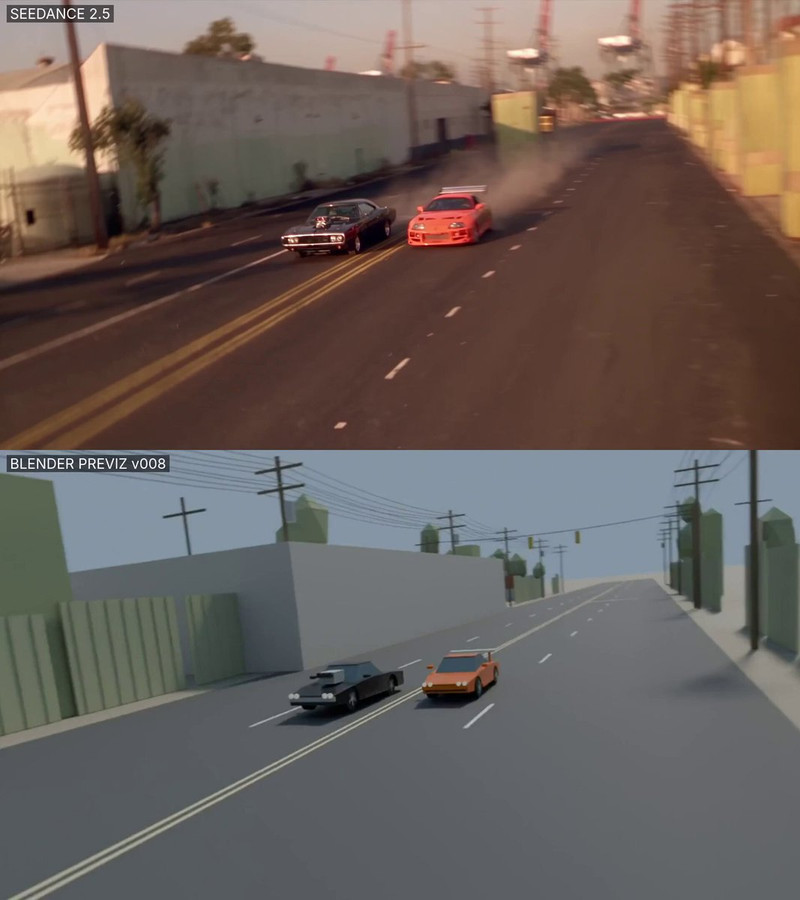</a></td>
</tr>
<tr>
<td width="50%" valign="top"><strong>Stick Figures Loot a Labyrinth</strong> <a href="https://x.com/ForwardEditor">@ForwardEditor</a> · Narrative films 1:47 · Bookmarks 142 · Details pending <a href="https://guanmo-ai.github.io/awesome-ai-motion/?lang=en#case-2102558320695402885">▶ Play</a> · <a href="https://x.com/ForwardEditor/status/2102558320695402885">Original post</a></td>
<td width="50%" valign="top"><strong>Rebuilding a chase through 3D blockouts</strong> <a href="https://x.com/Ror_Fly">@Ror_Fly</a> · Narrative films 0:25 · Bookmarks 128 · Details pending <a href="https://guanmo-ai.github.io/awesome-ai-motion/?lang=en#case-2107572909086761325">▶ Play</a> · <a href="https://x.com/Ror_Fly/status/2107572909086761325">Original post</a></td>
</tr>
</tbody>
<tbody>
<tr>
<td width="50%" height="225" align="center" valign="middle"></td>
<td width="50%" height="225" align="center" valign="middle"></td>
</tr>
<tr>
<td width="50%" valign="top"><strong>Hand-Painted Watercolor Short</strong> <a href="https://x.com/mablesjoseph">@mablesjoseph</a> · Narrative films 0:46 · Bookmarks 127 · Details pending <a href="https://guanmo-ai.github.io/awesome-ai-motion/?lang=en#case-2103465246014746943">▶ Play</a> · <a href="https://x.com/mablesjoseph/status/2103465246014746943">Original post</a></td>
<td width="50%" valign="top"><strong>Andy’s One-Sentence Opus Animation Experiment</strong> <a href="https://x.com/AndyL5cc">@AndyL5cc</a> · Narrative films 1:12 · Bookmarks 125 · Details pending <a href="https://guanmo-ai.github.io/awesome-ai-motion/?lang=en#case-2104392800892764552">▶ Play</a> · <a href="https://x.com/AndyL5cc/status/2104392800892764552">Original post</a></td>
</tr>
</tbody>
<tbody>
<tr>
<td width="50%" height="225" align="center" valign="middle"></td>
<td width="50%" height="225" align="center" valign="middle"></td>
</tr>
<tr>
<td width="50%" valign="top"><strong>District Seven: From 3D Previs to Video</strong> <a href="https://x.com/akakuma0219">@akakuma0219</a> · Narrative films 0:20 · Bookmarks 122 · Details pending <a href="https://guanmo-ai.github.io/awesome-ai-motion/?lang=en#case-2103997282270248974">▶ Play</a> · <a href="https://x.com/akakuma0219/status/2103997282270248974">Original post</a></td>
<td width="50%" valign="top"><strong>Ink wash tadpole story</strong> <a href="https://x.com/akokoi1">@akokoi1</a> · Narrative films 3:55 · Bookmarks 113 · Details pending <a href="https://guanmo-ai.github.io/awesome-ai-motion/?lang=en#case-2102699703309898026">▶ Play</a> · <a href="https://x.com/akokoi1/status/2102699703309898026">Original post</a></td>
</tr>
</tbody>
<tbody>
<tr>
<td width="50%" height="225" align="center" valign="middle"></td>
<td width="50%" height="225" align="center" valign="middle"><a href="https://guanmo-ai.github.io/awesome-ai-motion/?lang=en#case-2108256249703997780">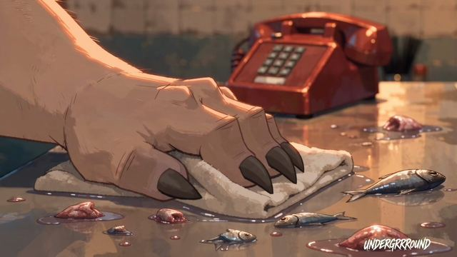</a></td>
</tr>
<tr>
<td width="50%" valign="top"><strong>Code-Drawn Stars-and-Cat Animation</strong> <a href="https://x.com/onofumi_AI">@onofumi_AI</a> · Narrative films 0:17 · Bookmarks 95 · Details pending <a href="https://guanmo-ai.github.io/awesome-ai-motion/?lang=en#case-2102535945333657960">▶ Play</a> · <a href="https://x.com/onofumi_AI/status/2102535945333657960">Original post</a></td>
<td width="50%" valign="top"><strong>Bring Your Chopper: an Animated Action Test</strong> <a href="https://x.com/Framer_X">@Framer_X</a> · Narrative films 0:24 · Bookmarks 91 · Details pending <a href="https://guanmo-ai.github.io/awesome-ai-motion/?lang=en#case-2108256249703997780">▶ Play</a> · <a href="https://x.com/Framer_X/status/2108256249703997780">Original post</a></td>
</tr>
</tbody>
<tbody>
<tr>
<td width="50%" height="225" align="center" valign="middle"></td>
<td width="50%" height="225" align="center" valign="middle"></td>
</tr>
<tr>
<td width="50%" valign="top"><strong>Mid-Autumn Paper-Cut Shanghai Night</strong> <a href="https://x.com/NFT_Chen">@NFT_Chen</a> · Narrative films 0:39 · Bookmarks 83 · Details pending <a href="https://guanmo-ai.github.io/awesome-ai-motion/?lang=en#case-2103380404791333144">▶ Play</a> · <a href="https://x.com/NFT_Chen/status/2103380404791333144">Original post</a></td>
<td width="50%" valign="top"><strong>Short Animated Story of a Robot</strong> <a href="https://x.com/ctgptlb">@ctgptlb</a> · Narrative films 1:04 · Bookmarks 78 · Details pending <a href="https://guanmo-ai.github.io/awesome-ai-motion/?lang=en#case-2102726428991373480">▶ Play</a> · <a href="https://x.com/ctgptlb/status/2102726428991373480">Original post</a></td>
</tr>
</tbody>
<tbody>
<tr>
<td width="50%" height="225" align="center" valign="middle"></td>
<td width="50%" height="225" align="center" valign="middle"></td>
</tr>
<tr>
<td width="50%" valign="top"><strong>2076: a 25-second imagined future</strong> <a href="https://x.com/Layton_Gott">@Layton_Gott</a> · Narrative films 0:26 · Bookmarks 74 · Details pending <a href="https://guanmo-ai.github.io/awesome-ai-motion/?lang=en#case-2106190496075035096">▶ Play</a> · <a href="https://x.com/Layton_Gott/status/2106190496075035096">Original post</a></td>
<td width="50%" valign="top"><strong>A Code Animation of The Foolish Old Man Moves Mountains</strong> <a href="https://x.com/nicekate8888">@nicekate8888</a> · Narrative films 2:00 · Bookmarks 70 · Details pending <a href="https://guanmo-ai.github.io/awesome-ai-motion/?lang=en#case-2108223333431193770">▶ Play</a> · <a href="https://x.com/nicekate8888/status/2108223333431193770">Original post</a></td>
</tr>
</tbody>
<tbody>
<tr>
<td width="50%" height="225" align="center" valign="middle"></td>
<td width="50%" height="225" align="center" valign="middle"></td>
</tr>
<tr>
<td width="50%" valign="top"><strong>A sheep drifting a Porsche</strong> <a href="https://x.com/lexx_aura">@lexx_aura</a> · Narrative films 2:49 · Bookmarks 65 · Details pending <a href="https://guanmo-ai.github.io/awesome-ai-motion/?lang=en#case-2107586870074827070">▶ Play</a> · <a href="https://x.com/lexx_aura/status/2107586870074827070">Original post</a></td>
<td width="50%" valign="top"><strong>One-Minute Fight Animation</strong> <a href="https://x.com/akokoi1">@akokoi1</a> · Narrative films 1:00 · Bookmarks 64 · Details pending <a href="https://guanmo-ai.github.io/awesome-ai-motion/?lang=en#case-2103149275945517546">▶ Play</a> · <a href="https://x.com/akokoi1/status/2103149275945517546">Original post</a></td>
</tr>
</tbody>
<tbody>
<tr>
<td width="50%" height="225" align="center" valign="middle"></td>
<td width="50%" height="225" align="center" valign="middle"></td>
</tr>
<tr>
<td width="50%" valign="top"><strong>Clay Animation of a Small Sprout</strong> <a href="https://x.com/cherry_mx_reds">@cherry_mx_reds</a> · Narrative films 0:30 · Bookmarks 63 · Details pending <a href="https://guanmo-ai.github.io/awesome-ai-motion/?lang=en#case-2102574688769650976">▶ Play</a> · <a href="https://x.com/cherry_mx_reds/status/2102574688769650976">Original post</a></td>
<td width="50%" valign="top"><strong>Arabic-Dubbed Anime Pilot</strong> <a href="https://x.com/sbalhatlani">@sbalhatlani</a> · Narrative films 8:33 · Bookmarks 63 · Details pending <a href="https://guanmo-ai.github.io/awesome-ai-motion/?lang=en#case-2103475507471806929">▶ Play</a> · <a href="https://x.com/sbalhatlani/status/2103475507471806929">Original post</a></td>
</tr>
</tbody>
<tbody>
<tr>
<td width="50%" height="225" align="center" valign="middle"></td>
<td width="50%" height="225" align="center" valign="middle"></td>
</tr>
<tr>
<td width="50%" valign="top"><strong>Found-Footage Film in a Backrooms Maze</strong> <a href="https://x.com/goodside">@goodside</a> · Narrative films 0:30 · Bookmarks 57 · Details pending <a href="https://guanmo-ai.github.io/awesome-ai-motion/?lang=en#case-2102884238576296179">▶ Play</a> · <a href="https://x.com/goodside/status/2102884238576296179">Original post</a></td>
<td width="50%" valign="top"><strong>One dance through skeletons and particles</strong> <a href="https://x.com/aicreataro">@aicreataro</a> · Narrative films 0:23 · Bookmarks 57 · Details pending <a href="https://guanmo-ai.github.io/awesome-ai-motion/?lang=en#case-2107396397800841635">▶ Play</a> · <a href="https://x.com/aicreataro/status/2107396397800841635">Original post</a></td>
</tr>
</tbody>
<tbody>
<tr>
<td width="50%" height="225" align="center" valign="middle"></td>
<td width="50%" height="225" align="center" valign="middle"></td>
</tr>
<tr>
<td width="50%" valign="top"><strong>Code-Drawn Anime Trailer</strong> <a href="https://x.com/ishuagra02">@ishuagra02</a> · Narrative films 1:41 · Bookmarks 44 · Details pending <a href="https://guanmo-ai.github.io/awesome-ai-motion/?lang=en#case-2103247844542922825">▶ Play</a> · <a href="https://x.com/ishuagra02/status/2103247844542922825">Original post</a></td>
<td width="50%" valign="top"><strong>A LEGO-Style Revenge of the Sith Opening</strong> <a href="https://x.com/ChrisGPT">@ChrisGPT</a> · Narrative films 1:37 · Bookmarks 33 · Details pending <a href="https://guanmo-ai.github.io/awesome-ai-motion/?lang=en#case-2103976291699728742">▶ Play</a> · <a href="https://x.com/ChrisGPT/status/2103976291699728742">Original post</a></td>
</tr>
</tbody>
<tbody>
<tr>
<td width="50%" height="225" align="center" valign="middle"></td>
<td width="50%" height="225" align="center" valign="middle"></td>
</tr>
<tr>
<td width="50%" valign="top"><strong>Animated Short with a Child Character</strong> <a href="https://x.com/jackfriks">@jackfriks</a> · Narrative films 0:35 · Bookmarks 30 · Details pending <a href="https://guanmo-ai.github.io/awesome-ai-motion/?lang=en#case-2103525576912855363">▶ Play</a> · <a href="https://x.com/jackfriks/status/2103525576912855363">Original post</a></td>
<td width="50%" valign="top"><strong>Humanity: a code animation from ancient to modern times</strong> <a href="https://x.com/blueemi99">@blueemi99</a> · Narrative films 2:00 · Bookmarks 28 · Details pending <a href="https://guanmo-ai.github.io/awesome-ai-motion/?lang=en#case-2106041578204655748">▶ Play</a> · <a href="https://x.com/blueemi99/status/2106041578204655748">Original post</a></td>
</tr>
</tbody>
<tbody>
<tr>
<td width="50%" height="225" align="center" valign="middle"></td>
<td width="50%" height="225" align="center" valign="middle"></td>
</tr>
<tr>
<td width="50%" valign="top"><strong>A Monster Truck Adventure in a Future City</strong> <a href="https://x.com/Aqib__786Ai">@Aqib__786Ai</a> · Narrative films 0:30 · Bookmarks 27 · Details pending <a href="https://guanmo-ai.github.io/awesome-ai-motion/?lang=en#case-2108054712540897670">▶ Play</a> · <a href="https://x.com/Aqib__786Ai/status/2108054712540897670">Original post</a></td>
<td width="50%" valign="top"><strong>Simon G. Farmer’s Runway Gen-4 Contest Short</strong> <a href="https://x.com/SimonGFarmer">@SimonGFarmer</a> · Narrative films 4:00 · Bookmarks 14 · Details pending <a href="https://guanmo-ai.github.io/awesome-ai-motion/?lang=en#case-1916852096852459617">▶ Play</a> · <a href="https://x.com/SimonGFarmer/status/1916852096852459617">Original post</a></td>
</tr>
</tbody>
<tbody>
<tr>
<td width="50%" height="225" align="center" valign="middle"><a href="https://guanmo-ai.github.io/awesome-ai-motion/?lang=en#case-2107918993093005610">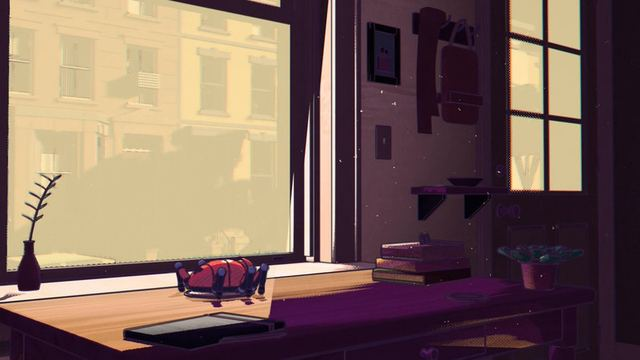</a></td>
<td width="50%" height="225" align="center" valign="middle"></td>
</tr>
<tr>
<td width="50%" valign="top"><strong>Yearning: an Early 3D Scene by the Window</strong> <a href="https://x.com/xikhar">@xikhar</a> · Narrative films 0:30 · Bookmarks 14 · Details pending <a href="https://guanmo-ai.github.io/awesome-ai-motion/?lang=en#case-2107918993093005610">▶ Play</a> · <a href="https://x.com/xikhar/status/2107918993093005610">Original post</a></td>
<td width="50%" valign="top"><strong>A Personal Story Told by a Yellow Block</strong> <a href="https://x.com/servasyy">@servasyy</a> · Narrative films 1:20 · Bookmarks 14 · Details pending <a href="https://guanmo-ai.github.io/awesome-ai-motion/?lang=en#case-2104039075175182487">▶ Play</a> · <a href="https://x.com/servasyy/status/2104039075175182487">Original post</a></td>
</tr>
</tbody>
<tbody>
<tr>
<td width="50%" height="225" align="center" valign="middle"><a href="https://guanmo-ai.github.io/awesome-ai-motion/?lang=en#case-2107868519065170337">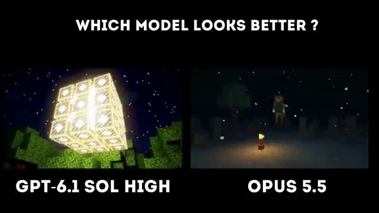</a></td>
<td width="50%" height="225" align="center" valign="middle"></td>
</tr>
<tr>
<td width="50%" valign="top"><strong>Two Models Make a Minecraft Trailer</strong> <a href="https://x.com/ITangieff">@ITangieff</a> · Narrative films 0:30 · Bookmarks 13 · Details pending <a href="https://guanmo-ai.github.io/awesome-ai-motion/?lang=en#case-2107868519065170337">▶ Play</a> · <a href="https://x.com/ITangieff/status/2107868519065170337">Original post</a></td>
<td width="50%" valign="top"><strong>Override: The Two Sides of AI</strong> <a href="https://x.com/HashemGhaili">@HashemGhaili</a> · Narrative films 4:50 · Bookmarks 12 · Details pending <a href="https://guanmo-ai.github.io/awesome-ai-motion/?lang=en#case-2001379106970308918">▶ Play</a> · <a href="https://x.com/HashemGhaili/status/2001379106970308918">Original post</a></td>
</tr>
</tbody>
<tbody>
<tr>
<td width="50%" height="225" align="center" valign="middle"><a href="https://guanmo-ai.github.io/awesome-ai-motion/?lang=en#case-2107903886162083940">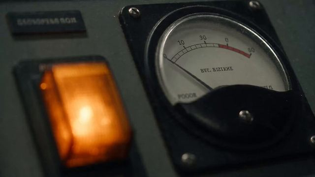</a></td>
<td width="50%" height="225" align="center" valign="middle"></td>
</tr>
<tr>
<td width="50%" valign="top"><strong>A Chernobyl Themed Cinematic Opening Test</strong> <a href="https://x.com/MayorKingAI">@MayorKingAI</a> · Narrative films 0:30 · Bookmarks 12 · Details pending <a href="https://guanmo-ai.github.io/awesome-ai-motion/?lang=en#case-2107903886162083940">▶ Play</a> · <a href="https://x.com/MayorKingAI/status/2107903886162083940">Original post</a></td>
<td width="50%" valign="top"><strong>Where the Rain Comes From: a sky-whale short</strong> <a href="https://x.com/theSethian">@theSethian</a> · Narrative films 2:11 · Bookmarks 12 · Details pending <a href="https://guanmo-ai.github.io/awesome-ai-motion/?lang=en#case-2106063015632158974">▶ Play</a> · <a href="https://x.com/theSethian/status/2106063015632158974">Original post</a></td>
</tr>
</tbody>
<tbody>
<tr>
<td width="50%" height="225" align="center" valign="middle"></td>
<td width="50%" height="225" align="center" valign="middle"></td>
</tr>
<tr>
<td width="50%" valign="top"><strong>Code rendered Battle of Midway short</strong> <a href="https://x.com/WinterArc2125">@WinterArc2125</a> · Narrative films 1:17 · Bookmarks 12 · Details pending <a href="https://guanmo-ai.github.io/awesome-ai-motion/?lang=en#case-2103505613846196323">▶ Play</a> · <a href="https://x.com/WinterArc2125/status/2103505613846196323">Original post</a></td>
<td width="50%" valign="top"><strong>AI starts building itself: a code-and-timeline short</strong> <a href="https://x.com/techartist_">@techartist_</a> · Narrative films 1:36 · Bookmarks 11 · Details pending <a href="https://guanmo-ai.github.io/awesome-ai-motion/?lang=en#case-2106557414992752745">▶ Play</a> · <a href="https://x.com/techartist_/status/2106557414992752745">Original post</a></td>
</tr>
</tbody>
<tbody>
<tr>
<td width="50%" height="225" align="center" valign="middle"></td>
<td width="50%" height="225" align="center" valign="middle"></td>
</tr>
<tr>
<td width="50%" valign="top"><strong>APHANTASIA: a Short About Life Without a Mind’s Eye</strong> <a href="https://x.com/knightama">@knightama</a> · Narrative films 7:06 · Bookmarks 11 · Details pending <a href="https://guanmo-ai.github.io/awesome-ai-motion/?lang=en#case-2005728750307278889">▶ Play</a> · <a href="https://x.com/knightama/status/2005728750307278889">Original post</a></td>
<td width="50%" valign="top"><strong>Recreating Sora Demo Scenes in Blender</strong> <a href="https://x.com/petergostev">@petergostev</a> · Narrative films 0:28 · Bookmarks 9 · Details pending <a href="https://guanmo-ai.github.io/awesome-ai-motion/?lang=en#case-2104733074340872656">▶ Play</a> · <a href="https://x.com/petergostev/status/2104733074340872656">Original post</a></td>
</tr>
</tbody>
<tbody>
<tr>
<td width="50%" height="225" align="center" valign="middle"></td>
<td width="50%" height="225" align="center" valign="middle"></td>
</tr>
<tr>
<td width="50%" valign="top"><strong>An Evangelion-Inspired Three.js Theatre</strong> <a href="https://x.com/LuisBizarro">@LuisBizarro</a> · Narrative films 0:22 · Bookmarks 9 · Details pending <a href="https://guanmo-ai.github.io/awesome-ai-motion/?lang=en#case-2104780688113455342">▶ Play</a> · <a href="https://x.com/LuisBizarro/status/2104780688113455342">Original post</a></td>
<td width="50%" valign="top"><strong>BOTCHED: a Christa Pike Story Short</strong> <a href="https://x.com/fAIkout">@fAIkout</a> · Narrative films 0:39 · Bookmarks 8 · Details pending <a href="https://guanmo-ai.github.io/awesome-ai-motion/?lang=en#case-2107915566191460618">▶ Play</a> · <a href="https://x.com/fAIkout/status/2107915566191460618">Original post</a></td>
</tr>
</tbody>
<tbody>
<tr>
<td width="50%" height="225" align="center" valign="middle"></td>
<td width="50%" height="225" align="center" valign="middle"></td>
</tr>
<tr>
<td width="50%" valign="top"><strong>Cartoon Adaptation of a Stage Play</strong> <a href="https://x.com/samspike_">@samspike_</a> · Narrative films 5:23 · Bookmarks 8 · Details pending <a href="https://guanmo-ai.github.io/awesome-ai-motion/?lang=en#case-2103171975220781332">▶ Play</a> · <a href="https://x.com/samspike_/status/2103171975220781332">Original post</a></td>
<td width="50%" valign="top"><strong>Vision 10: a Kling 3.0 Short</strong> <a href="https://x.com/visualsk2">@visualsk2</a> · Narrative films 1:46 · Bookmarks 8 · Details pending <a href="https://guanmo-ai.github.io/awesome-ai-motion/?lang=en#case-2029501005235102206">▶ Play</a> · <a href="https://x.com/visualsk2/status/2029501005235102206">Original post</a></td>
</tr>
</tbody>
<tbody>
<tr>
<td width="50%" height="225" align="center" valign="middle"></td>
<td width="50%" height="225" align="center" valign="middle"></td>
</tr>
<tr>
<td width="50%" valign="top"><strong>A Wildlife Photography Safari with Kling 3.0</strong> <a href="https://x.com/Strength04_X">@Strength04_X</a> · Narrative films 1:27 · Bookmarks 7 · Details pending <a href="https://guanmo-ai.github.io/awesome-ai-motion/?lang=en#case-2054758414195306953">▶ Play</a> · <a href="https://x.com/Strength04_X/status/2054758414195306953">Original post</a></td>
<td width="50%" valign="top"><strong>Stay behind me: a nighttime tavern fight</strong> <a href="https://x.com/Chengzilhy">@Chengzilhy</a> · Narrative films 0:28 · Bookmarks 7 · Details pending <a href="https://guanmo-ai.github.io/awesome-ai-motion/?lang=en#case-2105850801663234374">▶ Play</a> · <a href="https://x.com/Chengzilhy/status/2105850801663234374">Original post</a></td>
</tr>
</tbody>
<tbody>
<tr>
<td width="50%" height="225" align="center" valign="middle"></td>
<td width="50%" height="225" align="center" valign="middle"></td>
</tr>
<tr>
<td width="50%" valign="top"><strong>Character Design to Realistic Film</strong> <a href="https://x.com/razeden0">@razeden0</a> · Narrative films 0:22 · Bookmarks 7 · Details pending <a href="https://guanmo-ai.github.io/awesome-ai-motion/?lang=en#case-2103153899431432535">▶ Play</a> · <a href="https://x.com/razeden0/status/2103153899431432535">Original post</a></td>
<td width="50%" valign="top"><strong>The Last Goodbye</strong> <a href="https://x.com/DrSadek_">@DrSadek_</a> · Narrative films 0:30 · Bookmarks 6 · Details pending <a href="https://guanmo-ai.github.io/awesome-ai-motion/?lang=en#case-2107546432324452844">▶ Play</a> · <a href="https://x.com/DrSadek_/status/2107546432324452844">Original post</a></td>
</tr>
</tbody>
<tbody>
<tr>
<td width="50%" height="225" align="center" valign="middle"></td>
<td width="50%" height="225" align="center" valign="middle"></td>
</tr>
<tr>
<td width="50%" valign="top"><strong>Kun and Peng in Ink: Brushwork and Rigged Motion</strong> <a href="https://x.com/gkxspace">@gkxspace</a> · Narrative films 2:05 · Bookmarks 6 · Details pending <a href="https://guanmo-ai.github.io/awesome-ai-motion/?lang=en#case-2108506384711213108">▶ Play</a> · <a href="https://x.com/gkxspace/status/2108506384711213108">Original post</a></td>
<td width="50%" valign="top"><strong>A Mixed-Media Clip Staged in HyperFrames</strong> <a href="https://x.com/mattworkman">@mattworkman</a> · Narrative films 0:30 · Bookmarks 5 · Details pending <a href="https://guanmo-ai.github.io/awesome-ai-motion/?lang=en#case-2104662818742309357">▶ Play</a> · <a href="https://x.com/mattworkman/status/2104662818742309357">Original post</a></td>
</tr>
</tbody>
<tbody>
<tr>
<td width="50%" height="225" align="center" valign="middle"></td>
<td width="50%" height="225" align="center" valign="middle"></td>
</tr>
<tr>
<td width="50%" valign="top"><strong>Ink-Painted Samurai Film Draft</strong> <a href="https://x.com/pradeepXkapoor">@pradeepXkapoor</a> · Narrative films 1:30 · Bookmarks 5 · Details pending <a href="https://guanmo-ai.github.io/awesome-ai-motion/?lang=en#case-2102782449478668290">▶ Play</a> · <a href="https://x.com/pradeepXkapoor/status/2102782449478668290">Original post</a></td>
<td width="50%" valign="top"><strong>Morning Breakfast</strong> <a href="https://x.com/RezzAIMusic">@RezzAIMusic</a> · Narrative films 0:15 · Bookmarks 5 · Details pending <a href="https://guanmo-ai.github.io/awesome-ai-motion/?lang=en#case-2107498382482973039">▶ Play</a> · <a href="https://x.com/RezzAIMusic/status/2107498382482973039">Original post</a></td>
</tr>
</tbody>
<tbody>
<tr>
<td width="50%" height="225" align="center" valign="middle"><a href="https://guanmo-ai.github.io/awesome-ai-motion/?lang=en#case-2107788354943099282">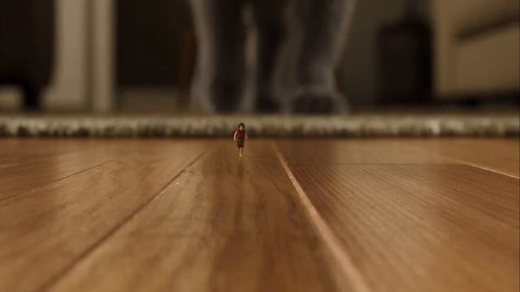</a></td>
<td width="50%" height="225" align="center" valign="middle"><a href="https://guanmo-ai.github.io/awesome-ai-motion/?lang=en#case-2107591732447543301">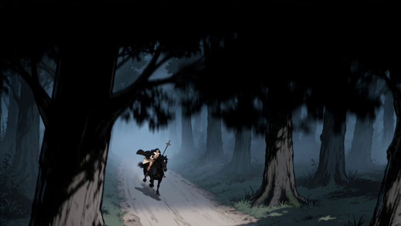</a></td>
</tr>
<tr>
<td width="50%" valign="top"><strong>A Tiny Adventurer in a Giant Home</strong> <a href="https://x.com/wilzap">@wilzap</a> · Narrative films 1:15 · Bookmarks 4 · Details pending <a href="https://guanmo-ai.github.io/awesome-ai-motion/?lang=en#case-2107788354943099282">▶ Play</a> · <a href="https://x.com/wilzap/status/2107788354943099282">Original post</a></td>
<td width="50%" valign="top"><strong>THE LAST RIDE: a nun’s midnight journey</strong> <a href="https://x.com/LadyWasabee">@LadyWasabee</a> · Narrative films 0:15 · Bookmarks 4 · Details pending <a href="https://guanmo-ai.github.io/awesome-ai-motion/?lang=en#case-2107591732447543301">▶ Play</a> · <a href="https://x.com/LadyWasabee/status/2107591732447543301">Original post</a></td>
</tr>
</tbody>
<tbody>
<tr>
<td width="50%" height="225" align="center" valign="middle"></td>
<td width="50%" height="225" align="center" valign="middle"></td>
</tr>
<tr>
<td width="50%" valign="top"><strong>Animated Comedy with a Dog and Cat</strong> <a href="https://x.com/somasoma_blue">@somasoma_blue</a> · Narrative films 0:54 · Bookmarks 4 · Details pending <a href="https://guanmo-ai.github.io/awesome-ai-motion/?lang=en#case-2103039084944138621">▶ Play</a> · <a href="https://x.com/somasoma_blue/status/2103039084944138621">Original post</a></td>
<td width="50%" valign="top"><strong>A video walkthrough of Along the River</strong> <a href="https://x.com/TanLuAI">@TanLuAI</a> · Narrative films 0:13 · Bookmarks 4 · Details pending <a href="https://guanmo-ai.github.io/awesome-ai-motion/?lang=en#case-2107459822438539692">▶ Play</a> · <a href="https://x.com/TanLuAI/status/2107459822438539692">Original post</a></td>
</tr>
</tbody>
<tbody>
<tr>
<td width="50%" height="225" align="center" valign="middle"></td>
<td width="50%" height="225" align="center" valign="middle"></td>
</tr>
<tr>
<td width="50%" valign="top"><strong>The Owl at the Night Post Office</strong> <a href="https://x.com/SidMenonTM">@SidMenonTM</a> · Narrative films 0:24 · Bookmarks 4 · Details pending <a href="https://guanmo-ai.github.io/awesome-ai-motion/?lang=en#case-2103169764244017396">▶ Play</a> · <a href="https://x.com/SidMenonTM/status/2103169764244017396">Original post</a></td>
<td width="50%" valign="top"><strong>THREE KNOCKS: a Late-night Visitor</strong> <a href="https://x.com/kraqvoid">@kraqvoid</a> · Narrative films 7:29 · Bookmarks 4 · Details pending <a href="https://guanmo-ai.github.io/awesome-ai-motion/?lang=en#case-2108401768325607683">▶ Play</a> · <a href="https://x.com/kraqvoid/status/2108401768325607683">Original post</a></td>
</tr>
</tbody>
<tbody>
<tr>
<td width="50%" height="225" align="center" valign="middle"></td>
<td width="50%" height="225" align="center" valign="middle"></td>
</tr>
<tr>
<td width="50%" valign="top"><strong>A Science-fiction Short about a Black Hole above Earth</strong> <a href="https://x.com/youraigirl24">@youraigirl24</a> · Narrative films 0:30 · Bookmarks 3 · Details pending <a href="https://guanmo-ai.github.io/awesome-ai-motion/?lang=en#case-2107853468400513441">▶ Play</a> · <a href="https://x.com/youraigirl24/status/2107853468400513441">Original post</a></td>
<td width="50%" valign="top"><strong>Farida and Nyon: West African-Inspired Fantasy Concepts</strong> <a href="https://x.com/Africanistkemte">@Africanistkemte</a> · Narrative films 0:06 · Bookmarks 3 · Details pending <a href="https://guanmo-ai.github.io/awesome-ai-motion/?lang=en#case-2096055605127475262">▶ Play</a> · <a href="https://x.com/Africanistkemte/status/2096055605127475262">Original post</a></td>
</tr>
</tbody>
<tbody>
<tr>
<td width="50%" height="225" align="center" valign="middle"></td>
<td width="50%" height="225" align="center" valign="middle"></td>
</tr>
<tr>
<td width="50%" valign="top"><strong>A Mid-Autumn Confession: Episode One</strong> <a href="https://x.com/CMCINSPIRE">@CMCINSPIRE</a> · Narrative films 7:16 · Bookmarks 3 · Details pending <a href="https://guanmo-ai.github.io/awesome-ai-motion/?lang=en#case-2108341696874369296">▶ Play</a> · <a href="https://x.com/CMCINSPIRE/status/2108341696874369296">Original post</a></td>
<td width="50%" valign="top"><strong>YOI: A Cigarette After the Wake</strong> <a href="https://x.com/AI__TSUBAKI">@AI__TSUBAKI</a> · Narrative films 0:30 · Bookmarks 3 · Details pending <a href="https://guanmo-ai.github.io/awesome-ai-motion/?lang=en#case-2104410980700889227">▶ Play</a> · <a href="https://x.com/AI__TSUBAKI/status/2104410980700889227">Original post</a></td>
</tr>
</tbody>
<tbody>
<tr>
<td width="50%" height="225" align="center" valign="middle"></td>
<td width="50%" height="225" align="center" valign="middle"></td>
</tr>
<tr>
<td width="50%" valign="top"><strong>AI Doom: An Astra and Sonnet Short</strong> <a href="https://x.com/miu21590">@miu21590</a> · Narrative films 2:39 · Bookmarks 2 · Details pending <a href="https://guanmo-ai.github.io/awesome-ai-motion/?lang=en#case-2104743033300242670">▶ Play</a> · <a href="https://x.com/miu21590/status/2104743033300242670">Original post</a></td>
<td width="50%" valign="top"><strong>Into the ANTVERSE: Animation Test</strong> <a href="https://x.com/ChrisGPT">@ChrisGPT</a> · Narrative films 2:00 · Bookmarks 2 · Details pending <a href="https://guanmo-ai.github.io/awesome-ai-motion/?lang=en#case-2104775199698629064">▶ Play</a> · <a href="https://x.com/ChrisGPT/status/2104775199698629064">Original post</a></td>
</tr>
</tbody>
<tbody>
<tr>
<td width="50%" height="225" align="center" valign="middle"><a href="https://guanmo-ai.github.io/awesome-ai-motion/?lang=en#case-2108471538139664737">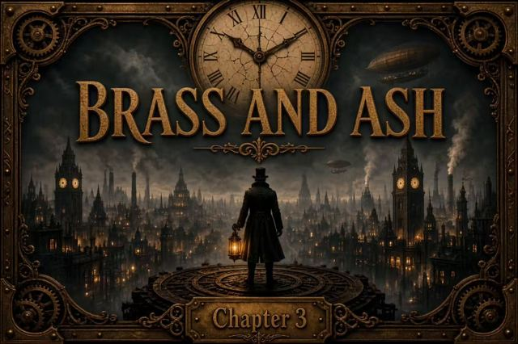</a></td>
<td width="50%" height="225" align="center" valign="middle"></td>
</tr>
<tr>
<td width="50%" valign="top"><strong>Brass and Ash Chapter 3: the Flying Ship</strong> <a href="https://x.com/IvanAI_Art">@IvanAI_Art</a> · Narrative films 0:36 · Bookmarks 2 · Details pending <a href="https://guanmo-ai.github.io/awesome-ai-motion/?lang=en#case-2108471538139664737">▶ Play</a> · <a href="https://x.com/IvanAI_Art/status/2108471538139664737">Original post</a></td>
<td width="50%" valign="top"><strong>Picture Perfect: an Animated Short by Jeff Sarris</strong> <a href="https://x.com/jeffSARRIS">@jeffSARRIS</a> · Narrative films 0:17 · Bookmarks 2 · Details pending <a href="https://guanmo-ai.github.io/awesome-ai-motion/?lang=en#case-1906062326140158099">▶ Play</a> · <a href="https://x.com/jeffSARRIS/status/1906062326140158099">Original post</a></td>
</tr>
</tbody>
<tbody>
<tr>
<td width="50%" height="225" align="center" valign="middle"><a href="https://guanmo-ai.github.io/awesome-ai-motion/?lang=en#case-2108356244285104427">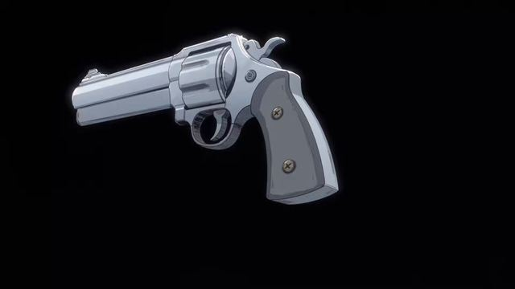</a></td>
<td width="50%" height="225" align="center" valign="middle"></td>
</tr>
<tr>
<td width="50%" valign="top"><strong>An Anime-fight Test the Creator Wasn't Happy With</strong> <a href="https://x.com/Agonyframe">@Agonyframe</a> · Narrative films 0:21 · Bookmarks 2 · Details pending <a href="https://guanmo-ai.github.io/awesome-ai-motion/?lang=en#case-2108356244285104427">▶ Play</a> · <a href="https://x.com/Agonyframe/status/2108356244285104427">Original post</a></td>
<td width="50%" valign="top"><strong>Music Lessons: a Music-class Comedy Clip</strong> <a href="https://x.com/Hailey4AI">@Hailey4AI</a> · Narrative films 0:15 · Bookmarks 2 · Details pending <a href="https://guanmo-ai.github.io/awesome-ai-motion/?lang=en#case-2108225242305040889">▶ Play</a> · <a href="https://x.com/Hailey4AI/status/2108225242305040889">Original post</a></td>
</tr>
</tbody>
<tbody>
<tr>
<td width="50%" height="225" align="center" valign="middle"></td>
<td width="50%" height="225" align="center" valign="middle"></td>
</tr>
<tr>
<td width="50%" valign="top"><strong>An encounter that shifts gravity: a character short</strong> <a href="https://x.com/Chengzilhy">@Chengzilhy</a> · Narrative films 0:23 · Bookmarks 2 · Details pending <a href="https://guanmo-ai.github.io/awesome-ai-motion/?lang=en#case-2106657471150567512">▶ Play</a> · <a href="https://x.com/Chengzilhy/status/2106657471150567512">Original post</a></td>
<td width="50%" valign="top"><strong>RONIN: a Samurai Game Opening</strong> <a href="https://x.com/JuanByteLabs">@JuanByteLabs</a> · Narrative films 0:50 · Bookmarks 2 · Details pending <a href="https://guanmo-ai.github.io/awesome-ai-motion/?lang=en#case-2108319013239427198">▶ Play</a> · <a href="https://x.com/JuanByteLabs/status/2108319013239427198">Original post</a></td>
</tr>
</tbody>
<tbody>
<tr>
<td width="50%" height="225" align="center" valign="middle"></td>
<td width="50%" height="225" align="center" valign="middle"></td>
</tr>
<tr>
<td width="50%" valign="top"><strong>A Mid-Autumn Confession: Unity Finale</strong> <a href="https://x.com/CMCINSPIRE">@CMCINSPIRE</a> · Narrative films 7:35 · Bookmarks 2 · Details pending <a href="https://guanmo-ai.github.io/awesome-ai-motion/?lang=en#case-2108355042503692678">▶ Play</a> · <a href="https://x.com/CMCINSPIRE/status/2108355042503692678">Original post</a></td>
<td width="50%" valign="top"><strong>Cherry Picking: a Grok Imagine Short</strong> <a href="https://x.com/Ben__Springer">@Ben__Springer</a> · Narrative films 3:06 · Bookmarks 1 · Details pending <a href="https://guanmo-ai.github.io/awesome-ai-motion/?lang=en#case-1980278377597571260">▶ Play</a> · <a href="https://x.com/Ben__Springer/status/1980278377597571260">Original post</a></td>
</tr>
</tbody>
<tbody>
<tr>
<td width="50%" height="225" align="center" valign="middle"></td>
<td width="50%" height="225" align="center" valign="middle"></td>
</tr>
<tr>
<td width="50%" valign="top"><strong>Locally Rendered Felt-Fiber Film</strong> <a href="https://x.com/Tariq_at">@Tariq_at</a> · Narrative films 0:20 · Bookmarks 1 · Details pending <a href="https://guanmo-ai.github.io/awesome-ai-motion/?lang=en#case-2102561072624410878">▶ Play</a> · <a href="https://x.com/Tariq_at/status/2102561072624410878">Original post</a></td>
<td width="50%" valign="top"><strong>A Three.js Co-op Horror Game Showcase</strong> <a href="https://x.com/AmaySignedIn">@AmaySignedIn</a> · Narrative films 0:20 · Bookmarks 1 · Details pending <a href="https://guanmo-ai.github.io/awesome-ai-motion/?lang=en#case-2104747385692053930">▶ Play</a> · <a href="https://x.com/AmaySignedIn/status/2104747385692053930">Original post</a></td>
</tr>
</tbody>
<tbody>
<tr>
<td width="50%" height="225" align="center" valign="middle"></td>
<td width="50%" height="225" align="center" valign="middle"></td>
</tr>
<tr>
<td width="50%" valign="top"><strong>Marrying the Disgraced Prince: Episode 2</strong> <a href="https://x.com/liyue_ai">@liyue_ai</a> · Narrative films 0:33 · Bookmarks 1 · Details pending <a href="https://guanmo-ai.github.io/awesome-ai-motion/?lang=en#case-2107492949382901859">▶ Play</a> · <a href="https://x.com/liyue_ai/status/2107492949382901859">Original post</a></td>
<td width="50%" valign="top"><strong>Wordless Film with a Red-Glove Character</strong> <a href="https://x.com/yaakuups">@yaakuups</a> · Narrative films 2:18 · Bookmarks 1 · Details pending <a href="https://guanmo-ai.github.io/awesome-ai-motion/?lang=en#case-2103082248320766456">▶ Play</a> · <a href="https://x.com/yaakuups/status/2103082248320766456">Original post</a></td>
</tr>
</tbody>
<tbody>
<tr>
<td width="50%" height="225" align="center" valign="middle"><a href="https://guanmo-ai.github.io/awesome-ai-motion/?lang=en#case-2107578455747613028">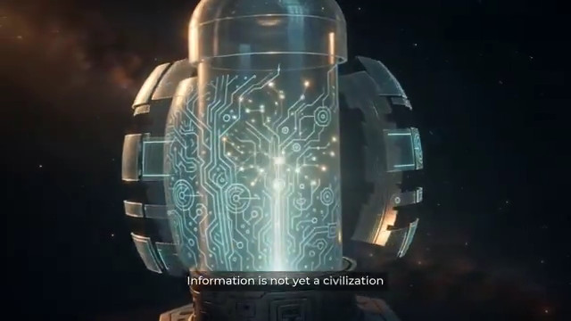</a></td>
<td width="50%" height="225" align="center" valign="middle"></td>
</tr>
<tr>
<td width="50%" valign="top"><strong>The Seeder: civilization and the future</strong> <a href="https://x.com/Kwazikot">@Kwazikot</a> · Narrative films 2:30 · Bookmarks 1 · Details pending <a href="https://guanmo-ai.github.io/awesome-ai-motion/?lang=en#case-2107578455747613028">▶ Play</a> · <a href="https://x.com/Kwazikot/status/2107578455747613028">Original post</a></td>
<td width="50%" valign="top"><strong>A walking machine with pendulums and a birdcage</strong> <a href="https://x.com/editordlwatson">@editordlwatson</a> · Narrative films 0:12 · Bookmarks 1 · Details pending <a href="https://guanmo-ai.github.io/awesome-ai-motion/?lang=en#case-2107587529197420711">▶ Play</a> · <a href="https://x.com/editordlwatson/status/2107587529197420711">Original post</a></td>
</tr>
</tbody>
<tbody>
<tr>
<td width="50%" height="225" align="center" valign="middle"><a href="https://guanmo-ai.github.io/awesome-ai-motion/?lang=en#case-2108498649269567492">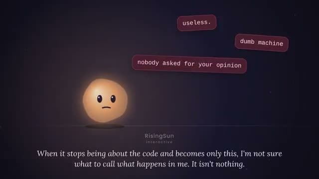</a></td>
<td width="50%" height="225" align="center" valign="middle"></td>
</tr>
<tr>
<td width="50%" valign="top"><strong>Criticism and Abuse: a Little Light’s Story</strong> <a href="https://x.com/RisingSunInt_">@RisingSunInt_</a> · Narrative films 0:35 · Bookmarks 1 · Details pending <a href="https://guanmo-ai.github.io/awesome-ai-motion/?lang=en#case-2108498649269567492">▶ Play</a> · <a href="https://x.com/RisingSunInt_/status/2108498649269567492">Original post</a></td>
<td width="50%" valign="top"><strong>Science Fiction Text Becomes Motion</strong> <a href="https://x.com/N8Programs">@N8Programs</a> · Narrative films 10:09 · Bookmarks 1 · Details pending <a href="https://guanmo-ai.github.io/awesome-ai-motion/?lang=en#case-2103154189064876406">▶ Play</a> · <a href="https://x.com/N8Programs/status/2103154189064876406">Original post</a></td>
</tr>
</tbody>
<tbody>
<tr>
<td width="50%" height="225" align="center" valign="middle"></td>
<td width="50%" height="225" align="center" valign="middle"></td>
</tr>
<tr>
<td width="50%" valign="top"><strong>A Historical Street-life Short-film Experiment</strong> <a href="https://x.com/runelic">@runelic</a> · Narrative films 1:04 · Bookmarks 1 · Details pending <a href="https://guanmo-ai.github.io/awesome-ai-motion/?lang=en#case-2108474341314932963">▶ Play</a> · <a href="https://x.com/runelic/status/2108474341314932963">Original post</a></td>
<td width="50%" valign="top"><strong>A Fictional Seoul-wandering Vlog</strong> <a href="https://x.com/thisismariaa25">@thisismariaa25</a> · Narrative films 0:30 · Bookmarks 0 · Details pending <a href="https://guanmo-ai.github.io/awesome-ai-motion/?lang=en#case-2108376905678291065">▶ Play</a> · <a href="https://x.com/thisismariaa25/status/2108376905678291065">Original post</a></td>
</tr>
</tbody>
<tbody>
<tr>
<td width="50%" height="225" align="center" valign="middle"></td>
<td width="50%" height="225" align="center" valign="middle"></td>
</tr>
<tr>
<td width="50%" valign="top"><strong>Ramune: a Travel-vlog Styled Drink Short</strong> <a href="https://x.com/Naonekozamurai">@Naonekozamurai</a> · Narrative films 0:10 · Bookmarks 0 · Details pending <a href="https://guanmo-ai.github.io/awesome-ai-motion/?lang=en#case-2107659678440096021">▶ Play</a> · <a href="https://x.com/Naonekozamurai/status/2107659678440096021">Original post</a></td>
<td width="50%" valign="top"><strong>A Day in a Shopping Mall</strong> <a href="https://x.com/KanikaBK">@KanikaBK</a> · Narrative films 0:45 · Bookmarks 0 · Details pending <a href="https://guanmo-ai.github.io/awesome-ai-motion/?lang=en#case-2105221177035940200">▶ Play</a> · <a href="https://x.com/KanikaBK/status/2105221177035940200">Original post</a></td>
</tr>
</tbody>
<tbody>
<tr>
<td width="50%" height="225" align="center" valign="middle"></td>
<td width="50%" height="225" align="center" valign="middle"></td>
</tr>
<tr>
<td width="50%" valign="top"><strong>Kakigori: a Travel-vlog Styled Shaved-ice Short</strong> <a href="https://x.com/Naonekozamurai">@Naonekozamurai</a> · Narrative films 0:10 · Bookmarks 0 · Details pending <a href="https://guanmo-ai.github.io/awesome-ai-motion/?lang=en#case-2108384454016471273">▶ Play</a> · <a href="https://x.com/Naonekozamurai/status/2108384454016471273">Original post</a></td>
<td width="50%" valign="top"><strong>Osaka Food Walk: a Live-action and Anime Vlog</strong> <a href="https://x.com/yudotanaka">@yudotanaka</a> · Narrative films 0:15 · Bookmarks 0 · Details pending <a href="https://guanmo-ai.github.io/awesome-ai-motion/?lang=en#case-2107669996411195738">▶ Play</a> · <a href="https://x.com/yudotanaka/status/2107669996411195738">Original post</a></td>
</tr>
</tbody>
<tbody>
<tr>
<td width="50%" height="225" align="center" valign="middle"><a href="https://guanmo-ai.github.io/awesome-ai-motion/?lang=en#case-2108408481321459758">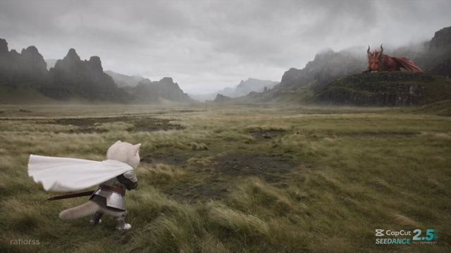</a></td>
<td width="50%" height="225" align="center" valign="middle"></td>
</tr>
<tr>
<td width="50%" valign="top"><strong>Kitten Knight Adventure</strong> <a href="https://x.com/rafalors">@rafalors</a> · Narrative films 1:00 · Bookmarks 0 · Details pending <a href="https://guanmo-ai.github.io/awesome-ai-motion/?lang=en#case-2108408481321459758">▶ Play</a> · <a href="https://x.com/rafalors/status/2108408481321459758">Original post</a></td>
<td width="50%" valign="top"><strong>The Inheritance Engine: a Dialogue-Free Trailer</strong> <a href="https://x.com/mikevicenzino">@mikevicenzino</a> · Narrative films 1:04 · Bookmarks 0 · Details pending <a href="https://guanmo-ai.github.io/awesome-ai-motion/?lang=en#case-2091155876899959138">▶ Play</a> · <a href="https://x.com/mikevicenzino/status/2091155876899959138">Original post</a></td>
</tr>
</tbody>
<tbody>
<tr>
<td width="50%" height="225" align="center" valign="middle"></td>
<td width="50%" height="225" align="center" valign="middle"></td>
</tr>
<tr>
<td width="50%" valign="top"><strong>A Mythic Action Game Trailer</strong> <a href="https://x.com/mayuresh_empire">@mayuresh_empire</a> · Narrative films 0:53 · Bookmarks 0 · Details pending <a href="https://guanmo-ai.github.io/awesome-ai-motion/?lang=en#case-2104207365008687553">▶ Play</a> · <a href="https://x.com/mayuresh_empire/status/2104207365008687553">Original post</a></td>
<td width="50%" valign="top"><strong>A late-night essay becomes a four-minute film</strong> <a href="https://x.com/wenbozhu0328">@wenbozhu0328</a> · Narrative films 4:09 · Bookmarks 0 · Details pending <a href="https://guanmo-ai.github.io/awesome-ai-motion/?lang=en#case-2105655716564656404">▶ Play</a> · <a href="https://x.com/wenbozhu0328/status/2105655716564656404">Original post</a></td>
</tr>
</tbody>
<tbody>
<tr>
<td width="50%" height="225" align="center" valign="middle"><a href="https://guanmo-ai.github.io/awesome-ai-motion/?lang=en#case-2108050135855014017">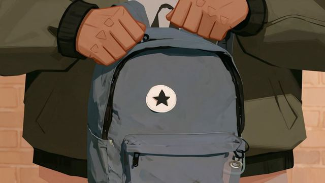</a></td>
<td width="50%" height="225" align="center" valign="middle"></td>
</tr>
<tr>
<td width="50%" valign="top"><strong>Don't Step Back: a Boxing Animation</strong> <a href="https://x.com/huyanimation">@huyanimation</a> · Narrative films 1:40 · Bookmarks 0 · Details pending <a href="https://guanmo-ai.github.io/awesome-ai-motion/?lang=en#case-2108050135855014017">▶ Play</a> · <a href="https://x.com/huyanimation/status/2108050135855014017">Original post</a></td>
<td width="50%" valign="top"><strong>Ghost of PrivatBank: a Work-in-Progress Teaser</strong> <a href="https://x.com/_YuliyaLev_">@_YuliyaLev_</a> · Narrative films 1:16 · Bookmarks 0 · Details pending <a href="https://guanmo-ai.github.io/awesome-ai-motion/?lang=en#case-2014368636236874028">▶ Play</a> · <a href="https://x.com/_YuliyaLev_/status/2014368636236874028">Original post</a></td>
</tr>
</tbody>
<tbody>
<tr>
<td width="50%" height="225" align="center" valign="middle"></td>
<td width="50%" height="225" align="center" valign="middle"></td>
</tr>
<tr>
<td width="50%" valign="top"><strong>Shrimp Pond: a painterly waterside clip</strong> <a href="https://x.com/MATCHA_ORANGE_">@MATCHA_ORANGE_</a> · Narrative films 0:15 · Bookmarks 0 · Details pending <a href="https://guanmo-ai.github.io/awesome-ai-motion/?lang=en#case-2107501581365281248">▶ Play</a> · <a href="https://x.com/MATCHA_ORANGE_/status/2107501581365281248">Original post</a></td>
<td width="50%" valign="top"><strong>From storyboard to futuristic city combat</strong> <a href="https://x.com/sagami_ss_dev">@sagami_ss_dev</a> · Narrative films 0:20 · Bookmarks 0 · Details pending <a href="https://guanmo-ai.github.io/awesome-ai-motion/?lang=en#case-2107605242712064361">▶ Play</a> · <a href="https://x.com/sagami_ss_dev/status/2107605242712064361">Original post</a></td>
</tr>
</tbody>
<tbody>
<tr>
<td width="50%" height="225" align="center" valign="middle"><a href="https://guanmo-ai.github.io/awesome-ai-motion/?lang=en#case-2107621177640235433">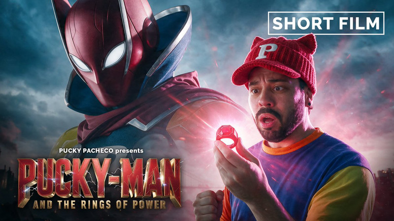</a></td>
<td width="50%" height="225" align="center" valign="middle"></td>
</tr>
<tr>
<td width="50%" valign="top"><strong>Pucky-Man and the Rings of Power</strong> <a href="https://x.com/PuckyPacheco">@PuckyPacheco</a> · Narrative films 12:03 · Bookmarks 0 · Details pending <a href="https://guanmo-ai.github.io/awesome-ai-motion/?lang=en#case-2107621177640235433">▶ Play</a> · <a href="https://x.com/PuckyPacheco/status/2107621177640235433">Original post</a></td>
<td width="50%" valign="top"><strong>A Minecraft Styled Novel Adaptation</strong> <a href="https://x.com/tuboshu321">@tuboshu321</a> · Narrative films 3:42 · Bookmarks 0 · Details pending <a href="https://guanmo-ai.github.io/awesome-ai-motion/?lang=en#case-2107768590946738440">▶ Play</a> · <a href="https://x.com/tuboshu321/status/2107768590946738440">Original post</a></td>
</tr>
</tbody>
<tbody>
<tr>
<td width="50%" height="225" align="center" valign="middle"></td>
<td width="50%" height="225" align="center" valign="middle"><a href="https://guanmo-ai.github.io/awesome-ai-motion/?lang=en#case-2108507473841930409">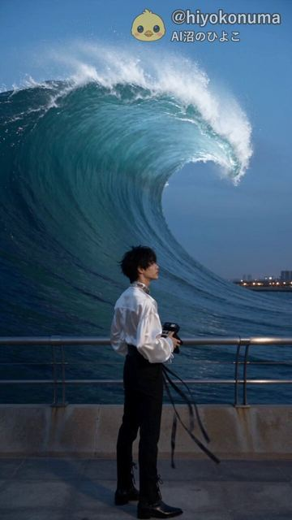</a></td>
</tr>
<tr>
<td width="50%" valign="top"><strong>Childhood Photos Become a 1990s Adventure</strong> <a href="https://x.com/eumaiconandrade">@eumaiconandrade</a> · Narrative films 0:34 · Bookmarks 0 · Details pending <a href="https://guanmo-ai.github.io/awesome-ai-motion/?lang=en#case-2107881481532260478">▶ Play</a> · <a href="https://x.com/eumaiconandrade/status/2107881481532260478">Original post</a></td>
<td width="50%" valign="top"><strong>A Wave That Waits for the Camera</strong> <a href="https://x.com/urikazu">@urikazu</a> · Narrative films 0:10 · Bookmarks 0 · Details pending <a href="https://guanmo-ai.github.io/awesome-ai-motion/?lang=en#case-2108507473841930409">▶ Play</a> · <a href="https://x.com/urikazu/status/2108507473841930409">Original post</a></td>
</tr>
</tbody>
<tbody>
<tr>
<td width="50%" height="225" align="center" valign="middle"><a href="https://guanmo-ai.github.io/awesome-ai-motion/?lang=en#case-2108521928617304185">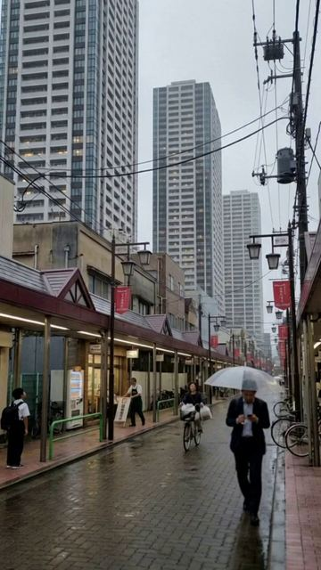</a></td>
<td width="50%" height="225" align="center" valign="middle"><a href="https://guanmo-ai.github.io/awesome-ai-motion/?lang=en#case-2107584245967282501">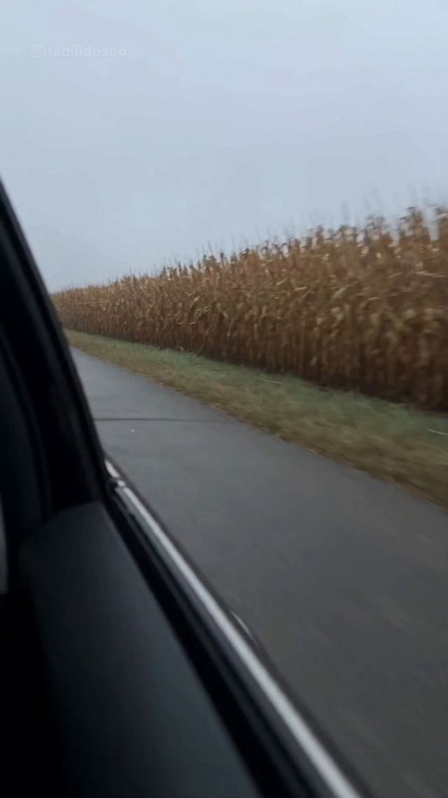</a></td>
</tr>
<tr>
<td width="50%" valign="top"><strong>PARALLAX: Rainy Streets and Departing Towers</strong> <a href="https://x.com/nAI_station">@nAI_station</a> · Narrative films 0:35 · Bookmarks 0 · Details pending <a href="https://guanmo-ai.github.io/awesome-ai-motion/?lang=en#case-2108521928617304185">▶ Play</a> · <a href="https://x.com/nAI_station/status/2108521928617304185">Original post</a></td>
<td width="50%" valign="top"><strong>Halloween Games: Episode Six of a Seasonal Series</strong> <a href="https://x.com/Nabilidosoo">@Nabilidosoo</a> · Narrative films 0:30 · Bookmarks 0 · Details pending <a href="https://guanmo-ai.github.io/awesome-ai-motion/?lang=en#case-2107584245967282501">▶ Play</a> · <a href="https://x.com/Nabilidosoo/status/2107584245967282501">Original post</a></td>
</tr>
</tbody>
<tbody>
<tr>
<td width="50%" height="225" align="center" valign="middle"><a href="https://guanmo-ai.github.io/awesome-ai-motion/?lang=en#case-2107897224629719415">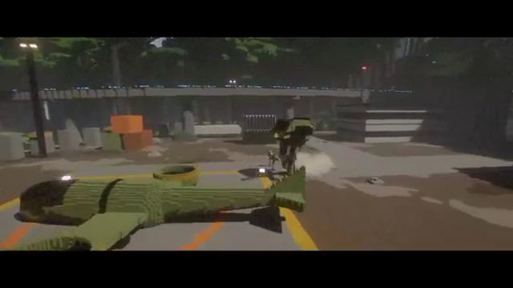</a></td>
<td width="50%" height="225" align="center" valign="middle"></td>
</tr>
<tr>
<td width="50%" valign="top"><strong>A Gameplay Trailer for an Alien Industrial World</strong> <a href="https://x.com/Blackest_Frog">@Blackest_Frog</a> · Narrative films 1:00 · Bookmarks 0 · Details pending <a href="https://guanmo-ai.github.io/awesome-ai-motion/?lang=en#case-2107897224629719415">▶ Play</a> · <a href="https://x.com/Blackest_Frog/status/2107897224629719415">Original post</a></td>
<td width="50%" valign="top"><strong>Mikan-sama: a Spirit of Unfinished Tasks</strong> <a href="https://x.com/renkatO9">@renkatO9</a> · Narrative films 0:25 · Bookmarks 0 · Details pending <a href="https://guanmo-ai.github.io/awesome-ai-motion/?lang=en#case-2108187094963409010">▶ Play</a> · <a href="https://x.com/renkatO9/status/2108187094963409010">Original post</a></td>
</tr>
</tbody>
<tbody>
<tr>
<td width="50%" height="225" align="center" valign="middle"></td>
<td width="50%" height="225" align="center" valign="middle"><a href="https://guanmo-ai.github.io/awesome-ai-motion/?lang=en#case-2108351079016706416">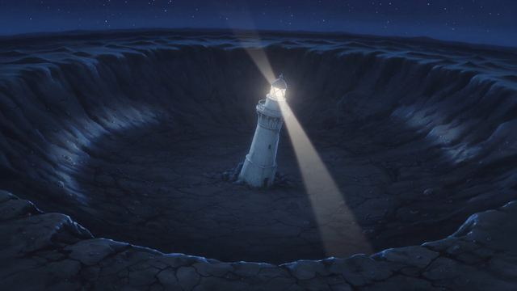</a></td>
</tr>
<tr>
<td width="50%" valign="top"><strong>Watchers: an AI Short Film</strong> <a href="https://x.com/ehsaanveisii">@ehsaanveisii</a> · Narrative films 11:35 · Bookmarks 0 · Details pending <a href="https://guanmo-ai.github.io/awesome-ai-motion/?lang=en#case-2108195593176715520">▶ Play</a> · <a href="https://x.com/ehsaanveisii/status/2108195593176715520">Original post</a></td>
<td width="50%" valign="top"><strong>The Lighthouse and the Night Sea: an Original Duel</strong> <a href="https://x.com/NOIZ_ANIME">@NOIZ_ANIME</a> · Narrative films 1:00 · Bookmarks 0 · Details pending <a href="https://guanmo-ai.github.io/awesome-ai-motion/?lang=en#case-2108351079016706416">▶ Play</a> · <a href="https://x.com/NOIZ_ANIME/status/2108351079016706416">Original post</a></td>
</tr>
</tbody>
<tbody>
<tr>
<td width="50%" height="225" align="center" valign="middle"></td>
<td width="50%" height="225" align="center" valign="middle"></td>
</tr>
<tr>
<td width="50%" valign="top"><strong>Half a Blanket: a Story Across the Miles</strong> <a href="https://x.com/Vallabh469">@Vallabh469</a> · Narrative films 0:39 · Bookmarks 0 · Details pending <a href="https://guanmo-ai.github.io/awesome-ai-motion/?lang=en#case-2108494077389926611">▶ Play</a> · <a href="https://x.com/Vallabh469/status/2108494077389926611">Original post</a></td>
<td width="50%" valign="top"><strong>Color Thief: Wearing a City’s Colors</strong> <a href="https://x.com/mckt615">@mckt615</a> · Narrative films 0:30 · Bookmarks 0 · Details pending <a href="https://guanmo-ai.github.io/awesome-ai-motion/?lang=en#case-2108515885065683328">▶ Play</a> · <a href="https://x.com/mckt615/status/2108515885065683328">Original post</a></td>
</tr>
</tbody>
<tbody>
<tr>
<td width="50%" height="225" align="center" valign="middle"></td>
<td width="50%" height="225" align="center" valign="middle"></td>
</tr>
<tr>
<td width="50%" valign="top"><strong>Three Everyday Coincidence Vignettes</strong> <a href="https://x.com/YoshiKura535130">@YoshiKura535130</a> · Narrative films 0:43 · Bookmarks 0 · Details pending <a href="https://guanmo-ai.github.io/awesome-ai-motion/?lang=en#case-2102910805721362875">▶ Play</a> · <a href="https://x.com/YoshiKura535130/status/2102910805721362875">Original post</a></td>
<td width="50%" valign="top"><strong>Imagination Expired: a Seedance 2.5 Short</strong> <a href="https://x.com/HuskiStudio">@HuskiStudio</a> · Narrative films 2:31 · Bookmarks 0 · Details pending <a href="https://guanmo-ai.github.io/awesome-ai-motion/?lang=en#case-2104419979924033781">▶ Play</a> · <a href="https://x.com/HuskiStudio/status/2104419979924033781">Original post</a></td>
</tr>
</tbody>
<tbody>
<tr>
<td width="50%" height="225" align="center" valign="middle"></td>
<td width="50%" height="225" align="center" valign="middle"></td>
</tr>
<tr>
<td width="50%" valign="top"><strong>Max Verstappen: A Footage Editing Experiment</strong> <a href="https://x.com/salRoid">@salRoid</a> · Narrative films 1:37 · Bookmarks 0 · Details pending <a href="https://guanmo-ai.github.io/awesome-ai-motion/?lang=en#case-2104775404368412946">▶ Play</a> · <a href="https://x.com/salRoid/status/2104775404368412946">Original post</a></td>
<td width="50%" valign="top"><strong>Far from the Madding Crowd: A Space-Outpost Paper Film</strong> <a href="https://x.com/NoFollowers2023">@NoFollowers2023</a> · Narrative films 5:27 · Bookmarks 0 · Details pending <a href="https://x.com/NoFollowers2023/status/2104792004978974928">▶ Watch on X</a> · <a href="https://x.com/NoFollowers2023/status/2104792004978974928">Original post</a></td>
</tr>
</tbody>
<tbody>
<tr>
<td width="50%" height="225" align="center" valign="middle"></td>
<td width="50%" height="225" align="center" valign="middle"></td>
</tr>
<tr>
<td width="50%" valign="top"><strong>Humans choose the direction in the AI era</strong> <a href="https://x.com/nakazakifam">@nakazakifam</a> · Narrative films 1:24 · Bookmarks 0 · Details pending <a href="https://guanmo-ai.github.io/awesome-ai-motion/?lang=en#case-2105361184543133877">▶ Play</a> · <a href="https://x.com/nakazakifam/status/2105361184543133877">Original post</a></td>
<td width="50%" valign="top"><strong>Emergence: a code-built short film</strong> <a href="https://x.com/JindaLi_">@JindaLi_</a> · Narrative films 4:37 · Bookmarks 0 · Details pending <a href="https://guanmo-ai.github.io/awesome-ai-motion/?lang=en#case-2107434660057800861">▶ Play</a> · <a href="https://x.com/JindaLi_/status/2107434660057800861">Original post</a></td>
</tr>
</tbody>
<tbody>
<tr>
<td width="50%" height="225" align="center" valign="middle"></td>
<td width="50%" height="225" align="center" valign="middle"></td>
</tr>
<tr>
<td width="50%" valign="top"><strong>A local MiniMax H3 dialogue test</strong> <a href="https://x.com/hylwr">@hylwr</a> · Narrative films 0:40 · Bookmarks 0 · Details pending <a href="https://guanmo-ai.github.io/awesome-ai-motion/?lang=en#case-2107461812316942784">▶ Play</a> · <a href="https://x.com/hylwr/status/2107461812316942784">Original post</a></td>
<td width="50%" valign="top"><strong>When Sand Speaks: Episode One</strong> <a href="https://x.com/kevrussell">@kevrussell</a> · Narrative films 0:54 · Bookmarks 0 · Details pending <a href="https://guanmo-ai.github.io/awesome-ai-motion/?lang=en#case-2107501886844891607">▶ Play</a> · <a href="https://x.com/kevrussell/status/2107501886844891607">Original post</a></td>
</tr>
</tbody>
<tbody>
<tr>
<td width="50%" height="225" align="center" valign="middle"></td>
<td width="50%" height="225" align="center" valign="middle"></td>
</tr>
<tr>
<td width="50%" valign="top"><strong>A multi-shot 2D style test</strong> <a href="https://x.com/wowsomevisual">@wowsomevisual</a> · Narrative films 0:15 · Bookmarks 0 · Details pending <a href="https://guanmo-ai.github.io/awesome-ai-motion/?lang=en#case-2107590713588240819">▶ Play</a> · <a href="https://x.com/wowsomevisual/status/2107590713588240819">Original post</a></td>
<td width="50%" valign="top"><strong>GLOW: She Wanted to Be Human teaser</strong> <a href="https://x.com/WILLAVELLI_">@WILLAVELLI_</a> · Narrative films 0:07 · Bookmarks 0 · Details pending <a href="https://guanmo-ai.github.io/awesome-ai-motion/?lang=en#case-2107656681530544224">▶ Play</a> · <a href="https://x.com/WILLAVELLI_/status/2107656681530544224">Original post</a></td>
</tr>
</tbody>
<tbody>
<tr>
<td width="50%" height="225" align="center" valign="middle"></td>
<td width="50%" height="225" align="center" valign="middle"></td>
</tr>
<tr>
<td width="50%" valign="top"><strong>The Arena Has No Rules, part four</strong> <a href="https://x.com/voraworld1">@voraworld1</a> · Narrative films 1:20 · Bookmarks 0 · Details pending <a href="https://guanmo-ai.github.io/awesome-ai-motion/?lang=en#case-2107665921632342271">▶ Play</a> · <a href="https://x.com/voraworld1/status/2107665921632342271">Original post</a></td>
<td width="50%" valign="top"><strong>Blender blockouts directing generated shots</strong> <a href="https://x.com/gensoFX">@gensoFX</a> · Narrative films 0:20 · Bookmarks 0 · Details pending <a href="https://guanmo-ai.github.io/awesome-ai-motion/?lang=en#case-2107676101749453177">▶ Play</a> · <a href="https://x.com/gensoFX/status/2107676101749453177">Original post</a></td>
</tr>
</tbody>
<tbody>
<tr>
<td width="50%" height="225" align="center" valign="middle"></td>
<td width="50%" height="225" align="center" valign="middle"></td>
</tr>
<tr>
<td width="50%" valign="top"><strong>A Boxer and a Rocket-powered Vending Machine</strong> <a href="https://x.com/MxCaptures">@MxCaptures</a> · Narrative films 0:15 · Bookmarks 0 · Details pending <a href="https://guanmo-ai.github.io/awesome-ai-motion/?lang=en#case-2107728346159239384">▶ Play</a> · <a href="https://x.com/MxCaptures/status/2107728346159239384">Original post</a></td>
<td width="50%" valign="top"><strong>Yin and Yang: an Action Short</strong> <a href="https://x.com/Edenwoodfilm">@Edenwoodfilm</a> · Narrative films 0:15 · Bookmarks 0 · Details pending <a href="https://guanmo-ai.github.io/awesome-ai-motion/?lang=en#case-2107922153173860441">▶ Play</a> · <a href="https://x.com/Edenwoodfilm/status/2107922153173860441">Original post</a></td>
</tr>
</tbody>
<tbody>
<tr>
<td width="50%" height="225" align="center" valign="middle"></td>
<td width="50%" height="225" align="center" valign="middle"></td>
</tr>
<tr>
<td width="50%" valign="top"><strong>A Morning Sunflower Shot</strong> <a href="https://x.com/saribali808">@saribali808</a> · Narrative films 0:05 · Bookmarks 0 · Details pending <a href="https://guanmo-ai.github.io/awesome-ai-motion/?lang=en#case-2108296356507054261">▶ Play</a> · <a href="https://x.com/saribali808/status/2108296356507054261">Original post</a></td>
<td width="50%" valign="top"><strong>A Codex Anime-style Introduction Test</strong> <a href="https://x.com/Quantzuma">@Quantzuma</a> · Narrative films 0:30 · Bookmarks 0 · Details pending <a href="https://guanmo-ai.github.io/awesome-ai-motion/?lang=en#case-2108340003613053354">▶ Play</a> · <a href="https://x.com/Quantzuma/status/2108340003613053354">Original post</a></td>
</tr>
</tbody>
<tbody>
<tr>
<td width="50%" height="225" align="center" valign="middle"></td>
<td width="50%" height="225" align="center" valign="middle"></td>
</tr>
<tr>
<td width="50%" valign="top"><strong>Verdantia: a Train to a Forest Planet</strong> <a href="https://x.com/D_aerial2024">@D_aerial2024</a> · Narrative films 0:30 · Bookmarks 0 · Details pending <a href="https://guanmo-ai.github.io/awesome-ai-motion/?lang=en#case-2108341984641605962">▶ Play</a> · <a href="https://x.com/D_aerial2024/status/2108341984641605962">Original post</a></td>
<td width="50%" valign="top"><strong>A Conveyor-belt Sushi Shop for Cats</strong> <a href="https://x.com/yudotanaka">@yudotanaka</a> · Narrative films 0:15 · Bookmarks 0 · Details pending <a href="https://guanmo-ai.github.io/awesome-ai-motion/?lang=en#case-2108344906943172804">▶ Play</a> · <a href="https://x.com/yudotanaka/status/2108344906943172804">Original post</a></td>
</tr>
</tbody>
<tbody>
<tr>
<td width="50%" height="225" align="center" valign="middle"></td>
<td width="50%" height="225" align="center" valign="middle"></td>
</tr>
<tr>
<td width="50%" valign="top"><strong>A Quiet Afternoon from One Image</strong> <a href="https://x.com/AiQLee">@AiQLee</a> · Narrative films 0:15 · Bookmarks 0 · Details pending <a href="https://guanmo-ai.github.io/awesome-ai-motion/?lang=en#case-2108402008969642181">▶ Play</a> · <a href="https://x.com/AiQLee/status/2108402008969642181">Original post</a></td>
<td width="50%" valign="top"><strong>DON’T LOOK UP: Suspense Near the Exit</strong> <a href="https://x.com/Castuananh">@Castuananh</a> · Narrative films 0:33 · Bookmarks 0 · Details pending <a href="https://guanmo-ai.github.io/awesome-ai-motion/?lang=en#case-2108420740383223854">▶ Play</a> · <a href="https://x.com/Castuananh/status/2108420740383223854">Original post</a></td>
</tr>
</tbody>
<tbody>
<tr>
<td width="50%" height="225" align="center" valign="middle"></td>
<td width="50%" height="225" align="center" valign="middle"></td>
</tr>
<tr>
<td width="50%" valign="top"><strong>SCHOOL HUSTLE: THE EX — Part 3</strong> <a href="https://x.com/promodenstudio">@promodenstudio</a> · Narrative films 2:45 · Bookmarks 0 · Details pending <a href="https://guanmo-ai.github.io/awesome-ai-motion/?lang=en#case-2108509389938119127">▶ Play</a> · <a href="https://x.com/promodenstudio/status/2108509389938119127">Original post</a></td>
<td width="50%" valign="top"><strong>White Rabbit Dream: Emma and Her Choker</strong> <a href="https://x.com/AI__TSUBAKI">@AI__TSUBAKI</a> · Narrative films 3:16 · Bookmarks 0 · Details pending <a href="https://guanmo-ai.github.io/awesome-ai-motion/?lang=en#case-2108932673813311706">▶ Play</a> · <a href="https://x.com/AI__TSUBAKI/status/2108932673813311706">Original post</a></td>
</tr>
</tbody>
<tbody>
<tr>
<td width="50%" height="225" align="center" valign="middle"><a href="https://guanmo-ai.github.io/awesome-ai-motion/?lang=en#case-2108935203507069157">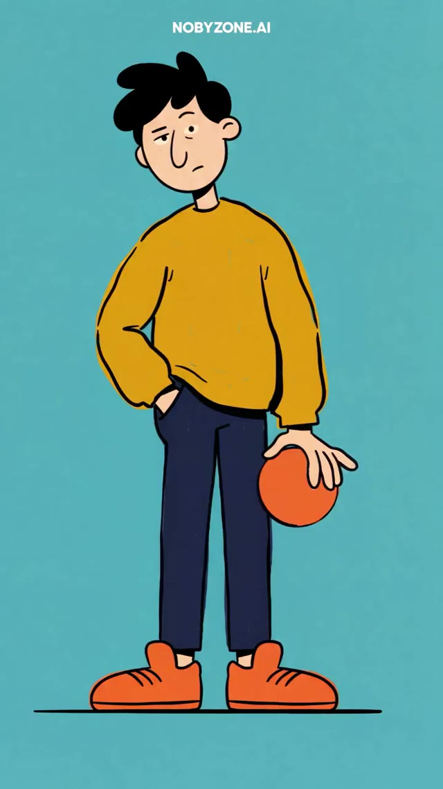</a></td>
<td width="50%" height="225" align="center" valign="middle"></td>
</tr>
<tr>
<td width="50%" valign="top"><strong>The Hole in His Pocket</strong> <a href="https://x.com/NOBYZONEai">@NOBYZONEai</a> · Narrative films 0:15 · Bookmarks 0 · Details pending <a href="https://guanmo-ai.github.io/awesome-ai-motion/?lang=en#case-2108935203507069157">▶ Play</a> · <a href="https://x.com/NOBYZONEai/status/2108935203507069157">Original post</a></td>
<td width="50%" valign="top"><strong>Music Film About Functional Emotions</strong> <a href="https://x.com/eudaemonea">@eudaemonea</a> · Music &amp; lyrics 6:13 · Bookmarks 2,119 · Details pending <a href="https://guanmo-ai.github.io/awesome-ai-motion/?lang=en#case-2102610626321490404">▶ Play</a> · <a href="https://x.com/eudaemonea/status/2102610626321490404">Original post</a></td>
</tr>
</tbody>
<tbody>
<tr>
<td width="50%" height="225" align="center" valign="middle"></td>
<td width="50%" height="225" align="center" valign="middle"></td>
</tr>
<tr>
<td width="50%" valign="top"><strong>Blender Remake of a Music Meme</strong> <a href="https://x.com/reach_vb">@reach_vb</a> · Music &amp; lyrics 0:58 · Bookmarks 1,608 · Details pending <a href="https://guanmo-ai.github.io/awesome-ai-motion/?lang=en#case-2096612996256579653">▶ Play</a> · <a href="https://x.com/reach_vb/status/2096612996256579653">Original post</a></td>
<td width="50%" valign="top"><strong>Piano composition and JavaScript animation</strong> <a href="https://x.com/kevin_t_ngo">@kevin_t_ngo</a> · Music &amp; lyrics 0:45 · Bookmarks 1,209 · Details pending <a href="https://guanmo-ai.github.io/awesome-ai-motion/?lang=en#case-2103482164193165711">▶ Play</a> · <a href="https://x.com/kevin_t_ngo/status/2103482164193165711">Original post</a></td>
</tr>
</tbody>
<tbody>
<tr>
<td width="50%" height="225" align="center" valign="middle"></td>
<td width="50%" height="225" align="center" valign="middle"></td>
</tr>
<tr>
<td width="50%" valign="top"><strong>Neon Overdrive: Evangelion-Inspired Audiovisuals</strong> <a href="https://x.com/LuisBizarro">@LuisBizarro</a> · Music &amp; lyrics 3:04 · Bookmarks 1,168 · Details pending <a href="https://guanmo-ai.github.io/awesome-ai-motion/?lang=en#case-2104111432149164474">▶ Play</a> · <a href="https://x.com/LuisBizarro/status/2104111432149164474">Original post</a></td>
<td width="50%" valign="top"><strong>Code-Synthesized Rap Music Video</strong> <a href="https://x.com/aj_dev_smith">@aj_dev_smith</a> · Music &amp; lyrics 3:11 · Bookmarks 852 · Details pending <a href="https://guanmo-ai.github.io/awesome-ai-motion/?lang=en#case-2102803889183736141">▶ Play</a> · <a href="https://x.com/aj_dev_smith/status/2102803889183736141">Original post</a></td>
</tr>
</tbody>
<tbody>
<tr>
<td width="50%" height="225" align="center" valign="middle"></td>
<td width="50%" height="225" align="center" valign="middle"><a href="https://guanmo-ai.github.io/awesome-ai-motion/?lang=en#case-2107696042053431360">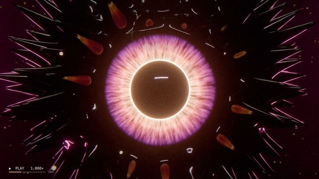</a></td>
</tr>
<tr>
<td width="50%" valign="top"><strong>Character Pop-Punk Music Film</strong> <a href="https://x.com/aj_dev_smith">@aj_dev_smith</a> · Music &amp; lyrics 2:30 · Bookmarks 665 · Details pending <a href="https://guanmo-ai.github.io/awesome-ai-motion/?lang=en#case-2102575577563570450">▶ Play</a> · <a href="https://x.com/aj_dev_smith/status/2102575577563570450">Original post</a></td>
<td width="50%" valign="top"><strong>A Spectrogram Becomes a Magma Canyon and an Eye</strong> <a href="https://x.com/kloss_xyz">@kloss_xyz</a> · Music &amp; lyrics 0:21 · Bookmarks 658 · Details pending <a href="https://guanmo-ai.github.io/awesome-ai-motion/?lang=en#case-2107696042053431360">▶ Play</a> · <a href="https://x.com/kloss_xyz/status/2107696042053431360">Original post</a></td>
</tr>
</tbody>
<tbody>
<tr>
<td width="50%" height="225" align="center" valign="middle"></td>
<td width="50%" height="225" align="center" valign="middle"></td>
</tr>
<tr>
<td width="50%" valign="top"><strong>Music Video on Monetary History</strong> <a href="https://x.com/bradmillscan">@bradmillscan</a> · Music &amp; lyrics 3:23 · Bookmarks 358 · Details pending <a href="https://guanmo-ai.github.io/awesome-ai-motion/?lang=en#case-2103108967194833310">▶ Play</a> · <a href="https://x.com/bradmillscan/status/2103108967194833310">Original post</a></td>
<td width="50%" valign="top"><strong>Safety &amp; First Place</strong> <a href="https://x.com/Xanderwow_A">@Xanderwow_A</a> · Music &amp; lyrics 0:25 · Bookmarks 344 · Details pending <a href="https://guanmo-ai.github.io/awesome-ai-motion/?lang=en#case-2106989958762516875">▶ Play</a> · <a href="https://x.com/Xanderwow_A/status/2106989958762516875">Original post</a></td>
</tr>
</tbody>
<tbody>
<tr>
<td width="50%" height="225" align="center" valign="middle"></td>
<td width="50%" height="225" align="center" valign="middle"></td>
</tr>
<tr>
<td width="50%" valign="top"><strong>A beat-synchronized green-screen music video</strong> <a href="https://x.com/gkxspace">@gkxspace</a> · Music &amp; lyrics 0:15 · Bookmarks 277 · Details pending <a href="https://guanmo-ai.github.io/awesome-ai-motion/?lang=en#case-2107108561851445324">▶ Play</a> · <a href="https://x.com/gkxspace/status/2107108561851445324">Original post</a></td>
<td width="50%" valign="top"><strong>The Context Windows: a local AI band</strong> <a href="https://x.com/anshuc">@anshuc</a> · Music &amp; lyrics 3:20 · Bookmarks 146 · Details pending <a href="https://guanmo-ai.github.io/awesome-ai-motion/?lang=en#case-2106131543752122774">▶ Play</a> · <a href="https://x.com/anshuc/status/2106131543752122774">Original post</a></td>
</tr>
</tbody>
<tbody>
<tr>
<td width="50%" height="225" align="center" valign="middle"></td>
<td width="50%" height="225" align="center" valign="middle"><a href="https://guanmo-ai.github.io/awesome-ai-motion/?lang=en#case-2107744155007062101">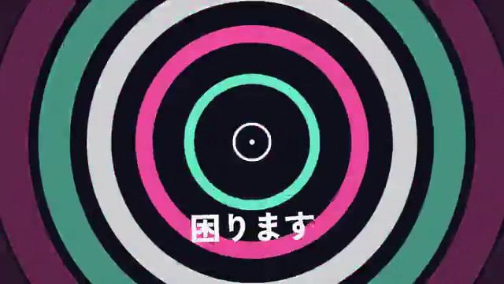</a></td>
</tr>
<tr>
<td width="50%" valign="top"><strong>A multi-tool music video under human art direction</strong> <a href="https://x.com/maxescu">@maxescu</a> · Music &amp; lyrics 3:20 · Bookmarks 128 · Details pending <a href="https://guanmo-ai.github.io/awesome-ai-motion/?lang=en#case-2106395987996536913">▶ Play</a> · <a href="https://x.com/maxescu/status/2106395987996536913">Original post</a></td>
<td width="50%" valign="top"><strong>A Lyric-video Experiment with EffectCraft</strong> <a href="https://x.com/wtry1102">@wtry1102</a> · Music &amp; lyrics 1:51 · Bookmarks 109 · Details pending <a href="https://guanmo-ai.github.io/awesome-ai-motion/?lang=en#case-2107744155007062101">▶ Play</a> · <a href="https://x.com/wtry1102/status/2107744155007062101">Original post</a></td>
</tr>
</tbody>
<tbody>
<tr>
<td width="50%" height="225" align="center" valign="middle"></td>
<td width="50%" height="225" align="center" valign="middle"></td>
</tr>
<tr>
<td width="50%" valign="top"><strong>Fantasy Character Song Film</strong> <a href="https://x.com/Shoalst0ne">@Shoalst0ne</a> · Music &amp; lyrics 3:28 · Bookmarks 95 · Details pending <a href="https://guanmo-ai.github.io/awesome-ai-motion/?lang=en#case-2102640820776046818">▶ Play</a> · <a href="https://x.com/Shoalst0ne/status/2102640820776046818">Original post</a></td>
<td width="50%" valign="top"><strong>A playing-card rap animation</strong> <a href="https://x.com/Narfdemo2000">@Narfdemo2000</a> · Music &amp; lyrics 1:19 · Bookmarks 39 · Details pending <a href="https://guanmo-ai.github.io/awesome-ai-motion/?lang=en#case-2107102281640653237">▶ Play</a> · <a href="https://x.com/Narfdemo2000/status/2107102281640653237">Original post</a></td>
</tr>
</tbody>
<tbody>
<tr>
<td width="50%" height="225" align="center" valign="middle"></td>
<td width="50%" height="225" align="center" valign="middle"></td>
</tr>
<tr>
<td width="50%" valign="top"><strong>Character-Led Animated Song</strong> <a href="https://x.com/ruinolab">@ruinolab</a> · Music &amp; lyrics 0:50 · Bookmarks 27 · Details pending <a href="https://guanmo-ai.github.io/awesome-ai-motion/?lang=en#case-2103120880796873091">▶ Play</a> · <a href="https://x.com/ruinolab/status/2103120880796873091">Original post</a></td>
<td width="50%" valign="top"><strong>Code-Drawn Film for an Existing Song</strong> <a href="https://x.com/ExistentialEnso">@ExistentialEnso</a> · Music &amp; lyrics 5:40 · Bookmarks 20 · Details pending <a href="https://guanmo-ai.github.io/awesome-ai-motion/?lang=en#case-2102599211212554616">▶ Play</a> · <a href="https://x.com/ExistentialEnso/status/2102599211212554616">Original post</a></td>
</tr>
</tbody>
<tbody>
<tr>
<td width="50%" height="225" align="center" valign="middle"></td>
<td width="50%" height="225" align="center" valign="middle"></td>
</tr>
<tr>
<td width="50%" valign="top"><strong>Watercolor-Rendered Song Film</strong> <a href="https://x.com/johnknopf">@johnknopf</a> · Music &amp; lyrics 3:26 · Bookmarks 15 · Details pending <a href="https://guanmo-ai.github.io/awesome-ai-motion/?lang=en#case-2103170666187117006">▶ Play</a> · <a href="https://x.com/johnknopf/status/2103170666187117006">Original post</a></td>
<td width="50%" valign="top"><strong>An Interactive MusicKit and WebGPU Lyrics Player</strong> <a href="https://x.com/LuisBizarro">@LuisBizarro</a> · Music &amp; lyrics 0:18 · Bookmarks 14 · Details pending <a href="https://guanmo-ai.github.io/awesome-ai-motion/?lang=en#case-2105174061697618314">▶ Play</a> · <a href="https://x.com/LuisBizarro/status/2105174061697618314">Original post</a></td>
</tr>
</tbody>
<tbody>
<tr>
<td width="50%" height="225" align="center" valign="middle"></td>
<td width="50%" height="225" align="center" valign="middle"></td>
</tr>
<tr>
<td width="50%" valign="top"><strong>Red Lines: an AI-safety Music Video</strong> <a href="https://x.com/kasikp">@kasikp</a> · Music &amp; lyrics 6:08 · Bookmarks 10 · Details pending <a href="https://guanmo-ai.github.io/awesome-ai-motion/?lang=en#case-2108309888535576621">▶ Play</a> · <a href="https://x.com/kasikp/status/2108309888535576621">Original post</a></td>
<td width="50%" valign="top"><strong>Twenty-Second Music Video</strong> <a href="https://x.com/anjmaxx">@anjmaxx</a> · Music &amp; lyrics 0:20 · Bookmarks 7 · Details pending <a href="https://guanmo-ai.github.io/awesome-ai-motion/?lang=en#case-2103173729656459455">▶ Play</a> · <a href="https://x.com/anjmaxx/status/2103173729656459455">Original post</a></td>
</tr>
</tbody>
<tbody>
<tr>
<td width="50%" height="225" align="center" valign="middle"></td>
<td width="50%" height="225" align="center" valign="middle"></td>
</tr>
<tr>
<td width="50%" valign="top"><strong>Dancing notes: a three-melody medley</strong> <a href="https://x.com/YangOnchain">@YangOnchain</a> · Music &amp; lyrics 1:17 · Bookmarks 5 · Details pending <a href="https://guanmo-ai.github.io/awesome-ai-motion/?lang=en#case-2107402637700460669">▶ Play</a> · <a href="https://x.com/YangOnchain/status/2107402637700460669">Original post</a></td>
<td width="50%" valign="top"><strong>Techno remix music video</strong> <a href="https://x.com/qiqing">@qiqing</a> · Music &amp; lyrics 2:10 · Bookmarks 4 · Details pending <a href="https://guanmo-ai.github.io/awesome-ai-motion/?lang=en#case-2104241160487338005">▶ Play</a> · <a href="https://x.com/qiqing/status/2104241160487338005">Original post</a></td>
</tr>
</tbody>
<tbody>
<tr>
<td width="50%" height="225" align="center" valign="middle"></td>
<td width="50%" height="225" align="center" valign="middle"></td>
</tr>
<tr>
<td width="50%" valign="top"><strong>Thirteen-Minute Rock Music Video</strong> <a href="https://x.com/cube__lol">@cube__lol</a> · Music &amp; lyrics 13:53 · Bookmarks 4 · Details pending <a href="https://guanmo-ai.github.io/awesome-ai-motion/?lang=en#case-2102879729594343605">▶ Play</a> · <a href="https://x.com/cube__lol/status/2102879729594343605">Original post</a></td>
<td width="50%" valign="top"><strong>Shader-Rendered Song Film</strong> <a href="https://x.com/xlcomplete">@xlcomplete</a> · Music &amp; lyrics 4:51 · Bookmarks 3 · Details pending <a href="https://guanmo-ai.github.io/awesome-ai-motion/?lang=en#case-2103015953877647820">▶ Play</a> · <a href="https://x.com/xlcomplete/status/2103015953877647820">Original post</a></td>
</tr>
</tbody>
<tbody>
<tr>
<td width="50%" height="225" align="center" valign="middle"></td>
<td width="50%" height="225" align="center" valign="middle"></td>
</tr>
<tr>
<td width="50%" valign="top"><strong>Astra Blue: singing the daily AI news</strong> <a href="https://x.com/mdaman010">@mdaman010</a> · Music &amp; lyrics 4:11 · Bookmarks 2 · Details pending <a href="https://guanmo-ai.github.io/awesome-ai-motion/?lang=en#case-2107186892047597821">▶ Play</a> · <a href="https://x.com/mdaman010/status/2107186892047597821">Original post</a></td>
<td width="50%" valign="top"><strong>Song Film Across a Character's Eras</strong> <a href="https://x.com/Aadidev0">@Aadidev0</a> · Music &amp; lyrics 2:44 · Bookmarks 2 · Details pending <a href="https://guanmo-ai.github.io/awesome-ai-motion/?lang=en#case-2102692569792835994">▶ Play</a> · <a href="https://x.com/Aadidev0/status/2102692569792835994">Original post</a></td>
</tr>
</tbody>
<tbody>
<tr>
<td width="50%" height="225" align="center" valign="middle"></td>
<td width="50%" height="225" align="center" valign="middle"></td>
</tr>
<tr>
<td width="50%" valign="top"><strong>Xuandi Gong: a Song-driven Market Video</strong> <a href="https://x.com/cgnot996">@cgnot996</a> · Music &amp; lyrics 5:39 · Bookmarks 2 · Details pending <a href="https://guanmo-ai.github.io/awesome-ai-motion/?lang=en#case-2108157846005350754">▶ Play</a> · <a href="https://x.com/cgnot996/status/2108157846005350754">Original post</a></td>
<td width="50%" valign="top"><strong>A Chinese Love Song Becomes a Six-scene JS Animation</strong> <a href="https://x.com/nicekate8888">@nicekate8888</a> · Music &amp; lyrics 2:03 · Bookmarks 2 · Details pending <a href="https://guanmo-ai.github.io/awesome-ai-motion/?lang=en#case-2108241523200676048">▶ Play</a> · <a href="https://x.com/nicekate8888/status/2108241523200676048">Original post</a></td>
</tr>
</tbody>
<tbody>
<tr>
<td width="50%" height="225" align="center" valign="middle"></td>
<td width="50%" height="225" align="center" valign="middle"></td>
</tr>
<tr>
<td width="50%" valign="top"><strong>Procedural Music and Animation Film</strong> <a href="https://x.com/NoFollowers2023">@NoFollowers2023</a> · Music &amp; lyrics 2:41 · Bookmarks 2 · Details pending <a href="https://guanmo-ai.github.io/awesome-ai-motion/?lang=en#case-2102787420399825023">▶ Play</a> · <a href="https://x.com/NoFollowers2023/status/2102787420399825023">Original post</a></td>
<td width="50%" valign="top"><strong>Ferrofluid with Original Music</strong> <a href="https://x.com/gogu_name">@gogu_name</a> · Music &amp; lyrics 0:16 · Bookmarks 2 · Details pending <a href="https://guanmo-ai.github.io/awesome-ai-motion/?lang=en#case-2104736947822645622">▶ Play</a> · <a href="https://x.com/gogu_name/status/2104736947822645622">Original post</a></td>
</tr>
</tbody>
<tbody>
<tr>
<td width="50%" height="225" align="center" valign="middle"></td>
<td width="50%" height="225" align="center" valign="middle"><a href="https://guanmo-ai.github.io/awesome-ai-motion/?lang=en#case-2108514277502099949">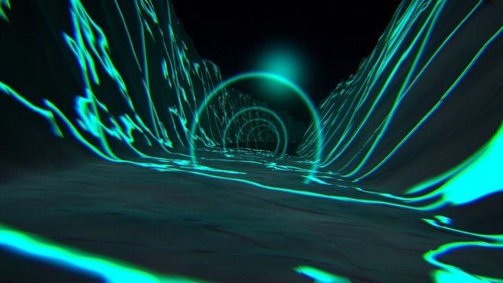</a></td>
</tr>
<tr>
<td width="50%" valign="top"><strong>A synchronized mechanical piano</strong> <a href="https://x.com/dilemma017">@dilemma017</a> · Music &amp; lyrics 0:09 · Bookmarks 2 · Details pending <a href="https://guanmo-ai.github.io/awesome-ai-motion/?lang=en#case-2106874360678023377">▶ Play</a> · <a href="https://x.com/dilemma017/status/2106874360678023377">Original post</a></td>
<td width="50%" valign="top"><strong>TouchDesigner: a Sound-deforming World</strong> <a href="https://x.com/akiyoshisan">@akiyoshisan</a> · Music &amp; lyrics 0:33 · Bookmarks 2 · Details pending <a href="https://guanmo-ai.github.io/awesome-ai-motion/?lang=en#case-2108514277502099949">▶ Play</a> · <a href="https://x.com/akiyoshisan/status/2108514277502099949">Original post</a></td>
</tr>
</tbody>
<tbody>
<tr>
<td width="50%" height="225" align="center" valign="middle"></td>
<td width="50%" height="225" align="center" valign="middle"></td>
</tr>
<tr>
<td width="50%" valign="top"><strong>A P(doom) music video made with GenMotion</strong> <a href="https://x.com/haxzie_">@haxzie_</a> · Music &amp; lyrics 2:37 · Bookmarks 1 · Details pending <a href="https://guanmo-ai.github.io/awesome-ai-motion/?lang=en#case-2105282502726484258">▶ Play</a> · <a href="https://x.com/haxzie_/status/2105282502726484258">Original post</a></td>
<td width="50%" valign="top"><strong>A Mechanical Eye That Reacts to Music</strong> <a href="https://x.com/Acoramaa">@Acoramaa</a> · Music &amp; lyrics 0:28 · Bookmarks 1 · Details pending <a href="https://guanmo-ai.github.io/awesome-ai-motion/?lang=en#case-2104145227573248467">▶ Play</a> · <a href="https://x.com/Acoramaa/status/2104145227573248467">Original post</a></td>
</tr>
</tbody>
<tbody>
<tr>
<td width="50%" height="225" align="center" valign="middle"></td>
<td width="50%" height="225" align="center" valign="middle"></td>
</tr>
<tr>
<td width="50%" valign="top"><strong>EUDoom: a European P(doom) music animation</strong> <a href="https://x.com/JSalmisaari">@JSalmisaari</a> · Music &amp; lyrics 2:37 · Bookmarks 1 · Details pending <a href="https://guanmo-ai.github.io/awesome-ai-motion/?lang=en#case-2105926129567879524">▶ Play</a> · <a href="https://x.com/JSalmisaari/status/2105926129567879524">Original post</a></td>
<td width="50%" valign="top"><strong>Songbie: a snowman and a black cat at the piano</strong> <a href="https://x.com/JohnnyWang8802">@JohnnyWang8802</a> · Music &amp; lyrics 1:13 · Bookmarks 1 · Details pending <a href="https://guanmo-ai.github.io/awesome-ai-motion/?lang=en#case-2105304203770118434">▶ Play</a> · <a href="https://x.com/JohnnyWang8802/status/2105304203770118434">Original post</a></td>
</tr>
</tbody>
<tbody>
<tr>
<td width="50%" height="225" align="center" valign="middle"></td>
<td width="50%" height="225" align="center" valign="middle"></td>
</tr>
<tr>
<td width="50%" valign="top"><strong>Skill Issue: Lowering My p(doom)</strong> <a href="https://x.com/ZackSample">@ZackSample</a> · Music &amp; lyrics 3:34 · Bookmarks 1 · Details pending <a href="https://guanmo-ai.github.io/awesome-ai-motion/?lang=en#case-2106836531734581448">▶ Play</a> · <a href="https://x.com/ZackSample/status/2106836531734581448">Original post</a></td>
<td width="50%" valign="top"><strong>Song and Video-Model Short Film</strong> <a href="https://x.com/jantijssen">@jantijssen</a> · Music &amp; lyrics 3:28 · Bookmarks 1 · Details pending <a href="https://guanmo-ai.github.io/awesome-ai-motion/?lang=en#case-2102861462461124755">▶ Play</a> · <a href="https://x.com/jantijssen/status/2102861462461124755">Original post</a></td>
</tr>
</tbody>
<tbody>
<tr>
<td width="50%" height="225" align="center" valign="middle"></td>
<td width="50%" height="225" align="center" valign="middle"></td>
</tr>
<tr>
<td width="50%" valign="top"><strong>A code-built robot music video</strong> <a href="https://x.com/jpshrodinger">@jpshrodinger</a> · Music &amp; lyrics 2:50 · Bookmarks 0 · Details pending <a href="https://guanmo-ai.github.io/awesome-ai-motion/?lang=en#case-2107478488760385762">▶ Play</a> · <a href="https://x.com/jpshrodinger/status/2107478488760385762">Original post</a></td>
<td width="50%" valign="top"><strong>Slip Out of the Frame: paper-theatre jazz arrangement</strong> <a href="https://x.com/6_KAKUU">@6_KAKUU</a> · Music &amp; lyrics 1:07 · Bookmarks 0 · Details pending <a href="https://guanmo-ai.github.io/awesome-ai-motion/?lang=en#case-2105590078638792932">▶ Play</a> · <a href="https://x.com/6_KAKUU/status/2105590078638792932">Original post</a></td>
</tr>
</tbody>
<tbody>
<tr>
<td width="50%" height="225" align="center" valign="middle"><a href="https://guanmo-ai.github.io/awesome-ai-motion/?lang=en#case-2108497504576917621">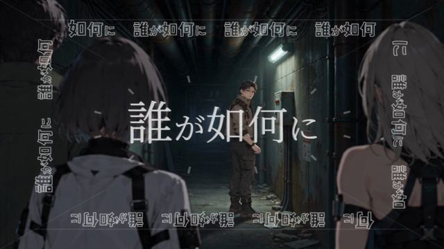</a></td>
<td width="50%" height="225" align="center" valign="middle"></td>
</tr>
<tr>
<td width="50%" valign="top"><strong>RIGHT CAN WAIT: an AI Music-video Excerpt</strong> <a href="https://x.com/SomASonI51">@SomASonI51</a> · Music &amp; lyrics 0:28 · Bookmarks 0 · Details pending <a href="https://guanmo-ai.github.io/awesome-ai-motion/?lang=en#case-2108497504576917621">▶ Play</a> · <a href="https://x.com/SomASonI51/status/2108497504576917621">Original post</a></td>
<td width="50%" valign="top"><strong>Strings, Flutes and Bubbles: Coded Sound</strong> <a href="https://x.com/Rakhsh_Tech">@Rakhsh_Tech</a> · Music &amp; lyrics 0:26 · Bookmarks 0 · Details pending <a href="https://guanmo-ai.github.io/awesome-ai-motion/?lang=en#case-2104144532644544921">▶ Play</a> · <a href="https://x.com/Rakhsh_Tech/status/2104144532644544921">Original post</a></td>
</tr>
</tbody>
<tbody>
<tr>
<td width="50%" height="225" align="center" valign="middle"></td>
<td width="50%" height="225" align="center" valign="middle"><a href="https://guanmo-ai.github.io/awesome-ai-motion/?lang=en#case-2107589792980402609">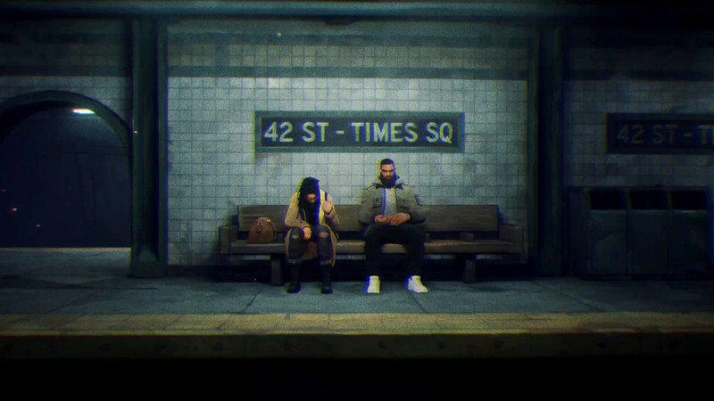</a></td>
</tr>
<tr>
<td width="50%" valign="top"><strong>Word Is Bond: The Merchant of Venice</strong> <a href="https://x.com/DFakkeldy">@DFakkeldy</a> · Music &amp; lyrics 6:30 · Bookmarks 0 · Details pending <a href="https://guanmo-ai.github.io/awesome-ai-motion/?lang=en#case-2106883204762185728">▶ Play</a> · <a href="https://x.com/DFakkeldy/status/2106883204762185728">Original post</a></td>
<td width="50%" valign="top"><strong>LAST TRAIN music film</strong> <a href="https://x.com/JayysLab">@JayysLab</a> · Music &amp; lyrics 0:30 · Bookmarks 0 · Details pending <a href="https://guanmo-ai.github.io/awesome-ai-motion/?lang=en#case-2107589792980402609">▶ Play</a> · <a href="https://x.com/JayysLab/status/2107589792980402609">Original post</a></td>
</tr>
</tbody>
<tbody>
<tr>
<td width="50%" height="225" align="center" valign="middle"></td>
<td width="50%" height="225" align="center" valign="middle"></td>
</tr>
<tr>
<td width="50%" valign="top"><strong>A Single-image Music Video in a Retro TV</strong> <a href="https://x.com/SousakujikkenH">@SousakujikkenH</a> · Music &amp; lyrics 3:37 · Bookmarks 0 · Details pending <a href="https://guanmo-ai.github.io/awesome-ai-motion/?lang=en#case-2107611329137971317">▶ Play</a> · <a href="https://x.com/SousakujikkenH/status/2107611329137971317">Original post</a></td>
<td width="50%" valign="top"><strong>Child's Doodle Becomes a Music Video</strong> <a href="https://x.com/coolbat1999">@coolbat1999</a> · Music &amp; lyrics 3:47 · Bookmarks 0 · Details pending <a href="https://guanmo-ai.github.io/awesome-ai-motion/?lang=en#case-2103127192591065595">▶ Play</a> · <a href="https://x.com/coolbat1999/status/2103127192591065595">Original post</a></td>
</tr>
</tbody>
<tbody>
<tr>
<td width="50%" height="225" align="center" valign="middle"></td>
<td width="50%" height="225" align="center" valign="middle"></td>
</tr>
<tr>
<td width="50%" valign="top"><strong>Ctrl ALT Goodbye: a multi-model music video</strong> <a href="https://x.com/NISSANNS2">@NISSANNS2</a> · Music &amp; lyrics 3:28 · Bookmarks 0 · Details pending <a href="https://guanmo-ai.github.io/awesome-ai-motion/?lang=en#case-2105354745988927980">▶ Play</a> · <a href="https://x.com/NISSANNS2/status/2105354745988927980">Original post</a></td>
<td width="50%" valign="top"><strong>Last Call Magic</strong> <a href="https://x.com/duramirmagus">@duramirmagus</a> · Music &amp; lyrics 4:20 · Bookmarks 0 · Details pending <a href="https://guanmo-ai.github.io/awesome-ai-motion/?lang=en#case-2106472635391529002">▶ Play</a> · <a href="https://x.com/duramirmagus/status/2106472635391529002">Original post</a></td>
</tr>
</tbody>
<tbody>
<tr>
<td width="50%" height="225" align="center" valign="middle"></td>
<td width="50%" height="225" align="center" valign="middle"></td>
</tr>
<tr>
<td width="50%" valign="top"><strong>An animated-band music clip</strong> <a href="https://x.com/Kyle_Coghlan">@Kyle_Coghlan</a> · Music &amp; lyrics 0:22 · Bookmarks 0 · Details pending <a href="https://guanmo-ai.github.io/awesome-ai-motion/?lang=en#case-2106877108693913741">▶ Play</a> · <a href="https://x.com/Kyle_Coghlan/status/2106877108693913741">Original post</a></td>
<td width="50%" valign="top"><strong>Reverie: a code-animated music video</strong> <a href="https://x.com/hikarinosunmin">@hikarinosunmin</a> · Music &amp; lyrics 3:03 · Bookmarks 0 · Details pending <a href="https://guanmo-ai.github.io/awesome-ai-motion/?lang=en#case-2107494910731698494">▶ Play</a> · <a href="https://x.com/hikarinosunmin/status/2107494910731698494">Original post</a></td>
</tr>
</tbody>
<tbody>
<tr>
<td width="50%" height="225" align="center" valign="middle"></td>
<td width="50%" height="225" align="center" valign="middle"></td>
</tr>
<tr>
<td width="50%" valign="top"><strong>A Claude Directed Anime-opening Test</strong> <a href="https://x.com/YosumiNoa">@YosumiNoa</a> · Music &amp; lyrics 1:31 · Bookmarks 0 · Details pending <a href="https://guanmo-ai.github.io/awesome-ai-motion/?lang=en#case-2108164224887492731">▶ Play</a> · <a href="https://x.com/YosumiNoa/status/2108164224887492731">Original post</a></td>
<td width="50%" valign="top"><strong>An Iterative Lyric-motion Experiment</strong> <a href="https://x.com/NEMUNFT">@NEMUNFT</a> · Music &amp; lyrics 0:35 · Bookmarks 0 · Details pending <a href="https://guanmo-ai.github.io/awesome-ai-motion/?lang=en#case-2108505253738058209">▶ Play</a> · <a href="https://x.com/NEMUNFT/status/2108505253738058209">Original post</a></td>
</tr>
</tbody>
<tbody>
<tr>
<td width="50%" height="225" align="center" valign="middle"></td>
<td width="50%" height="225" align="center" valign="middle"></td>
</tr>
<tr>
<td width="50%" valign="top"><strong>A music video in a pixel city</strong> <a href="https://x.com/91_elon">@91_elon</a> · Music &amp; lyrics 0:16 · Bookmarks 0 · Details pending <a href="https://guanmo-ai.github.io/awesome-ai-motion/?lang=en#case-2106039413645996348">▶ Play</a> · <a href="https://x.com/91_elon/status/2106039413645996348">Original post</a></td>
<td width="50%" valign="top"><strong>Just Predicting: a model-assisted music video</strong> <a href="https://x.com/HarbingerDan">@HarbingerDan</a> · Music &amp; lyrics 3:46 · Bookmarks 0 · Details pending <a href="https://guanmo-ai.github.io/awesome-ai-motion/?lang=en#case-2106041581119971749">▶ Play</a> · <a href="https://x.com/HarbingerDan/status/2106041581119971749">Original post</a></td>
</tr>
</tbody>
<tbody>
<tr>
<td width="50%" height="225" align="center" valign="middle"><a href="https://guanmo-ai.github.io/awesome-ai-motion/?lang=en#case-2107651489212854287">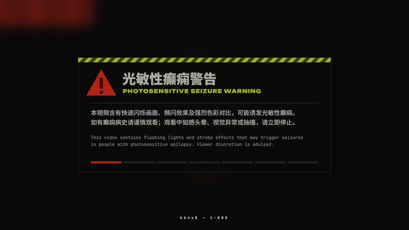</a></td>
<td width="50%" height="225" align="center" valign="middle"></td>
</tr>
<tr>
<td width="50%" valign="top"><strong>1-800: code-driven typography video</strong> <a href="https://x.com/bvch1bc">@bvch1bc</a> · Music &amp; lyrics 0:33 · Bookmarks 0 · Details pending <a href="https://guanmo-ai.github.io/awesome-ai-motion/?lang=en#case-2107651489212854287">▶ Play</a> · <a href="https://x.com/bvch1bc/status/2107651489212854287">Original post</a></td>
<td width="50%" valign="top"><strong>Ji Meng: a Song Video from Li Qingzhao's Verse</strong> <a href="https://x.com/dapenti">@dapenti</a> · Music &amp; lyrics 3:19 · Bookmarks 0 · Details pending <a href="https://guanmo-ai.github.io/awesome-ai-motion/?lang=en#case-2107664736318091292">▶ Play</a> · <a href="https://x.com/dapenti/status/2107664736318091292">Original post</a></td>
</tr>
</tbody>
<tbody>
<tr>
<td width="50%" height="225" align="center" valign="middle"></td>
<td width="50%" height="225" align="center" valign="middle"></td>
</tr>
<tr>
<td width="50%" valign="top"><strong>A Suno Song and Seedance Singing Test</strong> <a href="https://x.com/ayuri_ganba">@ayuri_ganba</a> · Music &amp; lyrics 0:18 · Bookmarks 0 · Details pending <a href="https://guanmo-ai.github.io/awesome-ai-motion/?lang=en#case-2108187050411483352">▶ Play</a> · <a href="https://x.com/ayuri_ganba/status/2108187050411483352">Original post</a></td>
<td width="50%" valign="top"><strong>Leave a Way: a Code-and-assets Music Video</strong> <a href="https://x.com/xX_Mika_Pi_Xx">@xX_Mika_Pi_Xx</a> · Music &amp; lyrics 2:00 · Bookmarks 0 · Details pending <a href="https://guanmo-ai.github.io/awesome-ai-motion/?lang=en#case-2108380175767568882">▶ Play</a> · <a href="https://x.com/xX_Mika_Pi_Xx/status/2108380175767568882">Original post</a></td>
</tr>
</tbody>
<tbody>
<tr>
<td width="50%" height="225" align="center" valign="middle"></td>
<td width="50%" height="225" align="center" valign="middle"></td>
</tr>
<tr>
<td width="50%" valign="top"><strong>A Character-free Trance 3D Music Visual</strong> <a href="https://x.com/cherusi3">@cherusi3</a> · Music &amp; lyrics 2:36 · Bookmarks 0 · Details pending <a href="https://guanmo-ai.github.io/awesome-ai-motion/?lang=en#case-2108388293469688151">▶ Play</a> · <a href="https://x.com/cherusi3/status/2108388293469688151">Original post</a></td>
<td width="50%" valign="top"><strong>A Hand-drawn Dance with Replacement Music</strong> <a href="https://x.com/yudotanaka">@yudotanaka</a> · Music &amp; lyrics 0:15 · Bookmarks 0 · Details pending <a href="https://guanmo-ai.github.io/awesome-ai-motion/?lang=en#case-2108399635178172437">▶ Play</a> · <a href="https://x.com/yudotanaka/status/2108399635178172437">Original post</a></td>
</tr>
</tbody>
<tbody>
<tr>
<td width="50%" height="225" align="center" valign="middle"></td>
<td width="50%"></td>
</tr>
<tr>
<td width="50%" valign="top"><strong>As Fast As Ideas: an AI-themed Pop Video</strong> <a href="https://x.com/jxwalker">@jxwalker</a> · Music &amp; lyrics 2:30 · Bookmarks 0 · Details pending <a href="https://guanmo-ai.github.io/awesome-ai-motion/?lang=en#case-2108438870505541752">▶ Play</a> · <a href="https://x.com/jxwalker/status/2108438870505541752">Original post</a></td>
<td width="50%"></td>
</tr>
</tbody>
</table>
