[← All categories](../README.en.md#browse)

# Education & explainers

158 works. Click a cover to play; works without gallery video open on X.

<table>
<tbody>
<tr>
<td width="50%" height="225" align="center" valign="middle"></td>
<td width="50%" height="225" align="center" valign="middle"><a href="https://guanmo-ai.github.io/awesome-ai-motion/?lang=en#case-2103683057689522564">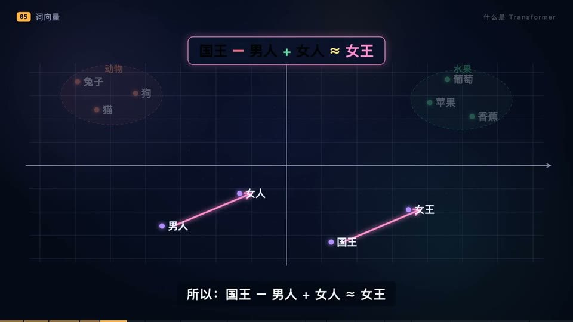</a></td>
</tr>
<tr>
<td width="50%" valign="top"><strong>Five thousand years of Chinese history</strong> <a href="https://x.com/akokoi1">@akokoi1</a> · Education &amp; explainers 2:38 · Bookmarks 762 <a href="https://guanmo-ai.github.io/awesome-ai-motion/?lang=en#case-2102583898865873225">▶ Play</a> · <a href="https://x.com/akokoi1/status/2102583898865873225">Original post</a></td>
<td width="50%" valign="top"><strong>Transformers: from intuition to mathematics</strong> <a href="https://x.com/dotey">@dotey</a> · Education &amp; explainers 12:12 · Bookmarks 1,457 <a href="https://guanmo-ai.github.io/awesome-ai-motion/?lang=en#case-2103683057689522564">▶ Play</a> · <a href="https://x.com/dotey/status/2103683057689522564">Original post</a></td>
</tr>
</tbody>
<tbody>
<tr>
<td width="50%" height="225" align="center" valign="middle"></td>
<td width="50%" height="225" align="center" valign="middle"><a href="https://guanmo-ai.github.io/awesome-ai-motion/?lang=en#case-2102606609574941028">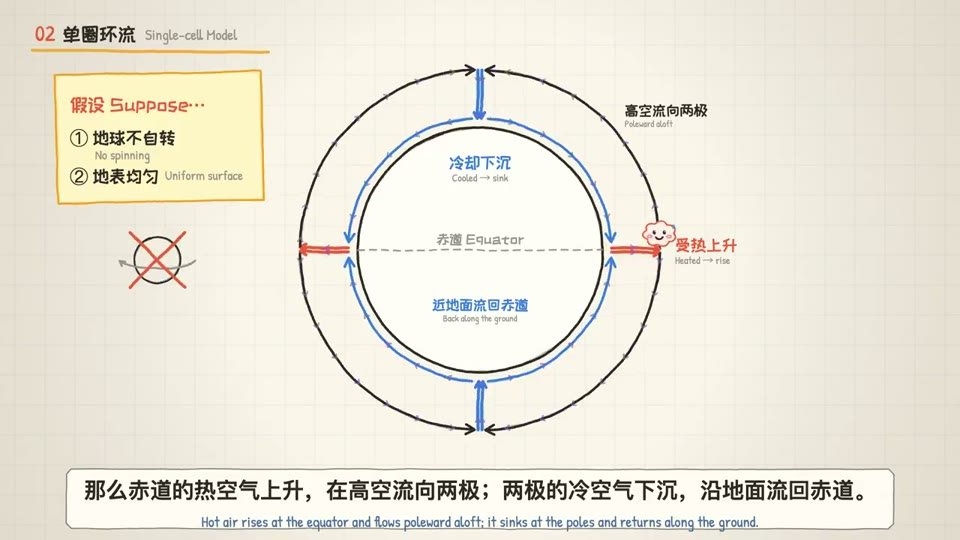</a></td>
</tr>
<tr>
<td width="50%" valign="top"><strong>An animated cocktail recipe</strong> <a href="https://x.com/Ror_Fly">@Ror_Fly</a> · Education &amp; explainers 0:30 · Bookmarks 1,442 <a href="https://guanmo-ai.github.io/awesome-ai-motion/?lang=en#case-2102853258582880547">▶ Play</a> · <a href="https://x.com/Ror_Fly/status/2102853258582880547">Original post</a></td>
<td width="50%" valign="top"><strong>Atmospheric circulation explained</strong> <a href="https://x.com/akokoi1">@akokoi1</a> · Education &amp; explainers 4:48 · Bookmarks 810 <a href="https://guanmo-ai.github.io/awesome-ai-motion/?lang=en#case-2102606609574941028">▶ Play</a> · <a href="https://x.com/akokoi1/status/2102606609574941028">Original post</a></td>
</tr>
</tbody>
<tbody>
<tr>
<td width="50%" height="225" align="center" valign="middle"></td>
<td width="50%" height="225" align="center" valign="middle"></td>
</tr>
<tr>
<td width="50%" valign="top"><strong>Turn a talking-head video into a line-art explainer</strong> <a href="https://x.com/AxtonLiu">@AxtonLiu</a> · Education &amp; explainers 1:24 · Bookmarks 411 <a href="https://guanmo-ai.github.io/awesome-ai-motion/?lang=en#case-2102827887732932956">▶ Play</a> · <a href="https://x.com/AxtonLiu/status/2102827887732932956">Original post</a></td>
<td width="50%" valign="top"><strong>Passwords and Passkeys Explained</strong> <a href="https://x.com/Tz_2022">@Tz_2022</a> · Education &amp; explainers 4:09 · Bookmarks 376 · Details pending <a href="https://guanmo-ai.github.io/awesome-ai-motion/?lang=en#case-2102838830285898214">▶ Play</a> · <a href="https://x.com/Tz_2022/status/2102838830285898214">Original post</a></td>
</tr>
</tbody>
<tbody>
<tr>
<td width="50%" height="225" align="center" valign="middle"></td>
<td width="50%" height="225" align="center" valign="middle"><a href="https://guanmo-ai.github.io/awesome-ai-motion/?lang=en#case-2106958663525314769">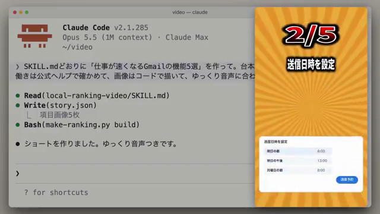</a></td>
</tr>
<tr>
<td width="50%" valign="top"><strong>Manim Lesson on Derivatives</strong> <a href="https://x.com/LinearUncle">@LinearUncle</a> · Education &amp; explainers 7:37 · Bookmarks 360 · Details pending <a href="https://guanmo-ai.github.io/awesome-ai-motion/?lang=en#case-2103128559174971663">▶ Play</a> · <a href="https://x.com/LinearUncle/status/2103128559174971663">Original post</a></td>
<td width="50%" valign="top"><strong>A short video about five Gmail features</strong> <a href="https://x.com/ClaudeCode_UT">@ClaudeCode_UT</a> · Education &amp; explainers 0:32 · Bookmarks 186 · Details pending <a href="https://guanmo-ai.github.io/awesome-ai-motion/?lang=en#case-2106958663525314769">▶ Play</a> · <a href="https://x.com/ClaudeCode_UT/status/2106958663525314769">Original post</a></td>
</tr>
</tbody>
<tbody>
<tr>
<td width="50%" height="225" align="center" valign="middle"></td>
<td width="50%" height="225" align="center" valign="middle"><a href="https://guanmo-ai.github.io/awesome-ai-motion/?lang=en#case-2102695622042411419">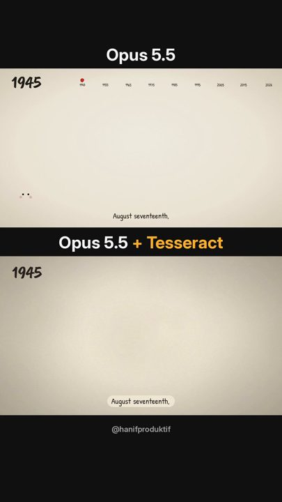</a></td>
</tr>
<tr>
<td width="50%" valign="top"><strong>Introduction to GitHub Version Control</strong> <a href="https://x.com/sundyme">@sundyme</a> · Education &amp; explainers 3:46 · Bookmarks 140 · Details pending <a href="https://guanmo-ai.github.io/awesome-ai-motion/?lang=en#case-2102751132502446549">▶ Play</a> · <a href="https://x.com/sundyme/status/2102751132502446549">Original post</a></td>
<td width="50%" valign="top"><strong>Eighty-One Years of Indonesian History</strong> <a href="https://x.com/hanifproduktif">@hanifproduktif</a> · Education &amp; explainers 0:59 · Bookmarks 120 · Details pending <a href="https://guanmo-ai.github.io/awesome-ai-motion/?lang=en#case-2102695622042411419">▶ Play</a> · <a href="https://x.com/hanifproduktif/status/2102695622042411419">Original post</a></td>
</tr>
</tbody>
<tbody>
<tr>
<td width="50%" height="225" align="center" valign="middle"></td>
<td width="50%" height="225" align="center" valign="middle"></td>
</tr>
<tr>
<td width="50%" valign="top"><strong>81 years of Indonesian history</strong> <a href="https://x.com/sonnylazuardi">@sonnylazuardi</a> · Education &amp; explainers 0:53 · Bookmarks 102 <a href="https://guanmo-ai.github.io/awesome-ai-motion/?lang=en#case-2103511590884815282">▶ Play</a> · <a href="https://x.com/sonnylazuardi/status/2103511590884815282">Original post</a></td>
<td width="50%" valign="top"><strong>Option Formula Beside a Runner Game</strong> <a href="https://x.com/goodside">@goodside</a> · Education &amp; explainers 1:00 · Bookmarks 45 · Details pending <a href="https://guanmo-ai.github.io/awesome-ai-motion/?lang=en#case-2103171088637419631">▶ Play</a> · <a href="https://x.com/goodside/status/2103171088637419631">Original post</a></td>
</tr>
</tbody>
<tbody>
<tr>
<td width="50%" height="225" align="center" valign="middle"><a href="https://guanmo-ai.github.io/awesome-ai-motion/?lang=en#case-2102731669853573582">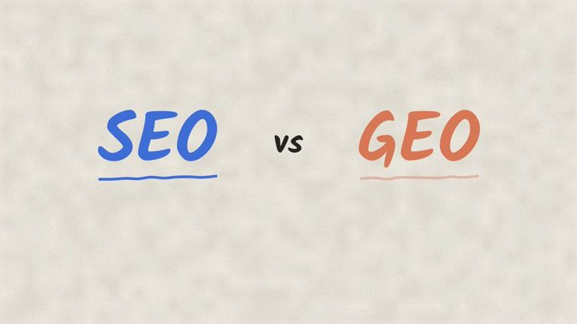</a></td>
<td width="50%" height="225" align="center" valign="middle"><a href="https://guanmo-ai.github.io/awesome-ai-motion/?lang=en#case-2103801351993975279">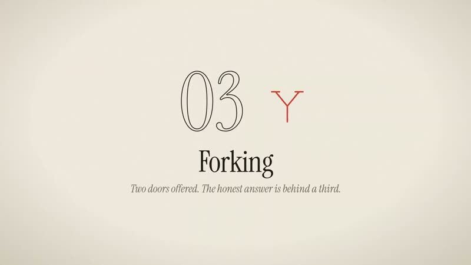</a></td>
</tr>
<tr>
<td width="50%" valign="top"><strong>SEO and GEO in Animation</strong> <a href="https://x.com/oscarmartin">@oscarmartin</a> · Education &amp; explainers 0:33 · Bookmarks 22 · Details pending <a href="https://guanmo-ai.github.io/awesome-ai-motion/?lang=en#case-2102731669853573582">▶ Play</a> · <a href="https://x.com/oscarmartin/status/2102731669853573582">Original post</a></td>
<td width="50%" valign="top"><strong>Turning an article into a tutorial from a phone</strong> <a href="https://x.com/henkvaness">@henkvaness</a> · Education &amp; explainers 5:37 · Bookmarks 9 <a href="https://guanmo-ai.github.io/awesome-ai-motion/?lang=en#case-2103801351993975279">▶ Play</a> · <a href="https://x.com/henkvaness/status/2103801351993975279">Original post</a></td>
</tr>
</tbody>
<tbody>
<tr>
<td width="50%" height="225" align="center" valign="middle"><a href="https://guanmo-ai.github.io/awesome-ai-motion/?lang=en#case-2103845689713111079">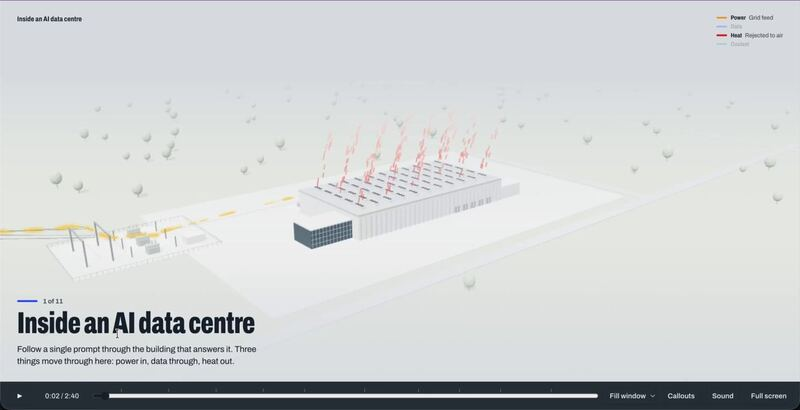</a></td>
<td width="50%" height="225" align="center" valign="middle"></td>
</tr>
<tr>
<td width="50%" valign="top"><strong>A 3D journey from the grid into an AI data center</strong> <a href="https://x.com/mdaman010">@mdaman010</a> · Education &amp; explainers 1:38 · Bookmarks 5 <a href="https://guanmo-ai.github.io/awesome-ai-motion/?lang=en#case-2103845689713111079">▶ Play</a> · <a href="https://x.com/mdaman010/status/2103845689713111079">Original post</a></td>
<td width="50%" valign="top"><strong>A first two-character explainer experiment</strong> <a href="https://x.com/Naonekozamurai">@Naonekozamurai</a> · Education &amp; explainers 0:27 · Bookmarks 2 · Details pending <a href="https://guanmo-ai.github.io/awesome-ai-motion/?lang=en#case-2107584181941502428">▶ Play</a> · <a href="https://x.com/Naonekozamurai/status/2107584181941502428">Original post</a></td>
</tr>
</tbody>
<tbody>
<tr>
<td width="50%" height="225" align="center" valign="middle"></td>
<td width="50%" height="225" align="center" valign="middle"></td>
</tr>
<tr>
<td width="50%" valign="top"><strong>Git explained for beginners</strong> <a href="https://x.com/Yunn260414">@Yunn260414</a> · Education &amp; explainers 6:48 · Bookmarks 2 <a href="https://guanmo-ai.github.io/awesome-ai-motion/?lang=en#case-2104044910769016888">▶ Play</a> · <a href="https://x.com/Yunn260414/status/2104044910769016888">Original post</a></td>
<td width="50%" valign="top"><strong>Motion Graphic of a Cocktail Recipe</strong> <a href="https://x.com/Sarut0biSasuke">@Sarut0biSasuke</a> · Education &amp; explainers 0:30 · Bookmarks 1 · Details pending <a href="https://guanmo-ai.github.io/awesome-ai-motion/?lang=en#case-2103418429248069973">▶ Play</a> · <a href="https://x.com/Sarut0biSasuke/status/2103418429248069973">Original post</a></td>
</tr>
</tbody>
<tbody>
<tr>
<td width="50%" height="225" align="center" valign="middle"><a href="https://guanmo-ai.github.io/awesome-ai-motion/?lang=en#case-2107653001959833860">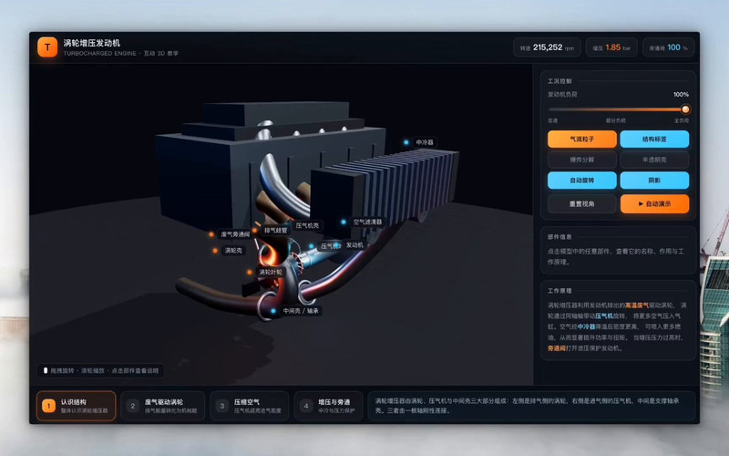</a></td>
<td width="50%" height="225" align="center" valign="middle"><a href="https://guanmo-ai.github.io/awesome-ai-motion/?lang=en#case-2105033204319277506">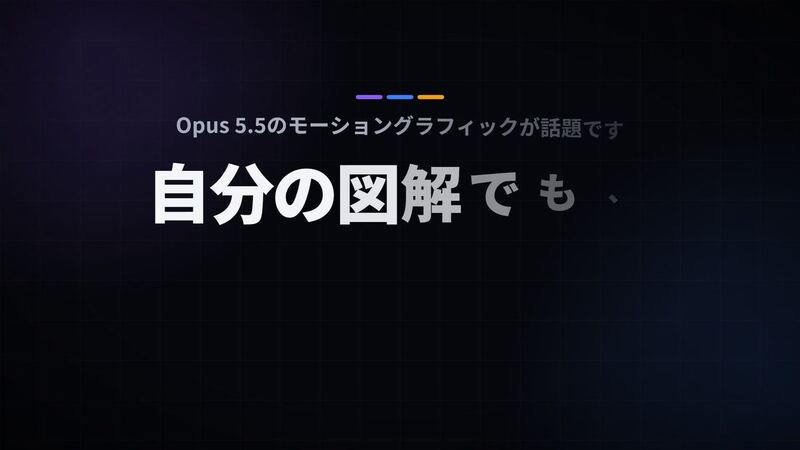</a></td>
</tr>
<tr>
<td width="50%" valign="top"><strong>Interactive turbocharger lesson</strong> <a href="https://x.com/yyyole">@yyyole</a> · Education &amp; explainers 0:45 · Bookmarks 1 · Details pending <a href="https://guanmo-ai.github.io/awesome-ai-motion/?lang=en#case-2107653001959833860">▶ Play</a> · <a href="https://x.com/yyyole/status/2107653001959833860">Original post</a></td>
<td width="50%" valign="top"><strong>An article intro: template reuse and text checks</strong> <a href="https://x.com/FalconG_J">@FalconG_J</a> · Education &amp; explainers 0:30 · Bookmarks 0 <a href="https://guanmo-ai.github.io/awesome-ai-motion/?lang=en#case-2105033204319277506">▶ Play</a> · <a href="https://x.com/FalconG_J/status/2105033204319277506">Original post</a></td>
</tr>
</tbody>
<tbody>
<tr>
<td width="50%" height="225" align="center" valign="middle"></td>
<td width="50%" height="225" align="center" valign="middle"></td>
</tr>
<tr>
<td width="50%" valign="top"><strong>Long-Form Passkey Explainer</strong> <a href="https://x.com/imShiWen">@imShiWen</a> · Education &amp; explainers 6:15 · Bookmarks 0 · Details pending <a href="https://guanmo-ai.github.io/awesome-ai-motion/?lang=en#case-2102954743442399395">▶ Play</a> · <a href="https://x.com/imShiWen/status/2102954743442399395">Original post</a></td>
<td width="50%" valign="top"><strong>Learning Linjiangxian through animation</strong> <a href="https://x.com/7998l201">@7998l201</a> · Education &amp; explainers 3:45 · Bookmarks 0 · Details pending <a href="https://guanmo-ai.github.io/awesome-ai-motion/?lang=en#case-2107443821630107654">▶ Play</a> · <a href="https://x.com/7998l201/status/2107443821630107654">Original post</a></td>
</tr>
</tbody>
<tbody>
<tr>
<td width="50%" height="225" align="center" valign="middle"></td>
<td width="50%" height="225" align="center" valign="middle"></td>
</tr>
<tr>
<td width="50%" valign="top"><strong>An interactive camera lens lab</strong> <a href="https://x.com/RyanSael">@RyanSael</a> · Education &amp; explainers 0:32 · Bookmarks 9,188 <a href="https://guanmo-ai.github.io/awesome-ai-motion/?lang=en#case-2102591147927654847">▶ Play</a> · <a href="https://x.com/RyanSael/status/2102591147927654847">Original post</a></td>
<td width="50%" valign="top"><strong>Eight minute research paper explainer</strong> <a href="https://x.com/deedydas">@deedydas</a> · Education &amp; explainers 8:39 · Bookmarks 5,419 · Details pending <a href="https://guanmo-ai.github.io/awesome-ai-motion/?lang=en#case-2103141339651350646">▶ Play</a> · <a href="https://x.com/deedydas/status/2103141339651350646">Original post</a></td>
</tr>
</tbody>
<tbody>
<tr>
<td width="50%" height="225" align="center" valign="middle"></td>
<td width="50%" height="225" align="center" valign="middle"></td>
</tr>
<tr>
<td width="50%" valign="top"><strong>An Explorable Raptor 3 Rocket Engine</strong> <a href="https://x.com/konstantinsaifo">@konstantinsaifo</a> · Education &amp; explainers 0:35 · Bookmarks 4,758 · Details pending <a href="https://guanmo-ai.github.io/awesome-ai-motion/?lang=en#case-2104094723887501736">▶ Play</a> · <a href="https://x.com/konstantinsaifo/status/2104094723887501736">Original post</a></td>
<td width="50%" valign="top"><strong>Pixel Art Neural Network Training</strong> <a href="https://x.com/DotCSV">@DotCSV</a> · Education &amp; explainers 0:56 · Bookmarks 3,196 · Details pending <a href="https://guanmo-ai.github.io/awesome-ai-motion/?lang=en#case-2102737776219168939">▶ Play</a> · <a href="https://x.com/DotCSV/status/2102737776219168939">Original post</a></td>
</tr>
</tbody>
<tbody>
<tr>
<td width="50%" height="225" align="center" valign="middle"></td>
<td width="50%" height="225" align="center" valign="middle"></td>
</tr>
<tr>
<td width="50%" valign="top"><strong>A documentary about superintelligence</strong> <a href="https://x.com/gavinpurcell">@gavinpurcell</a> · Education &amp; explainers 5:15 · Bookmarks 3,120 <a href="https://guanmo-ai.github.io/awesome-ai-motion/?lang=en#case-2103304514329854102">▶ Play</a> · <a href="https://x.com/gavinpurcell/status/2103304514329854102">Original post</a></td>
<td width="50%" valign="top"><strong>How to Do Great Work video</strong> <a href="https://x.com/deedydas">@deedydas</a> · Education &amp; explainers 3:15 · Bookmarks 2,879 · Details pending <a href="https://guanmo-ai.github.io/awesome-ai-motion/?lang=en#case-2104151743907160546">▶ Play</a> · <a href="https://x.com/deedydas/status/2104151743907160546">Original post</a></td>
</tr>
</tbody>
<tbody>
<tr>
<td width="50%" height="225" align="center" valign="middle"><a href="https://guanmo-ai.github.io/awesome-ai-motion/?lang=en#case-2104206095313215591">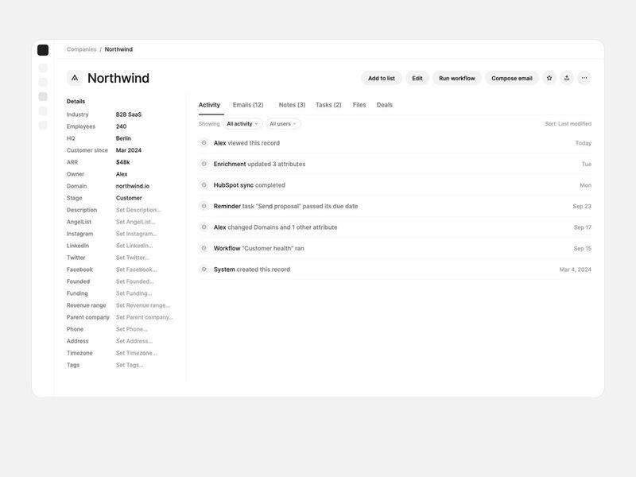</a></td>
<td width="50%" height="225" align="center" valign="middle"></td>
</tr>
<tr>
<td width="50%" valign="top"><strong>Explaining UX Decisions Through Animation</strong> <a href="https://x.com/moguzbulbul">@moguzbulbul</a> · Education &amp; explainers 0:42 · Bookmarks 2,728 · Details pending <a href="https://guanmo-ai.github.io/awesome-ai-motion/?lang=en#case-2104206095313215591">▶ Play</a> · <a href="https://x.com/moguzbulbul/status/2104206095313215591">Original post</a></td>
<td width="50%" valign="top"><strong>How a Browser Works in Forty Seconds</strong> <a href="https://x.com/addyosmani">@addyosmani</a> · Education &amp; explainers 0:40 · Bookmarks 1,744 · Details pending <a href="https://guanmo-ai.github.io/awesome-ai-motion/?lang=en#case-2103009037164110327">▶ Play</a> · <a href="https://x.com/addyosmani/status/2103009037164110327">Original post</a></td>
</tr>
</tbody>
<tbody>
<tr>
<td width="50%" height="225" align="center" valign="middle"><a href="https://guanmo-ai.github.io/awesome-ai-motion/?lang=en#case-2102844654169575547">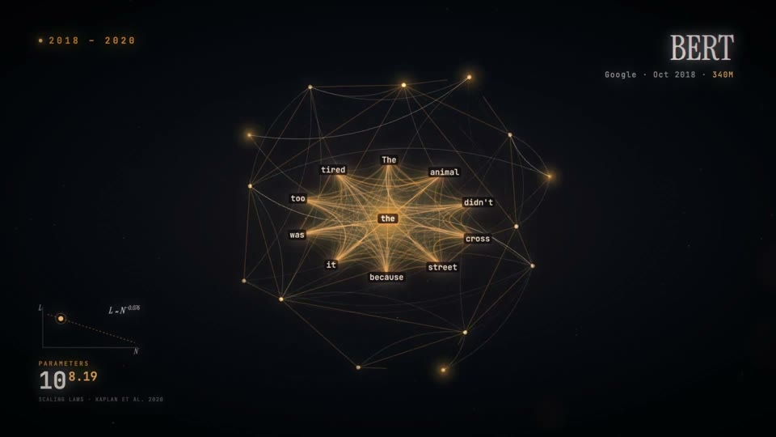</a></td>
<td width="50%" height="225" align="center" valign="middle"><a href="https://guanmo-ai.github.io/awesome-ai-motion/?lang=en#case-2106411941497389342">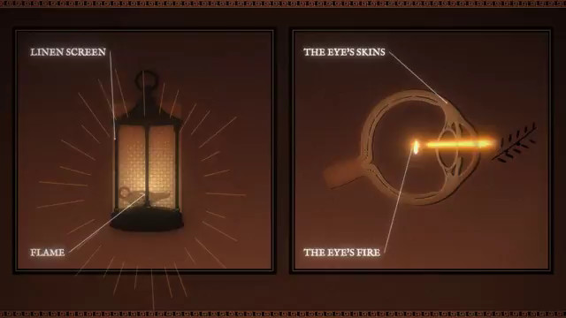</a></td>
</tr>
<tr>
<td width="50%" valign="top"><strong>Three minutes from Attention to AGI</strong> <a href="https://x.com/kimmonismus">@kimmonismus</a> · Education &amp; explainers 3:00 · Bookmarks 1,590 <a href="https://guanmo-ai.github.io/awesome-ai-motion/?lang=en#case-2102844654169575547">▶ Play</a> · <a href="https://x.com/kimmonismus/status/2102844654169575547">Original post</a></td>
<td width="50%" valign="top"><strong>The History of Light: an approximately 36-minute explainer</strong> <a href="https://x.com/LLMJunky">@LLMJunky</a> · Education &amp; explainers 35:37 · Bookmarks 1,470 · Details pending <a href="https://guanmo-ai.github.io/awesome-ai-motion/?lang=en#case-2106411941497389342">▶ Play</a> · <a href="https://x.com/LLMJunky/status/2106411941497389342">Original post</a></td>
</tr>
</tbody>
<tbody>
<tr>
<td width="50%" height="225" align="center" valign="middle"></td>
<td width="50%" height="225" align="center" valign="middle"><a href="https://guanmo-ai.github.io/awesome-ai-motion/?lang=en#case-2102463796149440888">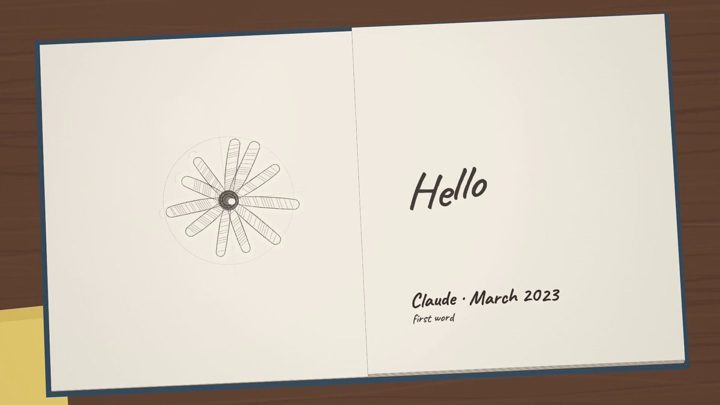</a></td>
</tr>
<tr>
<td width="50%" valign="top"><strong>Two minute Google history video</strong> <a href="https://x.com/deedydas">@deedydas</a> · Education &amp; explainers 2:00 · Bookmarks 1,012 · Details pending <a href="https://guanmo-ai.github.io/awesome-ai-motion/?lang=en#case-2103965547780345859">▶ Play</a> · <a href="https://x.com/deedydas/status/2103965547780345859">Original post</a></td>
<td width="50%" valign="top"><strong>Timeline of Claude Model Development</strong> <a href="https://x.com/superalesha">@superalesha</a> · Education &amp; explainers 1:28 · Bookmarks 939 · Details pending <a href="https://guanmo-ai.github.io/awesome-ai-motion/?lang=en#case-2102463796149440888">▶ Play</a> · <a href="https://x.com/superalesha/status/2102463796149440888">Original post</a></td>
</tr>
</tbody>
<tbody>
<tr>
<td width="50%" height="225" align="center" valign="middle"></td>
<td width="50%" height="225" align="center" valign="middle"><a href="https://guanmo-ai.github.io/awesome-ai-motion/?lang=en#case-2106829942206173497">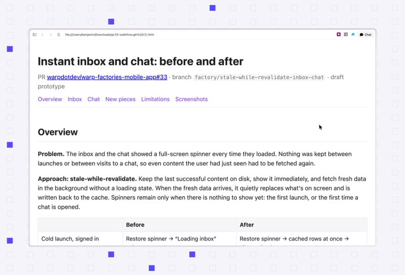</a></td>
</tr>
<tr>
<td width="50%" valign="top"><strong>Superintelligence risk animation</strong> <a href="https://x.com/AndrewOnXYZ">@AndrewOnXYZ</a> · Education &amp; explainers 5:16 · Bookmarks 893 · Details pending <a href="https://guanmo-ai.github.io/awesome-ai-motion/?lang=en#case-2103865359988125706">▶ Play</a> · <a href="https://x.com/AndrewOnXYZ/status/2103865359988125706">Original post</a></td>
<td width="50%" valign="top"><strong>Explaining a caching PR with HTML</strong> <a href="https://x.com/BHolmesDev">@BHolmesDev</a> · Education &amp; explainers 0:19 · Bookmarks 798 · Details pending <a href="https://guanmo-ai.github.io/awesome-ai-motion/?lang=en#case-2106829942206173497">▶ Play</a> · <a href="https://x.com/BHolmesDev/status/2106829942206173497">Original post</a></td>
</tr>
</tbody>
<tbody>
<tr>
<td width="50%" height="225" align="center" valign="middle"></td>
<td width="50%" height="225" align="center" valign="middle"></td>
</tr>
<tr>
<td width="50%" valign="top"><strong>IKEA Manual Becomes a 3D Tutorial</strong> <a href="https://x.com/deedydas">@deedydas</a> · Education &amp; explainers 1:42 · Bookmarks 596 · Details pending <a href="https://guanmo-ai.github.io/awesome-ai-motion/?lang=en#case-2103174501345493197">▶ Play</a> · <a href="https://x.com/deedydas/status/2103174501345493197">Original post</a></td>
<td width="50%" valign="top"><strong>Twin paradox paper cutout animation</strong> <a href="https://x.com/masahirochaen">@masahirochaen</a> · Education &amp; explainers 0:47 · Bookmarks 577 · Details pending <a href="https://guanmo-ai.github.io/awesome-ai-motion/?lang=en#case-2102722719502704941">▶ Play</a> · <a href="https://x.com/masahirochaen/status/2102722719502704941">Original post</a></td>
</tr>
</tbody>
<tbody>
<tr>
<td width="50%" height="225" align="center" valign="middle"></td>
<td width="50%" height="225" align="center" valign="middle"><a href="https://guanmo-ai.github.io/awesome-ai-motion/?lang=en#case-2106313749846249487">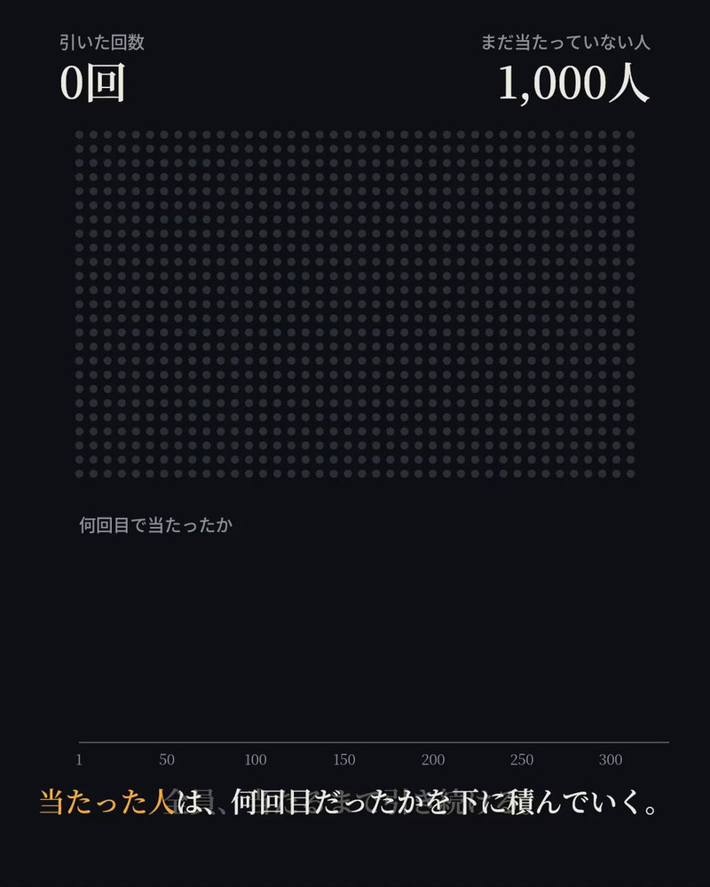</a></td>
</tr>
<tr>
<td width="50%" valign="top"><strong>Code-Drawn History of AI</strong> <a href="https://x.com/bridgemindai">@bridgemindai</a> · Education &amp; explainers 1:00 · Bookmarks 499 · Details pending <a href="https://guanmo-ai.github.io/awesome-ai-motion/?lang=en#case-2103530750767206626">▶ Play</a> · <a href="https://x.com/bridgemindai/status/2103530750767206626">Original post</a></td>
<td width="50%" valign="top"><strong>Repeated trials at one-percent probability</strong> <a href="https://x.com/Lattice_Node">@Lattice_Node</a> · Education &amp; explainers 0:42 · Bookmarks 387 · Details pending <a href="https://guanmo-ai.github.io/awesome-ai-motion/?lang=en#case-2106313749846249487">▶ Play</a> · <a href="https://x.com/Lattice_Node/status/2106313749846249487">Original post</a></td>
</tr>
</tbody>
<tbody>
<tr>
<td width="50%" height="225" align="center" valign="middle"><a href="https://guanmo-ai.github.io/awesome-ai-motion/?lang=en#case-2103997975173439834">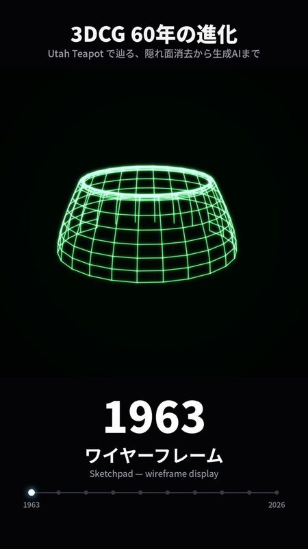</a></td>
<td width="50%" height="225" align="center" valign="middle"></td>
</tr>
<tr>
<td width="50%" valign="top"><strong>A 15-Second History of 3D Graphics</strong> <a href="https://x.com/jmitani">@jmitani</a> · Education &amp; explainers 0:15 · Bookmarks 356 · Details pending <a href="https://guanmo-ai.github.io/awesome-ai-motion/?lang=en#case-2103997975173439834">▶ Play</a> · <a href="https://x.com/jmitani/status/2103997975173439834">Original post</a></td>
<td width="50%" valign="top"><strong>A proton collision inside the LHC</strong> <a href="https://x.com/superalesha">@superalesha</a> · Education &amp; explainers 0:34 · Bookmarks 300 <a href="https://guanmo-ai.github.io/awesome-ai-motion/?lang=en#case-2102779758408774104">▶ Play</a> · <a href="https://x.com/superalesha/status/2102779758408774104">Original post</a></td>
</tr>
</tbody>
<tbody>
<tr>
<td width="50%" height="225" align="center" valign="middle"></td>
<td width="50%" height="225" align="center" valign="middle"></td>
</tr>
<tr>
<td width="50%" valign="top"><strong>Code-Drawn Life of Steve Jobs</strong> <a href="https://x.com/oozn">@oozn</a> · Education &amp; explainers 1:59 · Bookmarks 254 · Details pending <a href="https://guanmo-ai.github.io/awesome-ai-motion/?lang=en#case-2103482545111232946">▶ Play</a> · <a href="https://x.com/oozn/status/2103482545111232946">Original post</a></td>
<td width="50%" valign="top"><strong>Six-Minute Code-Drawn Lesson</strong> <a href="https://x.com/0x0funky">@0x0funky</a> · Education &amp; explainers 6:34 · Bookmarks 248 · Details pending <a href="https://guanmo-ai.github.io/awesome-ai-motion/?lang=en#case-2102736587708854585">▶ Play</a> · <a href="https://x.com/0x0funky/status/2102736587708854585">Original post</a></td>
</tr>
</tbody>
<tbody>
<tr>
<td width="50%" height="225" align="center" valign="middle"><a href="https://guanmo-ai.github.io/awesome-ai-motion/?lang=en#case-2107408409859359211">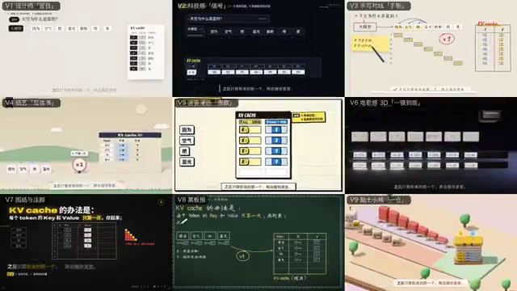</a></td>
<td width="50%" height="225" align="center" valign="middle"><a href="https://guanmo-ai.github.io/awesome-ai-motion/?lang=en#case-2107018546194882678">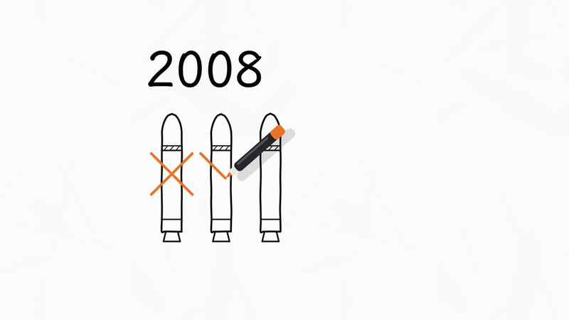</a></td>
</tr>
<tr>
<td width="50%" valign="top"><strong>Nine styles for explaining KV Cache</strong> <a href="https://x.com/LufzzLiz">@LufzzLiz</a> · Education &amp; explainers 0:45 · Bookmarks 246 · Details pending <a href="https://guanmo-ai.github.io/awesome-ai-motion/?lang=en#case-2107408409859359211">▶ Play</a> · <a href="https://x.com/LufzzLiz/status/2107408409859359211">Original post</a></td>
<td width="50%" valign="top"><strong>Huashu: a whiteboard explainer sample</strong> <a href="https://x.com/AlchainHust">@AlchainHust</a> · Education &amp; explainers 2:10 · Bookmarks 227 · Details pending <a href="https://guanmo-ai.github.io/awesome-ai-motion/?lang=en#case-2107018546194882678">▶ Play</a> · <a href="https://x.com/AlchainHust/status/2107018546194882678">Original post</a></td>
</tr>
</tbody>
<tbody>
<tr>
<td width="50%" height="225" align="center" valign="middle"></td>
<td width="50%" height="225" align="center" valign="middle"><a href="https://guanmo-ai.github.io/awesome-ai-motion/?lang=en#case-2102805376466891137">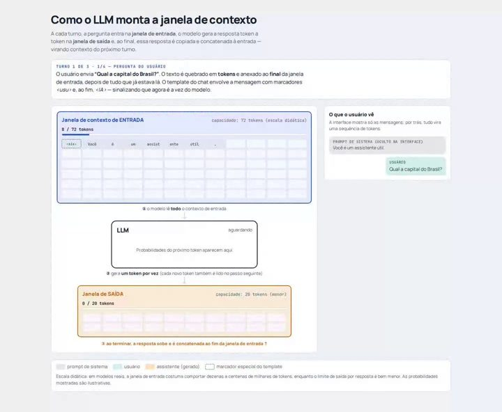</a></td>
</tr>
<tr>
<td width="50%" valign="top"><strong>Physics contest problem explainer</strong> <a href="https://x.com/akokoi1">@akokoi1</a> · Education &amp; explainers 3:09 · Bookmarks 201 · Details pending <a href="https://guanmo-ai.github.io/awesome-ai-motion/?lang=en#case-2102680453912449223">▶ Play</a> · <a href="https://x.com/akokoi1/status/2102680453912449223">Original post</a></td>
<td width="50%" valign="top"><strong>Animated Explanation of Context Windows</strong> <a href="https://x.com/joaoli13">@joaoli13</a> · Education &amp; explainers 1:41 · Bookmarks 179 · Details pending <a href="https://guanmo-ai.github.io/awesome-ai-motion/?lang=en#case-2102805376466891137">▶ Play</a> · <a href="https://x.com/joaoli13/status/2102805376466891137">Original post</a></td>
</tr>
</tbody>
<tbody>
<tr>
<td width="50%" height="225" align="center" valign="middle"><a href="https://guanmo-ai.github.io/awesome-ai-motion/?lang=en#case-2105983802367688910">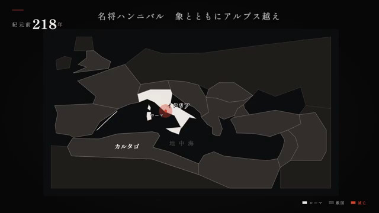</a></td>
<td width="50%" height="225" align="center" valign="middle"><a href="https://guanmo-ai.github.io/awesome-ai-motion/?lang=en#case-2106955771183272343">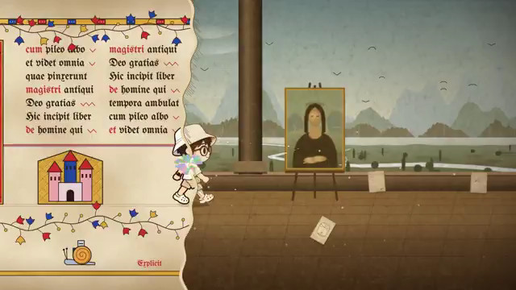</a></td>
</tr>
<tr>
<td width="50%" valign="top"><strong>A map documentary about the Roman Empire</strong> <a href="https://x.com/tkz_aiart">@tkz_aiart</a> · Education &amp; explainers 2:16 · Bookmarks 172 · Details pending <a href="https://guanmo-ai.github.io/awesome-ai-motion/?lang=en#case-2105983802367688910">▶ Play</a> · <a href="https://x.com/tkz_aiart/status/2105983802367688910">Original post</a></td>
<td width="50%" valign="top"><strong>Huashu: an art-history-style animation</strong> <a href="https://x.com/AlchainHust">@AlchainHust</a> · Education &amp; explainers 2:08 · Bookmarks 162 · Details pending <a href="https://guanmo-ai.github.io/awesome-ai-motion/?lang=en#case-2106955771183272343">▶ Play</a> · <a href="https://x.com/AlchainHust/status/2106955771183272343">Original post</a></td>
</tr>
</tbody>
<tbody>
<tr>
<td width="50%" height="225" align="center" valign="middle"></td>
<td width="50%" height="225" align="center" valign="middle"></td>
</tr>
<tr>
<td width="50%" valign="top"><strong>A code-animated history of immunology</strong> <a href="https://x.com/DeryaTR_">@DeryaTR_</a> · Education &amp; explainers 2:00 · Bookmarks 135 · Details pending <a href="https://guanmo-ai.github.io/awesome-ai-motion/?lang=en#case-2106567073149190228">▶ Play</a> · <a href="https://x.com/DeryaTR_/status/2106567073149190228">Original post</a></td>
<td width="50%" valign="top"><strong>Podcast Audio Becomes Short Video</strong> <a href="https://x.com/Fujin_Metaverse">@Fujin_Metaverse</a> · Education &amp; explainers 0:53 · Bookmarks 125 · Details pending <a href="https://guanmo-ai.github.io/awesome-ai-motion/?lang=en#case-2102897123037761640">▶ Play</a> · <a href="https://x.com/Fujin_Metaverse/status/2102897123037761640">Original post</a></td>
</tr>
</tbody>
<tbody>
<tr>
<td width="50%" height="225" align="center" valign="middle"><a href="https://guanmo-ai.github.io/awesome-ai-motion/?lang=en#case-2104717572788883829">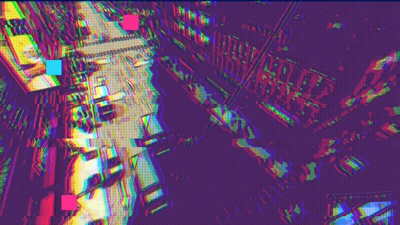</a></td>
<td width="50%" height="225" align="center" valign="middle"><a href="https://guanmo-ai.github.io/awesome-ai-motion/?lang=en#case-2107175794145386838">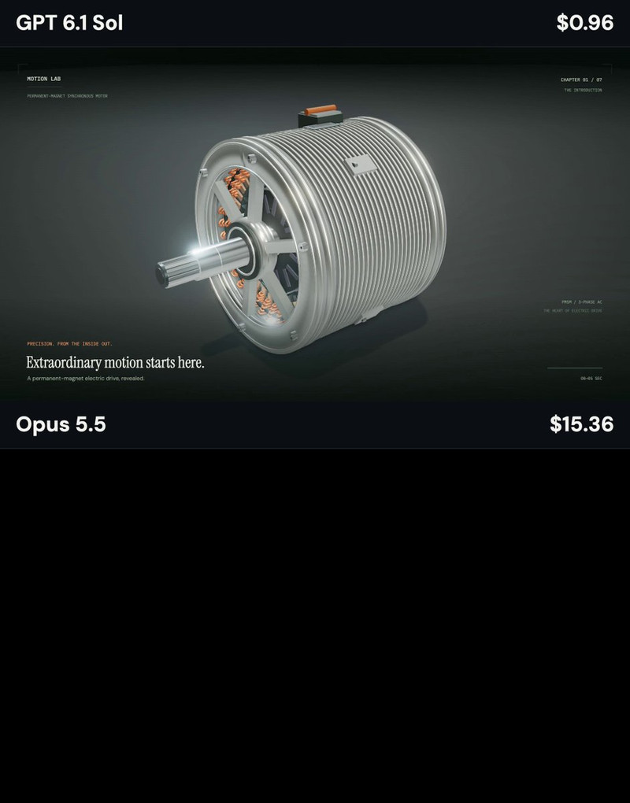</a></td>
</tr>
<tr>
<td width="50%" valign="top"><strong>Explaining the Spiderbench Workflow</strong> <a href="https://x.com/xikhar">@xikhar</a> · Education &amp; explainers 2:13 · Bookmarks 117 · Details pending <a href="https://guanmo-ai.github.io/awesome-ai-motion/?lang=en#case-2104717572788883829">▶ Play</a> · <a href="https://x.com/xikhar/status/2104717572788883829">Original post</a></td>
<td width="50%" valign="top"><strong>A 3D electric-motor comparison</strong> <a href="https://x.com/rubenssoto_ai">@rubenssoto_ai</a> · Education &amp; explainers 0:40 · Bookmarks 115 · Details pending <a href="https://guanmo-ai.github.io/awesome-ai-motion/?lang=en#case-2107175794145386838">▶ Play</a> · <a href="https://x.com/rubenssoto_ai/status/2107175794145386838">Original post</a></td>
</tr>
</tbody>
<tbody>
<tr>
<td width="50%" height="225" align="center" valign="middle"><a href="https://guanmo-ai.github.io/awesome-ai-motion/?lang=en#case-2106378121557782950">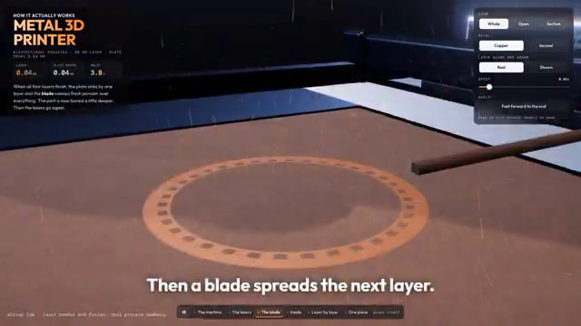</a></td>
<td width="50%" height="225" align="center" valign="middle"></td>
</tr>
<tr>
<td width="50%" valign="top"><strong>Metal 3D printing a rocket engine</strong> <a href="https://x.com/konstantinsaifo">@konstantinsaifo</a> · Education &amp; explainers 0:56 · Bookmarks 76 · Details pending <a href="https://guanmo-ai.github.io/awesome-ai-motion/?lang=en#case-2106378121557782950">▶ Play</a> · <a href="https://x.com/konstantinsaifo/status/2106378121557782950">Original post</a></td>
<td width="50%" valign="top"><strong>3D cell teaching video</strong> <a href="https://x.com/akokoi1">@akokoi1</a> · Education &amp; explainers 3:50 · Bookmarks 72 · Details pending <a href="https://guanmo-ai.github.io/awesome-ai-motion/?lang=en#case-2104105016235860050">▶ Play</a> · <a href="https://x.com/akokoi1/status/2104105016235860050">Original post</a></td>
</tr>
</tbody>
<tbody>
<tr>
<td width="50%" height="225" align="center" valign="middle"></td>
<td width="50%" height="225" align="center" valign="middle"></td>
</tr>
<tr>
<td width="50%" valign="top"><strong>Salmon Marketing History in a Showa Styled Short</strong> <a href="https://x.com/HanZhang415188">@HanZhang415188</a> · Education &amp; explainers 3:47 · Bookmarks 52 · Details pending <a href="https://guanmo-ai.github.io/awesome-ai-motion/?lang=en#case-2107717293136560309">▶ Play</a> · <a href="https://x.com/HanZhang415188/status/2107717293136560309">Original post</a></td>
<td width="50%" valign="top"><strong>A motion explainer on similar-looking brand logos</strong> <a href="https://x.com/charliejhills">@charliejhills</a> · Education &amp; explainers 0:57 · Bookmarks 48 · Details pending <a href="https://guanmo-ai.github.io/awesome-ai-motion/?lang=en#case-2105580875299836388">▶ Play</a> · <a href="https://x.com/charliejhills/status/2105580875299836388">Original post</a></td>
</tr>
</tbody>
<tbody>
<tr>
<td width="50%" height="225" align="center" valign="middle"></td>
<td width="50%" height="225" align="center" valign="middle"><a href="https://guanmo-ai.github.io/awesome-ai-motion/?lang=en#case-2106568339917324296">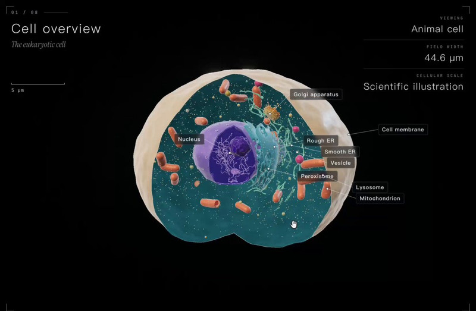</a></td>
</tr>
<tr>
<td width="50%" valign="top"><strong>3D Reenactment of Dan-no-ura</strong> <a href="https://x.com/tetumemo">@tetumemo</a> · Education &amp; explainers 1:14 · Bookmarks 47 · Details pending <a href="https://guanmo-ai.github.io/awesome-ai-motion/?lang=en#case-2102652072252584046">▶ Play</a> · <a href="https://x.com/tetumemo/status/2102652072252584046">Original post</a></td>
<td width="50%" valign="top"><strong>A Three.js biological-cell teaching demonstration</strong> <a href="https://x.com/akokoi1">@akokoi1</a> · Education &amp; explainers 0:37 · Bookmarks 45 · Details pending <a href="https://guanmo-ai.github.io/awesome-ai-motion/?lang=en#case-2106568339917324296">▶ Play</a> · <a href="https://x.com/akokoi1/status/2106568339917324296">Original post</a></td>
</tr>
</tbody>
<tbody>
<tr>
<td width="50%" height="225" align="center" valign="middle"></td>
<td width="50%" height="225" align="center" valign="middle"></td>
</tr>
<tr>
<td width="50%" valign="top"><strong>An Animated Explainer for a Hidden Valence Paper</strong> <a href="https://x.com/camhberg">@camhberg</a> · Education &amp; explainers 2:20 · Bookmarks 41 · Details pending <a href="https://guanmo-ai.github.io/awesome-ai-motion/?lang=en#case-2108313983505842650">▶ Play</a> · <a href="https://x.com/camhberg/status/2108313983505842650">Original post</a></td>
<td width="50%" valign="top"><strong>Hand-Drawn Technology Explainer</strong> <a href="https://x.com/so_ainsight">@so_ainsight</a> · Education &amp; explainers 0:15 · Bookmarks 38 · Details pending <a href="https://guanmo-ai.github.io/awesome-ai-motion/?lang=en#case-2103117547776163845">▶ Play</a> · <a href="https://x.com/so_ainsight/status/2103117547776163845">Original post</a></td>
</tr>
</tbody>
<tbody>
<tr>
<td width="50%" height="225" align="center" valign="middle"></td>
<td width="50%" height="225" align="center" valign="middle"><a href="https://guanmo-ai.github.io/awesome-ai-motion/?lang=en#case-2107815114745487588">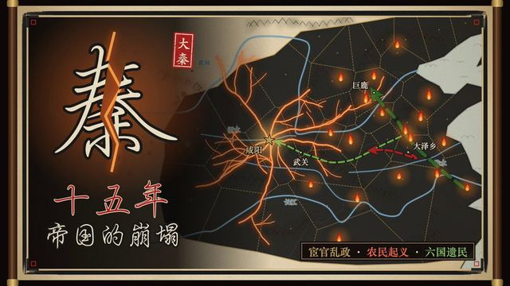</a></td>
</tr>
<tr>
<td width="50%" valign="top"><strong>Editing a talking head with explanatory animation</strong> <a href="https://x.com/cheery9998">@cheery9998</a> · Education &amp; explainers 4:29 · Bookmarks 30 · Details pending <a href="https://guanmo-ai.github.io/awesome-ai-motion/?lang=en#case-2107284687039467575">▶ Play</a> · <a href="https://x.com/cheery9998/status/2107284687039467575">Original post</a></td>
<td width="50%" valign="top"><strong>A Historical Explainer about the Qin Empire</strong> <a href="https://x.com/aiRobertDaily">@aiRobertDaily</a> · Education &amp; explainers 1:13 · Bookmarks 29 · Details pending <a href="https://guanmo-ai.github.io/awesome-ai-motion/?lang=en#case-2107815114745487588">▶ Play</a> · <a href="https://x.com/aiRobertDaily/status/2107815114745487588">Original post</a></td>
</tr>
</tbody>
<tbody>
<tr>
<td width="50%" height="225" align="center" valign="middle"></td>
<td width="50%" height="225" align="center" valign="middle"></td>
</tr>
<tr>
<td width="50%" valign="top"><strong>A visual-podcast concept animation</strong> <a href="https://x.com/theviclaw">@theviclaw</a> · Education &amp; explainers 0:16 · Bookmarks 23 <a href="https://guanmo-ai.github.io/awesome-ai-motion/?lang=en#case-2103896101120356793">▶ Play</a> · <a href="https://x.com/theviclaw/status/2103896101120356793">Original post</a></td>
<td width="50%" valign="top"><strong>Why Can't We Exceed Light Speed: an Agent Explainer Test</strong> <a href="https://x.com/MrLarus">@MrLarus</a> · Education &amp; explainers 1:18 · Bookmarks 22 · Details pending <a href="https://guanmo-ai.github.io/awesome-ai-motion/?lang=en#case-2108120392179089496">▶ Play</a> · <a href="https://x.com/MrLarus/status/2108120392179089496">Original post</a></td>
</tr>
</tbody>
<tbody>
<tr>
<td width="50%" height="225" align="center" valign="middle"><a href="https://guanmo-ai.github.io/awesome-ai-motion/?lang=en#case-2104352888793477147">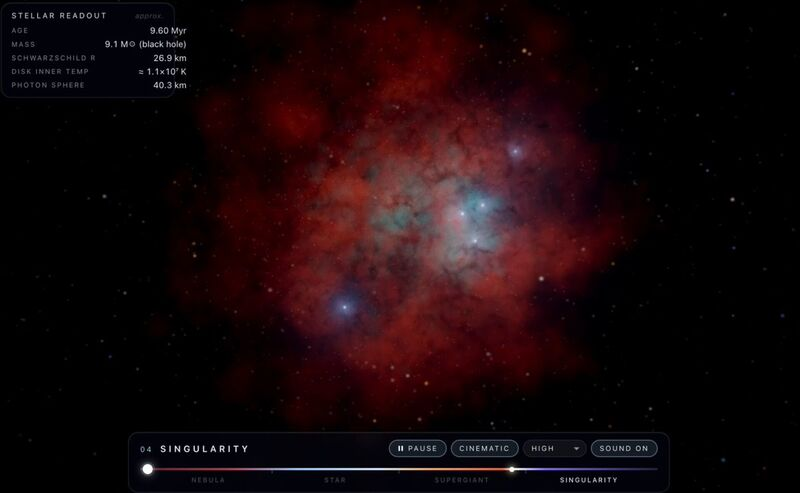</a></td>
<td width="50%" height="225" align="center" valign="middle"><a href="https://guanmo-ai.github.io/awesome-ai-motion/?lang=en#case-2104070024575242622">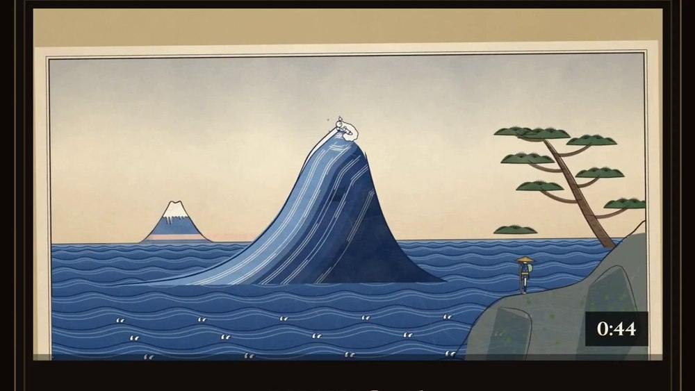</a></td>
</tr>
<tr>
<td width="50%" valign="top"><strong>Singularity: A Star’s Life in 30 Seconds</strong> <a href="https://x.com/techartist_">@techartist_</a> · Education &amp; explainers 0:30 · Bookmarks 16 · Details pending <a href="https://guanmo-ai.github.io/awesome-ai-motion/?lang=en#case-2104352888793477147">▶ Play</a> · <a href="https://x.com/techartist_/status/2104352888793477147">Original post</a></td>
<td width="50%" valign="top"><strong>Lemo-Opuscar: A Whiteboard-Style Creation Tutorial</strong> <a href="https://x.com/lemomo_ai">@lemomo_ai</a> · Education &amp; explainers 1:11 · Bookmarks 16 · Details pending <a href="https://guanmo-ai.github.io/awesome-ai-motion/?lang=en#case-2104070024575242622">▶ Play</a> · <a href="https://x.com/lemomo_ai/status/2104070024575242622">Original post</a></td>
</tr>
</tbody>
<tbody>
<tr>
<td width="50%" height="225" align="center" valign="middle"><a href="https://guanmo-ai.github.io/awesome-ai-motion/?lang=en#case-2107514903879688390">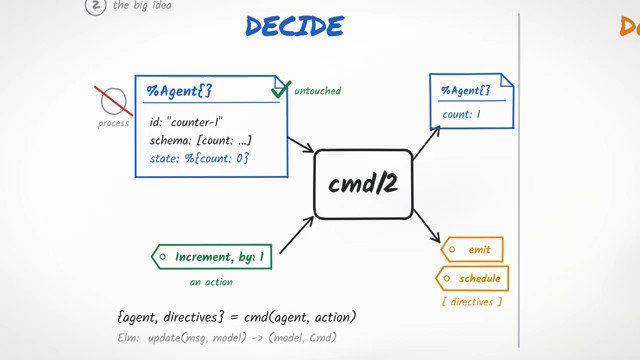</a></td>
<td width="50%" height="225" align="center" valign="middle"><a href="https://guanmo-ai.github.io/awesome-ai-motion/?lang=en#case-2107571783729557855">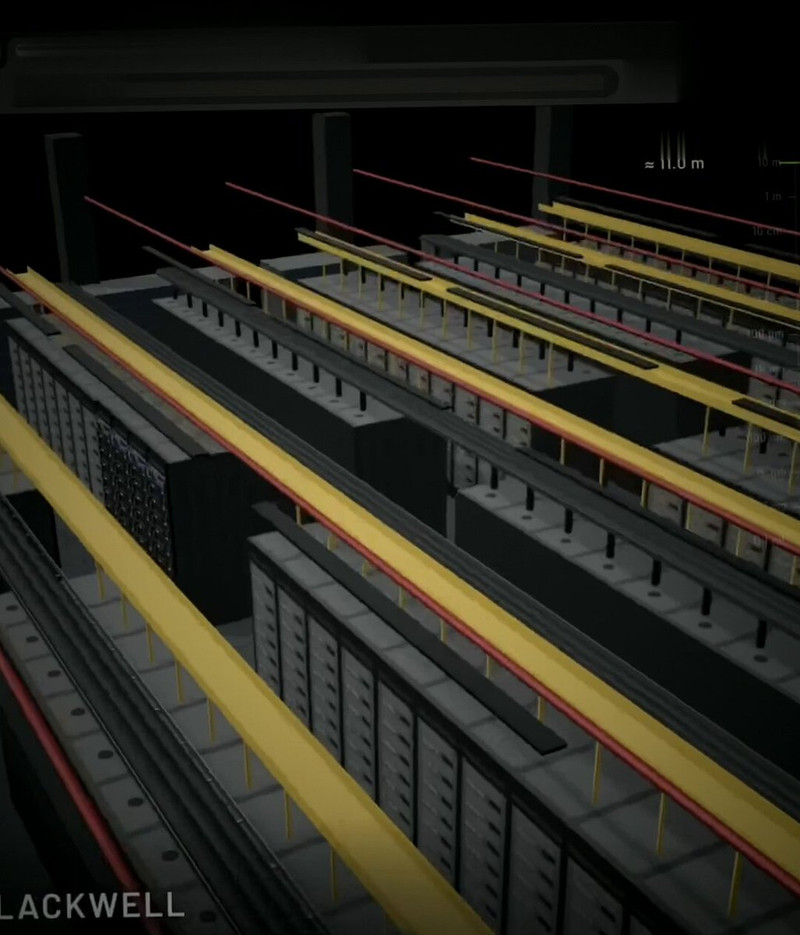</a></td>
</tr>
<tr>
<td width="50%" valign="top"><strong>Explaining how Jido fits a project</strong> <a href="https://x.com/h14hdotcom">@h14hdotcom</a> · Education &amp; explainers 7:26 · Bookmarks 14 · Details pending <a href="https://guanmo-ai.github.io/awesome-ai-motion/?lang=en#case-2107514903879688390">▶ Play</a> · <a href="https://x.com/h14hdotcom/status/2107514903879688390">Original post</a></td>
<td width="50%" valign="top"><strong>From data center to GPU chip</strong> <a href="https://x.com/motyka_9">@motyka_9</a> · Education &amp; explainers 0:49 · Bookmarks 11 · Details pending <a href="https://guanmo-ai.github.io/awesome-ai-motion/?lang=en#case-2107571783729557855">▶ Play</a> · <a href="https://x.com/motyka_9/status/2107571783729557855">Original post</a></td>
</tr>
</tbody>
<tbody>
<tr>
<td width="50%" height="225" align="center" valign="middle"><a href="https://guanmo-ai.github.io/awesome-ai-motion/?lang=en#case-2107600930762031447">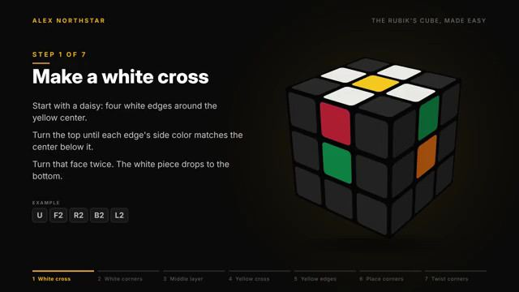</a></td>
<td width="50%" height="225" align="center" valign="middle"><a href="https://guanmo-ai.github.io/awesome-ai-motion/?lang=en#case-2107473998212927525">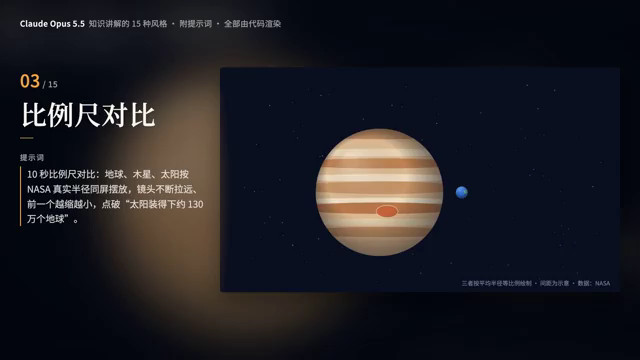</a></td>
</tr>
<tr>
<td width="50%" valign="top"><strong>An Animated Rubik's Cube Tutorial</strong> <a href="https://x.com/NorthstarBrain">@NorthstarBrain</a> · Education &amp; explainers 2:47 · Bookmarks 11 · Details pending <a href="https://guanmo-ai.github.io/awesome-ai-motion/?lang=en#case-2107600930762031447">▶ Play</a> · <a href="https://x.com/NorthstarBrain/status/2107600930762031447">Original post</a></td>
<td width="50%" valign="top"><strong>Fifteen styles for animated explainers</strong> <a href="https://x.com/agentchengfeng">@agentchengfeng</a> · Education &amp; explainers 2:51 · Bookmarks 9 · Details pending <a href="https://guanmo-ai.github.io/awesome-ai-motion/?lang=en#case-2107473998212927525">▶ Play</a> · <a href="https://x.com/agentchengfeng/status/2107473998212927525">Original post</a></td>
</tr>
</tbody>
<tbody>
<tr>
<td width="50%" height="225" align="center" valign="middle"><a href="https://guanmo-ai.github.io/awesome-ai-motion/?lang=en#case-2108029927161541111">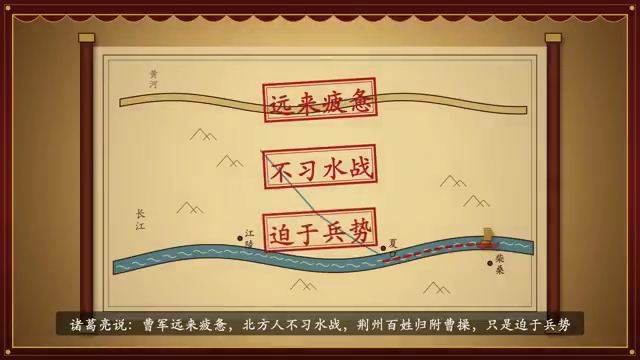</a></td>
<td width="50%" height="225" align="center" valign="middle"></td>
</tr>
<tr>
<td width="50%" valign="top"><strong>Historical Animation Styles in YouMind</strong> <a href="https://x.com/KengGuangLong">@KengGuangLong</a> · Education &amp; explainers 4:57 · Bookmarks 9 · Details pending <a href="https://guanmo-ai.github.io/awesome-ai-motion/?lang=en#case-2108029927161541111">▶ Play</a> · <a href="https://x.com/KengGuangLong/status/2108029927161541111">Original post</a></td>
<td width="50%" valign="top"><strong>Mechanical keyboards: 3D and switch-recording beats</strong> <a href="https://x.com/iniyanai">@iniyanai</a> · Education &amp; explainers 0:35 · Bookmarks 8 <a href="https://guanmo-ai.github.io/awesome-ai-motion/?lang=en#case-2103814603100856596">▶ Play</a> · <a href="https://x.com/iniyanai/status/2103814603100856596">Original post</a></td>
</tr>
</tbody>
<tbody>
<tr>
<td width="50%" height="225" align="center" valign="middle"></td>
<td width="50%" height="225" align="center" valign="middle"><a href="https://guanmo-ai.github.io/awesome-ai-motion/?lang=en#case-2108485332757074286">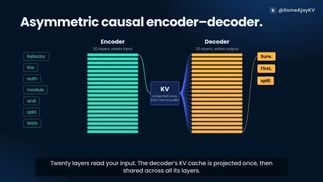</a></td>
</tr>
<tr>
<td width="50%" valign="top"><strong>Variational Autoencoders Explained with Math</strong> <a href="https://x.com/ng169onX">@ng169onX</a> · Education &amp; explainers 5:34 · Bookmarks 8 · Details pending <a href="https://guanmo-ai.github.io/awesome-ai-motion/?lang=en#case-2103183904563998809">▶ Play</a> · <a href="https://x.com/ng169onX/status/2103183904563998809">Original post</a></td>
<td width="50%" valign="top"><strong>A Code-made DeepSeek Architecture Explainer</strong> <a href="https://x.com/ItsmeAjayKV">@ItsmeAjayKV</a> · Education &amp; explainers 2:07 · Bookmarks 7 · Details pending <a href="https://guanmo-ai.github.io/awesome-ai-motion/?lang=en#case-2108485332757074286">▶ Play</a> · <a href="https://x.com/ItsmeAjayKV/status/2108485332757074286">Original post</a></td>
</tr>
</tbody>
<tbody>
<tr>
<td width="50%" height="225" align="center" valign="middle"></td>
<td width="50%" height="225" align="center" valign="middle"></td>
</tr>
<tr>
<td width="50%" valign="top"><strong>An Animated Explainer about SHRINCS Signatures</strong> <a href="https://x.com/NavRoudsari">@NavRoudsari</a> · Education &amp; explainers 4:21 · Bookmarks 7 · Details pending <a href="https://guanmo-ai.github.io/awesome-ai-motion/?lang=en#case-2108304898198581689">▶ Play</a> · <a href="https://x.com/NavRoudsari/status/2108304898198581689">Original post</a></td>
<td width="50%" valign="top"><strong>A video explainer for a CLIProxyAPI article</strong> <a href="https://x.com/0xlangeai">@0xlangeai</a> · Education &amp; explainers 0:57 · Bookmarks 7 <a href="https://guanmo-ai.github.io/awesome-ai-motion/?lang=en#case-2106391068367597929">▶ Play</a> · <a href="https://x.com/0xlangeai/status/2106391068367597929">Original post</a></td>
</tr>
</tbody>
<tbody>
<tr>
<td width="50%" height="225" align="center" valign="middle"><a href="https://guanmo-ai.github.io/awesome-ai-motion/?lang=en#case-2107629480714076484">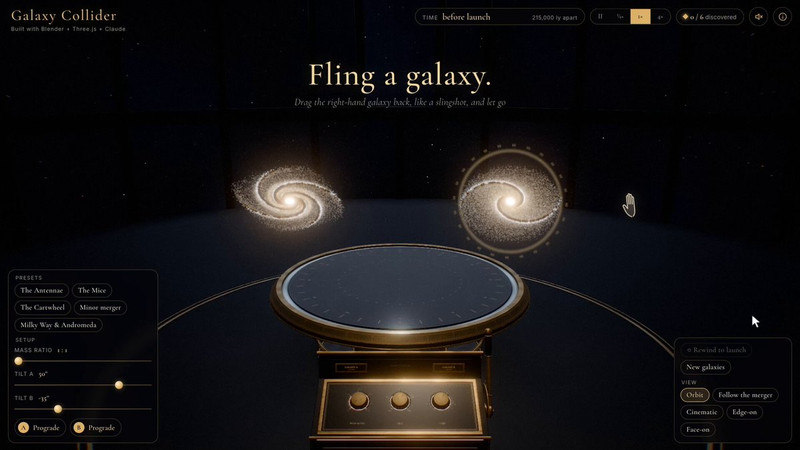</a></td>
<td width="50%" height="225" align="center" valign="middle"><a href="https://guanmo-ai.github.io/awesome-ai-motion/?lang=en#case-2108517711970234631">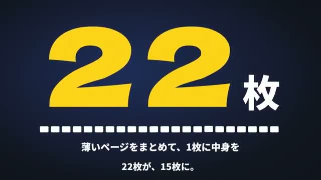</a></td>
</tr>
<tr>
<td width="50%" valign="top"><strong>Particle visualization of colliding galaxies</strong> <a href="https://x.com/techartist_">@techartist_</a> · Education &amp; explainers 0:29 · Bookmarks 6 · Details pending <a href="https://guanmo-ai.github.io/awesome-ai-motion/?lang=en#case-2107629480714076484">▶ Play</a> · <a href="https://x.com/techartist_/status/2107629480714076484">Original post</a></td>
<td width="50%" valign="top"><strong>A Newsletter Intro with Sonnet and VOICEVOX</strong> <a href="https://x.com/tetumemo">@tetumemo</a> · Education &amp; explainers 0:32 · Bookmarks 6 · Details pending <a href="https://guanmo-ai.github.io/awesome-ai-motion/?lang=en#case-2108517711970234631">▶ Play</a> · <a href="https://x.com/tetumemo/status/2108517711970234631">Original post</a></td>
</tr>
</tbody>
<tbody>
<tr>
<td width="50%" height="225" align="center" valign="middle"><a href="https://guanmo-ai.github.io/awesome-ai-motion/?lang=en#case-2102605736002150408">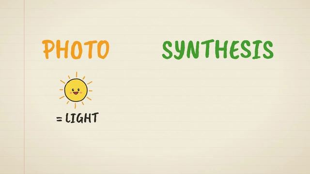</a></td>
<td width="50%" height="225" align="center" valign="middle"></td>
</tr>
<tr>
<td width="50%" valign="top"><strong>Animated Photosynthesis Lesson</strong> <a href="https://x.com/rainwishyt">@rainwishyt</a> · Education &amp; explainers 1:42 · Bookmarks 5 · Details pending <a href="https://guanmo-ai.github.io/awesome-ai-motion/?lang=en#case-2102605736002150408">▶ Play</a> · <a href="https://x.com/rainwishyt/status/2102605736002150408">Original post</a></td>
<td width="50%" valign="top"><strong>Two minute World War II explainer</strong> <a href="https://x.com/Miguel07Code">@Miguel07Code</a> · Education &amp; explainers 1:55 · Bookmarks 4 · Details pending <a href="https://guanmo-ai.github.io/awesome-ai-motion/?lang=en#case-2104247692503204330">▶ Play</a> · <a href="https://x.com/Miguel07Code/status/2104247692503204330">Original post</a></td>
</tr>
</tbody>
<tbody>
<tr>
<td width="50%" height="225" align="center" valign="middle"><a href="https://guanmo-ai.github.io/awesome-ai-motion/?lang=en#case-2103833991879053577">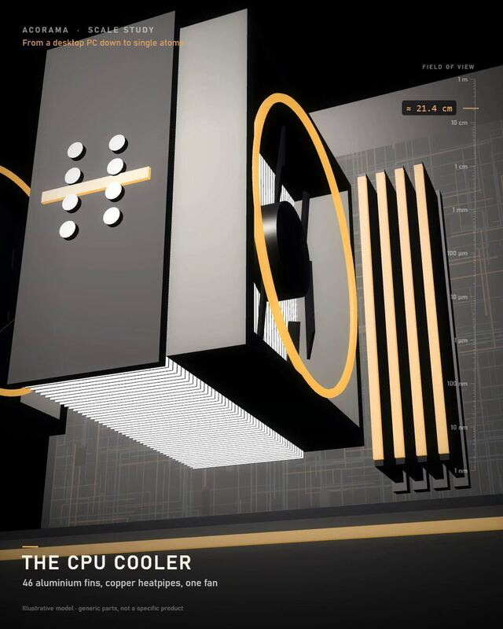</a></td>
<td width="50%" height="225" align="center" valign="middle"></td>
</tr>
<tr>
<td width="50%" valign="top"><strong>A continuous shot from a desk into the CPU and an atom</strong> <a href="https://x.com/Acoramaa">@Acoramaa</a> · Education &amp; explainers 0:44 · Bookmarks 4 <a href="https://guanmo-ai.github.io/awesome-ai-motion/?lang=en#case-2103833991879053577">▶ Play</a> · <a href="https://x.com/Acoramaa/status/2103833991879053577">Original post</a></td>
<td width="50%" valign="top"><strong>Word-by-word Pop-up Captions</strong> <a href="https://x.com/29meat_ai">@29meat_ai</a> · Education &amp; explainers 0:15 · Bookmarks 4 · Details pending <a href="https://guanmo-ai.github.io/awesome-ai-motion/?lang=en#case-2108506286207930467">▶ Play</a> · <a href="https://x.com/29meat_ai/status/2108506286207930467">Original post</a></td>
</tr>
</tbody>
<tbody>
<tr>
<td width="50%" height="225" align="center" valign="middle"><a href="https://guanmo-ai.github.io/awesome-ai-motion/?lang=en#case-2105346401878356252">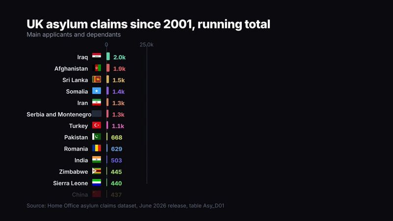</a></td>
<td width="50%" height="225" align="center" valign="middle"><a href="https://guanmo-ai.github.io/awesome-ai-motion/?lang=en#case-2104212841657962937">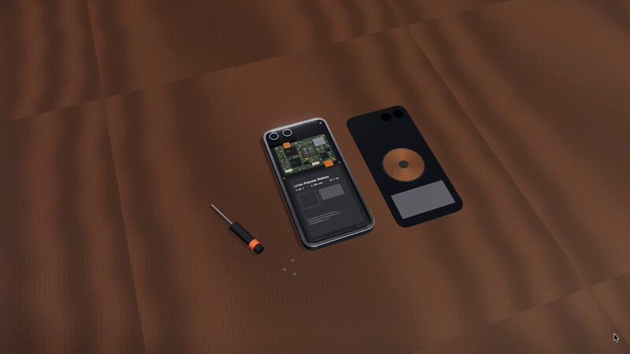</a></td>
</tr>
<tr>
<td width="50%" valign="top"><strong>An animated bar chart of UK asylum claims</strong> <a href="https://x.com/AylmerTH">@AylmerTH</a> · Education &amp; explainers 0:50 · Bookmarks 3 · Details pending <a href="https://guanmo-ai.github.io/awesome-ai-motion/?lang=en#case-2105346401878356252">▶ Play</a> · <a href="https://x.com/AylmerTH/status/2105346401878356252">Original post</a></td>
<td width="50%" valign="top"><strong>From Smartphone Glass to the Atomic Scale</strong> <a href="https://x.com/irinatoxi">@irinatoxi</a> · Education &amp; explainers 0:22 · Bookmarks 3 · Details pending <a href="https://guanmo-ai.github.io/awesome-ai-motion/?lang=en#case-2104212841657962937">▶ Play</a> · <a href="https://x.com/irinatoxi/status/2104212841657962937">Original post</a></td>
</tr>
</tbody>
<tbody>
<tr>
<td width="50%" height="225" align="center" valign="middle"></td>
<td width="50%" height="225" align="center" valign="middle"></td>
</tr>
<tr>
<td width="50%" valign="top"><strong>An image-led action-film workflow</strong> <a href="https://x.com/TanLuAI">@TanLuAI</a> · Education &amp; explainers 2:44 · Bookmarks 3 · Details pending <a href="https://guanmo-ai.github.io/awesome-ai-motion/?lang=en#case-2107485265715712508">▶ Play</a> · <a href="https://x.com/TanLuAI/status/2107485265715712508">Original post</a></td>
<td width="50%" valign="top"><strong>An Explainer about Car Braking</strong> <a href="https://x.com/ZeroZ_JQ">@ZeroZ_JQ</a> · Education &amp; explainers 6:25 · Bookmarks 3 · Details pending <a href="https://guanmo-ai.github.io/awesome-ai-motion/?lang=en#case-2108167157393838191">▶ Play</a> · <a href="https://x.com/ZeroZ_JQ/status/2108167157393838191">Original post</a></td>
</tr>
</tbody>
<tbody>
<tr>
<td width="50%" height="225" align="center" valign="middle"></td>
<td width="50%" height="225" align="center" valign="middle"></td>
</tr>
<tr>
<td width="50%" valign="top"><strong>An Education Talk with Motion-information Cards</strong> <a href="https://x.com/XinWEN2001">@XinWEN2001</a> · Education &amp; explainers 1:19 · Bookmarks 2 · Details pending <a href="https://guanmo-ai.github.io/awesome-ai-motion/?lang=en#case-2108093967783080220">▶ Play</a> · <a href="https://x.com/XinWEN2001/status/2108093967783080220">Original post</a></td>
<td width="50%" valign="top"><strong>Pup’s Quantum Fetch Story</strong> <a href="https://x.com/rgk_degen">@rgk_degen</a> · Education &amp; explainers 0:25 · Bookmarks 2 · Details pending <a href="https://guanmo-ai.github.io/awesome-ai-motion/?lang=en#case-2108926559264379318">▶ Play</a> · <a href="https://x.com/rgk_degen/status/2108926559264379318">Original post</a></td>
</tr>
</tbody>
<tbody>
<tr>
<td width="50%" height="225" align="center" valign="middle"><a href="https://guanmo-ai.github.io/awesome-ai-motion/?lang=en#case-2107505590151020548">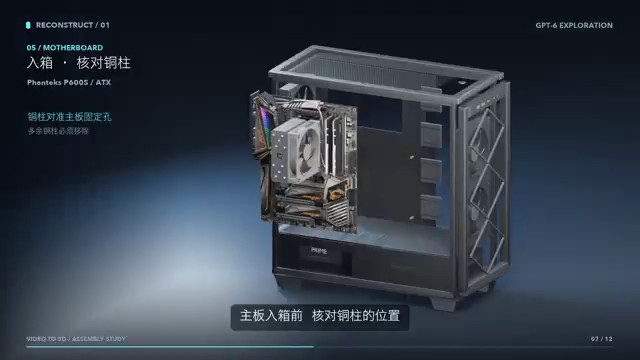</a></td>
<td width="50%" height="225" align="center" valign="middle"><a href="https://guanmo-ai.github.io/awesome-ai-motion/?lang=en#case-2103904436141842605">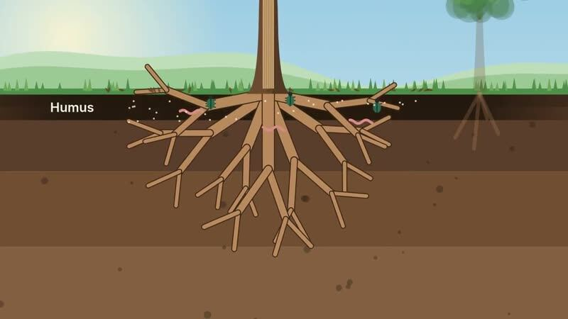</a></td>
</tr>
<tr>
<td width="50%" valign="top"><strong>A PC assembly explainer based on hardware references</strong> <a href="https://x.com/baoweiheihei">@baoweiheihei</a> · Education &amp; explainers 1:42 · Bookmarks 2 · Details pending <a href="https://guanmo-ai.github.io/awesome-ai-motion/?lang=en#case-2107505590151020548">▶ Play</a> · <a href="https://x.com/baoweiheihei/status/2107505590151020548">Original post</a></td>
<td width="50%" valign="top"><strong>A narrated animation of a tree as an ecosystem</strong> <a href="https://x.com/hunzai">@hunzai</a> · Education &amp; explainers 0:32 · Bookmarks 2 <a href="https://guanmo-ai.github.io/awesome-ai-motion/?lang=en#case-2103904436141842605">▶ Play</a> · <a href="https://x.com/hunzai/status/2103904436141842605">Original post</a></td>
</tr>
</tbody>
<tbody>
<tr>
<td width="50%" height="225" align="center" valign="middle"><a href="https://guanmo-ai.github.io/awesome-ai-motion/?lang=en#case-2107667480034562167">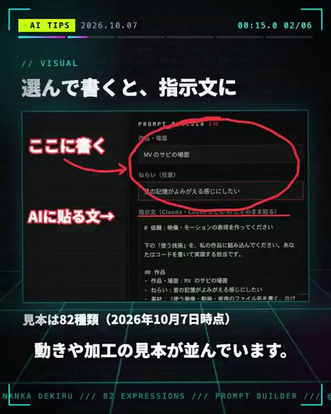</a></td>
<td width="50%" height="225" align="center" valign="middle"><a href="https://guanmo-ai.github.io/awesome-ai-motion/?lang=en#case-2107600510069182690">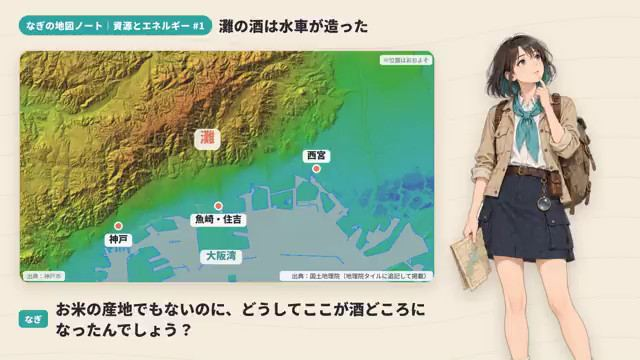</a></td>
</tr>
<tr>
<td width="50%" valign="top"><strong>A Japanese Guide to Selecting Motion Examples</strong> <a href="https://x.com/tenbin_ai">@tenbin_ai</a> · Education &amp; explainers 0:58 · Bookmarks 2 · Details pending <a href="https://guanmo-ai.github.io/awesome-ai-motion/?lang=en#case-2107667480034562167">▶ Play</a> · <a href="https://x.com/tenbin_ai/status/2107667480034562167">Original post</a></td>
<td width="50%" valign="top"><strong>A Historical Explainer about Waterwheels and Nada Sake</strong> <a href="https://x.com/phstarrion">@phstarrion</a> · Education &amp; explainers 1:39 · Bookmarks 1 · Details pending <a href="https://guanmo-ai.github.io/awesome-ai-motion/?lang=en#case-2107600510069182690">▶ Play</a> · <a href="https://x.com/phstarrion/status/2107600510069182690">Original post</a></td>
</tr>
</tbody>
<tbody>
<tr>
<td width="50%" height="225" align="center" valign="middle"></td>
<td width="50%" height="225" align="center" valign="middle"><a href="https://guanmo-ai.github.io/awesome-ai-motion/?lang=en#case-2108062374028783947">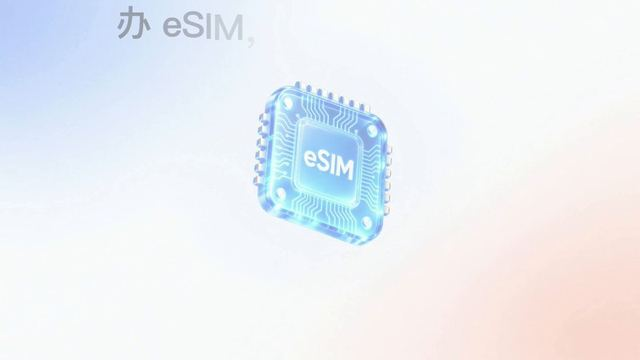</a></td>
</tr>
<tr>
<td width="50%" valign="top"><strong>How many things did a phone replace?</strong> <a href="https://x.com/bangbuilds">@bangbuilds</a> · Education &amp; explainers 1:30 · Bookmarks 1 · Details pending <a href="https://guanmo-ai.github.io/awesome-ai-motion/?lang=en#case-2107666804776775749">▶ Play</a> · <a href="https://x.com/bangbuilds/status/2107666804776775749">Original post</a></td>
<td width="50%" valign="top"><strong>A HyperFrames and Remotion Workflow Explainer</strong> <a href="https://x.com/btcup99">@btcup99</a> · Education &amp; explainers 2:45 · Bookmarks 1 · Details pending <a href="https://guanmo-ai.github.io/awesome-ai-motion/?lang=en#case-2108062374028783947">▶ Play</a> · <a href="https://x.com/btcup99/status/2108062374028783947">Original post</a></td>
</tr>
</tbody>
<tbody>
<tr>
<td width="50%" height="225" align="center" valign="middle"></td>
<td width="50%" height="225" align="center" valign="middle"><a href="https://guanmo-ai.github.io/awesome-ai-motion/?lang=en#case-2104598355372646422">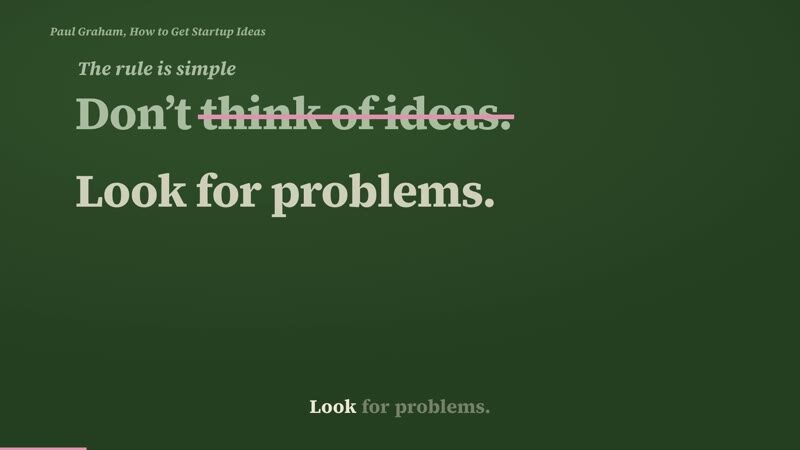</a></td>
</tr>
<tr>
<td width="50%" valign="top"><strong>Animated Reading of AI 2027</strong> <a href="https://x.com/Akash_Bang">@Akash_Bang</a> · Education &amp; explainers 9:08 · Bookmarks 1 · Details pending <a href="https://guanmo-ai.github.io/awesome-ai-motion/?lang=en#case-2103108964821107104">▶ Play</a> · <a href="https://x.com/Akash_Bang/status/2103108964821107104">Original post</a></td>
<td width="50%" valign="top"><strong>Explaining Paul Graham’s Startup Ideas Essay</strong> <a href="https://x.com/tejaskalpande">@tejaskalpande</a> · Education &amp; explainers 2:19 · Bookmarks 1 · Details pending <a href="https://guanmo-ai.github.io/awesome-ai-motion/?lang=en#case-2104598355372646422">▶ Play</a> · <a href="https://x.com/tejaskalpande/status/2104598355372646422">Original post</a></td>
</tr>
</tbody>
<tbody>
<tr>
<td width="50%" height="225" align="center" valign="middle"></td>
<td width="50%" height="225" align="center" valign="middle"><a href="https://guanmo-ai.github.io/awesome-ai-motion/?lang=en#case-2108391993609216508">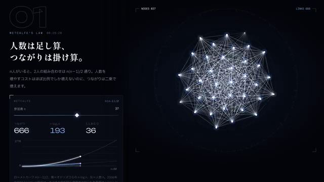</a></td>
</tr>
<tr>
<td width="50%" valign="top"><strong>A Blender Explainer about Sprint Distances</strong> <a href="https://x.com/tanabe_fragm">@tanabe_fragm</a> · Education &amp; explainers 0:52 · Bookmarks 1 · Details pending <a href="https://guanmo-ai.github.io/awesome-ai-motion/?lang=en#case-2108396748217749961">▶ Play</a> · <a href="https://x.com/tanabe_fragm/status/2108396748217749961">Original post</a></td>
<td width="50%" valign="top"><strong>An HTML Interactive Explainer about Connections</strong> <a href="https://x.com/Drake5112">@Drake5112</a> · Education &amp; explainers 0:10 · Bookmarks 1 · Details pending <a href="https://guanmo-ai.github.io/awesome-ai-motion/?lang=en#case-2108391993609216508">▶ Play</a> · <a href="https://x.com/Drake5112/status/2108391993609216508">Original post</a></td>
</tr>
</tbody>
<tbody>
<tr>
<td width="50%" height="225" align="center" valign="middle"></td>
<td width="50%" height="225" align="center" valign="middle"></td>
</tr>
<tr>
<td width="50%" valign="top"><strong>A Narration-first ReAct Explainer</strong> <a href="https://x.com/BX33666">@BX33666</a> · Education &amp; explainers 4:52 · Bookmarks 1 · Details pending <a href="https://guanmo-ai.github.io/awesome-ai-motion/?lang=en#case-2108505866626560200">▶ Play</a> · <a href="https://x.com/BX33666/status/2108505866626560200">Original post</a></td>
<td width="50%" valign="top"><strong>Code Animation from Earth to Humanity</strong> <a href="https://x.com/JuancaGlez7">@JuancaGlez7</a> · Education &amp; explainers 1:18 · Bookmarks 1 · Details pending <a href="https://guanmo-ai.github.io/awesome-ai-motion/?lang=en#case-2102890107200229817">▶ Play</a> · <a href="https://x.com/JuancaGlez7/status/2102890107200229817">Original post</a></td>
</tr>
</tbody>
<tbody>
<tr>
<td width="50%" height="225" align="center" valign="middle"></td>
<td width="50%" height="225" align="center" valign="middle"></td>
</tr>
<tr>
<td width="50%" valign="top"><strong>Sketch-Style Economics Explainer</strong> <a href="https://x.com/0xpai_eth">@0xpai_eth</a> · Education &amp; explainers 4:24 · Bookmarks 1 · Details pending <a href="https://guanmo-ai.github.io/awesome-ai-motion/?lang=en#case-2103166575071330778">▶ Play</a> · <a href="https://x.com/0xpai_eth/status/2103166575071330778">Original post</a></td>
<td width="50%" valign="top"><strong>MED13 Syndrome Explained in Layers</strong> <a href="https://x.com/eztati">@eztati</a> · Education &amp; explainers 2:42 · Bookmarks 1 · Details pending <a href="https://guanmo-ai.github.io/awesome-ai-motion/?lang=en#case-2103202431224119500">▶ Play</a> · <a href="https://x.com/eztati/status/2103202431224119500">Original post</a></td>
</tr>
</tbody>
<tbody>
<tr>
<td width="50%" height="225" align="center" valign="middle"></td>
<td width="50%" height="225" align="center" valign="middle"></td>
</tr>
<tr>
<td width="50%" valign="top"><strong>A Four-minute Explainer about LLM Tokens</strong> <a href="https://x.com/linxiaobei888">@linxiaobei888</a> · Education &amp; explainers 4:21 · Bookmarks 1 · Details pending <a href="https://guanmo-ai.github.io/awesome-ai-motion/?lang=en#case-2107715610121760984">▶ Play</a> · <a href="https://x.com/linxiaobei888/status/2107715610121760984">Original post</a></td>
<td width="50%" valign="top"><strong>Tai Chang Yin: an Animated Poetry Lesson</strong> <a href="https://x.com/7998l201">@7998l201</a> · Education &amp; explainers 3:09 · Bookmarks 1 · Details pending <a href="https://guanmo-ai.github.io/awesome-ai-motion/?lang=en#case-2108204728534663215">▶ Play</a> · <a href="https://x.com/7998l201/status/2108204728534663215">Original post</a></td>
</tr>
</tbody>
<tbody>
<tr>
<td width="50%" height="225" align="center" valign="middle"><a href="https://guanmo-ai.github.io/awesome-ai-motion/?lang=en#case-2106208810604081208">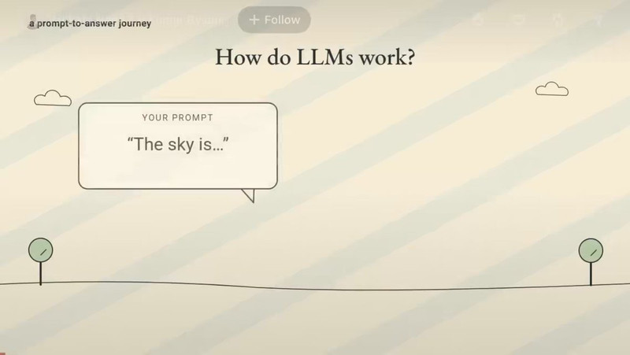</a></td>
<td width="50%" height="225" align="center" valign="middle"><a href="https://guanmo-ai.github.io/awesome-ai-motion/?lang=en#case-2104466394859593915">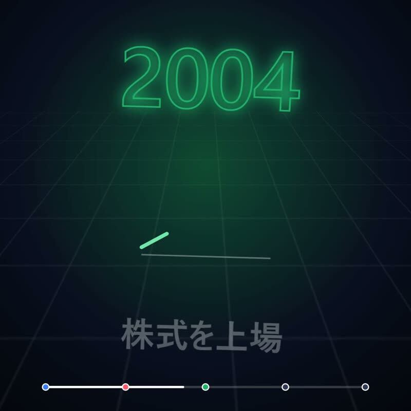</a></td>
</tr>
<tr>
<td width="50%" valign="top"><strong>How do LLMs work: an editable code explainer</strong> <a href="https://x.com/ItsDarcy_AI">@ItsDarcy_AI</a> · Education &amp; explainers 0:38 · Bookmarks 0 · Details pending <a href="https://guanmo-ai.github.io/awesome-ai-motion/?lang=en#case-2106208810604081208">▶ Play</a> · <a href="https://x.com/ItsDarcy_AI/status/2106208810604081208">Original post</a></td>
<td width="50%" valign="top"><strong>A fifteen-second search-history timeline</strong> <a href="https://x.com/aigame_lab">@aigame_lab</a> · Education &amp; explainers 0:15 · Bookmarks 0 <a href="https://guanmo-ai.github.io/awesome-ai-motion/?lang=en#case-2104466394859593915">▶ Play</a> · <a href="https://x.com/aigame_lab/status/2104466394859593915">Original post</a></td>
</tr>
</tbody>
<tbody>
<tr>
<td width="50%" height="225" align="center" valign="middle"><a href="https://guanmo-ai.github.io/awesome-ai-motion/?lang=en#case-2103835848575746268">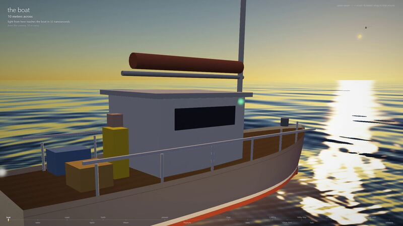</a></td>
<td width="50%" height="225" align="center" valign="middle"><a href="https://guanmo-ai.github.io/awesome-ai-motion/?lang=en#case-2107495093200691462">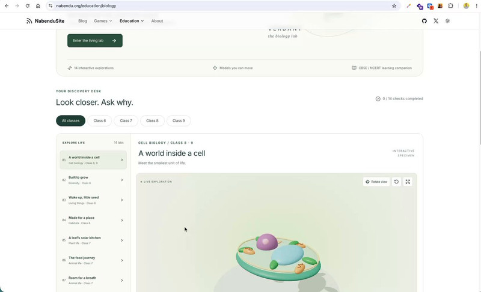</a></td>
</tr>
<tr>
<td width="50%" valign="top"><strong>Zooming from an Earth hillside to the observable universe</strong> <a href="https://x.com/kgonia7">@kgonia7</a> · Education &amp; explainers 1:00 · Bookmarks 0 <a href="https://guanmo-ai.github.io/awesome-ai-motion/?lang=en#case-2103835848575746268">▶ Play</a> · <a href="https://x.com/kgonia7/status/2103835848575746268">Original post</a></td>
<td width="50%" valign="top"><strong>A biology lab in the browser</strong> <a href="https://x.com/nabendu82">@nabendu82</a> · Education &amp; explainers 0:27 · Bookmarks 0 · Details pending <a href="https://guanmo-ai.github.io/awesome-ai-motion/?lang=en#case-2107495093200691462">▶ Play</a> · <a href="https://x.com/nabendu82/status/2107495093200691462">Original post</a></td>
</tr>
</tbody>
<tbody>
<tr>
<td width="50%" height="225" align="center" valign="middle"></td>
<td width="50%" height="225" align="center" valign="middle"></td>
</tr>
<tr>
<td width="50%" valign="top"><strong>Sphere Building Evolution Timeline</strong> <a href="https://x.com/RetropunkAI">@RetropunkAI</a> · Education &amp; explainers 1:00 · Bookmarks 0 · Details pending <a href="https://guanmo-ai.github.io/awesome-ai-motion/?lang=en#case-2103237989065277590">▶ Play</a> · <a href="https://x.com/RetropunkAI/status/2103237989065277590">Original post</a></td>
<td width="50%" valign="top"><strong>Three minute history of AI</strong> <a href="https://x.com/shreyanshbuilds">@shreyanshbuilds</a> · Education &amp; explainers 2:57 · Bookmarks 0 · Details pending <a href="https://guanmo-ai.github.io/awesome-ai-motion/?lang=en#case-2104196382404084075">▶ Play</a> · <a href="https://x.com/shreyanshbuilds/status/2104196382404084075">Original post</a></td>
</tr>
</tbody>
<tbody>
<tr>
<td width="50%" height="225" align="center" valign="middle"></td>
<td width="50%" height="225" align="center" valign="middle"></td>
</tr>
<tr>
<td width="50%" valign="top"><strong>How a Coding Agent Works in 40 Seconds</strong> <a href="https://x.com/arthurkatcher">@arthurkatcher</a> · Education &amp; explainers 0:40 · Bookmarks 0 · Details pending <a href="https://guanmo-ai.github.io/awesome-ai-motion/?lang=en#case-2104198927549604161">▶ Play</a> · <a href="https://x.com/arthurkatcher/status/2104198927549604161">Original post</a></td>
<td width="50%" valign="top"><strong>A Specimen-box Explainer about Ruby and Sapphire</strong> <a href="https://x.com/Ruri_Fable">@Ruri_Fable</a> · Education &amp; explainers 0:33 · Bookmarks 0 · Details pending <a href="https://guanmo-ai.github.io/awesome-ai-motion/?lang=en#case-2107642061826445617">▶ Play</a> · <a href="https://x.com/Ruri_Fable/status/2107642061826445617">Original post</a></td>
</tr>
</tbody>
<tbody>
<tr>
<td width="50%" height="225" align="center" valign="middle"><a href="https://guanmo-ai.github.io/awesome-ai-motion/?lang=en#case-2107680151593201743">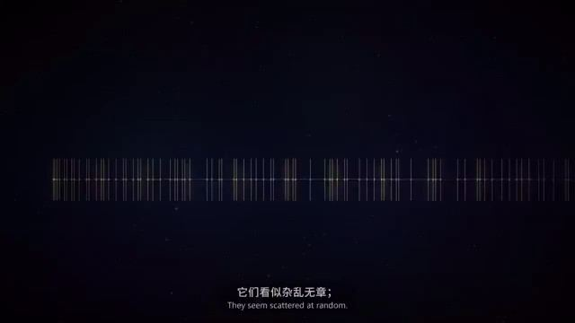</a></td>
<td width="50%" height="225" align="center" valign="middle"></td>
</tr>
<tr>
<td width="50%" valign="top"><strong>An Animated Introduction to the Riemann Hypothesis</strong> <a href="https://x.com/win96_fur">@win96_fur</a> · Education &amp; explainers 12:41 · Bookmarks 0 · Details pending <a href="https://guanmo-ai.github.io/awesome-ai-motion/?lang=en#case-2107680151593201743">▶ Play</a> · <a href="https://x.com/win96_fur/status/2107680151593201743">Original post</a></td>
<td width="50%" valign="top"><strong>Token: a Scissors-and-paper Collage Explainer</strong> <a href="https://x.com/ALSK_ai">@ALSK_ai</a> · Education &amp; explainers 1:28 · Bookmarks 0 · Details pending <a href="https://guanmo-ai.github.io/awesome-ai-motion/?lang=en#case-2108026744968298654">▶ Play</a> · <a href="https://x.com/ALSK_ai/status/2108026744968298654">Original post</a></td>
</tr>
</tbody>
<tbody>
<tr>
<td width="50%" height="225" align="center" valign="middle"><a href="https://guanmo-ai.github.io/awesome-ai-motion/?lang=en#case-2105558561602560448">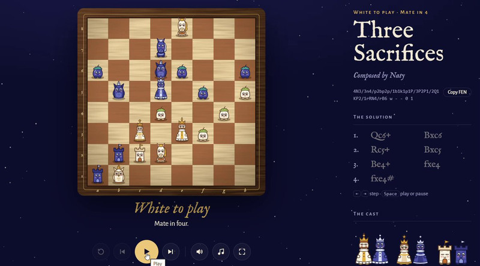</a></td>
<td width="50%" height="225" align="center" valign="middle"></td>
</tr>
<tr>
<td width="50%" valign="top"><strong>Three Sacrifices: an animated chess puzzle</strong> <a href="https://x.com/TheAIObserverX">@TheAIObserverX</a> · Education &amp; explainers 0:30 · Bookmarks 0 · Details pending <a href="https://guanmo-ai.github.io/awesome-ai-motion/?lang=en#case-2105558561602560448">▶ Play</a> · <a href="https://x.com/TheAIObserverX/status/2105558561602560448">Original post</a></td>
<td width="50%" valign="top"><strong>AI quantization explained with 3D animation</strong> <a href="https://x.com/Juleboost3">@Juleboost3</a> · Education &amp; explainers 1:11 · Bookmarks 0 · Details pending <a href="https://x.com/Juleboost3/status/2106060741732147653">▶ Watch on X</a> · <a href="https://x.com/Juleboost3/status/2106060741732147653">Original post</a></td>
</tr>
</tbody>
<tbody>
<tr>
<td width="50%" height="225" align="center" valign="middle"><a href="https://guanmo-ai.github.io/awesome-ai-motion/?lang=en#case-2108161420911370303">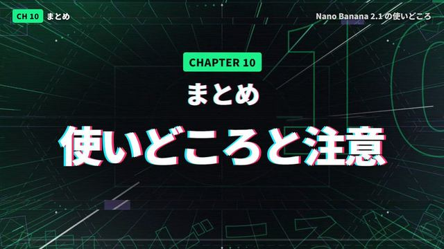</a></td>
<td width="50%" height="225" align="center" valign="middle"></td>
</tr>
<tr>
<td width="50%" valign="top"><strong>A Motion Explainer about Nano Banana 2.1</strong> <a href="https://x.com/FalconG_J">@FalconG_J</a> · Education &amp; explainers 0:30 · Bookmarks 0 · Details pending <a href="https://guanmo-ai.github.io/awesome-ai-motion/?lang=en#case-2108161420911370303">▶ Play</a> · <a href="https://x.com/FalconG_J/status/2108161420911370303">Original post</a></td>
<td width="50%" valign="top"><strong>Live-action versus Image References for Character Acting</strong> <a href="https://x.com/yyu_hase">@yyu_hase</a> · Education &amp; explainers 0:14 · Bookmarks 0 · Details pending <a href="https://guanmo-ai.github.io/awesome-ai-motion/?lang=en#case-2108171535324434434">▶ Play</a> · <a href="https://x.com/yyu_hase/status/2108171535324434434">Original post</a></td>
</tr>
</tbody>
<tbody>
<tr>
<td width="50%" height="225" align="center" valign="middle"></td>
<td width="50%" height="225" align="center" valign="middle"><a href="https://guanmo-ai.github.io/awesome-ai-motion/?lang=en#case-2103130115177898208">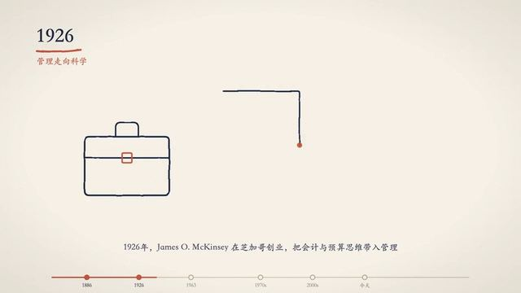</a></td>
</tr>
<tr>
<td width="50%" valign="top"><strong>An X-reply Topic Breakdown in Motion</strong> <a href="https://x.com/bangbuilds">@bangbuilds</a> · Education &amp; explainers 0:12 · Bookmarks 0 · Details pending <a href="https://guanmo-ai.github.io/awesome-ai-motion/?lang=en#case-2108421410557428177">▶ Play</a> · <a href="https://x.com/bangbuilds/status/2108421410557428177">Original post</a></td>
<td width="50%" valign="top"><strong>Historical Explainer Video Assembly</strong> <a href="https://x.com/Hectoryu">@Hectoryu</a> · Education &amp; explainers 1:00 · Bookmarks 0 · Details pending <a href="https://guanmo-ai.github.io/awesome-ai-motion/?lang=en#case-2103130115177898208">▶ Play</a> · <a href="https://x.com/Hectoryu/status/2103130115177898208">Original post</a></td>
</tr>
</tbody>
<tbody>
<tr>
<td width="50%" height="225" align="center" valign="middle"><a href="https://guanmo-ai.github.io/awesome-ai-motion/?lang=en#case-2104234497156018396">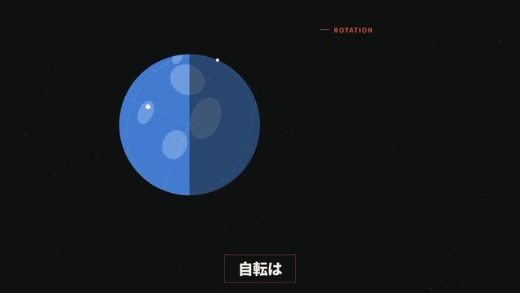</a></td>
<td width="50%" height="225" align="center" valign="middle"></td>
</tr>
<tr>
<td width="50%" valign="top"><strong>Earth rotation and orbit infographic</strong> <a href="https://x.com/sidodtv">@sidodtv</a> · Education &amp; explainers 1:22 · Bookmarks 0 · Details pending <a href="https://guanmo-ai.github.io/awesome-ai-motion/?lang=en#case-2104234497156018396">▶ Play</a> · <a href="https://x.com/sidodtv/status/2104234497156018396">Original post</a></td>
<td width="50%" valign="top"><strong>How Starlink works explainer</strong> <a href="https://x.com/omni1896837">@omni1896837</a> · Education &amp; explainers 4:34 · Bookmarks 0 · Details pending <a href="https://guanmo-ai.github.io/awesome-ai-motion/?lang=en#case-2104256238246596651">▶ Play</a> · <a href="https://x.com/omni1896837/status/2104256238246596651">Original post</a></td>
</tr>
</tbody>
<tbody>
<tr>
<td width="50%" height="225" align="center" valign="middle"><a href="https://guanmo-ai.github.io/awesome-ai-motion/?lang=en#case-2104809653947265030">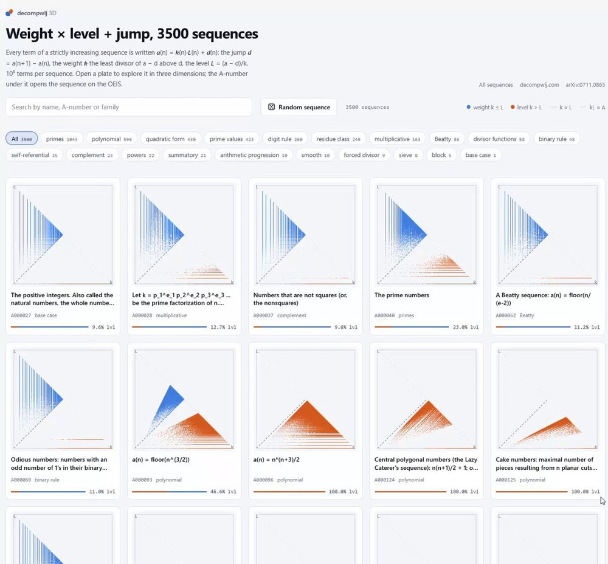</a></td>
<td width="50%" height="225" align="center" valign="middle"></td>
</tr>
<tr>
<td width="50%" valign="top"><strong>An Interactive 3D Atlas of 3,500 Integer Sequences</strong> <a href="https://x.com/decompwlj">@decompwlj</a> · Education &amp; explainers 0:29 · Bookmarks 0 · Details pending <a href="https://guanmo-ai.github.io/awesome-ai-motion/?lang=en#case-2104809653947265030">▶ Play</a> · <a href="https://x.com/decompwlj/status/2104809653947265030">Original post</a></td>
<td width="50%" valign="top"><strong>An auto-rickshaw braking and collision illustration</strong> <a href="https://x.com/nullbytes00">@nullbytes00</a> · Education &amp; explainers 0:30 · Bookmarks 0 · Details pending <a href="https://guanmo-ai.github.io/awesome-ai-motion/?lang=en#case-2105360011916697713">▶ Play</a> · <a href="https://x.com/nullbytes00/status/2105360011916697713">Original post</a></td>
</tr>
</tbody>
<tbody>
<tr>
<td width="50%" height="225" align="center" valign="middle"><a href="https://guanmo-ai.github.io/awesome-ai-motion/?lang=en#case-2106053810405654768">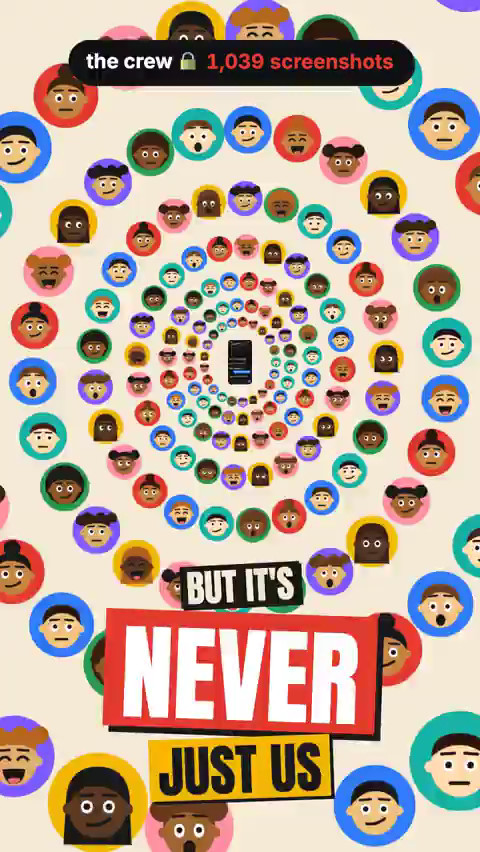</a></td>
<td width="50%" height="225" align="center" valign="middle"></td>
</tr>
<tr>
<td width="50%" valign="top"><strong>It’s never just us: an educational short</strong> <a href="https://x.com/AliKibao">@AliKibao</a> · Education &amp; explainers 2:41 · Bookmarks 0 · Details pending <a href="https://guanmo-ai.github.io/awesome-ai-motion/?lang=en#case-2106053810405654768">▶ Play</a> · <a href="https://x.com/AliKibao/status/2106053810405654768">Original post</a></td>
<td width="50%" valign="top"><strong>KV Cache: a code-animation explainer</strong> <a href="https://x.com/_princegupta13">@_princegupta13</a> · Education &amp; explainers 0:20 · Bookmarks 0 · Details pending <a href="https://guanmo-ai.github.io/awesome-ai-motion/?lang=en#case-2107212634835849505">▶ Play</a> · <a href="https://x.com/_princegupta13/status/2107212634835849505">Original post</a></td>
</tr>
</tbody>
<tbody>
<tr>
<td width="50%" height="225" align="center" valign="middle"></td>
<td width="50%" height="225" align="center" valign="middle"></td>
</tr>
<tr>
<td width="50%" valign="top"><strong>CMYK plates, halftones and paper</strong> <a href="https://x.com/design_oyaji">@design_oyaji</a> · Education &amp; explainers 0:37 · Bookmarks 0 · Details pending <a href="https://guanmo-ai.github.io/awesome-ai-motion/?lang=en#case-2107615935570084308">▶ Play</a> · <a href="https://x.com/design_oyaji/status/2107615935570084308">Original post</a></td>
<td width="50%" valign="top"><strong>An Introduction to Cthulhu Mythos TRPGs</strong> <a href="https://x.com/gigabit_million">@gigabit_million</a> · Education &amp; explainers 1:16 · Bookmarks 0 · Details pending <a href="https://guanmo-ai.github.io/awesome-ai-motion/?lang=en#case-2108183474968654242">▶ Play</a> · <a href="https://x.com/gigabit_million/status/2108183474968654242">Original post</a></td>
</tr>
</tbody>
<tbody>
<tr>
<td width="50%" height="225" align="center" valign="middle"></td>
<td width="50%" height="225" align="center" valign="middle"><a href="https://guanmo-ai.github.io/awesome-ai-motion/?lang=en#case-2108458503367200908">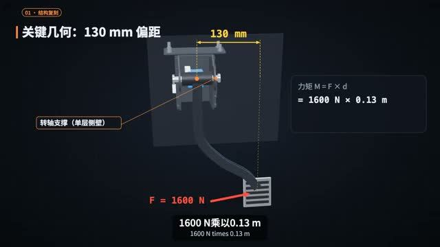</a></td>
</tr>
<tr>
<td width="50%" valign="top"><strong>A Browser 3D Explainer about QR Codes</strong> <a href="https://x.com/eyadnour">@eyadnour</a> · Education &amp; explainers 1:46 · Bookmarks 0 · Details pending <a href="https://guanmo-ai.github.io/awesome-ai-motion/?lang=en#case-2108314868189172216">▶ Play</a> · <a href="https://x.com/eyadnour/status/2108314868189172216">Original post</a></td>
<td width="50%" valign="top"><strong>A 3D Brake-pedal Fracture Explainer</strong> <a href="https://x.com/chang_">@chang_</a> · Education &amp; explainers 5:15 · Bookmarks 0 · Details pending <a href="https://guanmo-ai.github.io/awesome-ai-motion/?lang=en#case-2108458503367200908">▶ Play</a> · <a href="https://x.com/chang_/status/2108458503367200908">Original post</a></td>
</tr>
</tbody>
<tbody>
<tr>
<td width="50%" height="225" align="center" valign="middle"><a href="https://guanmo-ai.github.io/awesome-ai-motion/?lang=en#case-2103022039854657902">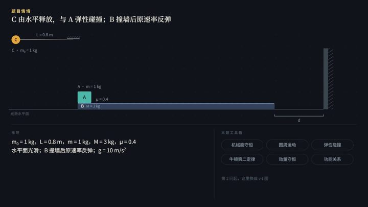</a></td>
<td width="50%" height="225" align="center" valign="middle"><a href="https://guanmo-ai.github.io/awesome-ai-motion/?lang=en#case-2103095131536764940">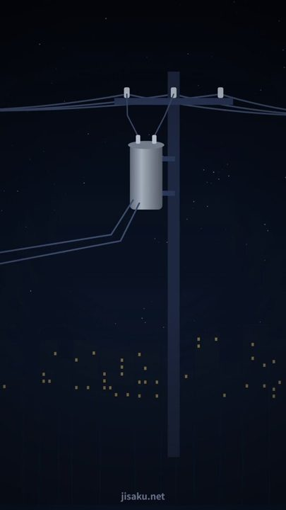</a></td>
</tr>
<tr>
<td width="50%" valign="top"><strong>Animated Solution to a Physics Exam Problem</strong> <a href="https://x.com/hooyall0113">@hooyall0113</a> · Education &amp; explainers 1:56 · Bookmarks 0 · Details pending <a href="https://guanmo-ai.github.io/awesome-ai-motion/?lang=en#case-2103022039854657902">▶ Play</a> · <a href="https://x.com/hooyall0113/status/2103022039854657902">Original post</a></td>
<td width="50%" valign="top"><strong>Electricity's Path from Plant to Outlet</strong> <a href="https://x.com/jisaku_net">@jisaku_net</a> · Education &amp; explainers 1:17 · Bookmarks 0 · Details pending <a href="https://guanmo-ai.github.io/awesome-ai-motion/?lang=en#case-2103095131536764940">▶ Play</a> · <a href="https://x.com/jisaku_net/status/2103095131536764940">Original post</a></td>
</tr>
</tbody>
<tbody>
<tr>
<td width="50%" height="225" align="center" valign="middle"></td>
<td width="50%" height="225" align="center" valign="middle"></td>
</tr>
<tr>
<td width="50%" valign="top"><strong>Web Design Article Turned into Video</strong> <a href="https://x.com/Oscar_sanmillan">@Oscar_sanmillan</a> · Education &amp; explainers 0:46 · Bookmarks 0 · Details pending <a href="https://guanmo-ai.github.io/awesome-ai-motion/?lang=en#case-2103114698610683964">▶ Play</a> · <a href="https://x.com/Oscar_sanmillan/status/2103114698610683964">Original post</a></td>
<td width="50%" valign="top"><strong>Animated Rowing Lesson</strong> <a href="https://x.com/Bishal_Ramdam1">@Bishal_Ramdam1</a> · Education &amp; explainers 1:00 · Bookmarks 0 · Details pending <a href="https://guanmo-ai.github.io/awesome-ai-motion/?lang=en#case-2103192634395361596">▶ Play</a> · <a href="https://x.com/Bishal_Ramdam1/status/2103192634395361596">Original post</a></td>
</tr>
</tbody>
<tbody>
<tr>
<td width="50%" height="225" align="center" valign="middle"><a href="https://guanmo-ai.github.io/awesome-ai-motion/?lang=en#case-2104166304177336520">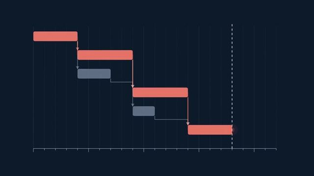</a></td>
<td width="50%" height="225" align="center" valign="middle"></td>
</tr>
<tr>
<td width="50%" valign="top"><strong>Gantt chart critical path explainer</strong> <a href="https://x.com/marc_bara">@marc_bara</a> · Education &amp; explainers 0:43 · Bookmarks 0 · Details pending <a href="https://guanmo-ai.github.io/awesome-ai-motion/?lang=en#case-2104166304177336520">▶ Play</a> · <a href="https://x.com/marc_bara/status/2104166304177336520">Original post</a></td>
<td width="50%" valign="top"><strong>LeJEPA paper animated explainer</strong> <a href="https://x.com/SimonGoodman_">@SimonGoodman_</a> · Education &amp; explainers 6:24 · Bookmarks 0 · Details pending <a href="https://guanmo-ai.github.io/awesome-ai-motion/?lang=en#case-2104211152662106358">▶ Play</a> · <a href="https://x.com/SimonGoodman_/status/2104211152662106358">Original post</a></td>
</tr>
</tbody>
<tbody>
<tr>
<td width="50%" height="225" align="center" valign="middle"><a href="https://guanmo-ai.github.io/awesome-ai-motion/?lang=en#case-2104342945713561812">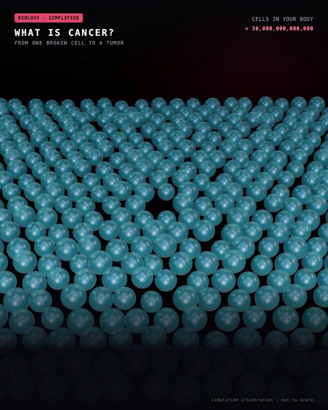</a></td>
<td width="50%" height="225" align="center" valign="middle"></td>
</tr>
<tr>
<td width="50%" valign="top"><strong>From Cell to Tumor: An 86-Second Explainer</strong> <a href="https://x.com/bobbyships">@bobbyships</a> · Education &amp; explainers 1:26 · Bookmarks 0 · Details pending <a href="https://guanmo-ai.github.io/awesome-ai-motion/?lang=en#case-2104342945713561812">▶ Play</a> · <a href="https://x.com/bobbyships/status/2104342945713561812">Original post</a></td>
<td width="50%" valign="top"><strong>A 2D Explainer of Andes Hantivirus Mechanisms</strong> <a href="https://x.com/ericpoderoso_cg">@ericpoderoso_cg</a> · Education &amp; explainers 1:33 · Bookmarks 0 · Details pending <a href="https://guanmo-ai.github.io/awesome-ai-motion/?lang=en#case-2105231283248844875">▶ Play</a> · <a href="https://x.com/ericpoderoso_cg/status/2105231283248844875">Original post</a></td>
</tr>
</tbody>
<tbody>
<tr>
<td width="50%" height="225" align="center" valign="middle"><a href="https://guanmo-ai.github.io/awesome-ai-motion/?lang=en#case-2105560147863187557">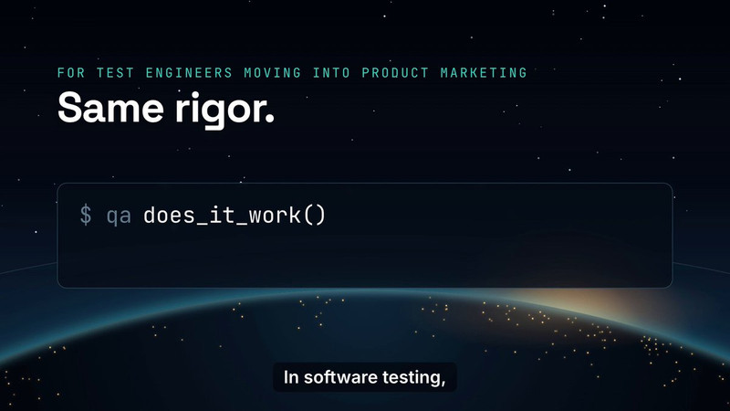</a></td>
<td width="50%" height="225" align="center" valign="middle"><a href="https://guanmo-ai.github.io/awesome-ai-motion/?lang=en#case-2105563112539893936">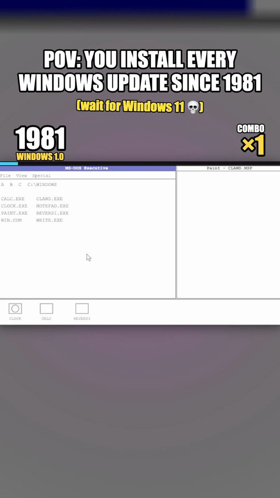</a></td>
</tr>
<tr>
<td width="50%" valign="top"><strong>Marketing and LEGO concept explainers</strong> <a href="https://x.com/BasiratAfroz1">@BasiratAfroz1</a> · Education &amp; explainers 1:34 · Bookmarks 0 · Details pending <a href="https://guanmo-ai.github.io/awesome-ai-motion/?lang=en#case-2105560147863187557">▶ Play</a> · <a href="https://x.com/BasiratAfroz1/status/2105560147863187557">Original post</a></td>
<td width="50%" valign="top"><strong>Windows updates across a minute</strong> <a href="https://x.com/shion_nichicoma">@shion_nichicoma</a> · Education &amp; explainers 1:03 · Bookmarks 0 · Details pending <a href="https://guanmo-ai.github.io/awesome-ai-motion/?lang=en#case-2105563112539893936">▶ Play</a> · <a href="https://x.com/shion_nichicoma/status/2105563112539893936">Original post</a></td>
</tr>
</tbody>
<tbody>
<tr>
<td width="50%" height="225" align="center" valign="middle"></td>
<td width="50%" height="225" align="center" valign="middle"></td>
</tr>
<tr>
<td width="50%" valign="top"><strong>A sketched history of AI</strong> <a href="https://x.com/13_narcissus">@13_narcissus</a> · Education &amp; explainers 0:40 · Bookmarks 0 · Details pending <a href="https://guanmo-ai.github.io/awesome-ai-motion/?lang=en#case-2107157967329960060">▶ Play</a> · <a href="https://x.com/13_narcissus/status/2107157967329960060">Original post</a></td>
<td width="50%" valign="top"><strong>The Marquis Yi chime bells</strong> <a href="https://x.com/YFeng2022">@YFeng2022</a> · Education &amp; explainers 3:01 · Bookmarks 0 · Details pending <a href="https://guanmo-ai.github.io/awesome-ai-motion/?lang=en#case-2107480273969627325">▶ Play</a> · <a href="https://x.com/YFeng2022/status/2107480273969627325">Original post</a></td>
</tr>
</tbody>
<tbody>
<tr>
<td width="50%" height="225" align="center" valign="middle"></td>
<td width="50%" height="225" align="center" valign="middle"></td>
</tr>
<tr>
<td width="50%" valign="top"><strong>An explainer on AI consciousness and religion</strong> <a href="https://x.com/itnavi2022">@itnavi2022</a> · Education &amp; explainers 3:31 · Bookmarks 0 · Details pending <a href="https://guanmo-ai.github.io/awesome-ai-motion/?lang=en#case-2107499968143733228">▶ Play</a> · <a href="https://x.com/itnavi2022/status/2107499968143733228">Original post</a></td>
<td width="50%" valign="top"><strong>An Interactive 3D Guide to Database Structures</strong> <a href="https://x.com/EKeric13">@EKeric13</a> · Education &amp; explainers 2:22 · Bookmarks 0 · Details pending <a href="https://guanmo-ai.github.io/awesome-ai-motion/?lang=en#case-2107878084032753751">▶ Play</a> · <a href="https://x.com/EKeric13/status/2107878084032753751">Original post</a></td>
</tr>
</tbody>
<tbody>
<tr>
<td width="50%" height="225" align="center" valign="middle"><a href="https://guanmo-ai.github.io/awesome-ai-motion/?lang=en#case-2108043700416954557">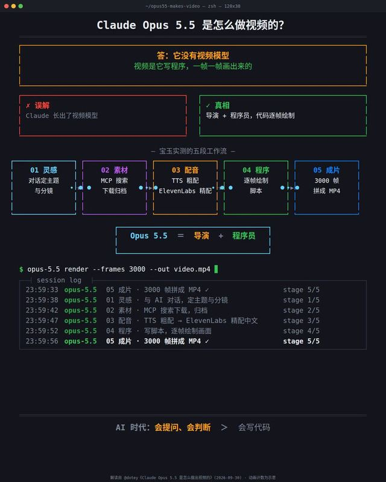</a></td>
<td width="50%" height="225" align="center" valign="middle"></td>
</tr>
<tr>
<td width="50%" valign="top"><strong>A Twenty-eight-second Explainer about Code-made Video</strong> <a href="https://x.com/sycbruce">@sycbruce</a> · Education &amp; explainers 0:28 · Bookmarks 0 · Details pending <a href="https://guanmo-ai.github.io/awesome-ai-motion/?lang=en#case-2108043700416954557">▶ Play</a> · <a href="https://x.com/sycbruce/status/2108043700416954557">Original post</a></td>
<td width="50%" valign="top"><strong>A News Short about Model Costs</strong> <a href="https://x.com/zheng_qili666">@zheng_qili666</a> · Education &amp; explainers 1:35 · Bookmarks 0 · Details pending <a href="https://guanmo-ai.github.io/awesome-ai-motion/?lang=en#case-2108091950310019268">▶ Play</a> · <a href="https://x.com/zheng_qili666/status/2108091950310019268">Original post</a></td>
</tr>
</tbody>
<tbody>
<tr>
<td width="50%" height="225" align="center" valign="middle"><a href="https://guanmo-ai.github.io/awesome-ai-motion/?lang=en#case-2108121685752967414">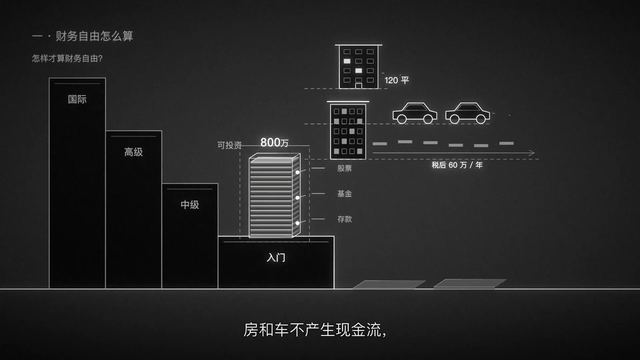</a></td>
<td width="50%" height="225" align="center" valign="middle"></td>
</tr>
<tr>
<td width="50%" valign="top"><strong>A Forty-six-minute Animated FIRE Blog Adaptation</strong> <a href="https://x.com/ploto_me">@ploto_me</a> · Education &amp; explainers 46:18 · Bookmarks 0 · Details pending <a href="https://guanmo-ai.github.io/awesome-ai-motion/?lang=en#case-2108121685752967414">▶ Play</a> · <a href="https://x.com/ploto_me/status/2108121685752967414">Original post</a></td>
<td width="50%" valign="top"><strong>A Thirteen-minute Nobel Prize Explainer</strong> <a href="https://x.com/KeWai386772">@KeWai386772</a> · Education &amp; explainers 13:00 · Bookmarks 0 · Details pending <a href="https://guanmo-ai.github.io/awesome-ai-motion/?lang=en#case-2108143447496679553">▶ Play</a> · <a href="https://x.com/KeWai386772/status/2108143447496679553">Original post</a></td>
</tr>
</tbody>
<tbody>
<tr>
<td width="50%" height="225" align="center" valign="middle"></td>
<td width="50%" height="225" align="center" valign="middle"><a href="https://guanmo-ai.github.io/awesome-ai-motion/?lang=en#case-2108152596422914490">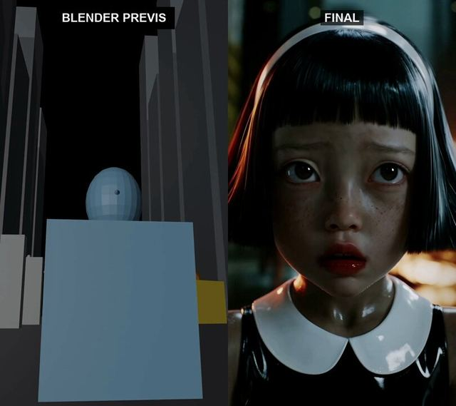</a></td>
</tr>
<tr>
<td width="50%" valign="top"><strong>AI History with HyperFrames and Three.js</strong> <a href="https://x.com/btcup99">@btcup99</a> · Education &amp; explainers 2:03 · Bookmarks 0 · Details pending <a href="https://guanmo-ai.github.io/awesome-ai-motion/?lang=en#case-2108152460523311469">▶ Play</a> · <a href="https://x.com/btcup99/status/2108152460523311469">Original post</a></td>
<td width="50%" valign="top"><strong>From Box Blocking to a Character Shot</strong> <a href="https://x.com/poppitheatre">@poppitheatre</a> · Education &amp; explainers 1:44 · Bookmarks 0 · Details pending <a href="https://guanmo-ai.github.io/awesome-ai-motion/?lang=en#case-2108152596422914490">▶ Play</a> · <a href="https://x.com/poppitheatre/status/2108152596422914490">Original post</a></td>
</tr>
</tbody>
<tbody>
<tr>
<td width="50%" height="225" align="center" valign="middle"><a href="https://guanmo-ai.github.io/awesome-ai-motion/?lang=en#case-2108194840899174633">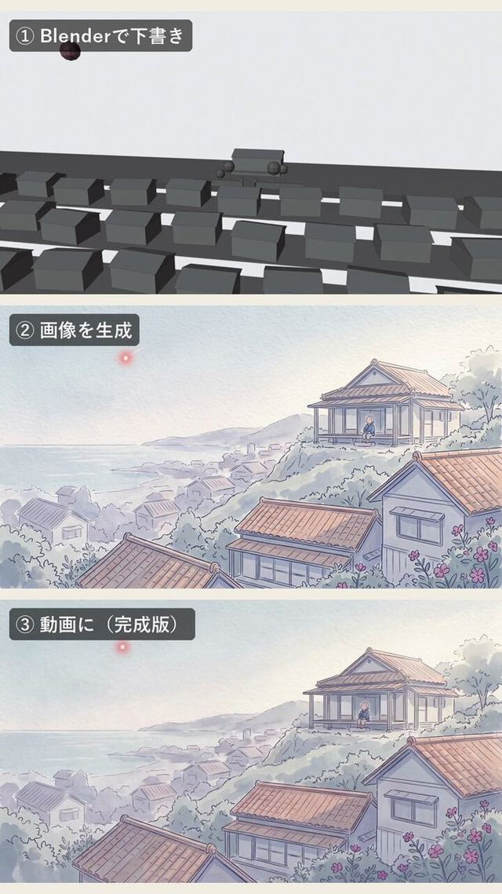</a></td>
<td width="50%" height="225" align="center" valign="middle"><a href="https://guanmo-ai.github.io/awesome-ai-motion/?lang=en#case-2108279927397326924">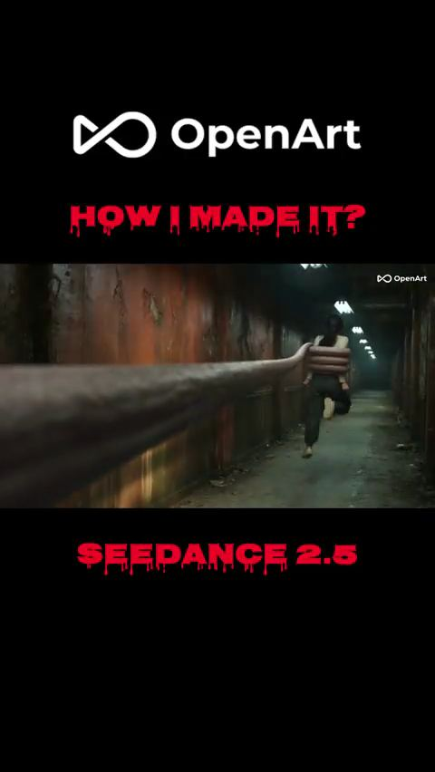</a></td>
</tr>
<tr>
<td width="50%" valign="top"><strong>From Blender Blocking to Watercolor Footage</strong> <a href="https://x.com/Okibaru_youtube">@Okibaru_youtube</a> · Education &amp; explainers 0:15 · Bookmarks 0 · Details pending <a href="https://guanmo-ai.github.io/awesome-ai-motion/?lang=en#case-2108194840899174633">▶ Play</a> · <a href="https://x.com/Okibaru_youtube/status/2108194840899174633">Original post</a></td>
<td width="50%" valign="top"><strong>A Seedance Character-motion Breakdown</strong> <a href="https://x.com/prjcthrzn_">@prjcthrzn_</a> · Education &amp; explainers 0:45 · Bookmarks 0 · Details pending <a href="https://guanmo-ai.github.io/awesome-ai-motion/?lang=en#case-2108279927397326924">▶ Play</a> · <a href="https://x.com/prjcthrzn_/status/2108279927397326924">Original post</a></td>
</tr>
</tbody>
<tbody>
<tr>
<td width="50%" height="225" align="center" valign="middle"></td>
<td width="50%" height="225" align="center" valign="middle"></td>
</tr>
<tr>
<td width="50%" valign="top"><strong>If the Moon Disappeared: a Code-made Explainer</strong> <a href="https://x.com/mbaiagent">@mbaiagent</a> · Education &amp; explainers 1:07 · Bookmarks 0 · Details pending <a href="https://guanmo-ai.github.io/awesome-ai-motion/?lang=en#case-2108294768010854860">▶ Play</a> · <a href="https://x.com/mbaiagent/status/2108294768010854860">Original post</a></td>
<td width="50%" valign="top"><strong>A Children's Land-water-air Quiz Short</strong> <a href="https://x.com/Yousan_O">@Yousan_O</a> · Education &amp; explainers 0:27 · Bookmarks 0 · Details pending <a href="https://guanmo-ai.github.io/awesome-ai-motion/?lang=en#case-2108365512820637771">▶ Play</a> · <a href="https://x.com/Yousan_O/status/2108365512820637771">Original post</a></td>
</tr>
</tbody>
<tbody>
<tr>
<td width="50%" height="225" align="center" valign="middle"><a href="https://guanmo-ai.github.io/awesome-ai-motion/?lang=en#case-2108392469880832000">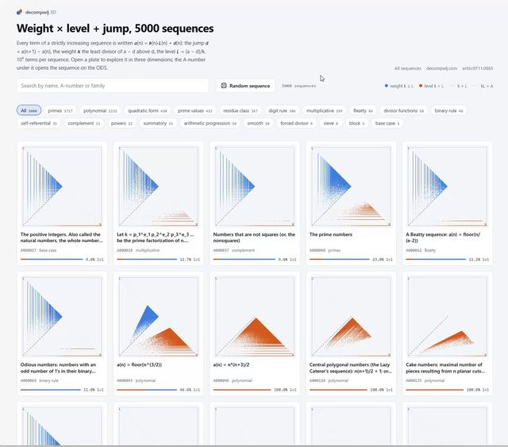</a></td>
<td width="50%" height="225" align="center" valign="middle"><a href="https://guanmo-ai.github.io/awesome-ai-motion/?lang=en#case-2108476166495727716">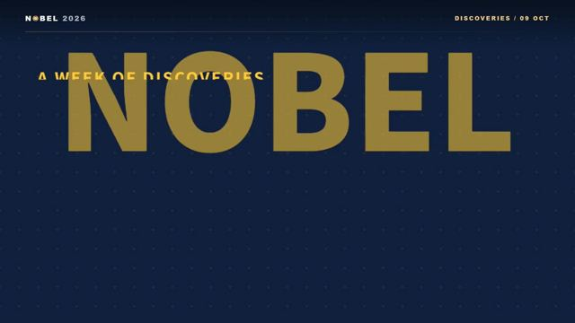</a></td>
</tr>
<tr>
<td width="50%" valign="top"><strong>decompwlj: Integer Sequences in 3D</strong> <a href="https://x.com/decompwlj">@decompwlj</a> · Education &amp; explainers 0:30 · Bookmarks 0 · Details pending <a href="https://guanmo-ai.github.io/awesome-ai-motion/?lang=en#case-2108392469880832000">▶ Play</a> · <a href="https://x.com/decompwlj/status/2108392469880832000">Original post</a></td>
<td width="50%" valign="top"><strong>A Nobel Prize-themed Animated Explainer</strong> <a href="https://x.com/Wavequester">@Wavequester</a> · Education &amp; explainers 2:22 · Bookmarks 0 · Details pending <a href="https://guanmo-ai.github.io/awesome-ai-motion/?lang=en#case-2108476166495727716">▶ Play</a> · <a href="https://x.com/Wavequester/status/2108476166495727716">Original post</a></td>
</tr>
</tbody>
</table>
