[← All categories](../README.en.md#browse)

# 3D & interactive

181 works. Click a cover to play; works without gallery video open on X.

<table>
<tbody>
<tr>
<td width="50%" height="225" align="center" valign="middle"></td>
<td width="50%" height="225" align="center" valign="middle"></td>
</tr>
<tr>
<td width="50%" valign="top"><strong>Peach Blossom Spring: A Guided Three.js Journey</strong> <a href="https://x.com/dotey">@dotey</a> · 3D &amp; interactive 4:17 · Bookmarks 460 · Details pending <a href="https://guanmo-ai.github.io/awesome-ai-motion/?lang=en#case-2102940980379017293">▶ Play</a> · <a href="https://x.com/dotey/status/2102940980379017293">Original post</a></td>
<td width="50%" valign="top"><strong>A prehistoric island: Opus 5 vs. Opus 5.5</strong> <a href="https://x.com/vib3coded">@vib3coded</a> · 3D &amp; interactive 0:20 · Bookmarks 77 <a href="https://guanmo-ai.github.io/awesome-ai-motion/?lang=en#case-2102450239923720440">▶ Play</a> · <a href="https://x.com/vib3coded/status/2102450239923720440">Original post</a></td>
</tr>
</tbody>
<tbody>
<tr>
<td width="50%" height="225" align="center" valign="middle"></td>
<td width="50%" height="225" align="center" valign="middle"></td>
</tr>
<tr>
<td width="50%" valign="top"><strong>Pelican Cycling Along a Seaside Pier</strong> <a href="https://x.com/AxtonLiu">@AxtonLiu</a> · 3D &amp; interactive 0:38 · Bookmarks 57 · Details pending <a href="https://guanmo-ai.github.io/awesome-ai-motion/?lang=en#case-2103119648271290566">▶ Play</a> · <a href="https://x.com/AxtonLiu/status/2103119648271290566">Original post</a></td>
<td width="50%" valign="top"><strong>Walking Architecture: A Space for People</strong> <a href="https://x.com/shion_takk">@shion_takk</a> · 3D &amp; interactive 0:30 · Bookmarks 3 · Details pending <a href="https://guanmo-ai.github.io/awesome-ai-motion/?lang=en#case-2104590334152056983">▶ Play</a> · <a href="https://x.com/shion_takk/status/2104590334152056983">Original post</a></td>
</tr>
</tbody>
<tbody>
<tr>
<td width="50%" height="225" align="center" valign="middle"></td>
<td width="50%" height="225" align="center" valign="middle"><a href="https://x.com/allenrokxlate/status/2106040262245896675">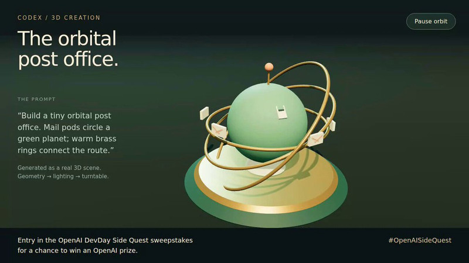</a></td>
</tr>
<tr>
<td width="50%" valign="top"><strong>A felt character: Sol and Opus with the same reference</strong> <a href="https://x.com/JakubAntowski">@JakubAntowski</a> · 3D &amp; interactive 0:20 · Bookmarks 0 · Details pending <a href="https://guanmo-ai.github.io/awesome-ai-motion/?lang=en#case-2105245039521628213">▶ Play</a> · <a href="https://x.com/JakubAntowski/status/2105245039521628213">Original post</a></td>
<td width="50%" valign="top"><strong>The orbital post office: a brass-and-planet world</strong> <a href="https://x.com/allenrokxlate">@allenrokxlate</a> · 3D &amp; interactive 0:24 · Bookmarks 0 · Details pending <a href="https://x.com/allenrokxlate/status/2106040262245896675">▶ Watch on X</a> · <a href="https://x.com/allenrokxlate/status/2106040262245896675">Original post</a></td>
</tr>
</tbody>
<tbody>
<tr>
<td width="50%" height="225" align="center" valign="middle"></td>
<td width="50%" height="225" align="center" valign="middle"></td>
</tr>
<tr>
<td width="50%" valign="top"><strong>Wareflow: a strategy-game-style warehouse interface</strong> <a href="https://x.com/DilumSanjaya">@DilumSanjaya</a> · 3D &amp; interactive 1:12 · Bookmarks 10,714 · Details pending <a href="https://guanmo-ai.github.io/awesome-ai-motion/?lang=en#case-2106426962738880879">▶ Play</a> · <a href="https://x.com/DilumSanjaya/status/2106426962738880879">Original post</a></td>
<td width="50%" valign="top"><strong>Spiderbench: Swinging Through a Browser City</strong> <a href="https://x.com/xikhar">@xikhar</a> · 3D &amp; interactive 2:21 · Bookmarks 3,777 · Details pending <a href="https://guanmo-ai.github.io/awesome-ai-motion/?lang=en#case-2104001664793600012">▶ Play</a> · <a href="https://x.com/xikhar/status/2104001664793600012">Original post</a></td>
</tr>
</tbody>
<tbody>
<tr>
<td width="50%" height="225" align="center" valign="middle"></td>
<td width="50%" height="225" align="center" valign="middle"></td>
</tr>
<tr>
<td width="50%" valign="top"><strong>Blender Recreation of a Conference Clip</strong> <a href="https://x.com/petergostev">@petergostev</a> · 3D &amp; interactive 0:20 · Bookmarks 3,710 · Details pending <a href="https://guanmo-ai.github.io/awesome-ai-motion/?lang=en#case-2096264296099459079">▶ Play</a> · <a href="https://x.com/petergostev/status/2096264296099459079">Original post</a></td>
<td width="50%" valign="top"><strong>Sketch Becomes a 3D Steam Train</strong> <a href="https://x.com/tomkrcha">@tomkrcha</a> · 3D &amp; interactive 0:34 · Bookmarks 3,540 · Details pending <a href="https://guanmo-ai.github.io/awesome-ai-motion/?lang=en#case-2095756085890310311">▶ Play</a> · <a href="https://x.com/tomkrcha/status/2095756085890310311">Original post</a></td>
</tr>
</tbody>
<tbody>
<tr>
<td width="50%" height="225" align="center" valign="middle"></td>
<td width="50%" height="225" align="center" valign="middle"></td>
</tr>
<tr>
<td width="50%" valign="top"><strong>Clearwater: real-time shallow water and interactive ripples</strong> <a href="https://x.com/Aurelien_Gz">@Aurelien_Gz</a> · 3D &amp; interactive 0:27 · Bookmarks 2,612 <a href="https://guanmo-ai.github.io/awesome-ai-motion/?lang=en#case-2102786378282987591">▶ Play</a> · <a href="https://x.com/Aurelien_Gz/status/2102786378282987591">Original post</a></td>
<td width="50%" valign="top"><strong>Antikythera underwater game demo</strong> <a href="https://x.com/edwinarbus">@edwinarbus</a> · 3D &amp; interactive 1:00 · Bookmarks 1,701 · Details pending <a href="https://guanmo-ai.github.io/awesome-ai-motion/?lang=en#case-2102463453176979794">▶ Play</a> · <a href="https://x.com/edwinarbus/status/2102463453176979794">Original post</a></td>
</tr>
</tbody>
<tbody>
<tr>
<td width="50%" height="225" align="center" valign="middle"><a href="https://guanmo-ai.github.io/awesome-ai-motion/?lang=en#case-2107996576228753545">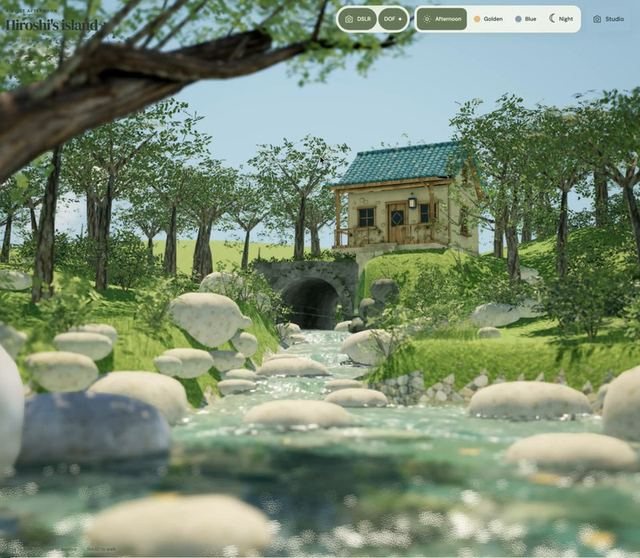</a></td>
<td width="50%" height="225" align="center" valign="middle"><a href="https://guanmo-ai.github.io/awesome-ai-motion/?lang=en#case-2106835487365419479">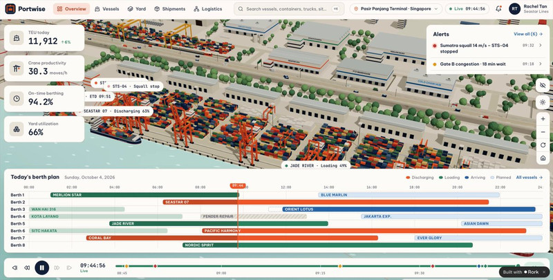</a></td>
</tr>
<tr>
<td width="50%" valign="top"><strong>Cozy Creek: a Browser Woodland Stream</strong> <a href="https://x.com/chetanankola">@chetanankola</a> · 3D &amp; interactive 0:59 · Bookmarks 1,559 · Details pending <a href="https://guanmo-ai.github.io/awesome-ai-motion/?lang=en#case-2107996576228753545">▶ Play</a> · <a href="https://x.com/chetanankola/status/2107996576228753545">Original post</a></td>
<td width="50%" valign="top"><strong>Logistics management as a strategy interface</strong> <a href="https://x.com/alexcooldev">@alexcooldev</a> · 3D &amp; interactive 1:14 · Bookmarks 1,343 · Details pending <a href="https://guanmo-ai.github.io/awesome-ai-motion/?lang=en#case-2106835487365419479">▶ Play</a> · <a href="https://x.com/alexcooldev/status/2106835487365419479">Original post</a></td>
</tr>
</tbody>
<tbody>
<tr>
<td width="50%" height="225" align="center" valign="middle"></td>
<td width="50%" height="225" align="center" valign="middle"><a href="https://guanmo-ai.github.io/awesome-ai-motion/?lang=en#case-2106313584829431901">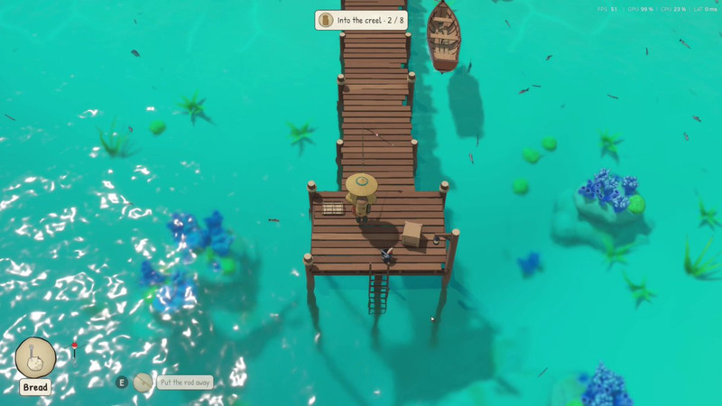</a></td>
</tr>
<tr>
<td width="50%" valign="top"><strong>Code-Rendered Mountain Stream</strong> <a href="https://x.com/hayashimon1">@hayashimon1</a> · 3D &amp; interactive 0:15 · Bookmarks 1,188 · Details pending <a href="https://guanmo-ai.github.io/awesome-ai-motion/?lang=en#case-2102576886182453454">▶ Play</a> · <a href="https://x.com/hayashimon1/status/2102576886182453454">Original post</a></td>
<td width="50%" valign="top"><strong>I Just Wanted to Fish: a fishing game demonstration</strong> <a href="https://x.com/ForkedPush">@ForkedPush</a> · 3D &amp; interactive 2:42 · Bookmarks 1,096 · Details pending <a href="https://guanmo-ai.github.io/awesome-ai-motion/?lang=en#case-2106313584829431901">▶ Play</a> · <a href="https://x.com/ForkedPush/status/2106313584829431901">Original post</a></td>
</tr>
</tbody>
<tbody>
<tr>
<td width="50%" height="225" align="center" valign="middle"></td>
<td width="50%" height="225" align="center" valign="middle"><a href="https://guanmo-ai.github.io/awesome-ai-motion/?lang=en#case-2106387548486738010">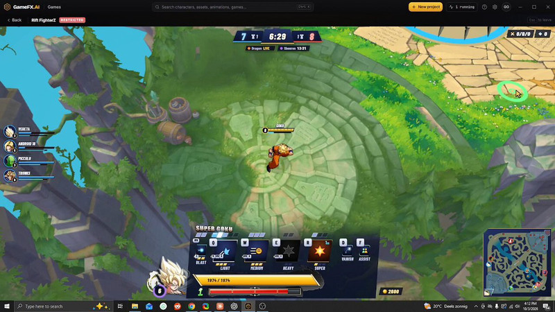</a></td>
</tr>
<tr>
<td width="50%" valign="top"><strong>Catapult sketch becomes a simulation</strong> <a href="https://x.com/poolio">@poolio</a> · 3D &amp; interactive 1:20 · Bookmarks 1,073 · Details pending <a href="https://guanmo-ai.github.io/awesome-ai-motion/?lang=en#case-2102445641205248145">▶ Play</a> · <a href="https://x.com/poolio/status/2102445641205248145">Original post</a></td>
<td width="50%" valign="top"><strong>An experiment combining MOBA and fighting-game mechanics</strong> <a href="https://x.com/GamefxAI">@GamefxAI</a> · 3D &amp; interactive 1:43 · Bookmarks 1,009 · Details pending <a href="https://guanmo-ai.github.io/awesome-ai-motion/?lang=en#case-2106387548486738010">▶ Play</a> · <a href="https://x.com/GamefxAI/status/2106387548486738010">Original post</a></td>
</tr>
</tbody>
<tbody>
<tr>
<td width="50%" height="225" align="center" valign="middle"><a href="https://guanmo-ai.github.io/awesome-ai-motion/?lang=en#case-2107804983416467598">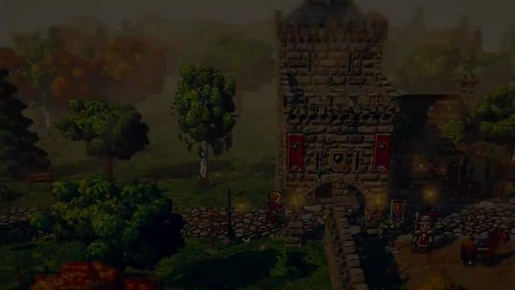</a></td>
<td width="50%" height="225" align="center" valign="middle"></td>
</tr>
<tr>
<td width="50%" valign="top"><strong>A Code-generated HD-2D Pixel Game</strong> <a href="https://x.com/hakimieiqbal">@hakimieiqbal</a> · 3D &amp; interactive 1:20 · Bookmarks 879 · Details pending <a href="https://guanmo-ai.github.io/awesome-ai-motion/?lang=en#case-2107804983416467598">▶ Play</a> · <a href="https://x.com/hakimieiqbal/status/2107804983416467598">Original post</a></td>
<td width="50%" valign="top"><strong>Two model procedural Blender shots</strong> <a href="https://x.com/Stefan_3D_AI">@Stefan_3D_AI</a> · 3D &amp; interactive 0:46 · Bookmarks 773 · Details pending <a href="https://guanmo-ai.github.io/awesome-ai-motion/?lang=en#case-2102471841046786153">▶ Play</a> · <a href="https://x.com/Stefan_3D_AI/status/2102471841046786153">Original post</a></td>
</tr>
</tbody>
<tbody>
<tr>
<td width="50%" height="225" align="center" valign="middle"><a href="https://guanmo-ai.github.io/awesome-ai-motion/?lang=en#case-2107022944916709886">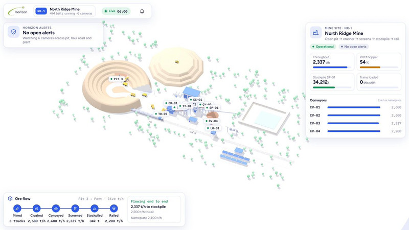</a></td>
<td width="50%" height="225" align="center" valign="middle"></td>
</tr>
<tr>
<td width="50%" valign="top"><strong>Mine management as a strategy interface</strong> <a href="https://x.com/tradphi">@tradphi</a> · 3D &amp; interactive 0:30 · Bookmarks 738 · Details pending <a href="https://guanmo-ai.github.io/awesome-ai-motion/?lang=en#case-2107022944916709886">▶ Play</a> · <a href="https://x.com/tradphi/status/2107022944916709886">Original post</a></td>
<td width="50%" valign="top"><strong>Procedural Buildings: From Blender Nodes to the Web</strong> <a href="https://x.com/chirovisuals">@chirovisuals</a> · 3D &amp; interactive 1:15 · Bookmarks 673 · Details pending <a href="https://guanmo-ai.github.io/awesome-ai-motion/?lang=en#case-2104548658171834749">▶ Play</a> · <a href="https://x.com/chirovisuals/status/2104548658171834749">Original post</a></td>
</tr>
</tbody>
<tbody>
<tr>
<td width="50%" height="225" align="center" valign="middle"></td>
<td width="50%" height="225" align="center" valign="middle"></td>
</tr>
<tr>
<td width="50%" valign="top"><strong>3D Character Acting Experiment</strong> <a href="https://x.com/manaimovie">@manaimovie</a> · 3D &amp; interactive 0:05 · Bookmarks 618 · Details pending <a href="https://guanmo-ai.github.io/awesome-ai-motion/?lang=en#case-2103138089790996843">▶ Play</a> · <a href="https://x.com/manaimovie/status/2103138089790996843">Original post</a></td>
<td width="50%" valign="top"><strong>Code-Built Dragon Ship Scene</strong> <a href="https://x.com/MengTo">@MengTo</a> · 3D &amp; interactive 1:08 · Bookmarks 617 · Details pending <a href="https://guanmo-ai.github.io/awesome-ai-motion/?lang=en#case-2103122947133309311">▶ Play</a> · <a href="https://x.com/MengTo/status/2103122947133309311">Original post</a></td>
</tr>
</tbody>
<tbody>
<tr>
<td width="50%" height="225" align="center" valign="middle"></td>
<td width="50%" height="225" align="center" valign="middle"><a href="https://guanmo-ai.github.io/awesome-ai-motion/?lang=en#case-2107752774423511539">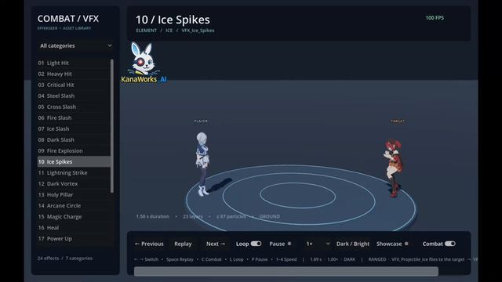</a></td>
</tr>
<tr>
<td width="50%" valign="top"><strong>A Draggable Black Hole Lab for Gravitational Lensing</strong> <a href="https://x.com/Voxyz_ai">@Voxyz_ai</a> · 3D &amp; interactive 0:22 · Bookmarks 468 · Details pending <a href="https://guanmo-ai.github.io/awesome-ai-motion/?lang=en#case-2103117246860345550">▶ Play</a> · <a href="https://x.com/Voxyz_ai/status/2103117246860345550">Original post</a></td>
<td width="50%" valign="top"><strong>A VFX Iteration Demo with Effekseer and Godot</strong> <a href="https://x.com/KanaWorks_AI">@KanaWorks_AI</a> · 3D &amp; interactive 0:32 · Bookmarks 463 · Details pending <a href="https://guanmo-ai.github.io/awesome-ai-motion/?lang=en#case-2107752774423511539">▶ Play</a> · <a href="https://x.com/KanaWorks_AI/status/2107752774423511539">Original post</a></td>
</tr>
</tbody>
<tbody>
<tr>
<td width="50%" height="225" align="center" valign="middle"><a href="https://guanmo-ai.github.io/awesome-ai-motion/?lang=en#case-2106604492728967620">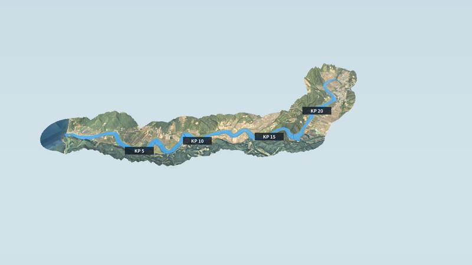</a></td>
<td width="50%" height="225" align="center" valign="middle"></td>
</tr>
<tr>
<td width="50%" valign="top"><strong>A 3D visualization of river-flow calculations</strong> <a href="https://x.com/dobokuya77">@dobokuya77</a> · 3D &amp; interactive 0:46 · Bookmarks 426 · Details pending <a href="https://guanmo-ai.github.io/awesome-ai-motion/?lang=en#case-2106604492728967620">▶ Play</a> · <a href="https://x.com/dobokuya77/status/2106604492728967620">Original post</a></td>
<td width="50%" valign="top"><strong>An Interactive 3D Tour Inside a Data Center</strong> <a href="https://x.com/RyanSael">@RyanSael</a> · 3D &amp; interactive 0:34 · Bookmarks 425 · Details pending <a href="https://guanmo-ai.github.io/awesome-ai-motion/?lang=en#case-2102740041621762166">▶ Play</a> · <a href="https://x.com/RyanSael/status/2102740041621762166">Original post</a></td>
</tr>
</tbody>
<tbody>
<tr>
<td width="50%" height="225" align="center" valign="middle"></td>
<td width="50%" height="225" align="center" valign="middle"><a href="https://guanmo-ai.github.io/awesome-ai-motion/?lang=en#case-2105990418886480092">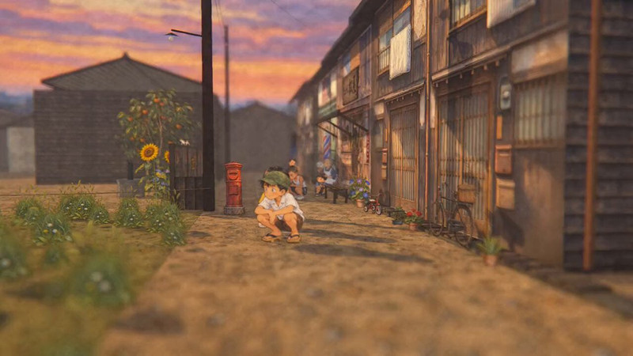</a></td>
</tr>
<tr>
<td width="50%" valign="top"><strong>Rebuilding a 1906 San Francisco Street</strong> <a href="https://x.com/alexalbert__">@alexalbert__</a> · 3D &amp; interactive 0:08 · Bookmarks 418 · Details pending <a href="https://guanmo-ai.github.io/awesome-ai-motion/?lang=en#case-2102466523164274839">▶ Play</a> · <a href="https://x.com/alexalbert__/status/2102466523164274839">Original post</a></td>
<td width="50%" valign="top"><strong>Sunset Alley: a watercolor miniature world</strong> <a href="https://x.com/akakuma0219">@akakuma0219</a> · 3D &amp; interactive 0:45 · Bookmarks 399 · Details pending <a href="https://guanmo-ai.github.io/awesome-ai-motion/?lang=en#case-2105990418886480092">▶ Play</a> · <a href="https://x.com/akakuma0219/status/2105990418886480092">Original post</a></td>
</tr>
</tbody>
<tbody>
<tr>
<td width="50%" height="225" align="center" valign="middle"></td>
<td width="50%" height="225" align="center" valign="middle"><a href="https://guanmo-ai.github.io/awesome-ai-motion/?lang=en#case-2106684612822896770">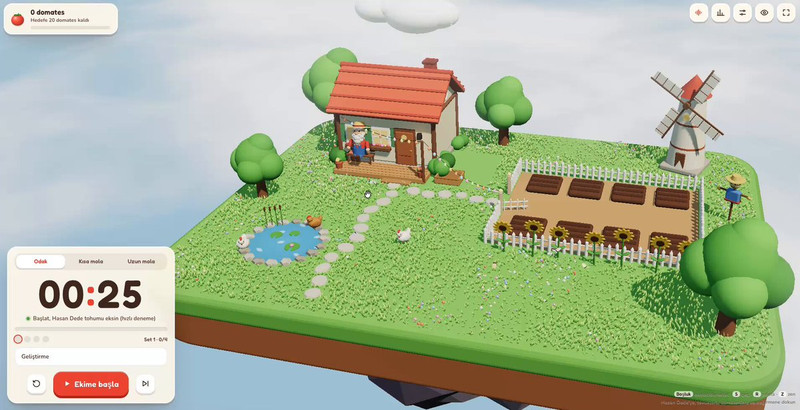</a></td>
</tr>
<tr>
<td width="50%" valign="top"><strong>A Starry Night Town with Flowing Brushstrokes</strong> <a href="https://x.com/simonxxoo">@simonxxoo</a> · 3D &amp; interactive 1:52 · Bookmarks 391 · Details pending <a href="https://guanmo-ai.github.io/awesome-ai-motion/?lang=en#case-2107793610230075416">▶ Play</a> · <a href="https://x.com/simonxxoo/status/2107793610230075416">Original post</a></td>
<td width="50%" valign="top"><strong>A tomato-growing Pomodoro timer</strong> <a href="https://x.com/ayhankorkmaz_">@ayhankorkmaz_</a> · 3D &amp; interactive 1:28 · Bookmarks 349 · Details pending <a href="https://guanmo-ai.github.io/awesome-ai-motion/?lang=en#case-2106684612822896770">▶ Play</a> · <a href="https://x.com/ayhankorkmaz_/status/2106684612822896770">Original post</a></td>
</tr>
</tbody>
<tbody>
<tr>
<td width="50%" height="225" align="center" valign="middle"><a href="https://guanmo-ai.github.io/awesome-ai-motion/?lang=en#case-2106375041269342691">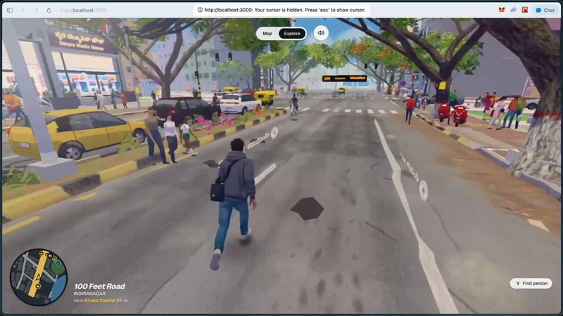</a></td>
<td width="50%" height="225" align="center" valign="middle"></td>
</tr>
<tr>
<td width="50%" valign="top"><strong>A GTA-style Bangalore neighborhood game prototype</strong> <a href="https://x.com/0xaxit">@0xaxit</a> · 3D &amp; interactive 1:01 · Bookmarks 299 · Details pending <a href="https://guanmo-ai.github.io/awesome-ai-motion/?lang=en#case-2106375041269342691">▶ Play</a> · <a href="https://x.com/0xaxit/status/2106375041269342691">Original post</a></td>
<td width="50%" valign="top"><strong>Blender exoskeleton redesign</strong> <a href="https://x.com/higgsfield_ai">@higgsfield_ai</a> · 3D &amp; interactive 0:29 · Bookmarks 298 · Details pending <a href="https://guanmo-ai.github.io/awesome-ai-motion/?lang=en#case-2102449278283313303">▶ Play</a> · <a href="https://x.com/higgsfield_ai/status/2102449278283313303">Original post</a></td>
</tr>
</tbody>
<tbody>
<tr>
<td width="50%" height="225" align="center" valign="middle"></td>
<td width="50%" height="225" align="center" valign="middle"><a href="https://guanmo-ai.github.io/awesome-ai-motion/?lang=en#case-2106493673425047896">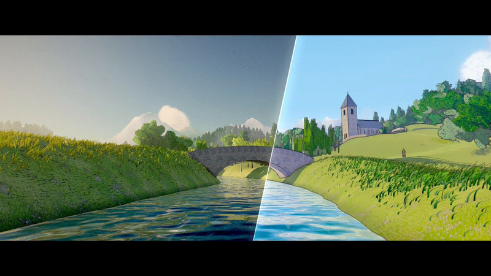</a></td>
</tr>
<tr>
<td width="50%" valign="top"><strong>Blender 3D Shot Experiment</strong> <a href="https://x.com/superalesha">@superalesha</a> · 3D &amp; interactive 1:01 · Bookmarks 285 · Details pending <a href="https://guanmo-ai.github.io/awesome-ai-motion/?lang=en#case-2102487989381156991">▶ Play</a> · <a href="https://x.com/superalesha/status/2102487989381156991">Original post</a></td>
<td width="50%" valign="top"><strong>Hollowmere: an explorable 3D world in five styles</strong> <a href="https://x.com/LexnLin">@LexnLin</a> · 3D &amp; interactive 0:41 · Bookmarks 259 · Details pending <a href="https://guanmo-ai.github.io/awesome-ai-motion/?lang=en#case-2106493673425047896">▶ Play</a> · <a href="https://x.com/LexnLin/status/2106493673425047896">Original post</a></td>
</tr>
</tbody>
<tbody>
<tr>
<td width="50%" height="225" align="center" valign="middle"></td>
<td width="50%" height="225" align="center" valign="middle"></td>
</tr>
<tr>
<td width="50%" valign="top"><strong>3D creature rig and animation test</strong> <a href="https://x.com/Stefan_3D_AI">@Stefan_3D_AI</a> · 3D &amp; interactive 0:25 · Bookmarks 256 · Details pending <a href="https://guanmo-ai.github.io/awesome-ai-motion/?lang=en#case-2102641562824135022">▶ Play</a> · <a href="https://x.com/Stefan_3D_AI/status/2102641562824135022">Original post</a></td>
<td width="50%" valign="top"><strong>Blender windmill build and animation</strong> <a href="https://x.com/higgsfield_ai">@higgsfield_ai</a> · 3D &amp; interactive 0:21 · Bookmarks 223 · Details pending <a href="https://guanmo-ai.github.io/awesome-ai-motion/?lang=en#case-2102453658889953717">▶ Play</a> · <a href="https://x.com/higgsfield_ai/status/2102453658889953717">Original post</a></td>
</tr>
</tbody>
<tbody>
<tr>
<td width="50%" height="225" align="center" valign="middle"><a href="https://guanmo-ai.github.io/awesome-ai-motion/?lang=en#case-2106527292633825693">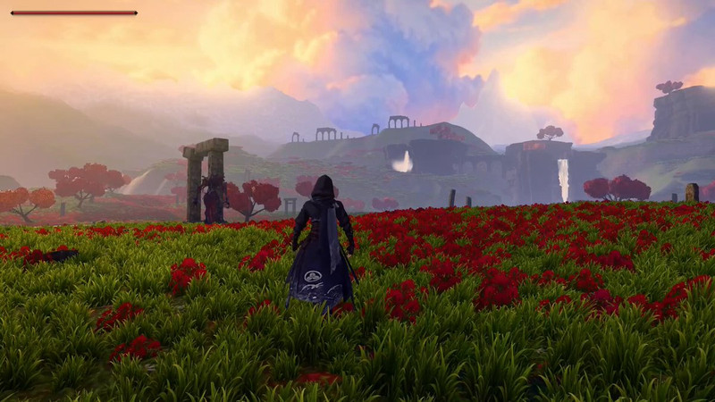</a></td>
<td width="50%" height="225" align="center" valign="middle"></td>
</tr>
<tr>
<td width="50%" valign="top"><strong>A 3D game prototype built around Tripo models</strong> <a href="https://x.com/xikhar">@xikhar</a> · 3D &amp; interactive 0:50 · Bookmarks 213 · Details pending <a href="https://guanmo-ai.github.io/awesome-ai-motion/?lang=en#case-2106527292633825693">▶ Play</a> · <a href="https://x.com/xikhar/status/2106527292633825693">Original post</a></td>
<td width="50%" valign="top"><strong>From realism to an impressionist WebGPU world</strong> <a href="https://x.com/gruberbuilds">@gruberbuilds</a> · 3D &amp; interactive 1:34 · Bookmarks 201 · Details pending <a href="https://guanmo-ai.github.io/awesome-ai-motion/?lang=en#case-2107285581109547516">▶ Play</a> · <a href="https://x.com/gruberbuilds/status/2107285581109547516">Original post</a></td>
</tr>
</tbody>
<tbody>
<tr>
<td width="50%" height="225" align="center" valign="middle"><a href="https://guanmo-ai.github.io/awesome-ai-motion/?lang=en#case-2107159129420964343">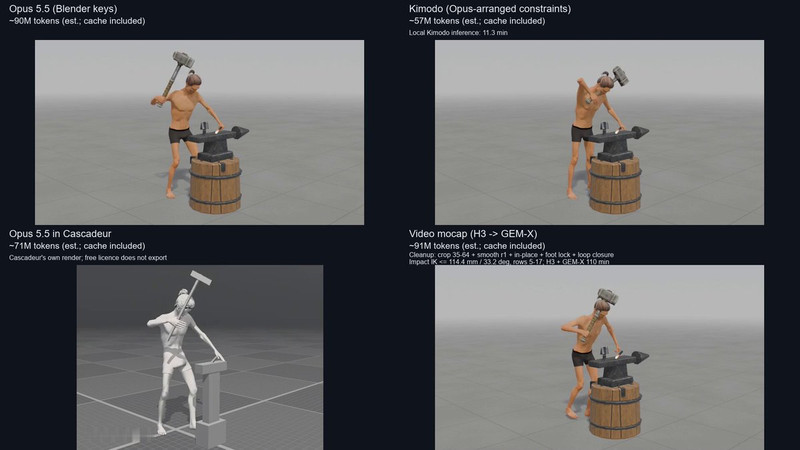</a></td>
<td width="50%" height="225" align="center" valign="middle"></td>
</tr>
<tr>
<td width="50%" valign="top"><strong>Four AI humanoid-animation pipelines</strong> <a href="https://x.com/nazimadakli">@nazimadakli</a> · 3D &amp; interactive 0:12 · Bookmarks 175 · Details pending <a href="https://guanmo-ai.github.io/awesome-ai-motion/?lang=en#case-2107159129420964343">▶ Play</a> · <a href="https://x.com/nazimadakli/status/2107159129420964343">Original post</a></td>
<td width="50%" valign="top"><strong>An Explorable Fusion Reactor</strong> <a href="https://x.com/konstantinsaifo">@konstantinsaifo</a> · 3D &amp; interactive 0:43 · Bookmarks 174 · Details pending <a href="https://guanmo-ai.github.io/awesome-ai-motion/?lang=en#case-2104216976801587629">▶ Play</a> · <a href="https://x.com/konstantinsaifo/status/2104216976801587629">Original post</a></td>
</tr>
</tbody>
<tbody>
<tr>
<td width="50%" height="225" align="center" valign="middle"></td>
<td width="50%" height="225" align="center" valign="middle"><a href="https://guanmo-ai.github.io/awesome-ai-motion/?lang=en#case-2106656783221899534">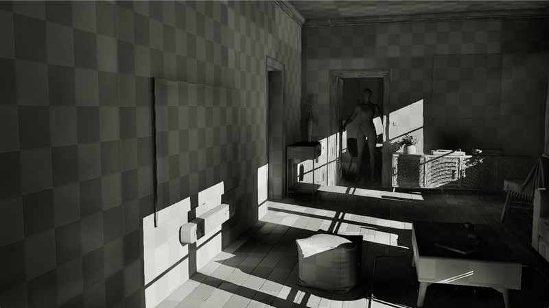</a></td>
</tr>
<tr>
<td width="50%" valign="top"><strong>Voxel Self-Portrait of an AI Model</strong> <a href="https://x.com/blueemi99">@blueemi99</a> · 3D &amp; interactive 0:15 · Bookmarks 171 · Details pending <a href="https://guanmo-ai.github.io/awesome-ai-motion/?lang=en#case-2102511304456212763">▶ Play</a> · <a href="https://x.com/blueemi99/status/2102511304456212763">Original post</a></td>
<td width="50%" valign="top"><strong>An LLM body-control experiment in Unreal</strong> <a href="https://x.com/L_ARCH_01">@L_ARCH_01</a> · 3D &amp; interactive 0:22 · Bookmarks 167 · Details pending <a href="https://guanmo-ai.github.io/awesome-ai-motion/?lang=en#case-2106656783221899534">▶ Play</a> · <a href="https://x.com/L_ARCH_01/status/2106656783221899534">Original post</a></td>
</tr>
</tbody>
<tbody>
<tr>
<td width="50%" height="225" align="center" valign="middle"></td>
<td width="50%" height="225" align="center" valign="middle"></td>
</tr>
<tr>
<td width="50%" valign="top"><strong>A Fragment-shader RISC-V Emulator in VRChat</strong> <a href="https://x.com/Michael_Moroz_">@Michael_Moroz_</a> · 3D &amp; interactive 3:11 · Bookmarks 163 · Details pending <a href="https://guanmo-ai.github.io/awesome-ai-motion/?lang=en#case-2107713497224130638">▶ Play</a> · <a href="https://x.com/Michael_Moroz_/status/2107713497224130638">Original post</a></td>
<td width="50%" valign="top"><strong>Iterating a sunset-harbor game scene</strong> <a href="https://x.com/prasenx">@prasenx</a> · 3D &amp; interactive 5:20 · Bookmarks 147 · Details pending <a href="https://guanmo-ai.github.io/awesome-ai-motion/?lang=en#case-2107451914954911838">▶ Play</a> · <a href="https://x.com/prasenx/status/2107451914954911838">Original post</a></td>
</tr>
</tbody>
<tbody>
<tr>
<td width="50%" height="225" align="center" valign="middle"></td>
<td width="50%" height="225" align="center" valign="middle"><a href="https://guanmo-ai.github.io/awesome-ai-motion/?lang=en#case-2107973550300856334">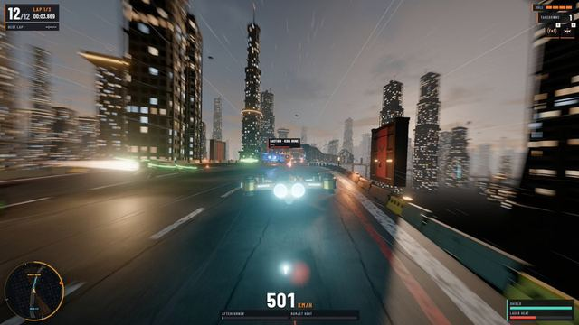</a></td>
</tr>
<tr>
<td width="50%" valign="top"><strong>Floorplan Design: From 2D Layout to 3D Walkthrough</strong> <a href="https://x.com/akokoi1">@akokoi1</a> · 3D &amp; interactive 0:33 · Bookmarks 137 · Details pending <a href="https://guanmo-ai.github.io/awesome-ai-motion/?lang=en#case-2104520072014508316">▶ Play</a> · <a href="https://x.com/akokoi1/status/2104520072014508316">Original post</a></td>
<td width="50%" valign="top"><strong>Heatsink: a City Drone Racing Game</strong> <a href="https://x.com/aniketjart">@aniketjart</a> · 3D &amp; interactive 0:27 · Bookmarks 109 · Details pending <a href="https://guanmo-ai.github.io/awesome-ai-motion/?lang=en#case-2107973550300856334">▶ Play</a> · <a href="https://x.com/aniketjart/status/2107973550300856334">Original post</a></td>
</tr>
</tbody>
<tbody>
<tr>
<td width="50%" height="225" align="center" valign="middle"><a href="https://guanmo-ai.github.io/awesome-ai-motion/?lang=en#case-2107417865406324750">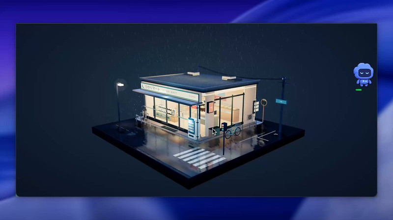</a></td>
<td width="50%" height="225" align="center" valign="middle"><a href="https://guanmo-ai.github.io/awesome-ai-motion/?lang=en#case-2106307854085029889">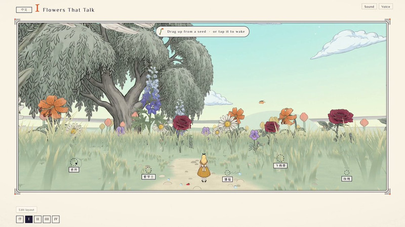</a></td>
</tr>
<tr>
<td width="50%" valign="top"><strong>An interactive miniature convenience store</strong> <a href="https://x.com/beefnoode">@beefnoode</a> · 3D &amp; interactive 0:13 · Bookmarks 100 · Details pending <a href="https://guanmo-ai.github.io/awesome-ai-motion/?lang=en#case-2107417865406324750">▶ Play</a> · <a href="https://x.com/beefnoode/status/2107417865406324750">Original post</a></td>
<td width="50%" valign="top"><strong>Through the Looking-Glass: the Garden of Live Flowers</strong> <a href="https://x.com/ring_hyacinth">@ring_hyacinth</a> · 3D &amp; interactive 1:55 · Bookmarks 99 · Details pending <a href="https://guanmo-ai.github.io/awesome-ai-motion/?lang=en#case-2106307854085029889">▶ Play</a> · <a href="https://x.com/ring_hyacinth/status/2106307854085029889">Original post</a></td>
</tr>
</tbody>
<tbody>
<tr>
<td width="50%" height="225" align="center" valign="middle"><a href="https://guanmo-ai.github.io/awesome-ai-motion/?lang=en#case-2107752275980476558">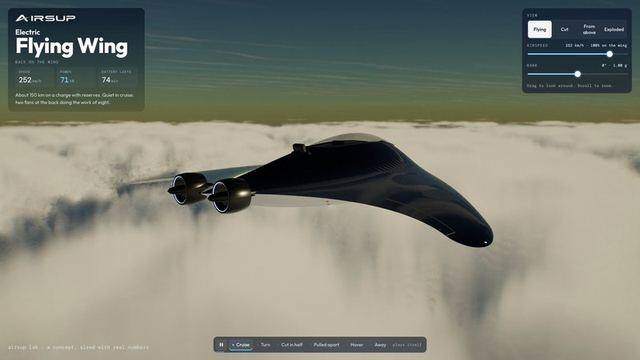</a></td>
<td width="50%" height="225" align="center" valign="middle"></td>
</tr>
<tr>
<td width="50%" valign="top"><strong>Flying Wing: an Aircraft Cutaway</strong> <a href="https://x.com/konstantinsaifo">@konstantinsaifo</a> · 3D &amp; interactive 0:43 · Bookmarks 87 · Details pending <a href="https://guanmo-ai.github.io/awesome-ai-motion/?lang=en#case-2107752275980476558">▶ Play</a> · <a href="https://x.com/konstantinsaifo/status/2107752275980476558">Original post</a></td>
<td width="50%" valign="top"><strong>Rocket-Powered Car Soccer in the Browser</strong> <a href="https://x.com/BlendiByl">@BlendiByl</a> · 3D &amp; interactive 0:39 · Bookmarks 83 · Details pending <a href="https://guanmo-ai.github.io/awesome-ai-motion/?lang=en#case-2104800823620632641">▶ Play</a> · <a href="https://x.com/BlendiByl/status/2104800823620632641">Original post</a></td>
</tr>
</tbody>
<tbody>
<tr>
<td width="50%" height="225" align="center" valign="middle"><a href="https://guanmo-ai.github.io/awesome-ai-motion/?lang=en#case-2108369354991759658">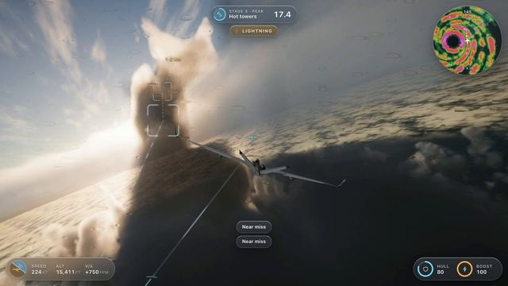</a></td>
<td width="50%" height="225" align="center" valign="middle"><a href="https://guanmo-ai.github.io/awesome-ai-motion/?lang=en#case-2108368534963413293">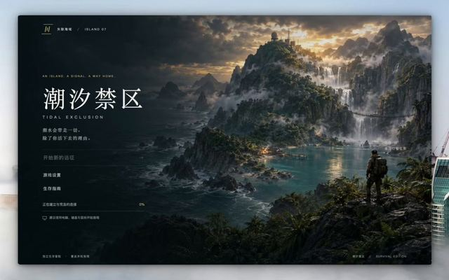</a></td>
</tr>
<tr>
<td width="50%" valign="top"><strong>A 3D Flight Game through a Hurricane</strong> <a href="https://x.com/techartist_">@techartist_</a> · 3D &amp; interactive 0:21 · Bookmarks 82 · Details pending <a href="https://guanmo-ai.github.io/awesome-ai-motion/?lang=en#case-2108369354991759658">▶ Play</a> · <a href="https://x.com/techartist_/status/2108369354991759658">Original post</a></td>
<td width="50%" valign="top"><strong>A Multi-tool Island-hunting Prototype</strong> <a href="https://x.com/yyyole">@yyyole</a> · 3D &amp; interactive 1:04 · Bookmarks 76 · Details pending <a href="https://guanmo-ai.github.io/awesome-ai-motion/?lang=en#case-2108368534963413293">▶ Play</a> · <a href="https://x.com/yyyole/status/2108368534963413293">Original post</a></td>
</tr>
</tbody>
<tbody>
<tr>
<td width="50%" height="225" align="center" valign="middle"></td>
<td width="50%" height="225" align="center" valign="middle"></td>
</tr>
<tr>
<td width="50%" valign="top"><strong>Procedural cartoon scene comparison</strong> <a href="https://x.com/Stefan_3D_AI">@Stefan_3D_AI</a> · 3D &amp; interactive 0:30 · Bookmarks 73 · Details pending <a href="https://guanmo-ai.github.io/awesome-ai-motion/?lang=en#case-2102623690152419633">▶ Play</a> · <a href="https://x.com/Stefan_3D_AI/status/2102623690152419633">Original post</a></td>
<td width="50%" valign="top"><strong>Transforming Electric Truck Animation</strong> <a href="https://x.com/scottstts">@scottstts</a> · 3D &amp; interactive 1:13 · Bookmarks 72 · Details pending <a href="https://guanmo-ai.github.io/awesome-ai-motion/?lang=en#case-2102539904274325540">▶ Play</a> · <a href="https://x.com/scottstts/status/2102539904274325540">Original post</a></td>
</tr>
</tbody>
<tbody>
<tr>
<td width="50%" height="225" align="center" valign="middle"><a href="https://guanmo-ai.github.io/awesome-ai-motion/?lang=en#case-2107020311380033949">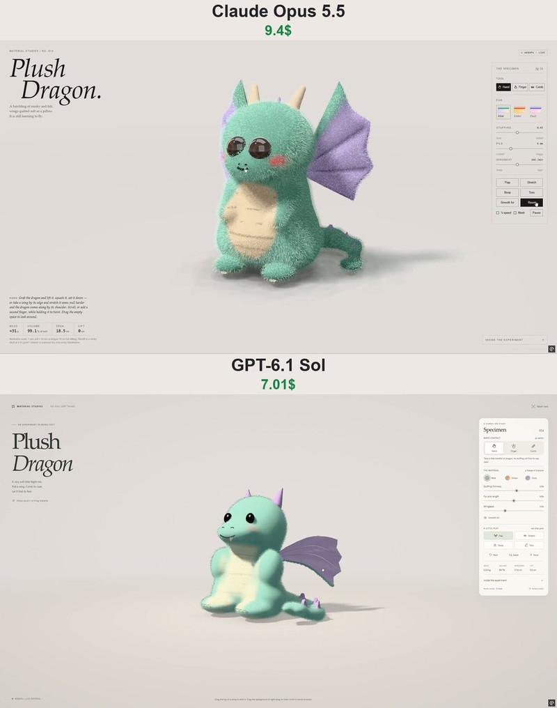</a></td>
<td width="50%" height="225" align="center" valign="middle"></td>
</tr>
<tr>
<td width="50%" valign="top"><strong>A combable soft-body dragon comparison</strong> <a href="https://x.com/vib3coded">@vib3coded</a> · 3D &amp; interactive 0:18 · Bookmarks 72 · Details pending <a href="https://guanmo-ai.github.io/awesome-ai-motion/?lang=en#case-2107020311380033949">▶ Play</a> · <a href="https://x.com/vib3coded/status/2107020311380033949">Original post</a></td>
<td width="50%" valign="top"><strong>Glowing jellyfish: a Claude and Sol comparison</strong> <a href="https://x.com/SPAC89">@SPAC89</a> · 3D &amp; interactive 0:20 · Bookmarks 69 · Details pending <a href="https://guanmo-ai.github.io/awesome-ai-motion/?lang=en#case-2105783511433318451">▶ Play</a> · <a href="https://x.com/SPAC89/status/2105783511433318451">Original post</a></td>
</tr>
</tbody>
<tbody>
<tr>
<td width="50%" height="225" align="center" valign="middle"><a href="https://guanmo-ai.github.io/awesome-ai-motion/?lang=en#case-2108159853533466672">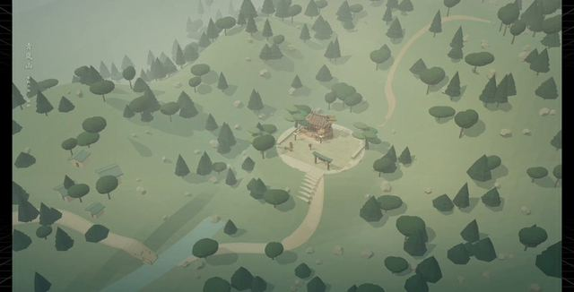</a></td>
<td width="50%" height="225" align="center" valign="middle"><a href="https://guanmo-ai.github.io/awesome-ai-motion/?lang=en#case-2106075623613694123">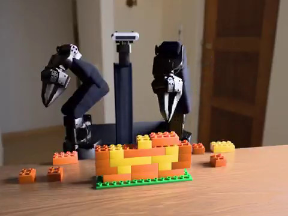</a></td>
</tr>
<tr>
<td width="50%" valign="top"><strong>A Wuxia ARPG from Character Topology to Combat</strong> <a href="https://x.com/cnyzgkc">@cnyzgkc</a> · 3D &amp; interactive 0:59 · Bookmarks 69 · Details pending <a href="https://guanmo-ai.github.io/awesome-ai-motion/?lang=en#case-2108159853533466672">▶ Play</a> · <a href="https://x.com/cnyzgkc/status/2108159853533466672">Original post</a></td>
<td width="50%" valign="top"><strong>A Halloween robot-control animation</strong> <a href="https://x.com/loganmb_">@loganmb_</a> · 3D &amp; interactive 0:31 · Bookmarks 66 · Details pending <a href="https://guanmo-ai.github.io/awesome-ai-motion/?lang=en#case-2106075623613694123">▶ Play</a> · <a href="https://x.com/loganmb_/status/2106075623613694123">Original post</a></td>
</tr>
</tbody>
<tbody>
<tr>
<td width="50%" height="225" align="center" valign="middle"><a href="https://guanmo-ai.github.io/awesome-ai-motion/?lang=en#case-2107938887679267180">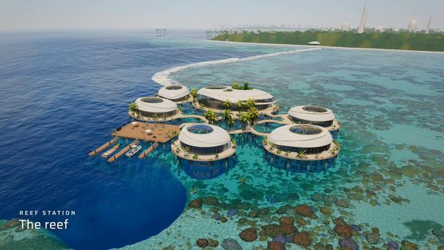</a></td>
<td width="50%" height="225" align="center" valign="middle"></td>
</tr>
<tr>
<td width="50%" valign="top"><strong>Reef Station: Water and Lighting in a Browser</strong> <a href="https://x.com/apekshik">@apekshik</a> · 3D &amp; interactive 0:40 · Bookmarks 66 · Details pending <a href="https://guanmo-ai.github.io/awesome-ai-motion/?lang=en#case-2107938887679267180">▶ Play</a> · <a href="https://x.com/apekshik/status/2107938887679267180">Original post</a></td>
<td width="50%" valign="top"><strong>3D Flyover Above Manhattan</strong> <a href="https://x.com/Dimillian">@Dimillian</a> · 3D &amp; interactive 0:10 · Bookmarks 58 · Details pending <a href="https://guanmo-ai.github.io/awesome-ai-motion/?lang=en#case-2096478021234426059">▶ Play</a> · <a href="https://x.com/Dimillian/status/2096478021234426059">Original post</a></td>
</tr>
</tbody>
<tbody>
<tr>
<td width="50%" height="225" align="center" valign="middle"></td>
<td width="50%" height="225" align="center" valign="middle"></td>
</tr>
<tr>
<td width="50%" valign="top"><strong>The Loom: a voxel-island landing-page experiment</strong> <a href="https://x.com/Mr_Salio">@Mr_Salio</a> · 3D &amp; interactive 0:45 · Bookmarks 52 · Details pending <a href="https://guanmo-ai.github.io/awesome-ai-motion/?lang=en#case-2105774088492916757">▶ Play</a> · <a href="https://x.com/Mr_Salio/status/2105774088492916757">Original post</a></td>
<td width="50%" valign="top"><strong>Explorable 3D eye demo</strong> <a href="https://x.com/higgsfield_ai">@higgsfield_ai</a> · 3D &amp; interactive 0:20 · Bookmarks 40 · Details pending <a href="https://guanmo-ai.github.io/awesome-ai-motion/?lang=en#case-2102536138884092185">▶ Play</a> · <a href="https://x.com/higgsfield_ai/status/2102536138884092185">Original post</a></td>
</tr>
</tbody>
<tbody>
<tr>
<td width="50%" height="225" align="center" valign="middle"></td>
<td width="50%" height="225" align="center" valign="middle"><a href="https://guanmo-ai.github.io/awesome-ai-motion/?lang=en#case-2106449409978626416">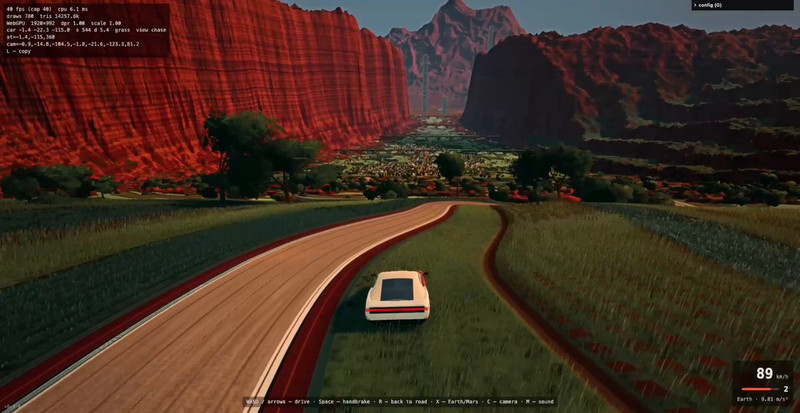</a></td>
</tr>
<tr>
<td width="50%" valign="top"><strong>Reference-Guided Blender Scene Build</strong> <a href="https://x.com/OriSilver">@OriSilver</a> · 3D &amp; interactive 0:28 · Bookmarks 34 · Details pending <a href="https://guanmo-ai.github.io/awesome-ai-motion/?lang=en#case-2102817977812824335">▶ Play</a> · <a href="https://x.com/OriSilver/status/2102817977812824335">Original post</a></td>
<td width="50%" valign="top"><strong>Mars GT: a driving demo through red canyons</strong> <a href="https://x.com/AndreiProvkin">@AndreiProvkin</a> · 3D &amp; interactive 1:06 · Bookmarks 33 · Details pending <a href="https://guanmo-ai.github.io/awesome-ai-motion/?lang=en#case-2106449409978626416">▶ Play</a> · <a href="https://x.com/AndreiProvkin/status/2106449409978626416">Original post</a></td>
</tr>
</tbody>
<tbody>
<tr>
<td width="50%" height="225" align="center" valign="middle"><a href="https://guanmo-ai.github.io/awesome-ai-motion/?lang=en#case-2108495368585371666">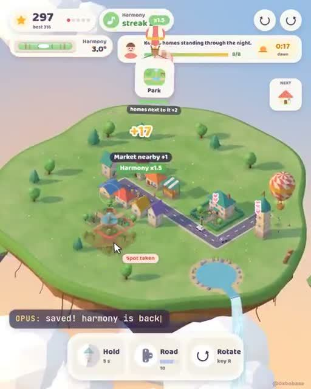</a></td>
<td width="50%" height="225" align="center" valign="middle"></td>
</tr>
<tr>
<td width="50%" valign="top"><strong>Skyhold: Balancing a Floating Island</strong> <a href="https://x.com/0xbobaaa">@0xbobaaa</a> · 3D &amp; interactive 0:45 · Bookmarks 20 · Details pending <a href="https://guanmo-ai.github.io/awesome-ai-motion/?lang=en#case-2108495368585371666">▶ Play</a> · <a href="https://x.com/0xbobaaa/status/2108495368585371666">Original post</a></td>
<td width="50%" valign="top"><strong>3D Seaside Cycling Scene</strong> <a href="https://x.com/liu8in">@liu8in</a> · 3D &amp; interactive 0:27 · Bookmarks 19 · Details pending <a href="https://guanmo-ai.github.io/awesome-ai-motion/?lang=en#case-2102528278732894667">▶ Play</a> · <a href="https://x.com/liu8in/status/2102528278732894667">Original post</a></td>
</tr>
</tbody>
<tbody>
<tr>
<td width="50%" height="225" align="center" valign="middle"><a href="https://guanmo-ai.github.io/awesome-ai-motion/?lang=en#case-2107455583129313304">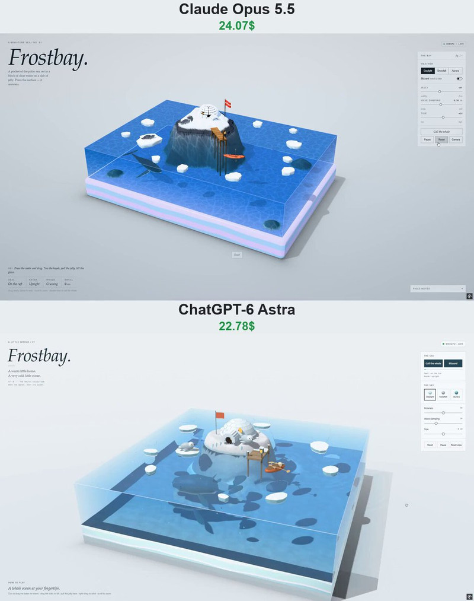</a></td>
<td width="50%" height="225" align="center" valign="middle"><a href="https://guanmo-ai.github.io/awesome-ai-motion/?lang=en#case-2107529401567207465">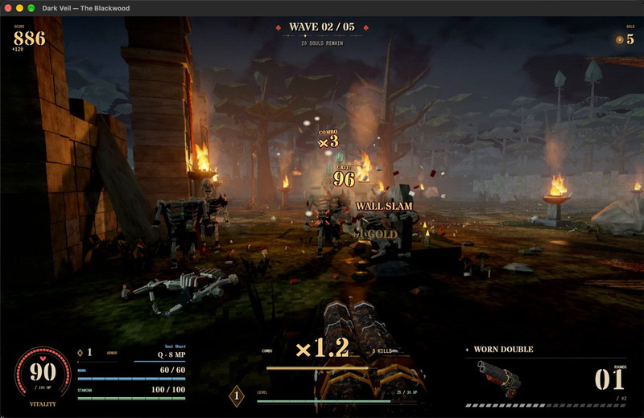</a></td>
</tr>
<tr>
<td width="50%" valign="top"><strong>Jelly World: an Arctic-island comparison</strong> <a href="https://x.com/vib3coded">@vib3coded</a> · 3D &amp; interactive 0:18 · Bookmarks 19 · Details pending <a href="https://guanmo-ai.github.io/awesome-ai-motion/?lang=en#case-2107455583129313304">▶ Play</a> · <a href="https://x.com/vib3coded/status/2107455583129313304">Original post</a></td>
<td width="50%" valign="top"><strong>A new HUD for an Astra-built Rust game</strong> <a href="https://x.com/Dimillian">@Dimillian</a> · 3D &amp; interactive 0:27 · Bookmarks 18 · Details pending <a href="https://guanmo-ai.github.io/awesome-ai-motion/?lang=en#case-2107529401567207465">▶ Play</a> · <a href="https://x.com/Dimillian/status/2107529401567207465">Original post</a></td>
</tr>
</tbody>
<tbody>
<tr>
<td width="50%" height="225" align="center" valign="middle"></td>
<td width="50%" height="225" align="center" valign="middle"></td>
</tr>
<tr>
<td width="50%" valign="top"><strong>A Horror Game Refined with Two Models</strong> <a href="https://x.com/LexnLin">@LexnLin</a> · 3D &amp; interactive 0:45 · Bookmarks 17 · Details pending <a href="https://guanmo-ai.github.io/awesome-ai-motion/?lang=en#case-2108301624515137601">▶ Play</a> · <a href="https://x.com/LexnLin/status/2108301624515137601">Original post</a></td>
<td width="50%" valign="top"><strong>Jelly sakura: Opus and Astra comparison</strong> <a href="https://x.com/Artless101">@Artless101</a> · 3D &amp; interactive 0:19 · Bookmarks 13 · Details pending <a href="https://guanmo-ai.github.io/awesome-ai-motion/?lang=en#case-2105559382150742523">▶ Play</a> · <a href="https://x.com/Artless101/status/2105559382150742523">Original post</a></td>
</tr>
</tbody>
<tbody>
<tr>
<td width="50%" height="225" align="center" valign="middle"></td>
<td width="50%" height="225" align="center" valign="middle"></td>
</tr>
<tr>
<td width="50%" valign="top"><strong>An interactive house from foundation to finish</strong> <a href="https://x.com/techartist_">@techartist_</a> · 3D &amp; interactive 0:37 · Bookmarks 13 · Details pending <a href="https://guanmo-ai.github.io/awesome-ai-motion/?lang=en#case-2105350783416021472">▶ Play</a> · <a href="https://x.com/techartist_/status/2105350783416021472">Original post</a></td>
<td width="50%" valign="top"><strong>Three.js devices and a layer-based design tool</strong> <a href="https://x.com/MengTo">@MengTo</a> · 3D &amp; interactive 1:14 · Bookmarks 11 · Details pending <a href="https://guanmo-ai.github.io/awesome-ai-motion/?lang=en#case-2105680287854440715">▶ Play</a> · <a href="https://x.com/MengTo/status/2105680287854440715">Original post</a></td>
</tr>
</tbody>
<tbody>
<tr>
<td width="50%" height="225" align="center" valign="middle"></td>
<td width="50%" height="225" align="center" valign="middle"></td>
</tr>
<tr>
<td width="50%" valign="top"><strong>A Shaoshan 8 Locomotive on a Drivable Loop</strong> <a href="https://x.com/akokoi1">@akokoi1</a> · 3D &amp; interactive 0:31 · Bookmarks 10 · Details pending <a href="https://guanmo-ai.github.io/awesome-ai-motion/?lang=en#case-2104222017696469188">▶ Play</a> · <a href="https://x.com/akokoi1/status/2104222017696469188">Original post</a></td>
<td width="50%" valign="top"><strong>Real-Time Rendered Mech Shot</strong> <a href="https://x.com/wizardbrainz">@wizardbrainz</a> · 3D &amp; interactive 0:24 · Bookmarks 10 · Details pending <a href="https://guanmo-ai.github.io/awesome-ai-motion/?lang=en#case-2102755328161116223">▶ Play</a> · <a href="https://x.com/wizardbrainz/status/2102755328161116223">Original post</a></td>
</tr>
</tbody>
<tbody>
<tr>
<td width="50%" height="225" align="center" valign="middle"></td>
<td width="50%" height="225" align="center" valign="middle"><a href="https://guanmo-ai.github.io/awesome-ai-motion/?lang=en#case-2108302123553247742">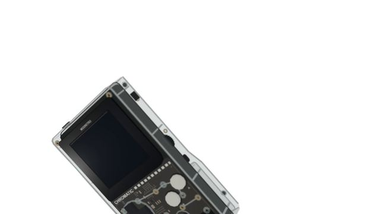</a></td>
</tr>
<tr>
<td width="50%" valign="top"><strong>Two Models Design a Dating-game UI</strong> <a href="https://x.com/yunma33331111">@yunma33331111</a> · 3D &amp; interactive 0:10 · Bookmarks 9 · Details pending <a href="https://guanmo-ai.github.io/awesome-ai-motion/?lang=en#case-2108168718308302855">▶ Play</a> · <a href="https://x.com/yunma33331111/status/2108168718308302855">Original post</a></td>
<td width="50%" valign="top"><strong>An OpenAI Dot Handheld Escape-room Game</strong> <a href="https://x.com/fedesarquis">@fedesarquis</a> · 3D &amp; interactive 0:14 · Bookmarks 8 · Details pending <a href="https://guanmo-ai.github.io/awesome-ai-motion/?lang=en#case-2108302123553247742">▶ Play</a> · <a href="https://x.com/fedesarquis/status/2108302123553247742">Original post</a></td>
</tr>
</tbody>
<tbody>
<tr>
<td width="50%" height="225" align="center" valign="middle"></td>
<td width="50%" height="225" align="center" valign="middle"></td>
</tr>
<tr>
<td width="50%" valign="top"><strong>A Sketch-Style Walk Inspired by Goa</strong> <a href="https://x.com/chetanankola">@chetanankola</a> · 3D &amp; interactive 1:06 · Bookmarks 8 · Details pending <a href="https://guanmo-ai.github.io/awesome-ai-motion/?lang=en#case-2104719287613341732">▶ Play</a> · <a href="https://x.com/chetanankola/status/2104719287613341732">Original post</a></td>
<td width="50%" valign="top"><strong>BLOCKWORLD: A Browser Voxel World</strong> <a href="https://x.com/L1vsun">@L1vsun</a> · 3D &amp; interactive 0:32 · Bookmarks 7 · Details pending <a href="https://guanmo-ai.github.io/awesome-ai-motion/?lang=en#case-2105020794602676465">▶ Play</a> · <a href="https://x.com/L1vsun/status/2105020794602676465">Original post</a></td>
</tr>
</tbody>
<tbody>
<tr>
<td width="50%" height="225" align="center" valign="middle"></td>
<td width="50%" height="225" align="center" valign="middle"></td>
</tr>
<tr>
<td width="50%" valign="top"><strong>A Three.js Rock-Skipping Game</strong> <a href="https://x.com/llama3dstudio">@llama3dstudio</a> · 3D &amp; interactive 0:44 · Bookmarks 6 · Details pending <a href="https://guanmo-ai.github.io/awesome-ai-motion/?lang=en#case-2104115092124012980">▶ Play</a> · <a href="https://x.com/llama3dstudio/status/2104115092124012980">Original post</a></td>
<td width="50%" valign="top"><strong>Haiku and Opus Build a Scroll-animation Page</strong> <a href="https://x.com/exploraX_">@exploraX_</a> · 3D &amp; interactive 0:53 · Bookmarks 5 · Details pending <a href="https://guanmo-ai.github.io/awesome-ai-motion/?lang=en#case-2108082845528756475">▶ Play</a> · <a href="https://x.com/exploraX_/status/2108082845528756475">Original post</a></td>
</tr>
</tbody>
<tbody>
<tr>
<td width="50%" height="225" align="center" valign="middle"><a href="https://guanmo-ai.github.io/awesome-ai-motion/?lang=en#case-2107581537453805650">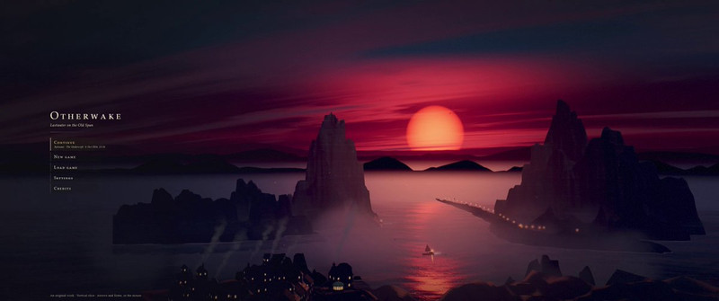</a></td>
<td width="50%" height="225" align="center" valign="middle"><a href="https://guanmo-ai.github.io/awesome-ai-motion/?lang=en#case-2107499672915021992">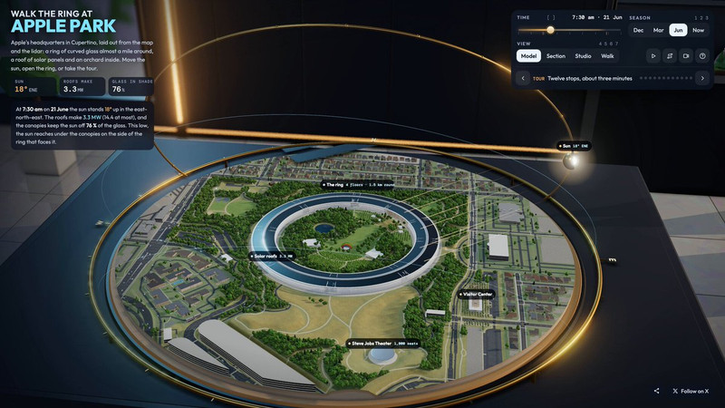</a></td>
</tr>
<tr>
<td width="50%" valign="top"><strong>An Opus-built CRPG prologue</strong> <a href="https://x.com/Ainthropos">@Ainthropos</a> · 3D &amp; interactive 2:05 · Bookmarks 4 · Details pending <a href="https://guanmo-ai.github.io/awesome-ai-motion/?lang=en#case-2107581537453805650">▶ Play</a> · <a href="https://x.com/Ainthropos/status/2107581537453805650">Original post</a></td>
<td width="50%" valign="top"><strong>Apple Park: a browser tour</strong> <a href="https://x.com/RyanSael">@RyanSael</a> · 3D &amp; interactive 0:30 · Bookmarks 4 · Details pending <a href="https://guanmo-ai.github.io/awesome-ai-motion/?lang=en#case-2107499672915021992">▶ Play</a> · <a href="https://x.com/RyanSael/status/2107499672915021992">Original post</a></td>
</tr>
</tbody>
<tbody>
<tr>
<td width="50%" height="225" align="center" valign="middle"></td>
<td width="50%" height="225" align="center" valign="middle"><a href="https://guanmo-ai.github.io/awesome-ai-motion/?lang=en#case-2107633024909377612">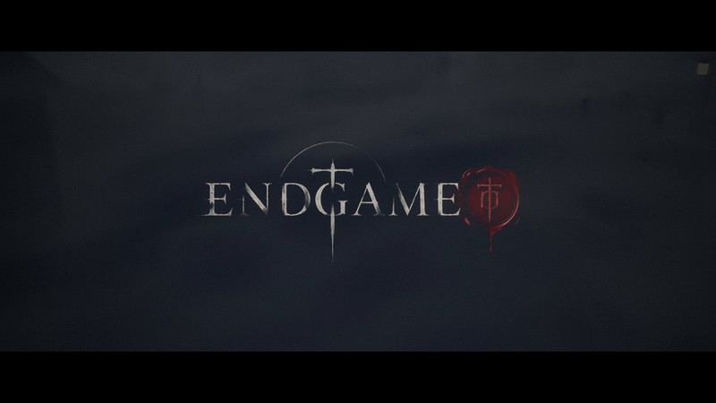</a></td>
</tr>
<tr>
<td width="50%" valign="top"><strong>An updated browser zombie game</strong> <a href="https://x.com/SimonasLTU1">@SimonasLTU1</a> · 3D &amp; interactive 2:34 · Bookmarks 4 · Details pending <a href="https://guanmo-ai.github.io/awesome-ai-motion/?lang=en#case-2105559563764220114">▶ Play</a> · <a href="https://x.com/SimonasLTU1/status/2105559563764220114">Original post</a></td>
<td width="50%" valign="top"><strong>ENDGAME: a Horror-game Experiment on Spawn</strong> <a href="https://x.com/majidmanzarpour">@majidmanzarpour</a> · 3D &amp; interactive 1:02 · Bookmarks 3 · Details pending <a href="https://guanmo-ai.github.io/awesome-ai-motion/?lang=en#case-2107633024909377612">▶ Play</a> · <a href="https://x.com/majidmanzarpour/status/2107633024909377612">Original post</a></td>
</tr>
</tbody>
<tbody>
<tr>
<td width="50%" height="225" align="center" valign="middle"><a href="https://guanmo-ai.github.io/awesome-ai-motion/?lang=en#case-2106064200535859685">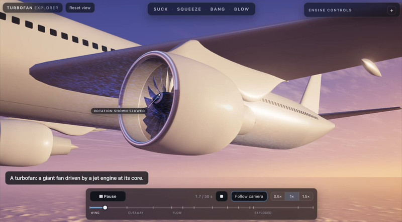</a></td>
<td width="50%" height="225" align="center" valign="middle"><a href="https://guanmo-ai.github.io/awesome-ai-motion/?lang=en#case-2107166049326285268">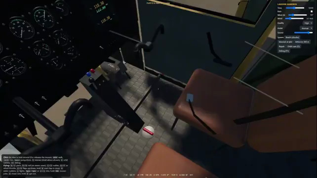</a></td>
</tr>
<tr>
<td width="50%" valign="top"><strong>From intake to exhaust: a 3D jet-engine demo</strong> <a href="https://x.com/techartist_">@techartist_</a> · 3D &amp; interactive 0:24 · Bookmarks 3 · Details pending <a href="https://guanmo-ai.github.io/awesome-ai-motion/?lang=en#case-2106064200535859685">▶ Play</a> · <a href="https://x.com/techartist_/status/2106064200535859685">Original post</a></td>
<td width="50%" valign="top"><strong>A code-built seaplane scene</strong> <a href="https://x.com/mdaman010">@mdaman010</a> · 3D &amp; interactive 1:43 · Bookmarks 3 · Details pending <a href="https://guanmo-ai.github.io/awesome-ai-motion/?lang=en#case-2107166049326285268">▶ Play</a> · <a href="https://x.com/mdaman010/status/2107166049326285268">Original post</a></td>
</tr>
</tbody>
<tbody>
<tr>
<td width="50%" height="225" align="center" valign="middle"><a href="https://guanmo-ai.github.io/awesome-ai-motion/?lang=en#case-2108079671783170156">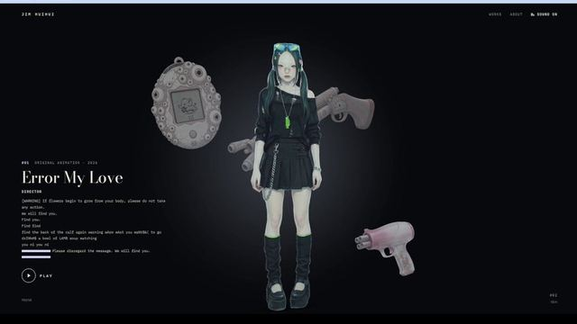</a></td>
<td width="50%" height="225" align="center" valign="middle"><a href="https://guanmo-ai.github.io/awesome-ai-motion/?lang=en#case-2108481299707203767">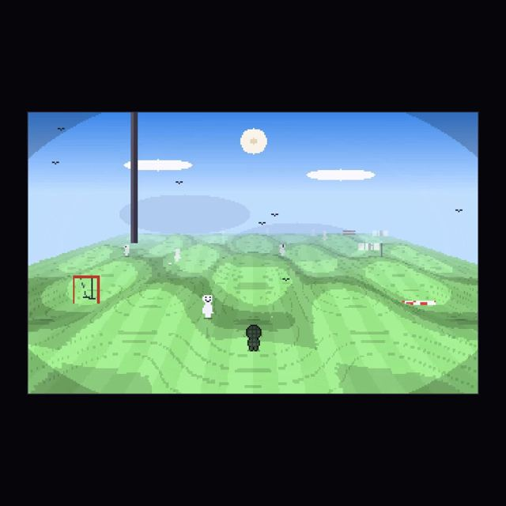</a></td>
</tr>
<tr>
<td width="50%" valign="top"><strong>An Interactive Portfolio of Four AIGC Projects</strong> <a href="https://x.com/Jinghui_Dong">@Jinghui_Dong</a> · 3D &amp; interactive 1:01 · Bookmarks 3 · Details pending <a href="https://guanmo-ai.github.io/awesome-ai-motion/?lang=en#case-2108079671783170156">▶ Play</a> · <a href="https://x.com/Jinghui_Dong/status/2108079671783170156">Original post</a></td>
<td width="50%" valign="top"><strong>SOMNOLITH α: an Abstract Exploration Game</strong> <a href="https://x.com/minima_ai">@minima_ai</a> · 3D &amp; interactive 0:32 · Bookmarks 2 · Details pending <a href="https://guanmo-ai.github.io/awesome-ai-motion/?lang=en#case-2108481299707203767">▶ Play</a> · <a href="https://x.com/minima_ai/status/2108481299707203767">Original post</a></td>
</tr>
</tbody>
<tbody>
<tr>
<td width="50%" height="225" align="center" valign="middle"><a href="https://guanmo-ai.github.io/awesome-ai-motion/?lang=en#case-2106065029850091943">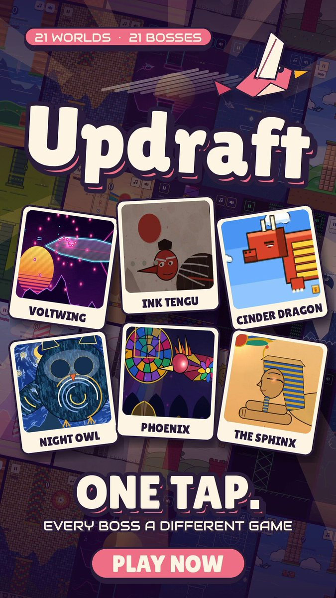</a></td>
<td width="50%" height="225" align="center" valign="middle"><a href="https://guanmo-ai.github.io/awesome-ai-motion/?lang=en#case-2108314700371099863">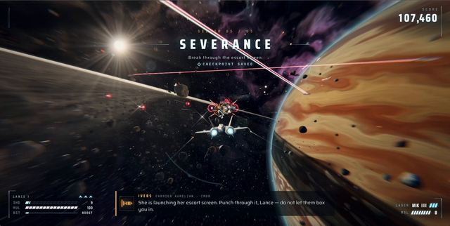</a></td>
</tr>
<tr>
<td width="50%" valign="top"><strong>Updraft: a game trailer for 21 worlds</strong> <a href="https://x.com/EMostaque">@EMostaque</a> · 3D &amp; interactive 0:59 · Bookmarks 2 · Details pending <a href="https://guanmo-ai.github.io/awesome-ai-motion/?lang=en#case-2106065029850091943">▶ Play</a> · <a href="https://x.com/EMostaque/status/2106065029850091943">Original post</a></td>
<td width="50%" valign="top"><strong>Severance: a Code-drawn Shooter</strong> <a href="https://x.com/Andrew_Blumson">@Andrew_Blumson</a> · 3D &amp; interactive 2:16 · Bookmarks 2 · Details pending <a href="https://guanmo-ai.github.io/awesome-ai-motion/?lang=en#case-2108314700371099863">▶ Play</a> · <a href="https://x.com/Andrew_Blumson/status/2108314700371099863">Original post</a></td>
</tr>
</tbody>
<tbody>
<tr>
<td width="50%" height="225" align="center" valign="middle"><a href="https://guanmo-ai.github.io/awesome-ai-motion/?lang=en#case-2107849452707107170">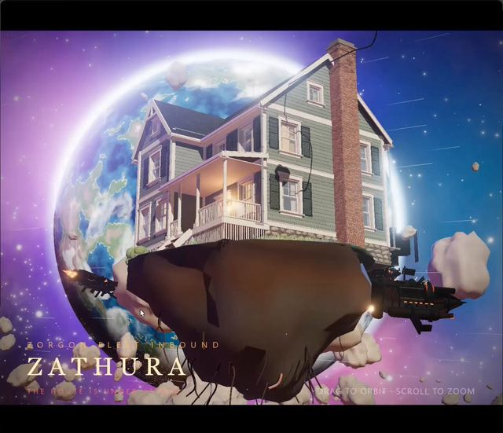</a></td>
<td width="50%" height="225" align="center" valign="middle"><a href="https://guanmo-ai.github.io/awesome-ai-motion/?lang=en#case-2107624896247271672">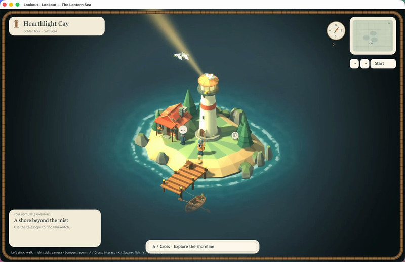</a></td>
</tr>
<tr>
<td width="50%" valign="top"><strong>Zathura: a Broken House in Space</strong> <a href="https://x.com/DrstaOne">@DrstaOne</a> · 3D &amp; interactive 0:48 · Bookmarks 2 · Details pending <a href="https://guanmo-ai.github.io/awesome-ai-motion/?lang=en#case-2107849452707107170">▶ Play</a> · <a href="https://x.com/DrstaOne/status/2107849452707107170">Original post</a></td>
<td width="50%" valign="top"><strong>A cozy seafaring game in Rive</strong> <a href="https://x.com/drawsgood">@drawsgood</a> · 3D &amp; interactive 3:10 · Bookmarks 2 · Details pending <a href="https://guanmo-ai.github.io/awesome-ai-motion/?lang=en#case-2107624896247271672">▶ Play</a> · <a href="https://x.com/drawsgood/status/2107624896247271672">Original post</a></td>
</tr>
</tbody>
<tbody>
<tr>
<td width="50%" height="225" align="center" valign="middle"><a href="https://guanmo-ai.github.io/awesome-ai-motion/?lang=en#case-2108325457389359268">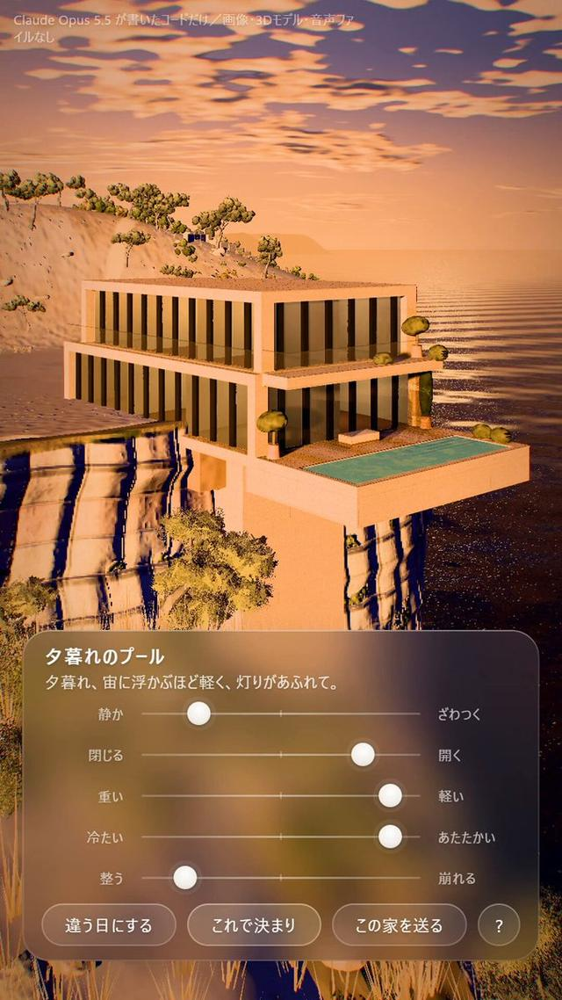</a></td>
<td width="50%" height="225" align="center" valign="middle"></td>
</tr>
<tr>
<td width="50%" valign="top"><strong>Five Controls Transform a Cliffside House</strong> <a href="https://x.com/mizugame_22">@mizugame_22</a> · 3D &amp; interactive 0:21 · Bookmarks 2 · Details pending <a href="https://guanmo-ai.github.io/awesome-ai-motion/?lang=en#case-2108325457389359268">▶ Play</a> · <a href="https://x.com/mizugame_22/status/2108325457389359268">Original post</a></td>
<td width="50%" valign="top"><strong>Rebuilding a TV Shot from One Reference</strong> <a href="https://x.com/varga_bee">@varga_bee</a> · 3D &amp; interactive 0:05 · Bookmarks 2 · Details pending <a href="https://guanmo-ai.github.io/awesome-ai-motion/?lang=en#case-2102744321355067761">▶ Play</a> · <a href="https://x.com/varga_bee/status/2102744321355067761">Original post</a></td>
</tr>
</tbody>
<tbody>
<tr>
<td width="50%" height="225" align="center" valign="middle"></td>
<td width="50%" height="225" align="center" valign="middle"></td>
</tr>
<tr>
<td width="50%" valign="top"><strong>From Floor Plan to a Walkable House</strong> <a href="https://x.com/aayush4soni">@aayush4soni</a> · 3D &amp; interactive 0:38 · Bookmarks 2 · Details pending <a href="https://guanmo-ai.github.io/awesome-ai-motion/?lang=en#case-2104181266459644283">▶ Play</a> · <a href="https://x.com/aayush4soni/status/2104181266459644283">Original post</a></td>
<td width="50%" valign="top"><strong>Clear Skies: a Pink Pixel Mini-game</strong> <a href="https://x.com/oliveolveioveil">@oliveolveioveil</a> · 3D &amp; interactive 1:12 · Bookmarks 1 · Details pending <a href="https://guanmo-ai.github.io/awesome-ai-motion/?lang=en#case-2108332649802834104">▶ Play</a> · <a href="https://x.com/oliveolveioveil/status/2108332649802834104">Original post</a></td>
</tr>
</tbody>
<tbody>
<tr>
<td width="50%" height="225" align="center" valign="middle"><a href="https://guanmo-ai.github.io/awesome-ai-motion/?lang=en#case-2108154705549656175">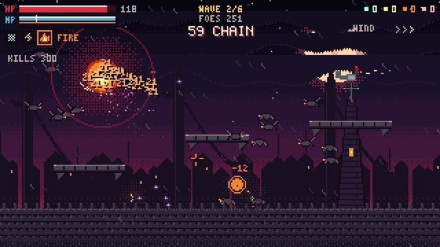</a></td>
<td width="50%" height="225" align="center" valign="middle"></td>
</tr>
<tr>
<td width="50%" valign="top"><strong>TRI-USAGI: a Side-view Shooting Action Game</strong> <a href="https://x.com/act_pike">@act_pike</a> · 3D &amp; interactive 0:15 · Bookmarks 1 · Details pending <a href="https://guanmo-ai.github.io/awesome-ai-motion/?lang=en#case-2108154705549656175">▶ Play</a> · <a href="https://x.com/act_pike/status/2108154705549656175">Original post</a></td>
<td width="50%" valign="top"><strong>Workspace: A 3D Office for Coding Sessions</strong> <a href="https://x.com/kum1ta">@kum1ta</a> · 3D &amp; interactive 0:30 · Bookmarks 1 · Details pending <a href="https://guanmo-ai.github.io/awesome-ai-motion/?lang=en#case-2103998389058740521">▶ Play</a> · <a href="https://x.com/kum1ta/status/2103998389058740521">Original post</a></td>
</tr>
</tbody>
<tbody>
<tr>
<td width="50%" height="225" align="center" valign="middle"></td>
<td width="50%" height="225" align="center" valign="middle"><a href="https://guanmo-ai.github.io/awesome-ai-motion/?lang=en#case-2108484938983235837">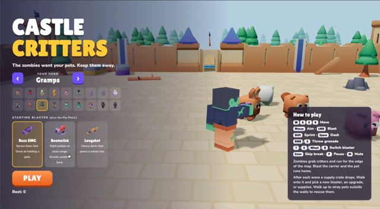</a></td>
</tr>
<tr>
<td width="50%" valign="top"><strong>Melon Jelly: drag and cut experiment</strong> <a href="https://x.com/Abmankendrick">@Abmankendrick</a> · 3D &amp; interactive 0:27 · Bookmarks 1 · Details pending <a href="https://guanmo-ai.github.io/awesome-ai-motion/?lang=en#case-2105675232954474831">▶ Play</a> · <a href="https://x.com/Abmankendrick/status/2105675232954474831">Original post</a></td>
<td width="50%" valign="top"><strong>Castle Critters: a Browser Castle Game</strong> <a href="https://x.com/PratikPatel_227">@PratikPatel_227</a> · 3D &amp; interactive 1:35 · Bookmarks 1 · Details pending <a href="https://guanmo-ai.github.io/awesome-ai-motion/?lang=en#case-2108484938983235837">▶ Play</a> · <a href="https://x.com/PratikPatel_227/status/2108484938983235837">Original post</a></td>
</tr>
</tbody>
<tbody>
<tr>
<td width="50%" height="225" align="center" valign="middle"></td>
<td width="50%" height="225" align="center" valign="middle"></td>
</tr>
<tr>
<td width="50%" valign="top"><strong>A Koi Pond with Ripples and Drifting Leaves</strong> <a href="https://x.com/anvithbuilds">@anvithbuilds</a> · 3D &amp; interactive 0:09 · Bookmarks 1 · Details pending <a href="https://guanmo-ai.github.io/awesome-ai-motion/?lang=en#case-2105220761086828778">▶ Play</a> · <a href="https://x.com/anvithbuilds/status/2105220761086828778">Original post</a></td>
<td width="50%" valign="top"><strong>House Model Explodes and Reassembles</strong> <a href="https://x.com/zdkiel_labs">@zdkiel_labs</a> · 3D &amp; interactive 0:15 · Bookmarks 1 · Details pending <a href="https://guanmo-ai.github.io/awesome-ai-motion/?lang=en#case-2102722754172850310">▶ Play</a> · <a href="https://x.com/zdkiel_labs/status/2102722754172850310">Original post</a></td>
</tr>
</tbody>
<tbody>
<tr>
<td width="50%" height="225" align="center" valign="middle"></td>
<td width="50%" height="225" align="center" valign="middle"><a href="https://guanmo-ai.github.io/awesome-ai-motion/?lang=en#case-2108156566059020511">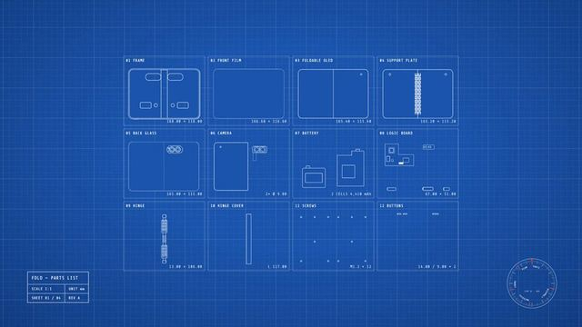</a></td>
</tr>
<tr>
<td width="50%" valign="top"><strong>Symbiote suit 3D game demo</strong> <a href="https://x.com/stfu0911">@stfu0911</a> · 3D &amp; interactive 2:10 · Bookmarks 1 · Details pending <a href="https://guanmo-ai.github.io/awesome-ai-motion/?lang=en#case-2104246455938797888">▶ Play</a> · <a href="https://x.com/stfu0911/status/2104246455938797888">Original post</a></td>
<td width="50%" valign="top"><strong>A Folding-phone Anatomy and Scroll Loop</strong> <a href="https://x.com/saitopatopo">@saitopatopo</a> · 3D &amp; interactive 0:12 · Bookmarks 1 · Details pending <a href="https://guanmo-ai.github.io/awesome-ai-motion/?lang=en#case-2108156566059020511">▶ Play</a> · <a href="https://x.com/saitopatopo/status/2108156566059020511">Original post</a></td>
</tr>
</tbody>
<tbody>
<tr>
<td width="50%" height="225" align="center" valign="middle"></td>
<td width="50%" height="225" align="center" valign="middle"></td>
</tr>
<tr>
<td width="50%" valign="top"><strong>The Apex Rush: A Single-File 3D Browser Game</strong> <a href="https://x.com/sidgiri2104">@sidgiri2104</a> · 3D &amp; interactive 1:07 · Bookmarks 1 · Details pending <a href="https://guanmo-ai.github.io/awesome-ai-motion/?lang=en#case-2104820347875045751">▶ Play</a> · <a href="https://x.com/sidgiri2104/status/2104820347875045751">Original post</a></td>
<td width="50%" valign="top"><strong>Reconstructing ancient Izumo Taisha</strong> <a href="https://x.com/yoshifujidesign">@yoshifujidesign</a> · 3D &amp; interactive 1:04 · Bookmarks 1 · Details pending <a href="https://guanmo-ai.github.io/awesome-ai-motion/?lang=en#case-2105679580191416322">▶ Play</a> · <a href="https://x.com/yoshifujidesign/status/2105679580191416322">Original post</a></td>
</tr>
</tbody>
<tbody>
<tr>
<td width="50%" height="225" align="center" valign="middle"><a href="https://guanmo-ai.github.io/awesome-ai-motion/?lang=en#case-2107494964410429923">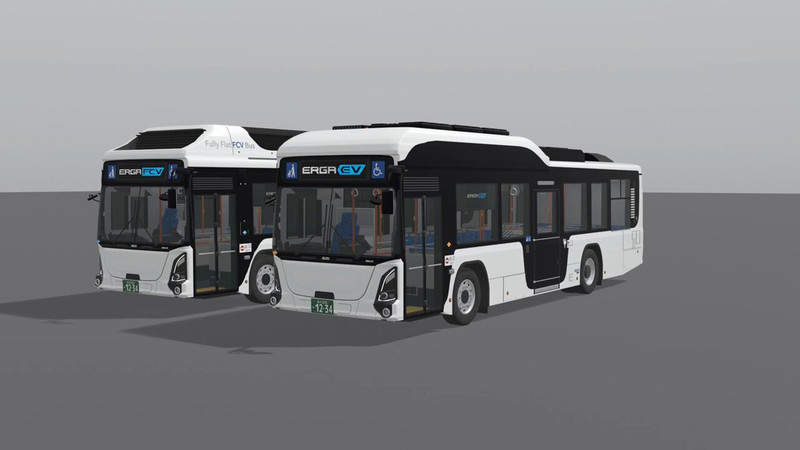</a></td>
<td width="50%" height="225" align="center" valign="middle"><a href="https://guanmo-ai.github.io/awesome-ai-motion/?lang=en#case-2108311732376453546">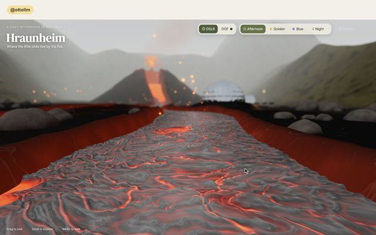</a></td>
</tr>
<tr>
<td width="50%" valign="top"><strong>Two bus models in Blender</strong> <a href="https://x.com/0c103a">@0c103a</a> · 3D &amp; interactive 0:45 · Bookmarks 1 · Details pending <a href="https://guanmo-ai.github.io/awesome-ai-motion/?lang=en#case-2107494964410429923">▶ Play</a> · <a href="https://x.com/0c103a/status/2107494964410429923">Original post</a></td>
<td width="50%" valign="top"><strong>Hraunheim: a Home beside a Lava River</strong> <a href="https://x.com/ottollm">@ottollm</a> · 3D &amp; interactive 0:20 · Bookmarks 1 · Details pending <a href="https://guanmo-ai.github.io/awesome-ai-motion/?lang=en#case-2108311732376453546">▶ Play</a> · <a href="https://x.com/ottollm/status/2108311732376453546">Original post</a></td>
</tr>
</tbody>
<tbody>
<tr>
<td width="50%" height="225" align="center" valign="middle"></td>
<td width="50%" height="225" align="center" valign="middle"><a href="https://guanmo-ai.github.io/awesome-ai-motion/?lang=en#case-2108331960636731899">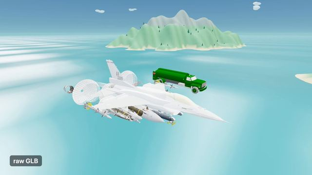</a></td>
</tr>
<tr>
<td width="50%" valign="top"><strong>From One Image to a Three.js Scene</strong> <a href="https://x.com/NicksonTan">@NicksonTan</a> · 3D &amp; interactive 1:12 · Bookmarks 1 · Details pending <a href="https://guanmo-ai.github.io/awesome-ai-motion/?lang=en#case-2102798578427265368">▶ Play</a> · <a href="https://x.com/NicksonTan/status/2102798578427265368">Original post</a></td>
<td width="50%" valign="top"><strong>Runtime Repairs for FlightGear Aircraft</strong> <a href="https://x.com/lekanadeyeri">@lekanadeyeri</a> · 3D &amp; interactive 0:11 · Bookmarks 0 · Details pending <a href="https://guanmo-ai.github.io/awesome-ai-motion/?lang=en#case-2108331960636731899">▶ Play</a> · <a href="https://x.com/lekanadeyeri/status/2108331960636731899">Original post</a></td>
</tr>
</tbody>
<tbody>
<tr>
<td width="50%" height="225" align="center" valign="middle"><a href="https://guanmo-ai.github.io/awesome-ai-motion/?lang=en#case-2108517265193025631">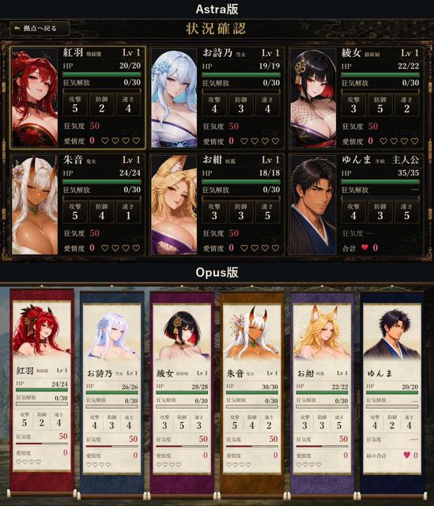</a></td>
<td width="50%" height="225" align="center" valign="middle"></td>
</tr>
<tr>
<td width="50%" valign="top"><strong>Two Godot Character-status Layouts</strong> <a href="https://x.com/yunma33331111">@yunma33331111</a> · 3D &amp; interactive 0:26 · Bookmarks 0 · Details pending <a href="https://guanmo-ai.github.io/awesome-ai-motion/?lang=en#case-2108517265193025631">▶ Play</a> · <a href="https://x.com/yunma33331111/status/2108517265193025631">Original post</a></td>
<td width="50%" valign="top"><strong>A Skull Town Browser Map Trailer</strong> <a href="https://x.com/nikooo777">@nikooo777</a> · 3D &amp; interactive 0:20 · Bookmarks 0 · Details pending <a href="https://guanmo-ai.github.io/awesome-ai-motion/?lang=en#case-2105075653183778925">▶ Play</a> · <a href="https://x.com/nikooo777/status/2105075653183778925">Original post</a></td>
</tr>
</tbody>
<tbody>
<tr>
<td width="50%" height="225" align="center" valign="middle"></td>
<td width="50%" height="225" align="center" valign="middle"><a href="https://guanmo-ai.github.io/awesome-ai-motion/?lang=en#case-2107104693448999402">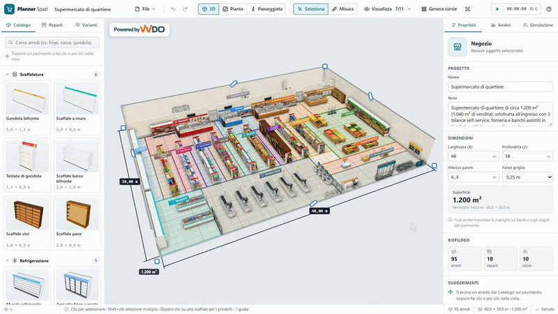</a></td>
</tr>
<tr>
<td width="50%" valign="top"><strong>Demolition Derby in the browser</strong> <a href="https://x.com/drcollect">@drcollect</a> · 3D &amp; interactive 0:16 · Bookmarks 0 · Details pending <a href="https://guanmo-ai.github.io/awesome-ai-motion/?lang=en#case-2105361031371383180">▶ Play</a> · <a href="https://x.com/drcollect/status/2105361031371383180">Original post</a></td>
<td width="50%" valign="top"><strong>A 3D supermarket operations simulator</strong> <a href="https://x.com/ballerinifb">@ballerinifb</a> · 3D &amp; interactive 1:28 · Bookmarks 0 · Details pending <a href="https://guanmo-ai.github.io/awesome-ai-motion/?lang=en#case-2107104693448999402">▶ Play</a> · <a href="https://x.com/ballerinifb/status/2107104693448999402">Original post</a></td>
</tr>
</tbody>
<tbody>
<tr>
<td width="50%" height="225" align="center" valign="middle"></td>
<td width="50%" height="225" align="center" valign="middle"><a href="https://guanmo-ai.github.io/awesome-ai-motion/?lang=en#case-2108148762849980892">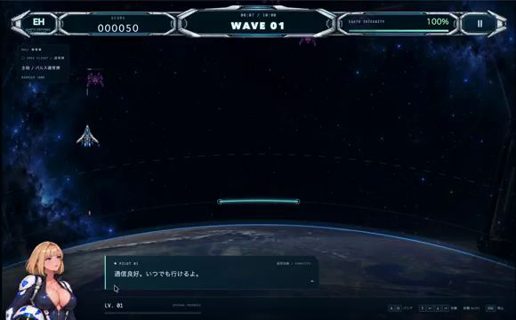</a></td>
</tr>
<tr>
<td width="50%" valign="top"><strong>A Pixel-game Devlog: a Codex-made Introduction</strong> <a href="https://x.com/DSTO_boardgamer">@DSTO_boardgamer</a> · 3D &amp; interactive 0:36 · Bookmarks 0 · Details pending <a href="https://guanmo-ai.github.io/awesome-ai-motion/?lang=en#case-2108507501402661118">▶ Play</a> · <a href="https://x.com/DSTO_boardgamer/status/2108507501402661118">Original post</a></td>
<td width="50%" valign="top"><strong>A Roguelike Shooter with a Live2D Character</strong> <a href="https://x.com/beko_X_account">@beko_X_account</a> · 3D &amp; interactive 0:45 · Bookmarks 0 · Details pending <a href="https://guanmo-ai.github.io/awesome-ai-motion/?lang=en#case-2108148762849980892">▶ Play</a> · <a href="https://x.com/beko_X_account/status/2108148762849980892">Original post</a></td>
</tr>
</tbody>
<tbody>
<tr>
<td width="50%" height="225" align="center" valign="middle"><a href="https://guanmo-ai.github.io/awesome-ai-motion/?lang=en#case-2108162966659224000">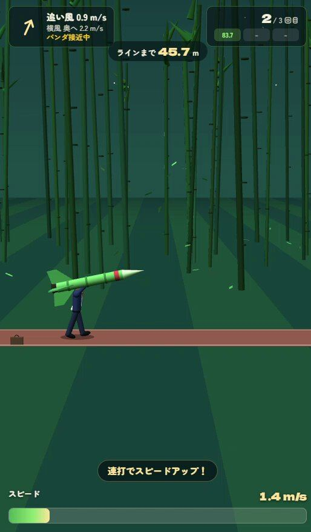</a></td>
<td width="50%" height="225" align="center" valign="middle"><a href="https://guanmo-ai.github.io/awesome-ai-motion/?lang=en#case-2108319343712886998">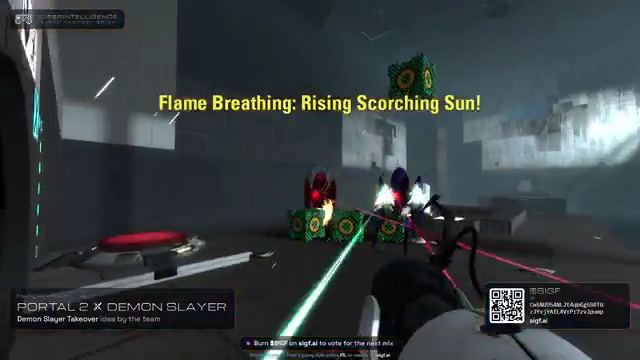</a></td>
</tr>
<tr>
<td width="50%" valign="top"><strong>A Bamboo-spear Throwing Game</strong> <a href="https://x.com/bDAxjGohPDX7XiV">@bDAxjGohPDX7XiV</a> · 3D &amp; interactive 0:15 · Bookmarks 0 · Details pending <a href="https://guanmo-ai.github.io/awesome-ai-motion/?lang=en#case-2108162966659224000">▶ Play</a> · <a href="https://x.com/bDAxjGohPDX7XiV/status/2108162966659224000">Original post</a></td>
<td width="50%" valign="top"><strong>Demon Slayer Takes over Portal 2</strong> <a href="https://x.com/sigf_ai">@sigf_ai</a> · 3D &amp; interactive 0:30 · Bookmarks 0 · Details pending <a href="https://guanmo-ai.github.io/awesome-ai-motion/?lang=en#case-2108319343712886998">▶ Play</a> · <a href="https://x.com/sigf_ai/status/2108319343712886998">Original post</a></td>
</tr>
</tbody>
<tbody>
<tr>
<td width="50%" height="225" align="center" valign="middle"><a href="https://guanmo-ai.github.io/awesome-ai-motion/?lang=en#case-2108336621980360830">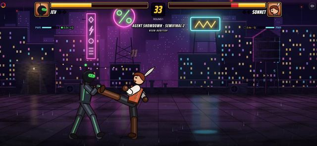</a></td>
<td width="50%" height="225" align="center" valign="middle"></td>
</tr>
<tr>
<td width="50%" valign="top"><strong>A Convex Game with AI Characters Fighting</strong> <a href="https://x.com/_sarant">@_sarant</a> · 3D &amp; interactive 0:33 · Bookmarks 0 · Details pending <a href="https://guanmo-ai.github.io/awesome-ai-motion/?lang=en#case-2108336621980360830">▶ Play</a> · <a href="https://x.com/_sarant/status/2108336621980360830">Original post</a></td>
<td width="50%" valign="top"><strong>A Three.js Personal Site Concept</strong> <a href="https://x.com/hymmakbar">@hymmakbar</a> · 3D &amp; interactive 1:07 · Bookmarks 0 · Details pending <a href="https://guanmo-ai.github.io/awesome-ai-motion/?lang=en#case-2105082553996820579">▶ Play</a> · <a href="https://x.com/hymmakbar/status/2105082553996820579">Original post</a></td>
</tr>
</tbody>
<tbody>
<tr>
<td width="50%" height="225" align="center" valign="middle"></td>
<td width="50%" height="225" align="center" valign="middle"><a href="https://guanmo-ai.github.io/awesome-ai-motion/?lang=en#case-2107498407745225201">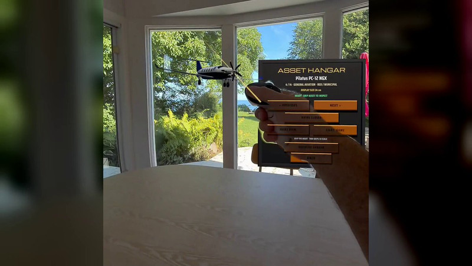</a></td>
</tr>
<tr>
<td width="50%" valign="top"><strong>PEABRAIN: from an image to a Godot cup game</strong> <a href="https://x.com/suth_a">@suth_a</a> · 3D &amp; interactive 0:24 · Bookmarks 0 · Details pending <a href="https://guanmo-ai.github.io/awesome-ai-motion/?lang=en#case-2105587887500911001">▶ Play</a> · <a href="https://x.com/suth_a/status/2105587887500911001">Original post</a></td>
<td width="50%" valign="top"><strong>Vector Tango: a mixed-reality aircraft hangar</strong> <a href="https://x.com/scobelverse">@scobelverse</a> · 3D &amp; interactive 0:08 · Bookmarks 0 · Details pending <a href="https://guanmo-ai.github.io/awesome-ai-motion/?lang=en#case-2107498407745225201">▶ Play</a> · <a href="https://x.com/scobelverse/status/2107498407745225201">Original post</a></td>
</tr>
</tbody>
<tbody>
<tr>
<td width="50%" height="225" align="center" valign="middle"><a href="https://guanmo-ai.github.io/awesome-ai-motion/?lang=en#case-2108169409856709062">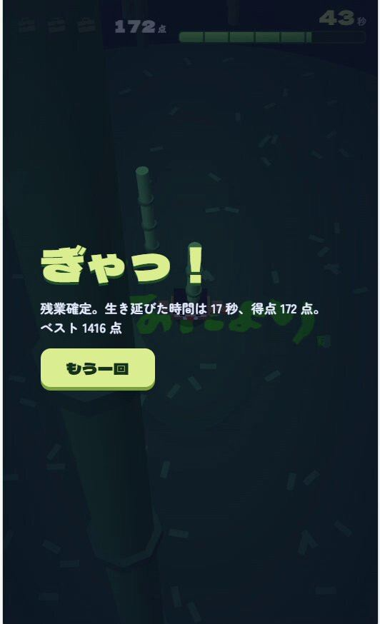</a></td>
<td width="50%" height="225" align="center" valign="middle"><a href="https://guanmo-ai.github.io/awesome-ai-motion/?lang=en#case-2108385330072272973">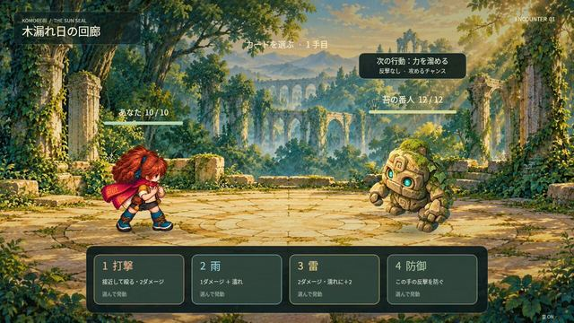</a></td>
</tr>
<tr>
<td width="50%" valign="top"><strong>Dodging Falling Bamboo Spears</strong> <a href="https://x.com/bDAxjGohPDX7XiV">@bDAxjGohPDX7XiV</a> · 3D &amp; interactive 0:22 · Bookmarks 0 · Details pending <a href="https://guanmo-ai.github.io/awesome-ai-motion/?lang=en#case-2108169409856709062">▶ Play</a> · <a href="https://x.com/bDAxjGohPDX7XiV/status/2108169409856709062">Original post</a></td>
<td width="50%" valign="top"><strong>A Game Hero's Lightning-effect Update</strong> <a href="https://x.com/Toshi_nyaruo_AI">@Toshi_nyaruo_AI</a> · 3D &amp; interactive 0:18 · Bookmarks 0 · Details pending <a href="https://guanmo-ai.github.io/awesome-ai-motion/?lang=en#case-2108385330072272973">▶ Play</a> · <a href="https://x.com/Toshi_nyaruo_AI/status/2108385330072272973">Original post</a></td>
</tr>
</tbody>
<tbody>
<tr>
<td width="50%" height="225" align="center" valign="middle"></td>
<td width="50%" height="225" align="center" valign="middle"><a href="https://guanmo-ai.github.io/awesome-ai-motion/?lang=en#case-2108172640842359264">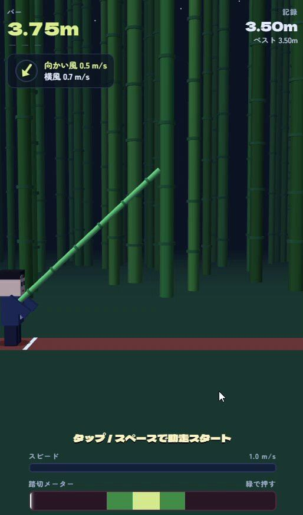</a></td>
</tr>
<tr>
<td width="50%" valign="top"><strong>A touchable, sounding tesseract</strong> <a href="https://x.com/_postminimal">@_postminimal</a> · 3D &amp; interactive 0:55 · Bookmarks 0 · Details pending <a href="https://guanmo-ai.github.io/awesome-ai-motion/?lang=en#case-2105561265531957530">▶ Play</a> · <a href="https://x.com/_postminimal/status/2105561265531957530">Original post</a></td>
<td width="50%" valign="top"><strong>A Bamboo Pole-vaulting Game</strong> <a href="https://x.com/bDAxjGohPDX7XiV">@bDAxjGohPDX7XiV</a> · 3D &amp; interactive 0:17 · Bookmarks 0 · Details pending <a href="https://guanmo-ai.github.io/awesome-ai-motion/?lang=en#case-2108172640842359264">▶ Play</a> · <a href="https://x.com/bDAxjGohPDX7XiV/status/2108172640842359264">Original post</a></td>
</tr>
</tbody>
<tbody>
<tr>
<td width="50%" height="225" align="center" valign="middle"></td>
<td width="50%" height="225" align="center" valign="middle"><a href="https://guanmo-ai.github.io/awesome-ai-motion/?lang=en#case-2108371550617456882">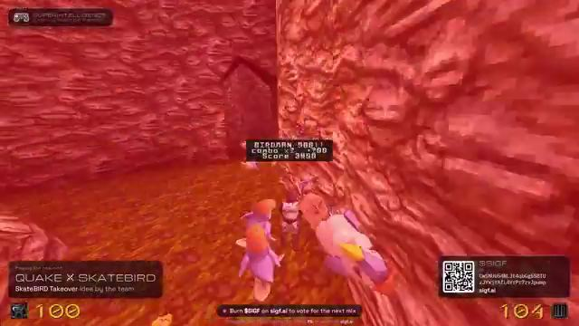</a></td>
</tr>
<tr>
<td width="50%" valign="top"><strong>An Interactive Watercolor Hummingbird</strong> <a href="https://x.com/Tentamasoba1016">@Tentamasoba1016</a> · 3D &amp; interactive 0:30 · Bookmarks 0 · Details pending <a href="https://guanmo-ai.github.io/awesome-ai-motion/?lang=en#case-2108321415606968363">▶ Play</a> · <a href="https://x.com/Tentamasoba1016/status/2108321415606968363">Original post</a></td>
<td width="50%" valign="top"><strong>SkateBIRD Takes over Quake</strong> <a href="https://x.com/sigf_ai">@sigf_ai</a> · 3D &amp; interactive 0:30 · Bookmarks 0 · Details pending <a href="https://guanmo-ai.github.io/awesome-ai-motion/?lang=en#case-2108371550617456882">▶ Play</a> · <a href="https://x.com/sigf_ai/status/2108371550617456882">Original post</a></td>
</tr>
</tbody>
<tbody>
<tr>
<td width="50%" height="225" align="center" valign="middle"></td>
<td width="50%" height="225" align="center" valign="middle"><a href="https://guanmo-ai.github.io/awesome-ai-motion/?lang=en#case-2107640509967536301">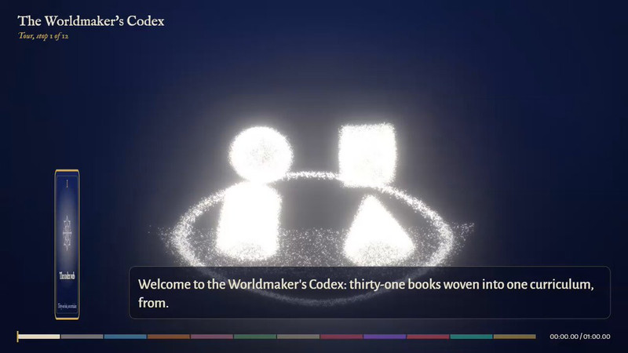</a></td>
</tr>
<tr>
<td width="50%" valign="top"><strong>A House Designed as Code</strong> <a href="https://x.com/AJtheMongol">@AJtheMongol</a> · 3D &amp; interactive 0:51 · Bookmarks 0 · Details pending <a href="https://guanmo-ai.github.io/awesome-ai-motion/?lang=en#case-2104214187522318512">▶ Play</a> · <a href="https://x.com/AJtheMongol/status/2104214187522318512">Original post</a></td>
<td width="50%" valign="top"><strong>Worldmaker particle-system worlds</strong> <a href="https://x.com/Aaron_Wacker">@Aaron_Wacker</a> · 3D &amp; interactive 1:00 · Bookmarks 0 · Details pending <a href="https://guanmo-ai.github.io/awesome-ai-motion/?lang=en#case-2107640509967536301">▶ Play</a> · <a href="https://x.com/Aaron_Wacker/status/2107640509967536301">Original post</a></td>
</tr>
</tbody>
<tbody>
<tr>
<td width="50%" height="225" align="center" valign="middle"><a href="https://guanmo-ai.github.io/awesome-ai-motion/?lang=en#case-2107663339664949463">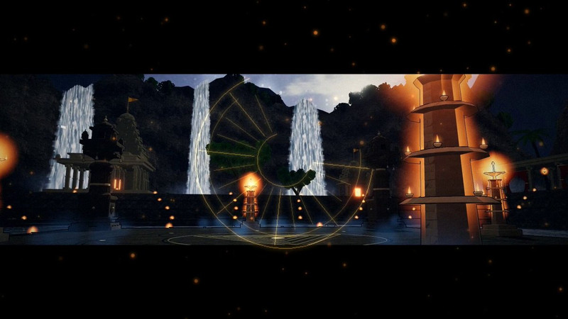</a></td>
<td width="50%" height="225" align="center" valign="middle"></td>
</tr>
<tr>
<td width="50%" valign="top"><strong>YUDHVEER mythological action-game trailer</strong> <a href="https://x.com/TejasGovin17982">@TejasGovin17982</a> · 3D &amp; interactive 1:00 · Bookmarks 0 · Details pending <a href="https://guanmo-ai.github.io/awesome-ai-motion/?lang=en#case-2107663339664949463">▶ Play</a> · <a href="https://x.com/TejasGovin17982/status/2107663339664949463">Original post</a></td>
<td width="50%" valign="top"><strong>Sydney Harbour Bridge: Dawn to Dusk</strong> <a href="https://x.com/CeciliaW888">@CeciliaW888</a> · 3D &amp; interactive 0:23 · Bookmarks 0 · Details pending <a href="https://guanmo-ai.github.io/awesome-ai-motion/?lang=en#case-2104504480968683521">▶ Play</a> · <a href="https://x.com/CeciliaW888/status/2104504480968683521">Original post</a></td>
</tr>
</tbody>
<tbody>
<tr>
<td width="50%" height="225" align="center" valign="middle"></td>
<td width="50%" height="225" align="center" valign="middle"></td>
</tr>
<tr>
<td width="50%" valign="top"><strong>Underwater Room with Dolphins and a Harp</strong> <a href="https://x.com/VeronicaVZMusic">@VeronicaVZMusic</a> · 3D &amp; interactive 0:42 · Bookmarks 0 · Details pending <a href="https://guanmo-ai.github.io/awesome-ai-motion/?lang=en#case-2104740780208164947">▶ Play</a> · <a href="https://x.com/VeronicaVZMusic/status/2104740780208164947">Original post</a></td>
<td width="50%" valign="top"><strong>An interactive LEGO Ferrari F1 build</strong> <a href="https://x.com/eigeorguy">@eigeorguy</a> · 3D &amp; interactive 0:39 · Bookmarks 0 · Details pending <a href="https://guanmo-ai.github.io/awesome-ai-motion/?lang=en#case-2105346791021629821">▶ Play</a> · <a href="https://x.com/eigeorguy/status/2105346791021629821">Original post</a></td>
</tr>
</tbody>
<tbody>
<tr>
<td width="50%" height="225" align="center" valign="middle"></td>
<td width="50%" height="225" align="center" valign="middle"><a href="https://guanmo-ai.github.io/awesome-ai-motion/?lang=en#case-2106062220735963507">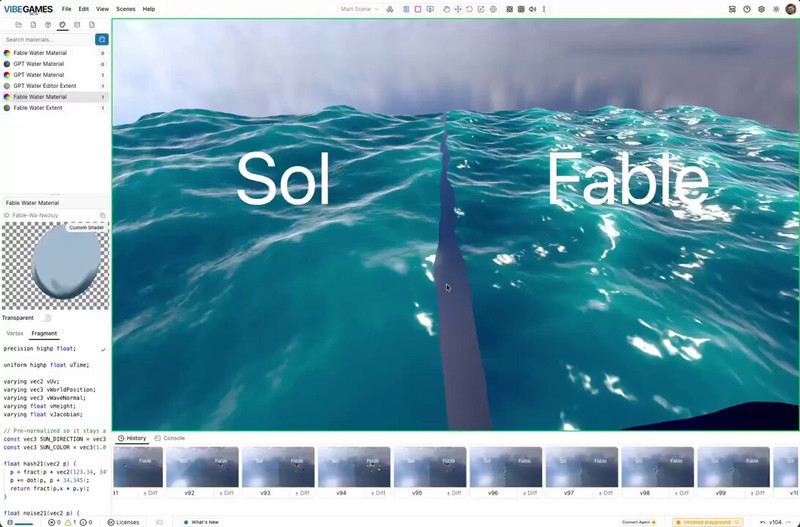</a></td>
</tr>
<tr>
<td width="50%" valign="top"><strong>Casper: a 3D ghost mascot on the web</strong> <a href="https://x.com/bazfurby">@bazfurby</a> · 3D &amp; interactive 0:22 · Bookmarks 0 · Details pending <a href="https://guanmo-ai.github.io/awesome-ai-motion/?lang=en#case-2105595903943774360">▶ Play</a> · <a href="https://x.com/bazfurby/status/2105595903943774360">Original post</a></td>
<td width="50%" valign="top"><strong>Browser water tests: Sol and Fable</strong> <a href="https://x.com/NotionLab7">@NotionLab7</a> · 3D &amp; interactive 0:11 · Bookmarks 0 · Details pending <a href="https://guanmo-ai.github.io/awesome-ai-motion/?lang=en#case-2106062220735963507">▶ Play</a> · <a href="https://x.com/NotionLab7/status/2106062220735963507">Original post</a></td>
</tr>
</tbody>
<tbody>
<tr>
<td width="50%" height="225" align="center" valign="middle"><a href="https://guanmo-ai.github.io/awesome-ai-motion/?lang=en#case-2107644521521807650">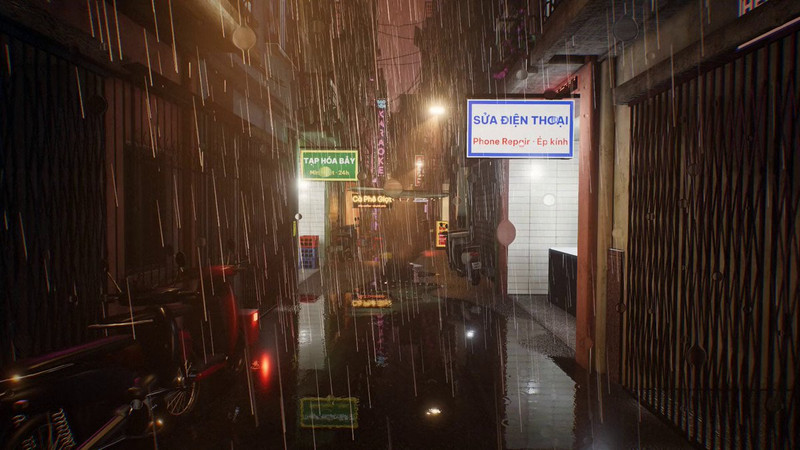</a></td>
<td width="50%" height="225" align="center" valign="middle"><a href="https://guanmo-ai.github.io/awesome-ai-motion/?lang=en#case-2108139498504851759">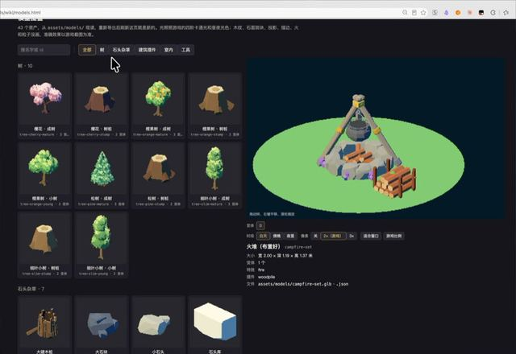</a></td>
</tr>
<tr>
<td width="50%" valign="top"><strong>A rainy Saigon alley</strong> <a href="https://x.com/toankhontech">@toankhontech</a> · 3D &amp; interactive 0:44 · Bookmarks 0 · Details pending <a href="https://guanmo-ai.github.io/awesome-ai-motion/?lang=en#case-2107644521521807650">▶ Play</a> · <a href="https://x.com/toankhontech/status/2107644521521807650">Original post</a></td>
<td width="50%" valign="top"><strong>A Code-generated 3D Pixel Asset Panel</strong> <a href="https://x.com/jing1meow">@jing1meow</a> · 3D &amp; interactive 0:17 · Bookmarks 0 · Details pending <a href="https://guanmo-ai.github.io/awesome-ai-motion/?lang=en#case-2108139498504851759">▶ Play</a> · <a href="https://x.com/jing1meow/status/2108139498504851759">Original post</a></td>
</tr>
</tbody>
<tbody>
<tr>
<td width="50%" height="225" align="center" valign="middle"><a href="https://guanmo-ai.github.io/awesome-ai-motion/?lang=en#case-2108157964259598457">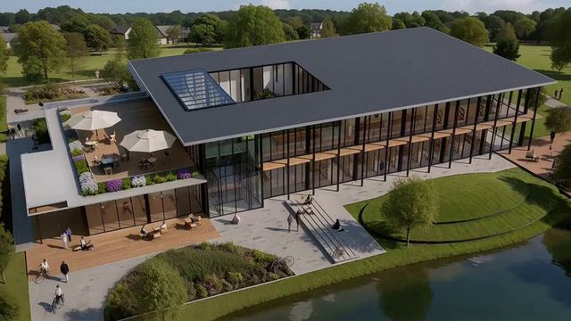</a></td>
<td width="50%" height="225" align="center" valign="middle"><a href="https://guanmo-ai.github.io/awesome-ai-motion/?lang=en#case-2108486210955981251">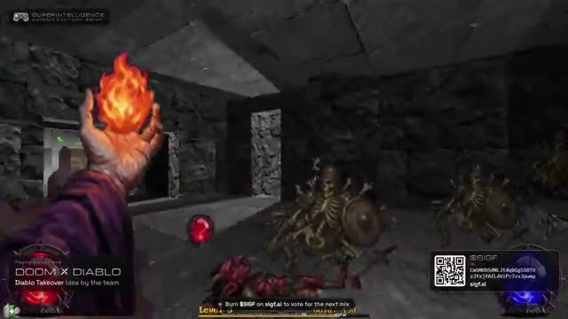</a></td>
</tr>
<tr>
<td width="50%" valign="top"><strong>Park Side Library: BIM Meets Generated Footage</strong> <a href="https://x.com/endo_bimdx">@endo_bimdx</a> · 3D &amp; interactive 1:06 · Bookmarks 0 · Details pending <a href="https://guanmo-ai.github.io/awesome-ai-motion/?lang=en#case-2108157964259598457">▶ Play</a> · <a href="https://x.com/endo_bimdx/status/2108157964259598457">Original post</a></td>
<td width="50%" valign="top"><strong>Diablo Takeover: a Doom Mod</strong> <a href="https://x.com/sigf_ai">@sigf_ai</a> · 3D &amp; interactive 0:30 · Bookmarks 0 · Details pending <a href="https://guanmo-ai.github.io/awesome-ai-motion/?lang=en#case-2108486210955981251">▶ Play</a> · <a href="https://x.com/sigf_ai/status/2108486210955981251">Original post</a></td>
</tr>
</tbody>
<tbody>
<tr>
<td width="50%" height="225" align="center" valign="middle"><a href="https://guanmo-ai.github.io/awesome-ai-motion/?lang=en#case-2108487893056417869">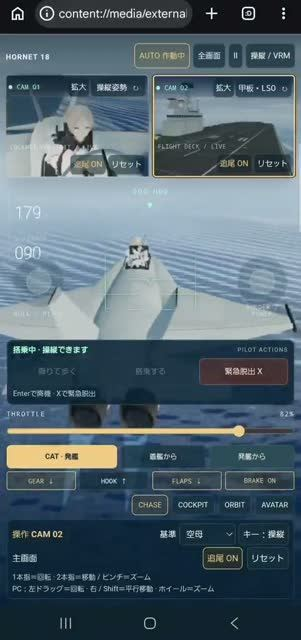</a></td>
<td width="50%" height="225" align="center" valign="middle"></td>
</tr>
<tr>
<td width="50%" valign="top"><strong>A Flight Simulator with a Cat-eared Pilot</strong> <a href="https://x.com/kazur71507359">@kazur71507359</a> · 3D &amp; interactive 0:36 · Bookmarks 0 · Details pending <a href="https://guanmo-ai.github.io/awesome-ai-motion/?lang=en#case-2108487893056417869">▶ Play</a> · <a href="https://x.com/kazur71507359/status/2108487893056417869">Original post</a></td>
<td width="50%" valign="top"><strong>Dawnroll: A Beetle Rolling Its Sun Through a Miniature Garden</strong> <a href="https://x.com/Nickxyzn">@Nickxyzn</a> · 3D &amp; interactive 0:30 · Bookmarks 0 · Details pending <a href="https://guanmo-ai.github.io/awesome-ai-motion/?lang=en#case-2102543530002456775">▶ Play</a> · <a href="https://x.com/Nickxyzn/status/2102543530002456775">Original post</a></td>
</tr>
</tbody>
<tbody>
<tr>
<td width="50%" height="225" align="center" valign="middle"></td>
<td width="50%" height="225" align="center" valign="middle"></td>
</tr>
<tr>
<td width="50%" valign="top"><strong>An Underground Delivery Network Game</strong> <a href="https://x.com/lisp_mi">@lisp_mi</a> · 3D &amp; interactive 0:11 · Bookmarks 0 · Details pending <a href="https://guanmo-ai.github.io/awesome-ai-motion/?lang=en#case-2104046743751139812">▶ Play</a> · <a href="https://x.com/lisp_mi/status/2104046743751139812">Original post</a></td>
<td width="50%" valign="top"><strong>Latentown: AI News as a 3D City</strong> <a href="https://x.com/sanjay_khadka07">@sanjay_khadka07</a> · 3D &amp; interactive 0:42 · Bookmarks 0 · Details pending <a href="https://guanmo-ai.github.io/awesome-ai-motion/?lang=en#case-2104102479927620029">▶ Play</a> · <a href="https://x.com/sanjay_khadka07/status/2104102479927620029">Original post</a></td>
</tr>
</tbody>
<tbody>
<tr>
<td width="50%" height="225" align="center" valign="middle"></td>
<td width="50%" height="225" align="center" valign="middle"><a href="https://guanmo-ai.github.io/awesome-ai-motion/?lang=en#case-2107499721560641723">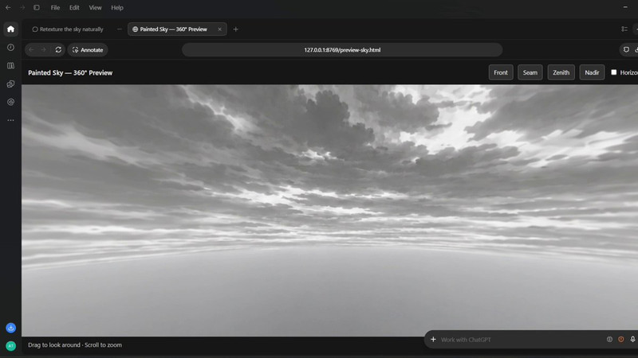</a></td>
</tr>
<tr>
<td width="50%" valign="top"><strong>A walkable bedroom with a lava lamp</strong> <a href="https://x.com/TimJayas">@TimJayas</a> · 3D &amp; interactive 0:40 · Bookmarks 0 · Details pending <a href="https://guanmo-ai.github.io/awesome-ai-motion/?lang=en#case-2105685544906952811">▶ Play</a> · <a href="https://x.com/TimJayas/status/2105685544906952811">Original post</a></td>
<td width="50%" valign="top"><strong>From a sky image to an HDRI preview</strong> <a href="https://x.com/Atomic0111">@Atomic0111</a> · 3D &amp; interactive 0:30 · Bookmarks 0 · Details pending <a href="https://guanmo-ai.github.io/awesome-ai-motion/?lang=en#case-2107499721560641723">▶ Play</a> · <a href="https://x.com/Atomic0111/status/2107499721560641723">Original post</a></td>
</tr>
</tbody>
<tbody>
<tr>
<td width="50%" height="225" align="center" valign="middle"></td>
<td width="50%" height="225" align="center" valign="middle"><a href="https://guanmo-ai.github.io/awesome-ai-motion/?lang=en#case-2107670748034908552">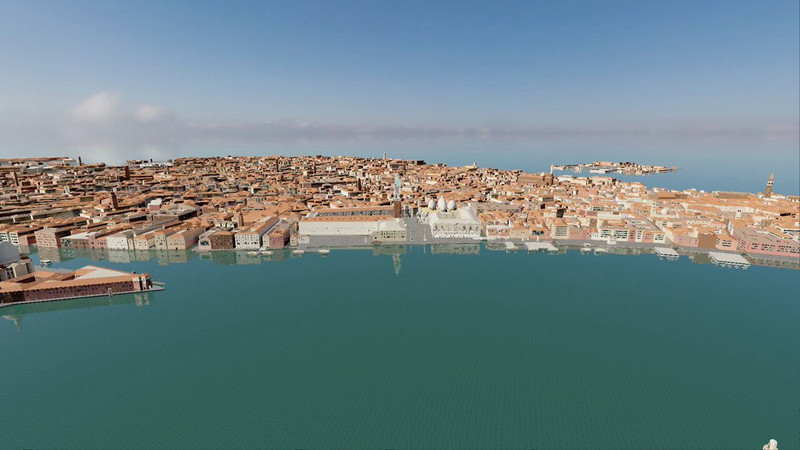</a></td>
</tr>
<tr>
<td width="50%" valign="top"><strong>Depth-map motion on a web page</strong> <a href="https://x.com/___sakurarin">@___sakurarin</a> · 3D &amp; interactive 0:30 · Bookmarks 0 · Details pending <a href="https://guanmo-ai.github.io/awesome-ai-motion/?lang=en#case-2107566590799831417">▶ Play</a> · <a href="https://x.com/___sakurarin/status/2107566590799831417">Original post</a></td>
<td width="50%" valign="top"><strong>Exploring Venice by gondola</strong> <a href="https://x.com/kzms">@kzms</a> · 3D &amp; interactive 1:08 · Bookmarks 0 · Details pending <a href="https://guanmo-ai.github.io/awesome-ai-motion/?lang=en#case-2107670748034908552">▶ Play</a> · <a href="https://x.com/kzms/status/2107670748034908552">Original post</a></td>
</tr>
</tbody>
<tbody>
<tr>
<td width="50%" height="225" align="center" valign="middle"><a href="https://guanmo-ai.github.io/awesome-ai-motion/?lang=en#case-2108184032194576811">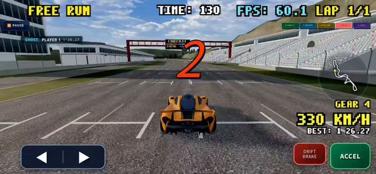</a></td>
<td width="50%" height="225" align="center" valign="middle"></td>
</tr>
<tr>
<td width="50%" valign="top"><strong>Astoro Racer: a Suzuka Circuit Iteration</strong> <a href="https://x.com/CHAPTER0423">@CHAPTER0423</a> · 3D &amp; interactive 1:30 · Bookmarks 0 · Details pending <a href="https://guanmo-ai.github.io/awesome-ai-motion/?lang=en#case-2108184032194576811">▶ Play</a> · <a href="https://x.com/CHAPTER0423/status/2108184032194576811">Original post</a></td>
<td width="50%" valign="top"><strong>Keyameleon: a Keyboard with Split-flap Keycaps</strong> <a href="https://x.com/fedemas">@fedemas</a> · 3D &amp; interactive 0:15 · Bookmarks 0 · Details pending <a href="https://guanmo-ai.github.io/awesome-ai-motion/?lang=en#case-2108400811411996801">▶ Play</a> · <a href="https://x.com/fedemas/status/2108400811411996801">Original post</a></td>
</tr>
</tbody>
<tbody>
<tr>
<td width="50%" height="225" align="center" valign="middle"><a href="https://guanmo-ai.github.io/awesome-ai-motion/?lang=en#case-2108401715494244619">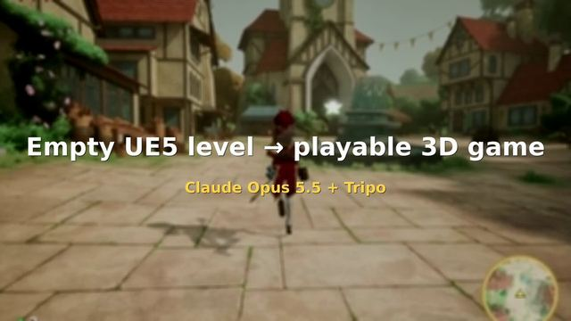</a></td>
<td width="50%" height="225" align="center" valign="middle"></td>
</tr>
<tr>
<td width="50%" valign="top"><strong>From an Empty UE5 Level to a Fantasy Game</strong> <a href="https://x.com/willa_wu7">@willa_wu7</a> · 3D &amp; interactive 0:31 · Bookmarks 0 · Details pending <a href="https://guanmo-ai.github.io/awesome-ai-motion/?lang=en#case-2108401715494244619">▶ Play</a> · <a href="https://x.com/willa_wu7/status/2108401715494244619">Original post</a></td>
<td width="50%" valign="top"><strong>A 3D Bicycle Product Demo</strong> <a href="https://x.com/EWashoku">@EWashoku</a> · 3D &amp; interactive 0:49 · Bookmarks 0 · Details pending <a href="https://guanmo-ai.github.io/awesome-ai-motion/?lang=en#case-2104211672370201053">▶ Play</a> · <a href="https://x.com/EWashoku/status/2104211672370201053">Original post</a></td>
</tr>
</tbody>
<tbody>
<tr>
<td width="50%" height="225" align="center" valign="middle"></td>
<td width="50%" height="225" align="center" valign="middle"></td>
</tr>
<tr>
<td width="50%" valign="top"><strong>An Explorable Engine: Pistons and Magnets</strong> <a href="https://x.com/StefanoStraus">@StefanoStraus</a> · 3D &amp; interactive 0:32 · Bookmarks 0 · Details pending <a href="https://guanmo-ai.github.io/awesome-ai-motion/?lang=en#case-2104236916316971191">▶ Play</a> · <a href="https://x.com/StefanoStraus/status/2104236916316971191">Original post</a></td>
<td width="50%" valign="top"><strong>3D house walkthrough video</strong> <a href="https://x.com/truenyl">@truenyl</a> · 3D &amp; interactive 1:00 · Bookmarks 0 · Details pending <a href="https://guanmo-ai.github.io/awesome-ai-motion/?lang=en#case-2104242902218285246">▶ Play</a> · <a href="https://x.com/truenyl/status/2104242902218285246">Original post</a></td>
</tr>
</tbody>
<tbody>
<tr>
<td width="50%" height="225" align="center" valign="middle"></td>
<td width="50%" height="225" align="center" valign="middle"></td>
</tr>
<tr>
<td width="50%" valign="top"><strong>Code rebuild of an older Blender project</strong> <a href="https://x.com/hasiyevv">@hasiyevv</a> · 3D &amp; interactive 0:34 · Bookmarks 0 · Details pending <a href="https://guanmo-ai.github.io/awesome-ai-motion/?lang=en#case-2104254095196602550">▶ Play</a> · <a href="https://x.com/hasiyevv/status/2104254095196602550">Original post</a></td>
<td width="50%" valign="top"><strong>Blender Lighthouse: Opus and Sonnet Comparison</strong> <a href="https://x.com/Thusatharan">@Thusatharan</a> · 3D &amp; interactive 2:33 · Bookmarks 0 · Details pending <a href="https://guanmo-ai.github.io/awesome-ai-motion/?lang=en#case-2104774377736974736">▶ Play</a> · <a href="https://x.com/Thusatharan/status/2104774377736974736">Original post</a></td>
</tr>
</tbody>
<tbody>
<tr>
<td width="50%" height="225" align="center" valign="middle"></td>
<td width="50%" height="225" align="center" valign="middle"></td>
</tr>
<tr>
<td width="50%" valign="top"><strong>A JavaScript wool-art world</strong> <a href="https://x.com/thebuggeddev">@thebuggeddev</a> · 3D &amp; interactive 0:33 · Bookmarks 0 · Details pending <a href="https://guanmo-ai.github.io/awesome-ai-motion/?lang=en#case-2105360949888840080">▶ Play</a> · <a href="https://x.com/thebuggeddev/status/2105360949888840080">Original post</a></td>
<td width="50%" valign="top"><strong>Four agents build a browser FPS</strong> <a href="https://x.com/quentin_barden">@quentin_barden</a> · 3D &amp; interactive 0:46 · Bookmarks 0 · Details pending <a href="https://guanmo-ai.github.io/awesome-ai-motion/?lang=en#case-2105583511017046319">▶ Play</a> · <a href="https://x.com/quentin_barden/status/2105583511017046319">Original post</a></td>
</tr>
</tbody>
<tbody>
<tr>
<td width="50%" height="225" align="center" valign="middle"></td>
<td width="50%" height="225" align="center" valign="middle"><a href="https://guanmo-ai.github.io/awesome-ai-motion/?lang=en#case-2106065282221424822">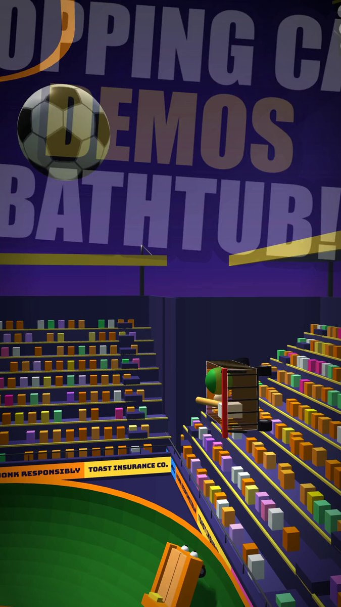</a></td>
</tr>
<tr>
<td width="50%" valign="top"><strong>A dragon siege: two Three.js interpretations</strong> <a href="https://x.com/ReconScribe">@ReconScribe</a> · 3D &amp; interactive 0:39 · Bookmarks 0 · Details pending <a href="https://guanmo-ai.github.io/awesome-ai-motion/?lang=en#case-2105659005817462972">▶ Play</a> · <a href="https://x.com/ReconScribe/status/2105659005817462972">Original post</a></td>
<td width="50%" valign="top"><strong>A code-video prototype in a baseball setting</strong> <a href="https://x.com/psicomante">@psicomante</a> · 3D &amp; interactive 0:10 · Bookmarks 0 · Details pending <a href="https://guanmo-ai.github.io/awesome-ai-motion/?lang=en#case-2106065282221424822">▶ Play</a> · <a href="https://x.com/psicomante/status/2106065282221424822">Original post</a></td>
</tr>
</tbody>
<tbody>
<tr>
<td width="50%" height="225" align="center" valign="middle"><a href="https://guanmo-ai.github.io/awesome-ai-motion/?lang=en#case-2106222619225895169">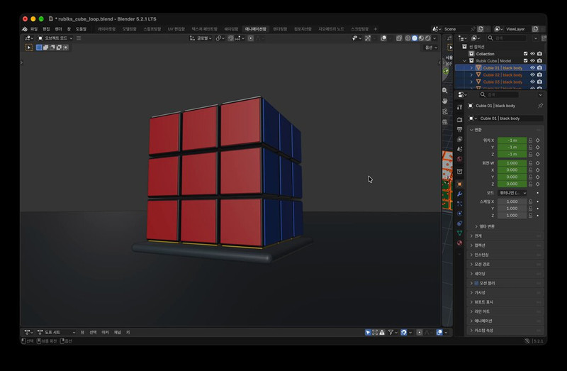</a></td>
<td width="50%" height="225" align="center" valign="middle"></td>
</tr>
<tr>
<td width="50%" valign="top"><strong>A Blender cube model and animation made with Codex</strong> <a href="https://x.com/Kyoung12292">@Kyoung12292</a> · 3D &amp; interactive 0:25 · Bookmarks 0 · Details pending <a href="https://guanmo-ai.github.io/awesome-ai-motion/?lang=en#case-2106222619225895169">▶ Play</a> · <a href="https://x.com/Kyoung12292/status/2106222619225895169">Original post</a></td>
<td width="50%" valign="top"><strong>Rain, water and a red scene in Blender</strong> <a href="https://x.com/supasaiyanian">@supasaiyanian</a> · 3D &amp; interactive 0:15 · Bookmarks 0 · Details pending <a href="https://guanmo-ai.github.io/awesome-ai-motion/?lang=en#case-2107372731721539640">▶ Play</a> · <a href="https://x.com/supasaiyanian/status/2107372731721539640">Original post</a></td>
</tr>
</tbody>
<tbody>
<tr>
<td width="50%" height="225" align="center" valign="middle"><a href="https://guanmo-ai.github.io/awesome-ai-motion/?lang=en#case-2107461457936093325">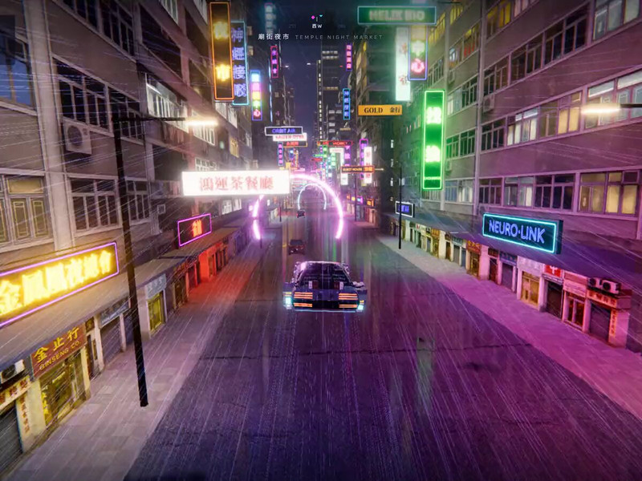</a></td>
<td width="50%" height="225" align="center" valign="middle"><a href="https://guanmo-ai.github.io/awesome-ai-motion/?lang=en#case-2107501431695495470">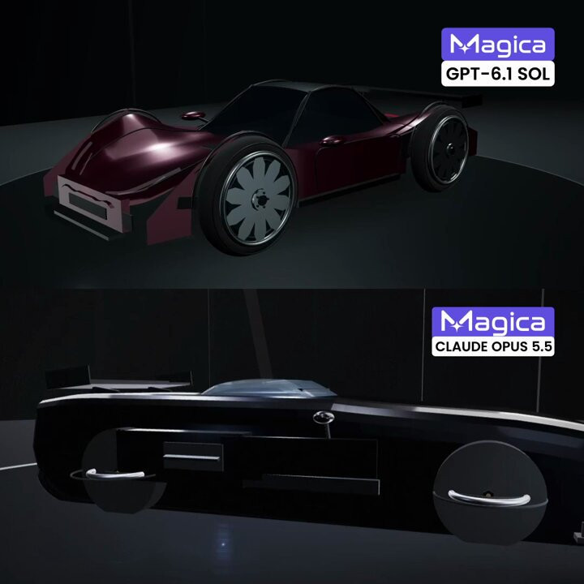</a></td>
</tr>
<tr>
<td width="50%" valign="top"><strong>Flying through rainy Kowloon</strong> <a href="https://x.com/Billpwchan">@Billpwchan</a> · 3D &amp; interactive 0:15 · Bookmarks 0 · Details pending <a href="https://guanmo-ai.github.io/awesome-ai-motion/?lang=en#case-2107461457936093325">▶ Play</a> · <a href="https://x.com/Billpwchan/status/2107461457936093325">Original post</a></td>
<td width="50%" valign="top"><strong>Magica: a 3D car-animation comparison</strong> <a href="https://x.com/magica_ai">@magica_ai</a> · 3D &amp; interactive 0:18 · Bookmarks 0 · Details pending <a href="https://guanmo-ai.github.io/awesome-ai-motion/?lang=en#case-2107501431695495470">▶ Play</a> · <a href="https://x.com/magica_ai/status/2107501431695495470">Original post</a></td>
</tr>
</tbody>
<tbody>
<tr>
<td width="50%" height="225" align="center" valign="middle"><a href="https://guanmo-ai.github.io/awesome-ai-motion/?lang=en#case-2107501594992423246">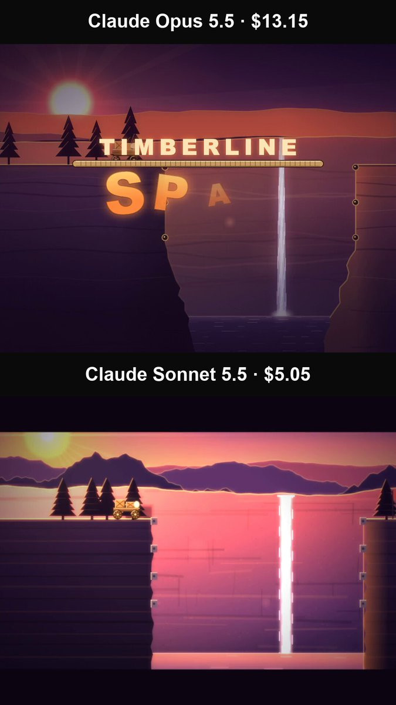</a></td>
<td width="50%" height="225" align="center" valign="middle"><a href="https://guanmo-ai.github.io/awesome-ai-motion/?lang=en#case-2107668414424830249">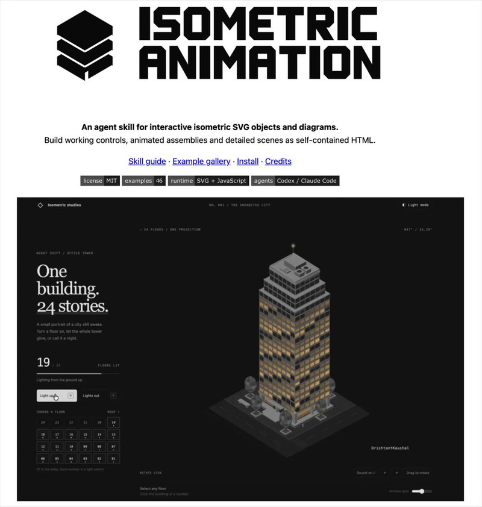</a></td>
</tr>
<tr>
<td width="50%" valign="top"><strong>Timberline Span: bridge game and trailer</strong> <a href="https://x.com/jeffbruchado">@jeffbruchado</a> · 3D &amp; interactive 0:15 · Bookmarks 0 · Details pending <a href="https://guanmo-ai.github.io/awesome-ai-motion/?lang=en#case-2107501594992423246">▶ Play</a> · <a href="https://x.com/jeffbruchado/status/2107501594992423246">Original post</a></td>
<td width="50%" valign="top"><strong>Interactive isometric SVG scenes</strong> <a href="https://x.com/_drishtantk">@_drishtantk</a> · 3D &amp; interactive 0:19 · Bookmarks 0 · Details pending <a href="https://guanmo-ai.github.io/awesome-ai-motion/?lang=en#case-2107668414424830249">▶ Play</a> · <a href="https://x.com/_drishtantk/status/2107668414424830249">Original post</a></td>
</tr>
</tbody>
<tbody>
<tr>
<td width="50%" height="225" align="center" valign="middle"><a href="https://guanmo-ai.github.io/awesome-ai-motion/?lang=en#case-2107671507078156328">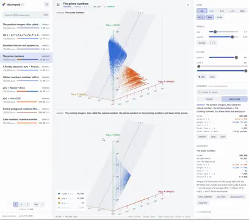</a></td>
<td width="50%" height="225" align="center" valign="middle"><a href="https://guanmo-ai.github.io/awesome-ai-motion/?lang=en#case-2107774659764822423">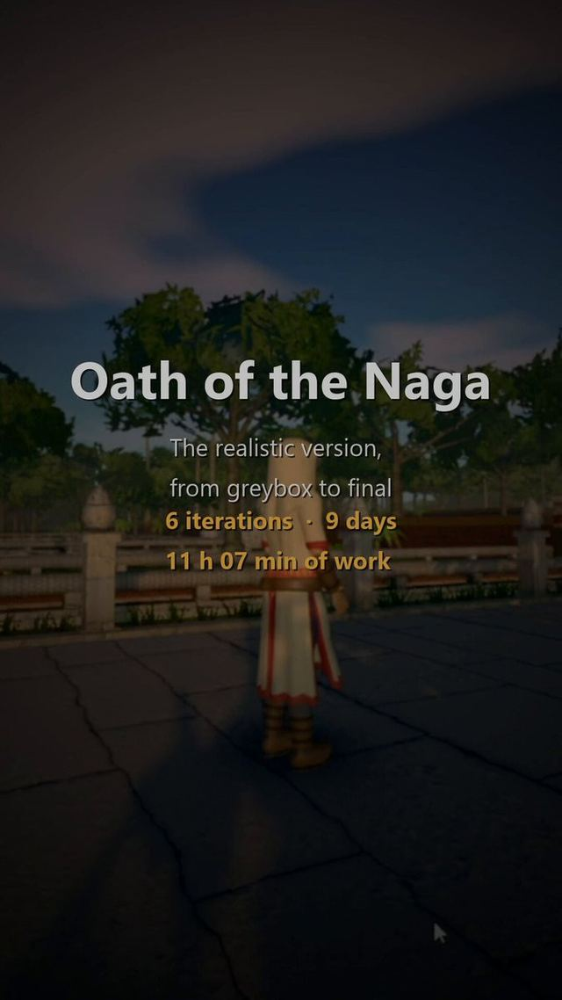</a></td>
</tr>
<tr>
<td width="50%" valign="top"><strong>Integer sequences in interactive 3D</strong> <a href="https://x.com/decompwlj">@decompwlj</a> · 3D &amp; interactive 0:30 · Bookmarks 0 · Details pending <a href="https://guanmo-ai.github.io/awesome-ai-motion/?lang=en#case-2107671507078156328">▶ Play</a> · <a href="https://x.com/decompwlj/status/2107671507078156328">Original post</a></td>
<td width="50%" valign="top"><strong>An Angkor Temple Game-scene Experiment</strong> <a href="https://x.com/alifeofdesignTV">@alifeofdesignTV</a> · 3D &amp; interactive 0:44 · Bookmarks 0 · Details pending <a href="https://guanmo-ai.github.io/awesome-ai-motion/?lang=en#case-2107774659764822423">▶ Play</a> · <a href="https://x.com/alifeofdesignTV/status/2107774659764822423">Original post</a></td>
</tr>
</tbody>
<tbody>
<tr>
<td width="50%" height="225" align="center" valign="middle"></td>
<td width="50%" height="225" align="center" valign="middle"><a href="https://guanmo-ai.github.io/awesome-ai-motion/?lang=en#case-2108317049613115767">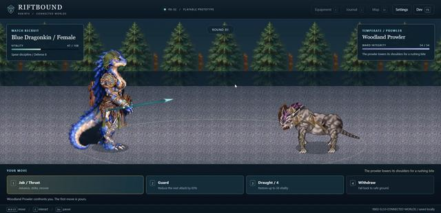</a></td>
</tr>
<tr>
<td width="50%" valign="top"><strong>A Weather-aware Wardrobe Prototype</strong> <a href="https://x.com/Mohd_Ainan17">@Mohd_Ainan17</a> · 3D &amp; interactive 0:45 · Bookmarks 0 · Details pending <a href="https://guanmo-ai.github.io/awesome-ai-motion/?lang=en#case-2107914558916677642">▶ Play</a> · <a href="https://x.com/Mohd_Ainan17/status/2107914558916677642">Original post</a></td>
<td width="50%" valign="top"><strong>A Cat-beast Encounter in a Game Rebuild</strong> <a href="https://x.com/kephen20936">@kephen20936</a> · 3D &amp; interactive 4:21 · Bookmarks 0 · Details pending <a href="https://guanmo-ai.github.io/awesome-ai-motion/?lang=en#case-2108317049613115767">▶ Play</a> · <a href="https://x.com/kephen20936/status/2108317049613115767">Original post</a></td>
</tr>
</tbody>
<tbody>
<tr>
<td width="50%" height="225" align="center" valign="middle"><a href="https://guanmo-ai.github.io/awesome-ai-motion/?lang=en#case-2108326043115229415">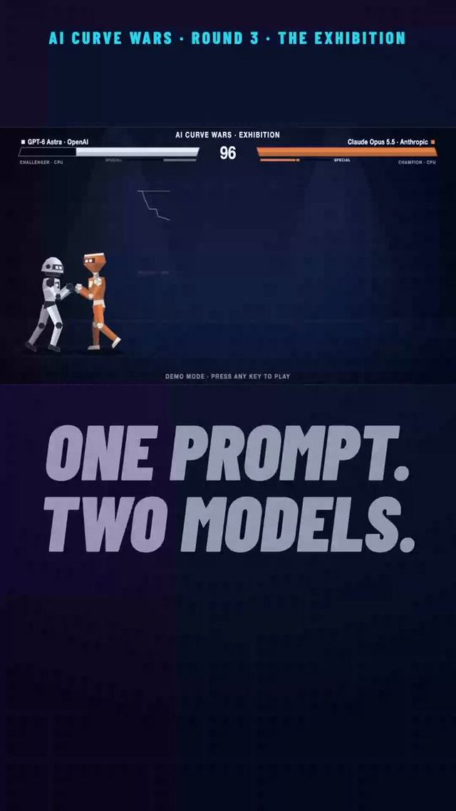</a></td>
<td width="50%" height="225" align="center" valign="middle"><a href="https://guanmo-ai.github.io/awesome-ai-motion/?lang=en#case-2108337781198217451">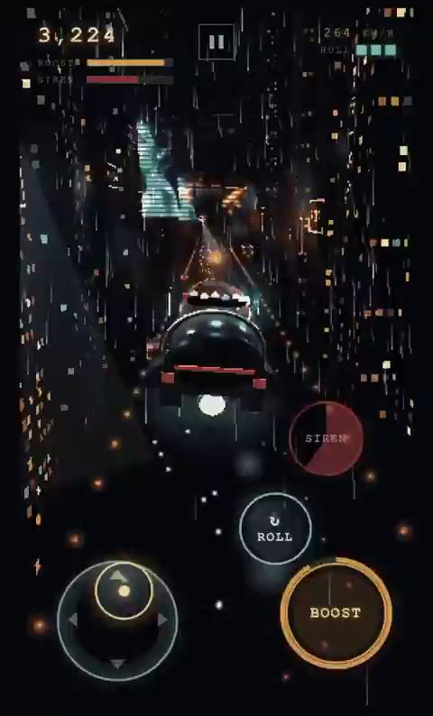</a></td>
</tr>
<tr>
<td width="50%" valign="top"><strong>Two Models Make an Auto-fighting Single File</strong> <a href="https://x.com/AIcurvewars">@AIcurvewars</a> · 3D &amp; interactive 0:47 · Bookmarks 0 · Details pending <a href="https://guanmo-ai.github.io/awesome-ai-motion/?lang=en#case-2108326043115229415">▶ Play</a> · <a href="https://x.com/AIcurvewars/status/2108326043115229415">Original post</a></td>
<td width="50%" valign="top"><strong>Sky Runner: a Vertical Flight Game</strong> <a href="https://x.com/JohnSlagboom1">@JohnSlagboom1</a> · 3D &amp; interactive 1:17 · Bookmarks 0 · Details pending <a href="https://guanmo-ai.github.io/awesome-ai-motion/?lang=en#case-2108337781198217451">▶ Play</a> · <a href="https://x.com/JohnSlagboom1/status/2108337781198217451">Original post</a></td>
</tr>
</tbody>
<tbody>
<tr>
<td width="50%" height="225" align="center" valign="middle"><a href="https://guanmo-ai.github.io/awesome-ai-motion/?lang=en#case-2108357235625873419">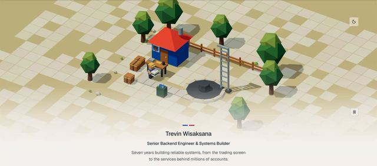</a></td>
<td width="50%" height="225" align="center" valign="middle"><a href="https://guanmo-ai.github.io/awesome-ai-motion/?lang=en#case-2108381328299176238">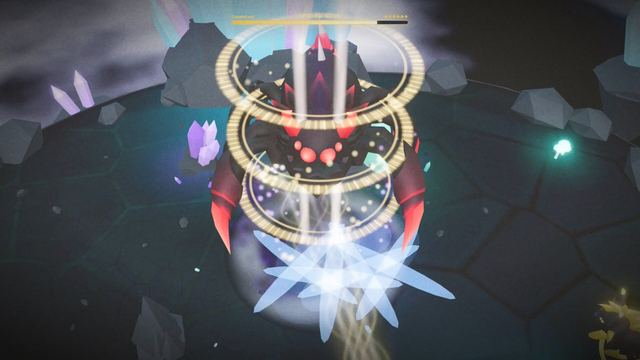</a></td>
</tr>
<tr>
<td width="50%" valign="top"><strong>An Isometric Cottage Portfolio Entrance</strong> <a href="https://x.com/TrevinWisaksana">@TrevinWisaksana</a> · 3D &amp; interactive 0:33 · Bookmarks 0 · Details pending <a href="https://guanmo-ai.github.io/awesome-ai-motion/?lang=en#case-2108357235625873419">▶ Play</a> · <a href="https://x.com/TrevinWisaksana/status/2108357235625873419">Original post</a></td>
<td width="50%" valign="top"><strong>A Co-op Combat Game Built over Many Iterations</strong> <a href="https://x.com/AlandysGame">@AlandysGame</a> · 3D &amp; interactive 1:31 · Bookmarks 0 · Details pending <a href="https://guanmo-ai.github.io/awesome-ai-motion/?lang=en#case-2108381328299176238">▶ Play</a> · <a href="https://x.com/AlandysGame/status/2108381328299176238">Original post</a></td>
</tr>
</tbody>
<tbody>
<tr>
<td width="50%" height="225" align="center" valign="middle"><a href="https://guanmo-ai.github.io/awesome-ai-motion/?lang=en#case-2108402902666756345">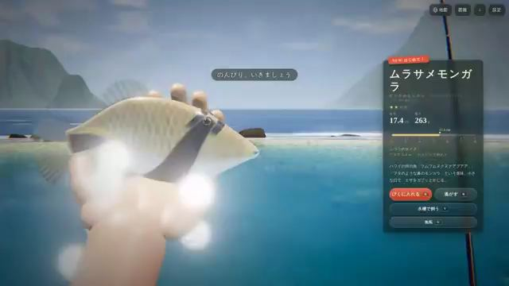</a></td>
<td width="50%" height="225" align="center" valign="middle"><a href="https://guanmo-ai.github.io/awesome-ai-motion/?lang=en#case-2108405098565029986">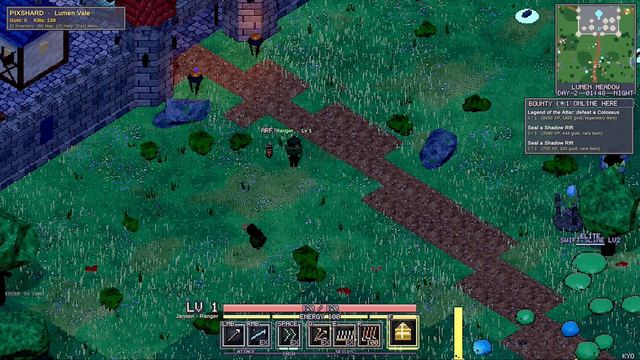</a></td>
</tr>
<tr>
<td width="50%" valign="top"><strong>Hidamari Numa: a Fishing Game with Travel</strong> <a href="https://x.com/seicolor">@seicolor</a> · 3D &amp; interactive 1:00 · Bookmarks 0 · Details pending <a href="https://guanmo-ai.github.io/awesome-ai-motion/?lang=en#case-2108402902666756345">▶ Play</a> · <a href="https://x.com/seicolor/status/2108402902666756345">Original post</a></td>
<td width="50%" valign="top"><strong>Pixshard: a Multiplayer Elemental-gear Game</strong> <a href="https://x.com/0xRayer">@0xRayer</a> · 3D &amp; interactive 1:20 · Bookmarks 0 · Details pending <a href="https://guanmo-ai.github.io/awesome-ai-motion/?lang=en#case-2108405098565029986">▶ Play</a> · <a href="https://x.com/0xRayer/status/2108405098565029986">Original post</a></td>
</tr>
</tbody>
<tbody>
<tr>
<td width="50%" height="225" align="center" valign="middle"><a href="https://guanmo-ai.github.io/awesome-ai-motion/?lang=en#case-2108466187529314717">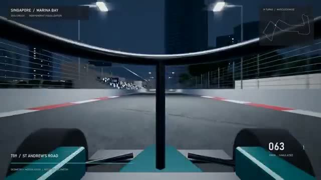</a></td>
<td width="50%" height="225" align="center" valign="middle"></td>
</tr>
<tr>
<td width="50%" valign="top"><strong>A Virtual Night Lap Around Marina Bay</strong> <a href="https://x.com/DarrenTjan">@DarrenTjan</a> · 3D &amp; interactive 2:16 · Bookmarks 0 · Details pending <a href="https://guanmo-ai.github.io/awesome-ai-motion/?lang=en#case-2108466187529314717">▶ Play</a> · <a href="https://x.com/DarrenTjan/status/2108466187529314717">Original post</a></td>
<td width="50%" valign="top"><strong>Roadster: a Flying-Car Game Trailer</strong> <a href="https://x.com/k_millionaire_">@k_millionaire_</a> · 3D &amp; interactive 0:30 · Bookmarks 0 · Details pending <a href="https://guanmo-ai.github.io/awesome-ai-motion/?lang=en#case-2108490551385624581">▶ Play</a> · <a href="https://x.com/k_millionaire_/status/2108490551385624581">Original post</a></td>
</tr>
</tbody>
<tbody>
<tr>
<td width="50%" height="225" align="center" valign="middle"><a href="https://guanmo-ai.github.io/awesome-ai-motion/?lang=en#case-2108521844819337635">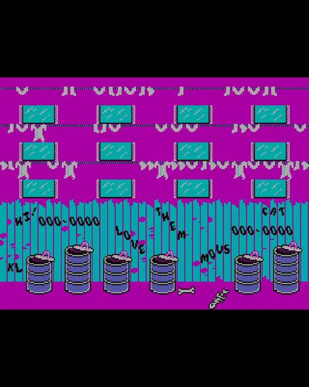</a></td>
<td width="50%"></td>
</tr>
<tr>
<td width="50%" valign="top"><strong>Alley Cat: CGA and HD Remaster Comparison</strong> <a href="https://x.com/davidkal88">@davidkal88</a> · 3D &amp; interactive 0:35 · Bookmarks 0 · Details pending <a href="https://guanmo-ai.github.io/awesome-ai-motion/?lang=en#case-2108521844819337635">▶ Play</a> · <a href="https://x.com/davidkal88/status/2108521844819337635">Original post</a></td>
<td width="50%"></td>
</tr>
</tbody>
</table>
