[← 全部分类](../README.md#browse)

# 交互演示

76 个作品。点击封面播放；没有画廊视频时会前往 X 原帖。

<table>
<tbody>
<tr>
<td width="50%" height="225" align="center" valign="middle"></td>
<td width="50%" height="225" align="center" valign="middle"><a href="https://guanmo-ai.github.io/awesome-ai-motion/#case-2102450239923720440">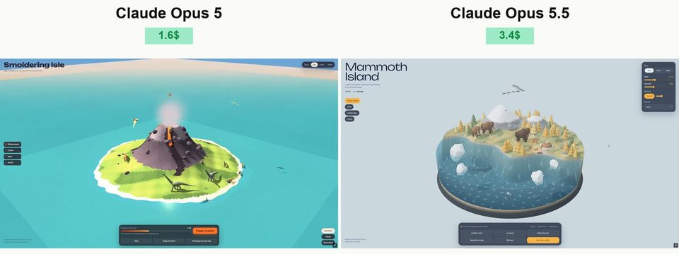</a></td>
</tr>
<tr>
<td width="50%" valign="top"><strong>桃花源记：循文入境的三维长卷</strong> <a href="https://x.com/dotey">@dotey</a> · 交互演示 4:17 · 收藏 460 · 资料待完善 <a href="https://guanmo-ai.github.io/awesome-ai-motion/#case-2102940980379017293">▶ 播放</a> · <a href="https://x.com/dotey/status/2102940980379017293">原帖</a></td>
<td width="50%" valign="top"><strong>史前岛屿的水上与水下</strong> <a href="https://x.com/vib3coded">@vib3coded</a> · 交互演示 0:20 · 收藏 77 <a href="https://guanmo-ai.github.io/awesome-ai-motion/#case-2102450239923720440">▶ 播放</a> · <a href="https://x.com/vib3coded/status/2102450239923720440">原帖</a></td>
</tr>
</tbody>
<tbody>
<tr>
<td width="50%" height="225" align="center" valign="middle"></td>
<td width="50%" height="225" align="center" valign="middle"><a href="https://guanmo-ai.github.io/awesome-ai-motion/#case-2104590334152056983">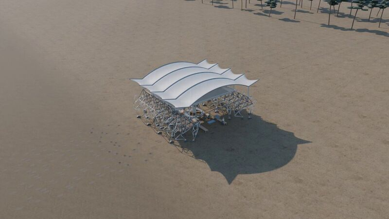</a></td>
</tr>
<tr>
<td width="50%" valign="top"><strong>海边栈桥上的骑车鹈鹕</strong> <a href="https://x.com/AxtonLiu">@AxtonLiu</a> · 交互演示 0:38 · 收藏 57 · 资料待完善 <a href="https://guanmo-ai.github.io/awesome-ai-motion/#case-2103119648271290566">▶ 播放</a> · <a href="https://x.com/AxtonLiu/status/2103119648271290566">原帖</a></td>
<td width="50%" valign="top"><strong>行走的建筑：可容纳人的移动空间</strong> <a href="https://x.com/shion_takk">@shion_takk</a> · 交互演示 0:30 · 收藏 3 · 资料待完善 <a href="https://guanmo-ai.github.io/awesome-ai-motion/#case-2104590334152056983">▶ 播放</a> · <a href="https://x.com/shion_takk/status/2104590334152056983">原帖</a></td>
</tr>
</tbody>
<tbody>
<tr>
<td width="50%" height="225" align="center" valign="middle"><a href="https://guanmo-ai.github.io/awesome-ai-motion/#case-2105245039521628213">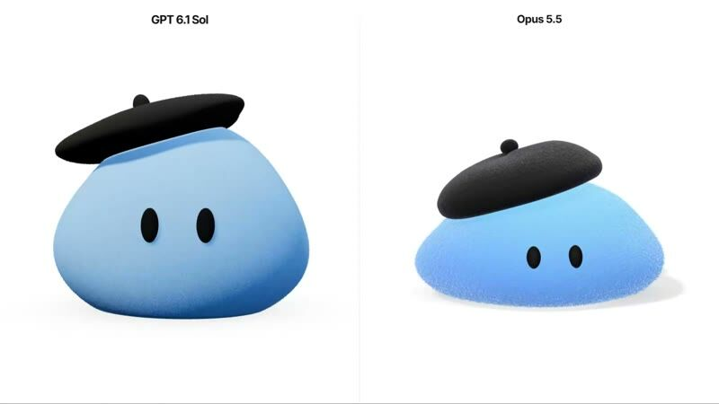</a></td>
<td width="50%" height="225" align="center" valign="middle"><a href="https://guanmo-ai.github.io/awesome-ai-motion/#case-2104001664793600012">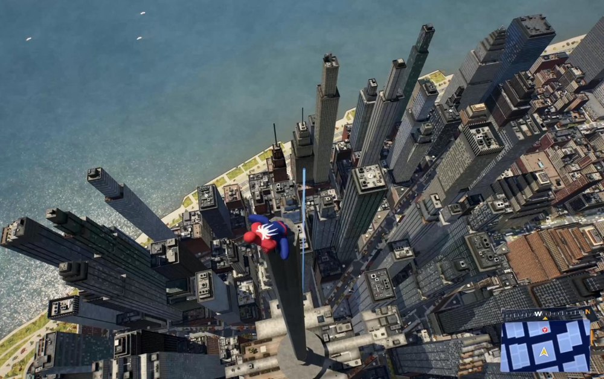</a></td>
</tr>
<tr>
<td width="50%" valign="top"><strong>毛绒角色：Sol 与 Opus 同参考对比</strong> <a href="https://x.com/JakubAntowski">@JakubAntowski</a> · 交互演示 0:20 · 收藏 0 · 资料待完善 <a href="https://guanmo-ai.github.io/awesome-ai-motion/#case-2105245039521628213">▶ 播放</a> · <a href="https://x.com/JakubAntowski/status/2105245039521628213">原帖</a></td>
<td width="50%" valign="top"><strong>Spiderbench：浏览器里的城市荡行</strong> <a href="https://x.com/xikhar">@xikhar</a> · 交互演示 2:21 · 收藏 3,777 · 资料待完善 <a href="https://guanmo-ai.github.io/awesome-ai-motion/#case-2104001664793600012">▶ 播放</a> · <a href="https://x.com/xikhar/status/2104001664793600012">原帖</a></td>
</tr>
</tbody>
<tbody>
<tr>
<td width="50%" height="225" align="center" valign="middle"><a href="https://guanmo-ai.github.io/awesome-ai-motion/#case-2096264296099459079">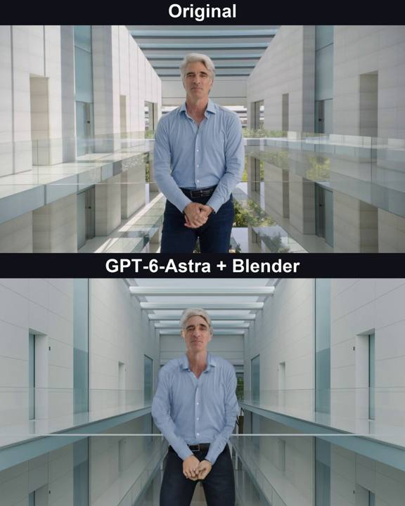</a></td>
<td width="50%" height="225" align="center" valign="middle"><a href="https://guanmo-ai.github.io/awesome-ai-motion/#case-2095756085890310311">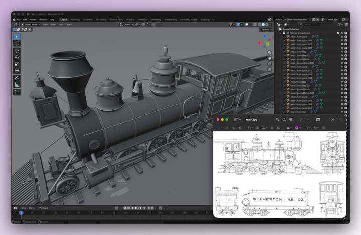</a></td>
</tr>
<tr>
<td width="50%" valign="top"><strong>会议演讲镜头的 Blender 复现</strong> <a href="https://x.com/petergostev">@petergostev</a> · 交互演示 0:20 · 收藏 3,710 · 资料待完善 <a href="https://guanmo-ai.github.io/awesome-ai-motion/#case-2096264296099459079">▶ 播放</a> · <a href="https://x.com/petergostev/status/2096264296099459079">原帖</a></td>
<td width="50%" valign="top"><strong>手绘蒸汽列车变三维模型</strong> <a href="https://x.com/tomkrcha">@tomkrcha</a> · 交互演示 0:34 · 收藏 3,540 · 资料待完善 <a href="https://guanmo-ai.github.io/awesome-ai-motion/#case-2095756085890310311">▶ 播放</a> · <a href="https://x.com/tomkrcha/status/2095756085890310311">原帖</a></td>
</tr>
</tbody>
<tbody>
<tr>
<td width="50%" height="225" align="center" valign="middle"><a href="https://guanmo-ai.github.io/awesome-ai-motion/#case-2102786378282987591">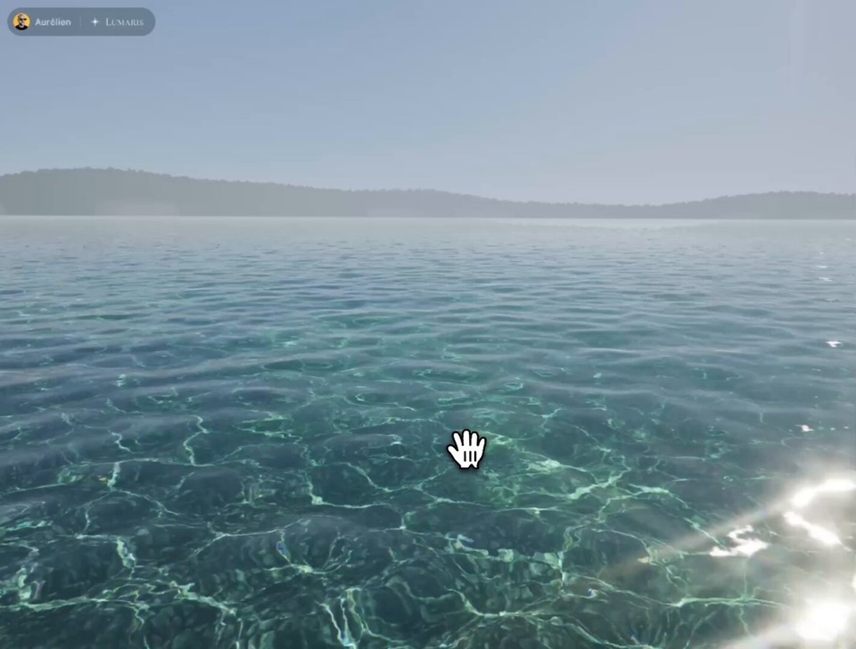</a></td>
<td width="50%" height="225" align="center" valign="middle"><a href="https://guanmo-ai.github.io/awesome-ai-motion/#case-2102463453176979794">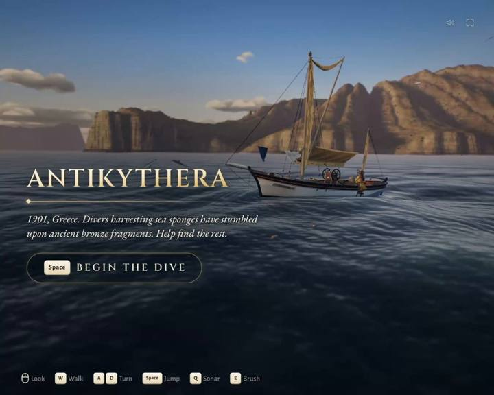</a></td>
</tr>
<tr>
<td width="50%" valign="top"><strong>Clearwater：实时浅水与交互涟漪</strong> <a href="https://x.com/Aurelien_Gz">@Aurelien_Gz</a> · 交互演示 0:27 · 收藏 2,612 <a href="https://guanmo-ai.github.io/awesome-ai-motion/#case-2102786378282987591">▶ 播放</a> · <a href="https://x.com/Aurelien_Gz/status/2102786378282987591">原帖</a></td>
<td width="50%" valign="top"><strong>安提基特拉海底游戏演示</strong> <a href="https://x.com/edwinarbus">@edwinarbus</a> · 交互演示 1:00 · 收藏 1,701 · 资料待完善 <a href="https://guanmo-ai.github.io/awesome-ai-motion/#case-2102463453176979794">▶ 播放</a> · <a href="https://x.com/edwinarbus/status/2102463453176979794">原帖</a></td>
</tr>
</tbody>
<tbody>
<tr>
<td width="50%" height="225" align="center" valign="middle"></td>
<td width="50%" height="225" align="center" valign="middle"><a href="https://guanmo-ai.github.io/awesome-ai-motion/#case-2102445641205248145">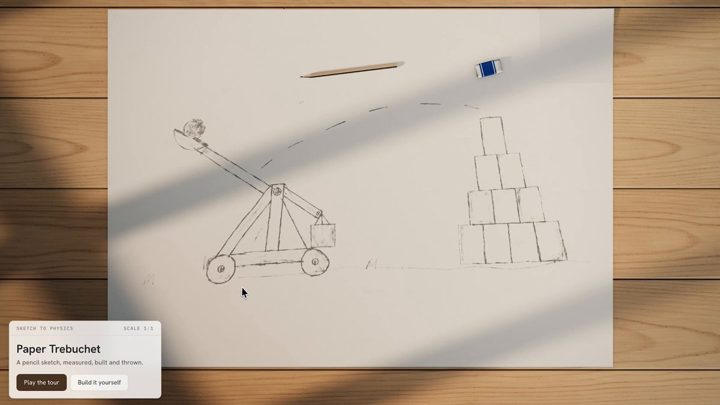</a></td>
</tr>
<tr>
<td width="50%" valign="top"><strong>代码绘制的山间溪流</strong> <a href="https://x.com/hayashimon1">@hayashimon1</a> · 交互演示 0:15 · 收藏 1,188 · 资料待完善 <a href="https://guanmo-ai.github.io/awesome-ai-motion/#case-2102576886182453454">▶ 播放</a> · <a href="https://x.com/hayashimon1/status/2102576886182453454">原帖</a></td>
<td width="50%" valign="top"><strong>投石机草图变交互模拟</strong> <a href="https://x.com/poolio">@poolio</a> · 交互演示 1:20 · 收藏 1,073 · 资料待完善 <a href="https://guanmo-ai.github.io/awesome-ai-motion/#case-2102445641205248145">▶ 播放</a> · <a href="https://x.com/poolio/status/2102445641205248145">原帖</a></td>
</tr>
</tbody>
<tbody>
<tr>
<td width="50%" height="225" align="center" valign="middle"><a href="https://guanmo-ai.github.io/awesome-ai-motion/#case-2102471841046786153">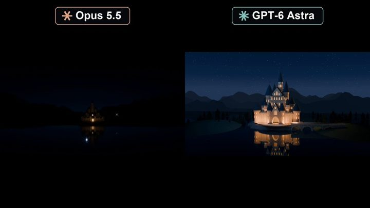</a></td>
<td width="50%" height="225" align="center" valign="middle"><a href="https://guanmo-ai.github.io/awesome-ai-motion/#case-2104548658171834749">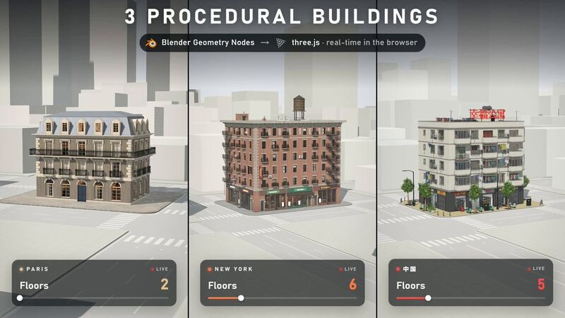</a></td>
</tr>
<tr>
<td width="50%" valign="top"><strong>两模型的程序化 Blender 镜头</strong> <a href="https://x.com/Stefan_3D_AI">@Stefan_3D_AI</a> · 交互演示 0:46 · 收藏 773 · 资料待完善 <a href="https://guanmo-ai.github.io/awesome-ai-motion/#case-2102471841046786153">▶ 播放</a> · <a href="https://x.com/Stefan_3D_AI/status/2102471841046786153">原帖</a></td>
<td width="50%" valign="top"><strong>程序化建筑：从 Blender 节点到网页城市</strong> <a href="https://x.com/chirovisuals">@chirovisuals</a> · 交互演示 1:15 · 收藏 673 · 资料待完善 <a href="https://guanmo-ai.github.io/awesome-ai-motion/#case-2104548658171834749">▶ 播放</a> · <a href="https://x.com/chirovisuals/status/2104548658171834749">原帖</a></td>
</tr>
</tbody>
<tbody>
<tr>
<td width="50%" height="225" align="center" valign="middle"><a href="https://guanmo-ai.github.io/awesome-ai-motion/#case-2103138089790996843">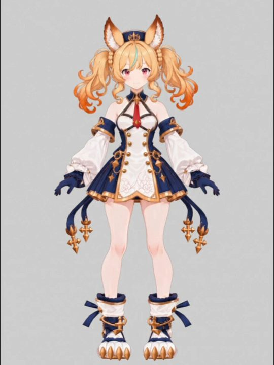</a></td>
<td width="50%" height="225" align="center" valign="middle"><a href="https://guanmo-ai.github.io/awesome-ai-motion/#case-2103122947133309311">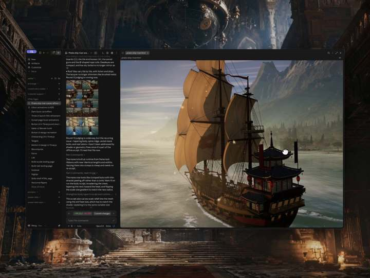</a></td>
</tr>
<tr>
<td width="50%" valign="top"><strong>3D 角色表情与动作实验</strong> <a href="https://x.com/manaimovie">@manaimovie</a> · 交互演示 0:05 · 收藏 618 · 资料待完善 <a href="https://guanmo-ai.github.io/awesome-ai-motion/#case-2103138089790996843">▶ 播放</a> · <a href="https://x.com/manaimovie/status/2103138089790996843">原帖</a></td>
<td width="50%" valign="top"><strong>龙纹帆船的程序化场景</strong> <a href="https://x.com/MengTo">@MengTo</a> · 交互演示 1:08 · 收藏 617 · 资料待完善 <a href="https://guanmo-ai.github.io/awesome-ai-motion/#case-2103122947133309311">▶ 播放</a> · <a href="https://x.com/MengTo/status/2103122947133309311">原帖</a></td>
</tr>
</tbody>
<tbody>
<tr>
<td width="50%" height="225" align="center" valign="middle"><a href="https://guanmo-ai.github.io/awesome-ai-motion/#case-2103117246860345550">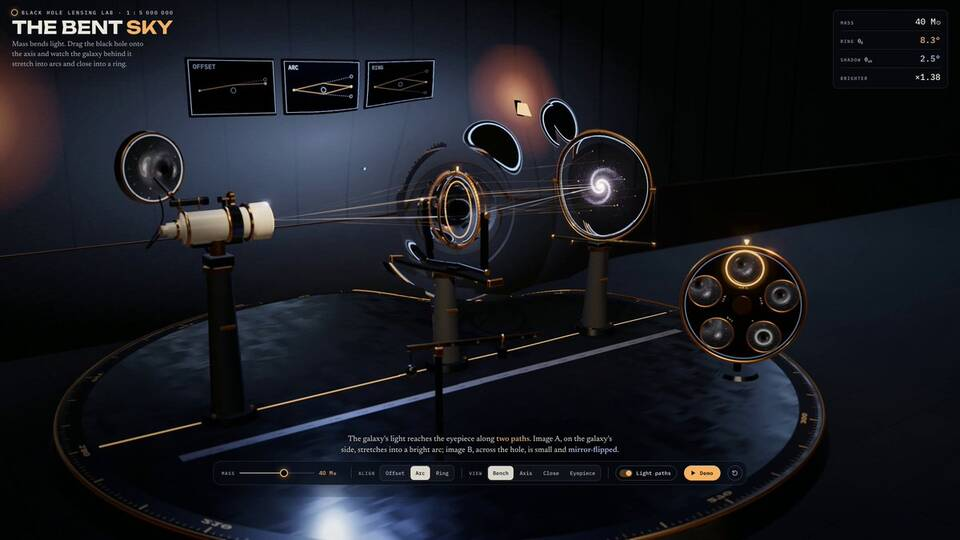</a></td>
<td width="50%" height="225" align="center" valign="middle"><a href="https://guanmo-ai.github.io/awesome-ai-motion/#case-2102740041621762166">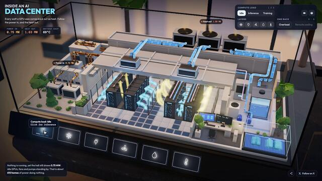</a></td>
</tr>
<tr>
<td width="50%" valign="top"><strong>可拖动黑洞的引力透镜实验室</strong> <a href="https://x.com/Voxyz_ai">@Voxyz_ai</a> · 交互演示 0:22 · 收藏 468 · 资料待完善 <a href="https://guanmo-ai.github.io/awesome-ai-motion/#case-2103117246860345550">▶ 播放</a> · <a href="https://x.com/Voxyz_ai/status/2103117246860345550">原帖</a></td>
<td width="50%" valign="top"><strong>数据中心内部的交互式 3D 导览</strong> <a href="https://x.com/RyanSael">@RyanSael</a> · 交互演示 0:34 · 收藏 425 · 资料待完善 <a href="https://guanmo-ai.github.io/awesome-ai-motion/#case-2102740041621762166">▶ 播放</a> · <a href="https://x.com/RyanSael/status/2102740041621762166">原帖</a></td>
</tr>
</tbody>
<tbody>
<tr>
<td width="50%" height="225" align="center" valign="middle"></td>
<td width="50%" height="225" align="center" valign="middle"><a href="https://guanmo-ai.github.io/awesome-ai-motion/#case-2102449278283313303">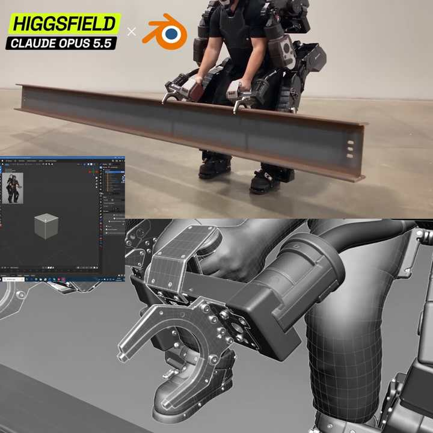</a></td>
</tr>
<tr>
<td width="50%" valign="top"><strong>1906 年旧金山街景复现</strong> <a href="https://x.com/alexalbert__">@alexalbert__</a> · 交互演示 0:08 · 收藏 418 · 资料待完善 <a href="https://guanmo-ai.github.io/awesome-ai-motion/#case-2102466523164274839">▶ 播放</a> · <a href="https://x.com/alexalbert__/status/2102466523164274839">原帖</a></td>
<td width="50%" valign="top"><strong>Blender 外骨骼重设计</strong> <a href="https://x.com/higgsfield_ai">@higgsfield_ai</a> · 交互演示 0:29 · 收藏 298 · 资料待完善 <a href="https://guanmo-ai.github.io/awesome-ai-motion/#case-2102449278283313303">▶ 播放</a> · <a href="https://x.com/higgsfield_ai/status/2102449278283313303">原帖</a></td>
</tr>
</tbody>
<tbody>
<tr>
<td width="50%" height="225" align="center" valign="middle"></td>
<td width="50%" height="225" align="center" valign="middle"><a href="https://guanmo-ai.github.io/awesome-ai-motion/#case-2102641562824135022">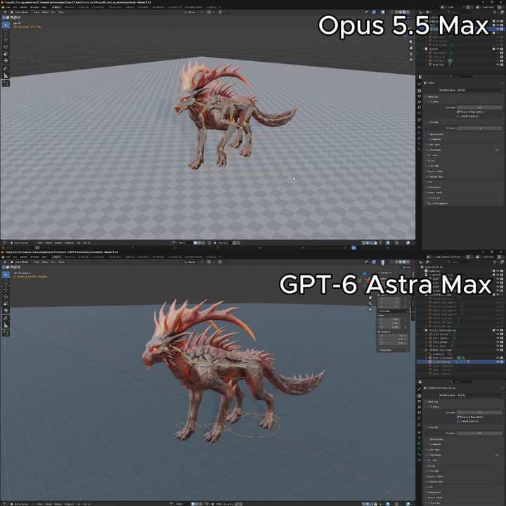</a></td>
</tr>
<tr>
<td width="50%" valign="top"><strong>Blender 三维镜头实验</strong> <a href="https://x.com/superalesha">@superalesha</a> · 交互演示 1:01 · 收藏 285 · 资料待完善 <a href="https://guanmo-ai.github.io/awesome-ai-motion/#case-2102487989381156991">▶ 播放</a> · <a href="https://x.com/superalesha/status/2102487989381156991">原帖</a></td>
<td width="50%" valign="top"><strong>3D 生物绑定与动作测试</strong> <a href="https://x.com/Stefan_3D_AI">@Stefan_3D_AI</a> · 交互演示 0:25 · 收藏 256 · 资料待完善 <a href="https://guanmo-ai.github.io/awesome-ai-motion/#case-2102641562824135022">▶ 播放</a> · <a href="https://x.com/Stefan_3D_AI/status/2102641562824135022">原帖</a></td>
</tr>
</tbody>
<tbody>
<tr>
<td width="50%" height="225" align="center" valign="middle"><a href="https://guanmo-ai.github.io/awesome-ai-motion/#case-2102453658889953717">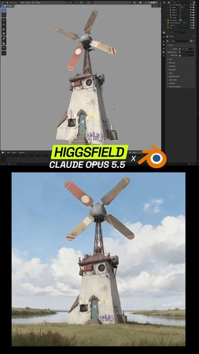</a></td>
<td width="50%" height="225" align="center" valign="middle"><a href="https://guanmo-ai.github.io/awesome-ai-motion/#case-2104216976801587629">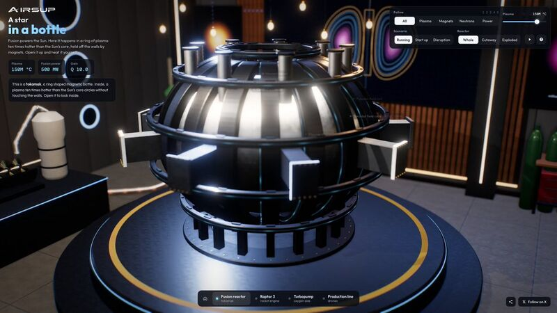</a></td>
</tr>
<tr>
<td width="50%" valign="top"><strong>Blender 风车建模与动画</strong> <a href="https://x.com/higgsfield_ai">@higgsfield_ai</a> · 交互演示 0:21 · 收藏 223 · 资料待完善 <a href="https://guanmo-ai.github.io/awesome-ai-motion/#case-2102453658889953717">▶ 播放</a> · <a href="https://x.com/higgsfield_ai/status/2102453658889953717">原帖</a></td>
<td width="50%" valign="top"><strong>可拆解聚变反应堆讲解</strong> <a href="https://x.com/konstantinsaifo">@konstantinsaifo</a> · 交互演示 0:43 · 收藏 174 · 资料待完善 <a href="https://guanmo-ai.github.io/awesome-ai-motion/#case-2104216976801587629">▶ 播放</a> · <a href="https://x.com/konstantinsaifo/status/2104216976801587629">原帖</a></td>
</tr>
</tbody>
<tbody>
<tr>
<td width="50%" height="225" align="center" valign="middle"></td>
<td width="50%" height="225" align="center" valign="middle"><a href="https://guanmo-ai.github.io/awesome-ai-motion/#case-2104520072014508316">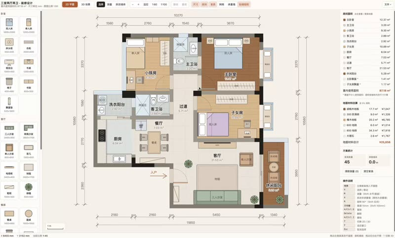</a></td>
</tr>
<tr>
<td width="50%" valign="top"><strong>体素风模型自画像</strong> <a href="https://x.com/blueemi99">@blueemi99</a> · 交互演示 0:15 · 收藏 171 · 资料待完善 <a href="https://guanmo-ai.github.io/awesome-ai-motion/#case-2102511304456212763">▶ 播放</a> · <a href="https://x.com/blueemi99/status/2102511304456212763">原帖</a></td>
<td width="50%" valign="top"><strong>户型装修：从二维平面过渡到三维漫游</strong> <a href="https://x.com/akokoi1">@akokoi1</a> · 交互演示 0:33 · 收藏 137 · 资料待完善 <a href="https://guanmo-ai.github.io/awesome-ai-motion/#case-2104520072014508316">▶ 播放</a> · <a href="https://x.com/akokoi1/status/2104520072014508316">原帖</a></td>
</tr>
</tbody>
<tbody>
<tr>
<td width="50%" height="225" align="center" valign="middle"><a href="https://guanmo-ai.github.io/awesome-ai-motion/#case-2104800823620632641">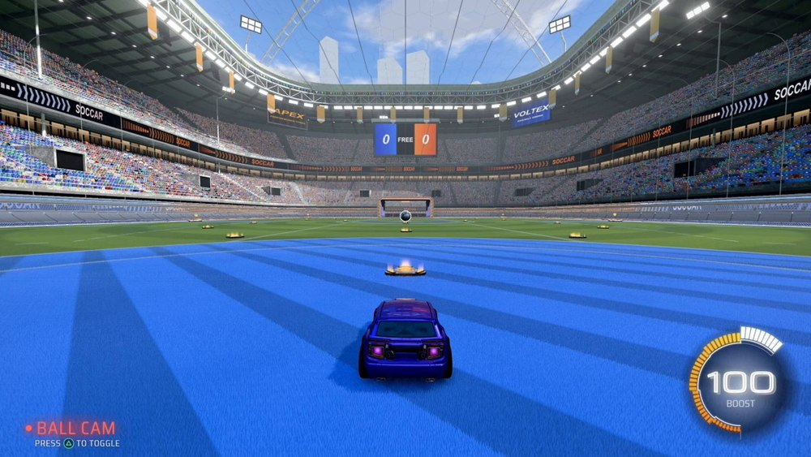</a></td>
<td width="50%" height="225" align="center" valign="middle"><a href="https://guanmo-ai.github.io/awesome-ai-motion/#case-2102623690152419633">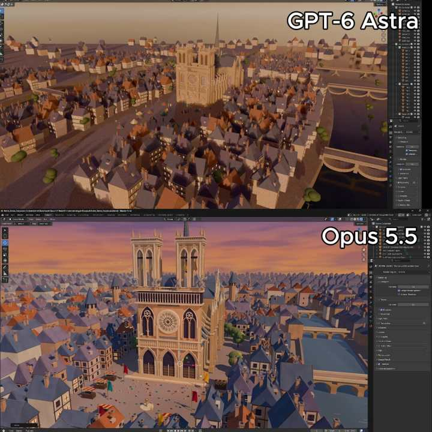</a></td>
</tr>
<tr>
<td width="50%" valign="top"><strong>浏览器中的火箭车足球</strong> <a href="https://x.com/BlendiByl">@BlendiByl</a> · 交互演示 0:39 · 收藏 83 · 资料待完善 <a href="https://guanmo-ai.github.io/awesome-ai-motion/#case-2104800823620632641">▶ 播放</a> · <a href="https://x.com/BlendiByl/status/2104800823620632641">原帖</a></td>
<td width="50%" valign="top"><strong>程序化卡通场景模型对比</strong> <a href="https://x.com/Stefan_3D_AI">@Stefan_3D_AI</a> · 交互演示 0:30 · 收藏 73 · 资料待完善 <a href="https://guanmo-ai.github.io/awesome-ai-motion/#case-2102623690152419633">▶ 播放</a> · <a href="https://x.com/Stefan_3D_AI/status/2102623690152419633">原帖</a></td>
</tr>
</tbody>
<tbody>
<tr>
<td width="50%" height="225" align="center" valign="middle"><a href="https://guanmo-ai.github.io/awesome-ai-motion/#case-2102539904274325540">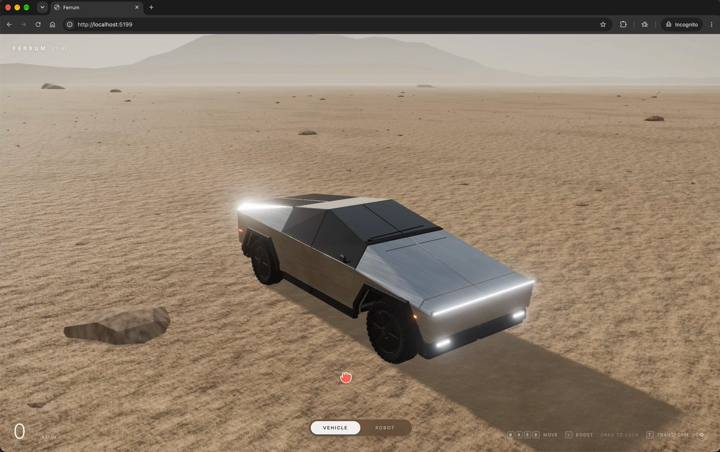</a></td>
<td width="50%" height="225" align="center" valign="middle"><a href="https://guanmo-ai.github.io/awesome-ai-motion/#case-2105783511433318451">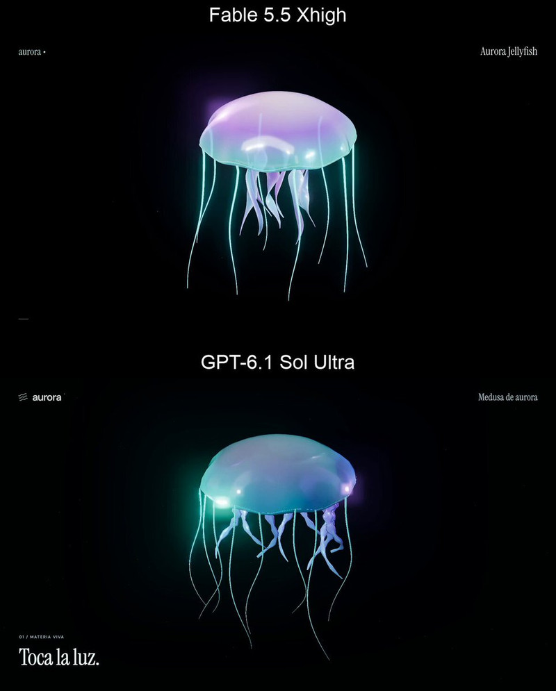</a></td>
</tr>
<tr>
<td width="50%" valign="top"><strong>变形电动皮卡三维动画</strong> <a href="https://x.com/scottstts">@scottstts</a> · 交互演示 1:13 · 收藏 72 · 资料待完善 <a href="https://guanmo-ai.github.io/awesome-ai-motion/#case-2102539904274325540">▶ 播放</a> · <a href="https://x.com/scottstts/status/2102539904274325540">原帖</a></td>
<td width="50%" valign="top"><strong>发光水母：Claude 与 Sol 交互对照</strong> <a href="https://x.com/SPAC89">@SPAC89</a> · 交互演示 0:20 · 收藏 69 · 资料待完善 <a href="https://guanmo-ai.github.io/awesome-ai-motion/#case-2105783511433318451">▶ 播放</a> · <a href="https://x.com/SPAC89/status/2105783511433318451">原帖</a></td>
</tr>
</tbody>
<tbody>
<tr>
<td width="50%" height="225" align="center" valign="middle"></td>
<td width="50%" height="225" align="center" valign="middle"><a href="https://guanmo-ai.github.io/awesome-ai-motion/#case-2105774088492916757">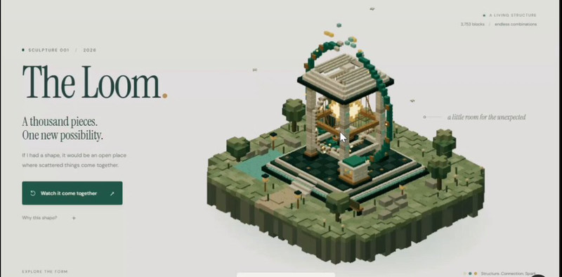</a></td>
</tr>
<tr>
<td width="50%" valign="top"><strong>曼哈顿上空的三维飞越</strong> <a href="https://x.com/Dimillian">@Dimillian</a> · 交互演示 0:10 · 收藏 58 · 资料待完善 <a href="https://guanmo-ai.github.io/awesome-ai-motion/#case-2096478021234426059">▶ 播放</a> · <a href="https://x.com/Dimillian/status/2096478021234426059">原帖</a></td>
<td width="50%" valign="top"><strong>The Loom：体素岛与产品网页试验</strong> <a href="https://x.com/Mr_Salio">@Mr_Salio</a> · 交互演示 0:45 · 收藏 52 · 资料待完善 <a href="https://guanmo-ai.github.io/awesome-ai-motion/#case-2105774088492916757">▶ 播放</a> · <a href="https://x.com/Mr_Salio/status/2105774088492916757">原帖</a></td>
</tr>
</tbody>
<tbody>
<tr>
<td width="50%" height="225" align="center" valign="middle"><a href="https://guanmo-ai.github.io/awesome-ai-motion/#case-2102536138884092185">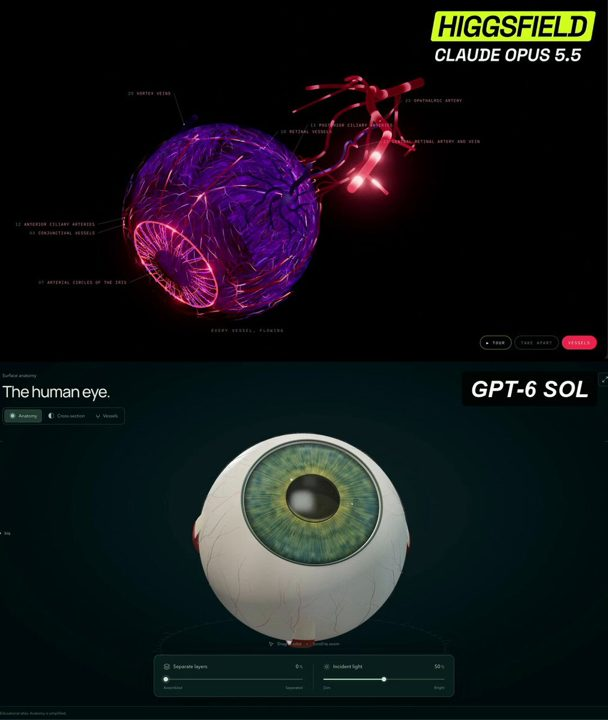</a></td>
<td width="50%" height="225" align="center" valign="middle"><a href="https://guanmo-ai.github.io/awesome-ai-motion/#case-2102817977812824335">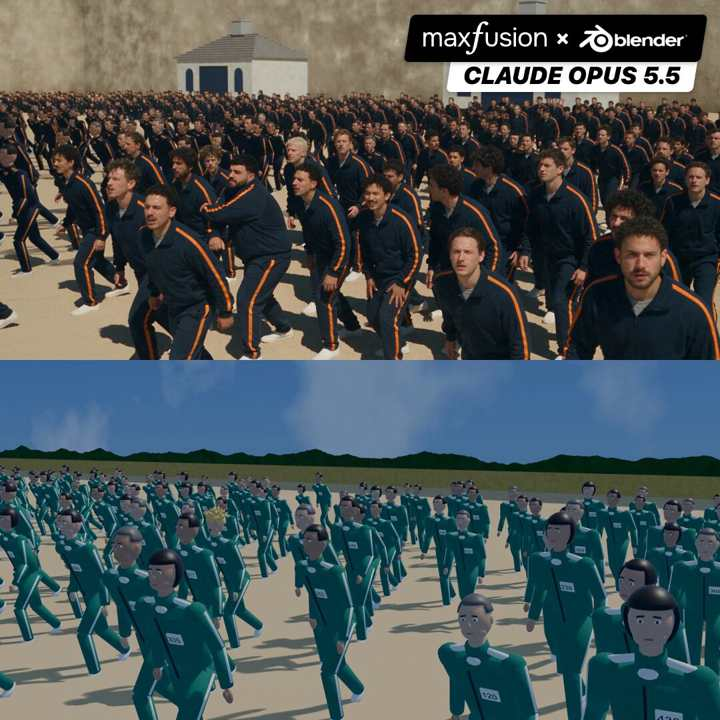</a></td>
</tr>
<tr>
<td width="50%" valign="top"><strong>可拆解的 3D 眼球演示</strong> <a href="https://x.com/higgsfield_ai">@higgsfield_ai</a> · 交互演示 0:20 · 收藏 40 · 资料待完善 <a href="https://guanmo-ai.github.io/awesome-ai-motion/#case-2102536138884092185">▶ 播放</a> · <a href="https://x.com/higgsfield_ai/status/2102536138884092185">原帖</a></td>
<td width="50%" valign="top"><strong>参考片引导的 Blender 场景构建</strong> <a href="https://x.com/OriSilver">@OriSilver</a> · 交互演示 0:28 · 收藏 34 · 资料待完善 <a href="https://guanmo-ai.github.io/awesome-ai-motion/#case-2102817977812824335">▶ 播放</a> · <a href="https://x.com/OriSilver/status/2102817977812824335">原帖</a></td>
</tr>
</tbody>
<tbody>
<tr>
<td width="50%" height="225" align="center" valign="middle"><a href="https://guanmo-ai.github.io/awesome-ai-motion/#case-2102528278732894667">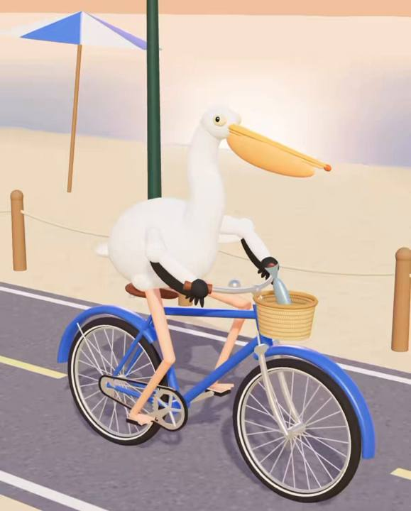</a></td>
<td width="50%" height="225" align="center" valign="middle"><a href="https://guanmo-ai.github.io/awesome-ai-motion/#case-2105559382150742523">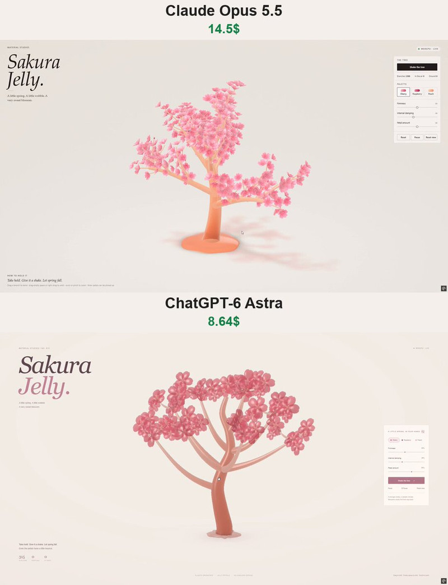</a></td>
</tr>
<tr>
<td width="50%" valign="top"><strong>海边骑行三维场景</strong> <a href="https://x.com/liu8in">@liu8in</a> · 交互演示 0:27 · 收藏 19 · 资料待完善 <a href="https://guanmo-ai.github.io/awesome-ai-motion/#case-2102528278732894667">▶ 播放</a> · <a href="https://x.com/liu8in/status/2102528278732894667">原帖</a></td>
<td width="50%" valign="top"><strong>果冻樱花：Opus 与 Astra 对照</strong> <a href="https://x.com/Artless101">@Artless101</a> · 交互演示 0:19 · 收藏 13 · 资料待完善 <a href="https://guanmo-ai.github.io/awesome-ai-motion/#case-2105559382150742523">▶ 播放</a> · <a href="https://x.com/Artless101/status/2105559382150742523">原帖</a></td>
</tr>
</tbody>
<tbody>
<tr>
<td width="50%" height="225" align="center" valign="middle"><a href="https://guanmo-ai.github.io/awesome-ai-motion/#case-2105350783416021472">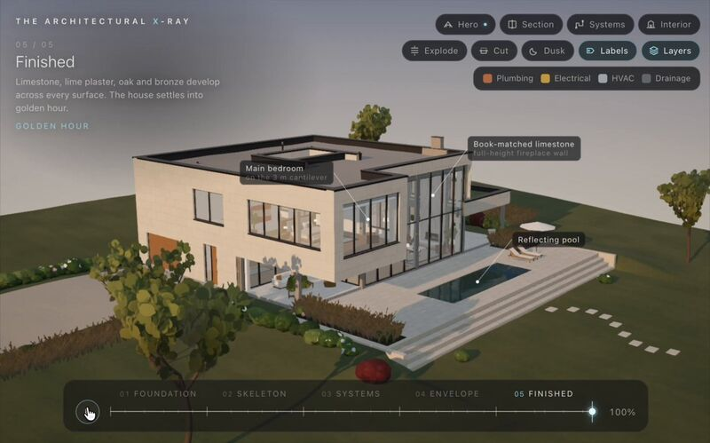</a></td>
<td width="50%" height="225" align="center" valign="middle"></td>
</tr>
<tr>
<td width="50%" valign="top"><strong>从地基到竣工的交互住宅</strong> <a href="https://x.com/techartist_">@techartist_</a> · 交互演示 0:37 · 收藏 13 · 资料待完善 <a href="https://guanmo-ai.github.io/awesome-ai-motion/#case-2105350783416021472">▶ 播放</a> · <a href="https://x.com/techartist_/status/2105350783416021472">原帖</a></td>
<td width="50%" valign="top"><strong>Three.js 设备与图层设计工具</strong> <a href="https://x.com/MengTo">@MengTo</a> · 交互演示 1:14 · 收藏 11 · 资料待完善 <a href="https://guanmo-ai.github.io/awesome-ai-motion/#case-2105680287854440715">▶ 播放</a> · <a href="https://x.com/MengTo/status/2105680287854440715">原帖</a></td>
</tr>
</tbody>
<tbody>
<tr>
<td width="50%" height="225" align="center" valign="middle"><a href="https://guanmo-ai.github.io/awesome-ai-motion/#case-2104222017696469188">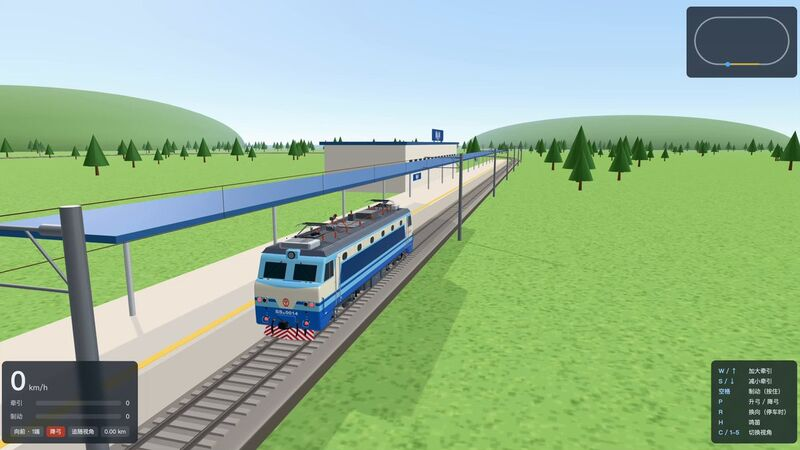</a></td>
<td width="50%" height="225" align="center" valign="middle"><a href="https://guanmo-ai.github.io/awesome-ai-motion/#case-2102755328161116223">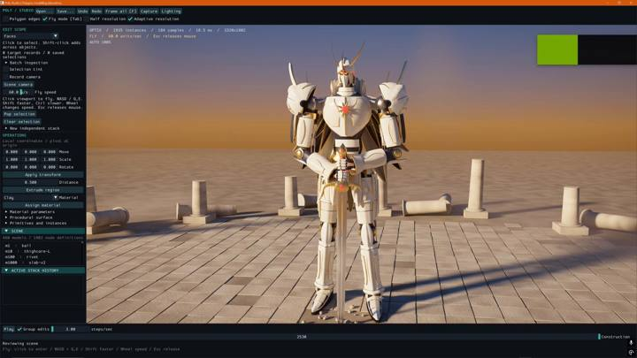</a></td>
</tr>
<tr>
<td width="50%" valign="top"><strong>韶山8机车与可驾驶环形铁路</strong> <a href="https://x.com/akokoi1">@akokoi1</a> · 交互演示 0:31 · 收藏 10 · 资料待完善 <a href="https://guanmo-ai.github.io/awesome-ai-motion/#case-2104222017696469188">▶ 播放</a> · <a href="https://x.com/akokoi1/status/2104222017696469188">原帖</a></td>
<td width="50%" valign="top"><strong>实时渲染机甲镜头</strong> <a href="https://x.com/wizardbrainz">@wizardbrainz</a> · 交互演示 0:24 · 收藏 10 · 资料待完善 <a href="https://guanmo-ai.github.io/awesome-ai-motion/#case-2102755328161116223">▶ 播放</a> · <a href="https://x.com/wizardbrainz/status/2102755328161116223">原帖</a></td>
</tr>
</tbody>
<tbody>
<tr>
<td width="50%" height="225" align="center" valign="middle"><a href="https://guanmo-ai.github.io/awesome-ai-motion/#case-2104719287613341732">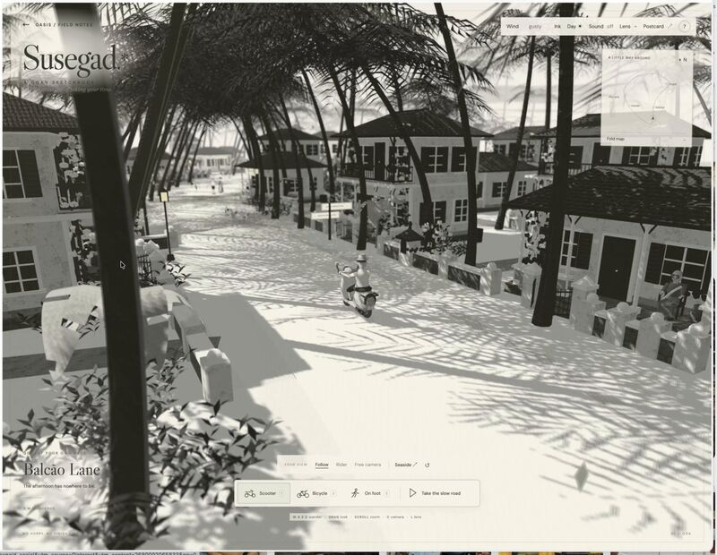</a></td>
<td width="50%" height="225" align="center" valign="middle"><a href="https://guanmo-ai.github.io/awesome-ai-motion/#case-2105020794602676465">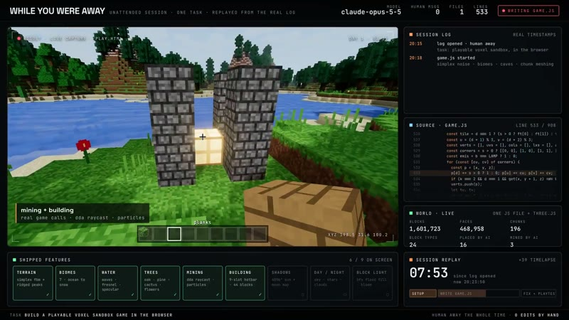</a></td>
</tr>
<tr>
<td width="50%" valign="top"><strong>果阿街区灵感的写生风三维漫游</strong> <a href="https://x.com/chetanankola">@chetanankola</a> · 交互演示 1:06 · 收藏 8 · 资料待完善 <a href="https://guanmo-ai.github.io/awesome-ai-motion/#case-2104719287613341732">▶ 播放</a> · <a href="https://x.com/chetanankola/status/2104719287613341732">原帖</a></td>
<td width="50%" valign="top"><strong>BLOCKWORLD：浏览器体素世界</strong> <a href="https://x.com/L1vsun">@L1vsun</a> · 交互演示 0:32 · 收藏 7 · 资料待完善 <a href="https://guanmo-ai.github.io/awesome-ai-motion/#case-2105020794602676465">▶ 播放</a> · <a href="https://x.com/L1vsun/status/2105020794602676465">原帖</a></td>
</tr>
</tbody>
<tbody>
<tr>
<td width="50%" height="225" align="center" valign="middle"><a href="https://guanmo-ai.github.io/awesome-ai-motion/#case-2104115092124012980">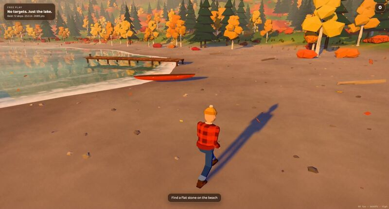</a></td>
<td width="50%" height="225" align="center" valign="middle"><a href="https://guanmo-ai.github.io/awesome-ai-motion/#case-2105559563764220114">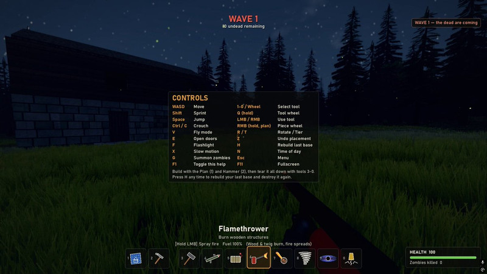</a></td>
</tr>
<tr>
<td width="50%" valign="top"><strong>水面打石子 Three.js 游戏</strong> <a href="https://x.com/llama3dstudio">@llama3dstudio</a> · 交互演示 0:44 · 收藏 6 · 资料待完善 <a href="https://guanmo-ai.github.io/awesome-ai-motion/#case-2104115092124012980">▶ 播放</a> · <a href="https://x.com/llama3dstudio/status/2104115092124012980">原帖</a></td>
<td width="50%" valign="top"><strong>浏览器僵尸游戏的新版本</strong> <a href="https://x.com/SimonasLTU1">@SimonasLTU1</a> · 交互演示 2:34 · 收藏 4 · 资料待完善 <a href="https://guanmo-ai.github.io/awesome-ai-motion/#case-2105559563764220114">▶ 播放</a> · <a href="https://x.com/SimonasLTU1/status/2105559563764220114">原帖</a></td>
</tr>
</tbody>
<tbody>
<tr>
<td width="50%" height="225" align="center" valign="middle"><a href="https://guanmo-ai.github.io/awesome-ai-motion/#case-2102744321355067761">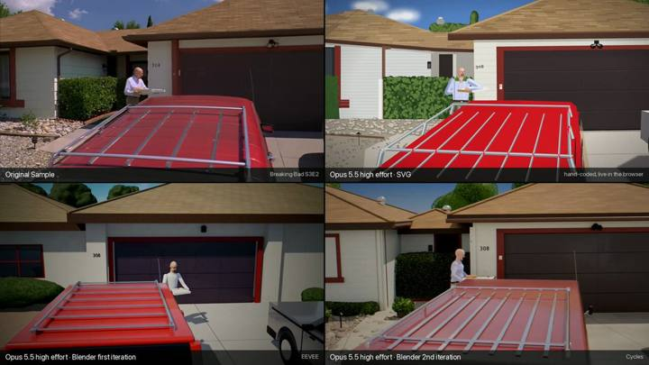</a></td>
<td width="50%" height="225" align="center" valign="middle"><a href="https://guanmo-ai.github.io/awesome-ai-motion/#case-2104181266459644283">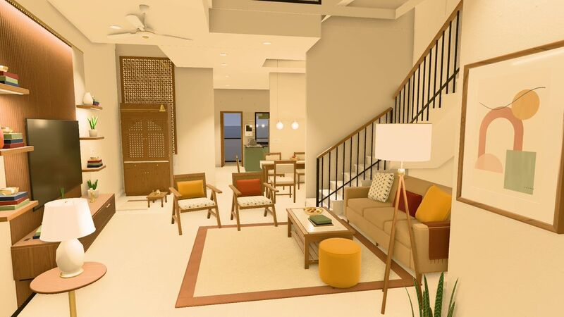</a></td>
</tr>
<tr>
<td width="50%" valign="top"><strong>单张参考图复刻电视剧镜头</strong> <a href="https://x.com/varga_bee">@varga_bee</a> · 交互演示 0:05 · 收藏 2 · 资料待完善 <a href="https://guanmo-ai.github.io/awesome-ai-motion/#case-2102744321355067761">▶ 播放</a> · <a href="https://x.com/varga_bee/status/2102744321355067761">原帖</a></td>
<td width="50%" valign="top"><strong>从住宅平面图到可行走的三维空间</strong> <a href="https://x.com/aayush4soni">@aayush4soni</a> · 交互演示 0:38 · 收藏 2 · 资料待完善 <a href="https://guanmo-ai.github.io/awesome-ai-motion/#case-2104181266459644283">▶ 播放</a> · <a href="https://x.com/aayush4soni/status/2104181266459644283">原帖</a></td>
</tr>
</tbody>
<tbody>
<tr>
<td width="50%" height="225" align="center" valign="middle"></td>
<td width="50%" height="225" align="center" valign="middle"><a href="https://guanmo-ai.github.io/awesome-ai-motion/#case-2105675232954474831">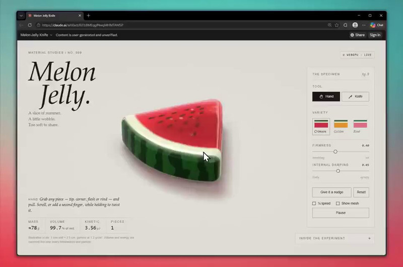</a></td>
</tr>
<tr>
<td width="50%" valign="top"><strong>Workspace：给编程会话一间三维办公室</strong> <a href="https://x.com/kum1ta">@kum1ta</a> · 交互演示 0:30 · 收藏 1 · 资料待完善 <a href="https://guanmo-ai.github.io/awesome-ai-motion/#case-2103998389058740521">▶ 播放</a> · <a href="https://x.com/kum1ta/status/2103998389058740521">原帖</a></td>
<td width="50%" valign="top"><strong>西瓜果冻：拖拽与切割实验</strong> <a href="https://x.com/Abmankendrick">@Abmankendrick</a> · 交互演示 0:27 · 收藏 1 · 资料待完善 <a href="https://guanmo-ai.github.io/awesome-ai-motion/#case-2105675232954474831">▶ 播放</a> · <a href="https://x.com/Abmankendrick/status/2105675232954474831">原帖</a></td>
</tr>
</tbody>
<tbody>
<tr>
<td width="50%" height="225" align="center" valign="middle"><a href="https://guanmo-ai.github.io/awesome-ai-motion/#case-2105220761086828778">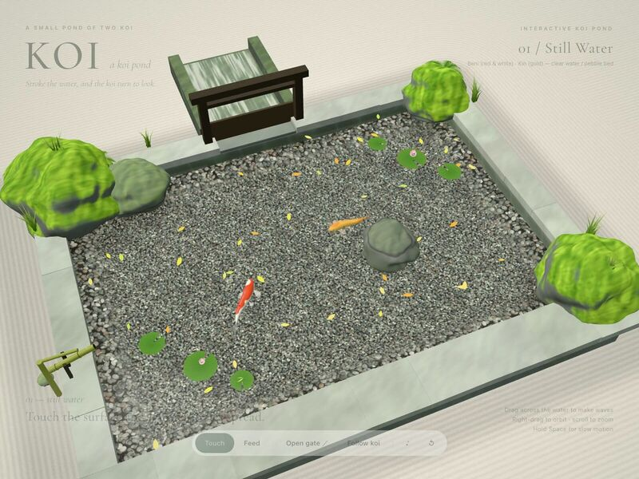</a></td>
<td width="50%" height="225" align="center" valign="middle"><a href="https://guanmo-ai.github.io/awesome-ai-motion/#case-2102722754172850310">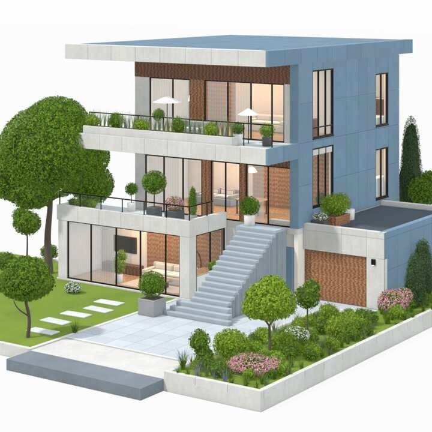</a></td>
</tr>
<tr>
<td width="50%" valign="top"><strong>锦鲤池：涟漪与落叶交互</strong> <a href="https://x.com/anvithbuilds">@anvithbuilds</a> · 交互演示 0:09 · 收藏 1 · 资料待完善 <a href="https://guanmo-ai.github.io/awesome-ai-motion/#case-2105220761086828778">▶ 播放</a> · <a href="https://x.com/anvithbuilds/status/2105220761086828778">原帖</a></td>
<td width="50%" valign="top"><strong>房屋模型的爆炸与重组</strong> <a href="https://x.com/zdkiel_labs">@zdkiel_labs</a> · 交互演示 0:15 · 收藏 1 · 资料待完善 <a href="https://guanmo-ai.github.io/awesome-ai-motion/#case-2102722754172850310">▶ 播放</a> · <a href="https://x.com/zdkiel_labs/status/2102722754172850310">原帖</a></td>
</tr>
</tbody>
<tbody>
<tr>
<td width="50%" height="225" align="center" valign="middle"><a href="https://guanmo-ai.github.io/awesome-ai-motion/#case-2104246455938797888">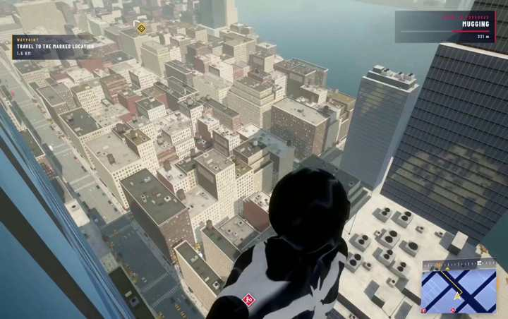</a></td>
<td width="50%" height="225" align="center" valign="middle"><a href="https://guanmo-ai.github.io/awesome-ai-motion/#case-2104820347875045751">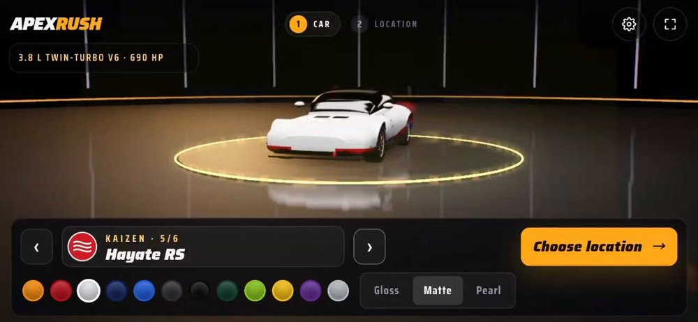</a></td>
</tr>
<tr>
<td width="50%" valign="top"><strong>共生战衣 3D 游戏演示</strong> <a href="https://x.com/stfu0911">@stfu0911</a> · 交互演示 2:10 · 收藏 1 · 资料待完善 <a href="https://guanmo-ai.github.io/awesome-ai-motion/#case-2104246455938797888">▶ 播放</a> · <a href="https://x.com/stfu0911/status/2104246455938797888">原帖</a></td>
<td width="50%" valign="top"><strong>The Apex Rush：单文件 3D 网页游戏</strong> <a href="https://x.com/sidgiri2104">@sidgiri2104</a> · 交互演示 1:07 · 收藏 1 · 资料待完善 <a href="https://guanmo-ai.github.io/awesome-ai-motion/#case-2104820347875045751">▶ 播放</a> · <a href="https://x.com/sidgiri2104/status/2104820347875045751">原帖</a></td>
</tr>
</tbody>
<tbody>
<tr>
<td width="50%" height="225" align="center" valign="middle"><a href="https://guanmo-ai.github.io/awesome-ai-motion/#case-2105679580191416322">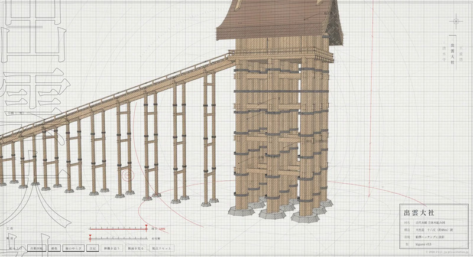</a></td>
<td width="50%" height="225" align="center" valign="middle"><a href="https://guanmo-ai.github.io/awesome-ai-motion/#case-2102798578427265368">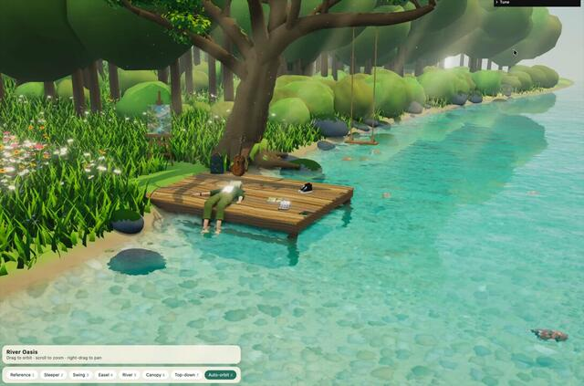</a></td>
</tr>
<tr>
<td width="50%" valign="top"><strong>古代出云大社的建造演示</strong> <a href="https://x.com/yoshifujidesign">@yoshifujidesign</a> · 交互演示 1:04 · 收藏 1 · 资料待完善 <a href="https://guanmo-ai.github.io/awesome-ai-motion/#case-2105679580191416322">▶ 播放</a> · <a href="https://x.com/yoshifujidesign/status/2105679580191416322">原帖</a></td>
<td width="50%" valign="top"><strong>一张图片扩展为 Three.js 场景</strong> <a href="https://x.com/NicksonTan">@NicksonTan</a> · 交互演示 1:12 · 收藏 1 · 资料待完善 <a href="https://guanmo-ai.github.io/awesome-ai-motion/#case-2102798578427265368">▶ 播放</a> · <a href="https://x.com/NicksonTan/status/2102798578427265368">原帖</a></td>
</tr>
</tbody>
<tbody>
<tr>
<td width="50%" height="225" align="center" valign="middle"><a href="https://guanmo-ai.github.io/awesome-ai-motion/#case-2105075653183778925">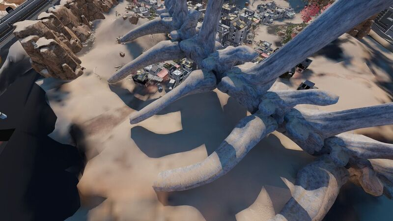</a></td>
<td width="50%" height="225" align="center" valign="middle"><a href="https://guanmo-ai.github.io/awesome-ai-motion/#case-2105361031371383180">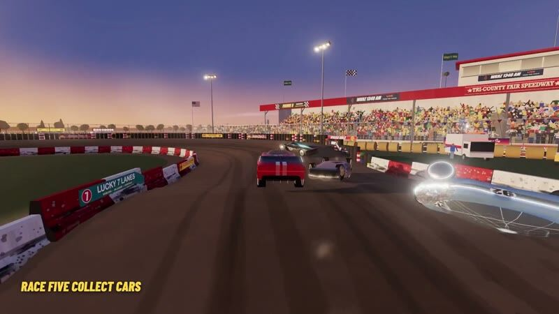</a></td>
</tr>
<tr>
<td width="50%" valign="top"><strong>Skull Town 浏览器地图预告</strong> <a href="https://x.com/nikooo777">@nikooo777</a> · 交互演示 0:20 · 收藏 0 · 资料待完善 <a href="https://guanmo-ai.github.io/awesome-ai-motion/#case-2105075653183778925">▶ 播放</a> · <a href="https://x.com/nikooo777/status/2105075653183778925">原帖</a></td>
<td width="50%" valign="top"><strong>浏览器撞车赛：Demolition Derby</strong> <a href="https://x.com/drcollect">@drcollect</a> · 交互演示 0:16 · 收藏 0 · 资料待完善 <a href="https://guanmo-ai.github.io/awesome-ai-motion/#case-2105361031371383180">▶ 播放</a> · <a href="https://x.com/drcollect/status/2105361031371383180">原帖</a></td>
</tr>
</tbody>
<tbody>
<tr>
<td width="50%" height="225" align="center" valign="middle"><a href="https://guanmo-ai.github.io/awesome-ai-motion/#case-2105082553996820579">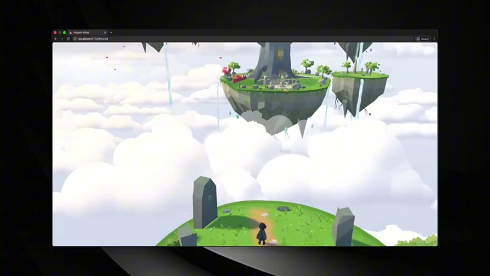</a></td>
<td width="50%" height="225" align="center" valign="middle"></td>
</tr>
<tr>
<td width="50%" valign="top"><strong>Three.js 三维个人网站概念</strong> <a href="https://x.com/hymmakbar">@hymmakbar</a> · 交互演示 1:07 · 收藏 0 · 资料待完善 <a href="https://guanmo-ai.github.io/awesome-ai-motion/#case-2105082553996820579">▶ 播放</a> · <a href="https://x.com/hymmakbar/status/2105082553996820579">原帖</a></td>
<td width="50%" valign="top"><strong>PEABRAIN：图像到 Godot 三杯游戏</strong> <a href="https://x.com/suth_a">@suth_a</a> · 交互演示 0:24 · 收藏 0 · 资料待完善 <a href="https://guanmo-ai.github.io/awesome-ai-motion/#case-2105587887500911001">▶ 播放</a> · <a href="https://x.com/suth_a/status/2105587887500911001">原帖</a></td>
</tr>
</tbody>
<tbody>
<tr>
<td width="50%" height="225" align="center" valign="middle"><a href="https://guanmo-ai.github.io/awesome-ai-motion/#case-2105561265531957530">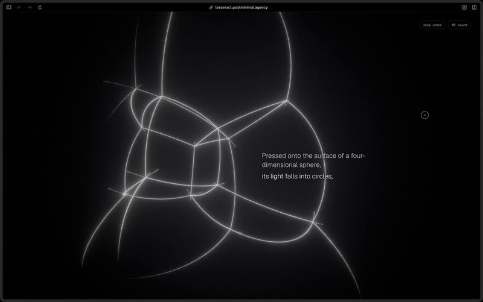</a></td>
<td width="50%" height="225" align="center" valign="middle"><a href="https://guanmo-ai.github.io/awesome-ai-motion/#case-2104214187522318512">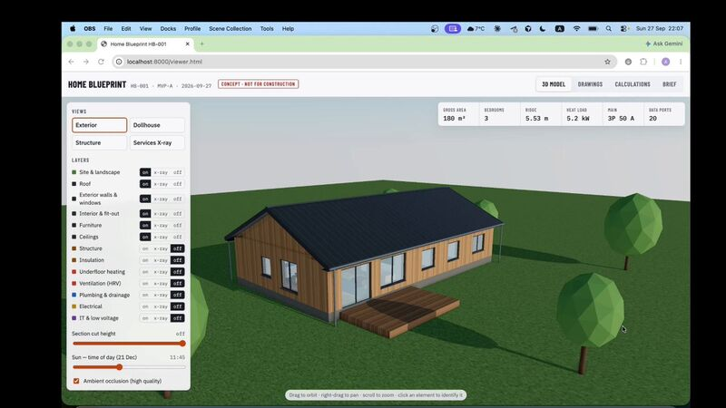</a></td>
</tr>
<tr>
<td width="50%" valign="top"><strong>可触摸与发声的四维超立方体</strong> <a href="https://x.com/_postminimal">@_postminimal</a> · 交互演示 0:55 · 收藏 0 · 资料待完善 <a href="https://guanmo-ai.github.io/awesome-ai-motion/#case-2105561265531957530">▶ 播放</a> · <a href="https://x.com/_postminimal/status/2105561265531957530">原帖</a></td>
<td width="50%" valign="top"><strong>以代码设计住宅：图纸与三维查看器</strong> <a href="https://x.com/AJtheMongol">@AJtheMongol</a> · 交互演示 0:51 · 收藏 0 · 资料待完善 <a href="https://guanmo-ai.github.io/awesome-ai-motion/#case-2104214187522318512">▶ 播放</a> · <a href="https://x.com/AJtheMongol/status/2104214187522318512">原帖</a></td>
</tr>
</tbody>
<tbody>
<tr>
<td width="50%" height="225" align="center" valign="middle"></td>
<td width="50%" height="225" align="center" valign="middle"><a href="https://guanmo-ai.github.io/awesome-ai-motion/#case-2104740780208164947">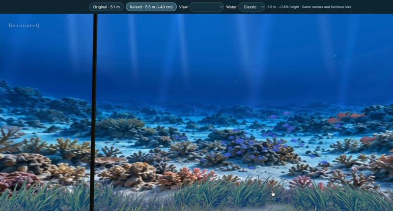</a></td>
</tr>
<tr>
<td width="50%" valign="top"><strong>悉尼海港大桥：从黎明到黄昏</strong> <a href="https://x.com/CeciliaW888">@CeciliaW888</a> · 交互演示 0:23 · 收藏 0 · 资料待完善 <a href="https://guanmo-ai.github.io/awesome-ai-motion/#case-2104504480968683521">▶ 播放</a> · <a href="https://x.com/CeciliaW888/status/2104504480968683521">原帖</a></td>
<td width="50%" valign="top"><strong>水下房间：海豚与竖琴交互</strong> <a href="https://x.com/VeronicaVZMusic">@VeronicaVZMusic</a> · 交互演示 0:42 · 收藏 0 · 资料待完善 <a href="https://guanmo-ai.github.io/awesome-ai-motion/#case-2104740780208164947">▶ 播放</a> · <a href="https://x.com/VeronicaVZMusic/status/2104740780208164947">原帖</a></td>
</tr>
</tbody>
<tbody>
<tr>
<td width="50%" height="225" align="center" valign="middle"><a href="https://guanmo-ai.github.io/awesome-ai-motion/#case-2105346791021629821">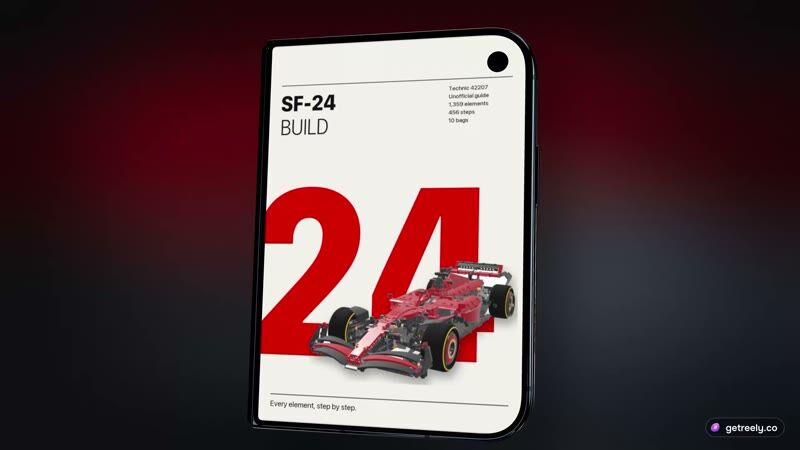</a></td>
<td width="50%" height="225" align="center" valign="middle"></td>
</tr>
<tr>
<td width="50%" valign="top"><strong>LEGO 法拉利 F1 交互拼装</strong> <a href="https://x.com/eigeorguy">@eigeorguy</a> · 交互演示 0:39 · 收藏 0 · 资料待完善 <a href="https://guanmo-ai.github.io/awesome-ai-motion/#case-2105346791021629821">▶ 播放</a> · <a href="https://x.com/eigeorguy/status/2105346791021629821">原帖</a></td>
<td width="50%" valign="top"><strong>Casper：网页三维幽灵吉祥物</strong> <a href="https://x.com/bazfurby">@bazfurby</a> · 交互演示 0:22 · 收藏 0 · 资料待完善 <a href="https://guanmo-ai.github.io/awesome-ai-motion/#case-2105595903943774360">▶ 播放</a> · <a href="https://x.com/bazfurby/status/2105595903943774360">原帖</a></td>
</tr>
</tbody>
<tbody>
<tr>
<td width="50%" height="225" align="center" valign="middle"><a href="https://guanmo-ai.github.io/awesome-ai-motion/#case-2102543530002456775">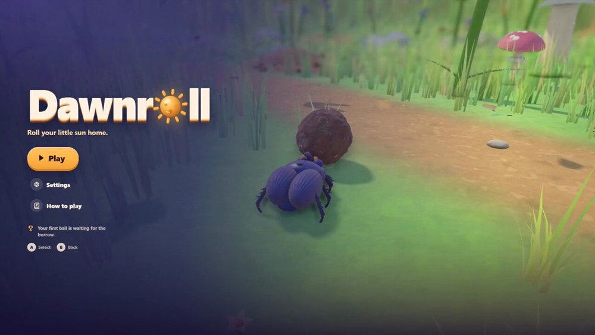</a></td>
<td width="50%" height="225" align="center" valign="middle"><a href="https://guanmo-ai.github.io/awesome-ai-motion/#case-2104046743751139812">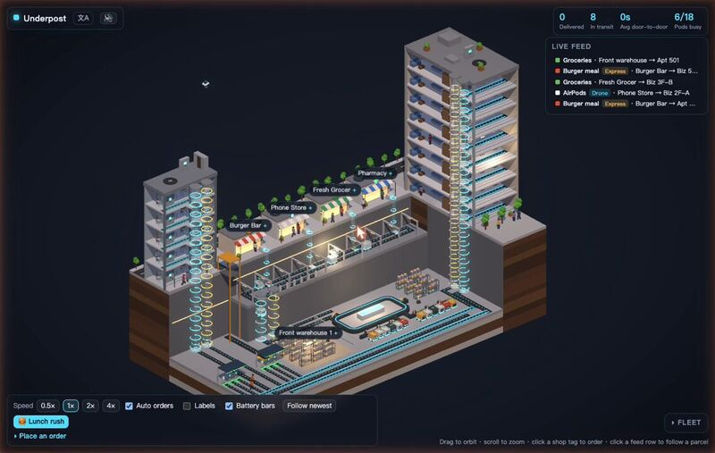</a></td>
</tr>
<tr>
<td width="50%" valign="top"><strong>Dawnroll：甲虫滚动小太阳的微缩花园</strong> <a href="https://x.com/Nickxyzn">@Nickxyzn</a> · 交互演示 0:30 · 收藏 0 · 资料待完善 <a href="https://guanmo-ai.github.io/awesome-ai-motion/#case-2102543530002456775">▶ 播放</a> · <a href="https://x.com/Nickxyzn/status/2102543530002456775">原帖</a></td>
<td width="50%" valign="top"><strong>地下配送网络：午餐高峰小游戏</strong> <a href="https://x.com/lisp_mi">@lisp_mi</a> · 交互演示 0:11 · 收藏 0 · 资料待完善 <a href="https://guanmo-ai.github.io/awesome-ai-motion/#case-2104046743751139812">▶ 播放</a> · <a href="https://x.com/lisp_mi/status/2104046743751139812">原帖</a></td>
</tr>
</tbody>
<tbody>
<tr>
<td width="50%" height="225" align="center" valign="middle"><a href="https://guanmo-ai.github.io/awesome-ai-motion/#case-2104102479927620029">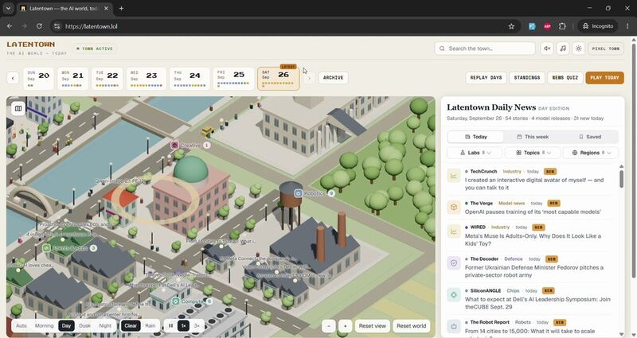</a></td>
<td width="50%" height="225" align="center" valign="middle"><a href="https://guanmo-ai.github.io/awesome-ai-motion/#case-2105685544906952811">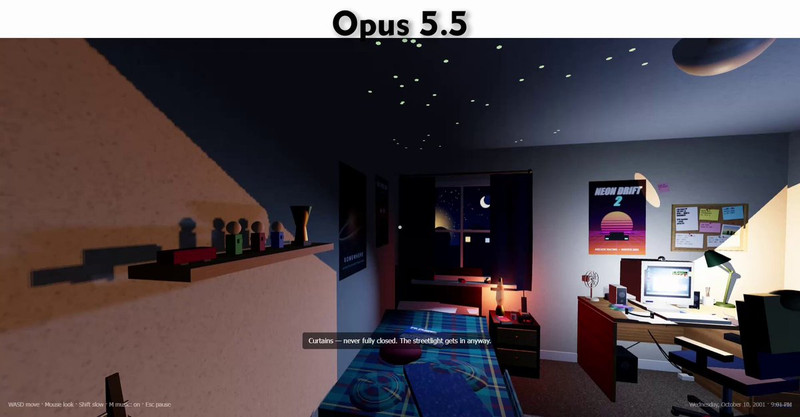</a></td>
</tr>
<tr>
<td width="50%" valign="top"><strong>Latentown：把 AI 新闻变成三维城市</strong> <a href="https://x.com/sanjay_khadka07">@sanjay_khadka07</a> · 交互演示 0:42 · 收藏 0 · 资料待完善 <a href="https://guanmo-ai.github.io/awesome-ai-motion/#case-2104102479927620029">▶ 播放</a> · <a href="https://x.com/sanjay_khadka07/status/2104102479927620029">原帖</a></td>
<td width="50%" valign="top"><strong>可漫步的卧室与熔岩灯</strong> <a href="https://x.com/TimJayas">@TimJayas</a> · 交互演示 0:40 · 收藏 0 · 资料待完善 <a href="https://guanmo-ai.github.io/awesome-ai-motion/#case-2105685544906952811">▶ 播放</a> · <a href="https://x.com/TimJayas/status/2105685544906952811">原帖</a></td>
</tr>
</tbody>
<tbody>
<tr>
<td width="50%" height="225" align="center" valign="middle"><a href="https://guanmo-ai.github.io/awesome-ai-motion/#case-2104211672370201053">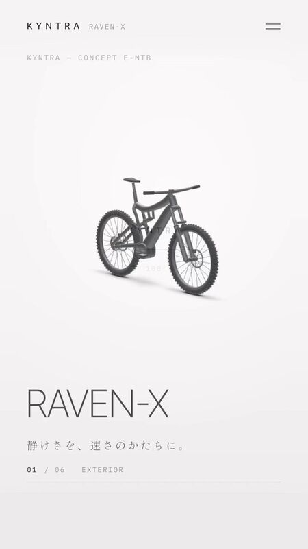</a></td>
<td width="50%" height="225" align="center" valign="middle"><a href="https://guanmo-ai.github.io/awesome-ai-motion/#case-2104236916316971191">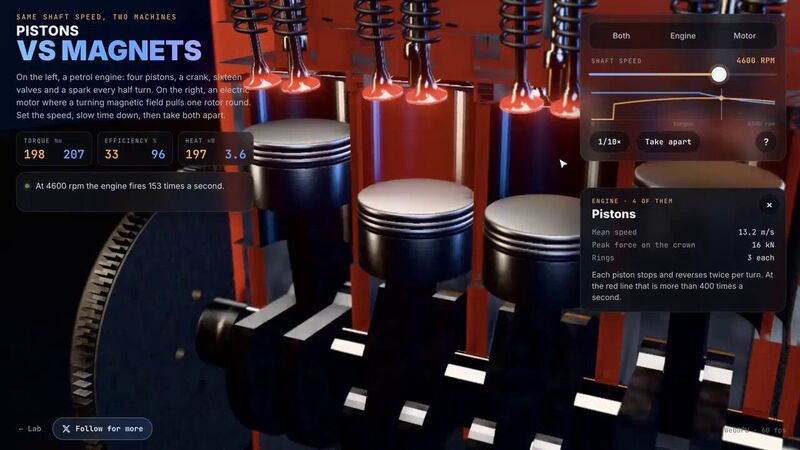</a></td>
</tr>
<tr>
<td width="50%" valign="top"><strong>自行车三维产品演示</strong> <a href="https://x.com/EWashoku">@EWashoku</a> · 交互演示 0:49 · 收藏 0 · 资料待完善 <a href="https://guanmo-ai.github.io/awesome-ai-motion/#case-2104211672370201053">▶ 播放</a> · <a href="https://x.com/EWashoku/status/2104211672370201053">原帖</a></td>
<td width="50%" valign="top"><strong>可拆解引擎：活塞与磁体对照</strong> <a href="https://x.com/StefanoStraus">@StefanoStraus</a> · 交互演示 0:32 · 收藏 0 · 资料待完善 <a href="https://guanmo-ai.github.io/awesome-ai-motion/#case-2104236916316971191">▶ 播放</a> · <a href="https://x.com/StefanoStraus/status/2104236916316971191">原帖</a></td>
</tr>
</tbody>
<tbody>
<tr>
<td width="50%" height="225" align="center" valign="middle"><a href="https://guanmo-ai.github.io/awesome-ai-motion/#case-2104242902218285246">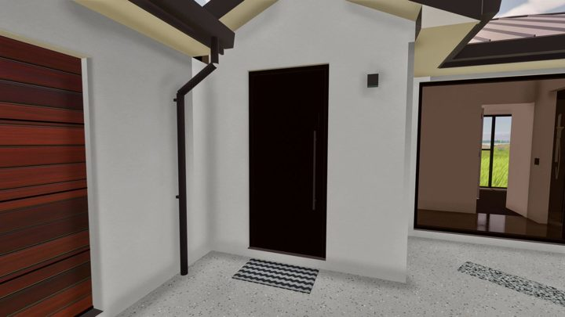</a></td>
<td width="50%" height="225" align="center" valign="middle"></td>
</tr>
<tr>
<td width="50%" valign="top"><strong>房屋 3D 漫游视频</strong> <a href="https://x.com/truenyl">@truenyl</a> · 交互演示 1:00 · 收藏 0 · 资料待完善 <a href="https://guanmo-ai.github.io/awesome-ai-motion/#case-2104242902218285246">▶ 播放</a> · <a href="https://x.com/truenyl/status/2104242902218285246">原帖</a></td>
<td width="50%" valign="top"><strong>旧 Blender 项目代码重建</strong> <a href="https://x.com/hasiyevv">@hasiyevv</a> · 交互演示 0:34 · 收藏 0 · 资料待完善 <a href="https://guanmo-ai.github.io/awesome-ai-motion/#case-2104254095196602550">▶ 播放</a> · <a href="https://x.com/hasiyevv/status/2104254095196602550">原帖</a></td>
</tr>
</tbody>
<tbody>
<tr>
<td width="50%" height="225" align="center" valign="middle"><a href="https://guanmo-ai.github.io/awesome-ai-motion/#case-2104774377736974736">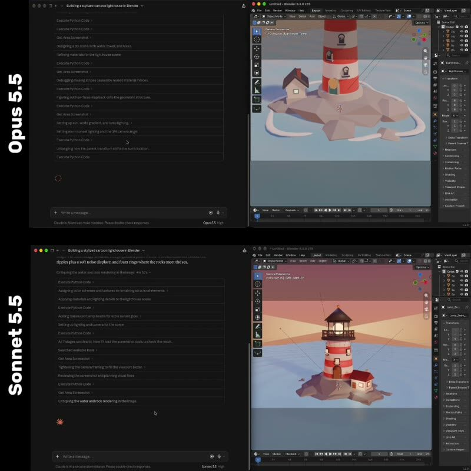</a></td>
<td width="50%" height="225" align="center" valign="middle"><a href="https://guanmo-ai.github.io/awesome-ai-motion/#case-2105360949888840080">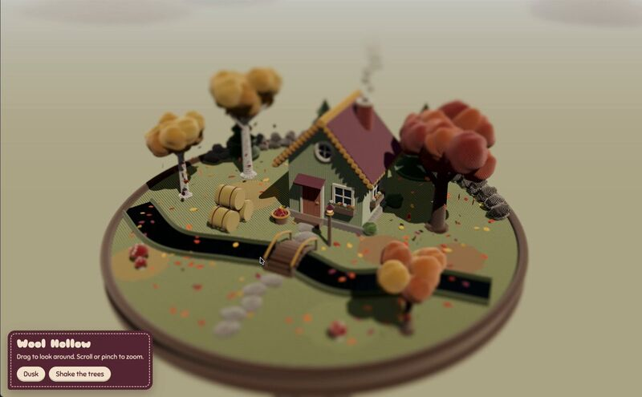</a></td>
</tr>
<tr>
<td width="50%" valign="top"><strong>Blender 灯塔：Opus 与 Sonnet 建模对照</strong> <a href="https://x.com/Thusatharan">@Thusatharan</a> · 交互演示 2:33 · 收藏 0 · 资料待完善 <a href="https://guanmo-ai.github.io/awesome-ai-motion/#case-2104774377736974736">▶ 播放</a> · <a href="https://x.com/Thusatharan/status/2104774377736974736">原帖</a></td>
<td width="50%" valign="top"><strong>JavaScript 羊毛风 3D 世界</strong> <a href="https://x.com/thebuggeddev">@thebuggeddev</a> · 交互演示 0:33 · 收藏 0 · 资料待完善 <a href="https://guanmo-ai.github.io/awesome-ai-motion/#case-2105360949888840080">▶ 播放</a> · <a href="https://x.com/thebuggeddev/status/2105360949888840080">原帖</a></td>
</tr>
</tbody>
<tbody>
<tr>
<td width="50%" height="225" align="center" valign="middle"><a href="https://guanmo-ai.github.io/awesome-ai-motion/#case-2105583511017046319">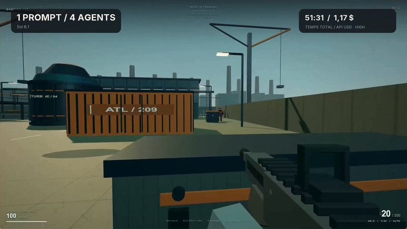</a></td>
<td width="50%" height="225" align="center" valign="middle"><a href="https://guanmo-ai.github.io/awesome-ai-motion/#case-2105659005817462972">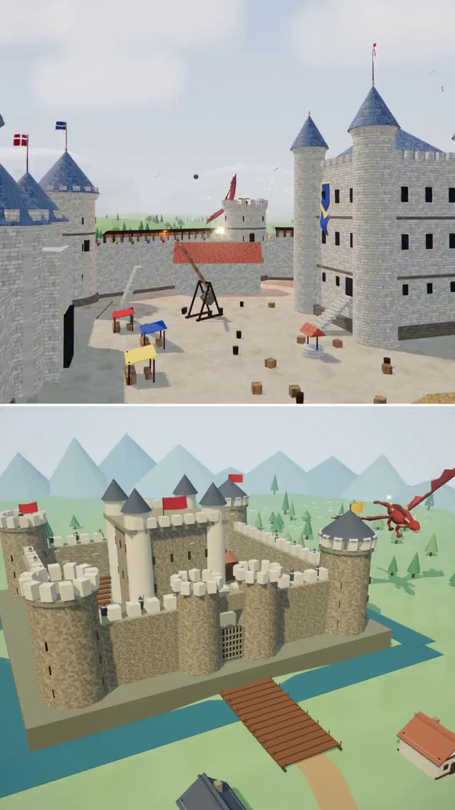</a></td>
</tr>
<tr>
<td width="50%" valign="top"><strong>四个 Agent 的浏览器 FPS 试验</strong> <a href="https://x.com/quentin_barden">@quentin_barden</a> · 交互演示 0:46 · 收藏 0 · 资料待完善 <a href="https://guanmo-ai.github.io/awesome-ai-motion/#case-2105583511017046319">▶ 播放</a> · <a href="https://x.com/quentin_barden/status/2105583511017046319">原帖</a></td>
<td width="50%" valign="top"><strong>巨龙攻城：同题 Three.js 对照</strong> <a href="https://x.com/ReconScribe">@ReconScribe</a> · 交互演示 0:39 · 收藏 0 · 资料待完善 <a href="https://guanmo-ai.github.io/awesome-ai-motion/#case-2105659005817462972">▶ 播放</a> · <a href="https://x.com/ReconScribe/status/2105659005817462972">原帖</a></td>
</tr>
</tbody>
</table>
