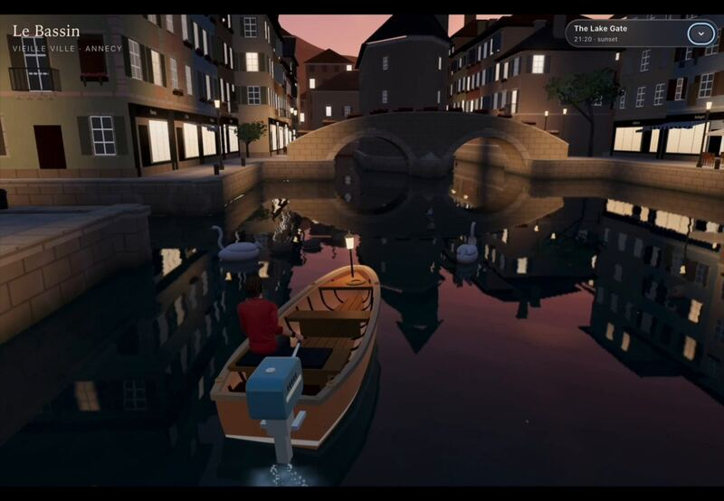
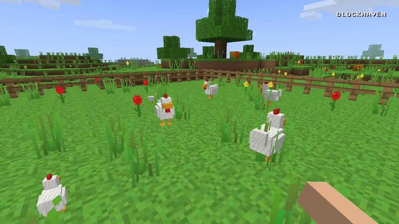
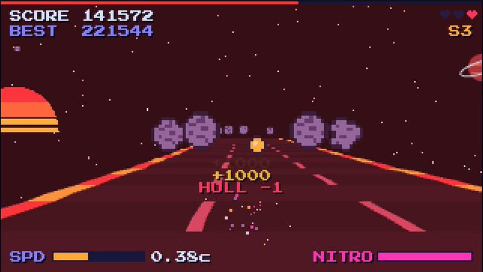
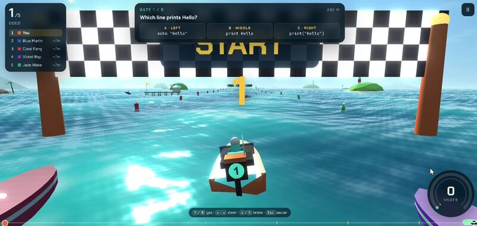

[← 全部分类](../README.md#browse)

# 交互演示

192 个作品。点击封面播放；没有画廊视频时会前往 X 原帖。

<table>
<tbody>
<tr>
<td width="50%" height="225" align="center" valign="middle"></td>
<td width="50%" height="225" align="center" valign="middle"></td>
</tr>
<tr>
<td width="50%" valign="top"><strong>桃花源记：循文入境的三维长卷</strong> <a href="https://x.com/dotey">@dotey</a> · 交互演示 4:17 · 收藏 460 · 资料待完善 <a href="https://guanmo-ai.github.io/awesome-ai-motion/#case-2102940980379017293">▶ 播放</a> · <a href="https://x.com/dotey/status/2102940980379017293">原帖</a></td>
<td width="50%" valign="top"><strong>史前岛屿的水上与水下</strong> <a href="https://x.com/vib3coded">@vib3coded</a> · 交互演示 0:20 · 收藏 77 <a href="https://guanmo-ai.github.io/awesome-ai-motion/#case-2102450239923720440">▶ 播放</a> · <a href="https://x.com/vib3coded/status/2102450239923720440">原帖</a></td>
</tr>
</tbody>
<tbody>
<tr>
<td width="50%" height="225" align="center" valign="middle"></td>
<td width="50%" height="225" align="center" valign="middle"></td>
</tr>
<tr>
<td width="50%" valign="top"><strong>海边栈桥上的骑车鹈鹕</strong> <a href="https://x.com/AxtonLiu">@AxtonLiu</a> · 交互演示 0:38 · 收藏 57 · 资料待完善 <a href="https://guanmo-ai.github.io/awesome-ai-motion/#case-2103119648271290566">▶ 播放</a> · <a href="https://x.com/AxtonLiu/status/2103119648271290566">原帖</a></td>
<td width="50%" valign="top"><strong>行走的建筑：可容纳人的移动空间</strong> <a href="https://x.com/shion_takk">@shion_takk</a> · 交互演示 0:30 · 收藏 3 · 资料待完善 <a href="https://guanmo-ai.github.io/awesome-ai-motion/#case-2104590334152056983">▶ 播放</a> · <a href="https://x.com/shion_takk/status/2104590334152056983">原帖</a></td>
</tr>
</tbody>
<tbody>
<tr>
<td width="50%" height="225" align="center" valign="middle"></td>
<td width="50%" height="225" align="center" valign="middle"></td>
</tr>
<tr>
<td width="50%" valign="top"><strong>毛绒角色：Sol 与 Opus 同参考对比</strong> <a href="https://x.com/JakubAntowski">@JakubAntowski</a> · 交互演示 0:20 · 收藏 0 · 资料待完善 <a href="https://guanmo-ai.github.io/awesome-ai-motion/#case-2105245039521628213">▶ 播放</a> · <a href="https://x.com/JakubAntowski/status/2105245039521628213">原帖</a></td>
<td width="50%" valign="top"><strong>轨道邮局：黄铜与行星的小世界</strong> <a href="https://x.com/allenrokxlate">@allenrokxlate</a> · 交互演示 0:24 · 收藏 0 · 资料待完善 <a href="https://x.com/allenrokxlate/status/2106040262245896675">▶ 在 X 观看</a> · <a href="https://x.com/allenrokxlate/status/2106040262245896675">原帖</a></td>
</tr>
</tbody>
<tbody>
<tr>
<td width="50%" height="225" align="center" valign="middle"></td>
<td width="50%" height="225" align="center" valign="middle"></td>
</tr>
<tr>
<td width="50%" valign="top"><strong>Wareflow：策略游戏式仓库管理界面</strong> <a href="https://x.com/DilumSanjaya">@DilumSanjaya</a> · 交互演示 1:12 · 收藏 10,714 · 资料待完善 <a href="https://guanmo-ai.github.io/awesome-ai-motion/#case-2106426962738880879">▶ 播放</a> · <a href="https://x.com/DilumSanjaya/status/2106426962738880879">原帖</a></td>
<td width="50%" valign="top"><strong>Spiderbench：浏览器里的城市荡行</strong> <a href="https://x.com/xikhar">@xikhar</a> · 交互演示 2:21 · 收藏 3,777 · 资料待完善 <a href="https://guanmo-ai.github.io/awesome-ai-motion/#case-2104001664793600012">▶ 播放</a> · <a href="https://x.com/xikhar/status/2104001664793600012">原帖</a></td>
</tr>
</tbody>
<tbody>
<tr>
<td width="50%" height="225" align="center" valign="middle"></td>
<td width="50%" height="225" align="center" valign="middle"></td>
</tr>
<tr>
<td width="50%" valign="top"><strong>会议演讲镜头的 Blender 复现</strong> <a href="https://x.com/petergostev">@petergostev</a> · 交互演示 0:20 · 收藏 3,710 · 资料待完善 <a href="https://guanmo-ai.github.io/awesome-ai-motion/#case-2096264296099459079">▶ 播放</a> · <a href="https://x.com/petergostev/status/2096264296099459079">原帖</a></td>
<td width="50%" valign="top"><strong>手绘蒸汽列车变三维模型</strong> <a href="https://x.com/tomkrcha">@tomkrcha</a> · 交互演示 0:34 · 收藏 3,540 · 资料待完善 <a href="https://guanmo-ai.github.io/awesome-ai-motion/#case-2095756085890310311">▶ 播放</a> · <a href="https://x.com/tomkrcha/status/2095756085890310311">原帖</a></td>
</tr>
</tbody>
<tbody>
<tr>
<td width="50%" height="225" align="center" valign="middle"></td>
<td width="50%" height="225" align="center" valign="middle"></td>
</tr>
<tr>
<td width="50%" valign="top"><strong>Clearwater：实时浅水与交互涟漪</strong> <a href="https://x.com/Aurelien_Gz">@Aurelien_Gz</a> · 交互演示 0:27 · 收藏 2,612 <a href="https://guanmo-ai.github.io/awesome-ai-motion/#case-2102786378282987591">▶ 播放</a> · <a href="https://x.com/Aurelien_Gz/status/2102786378282987591">原帖</a></td>
<td width="50%" valign="top"><strong>安提基特拉海底游戏演示</strong> <a href="https://x.com/edwinarbus">@edwinarbus</a> · 交互演示 1:00 · 收藏 1,701 · 资料待完善 <a href="https://guanmo-ai.github.io/awesome-ai-motion/#case-2102463453176979794">▶ 播放</a> · <a href="https://x.com/edwinarbus/status/2102463453176979794">原帖</a></td>
</tr>
</tbody>
<tbody>
<tr>
<td width="50%" height="225" align="center" valign="middle"></td>
<td width="50%" height="225" align="center" valign="middle"></td>
</tr>
<tr>
<td width="50%" valign="top"><strong>Cozy Creek：浏览器中的林间溪流</strong> <a href="https://x.com/chetanankola">@chetanankola</a> · 交互演示 0:59 · 收藏 1,559 · 资料待完善 <a href="https://guanmo-ai.github.io/awesome-ai-motion/#case-2107996576228753545">▶ 播放</a> · <a href="https://x.com/chetanankola/status/2107996576228753545">原帖</a></td>
<td width="50%" valign="top"><strong>将物流管理变成策略界面</strong> <a href="https://x.com/alexcooldev">@alexcooldev</a> · 交互演示 1:14 · 收藏 1,343 · 资料待完善 <a href="https://guanmo-ai.github.io/awesome-ai-motion/#case-2106835487365419479">▶ 播放</a> · <a href="https://x.com/alexcooldev/status/2106835487365419479">原帖</a></td>
</tr>
</tbody>
<tbody>
<tr>
<td width="50%" height="225" align="center" valign="middle"></td>
<td width="50%" height="225" align="center" valign="middle"></td>
</tr>
<tr>
<td width="50%" valign="top"><strong>代码绘制的山间溪流</strong> <a href="https://x.com/hayashimon1">@hayashimon1</a> · 交互演示 0:15 · 收藏 1,188 · 资料待完善 <a href="https://guanmo-ai.github.io/awesome-ai-motion/#case-2102576886182453454">▶ 播放</a> · <a href="https://x.com/hayashimon1/status/2102576886182453454">原帖</a></td>
<td width="50%" valign="top"><strong>I Just Wanted to Fish：钓鱼游戏演示</strong> <a href="https://x.com/ForkedPush">@ForkedPush</a> · 交互演示 2:42 · 收藏 1,096 · 资料待完善 <a href="https://guanmo-ai.github.io/awesome-ai-motion/#case-2106313584829431901">▶ 播放</a> · <a href="https://x.com/ForkedPush/status/2106313584829431901">原帖</a></td>
</tr>
</tbody>
<tbody>
<tr>
<td width="50%" height="225" align="center" valign="middle"></td>
<td width="50%" height="225" align="center" valign="middle"></td>
</tr>
<tr>
<td width="50%" valign="top"><strong>投石机草图变交互模拟</strong> <a href="https://x.com/poolio">@poolio</a> · 交互演示 1:20 · 收藏 1,073 · 资料待完善 <a href="https://guanmo-ai.github.io/awesome-ai-motion/#case-2102445641205248145">▶ 播放</a> · <a href="https://x.com/poolio/status/2102445641205248145">原帖</a></td>
<td width="50%" valign="top"><strong>MOBA 与格斗游戏机制混合试验</strong> <a href="https://x.com/GamefxAI">@GamefxAI</a> · 交互演示 1:43 · 收藏 1,009 · 资料待完善 <a href="https://guanmo-ai.github.io/awesome-ai-motion/#case-2106387548486738010">▶ 播放</a> · <a href="https://x.com/GamefxAI/status/2106387548486738010">原帖</a></td>
</tr>
</tbody>
<tbody>
<tr>
<td width="50%" height="225" align="center" valign="middle"></td>
<td width="50%" height="225" align="center" valign="middle"></td>
</tr>
<tr>
<td width="50%" valign="top"><strong>代码生成的 HD-2D 像素游戏</strong> <a href="https://x.com/hakimieiqbal">@hakimieiqbal</a> · 交互演示 1:20 · 收藏 879 · 资料待完善 <a href="https://guanmo-ai.github.io/awesome-ai-motion/#case-2107804983416467598">▶ 播放</a> · <a href="https://x.com/hakimieiqbal/status/2107804983416467598">原帖</a></td>
<td width="50%" valign="top"><strong>两模型的程序化 Blender 镜头</strong> <a href="https://x.com/Stefan_3D_AI">@Stefan_3D_AI</a> · 交互演示 0:46 · 收藏 773 · 资料待完善 <a href="https://guanmo-ai.github.io/awesome-ai-motion/#case-2102471841046786153">▶ 播放</a> · <a href="https://x.com/Stefan_3D_AI/status/2102471841046786153">原帖</a></td>
</tr>
</tbody>
<tbody>
<tr>
<td width="50%" height="225" align="center" valign="middle"></td>
<td width="50%" height="225" align="center" valign="middle"></td>
</tr>
<tr>
<td width="50%" valign="top"><strong>矿山管理的策略游戏界面</strong> <a href="https://x.com/tradphi">@tradphi</a> · 交互演示 0:30 · 收藏 738 · 资料待完善 <a href="https://guanmo-ai.github.io/awesome-ai-motion/#case-2107022944916709886">▶ 播放</a> · <a href="https://x.com/tradphi/status/2107022944916709886">原帖</a></td>
<td width="50%" valign="top"><strong>程序化建筑：从 Blender 节点到网页城市</strong> <a href="https://x.com/chirovisuals">@chirovisuals</a> · 交互演示 1:15 · 收藏 673 · 资料待完善 <a href="https://guanmo-ai.github.io/awesome-ai-motion/#case-2104548658171834749">▶ 播放</a> · <a href="https://x.com/chirovisuals/status/2104548658171834749">原帖</a></td>
</tr>
</tbody>
<tbody>
<tr>
<td width="50%" height="225" align="center" valign="middle"></td>
<td width="50%" height="225" align="center" valign="middle"></td>
</tr>
<tr>
<td width="50%" valign="top"><strong>3D 角色表情与动作实验</strong> <a href="https://x.com/manaimovie">@manaimovie</a> · 交互演示 0:05 · 收藏 618 · 资料待完善 <a href="https://guanmo-ai.github.io/awesome-ai-motion/#case-2103138089790996843">▶ 播放</a> · <a href="https://x.com/manaimovie/status/2103138089790996843">原帖</a></td>
<td width="50%" valign="top"><strong>龙纹帆船的程序化场景</strong> <a href="https://x.com/MengTo">@MengTo</a> · 交互演示 1:08 · 收藏 617 · 资料待完善 <a href="https://guanmo-ai.github.io/awesome-ai-motion/#case-2103122947133309311">▶ 播放</a> · <a href="https://x.com/MengTo/status/2103122947133309311">原帖</a></td>
</tr>
</tbody>
<tbody>
<tr>
<td width="50%" height="225" align="center" valign="middle"></td>
<td width="50%" height="225" align="center" valign="middle"></td>
</tr>
<tr>
<td width="50%" valign="top"><strong>可拖动黑洞的引力透镜实验室</strong> <a href="https://x.com/Voxyz_ai">@Voxyz_ai</a> · 交互演示 0:22 · 收藏 468 · 资料待完善 <a href="https://guanmo-ai.github.io/awesome-ai-motion/#case-2103117246860345550">▶ 播放</a> · <a href="https://x.com/Voxyz_ai/status/2103117246860345550">原帖</a></td>
<td width="50%" valign="top"><strong>Effekseer 与 Godot 的 VFX 迭代演示</strong> <a href="https://x.com/KanaWorks_AI">@KanaWorks_AI</a> · 交互演示 0:32 · 收藏 463 · 资料待完善 <a href="https://guanmo-ai.github.io/awesome-ai-motion/#case-2107752774423511539">▶ 播放</a> · <a href="https://x.com/KanaWorks_AI/status/2107752774423511539">原帖</a></td>
</tr>
</tbody>
<tbody>
<tr>
<td width="50%" height="225" align="center" valign="middle"></td>
<td width="50%" height="225" align="center" valign="middle"></td>
</tr>
<tr>
<td width="50%" valign="top"><strong>河流水力计算的三维可视化</strong> <a href="https://x.com/dobokuya77">@dobokuya77</a> · 交互演示 0:46 · 收藏 426 · 资料待完善 <a href="https://guanmo-ai.github.io/awesome-ai-motion/#case-2106604492728967620">▶ 播放</a> · <a href="https://x.com/dobokuya77/status/2106604492728967620">原帖</a></td>
<td width="50%" valign="top"><strong>数据中心内部的交互式 3D 导览</strong> <a href="https://x.com/RyanSael">@RyanSael</a> · 交互演示 0:34 · 收藏 425 · 资料待完善 <a href="https://guanmo-ai.github.io/awesome-ai-motion/#case-2102740041621762166">▶ 播放</a> · <a href="https://x.com/RyanSael/status/2102740041621762166">原帖</a></td>
</tr>
</tbody>
<tbody>
<tr>
<td width="50%" height="225" align="center" valign="middle"></td>
<td width="50%" height="225" align="center" valign="middle"></td>
</tr>
<tr>
<td width="50%" valign="top"><strong>1906 年旧金山街景复现</strong> <a href="https://x.com/alexalbert__">@alexalbert__</a> · 交互演示 0:08 · 收藏 418 · 资料待完善 <a href="https://guanmo-ai.github.io/awesome-ai-motion/#case-2102466523164274839">▶ 播放</a> · <a href="https://x.com/alexalbert__/status/2102466523164274839">原帖</a></td>
<td width="50%" valign="top"><strong>夕阳小巷：水彩风箱庭</strong> <a href="https://x.com/akakuma0219">@akakuma0219</a> · 交互演示 0:45 · 收藏 399 · 资料待完善 <a href="https://guanmo-ai.github.io/awesome-ai-motion/#case-2105990418886480092">▶ 播放</a> · <a href="https://x.com/akakuma0219/status/2105990418886480092">原帖</a></td>
</tr>
</tbody>
<tbody>
<tr>
<td width="50%" height="225" align="center" valign="middle"></td>
<td width="50%" height="225" align="center" valign="middle"></td>
</tr>
<tr>
<td width="50%" valign="top"><strong>星夜小镇与实时笔触风场</strong> <a href="https://x.com/simonxxoo">@simonxxoo</a> · 交互演示 1:52 · 收藏 391 · 资料待完善 <a href="https://guanmo-ai.github.io/awesome-ai-motion/#case-2107793610230075416">▶ 播放</a> · <a href="https://x.com/simonxxoo/status/2107793610230075416">原帖</a></td>
<td width="50%" valign="top"><strong>种番茄的 Pomodoro 计时器</strong> <a href="https://x.com/ayhankorkmaz_">@ayhankorkmaz_</a> · 交互演示 1:28 · 收藏 349 · 资料待完善 <a href="https://guanmo-ai.github.io/awesome-ai-motion/#case-2106684612822896770">▶ 播放</a> · <a href="https://x.com/ayhankorkmaz_/status/2106684612822896770">原帖</a></td>
</tr>
</tbody>
<tbody>
<tr>
<td width="50%" height="225" align="center" valign="middle"></td>
<td width="50%" height="225" align="center" valign="middle"></td>
</tr>
<tr>
<td width="50%" valign="top"><strong>班加罗尔街区的 GTA 风游戏原型</strong> <a href="https://x.com/0xaxit">@0xaxit</a> · 交互演示 1:01 · 收藏 299 · 资料待完善 <a href="https://guanmo-ai.github.io/awesome-ai-motion/#case-2106375041269342691">▶ 播放</a> · <a href="https://x.com/0xaxit/status/2106375041269342691">原帖</a></td>
<td width="50%" valign="top"><strong>Blender 外骨骼重设计</strong> <a href="https://x.com/higgsfield_ai">@higgsfield_ai</a> · 交互演示 0:29 · 收藏 298 · 资料待完善 <a href="https://guanmo-ai.github.io/awesome-ai-motion/#case-2102449278283313303">▶ 播放</a> · <a href="https://x.com/higgsfield_ai/status/2102449278283313303">原帖</a></td>
</tr>
</tbody>
<tbody>
<tr>
<td width="50%" height="225" align="center" valign="middle"></td>
<td width="50%" height="225" align="center" valign="middle"></td>
</tr>
<tr>
<td width="50%" valign="top"><strong>Blender 三维镜头实验</strong> <a href="https://x.com/superalesha">@superalesha</a> · 交互演示 1:01 · 收藏 285 · 资料待完善 <a href="https://guanmo-ai.github.io/awesome-ai-motion/#case-2102487989381156991">▶ 播放</a> · <a href="https://x.com/superalesha/status/2102487989381156991">原帖</a></td>
<td width="50%" valign="top"><strong>Hollowmere：五种画风的可探索三维世界</strong> <a href="https://x.com/LexnLin">@LexnLin</a> · 交互演示 0:41 · 收藏 259 · 资料待完善 <a href="https://guanmo-ai.github.io/awesome-ai-motion/#case-2106493673425047896">▶ 播放</a> · <a href="https://x.com/LexnLin/status/2106493673425047896">原帖</a></td>
</tr>
</tbody>
<tbody>
<tr>
<td width="50%" height="225" align="center" valign="middle"></td>
<td width="50%" height="225" align="center" valign="middle"></td>
</tr>
<tr>
<td width="50%" valign="top"><strong>3D 生物绑定与动作测试</strong> <a href="https://x.com/Stefan_3D_AI">@Stefan_3D_AI</a> · 交互演示 0:25 · 收藏 256 · 资料待完善 <a href="https://guanmo-ai.github.io/awesome-ai-motion/#case-2102641562824135022">▶ 播放</a> · <a href="https://x.com/Stefan_3D_AI/status/2102641562824135022">原帖</a></td>
<td width="50%" valign="top"><strong>Blender 风车建模与动画</strong> <a href="https://x.com/higgsfield_ai">@higgsfield_ai</a> · 交互演示 0:21 · 收藏 223 · 资料待完善 <a href="https://guanmo-ai.github.io/awesome-ai-motion/#case-2102453658889953717">▶ 播放</a> · <a href="https://x.com/higgsfield_ai/status/2102453658889953717">原帖</a></td>
</tr>
</tbody>
<tbody>
<tr>
<td width="50%" height="225" align="center" valign="middle"></td>
<td width="50%" height="225" align="center" valign="middle"></td>
</tr>
<tr>
<td width="50%" valign="top"><strong>Tripo 模型驱动的三维游戏原型</strong> <a href="https://x.com/xikhar">@xikhar</a> · 交互演示 0:50 · 收藏 213 · 资料待完善 <a href="https://guanmo-ai.github.io/awesome-ai-motion/#case-2106527292633825693">▶ 播放</a> · <a href="https://x.com/xikhar/status/2106527292633825693">原帖</a></td>
<td width="50%" valign="top"><strong>从写实世界到印象派 WebGPU</strong> <a href="https://x.com/gruberbuilds">@gruberbuilds</a> · 交互演示 1:34 · 收藏 201 · 资料待完善 <a href="https://guanmo-ai.github.io/awesome-ai-motion/#case-2107285581109547516">▶ 播放</a> · <a href="https://x.com/gruberbuilds/status/2107285581109547516">原帖</a></td>
</tr>
</tbody>
<tbody>
<tr>
<td width="50%" height="225" align="center" valign="middle"></td>
<td width="50%" height="225" align="center" valign="middle"></td>
</tr>
<tr>
<td width="50%" valign="top"><strong>四种 AI 人形动画流程对照</strong> <a href="https://x.com/nazimadakli">@nazimadakli</a> · 交互演示 0:12 · 收藏 175 · 资料待完善 <a href="https://guanmo-ai.github.io/awesome-ai-motion/#case-2107159129420964343">▶ 播放</a> · <a href="https://x.com/nazimadakli/status/2107159129420964343">原帖</a></td>
<td width="50%" valign="top"><strong>可拆解聚变反应堆讲解</strong> <a href="https://x.com/konstantinsaifo">@konstantinsaifo</a> · 交互演示 0:43 · 收藏 174 · 资料待完善 <a href="https://guanmo-ai.github.io/awesome-ai-motion/#case-2104216976801587629">▶ 播放</a> · <a href="https://x.com/konstantinsaifo/status/2104216976801587629">原帖</a></td>
</tr>
</tbody>
<tbody>
<tr>
<td width="50%" height="225" align="center" valign="middle"></td>
<td width="50%" height="225" align="center" valign="middle"></td>
</tr>
<tr>
<td width="50%" valign="top"><strong>体素风模型自画像</strong> <a href="https://x.com/blueemi99">@blueemi99</a> · 交互演示 0:15 · 收藏 171 · 资料待完善 <a href="https://guanmo-ai.github.io/awesome-ai-motion/#case-2102511304456212763">▶ 播放</a> · <a href="https://x.com/blueemi99/status/2102511304456212763">原帖</a></td>
<td width="50%" valign="top"><strong>Unreal 中的 LLM 身体控制试验</strong> <a href="https://x.com/L_ARCH_01">@L_ARCH_01</a> · 交互演示 0:22 · 收藏 167 · 资料待完善 <a href="https://guanmo-ai.github.io/awesome-ai-motion/#case-2106656783221899534">▶ 播放</a> · <a href="https://x.com/L_ARCH_01/status/2106656783221899534">原帖</a></td>
</tr>
</tbody>
<tbody>
<tr>
<td width="50%" height="225" align="center" valign="middle"></td>
<td width="50%" height="225" align="center" valign="middle"></td>
</tr>
<tr>
<td width="50%" valign="top"><strong>VRChat 中的片元着色器 RISC-V 模拟器</strong> <a href="https://x.com/Michael_Moroz_">@Michael_Moroz_</a> · 交互演示 3:11 · 收藏 163 · 资料待完善 <a href="https://guanmo-ai.github.io/awesome-ai-motion/#case-2107713497224130638">▶ 播放</a> · <a href="https://x.com/Michael_Moroz_/status/2107713497224130638">原帖</a></td>
<td width="50%" valign="top"><strong>夕阳码头的游戏场景迭代</strong> <a href="https://x.com/prasenx">@prasenx</a> · 交互演示 5:20 · 收藏 147 · 资料待完善 <a href="https://guanmo-ai.github.io/awesome-ai-motion/#case-2107451914954911838">▶ 播放</a> · <a href="https://x.com/prasenx/status/2107451914954911838">原帖</a></td>
</tr>
</tbody>
<tbody>
<tr>
<td width="50%" height="225" align="center" valign="middle"></td>
<td width="50%" height="225" align="center" valign="middle"></td>
</tr>
<tr>
<td width="50%" valign="top"><strong>户型装修：从二维平面过渡到三维漫游</strong> <a href="https://x.com/akokoi1">@akokoi1</a> · 交互演示 0:33 · 收藏 137 · 资料待完善 <a href="https://guanmo-ai.github.io/awesome-ai-motion/#case-2104520072014508316">▶ 播放</a> · <a href="https://x.com/akokoi1/status/2104520072014508316">原帖</a></td>
<td width="50%" valign="top"><strong>Heatsink：城市无人机竞速游戏</strong> <a href="https://x.com/aniketjart">@aniketjart</a> · 交互演示 0:27 · 收藏 109 · 资料待完善 <a href="https://guanmo-ai.github.io/awesome-ai-motion/#case-2107973550300856334">▶ 播放</a> · <a href="https://x.com/aniketjart/status/2107973550300856334">原帖</a></td>
</tr>
</tbody>
<tbody>
<tr>
<td width="50%" height="225" align="center" valign="middle"></td>
<td width="50%" height="225" align="center" valign="middle"></td>
</tr>
<tr>
<td width="50%" valign="top"><strong>可交互的微缩便利店</strong> <a href="https://x.com/beefnoode">@beefnoode</a> · 交互演示 0:13 · 收藏 100 · 资料待完善 <a href="https://guanmo-ai.github.io/awesome-ai-motion/#case-2107417865406324750">▶ 播放</a> · <a href="https://x.com/beefnoode/status/2107417865406324750">原帖</a></td>
<td width="50%" valign="top"><strong>镜中奇遇：活花园交互章节</strong> <a href="https://x.com/ring_hyacinth">@ring_hyacinth</a> · 交互演示 1:55 · 收藏 99 · 资料待完善 <a href="https://guanmo-ai.github.io/awesome-ai-motion/#case-2106307854085029889">▶ 播放</a> · <a href="https://x.com/ring_hyacinth/status/2106307854085029889">原帖</a></td>
</tr>
</tbody>
<tbody>
<tr>
<td width="50%" height="225" align="center" valign="middle"></td>
<td width="50%" height="225" align="center" valign="middle"></td>
</tr>
<tr>
<td width="50%" valign="top"><strong>Flying Wing：飞翼结构剖切</strong> <a href="https://x.com/konstantinsaifo">@konstantinsaifo</a> · 交互演示 0:43 · 收藏 87 · 资料待完善 <a href="https://guanmo-ai.github.io/awesome-ai-motion/#case-2107752275980476558">▶ 播放</a> · <a href="https://x.com/konstantinsaifo/status/2107752275980476558">原帖</a></td>
<td width="50%" valign="top"><strong>浏览器中的火箭车足球</strong> <a href="https://x.com/BlendiByl">@BlendiByl</a> · 交互演示 0:39 · 收藏 83 · 资料待完善 <a href="https://guanmo-ai.github.io/awesome-ai-motion/#case-2104800823620632641">▶ 播放</a> · <a href="https://x.com/BlendiByl/status/2104800823620632641">原帖</a></td>
</tr>
</tbody>
<tbody>
<tr>
<td width="50%" height="225" align="center" valign="middle"></td>
<td width="50%" height="225" align="center" valign="middle"></td>
</tr>
<tr>
<td width="50%" valign="top"><strong>穿越飓风的三维飞行游戏</strong> <a href="https://x.com/techartist_">@techartist_</a> · 交互演示 0:21 · 收藏 82 · 资料待完善 <a href="https://guanmo-ai.github.io/awesome-ai-motion/#case-2108369354991759658">▶ 播放</a> · <a href="https://x.com/techartist_/status/2108369354991759658">原帖</a></td>
<td width="50%" valign="top"><strong>荒岛狩猎的多工具游戏原型</strong> <a href="https://x.com/yyyole">@yyyole</a> · 交互演示 1:04 · 收藏 76 · 资料待完善 <a href="https://guanmo-ai.github.io/awesome-ai-motion/#case-2108368534963413293">▶ 播放</a> · <a href="https://x.com/yyyole/status/2108368534963413293">原帖</a></td>
</tr>
</tbody>
<tbody>
<tr>
<td width="50%" height="225" align="center" valign="middle"></td>
<td width="50%" height="225" align="center" valign="middle"></td>
</tr>
<tr>
<td width="50%" valign="top"><strong>程序化卡通场景模型对比</strong> <a href="https://x.com/Stefan_3D_AI">@Stefan_3D_AI</a> · 交互演示 0:30 · 收藏 73 · 资料待完善 <a href="https://guanmo-ai.github.io/awesome-ai-motion/#case-2102623690152419633">▶ 播放</a> · <a href="https://x.com/Stefan_3D_AI/status/2102623690152419633">原帖</a></td>
<td width="50%" valign="top"><strong>变形电动皮卡三维动画</strong> <a href="https://x.com/scottstts">@scottstts</a> · 交互演示 1:13 · 收藏 72 · 资料待完善 <a href="https://guanmo-ai.github.io/awesome-ai-motion/#case-2102539904274325540">▶ 播放</a> · <a href="https://x.com/scottstts/status/2102539904274325540">原帖</a></td>
</tr>
</tbody>
<tbody>
<tr>
<td width="50%" height="225" align="center" valign="middle"></td>
<td width="50%" height="225" align="center" valign="middle"></td>
</tr>
<tr>
<td width="50%" valign="top"><strong>可梳毛的软体小龙对照</strong> <a href="https://x.com/vib3coded">@vib3coded</a> · 交互演示 0:18 · 收藏 72 · 资料待完善 <a href="https://guanmo-ai.github.io/awesome-ai-motion/#case-2107020311380033949">▶ 播放</a> · <a href="https://x.com/vib3coded/status/2107020311380033949">原帖</a></td>
<td width="50%" valign="top"><strong>发光水母：Claude 与 Sol 交互对照</strong> <a href="https://x.com/SPAC89">@SPAC89</a> · 交互演示 0:20 · 收藏 69 · 资料待完善 <a href="https://guanmo-ai.github.io/awesome-ai-motion/#case-2105783511433318451">▶ 播放</a> · <a href="https://x.com/SPAC89/status/2105783511433318451">原帖</a></td>
</tr>
</tbody>
<tbody>
<tr>
<td width="50%" height="225" align="center" valign="middle"></td>
<td width="50%" height="225" align="center" valign="middle"></td>
</tr>
<tr>
<td width="50%" valign="top"><strong>武侠 ARPG：从角色拓扑到战斗</strong> <a href="https://x.com/cnyzgkc">@cnyzgkc</a> · 交互演示 0:59 · 收藏 69 · 资料待完善 <a href="https://guanmo-ai.github.io/awesome-ai-motion/#case-2108159853533466672">▶ 播放</a> · <a href="https://x.com/cnyzgkc/status/2108159853533466672">原帖</a></td>
<td width="50%" valign="top"><strong>万圣节机器人控制动画</strong> <a href="https://x.com/loganmb_">@loganmb_</a> · 交互演示 0:31 · 收藏 66 · 资料待完善 <a href="https://guanmo-ai.github.io/awesome-ai-motion/#case-2106075623613694123">▶ 播放</a> · <a href="https://x.com/loganmb_/status/2106075623613694123">原帖</a></td>
</tr>
</tbody>
<tbody>
<tr>
<td width="50%" height="225" align="center" valign="middle"></td>
<td width="50%" height="225" align="center" valign="middle"></td>
</tr>
<tr>
<td width="50%" valign="top"><strong>Reef Station：海面水体与灯光实验</strong> <a href="https://x.com/apekshik">@apekshik</a> · 交互演示 0:40 · 收藏 66 · 资料待完善 <a href="https://guanmo-ai.github.io/awesome-ai-motion/#case-2107938887679267180">▶ 播放</a> · <a href="https://x.com/apekshik/status/2107938887679267180">原帖</a></td>
<td width="50%" valign="top"><strong>安纳西水道：可导航的三维旅行原型</strong> <a href="https://x.com/techartist_">@techartist_</a> · 交互演示 0:20 · 收藏 65 <a href="https://guanmo-ai.github.io/awesome-ai-motion/#case-2103933640392786274">▶ 播放</a> · <a href="https://x.com/techartist_/status/2103933640392786274">原帖</a></td>
</tr>
</tbody>
<tbody>
<tr>
<td width="50%" height="225" align="center" valign="middle"></td>
<td width="50%" height="225" align="center" valign="middle"></td>
</tr>
<tr>
<td width="50%" valign="top"><strong>曼哈顿上空的三维飞越</strong> <a href="https://x.com/Dimillian">@Dimillian</a> · 交互演示 0:10 · 收藏 58 · 资料待完善 <a href="https://guanmo-ai.github.io/awesome-ai-motion/#case-2096478021234426059">▶ 播放</a> · <a href="https://x.com/Dimillian/status/2096478021234426059">原帖</a></td>
<td width="50%" valign="top"><strong>The Loom：体素岛与产品网页试验</strong> <a href="https://x.com/Mr_Salio">@Mr_Salio</a> · 交互演示 0:45 · 收藏 52 · 资料待完善 <a href="https://guanmo-ai.github.io/awesome-ai-motion/#case-2105774088492916757">▶ 播放</a> · <a href="https://x.com/Mr_Salio/status/2105774088492916757">原帖</a></td>
</tr>
</tbody>
<tbody>
<tr>
<td width="50%" height="225" align="center" valign="middle"></td>
<td width="50%" height="225" align="center" valign="middle"></td>
</tr>
<tr>
<td width="50%" valign="top"><strong>可拆解的 3D 眼球演示</strong> <a href="https://x.com/higgsfield_ai">@higgsfield_ai</a> · 交互演示 0:20 · 收藏 40 · 资料待完善 <a href="https://guanmo-ai.github.io/awesome-ai-motion/#case-2102536138884092185">▶ 播放</a> · <a href="https://x.com/higgsfield_ai/status/2102536138884092185">原帖</a></td>
<td width="50%" valign="top"><strong>参考片引导的 Blender 场景构建</strong> <a href="https://x.com/OriSilver">@OriSilver</a> · 交互演示 0:28 · 收藏 34 · 资料待完善 <a href="https://guanmo-ai.github.io/awesome-ai-motion/#case-2102817977812824335">▶ 播放</a> · <a href="https://x.com/OriSilver/status/2102817977812824335">原帖</a></td>
</tr>
</tbody>
<tbody>
<tr>
<td width="50%" height="225" align="center" valign="middle"></td>
<td width="50%" height="225" align="center" valign="middle"></td>
</tr>
<tr>
<td width="50%" valign="top"><strong>Mars GT：红色峡谷中的驾驶演示</strong> <a href="https://x.com/AndreiProvkin">@AndreiProvkin</a> · 交互演示 1:06 · 收藏 33 · 资料待完善 <a href="https://guanmo-ai.github.io/awesome-ai-motion/#case-2106449409978626416">▶ 播放</a> · <a href="https://x.com/AndreiProvkin/status/2106449409978626416">原帖</a></td>
<td width="50%" valign="top"><strong>Skyhold：用建筑平衡浮空岛</strong> <a href="https://x.com/0xbobaaa">@0xbobaaa</a> · 交互演示 0:45 · 收藏 20 · 资料待完善 <a href="https://guanmo-ai.github.io/awesome-ai-motion/#case-2108495368585371666">▶ 播放</a> · <a href="https://x.com/0xbobaaa/status/2108495368585371666">原帖</a></td>
</tr>
</tbody>
<tbody>
<tr>
<td width="50%" height="225" align="center" valign="middle"></td>
<td width="50%" height="225" align="center" valign="middle"></td>
</tr>
<tr>
<td width="50%" valign="top"><strong>海边骑行三维场景</strong> <a href="https://x.com/liu8in">@liu8in</a> · 交互演示 0:27 · 收藏 19 · 资料待完善 <a href="https://guanmo-ai.github.io/awesome-ai-motion/#case-2102528278732894667">▶ 播放</a> · <a href="https://x.com/liu8in/status/2102528278732894667">原帖</a></td>
<td width="50%" valign="top"><strong>Jelly World：北极岛屿对照</strong> <a href="https://x.com/vib3coded">@vib3coded</a> · 交互演示 0:18 · 收藏 19 · 资料待完善 <a href="https://guanmo-ai.github.io/awesome-ai-motion/#case-2107455583129313304">▶ 播放</a> · <a href="https://x.com/vib3coded/status/2107455583129313304">原帖</a></td>
</tr>
</tbody>
<tbody>
<tr>
<td width="50%" height="225" align="center" valign="middle"></td>
<td width="50%" height="225" align="center" valign="middle"></td>
</tr>
<tr>
<td width="50%" valign="top"><strong>Rust 游戏引擎的新 HUD</strong> <a href="https://x.com/Dimillian">@Dimillian</a> · 交互演示 0:27 · 收藏 18 · 资料待完善 <a href="https://guanmo-ai.github.io/awesome-ai-motion/#case-2107529401567207465">▶ 播放</a> · <a href="https://x.com/Dimillian/status/2107529401567207465">原帖</a></td>
<td width="50%" valign="top"><strong>多模型迭代的恐怖游戏</strong> <a href="https://x.com/LexnLin">@LexnLin</a> · 交互演示 0:45 · 收藏 17 · 资料待完善 <a href="https://guanmo-ai.github.io/awesome-ai-motion/#case-2108301624515137601">▶ 播放</a> · <a href="https://x.com/LexnLin/status/2108301624515137601">原帖</a></td>
</tr>
</tbody>
<tbody>
<tr>
<td width="50%" height="225" align="center" valign="middle"></td>
<td width="50%" height="225" align="center" valign="middle"></td>
</tr>
<tr>
<td width="50%" valign="top"><strong>果冻樱花：Opus 与 Astra 对照</strong> <a href="https://x.com/Artless101">@Artless101</a> · 交互演示 0:19 · 收藏 13 · 资料待完善 <a href="https://guanmo-ai.github.io/awesome-ai-motion/#case-2105559382150742523">▶ 播放</a> · <a href="https://x.com/Artless101/status/2105559382150742523">原帖</a></td>
<td width="50%" valign="top"><strong>从地基到竣工的交互住宅</strong> <a href="https://x.com/techartist_">@techartist_</a> · 交互演示 0:37 · 收藏 13 · 资料待完善 <a href="https://guanmo-ai.github.io/awesome-ai-motion/#case-2105350783416021472">▶ 播放</a> · <a href="https://x.com/techartist_/status/2105350783416021472">原帖</a></td>
</tr>
</tbody>
<tbody>
<tr>
<td width="50%" height="225" align="center" valign="middle"></td>
<td width="50%" height="225" align="center" valign="middle"></td>
</tr>
<tr>
<td width="50%" valign="top"><strong>Three.js 设备与图层设计工具</strong> <a href="https://x.com/MengTo">@MengTo</a> · 交互演示 1:14 · 收藏 11 · 资料待完善 <a href="https://guanmo-ai.github.io/awesome-ai-motion/#case-2105680287854440715">▶ 播放</a> · <a href="https://x.com/MengTo/status/2105680287854440715">原帖</a></td>
<td width="50%" valign="top"><strong>韶山8机车与可驾驶环形铁路</strong> <a href="https://x.com/akokoi1">@akokoi1</a> · 交互演示 0:31 · 收藏 10 · 资料待完善 <a href="https://guanmo-ai.github.io/awesome-ai-motion/#case-2104222017696469188">▶ 播放</a> · <a href="https://x.com/akokoi1/status/2104222017696469188">原帖</a></td>
</tr>
</tbody>
<tbody>
<tr>
<td width="50%" height="225" align="center" valign="middle"></td>
<td width="50%" height="225" align="center" valign="middle"></td>
</tr>
<tr>
<td width="50%" valign="top"><strong>实时渲染机甲镜头</strong> <a href="https://x.com/wizardbrainz">@wizardbrainz</a> · 交互演示 0:24 · 收藏 10 · 资料待完善 <a href="https://guanmo-ai.github.io/awesome-ai-motion/#case-2102755328161116223">▶ 播放</a> · <a href="https://x.com/wizardbrainz/status/2102755328161116223">原帖</a></td>
<td width="50%" valign="top"><strong>约会游戏界面的双模型对照</strong> <a href="https://x.com/yunma33331111">@yunma33331111</a> · 交互演示 0:10 · 收藏 9 · 资料待完善 <a href="https://guanmo-ai.github.io/awesome-ai-motion/#case-2108168718308302855">▶ 播放</a> · <a href="https://x.com/yunma33331111/status/2108168718308302855">原帖</a></td>
</tr>
</tbody>
<tbody>
<tr>
<td width="50%" height="225" align="center" valign="middle"></td>
<td width="50%" height="225" align="center" valign="middle"></td>
</tr>
<tr>
<td width="50%" valign="top"><strong>OpenAI Dot 的掌机逃脱游戏</strong> <a href="https://x.com/fedesarquis">@fedesarquis</a> · 交互演示 0:14 · 收藏 8 · 资料待完善 <a href="https://guanmo-ai.github.io/awesome-ai-motion/#case-2108302123553247742">▶ 播放</a> · <a href="https://x.com/fedesarquis/status/2108302123553247742">原帖</a></td>
<td width="50%" valign="top"><strong>果阿街区灵感的写生风三维漫游</strong> <a href="https://x.com/chetanankola">@chetanankola</a> · 交互演示 1:06 · 收藏 8 · 资料待完善 <a href="https://guanmo-ai.github.io/awesome-ai-motion/#case-2104719287613341732">▶ 播放</a> · <a href="https://x.com/chetanankola/status/2104719287613341732">原帖</a></td>
</tr>
</tbody>
<tbody>
<tr>
<td width="50%" height="225" align="center" valign="middle"></td>
<td width="50%" height="225" align="center" valign="middle"></td>
</tr>
<tr>
<td width="50%" valign="top"><strong>BLOCKWORLD：浏览器体素世界</strong> <a href="https://x.com/L1vsun">@L1vsun</a> · 交互演示 0:32 · 收藏 7 · 资料待完善 <a href="https://guanmo-ai.github.io/awesome-ai-motion/#case-2105020794602676465">▶ 播放</a> · <a href="https://x.com/L1vsun/status/2105020794602676465">原帖</a></td>
<td width="50%" valign="top"><strong>方块世界新增生物的四段展示</strong> <a href="https://x.com/kepochnik">@kepochnik</a> · 交互演示 0:17 · 收藏 6 <a href="https://guanmo-ai.github.io/awesome-ai-motion/#case-2103867115044237752">▶ 播放</a> · <a href="https://x.com/kepochnik/status/2103867115044237752">原帖</a></td>
</tr>
</tbody>
<tbody>
<tr>
<td width="50%" height="225" align="center" valign="middle"></td>
<td width="50%" height="225" align="center" valign="middle"></td>
</tr>
<tr>
<td width="50%" valign="top"><strong>水面打石子 Three.js 游戏</strong> <a href="https://x.com/llama3dstudio">@llama3dstudio</a> · 交互演示 0:44 · 收藏 6 · 资料待完善 <a href="https://guanmo-ai.github.io/awesome-ai-motion/#case-2104115092124012980">▶ 播放</a> · <a href="https://x.com/llama3dstudio/status/2104115092124012980">原帖</a></td>
<td width="50%" valign="top"><strong>滚动动画网页的 Haiku 与 Opus 对照</strong> <a href="https://x.com/exploraX_">@exploraX_</a> · 交互演示 0:53 · 收藏 5 · 资料待完善 <a href="https://guanmo-ai.github.io/awesome-ai-motion/#case-2108082845528756475">▶ 播放</a> · <a href="https://x.com/exploraX_/status/2108082845528756475">原帖</a></td>
</tr>
</tbody>
<tbody>
<tr>
<td width="50%" height="225" align="center" valign="middle"></td>
<td width="50%" height="225" align="center" valign="middle"></td>
</tr>
<tr>
<td width="50%" valign="top"><strong>森林保护机构的三维网站实验</strong> <a href="https://x.com/Souradip3000">@Souradip3000</a> · 交互演示 0:25 · 收藏 5 <a href="https://guanmo-ai.github.io/awesome-ai-motion/#case-2103876499262800291">▶ 播放</a> · <a href="https://x.com/Souradip3000/status/2103876499262800291">原帖</a></td>
<td width="50%" valign="top"><strong>CRPG 序章与游戏演示</strong> <a href="https://x.com/Ainthropos">@Ainthropos</a> · 交互演示 2:05 · 收藏 4 · 资料待完善 <a href="https://guanmo-ai.github.io/awesome-ai-motion/#case-2107581537453805650">▶ 播放</a> · <a href="https://x.com/Ainthropos/status/2107581537453805650">原帖</a></td>
</tr>
</tbody>
<tbody>
<tr>
<td width="50%" height="225" align="center" valign="middle"></td>
<td width="50%" height="225" align="center" valign="middle"></td>
</tr>
<tr>
<td width="50%" valign="top"><strong>Apple Park：浏览器虚拟导览</strong> <a href="https://x.com/RyanSael">@RyanSael</a> · 交互演示 0:30 · 收藏 4 · 资料待完善 <a href="https://guanmo-ai.github.io/awesome-ai-motion/#case-2107499672915021992">▶ 播放</a> · <a href="https://x.com/RyanSael/status/2107499672915021992">原帖</a></td>
<td width="50%" valign="top"><strong>浏览器僵尸游戏的新版本</strong> <a href="https://x.com/SimonasLTU1">@SimonasLTU1</a> · 交互演示 2:34 · 收藏 4 · 资料待完善 <a href="https://guanmo-ai.github.io/awesome-ai-motion/#case-2105559563764220114">▶ 播放</a> · <a href="https://x.com/SimonasLTU1/status/2105559563764220114">原帖</a></td>
</tr>
</tbody>
<tbody>
<tr>
<td width="50%" height="225" align="center" valign="middle"></td>
<td width="50%" height="225" align="center" valign="middle"></td>
</tr>
<tr>
<td width="50%" valign="top"><strong>ENDGAME：Spawn 恐怖游戏试玩</strong> <a href="https://x.com/majidmanzarpour">@majidmanzarpour</a> · 交互演示 1:02 · 收藏 3 · 资料待完善 <a href="https://guanmo-ai.github.io/awesome-ai-motion/#case-2107633024909377612">▶ 播放</a> · <a href="https://x.com/majidmanzarpour/status/2107633024909377612">原帖</a></td>
<td width="50%" valign="top"><strong>从进气到排气：喷气发动机 3D 演示</strong> <a href="https://x.com/techartist_">@techartist_</a> · 交互演示 0:24 · 收藏 3 · 资料待完善 <a href="https://guanmo-ai.github.io/awesome-ai-motion/#case-2106064200535859685">▶ 播放</a> · <a href="https://x.com/techartist_/status/2106064200535859685">原帖</a></td>
</tr>
</tbody>
<tbody>
<tr>
<td width="50%" height="225" align="center" valign="middle"></td>
<td width="50%" height="225" align="center" valign="middle"></td>
</tr>
<tr>
<td width="50%" valign="top"><strong>纯代码的水上飞机场景</strong> <a href="https://x.com/mdaman010">@mdaman010</a> · 交互演示 1:43 · 收藏 3 · 资料待完善 <a href="https://guanmo-ai.github.io/awesome-ai-motion/#case-2107166049326285268">▶ 播放</a> · <a href="https://x.com/mdaman010/status/2107166049326285268">原帖</a></td>
<td width="50%" valign="top"><strong>四个 AIGC 项目的交互作品集</strong> <a href="https://x.com/Jinghui_Dong">@Jinghui_Dong</a> · 交互演示 1:01 · 收藏 3 · 资料待完善 <a href="https://guanmo-ai.github.io/awesome-ai-motion/#case-2108079671783170156">▶ 播放</a> · <a href="https://x.com/Jinghui_Dong/status/2108079671783170156">原帖</a></td>
</tr>
</tbody>
<tbody>
<tr>
<td width="50%" height="225" align="center" valign="middle"></td>
<td width="50%" height="225" align="center" valign="middle"></td>
</tr>
<tr>
<td width="50%" valign="top"><strong>Ladprao Flood Ski：排水与水上追逐</strong> <a href="https://x.com/vibechine">@vibechine</a> · 交互演示 0:11 · 收藏 2 <a href="https://guanmo-ai.github.io/awesome-ai-motion/#case-2103966021451465008">▶ 播放</a> · <a href="https://x.com/vibechine/status/2103966021451465008">原帖</a></td>
<td width="50%" valign="top"><strong>SOMNOLITH α：抽象探索游戏</strong> <a href="https://x.com/minima_ai">@minima_ai</a> · 交互演示 0:32 · 收藏 2 · 资料待完善 <a href="https://guanmo-ai.github.io/awesome-ai-motion/#case-2108481299707203767">▶ 播放</a> · <a href="https://x.com/minima_ai/status/2108481299707203767">原帖</a></td>
</tr>
</tbody>
<tbody>
<tr>
<td width="50%" height="225" align="center" valign="middle"></td>
<td width="50%" height="225" align="center" valign="middle"></td>
</tr>
<tr>
<td width="50%" valign="top"><strong>Updraft：21 个世界的游戏宣传片</strong> <a href="https://x.com/EMostaque">@EMostaque</a> · 交互演示 0:59 · 收藏 2 · 资料待完善 <a href="https://guanmo-ai.github.io/awesome-ai-motion/#case-2106065029850091943">▶ 播放</a> · <a href="https://x.com/EMostaque/status/2106065029850091943">原帖</a></td>
<td width="50%" valign="top"><strong>Severance：代码绘制的射击游戏</strong> <a href="https://x.com/Andrew_Blumson">@Andrew_Blumson</a> · 交互演示 2:16 · 收藏 2 · 资料待完善 <a href="https://guanmo-ai.github.io/awesome-ai-motion/#case-2108314700371099863">▶ 播放</a> · <a href="https://x.com/Andrew_Blumson/status/2108314700371099863">原帖</a></td>
</tr>
</tbody>
<tbody>
<tr>
<td width="50%" height="225" align="center" valign="middle"></td>
<td width="50%" height="225" align="center" valign="middle"></td>
</tr>
<tr>
<td width="50%" valign="top"><strong>Zathura：太空中的破碎房屋</strong> <a href="https://x.com/DrstaOne">@DrstaOne</a> · 交互演示 0:48 · 收藏 2 · 资料待完善 <a href="https://guanmo-ai.github.io/awesome-ai-motion/#case-2107849452707107170">▶ 播放</a> · <a href="https://x.com/DrstaOne/status/2107849452707107170">原帖</a></td>
<td width="50%" valign="top"><strong>Rive 中的温暖航海游戏</strong> <a href="https://x.com/drawsgood">@drawsgood</a> · 交互演示 3:10 · 收藏 2 · 资料待完善 <a href="https://guanmo-ai.github.io/awesome-ai-motion/#case-2107624896247271672">▶ 播放</a> · <a href="https://x.com/drawsgood/status/2107624896247271672">原帖</a></td>
</tr>
</tbody>
<tbody>
<tr>
<td width="50%" height="225" align="center" valign="middle"></td>
<td width="50%" height="225" align="center" valign="middle"></td>
</tr>
<tr>
<td width="50%" valign="top"><strong>崖上小屋的五参数变形</strong> <a href="https://x.com/mizugame_22">@mizugame_22</a> · 交互演示 0:21 · 收藏 2 · 资料待完善 <a href="https://guanmo-ai.github.io/awesome-ai-motion/#case-2108325457389359268">▶ 播放</a> · <a href="https://x.com/mizugame_22/status/2108325457389359268">原帖</a></td>
<td width="50%" valign="top"><strong>单张参考图复刻电视剧镜头</strong> <a href="https://x.com/varga_bee">@varga_bee</a> · 交互演示 0:05 · 收藏 2 · 资料待完善 <a href="https://guanmo-ai.github.io/awesome-ai-motion/#case-2102744321355067761">▶ 播放</a> · <a href="https://x.com/varga_bee/status/2102744321355067761">原帖</a></td>
</tr>
</tbody>
<tbody>
<tr>
<td width="50%" height="225" align="center" valign="middle"></td>
<td width="50%" height="225" align="center" valign="middle"></td>
</tr>
<tr>
<td width="50%" valign="top"><strong>从住宅平面图到可行走的三维空间</strong> <a href="https://x.com/aayush4soni">@aayush4soni</a> · 交互演示 0:38 · 收藏 2 · 资料待完善 <a href="https://guanmo-ai.github.io/awesome-ai-motion/#case-2104181266459644283">▶ 播放</a> · <a href="https://x.com/aayush4soni/status/2104181266459644283">原帖</a></td>
<td width="50%" valign="top"><strong>Clear Skies：粉色像素小游戏</strong> <a href="https://x.com/oliveolveioveil">@oliveolveioveil</a> · 交互演示 1:12 · 收藏 1 · 资料待完善 <a href="https://guanmo-ai.github.io/awesome-ai-motion/#case-2108332649802834104">▶ 播放</a> · <a href="https://x.com/oliveolveioveil/status/2108332649802834104">原帖</a></td>
</tr>
</tbody>
<tbody>
<tr>
<td width="50%" height="225" align="center" valign="middle"></td>
<td width="50%" height="225" align="center" valign="middle"></td>
</tr>
<tr>
<td width="50%" valign="top"><strong>TRI-USAGI：侧视射击动作游戏</strong> <a href="https://x.com/act_pike">@act_pike</a> · 交互演示 0:15 · 收藏 1 · 资料待完善 <a href="https://guanmo-ai.github.io/awesome-ai-motion/#case-2108154705549656175">▶ 播放</a> · <a href="https://x.com/act_pike/status/2108154705549656175">原帖</a></td>
<td width="50%" valign="top"><strong>Workspace：给编程会话一间三维办公室</strong> <a href="https://x.com/kum1ta">@kum1ta</a> · 交互演示 0:30 · 收藏 1 · 资料待完善 <a href="https://guanmo-ai.github.io/awesome-ai-motion/#case-2103998389058740521">▶ 播放</a> · <a href="https://x.com/kum1ta/status/2103998389058740521">原帖</a></td>
</tr>
</tbody>
<tbody>
<tr>
<td width="50%" height="225" align="center" valign="middle"></td>
<td width="50%" height="225" align="center" valign="middle"></td>
</tr>
<tr>
<td width="50%" valign="top"><strong>西瓜果冻：拖拽与切割实验</strong> <a href="https://x.com/Abmankendrick">@Abmankendrick</a> · 交互演示 0:27 · 收藏 1 · 资料待完善 <a href="https://guanmo-ai.github.io/awesome-ai-motion/#case-2105675232954474831">▶ 播放</a> · <a href="https://x.com/Abmankendrick/status/2105675232954474831">原帖</a></td>
<td width="50%" valign="top"><strong>Castle Critters：浏览器城堡游戏</strong> <a href="https://x.com/PratikPatel_227">@PratikPatel_227</a> · 交互演示 1:35 · 收藏 1 · 资料待完善 <a href="https://guanmo-ai.github.io/awesome-ai-motion/#case-2108484938983235837">▶ 播放</a> · <a href="https://x.com/PratikPatel_227/status/2108484938983235837">原帖</a></td>
</tr>
</tbody>
<tbody>
<tr>
<td width="50%" height="225" align="center" valign="middle"></td>
<td width="50%" height="225" align="center" valign="middle"></td>
</tr>
<tr>
<td width="50%" valign="top"><strong>锦鲤池：涟漪与落叶交互</strong> <a href="https://x.com/anvithbuilds">@anvithbuilds</a> · 交互演示 0:09 · 收藏 1 · 资料待完善 <a href="https://guanmo-ai.github.io/awesome-ai-motion/#case-2105220761086828778">▶ 播放</a> · <a href="https://x.com/anvithbuilds/status/2105220761086828778">原帖</a></td>
<td width="50%" valign="top"><strong>房屋模型的爆炸与重组</strong> <a href="https://x.com/zdkiel_labs">@zdkiel_labs</a> · 交互演示 0:15 · 收藏 1 · 资料待完善 <a href="https://guanmo-ai.github.io/awesome-ai-motion/#case-2102722754172850310">▶ 播放</a> · <a href="https://x.com/zdkiel_labs/status/2102722754172850310">原帖</a></td>
</tr>
</tbody>
<tbody>
<tr>
<td width="50%" height="225" align="center" valign="middle"></td>
<td width="50%" height="225" align="center" valign="middle"></td>
</tr>
<tr>
<td width="50%" valign="top"><strong>共生战衣 3D 游戏演示</strong> <a href="https://x.com/stfu0911">@stfu0911</a> · 交互演示 2:10 · 收藏 1 · 资料待完善 <a href="https://guanmo-ai.github.io/awesome-ai-motion/#case-2104246455938797888">▶ 播放</a> · <a href="https://x.com/stfu0911/status/2104246455938797888">原帖</a></td>
<td width="50%" valign="top"><strong>折叠手机的结构与滚动循环演示</strong> <a href="https://x.com/saitopatopo">@saitopatopo</a> · 交互演示 0:12 · 收藏 1 · 资料待完善 <a href="https://guanmo-ai.github.io/awesome-ai-motion/#case-2108156566059020511">▶ 播放</a> · <a href="https://x.com/saitopatopo/status/2108156566059020511">原帖</a></td>
</tr>
</tbody>
<tbody>
<tr>
<td width="50%" height="225" align="center" valign="middle"></td>
<td width="50%" height="225" align="center" valign="middle"></td>
</tr>
<tr>
<td width="50%" valign="top"><strong>Jiggle Buddies：透明果冻角色互动</strong> <a href="https://x.com/angie_carel">@angie_carel</a> · 交互演示 0:41 · 收藏 1 <a href="https://guanmo-ai.github.io/awesome-ai-motion/#case-2103876982819954689">▶ 播放</a> · <a href="https://x.com/angie_carel/status/2103876982819954689">原帖</a></td>
<td width="50%" valign="top"><strong>The Apex Rush：单文件 3D 网页游戏</strong> <a href="https://x.com/sidgiri2104">@sidgiri2104</a> · 交互演示 1:07 · 收藏 1 · 资料待完善 <a href="https://guanmo-ai.github.io/awesome-ai-motion/#case-2104820347875045751">▶ 播放</a> · <a href="https://x.com/sidgiri2104/status/2104820347875045751">原帖</a></td>
</tr>
</tbody>
<tbody>
<tr>
<td width="50%" height="225" align="center" valign="middle"></td>
<td width="50%" height="225" align="center" valign="middle"></td>
</tr>
<tr>
<td width="50%" valign="top"><strong>古代出云大社的建造演示</strong> <a href="https://x.com/yoshifujidesign">@yoshifujidesign</a> · 交互演示 1:04 · 收藏 1 · 资料待完善 <a href="https://guanmo-ai.github.io/awesome-ai-motion/#case-2105679580191416322">▶ 播放</a> · <a href="https://x.com/yoshifujidesign/status/2105679580191416322">原帖</a></td>
<td width="50%" valign="top"><strong>Blender 中的两款公交车</strong> <a href="https://x.com/0c103a">@0c103a</a> · 交互演示 0:45 · 收藏 1 · 资料待完善 <a href="https://guanmo-ai.github.io/awesome-ai-motion/#case-2107494964410429923">▶ 播放</a> · <a href="https://x.com/0c103a/status/2107494964410429923">原帖</a></td>
</tr>
</tbody>
<tbody>
<tr>
<td width="50%" height="225" align="center" valign="middle"></td>
<td width="50%" height="225" align="center" valign="middle"></td>
</tr>
<tr>
<td width="50%" valign="top"><strong>Hraunheim：熔岩河旁的居所</strong> <a href="https://x.com/ottollm">@ottollm</a> · 交互演示 0:20 · 收藏 1 · 资料待完善 <a href="https://guanmo-ai.github.io/awesome-ai-motion/#case-2108311732376453546">▶ 播放</a> · <a href="https://x.com/ottollm/status/2108311732376453546">原帖</a></td>
<td width="50%" valign="top"><strong>一张图片扩展为 Three.js 场景</strong> <a href="https://x.com/NicksonTan">@NicksonTan</a> · 交互演示 1:12 · 收藏 1 · 资料待完善 <a href="https://guanmo-ai.github.io/awesome-ai-motion/#case-2102798578427265368">▶ 播放</a> · <a href="https://x.com/NicksonTan/status/2102798578427265368">原帖</a></td>
</tr>
</tbody>
<tbody>
<tr>
<td width="50%" height="225" align="center" valign="middle"></td>
<td width="50%" height="225" align="center" valign="middle"></td>
</tr>
<tr>
<td width="50%" valign="top"><strong>FlightGear 飞机模型的运行时修复</strong> <a href="https://x.com/lekanadeyeri">@lekanadeyeri</a> · 交互演示 0:11 · 收藏 0 · 资料待完善 <a href="https://guanmo-ai.github.io/awesome-ai-motion/#case-2108331960636731899">▶ 播放</a> · <a href="https://x.com/lekanadeyeri/status/2108331960636731899">原帖</a></td>
<td width="50%" valign="top"><strong>Godot角色状态界面的两种方案</strong> <a href="https://x.com/yunma33331111">@yunma33331111</a> · 交互演示 0:26 · 收藏 0 · 资料待完善 <a href="https://guanmo-ai.github.io/awesome-ai-motion/#case-2108517265193025631">▶ 播放</a> · <a href="https://x.com/yunma33331111/status/2108517265193025631">原帖</a></td>
</tr>
</tbody>
<tbody>
<tr>
<td width="50%" height="225" align="center" valign="middle"></td>
<td width="50%" height="225" align="center" valign="middle"></td>
</tr>
<tr>
<td width="50%" valign="top"><strong>Skull Town 浏览器地图预告</strong> <a href="https://x.com/nikooo777">@nikooo777</a> · 交互演示 0:20 · 收藏 0 · 资料待完善 <a href="https://guanmo-ai.github.io/awesome-ai-motion/#case-2105075653183778925">▶ 播放</a> · <a href="https://x.com/nikooo777/status/2105075653183778925">原帖</a></td>
<td width="50%" valign="top"><strong>浏览器撞车赛：Demolition Derby</strong> <a href="https://x.com/drcollect">@drcollect</a> · 交互演示 0:16 · 收藏 0 · 资料待完善 <a href="https://guanmo-ai.github.io/awesome-ai-motion/#case-2105361031371383180">▶ 播放</a> · <a href="https://x.com/drcollect/status/2105361031371383180">原帖</a></td>
</tr>
</tbody>
<tbody>
<tr>
<td width="50%" height="225" align="center" valign="middle"></td>
<td width="50%" height="225" align="center" valign="middle"></td>
</tr>
<tr>
<td width="50%" valign="top"><strong>超市运营的三维模拟界面</strong> <a href="https://x.com/ballerinifb">@ballerinifb</a> · 交互演示 1:28 · 收藏 0 · 资料待完善 <a href="https://guanmo-ai.github.io/awesome-ai-motion/#case-2107104693448999402">▶ 播放</a> · <a href="https://x.com/ballerinifb/status/2107104693448999402">原帖</a></td>
<td width="50%" valign="top"><strong>像素游戏开发日记：Codex介绍片</strong> <a href="https://x.com/DSTO_boardgamer">@DSTO_boardgamer</a> · 交互演示 0:36 · 收藏 0 · 资料待完善 <a href="https://guanmo-ai.github.io/awesome-ai-motion/#case-2108507501402661118">▶ 播放</a> · <a href="https://x.com/DSTO_boardgamer/status/2108507501402661118">原帖</a></td>
</tr>
</tbody>
<tbody>
<tr>
<td width="50%" height="225" align="center" valign="middle"></td>
<td width="50%" height="225" align="center" valign="middle"></td>
</tr>
<tr>
<td width="50%" valign="top"><strong>Live2D 角色的 Roguelike 弹幕原型</strong> <a href="https://x.com/beko_X_account">@beko_X_account</a> · 交互演示 0:45 · 收藏 0 · 资料待完善 <a href="https://guanmo-ai.github.io/awesome-ai-motion/#case-2108148762849980892">▶ 播放</a> · <a href="https://x.com/beko_X_account/status/2108148762849980892">原帖</a></td>
<td width="50%" valign="top"><strong>竹枪投掷小游戏</strong> <a href="https://x.com/bDAxjGohPDX7XiV">@bDAxjGohPDX7XiV</a> · 交互演示 0:15 · 收藏 0 · 资料待完善 <a href="https://guanmo-ai.github.io/awesome-ai-motion/#case-2108162966659224000">▶ 播放</a> · <a href="https://x.com/bDAxjGohPDX7XiV/status/2108162966659224000">原帖</a></td>
</tr>
</tbody>
<tbody>
<tr>
<td width="50%" height="225" align="center" valign="middle"></td>
<td width="50%" height="225" align="center" valign="middle"></td>
</tr>
<tr>
<td width="50%" valign="top"><strong>Demon Slayer 接管 Portal 2 的模组</strong> <a href="https://x.com/sigf_ai">@sigf_ai</a> · 交互演示 0:30 · 收藏 0 · 资料待完善 <a href="https://guanmo-ai.github.io/awesome-ai-motion/#case-2108319343712886998">▶ 播放</a> · <a href="https://x.com/sigf_ai/status/2108319343712886998">原帖</a></td>
<td width="50%" valign="top"><strong>AI 角色互战的 Convex 游戏</strong> <a href="https://x.com/_sarant">@_sarant</a> · 交互演示 0:33 · 收藏 0 · 资料待完善 <a href="https://guanmo-ai.github.io/awesome-ai-motion/#case-2108336621980360830">▶ 播放</a> · <a href="https://x.com/_sarant/status/2108336621980360830">原帖</a></td>
</tr>
</tbody>
<tbody>
<tr>
<td width="50%" height="225" align="center" valign="middle"></td>
<td width="50%" height="225" align="center" valign="middle"></td>
</tr>
<tr>
<td width="50%" valign="top"><strong>Three.js 三维个人网站概念</strong> <a href="https://x.com/hymmakbar">@hymmakbar</a> · 交互演示 1:07 · 收藏 0 · 资料待完善 <a href="https://guanmo-ai.github.io/awesome-ai-motion/#case-2105082553996820579">▶ 播放</a> · <a href="https://x.com/hymmakbar/status/2105082553996820579">原帖</a></td>
<td width="50%" valign="top"><strong>PEABRAIN：图像到 Godot 三杯游戏</strong> <a href="https://x.com/suth_a">@suth_a</a> · 交互演示 0:24 · 收藏 0 · 资料待完善 <a href="https://guanmo-ai.github.io/awesome-ai-motion/#case-2105587887500911001">▶ 播放</a> · <a href="https://x.com/suth_a/status/2105587887500911001">原帖</a></td>
</tr>
</tbody>
<tbody>
<tr>
<td width="50%" height="225" align="center" valign="middle"></td>
<td width="50%" height="225" align="center" valign="middle"></td>
</tr>
<tr>
<td width="50%" valign="top"><strong>Vector Tango：混合现实飞机机库</strong> <a href="https://x.com/scobelverse">@scobelverse</a> · 交互演示 0:08 · 收藏 0 · 资料待完善 <a href="https://guanmo-ai.github.io/awesome-ai-motion/#case-2107498407745225201">▶ 播放</a> · <a href="https://x.com/scobelverse/status/2107498407745225201">原帖</a></td>
<td width="50%" valign="top"><strong>躲避从天而降的竹枪</strong> <a href="https://x.com/bDAxjGohPDX7XiV">@bDAxjGohPDX7XiV</a> · 交互演示 0:22 · 收藏 0 · 资料待完善 <a href="https://guanmo-ai.github.io/awesome-ai-motion/#case-2108169409856709062">▶ 播放</a> · <a href="https://x.com/bDAxjGohPDX7XiV/status/2108169409856709062">原帖</a></td>
</tr>
</tbody>
<tbody>
<tr>
<td width="50%" height="225" align="center" valign="middle"></td>
<td width="50%" height="225" align="center" valign="middle"></td>
</tr>
<tr>
<td width="50%" valign="top"><strong>游戏主角的雷电特效更新</strong> <a href="https://x.com/Toshi_nyaruo_AI">@Toshi_nyaruo_AI</a> · 交互演示 0:18 · 收藏 0 · 资料待完善 <a href="https://guanmo-ai.github.io/awesome-ai-motion/#case-2108385330072272973">▶ 播放</a> · <a href="https://x.com/Toshi_nyaruo_AI/status/2108385330072272973">原帖</a></td>
<td width="50%" valign="top"><strong>可触摸与发声的四维超立方体</strong> <a href="https://x.com/_postminimal">@_postminimal</a> · 交互演示 0:55 · 收藏 0 · 资料待完善 <a href="https://guanmo-ai.github.io/awesome-ai-motion/#case-2105561265531957530">▶ 播放</a> · <a href="https://x.com/_postminimal/status/2105561265531957530">原帖</a></td>
</tr>
</tbody>
<tbody>
<tr>
<td width="50%" height="225" align="center" valign="middle"></td>
<td width="50%" height="225" align="center" valign="middle"></td>
</tr>
<tr>
<td width="50%" valign="top"><strong>竹竿撑高小游戏</strong> <a href="https://x.com/bDAxjGohPDX7XiV">@bDAxjGohPDX7XiV</a> · 交互演示 0:17 · 收藏 0 · 资料待完善 <a href="https://guanmo-ai.github.io/awesome-ai-motion/#case-2108172640842359264">▶ 播放</a> · <a href="https://x.com/bDAxjGohPDX7XiV/status/2108172640842359264">原帖</a></td>
<td width="50%" valign="top"><strong>水彩蜂鸟的交互慢放</strong> <a href="https://x.com/Tentamasoba1016">@Tentamasoba1016</a> · 交互演示 0:30 · 收藏 0 · 资料待完善 <a href="https://guanmo-ai.github.io/awesome-ai-motion/#case-2108321415606968363">▶ 播放</a> · <a href="https://x.com/Tentamasoba1016/status/2108321415606968363">原帖</a></td>
</tr>
</tbody>
<tbody>
<tr>
<td width="50%" height="225" align="center" valign="middle"></td>
<td width="50%" height="225" align="center" valign="middle"></td>
</tr>
<tr>
<td width="50%" valign="top"><strong>SkateBIRD 接管 Quake 的滑板改模</strong> <a href="https://x.com/sigf_ai">@sigf_ai</a> · 交互演示 0:30 · 收藏 0 · 资料待完善 <a href="https://guanmo-ai.github.io/awesome-ai-motion/#case-2108371550617456882">▶ 播放</a> · <a href="https://x.com/sigf_ai/status/2108371550617456882">原帖</a></td>
<td width="50%" valign="top"><strong>Pixel Racer：像素星际竞速与作品页</strong> <a href="https://x.com/dmowlin">@dmowlin</a> · 交互演示 0:10 · 收藏 0 <a href="https://guanmo-ai.github.io/awesome-ai-motion/#case-2103830851897221566">▶ 播放</a> · <a href="https://x.com/dmowlin/status/2103830851897221566">原帖</a></td>
</tr>
</tbody>
<tbody>
<tr>
<td width="50%" height="225" align="center" valign="middle"></td>
<td width="50%" height="225" align="center" valign="middle"></td>
</tr>
<tr>
<td width="50%" valign="top"><strong>以代码设计住宅：图纸与三维查看器</strong> <a href="https://x.com/AJtheMongol">@AJtheMongol</a> · 交互演示 0:51 · 收藏 0 · 资料待完善 <a href="https://guanmo-ai.github.io/awesome-ai-motion/#case-2104214187522318512">▶ 播放</a> · <a href="https://x.com/AJtheMongol/status/2104214187522318512">原帖</a></td>
<td width="50%" valign="top"><strong>Worldmaker：粒子系统世界</strong> <a href="https://x.com/Aaron_Wacker">@Aaron_Wacker</a> · 交互演示 1:00 · 收藏 0 · 资料待完善 <a href="https://guanmo-ai.github.io/awesome-ai-motion/#case-2107640509967536301">▶ 播放</a> · <a href="https://x.com/Aaron_Wacker/status/2107640509967536301">原帖</a></td>
</tr>
</tbody>
<tbody>
<tr>
<td width="50%" height="225" align="center" valign="middle"></td>
<td width="50%" height="225" align="center" valign="middle"></td>
</tr>
<tr>
<td width="50%" valign="top"><strong>YUDHVEER：神话动作游戏预告</strong> <a href="https://x.com/TejasGovin17982">@TejasGovin17982</a> · 交互演示 1:00 · 收藏 0 · 资料待完善 <a href="https://guanmo-ai.github.io/awesome-ai-motion/#case-2107663339664949463">▶ 播放</a> · <a href="https://x.com/TejasGovin17982/status/2107663339664949463">原帖</a></td>
<td width="50%" valign="top"><strong>黑色暴牛据点：访客成为漂浮光点</strong> <a href="https://x.com/lribes4">@lribes4</a> · 交互演示 0:23 · 收藏 0 <a href="https://guanmo-ai.github.io/awesome-ai-motion/#case-2103938636173742305">▶ 播放</a> · <a href="https://x.com/lribes4/status/2103938636173742305">原帖</a></td>
</tr>
</tbody>
<tbody>
<tr>
<td width="50%" height="225" align="center" valign="middle"></td>
<td width="50%" height="225" align="center" valign="middle"></td>
</tr>
<tr>
<td width="50%" valign="top"><strong>把 Python 学习做成冲浪游戏</strong> <a href="https://x.com/deeprajO1">@deeprajO1</a> · 交互演示 0:52 · 收藏 0 <a href="https://guanmo-ai.github.io/awesome-ai-motion/#case-2103938972426834106">▶ 播放</a> · <a href="https://x.com/deeprajO1/status/2103938972426834106">原帖</a></td>
<td width="50%" valign="top"><strong>悉尼海港大桥：从黎明到黄昏</strong> <a href="https://x.com/CeciliaW888">@CeciliaW888</a> · 交互演示 0:23 · 收藏 0 · 资料待完善 <a href="https://guanmo-ai.github.io/awesome-ai-motion/#case-2104504480968683521">▶ 播放</a> · <a href="https://x.com/CeciliaW888/status/2104504480968683521">原帖</a></td>
</tr>
</tbody>
<tbody>
<tr>
<td width="50%" height="225" align="center" valign="middle"></td>
<td width="50%" height="225" align="center" valign="middle"></td>
</tr>
<tr>
<td width="50%" valign="top"><strong>水下房间：海豚与竖琴交互</strong> <a href="https://x.com/VeronicaVZMusic">@VeronicaVZMusic</a> · 交互演示 0:42 · 收藏 0 · 资料待完善 <a href="https://guanmo-ai.github.io/awesome-ai-motion/#case-2104740780208164947">▶ 播放</a> · <a href="https://x.com/VeronicaVZMusic/status/2104740780208164947">原帖</a></td>
<td width="50%" valign="top"><strong>LEGO 法拉利 F1 交互拼装</strong> <a href="https://x.com/eigeorguy">@eigeorguy</a> · 交互演示 0:39 · 收藏 0 · 资料待完善 <a href="https://guanmo-ai.github.io/awesome-ai-motion/#case-2105346791021629821">▶ 播放</a> · <a href="https://x.com/eigeorguy/status/2105346791021629821">原帖</a></td>
</tr>
</tbody>
<tbody>
<tr>
<td width="50%" height="225" align="center" valign="middle"></td>
<td width="50%" height="225" align="center" valign="middle"></td>
</tr>
<tr>
<td width="50%" valign="top"><strong>Casper：网页三维幽灵吉祥物</strong> <a href="https://x.com/bazfurby">@bazfurby</a> · 交互演示 0:22 · 收藏 0 · 资料待完善 <a href="https://guanmo-ai.github.io/awesome-ai-motion/#case-2105595903943774360">▶ 播放</a> · <a href="https://x.com/bazfurby/status/2105595903943774360">原帖</a></td>
<td width="50%" valign="top"><strong>浏览器水体：Sol 与 Fable 对照</strong> <a href="https://x.com/NotionLab7">@NotionLab7</a> · 交互演示 0:11 · 收藏 0 · 资料待完善 <a href="https://guanmo-ai.github.io/awesome-ai-motion/#case-2106062220735963507">▶ 播放</a> · <a href="https://x.com/NotionLab7/status/2106062220735963507">原帖</a></td>
</tr>
</tbody>
<tbody>
<tr>
<td width="50%" height="225" align="center" valign="middle"></td>
<td width="50%" height="225" align="center" valign="middle"></td>
</tr>
<tr>
<td width="50%" valign="top"><strong>雨夜西贡巷道</strong> <a href="https://x.com/toankhontech">@toankhontech</a> · 交互演示 0:44 · 收藏 0 · 资料待完善 <a href="https://guanmo-ai.github.io/awesome-ai-motion/#case-2107644521521807650">▶ 播放</a> · <a href="https://x.com/toankhontech/status/2107644521521807650">原帖</a></td>
<td width="50%" valign="top"><strong>代码生成的三维像素资产面板</strong> <a href="https://x.com/jing1meow">@jing1meow</a> · 交互演示 0:17 · 收藏 0 · 资料待完善 <a href="https://guanmo-ai.github.io/awesome-ai-motion/#case-2108139498504851759">▶ 播放</a> · <a href="https://x.com/jing1meow/status/2108139498504851759">原帖</a></td>
</tr>
</tbody>
<tbody>
<tr>
<td width="50%" height="225" align="center" valign="middle"></td>
<td width="50%" height="225" align="center" valign="middle"></td>
</tr>
<tr>
<td width="50%" valign="top"><strong>Park Side Library：BIM 与生成影像</strong> <a href="https://x.com/endo_bimdx">@endo_bimdx</a> · 交互演示 1:06 · 收藏 0 · 资料待完善 <a href="https://guanmo-ai.github.io/awesome-ai-motion/#case-2108157964259598457">▶ 播放</a> · <a href="https://x.com/endo_bimdx/status/2108157964259598457">原帖</a></td>
<td width="50%" valign="top"><strong>Diablo Takeover：Doom中的暗黑主题模组</strong> <a href="https://x.com/sigf_ai">@sigf_ai</a> · 交互演示 0:30 · 收藏 0 · 资料待完善 <a href="https://guanmo-ai.github.io/awesome-ai-motion/#case-2108486210955981251">▶ 播放</a> · <a href="https://x.com/sigf_ai/status/2108486210955981251">原帖</a></td>
</tr>
</tbody>
<tbody>
<tr>
<td width="50%" height="225" align="center" valign="middle"></td>
<td width="50%" height="225" align="center" valign="middle"></td>
</tr>
<tr>
<td width="50%" valign="top"><strong>猫耳驾驶员的飞行模拟器</strong> <a href="https://x.com/kazur71507359">@kazur71507359</a> · 交互演示 0:36 · 收藏 0 · 资料待完善 <a href="https://guanmo-ai.github.io/awesome-ai-motion/#case-2108487893056417869">▶ 播放</a> · <a href="https://x.com/kazur71507359/status/2108487893056417869">原帖</a></td>
<td width="50%" valign="top"><strong>Dawnroll：甲虫滚动小太阳的微缩花园</strong> <a href="https://x.com/Nickxyzn">@Nickxyzn</a> · 交互演示 0:30 · 收藏 0 · 资料待完善 <a href="https://guanmo-ai.github.io/awesome-ai-motion/#case-2102543530002456775">▶ 播放</a> · <a href="https://x.com/Nickxyzn/status/2102543530002456775">原帖</a></td>
</tr>
</tbody>
<tbody>
<tr>
<td width="50%" height="225" align="center" valign="middle"></td>
<td width="50%" height="225" align="center" valign="middle"></td>
</tr>
<tr>
<td width="50%" valign="top"><strong>地下配送网络：午餐高峰小游戏</strong> <a href="https://x.com/lisp_mi">@lisp_mi</a> · 交互演示 0:11 · 收藏 0 · 资料待完善 <a href="https://guanmo-ai.github.io/awesome-ai-motion/#case-2104046743751139812">▶ 播放</a> · <a href="https://x.com/lisp_mi/status/2104046743751139812">原帖</a></td>
<td width="50%" valign="top"><strong>Latentown：把 AI 新闻变成三维城市</strong> <a href="https://x.com/sanjay_khadka07">@sanjay_khadka07</a> · 交互演示 0:42 · 收藏 0 · 资料待完善 <a href="https://guanmo-ai.github.io/awesome-ai-motion/#case-2104102479927620029">▶ 播放</a> · <a href="https://x.com/sanjay_khadka07/status/2104102479927620029">原帖</a></td>
</tr>
</tbody>
<tbody>
<tr>
<td width="50%" height="225" align="center" valign="middle"></td>
<td width="50%" height="225" align="center" valign="middle"></td>
</tr>
<tr>
<td width="50%" valign="top"><strong>可漫步的卧室与熔岩灯</strong> <a href="https://x.com/TimJayas">@TimJayas</a> · 交互演示 0:40 · 收藏 0 · 资料待完善 <a href="https://guanmo-ai.github.io/awesome-ai-motion/#case-2105685544906952811">▶ 播放</a> · <a href="https://x.com/TimJayas/status/2105685544906952811">原帖</a></td>
<td width="50%" valign="top"><strong>从天空图像到 HDRI 预览</strong> <a href="https://x.com/Atomic0111">@Atomic0111</a> · 交互演示 0:30 · 收藏 0 · 资料待完善 <a href="https://guanmo-ai.github.io/awesome-ai-motion/#case-2107499721560641723">▶ 播放</a> · <a href="https://x.com/Atomic0111/status/2107499721560641723">原帖</a></td>
</tr>
</tbody>
<tbody>
<tr>
<td width="50%" height="225" align="center" valign="middle"></td>
<td width="50%" height="225" align="center" valign="middle"></td>
</tr>
<tr>
<td width="50%" valign="top"><strong>深度图驱动的网页视差</strong> <a href="https://x.com/___sakurarin">@___sakurarin</a> · 交互演示 0:30 · 收藏 0 · 资料待完善 <a href="https://guanmo-ai.github.io/awesome-ai-motion/#case-2107566590799831417">▶ 播放</a> · <a href="https://x.com/___sakurarin/status/2107566590799831417">原帖</a></td>
<td width="50%" valign="top"><strong>威尼斯水道探索场景</strong> <a href="https://x.com/kzms">@kzms</a> · 交互演示 1:08 · 收藏 0 · 资料待完善 <a href="https://guanmo-ai.github.io/awesome-ai-motion/#case-2107670748034908552">▶ 播放</a> · <a href="https://x.com/kzms/status/2107670748034908552">原帖</a></td>
</tr>
</tbody>
<tbody>
<tr>
<td width="50%" height="225" align="center" valign="middle"></td>
<td width="50%" height="225" align="center" valign="middle"></td>
</tr>
<tr>
<td width="50%" valign="top"><strong>Astoro Racer：铃鹿赛道迭代</strong> <a href="https://x.com/CHAPTER0423">@CHAPTER0423</a> · 交互演示 1:30 · 收藏 0 · 资料待完善 <a href="https://guanmo-ai.github.io/awesome-ai-motion/#case-2108184032194576811">▶ 播放</a> · <a href="https://x.com/CHAPTER0423/status/2108184032194576811">原帖</a></td>
<td width="50%" valign="top"><strong>Keyameleon：带翻牌动画的键盘</strong> <a href="https://x.com/fedemas">@fedemas</a> · 交互演示 0:15 · 收藏 0 · 资料待完善 <a href="https://guanmo-ai.github.io/awesome-ai-motion/#case-2108400811411996801">▶ 播放</a> · <a href="https://x.com/fedemas/status/2108400811411996801">原帖</a></td>
</tr>
</tbody>
<tbody>
<tr>
<td width="50%" height="225" align="center" valign="middle"></td>
<td width="50%" height="225" align="center" valign="middle"></td>
</tr>
<tr>
<td width="50%" valign="top"><strong>从空 UE5 关卡到奇幻游戏</strong> <a href="https://x.com/willa_wu7">@willa_wu7</a> · 交互演示 0:31 · 收藏 0 · 资料待完善 <a href="https://guanmo-ai.github.io/awesome-ai-motion/#case-2108401715494244619">▶ 播放</a> · <a href="https://x.com/willa_wu7/status/2108401715494244619">原帖</a></td>
<td width="50%" valign="top"><strong>Low Tide：可玩的海滩绘画与自动预告</strong> <a href="https://x.com/boona11">@boona11</a> · 交互演示 0:31 · 收藏 0 <a href="https://guanmo-ai.github.io/awesome-ai-motion/#case-2103830083446415751">▶ 播放</a> · <a href="https://x.com/boona11/status/2103830083446415751">原帖</a></td>
</tr>
</tbody>
<tbody>
<tr>
<td width="50%" height="225" align="center" valign="middle"></td>
<td width="50%" height="225" align="center" valign="middle"></td>
</tr>
<tr>
<td width="50%" valign="top"><strong>复利 QUEST：知识转成像素关卡</strong> <a href="https://x.com/0xpai_eth">@0xpai_eth</a> · 交互演示 0:40 · 收藏 0 <a href="https://guanmo-ai.github.io/awesome-ai-motion/#case-2103870009877635565">▶ 播放</a> · <a href="https://x.com/0xpai_eth/status/2103870009877635565">原帖</a></td>
<td width="50%" valign="top"><strong>游戏开发与展示视频的双模型分工</strong> <a href="https://x.com/loverWNL">@loverWNL</a> · 交互演示 0:36 · 收藏 0 <a href="https://guanmo-ai.github.io/awesome-ai-motion/#case-2103888380794712109">▶ 播放</a> · <a href="https://x.com/loverWNL/status/2103888380794712109">原帖</a></td>
</tr>
</tbody>
<tbody>
<tr>
<td width="50%" height="225" align="center" valign="middle"></td>
<td width="50%" height="225" align="center" valign="middle"></td>
</tr>
<tr>
<td width="50%" valign="top"><strong>自行车三维产品演示</strong> <a href="https://x.com/EWashoku">@EWashoku</a> · 交互演示 0:49 · 收藏 0 · 资料待完善 <a href="https://guanmo-ai.github.io/awesome-ai-motion/#case-2104211672370201053">▶ 播放</a> · <a href="https://x.com/EWashoku/status/2104211672370201053">原帖</a></td>
<td width="50%" valign="top"><strong>可拆解引擎：活塞与磁体对照</strong> <a href="https://x.com/StefanoStraus">@StefanoStraus</a> · 交互演示 0:32 · 收藏 0 · 资料待完善 <a href="https://guanmo-ai.github.io/awesome-ai-motion/#case-2104236916316971191">▶ 播放</a> · <a href="https://x.com/StefanoStraus/status/2104236916316971191">原帖</a></td>
</tr>
</tbody>
<tbody>
<tr>
<td width="50%" height="225" align="center" valign="middle"></td>
<td width="50%" height="225" align="center" valign="middle"></td>
</tr>
<tr>
<td width="50%" valign="top"><strong>房屋 3D 漫游视频</strong> <a href="https://x.com/truenyl">@truenyl</a> · 交互演示 1:00 · 收藏 0 · 资料待完善 <a href="https://guanmo-ai.github.io/awesome-ai-motion/#case-2104242902218285246">▶ 播放</a> · <a href="https://x.com/truenyl/status/2104242902218285246">原帖</a></td>
<td width="50%" valign="top"><strong>旧 Blender 项目代码重建</strong> <a href="https://x.com/hasiyevv">@hasiyevv</a> · 交互演示 0:34 · 收藏 0 · 资料待完善 <a href="https://guanmo-ai.github.io/awesome-ai-motion/#case-2104254095196602550">▶ 播放</a> · <a href="https://x.com/hasiyevv/status/2104254095196602550">原帖</a></td>
</tr>
</tbody>
<tbody>
<tr>
<td width="50%" height="225" align="center" valign="middle"></td>
<td width="50%" height="225" align="center" valign="middle"></td>
</tr>
<tr>
<td width="50%" valign="top"><strong>Blender 灯塔：Opus 与 Sonnet 建模对照</strong> <a href="https://x.com/Thusatharan">@Thusatharan</a> · 交互演示 2:33 · 收藏 0 · 资料待完善 <a href="https://guanmo-ai.github.io/awesome-ai-motion/#case-2104774377736974736">▶ 播放</a> · <a href="https://x.com/Thusatharan/status/2104774377736974736">原帖</a></td>
<td width="50%" valign="top"><strong>JavaScript 羊毛风 3D 世界</strong> <a href="https://x.com/thebuggeddev">@thebuggeddev</a> · 交互演示 0:33 · 收藏 0 · 资料待完善 <a href="https://guanmo-ai.github.io/awesome-ai-motion/#case-2105360949888840080">▶ 播放</a> · <a href="https://x.com/thebuggeddev/status/2105360949888840080">原帖</a></td>
</tr>
</tbody>
<tbody>
<tr>
<td width="50%" height="225" align="center" valign="middle"></td>
<td width="50%" height="225" align="center" valign="middle"></td>
</tr>
<tr>
<td width="50%" valign="top"><strong>四个 Agent 的浏览器 FPS 试验</strong> <a href="https://x.com/quentin_barden">@quentin_barden</a> · 交互演示 0:46 · 收藏 0 · 资料待完善 <a href="https://guanmo-ai.github.io/awesome-ai-motion/#case-2105583511017046319">▶ 播放</a> · <a href="https://x.com/quentin_barden/status/2105583511017046319">原帖</a></td>
<td width="50%" valign="top"><strong>巨龙攻城：同题 Three.js 对照</strong> <a href="https://x.com/ReconScribe">@ReconScribe</a> · 交互演示 0:39 · 收藏 0 · 资料待完善 <a href="https://guanmo-ai.github.io/awesome-ai-motion/#case-2105659005817462972">▶ 播放</a> · <a href="https://x.com/ReconScribe/status/2105659005817462972">原帖</a></td>
</tr>
</tbody>
<tbody>
<tr>
<td width="50%" height="225" align="center" valign="middle"></td>
<td width="50%" height="225" align="center" valign="middle"></td>
</tr>
<tr>
<td width="50%" valign="top"><strong>棒球场景的代码视频原型</strong> <a href="https://x.com/psicomante">@psicomante</a> · 交互演示 0:10 · 收藏 0 · 资料待完善 <a href="https://guanmo-ai.github.io/awesome-ai-motion/#case-2106065282221424822">▶ 播放</a> · <a href="https://x.com/psicomante/status/2106065282221424822">原帖</a></td>
<td width="50%" valign="top"><strong>Codex 的 Blender 魔方模型与动画</strong> <a href="https://x.com/Kyoung12292">@Kyoung12292</a> · 交互演示 0:25 · 收藏 0 · 资料待完善 <a href="https://guanmo-ai.github.io/awesome-ai-motion/#case-2106222619225895169">▶ 播放</a> · <a href="https://x.com/Kyoung12292/status/2106222619225895169">原帖</a></td>
</tr>
</tbody>
<tbody>
<tr>
<td width="50%" height="225" align="center" valign="middle"></td>
<td width="50%" height="225" align="center" valign="middle"></td>
</tr>
<tr>
<td width="50%" valign="top"><strong>Blender 中的雨水与红色场景</strong> <a href="https://x.com/supasaiyanian">@supasaiyanian</a> · 交互演示 0:15 · 收藏 0 · 资料待完善 <a href="https://guanmo-ai.github.io/awesome-ai-motion/#case-2107372731721539640">▶ 播放</a> · <a href="https://x.com/supasaiyanian/status/2107372731721539640">原帖</a></td>
<td width="50%" valign="top"><strong>雨夜九龙的三维飞行</strong> <a href="https://x.com/Billpwchan">@Billpwchan</a> · 交互演示 0:15 · 收藏 0 · 资料待完善 <a href="https://guanmo-ai.github.io/awesome-ai-motion/#case-2107461457936093325">▶ 播放</a> · <a href="https://x.com/Billpwchan/status/2107461457936093325">原帖</a></td>
</tr>
</tbody>
<tbody>
<tr>
<td width="50%" height="225" align="center" valign="middle"></td>
<td width="50%" height="225" align="center" valign="middle"></td>
</tr>
<tr>
<td width="50%" valign="top"><strong>Magica：三维汽车动画对照</strong> <a href="https://x.com/magica_ai">@magica_ai</a> · 交互演示 0:18 · 收藏 0 · 资料待完善 <a href="https://guanmo-ai.github.io/awesome-ai-motion/#case-2107501431695495470">▶ 播放</a> · <a href="https://x.com/magica_ai/status/2107501431695495470">原帖</a></td>
<td width="50%" valign="top"><strong>Timberline Span：桥梁游戏与预告</strong> <a href="https://x.com/jeffbruchado">@jeffbruchado</a> · 交互演示 0:15 · 收藏 0 · 资料待完善 <a href="https://guanmo-ai.github.io/awesome-ai-motion/#case-2107501594992423246">▶ 播放</a> · <a href="https://x.com/jeffbruchado/status/2107501594992423246">原帖</a></td>
</tr>
</tbody>
<tbody>
<tr>
<td width="50%" height="225" align="center" valign="middle"></td>
<td width="50%" height="225" align="center" valign="middle"></td>
</tr>
<tr>
<td width="50%" valign="top"><strong>可操作的等距 SVG 场景</strong> <a href="https://x.com/_drishtantk">@_drishtantk</a> · 交互演示 0:19 · 收藏 0 · 资料待完善 <a href="https://guanmo-ai.github.io/awesome-ai-motion/#case-2107668414424830249">▶ 播放</a> · <a href="https://x.com/_drishtantk/status/2107668414424830249">原帖</a></td>
<td width="50%" valign="top"><strong>整数序列的 3D 分解图</strong> <a href="https://x.com/decompwlj">@decompwlj</a> · 交互演示 0:30 · 收藏 0 · 资料待完善 <a href="https://guanmo-ai.github.io/awesome-ai-motion/#case-2107671507078156328">▶ 播放</a> · <a href="https://x.com/decompwlj/status/2107671507078156328">原帖</a></td>
</tr>
</tbody>
<tbody>
<tr>
<td width="50%" height="225" align="center" valign="middle"></td>
<td width="50%" height="225" align="center" valign="middle"></td>
</tr>
<tr>
<td width="50%" valign="top"><strong>吴哥寺庙游戏场景建模试验</strong> <a href="https://x.com/alifeofdesignTV">@alifeofdesignTV</a> · 交互演示 0:44 · 收藏 0 · 资料待完善 <a href="https://guanmo-ai.github.io/awesome-ai-motion/#case-2107774659764822423">▶ 播放</a> · <a href="https://x.com/alifeofdesignTV/status/2107774659764822423">原帖</a></td>
<td width="50%" valign="top"><strong>天气与身体模型驱动的衣橱原型</strong> <a href="https://x.com/Mohd_Ainan17">@Mohd_Ainan17</a> · 交互演示 0:45 · 收藏 0 · 资料待完善 <a href="https://guanmo-ai.github.io/awesome-ai-motion/#case-2107914558916677642">▶ 播放</a> · <a href="https://x.com/Mohd_Ainan17/status/2107914558916677642">原帖</a></td>
</tr>
</tbody>
<tbody>
<tr>
<td width="50%" height="225" align="center" valign="middle"></td>
<td width="50%" height="225" align="center" valign="middle"></td>
</tr>
<tr>
<td width="50%" valign="top"><strong>猫兽遭遇战的游戏改写试验</strong> <a href="https://x.com/kephen20936">@kephen20936</a> · 交互演示 4:21 · 收藏 0 · 资料待完善 <a href="https://guanmo-ai.github.io/awesome-ai-motion/#case-2108317049613115767">▶ 播放</a> · <a href="https://x.com/kephen20936/status/2108317049613115767">原帖</a></td>
<td width="50%" valign="top"><strong>单文件自动格斗的双模型对照</strong> <a href="https://x.com/AIcurvewars">@AIcurvewars</a> · 交互演示 0:47 · 收藏 0 · 资料待完善 <a href="https://guanmo-ai.github.io/awesome-ai-motion/#case-2108326043115229415">▶ 播放</a> · <a href="https://x.com/AIcurvewars/status/2108326043115229415">原帖</a></td>
</tr>
</tbody>
<tbody>
<tr>
<td width="50%" height="225" align="center" valign="middle"></td>
<td width="50%" height="225" align="center" valign="middle"></td>
</tr>
<tr>
<td width="50%" valign="top"><strong>Sky Runner：竖屏飞行游戏</strong> <a href="https://x.com/JohnSlagboom1">@JohnSlagboom1</a> · 交互演示 1:17 · 收藏 0 · 资料待完善 <a href="https://guanmo-ai.github.io/awesome-ai-motion/#case-2108337781198217451">▶ 播放</a> · <a href="https://x.com/JohnSlagboom1/status/2108337781198217451">原帖</a></td>
<td width="50%" valign="top"><strong>等距小屋的个人作品集入口</strong> <a href="https://x.com/TrevinWisaksana">@TrevinWisaksana</a> · 交互演示 0:33 · 收藏 0 · 资料待完善 <a href="https://guanmo-ai.github.io/awesome-ai-motion/#case-2108357235625873419">▶ 播放</a> · <a href="https://x.com/TrevinWisaksana/status/2108357235625873419">原帖</a></td>
</tr>
</tbody>
<tbody>
<tr>
<td width="50%" height="225" align="center" valign="middle"></td>
<td width="50%" height="225" align="center" valign="middle"></td>
</tr>
<tr>
<td width="50%" valign="top"><strong>多轮开发的联机合作战斗演示</strong> <a href="https://x.com/AlandysGame">@AlandysGame</a> · 交互演示 1:31 · 收藏 0 · 资料待完善 <a href="https://guanmo-ai.github.io/awesome-ai-motion/#case-2108381328299176238">▶ 播放</a> · <a href="https://x.com/AlandysGame/status/2108381328299176238">原帖</a></td>
<td width="50%" valign="top"><strong>日溜まり沼：可旅行的钓鱼游戏</strong> <a href="https://x.com/seicolor">@seicolor</a> · 交互演示 1:00 · 收藏 0 · 资料待完善 <a href="https://guanmo-ai.github.io/awesome-ai-motion/#case-2108402902666756345">▶ 播放</a> · <a href="https://x.com/seicolor/status/2108402902666756345">原帖</a></td>
</tr>
</tbody>
<tbody>
<tr>
<td width="50%" height="225" align="center" valign="middle"></td>
<td width="50%" height="225" align="center" valign="middle"></td>
</tr>
<tr>
<td width="50%" valign="top"><strong>Pixshard：多人元素装备游戏</strong> <a href="https://x.com/0xRayer">@0xRayer</a> · 交互演示 1:20 · 收藏 0 · 资料待完善 <a href="https://guanmo-ai.github.io/awesome-ai-motion/#case-2108405098565029986">▶ 播放</a> · <a href="https://x.com/0xRayer/status/2108405098565029986">原帖</a></td>
<td width="50%" valign="top"><strong>滨海湾夜间赛道的虚拟巡游</strong> <a href="https://x.com/DarrenTjan">@DarrenTjan</a> · 交互演示 2:16 · 收藏 0 · 资料待完善 <a href="https://guanmo-ai.github.io/awesome-ai-motion/#case-2108466187529314717">▶ 播放</a> · <a href="https://x.com/DarrenTjan/status/2108466187529314717">原帖</a></td>
</tr>
</tbody>
<tbody>
<tr>
<td width="50%" height="225" align="center" valign="middle"></td>
<td width="50%" height="225" align="center" valign="middle"></td>
</tr>
<tr>
<td width="50%" valign="top"><strong>Roadster：飞行汽车游戏预告</strong> <a href="https://x.com/k_millionaire_">@k_millionaire_</a> · 交互演示 0:30 · 收藏 0 · 资料待完善 <a href="https://guanmo-ai.github.io/awesome-ai-motion/#case-2108490551385624581">▶ 播放</a> · <a href="https://x.com/k_millionaire_/status/2108490551385624581">原帖</a></td>
<td width="50%" valign="top"><strong>Alley Cat：CGA 与高清重制对照</strong> <a href="https://x.com/davidkal88">@davidkal88</a> · 交互演示 0:35 · 收藏 0 · 资料待完善 <a href="https://guanmo-ai.github.io/awesome-ai-motion/#case-2108521844819337635">▶ 播放</a> · <a href="https://x.com/davidkal88/status/2108521844819337635">原帖</a></td>
</tr>
</tbody>
</table>
