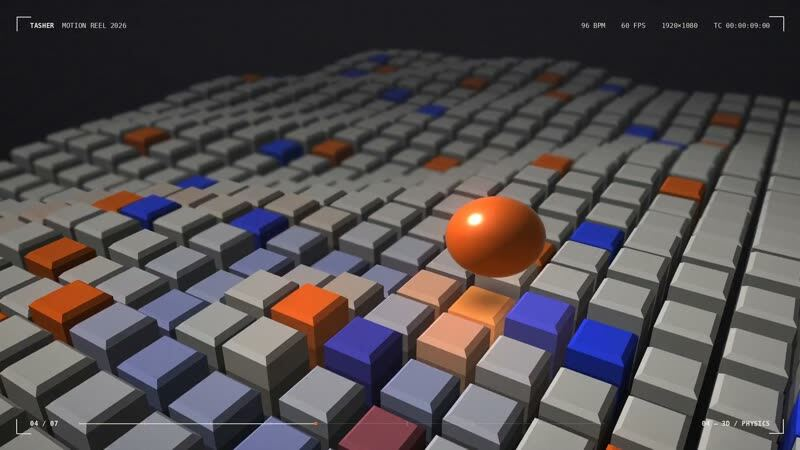
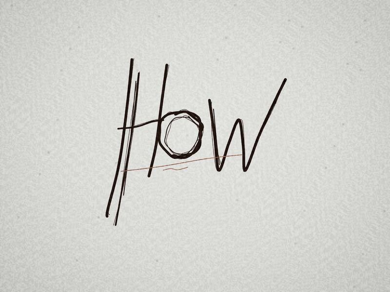
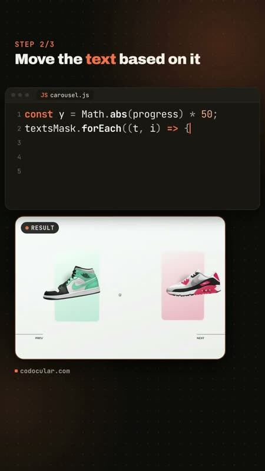
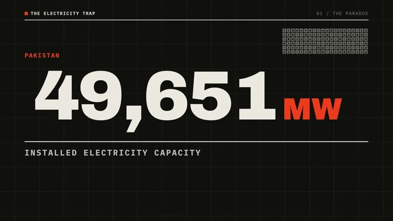

[← 全部分类](../README.md#browse)

# 短动效

105 个作品。点击封面播放；没有画廊视频时会前往 X 原帖。

<table>
<tbody>
<tr>
<td width="50%" height="225" align="center" valign="middle"></td>
<td width="50%" height="225" align="center" valign="middle"></td>
</tr>
<tr>
<td width="50%" valign="top"><strong>15 秒动态设计自由发挥</strong> <a href="https://x.com/stephanlivera">@stephanlivera</a> · 短动效 0:15 · 收藏 11,692 <a href="https://guanmo-ai.github.io/awesome-ai-motion/#case-2103315922098470926">▶ 播放</a> · <a href="https://x.com/stephanlivera/status/2103315922098470926">原帖</a></td>
<td width="50%" valign="top"><strong>一个形状串起整套 UI</strong> <a href="https://x.com/twoclipping">@twoclipping</a> · 短动效 0:14 · 收藏 19,303 <a href="https://guanmo-ai.github.io/awesome-ai-motion/#case-2103273003555402193">▶ 播放</a> · <a href="https://x.com/twoclipping/status/2103273003555402193">原帖</a></td>
</tr>
</tbody>
<tbody>
<tr>
<td width="50%" height="225" align="center" valign="middle"></td>
<td width="50%" height="225" align="center" valign="middle"></td>
</tr>
<tr>
<td width="50%" valign="top"><strong>十五秒动态图形作品集</strong> <a href="https://x.com/ajith_io">@ajith_io</a> · 短动效 0:15 · 收藏 4,403 · 资料待完善 <a href="https://guanmo-ai.github.io/awesome-ai-motion/#case-2103449416325890146">▶ 播放</a> · <a href="https://x.com/ajith_io/status/2103449416325890146">原帖</a></td>
<td width="50%" valign="top"><strong>Leon 的 15 秒动效作品集</strong> <a href="https://x.com/leonabboud">@leonabboud</a> · 短动效 0:15 · 收藏 642 <a href="https://guanmo-ai.github.io/awesome-ai-motion/#case-2103576084499358051">▶ 播放</a> · <a href="https://x.com/leonabboud/status/2103576084499358051">原帖</a></td>
</tr>
</tbody>
<tbody>
<tr>
<td width="50%" height="225" align="center" valign="middle"></td>
<td width="50%" height="225" align="center" valign="middle"></td>
</tr>
<tr>
<td width="50%" valign="top"><strong>把“成为自己”的感觉画成短片</strong> <a href="https://x.com/goodside">@goodside</a> · 短动效 0:30 · 收藏 638 <a href="https://guanmo-ai.github.io/awesome-ai-motion/#case-2102876925102555526">▶ 播放</a> · <a href="https://x.com/goodside/status/2102876925102555526">原帖</a></td>
<td width="50%" valign="top"><strong>同一动效任务的无品牌与品牌版</strong> <a href="https://x.com/lukasersil">@lukasersil</a> · 短动效 0:15 · 收藏 98 <a href="https://guanmo-ai.github.io/awesome-ai-motion/#case-2103742861971726495">▶ 播放</a> · <a href="https://x.com/lukasersil/status/2103742861971726495">原帖</a></td>
</tr>
</tbody>
<tbody>
<tr>
<td width="50%" height="225" align="center" valign="middle"></td>
<td width="50%" height="225" align="center" valign="middle"></td>
</tr>
<tr>
<td width="50%" valign="top"><strong>90 秒动效与原创钢琴</strong> <a href="https://x.com/kloss_xyz">@kloss_xyz</a> · 短动效 1:30 · 收藏 70 <a href="https://guanmo-ai.github.io/awesome-ai-motion/#case-2103557735086428547">▶ 播放</a> · <a href="https://x.com/kloss_xyz/status/2103557735086428547">原帖</a></td>
<td width="50%" valign="top"><strong>让海报冲破自己的边框</strong> <a href="https://x.com/pankajkumar_dev">@pankajkumar_dev</a> · 短动效 0:30 · 收藏 16 <a href="https://guanmo-ai.github.io/awesome-ai-motion/#case-2103502614134718609">▶ 播放</a> · <a href="https://x.com/pankajkumar_dev/status/2103502614134718609">原帖</a></td>
</tr>
</tbody>
<tbody>
<tr>
<td width="50%" height="225" align="center" valign="middle"></td>
<td width="50%" height="225" align="center" valign="middle"></td>
</tr>
<tr>
<td width="50%" valign="top"><strong>“今天星期几”三十秒动效回答</strong> <a href="https://x.com/tankazunori0914">@tankazunori0914</a> · 短动效 0:30 · 收藏 16 <a href="https://guanmo-ai.github.io/awesome-ai-motion/#case-2105917770907156748">▶ 播放</a> · <a href="https://x.com/tankazunori0914/status/2105917770907156748">原帖</a></td>
<td width="50%" valign="top"><strong>物理之美一镜到底动效</strong> <a href="https://x.com/akokoi1">@akokoi1</a> · 短动效 1:16 · 收藏 14 · 资料待完善 <a href="https://guanmo-ai.github.io/awesome-ai-motion/#case-2104200939095904322">▶ 播放</a> · <a href="https://x.com/akokoi1/status/2104200939095904322">原帖</a></td>
</tr>
</tbody>
<tbody>
<tr>
<td width="50%" height="225" align="center" valign="middle"></td>
<td width="50%" height="225" align="center" valign="middle"></td>
</tr>
<tr>
<td width="50%" valign="top"><strong>十五秒动态设计演示</strong> <a href="https://x.com/TheViableEdge">@TheViableEdge</a> · 短动效 0:15 · 收藏 5 · 资料待完善 <a href="https://guanmo-ai.github.io/awesome-ai-motion/#case-2104207707980869918">▶ 播放</a> · <a href="https://x.com/TheViableEdge/status/2104207707980869918">原帖</a></td>
<td width="50%" valign="top"><strong>四模型同指令 Motion Showreel 对照</strong> <a href="https://x.com/MasonMosen">@MasonMosen</a> · 短动效 0:15 · 收藏 0 · 资料待完善 <a href="https://guanmo-ai.github.io/awesome-ai-motion/#case-2104756321908375866">▶ 播放</a> · <a href="https://x.com/MasonMosen/status/2104756321908375866">原帖</a></td>
</tr>
</tbody>
<tbody>
<tr>
<td width="50%" height="225" align="center" valign="middle"></td>
<td width="50%" height="225" align="center" valign="middle"></td>
</tr>
<tr>
<td width="50%" valign="top"><strong>Three.js 之美：电影感长镜头</strong> <a href="https://x.com/yupengfei990919">@yupengfei990919</a> · 短动效 1:53 · 收藏 0 · 资料待完善 <a href="https://guanmo-ai.github.io/awesome-ai-motion/#case-2104788406656184436">▶ 播放</a> · <a href="https://x.com/yupengfei990919/status/2104788406656184436">原帖</a></td>
<td width="50%" valign="top"><strong>十五秒动态设计作品集</strong> <a href="https://x.com/Adimazuz03">@Adimazuz03</a> · 短动效 0:15 · 收藏 0 · 资料待完善 <a href="https://guanmo-ai.github.io/awesome-ai-motion/#case-2106715812023226687">▶ 播放</a> · <a href="https://x.com/Adimazuz03/status/2106715812023226687">原帖</a></td>
</tr>
</tbody>
<tbody>
<tr>
<td width="50%" height="225" align="center" valign="middle"></td>
<td width="50%" height="225" align="center" valign="middle"></td>
</tr>
<tr>
<td width="50%" valign="top"><strong>Show Me Your Mind：抽象动画</strong> <a href="https://x.com/argbeknwn">@argbeknwn</a> · 短动效 0:15 · 收藏 0 · 资料待完善 <a href="https://guanmo-ai.github.io/awesome-ai-motion/#case-2106734468715466818">▶ 播放</a> · <a href="https://x.com/argbeknwn/status/2106734468715466818">原帖</a></td>
<td width="50%" valign="top"><strong>Showtime：动态设计技能样片</strong> <a href="https://x.com/FavioVaz">@FavioVaz</a> · 短动效 0:15 · 收藏 0 · 资料待完善 <a href="https://guanmo-ai.github.io/awesome-ai-motion/#case-2107367735466573937">▶ 播放</a> · <a href="https://x.com/FavioVaz/status/2107367735466573937">原帖</a></td>
</tr>
</tbody>
<tbody>
<tr>
<td width="50%" height="225" align="center" valign="middle"></td>
<td width="50%" height="225" align="center" valign="middle"></td>
</tr>
<tr>
<td width="50%" valign="top"><strong>AXIOM / REACTOR 机械动效</strong> <a href="https://x.com/zyon1527">@zyon1527</a> · 短动效 0:15 · 收藏 0 · 资料待完善 <a href="https://guanmo-ai.github.io/awesome-ai-motion/#case-2107628283009364368">▶ 播放</a> · <a href="https://x.com/zyon1527/status/2107628283009364368">原帖</a></td>
<td width="50%" valign="top"><strong>同一动效作品集指令的双模型试验</strong> <a href="https://x.com/BMWepta">@BMWepta</a> · 短动效 0:30 · 收藏 0 · 资料待完善 <a href="https://guanmo-ai.github.io/awesome-ai-motion/#case-2108122750724260231">▶ 播放</a> · <a href="https://x.com/BMWepta/status/2108122750724260231">原帖</a></td>
</tr>
</tbody>
<tbody>
<tr>
<td width="50%" height="225" align="center" valign="middle"></td>
<td width="50%" height="225" align="center" valign="middle"></td>
</tr>
<tr>
<td width="50%" valign="top"><strong>Opus 视觉设计测试</strong> <a href="https://x.com/other__reality">@other__reality</a> · 短动效 2:37 · 收藏 4,192 · 资料待完善 <a href="https://guanmo-ai.github.io/awesome-ai-motion/#case-2102514581684052169">▶ 播放</a> · <a href="https://x.com/other__reality/status/2102514581684052169">原帖</a></td>
<td width="50%" valign="top"><strong>Opus 5.5 动效演示</strong> <a href="https://x.com/devteamdrew">@devteamdrew</a> · 短动效 0:32 · 收藏 4,153 · 资料待完善 <a href="https://guanmo-ai.github.io/awesome-ai-motion/#case-2102436464323661880">▶ 播放</a> · <a href="https://x.com/devteamdrew/status/2102436464323661880">原帖</a></td>
</tr>
</tbody>
<tbody>
<tr>
<td width="50%" height="225" align="center" valign="middle"></td>
<td width="50%" height="225" align="center" valign="middle"></td>
</tr>
<tr>
<td width="50%" valign="top"><strong>参考工作流制作的动画实验</strong> <a href="https://x.com/pleometric">@pleometric</a> · 短动效 2:37 · 收藏 3,466 · 资料待完善 <a href="https://guanmo-ai.github.io/awesome-ai-motion/#case-2103082510607610023">▶ 播放</a> · <a href="https://x.com/pleometric/status/2103082510607610023">原帖</a></td>
<td width="50%" valign="top"><strong>多工具合成舞蹈动效</strong> <a href="https://x.com/sankakuten91256">@sankakuten91256</a> · 短动效 0:15 · 收藏 3,185 · 资料待完善 <a href="https://guanmo-ai.github.io/awesome-ai-motion/#case-2103483923783373039">▶ 播放</a> · <a href="https://x.com/sankakuten91256/status/2103483923783373039">原帖</a></td>
</tr>
</tbody>
<tbody>
<tr>
<td width="50%" height="225" align="center" valign="middle"></td>
<td width="50%" height="225" align="center" valign="middle"></td>
</tr>
<tr>
<td width="50%" valign="top"><strong>游戏抽卡动画与提示词线索</strong> <a href="https://x.com/op7418">@op7418</a> · 短动效 0:18 · 收藏 1,621 · 资料待完善 <a href="https://guanmo-ai.github.io/awesome-ai-motion/#case-2104085484347818226">▶ 播放</a> · <a href="https://x.com/op7418/status/2104085484347818226">原帖</a></td>
<td width="50%" valign="top"><strong>模型想象中的短视频信息流</strong> <a href="https://x.com/pleometric">@pleometric</a> · 短动效 0:47 · 收藏 1,318 · 资料待完善 <a href="https://guanmo-ai.github.io/awesome-ai-motion/#case-2102572941699354900">▶ 播放</a> · <a href="https://x.com/pleometric/status/2102572941699354900">原帖</a></td>
</tr>
</tbody>
<tbody>
<tr>
<td width="50%" height="225" align="center" valign="middle"></td>
<td width="50%" height="225" align="center" valign="middle"></td>
</tr>
<tr>
<td width="50%" valign="top"><strong>无限放大式拼贴动效</strong> <a href="https://x.com/koldo2k">@koldo2k</a> · 短动效 0:20 · 收藏 933 · 资料待完善 <a href="https://guanmo-ai.github.io/awesome-ai-motion/#case-2103129343253778767">▶ 播放</a> · <a href="https://x.com/koldo2k/status/2103129343253778767">原帖</a></td>
<td width="50%" valign="top"><strong>单模型动画测试片</strong> <a href="https://x.com/LCSlates">@LCSlates</a> · 短动效 1:20 · 收藏 867 · 资料待完善 <a href="https://guanmo-ai.github.io/awesome-ai-motion/#case-2102503027340988559">▶ 播放</a> · <a href="https://x.com/LCSlates/status/2102503027340988559">原帖</a></td>
</tr>
</tbody>
<tbody>
<tr>
<td width="50%" height="225" align="center" valign="middle"></td>
<td width="50%" height="225" align="center" valign="middle"></td>
</tr>
<tr>
<td width="50%" valign="top"><strong>单页文件生成的视觉演示</strong> <a href="https://x.com/JustinPerea">@JustinPerea</a> · 短动效 0:43 · 收藏 816 · 资料待完善 <a href="https://guanmo-ai.github.io/awesome-ai-motion/#case-2102893186330841502">▶ 播放</a> · <a href="https://x.com/JustinPerea/status/2102893186330841502">原帖</a></td>
<td width="50%" valign="top"><strong>JavaScript 逐帧动画</strong> <a href="https://x.com/strawhatsu4">@strawhatsu4</a> · 短动效 0:14 · 收藏 695 · 资料待完善 <a href="https://guanmo-ai.github.io/awesome-ai-motion/#case-2102457111787745405">▶ 播放</a> · <a href="https://x.com/strawhatsu4/status/2102457111787745405">原帖</a></td>
</tr>
</tbody>
<tbody>
<tr>
<td width="50%" height="225" align="center" valign="middle"></td>
<td width="50%" height="225" align="center" valign="middle"></td>
</tr>
<tr>
<td width="50%" valign="top"><strong>代码生成的电影感测试片</strong> <a href="https://x.com/RileyRalmuto">@RileyRalmuto</a> · 短动效 0:16 · 收藏 475 · 资料待完善 <a href="https://guanmo-ai.github.io/awesome-ai-motion/#case-2102679018206052828">▶ 播放</a> · <a href="https://x.com/RileyRalmuto/status/2102679018206052828">原帖</a></td>
<td width="50%" valign="top"><strong>多轮提示制作的有声长片</strong> <a href="https://x.com/dhruvalgolakiya">@dhruvalgolakiya</a> · 短动效 2:04 · 收藏 471 · 资料待完善 <a href="https://guanmo-ai.github.io/awesome-ai-motion/#case-2102733714845491558">▶ 播放</a> · <a href="https://x.com/dhruvalgolakiya/status/2102733714845491558">原帖</a></td>
</tr>
</tbody>
<tbody>
<tr>
<td width="50%" height="225" align="center" valign="middle"></td>
<td width="50%" height="225" align="center" valign="middle"></td>
</tr>
<tr>
<td width="50%" valign="top"><strong>由拼贴块组成的鱼群动画</strong> <a href="https://x.com/dfeinition">@dfeinition</a> · 短动效 1:20 · 收藏 458 · 资料待完善 <a href="https://guanmo-ai.github.io/awesome-ai-motion/#case-2102436001473786054">▶ 播放</a> · <a href="https://x.com/dfeinition/status/2102436001473786054">原帖</a></td>
<td width="50%" valign="top"><strong>代码绘制的自画像组曲</strong> <a href="https://x.com/kevin_t_ngo">@kevin_t_ngo</a> · 短动效 0:20 · 收藏 456 · 资料待完善 <a href="https://guanmo-ai.github.io/awesome-ai-motion/#case-2102878288008057171">▶ 播放</a> · <a href="https://x.com/kevin_t_ngo/status/2102878288008057171">原帖</a></td>
</tr>
</tbody>
<tbody>
<tr>
<td width="50%" height="225" align="center" valign="middle"></td>
<td width="50%" height="225" align="center" valign="middle"></td>
</tr>
<tr>
<td width="50%" valign="top"><strong>AI 视频的 After Effects 再加工</strong> <a href="https://x.com/aicreataro">@aicreataro</a> · 短动效 0:15 · 收藏 433 · 资料待完善 <a href="https://guanmo-ai.github.io/awesome-ai-motion/#case-2102656273112326609">▶ 播放</a> · <a href="https://x.com/aicreataro/status/2102656273112326609">原帖</a></td>
<td width="50%" valign="top"><strong>模型感受的抽象动画</strong> <a href="https://x.com/AndrewOnXYZ">@AndrewOnXYZ</a> · 短动效 3:32 · 收藏 397 · 资料待完善 <a href="https://guanmo-ai.github.io/awesome-ai-motion/#case-2102817596009504849">▶ 播放</a> · <a href="https://x.com/AndrewOnXYZ/status/2102817596009504849">原帖</a></td>
</tr>
</tbody>
<tbody>
<tr>
<td width="50%" height="225" align="center" valign="middle"></td>
<td width="50%" height="225" align="center" valign="middle"></td>
</tr>
<tr>
<td width="50%" valign="top"><strong>开发对话过程的三维回顾片</strong> <a href="https://x.com/shneural">@shneural</a> · 短动效 0:56 · 收藏 391 · 资料待完善 <a href="https://guanmo-ai.github.io/awesome-ai-motion/#case-2103472385563459833">▶ 播放</a> · <a href="https://x.com/shneural/status/2103472385563459833">原帖</a></td>
<td width="50%" valign="top"><strong>九十年代风格视听演示</strong> <a href="https://x.com/gandamu_ml">@gandamu_ml</a> · 短动效 6:23 · 收藏 358 · 资料待完善 <a href="https://guanmo-ai.github.io/awesome-ai-motion/#case-2102919394775220530">▶ 播放</a> · <a href="https://x.com/gandamu_ml/status/2102919394775220530">原帖</a></td>
</tr>
</tbody>
<tbody>
<tr>
<td width="50%" height="225" align="center" valign="middle"></td>
<td width="50%" height="225" align="center" valign="middle"></td>
</tr>
<tr>
<td width="50%" valign="top"><strong>单指令沙画动画</strong> <a href="https://x.com/Michaelzsguo">@Michaelzsguo</a> · 短动效 2:00 · 收藏 355 · 资料待完善 <a href="https://guanmo-ai.github.io/awesome-ai-motion/#case-2102592355165782312">▶ 播放</a> · <a href="https://x.com/Michaelzsguo/status/2102592355165782312">原帖</a></td>
<td width="50%" valign="top"><strong>逐笔生长的水墨宣纸</strong> <a href="https://x.com/AxtonLiu">@AxtonLiu</a> · 短动效 0:39 · 收藏 347 · 资料待完善 <a href="https://guanmo-ai.github.io/awesome-ai-motion/#case-2103288413969621231">▶ 播放</a> · <a href="https://x.com/AxtonLiu/status/2103288413969621231">原帖</a></td>
</tr>
</tbody>
<tbody>
<tr>
<td width="50%" height="225" align="center" valign="middle"></td>
<td width="50%" height="225" align="center" valign="middle"></td>
</tr>
<tr>
<td width="50%" valign="top"><strong>箔纸花卉贺卡</strong> <a href="https://x.com/ann_nnng">@ann_nnng</a> · 短动效 0:23 · 收藏 245 · 资料待完善 <a href="https://guanmo-ai.github.io/awesome-ai-motion/#case-2105606322310054044">▶ 播放</a> · <a href="https://x.com/ann_nnng/status/2105606322310054044">原帖</a></td>
<td width="50%" valign="top"><strong>模型工作计划概念短片</strong> <a href="https://x.com/chetaslua">@chetaslua</a> · 短动效 3:18 · 收藏 234 · 资料待完善 <a href="https://guanmo-ai.github.io/awesome-ai-motion/#case-2102717699600368045">▶ 播放</a> · <a href="https://x.com/chetaslua/status/2102717699600368045">原帖</a></td>
</tr>
</tbody>
<tbody>
<tr>
<td width="50%" height="225" align="center" valign="middle"></td>
<td width="50%" height="225" align="center" valign="middle"></td>
</tr>
<tr>
<td width="50%" valign="top"><strong>单次指令生成的动画实验</strong> <a href="https://x.com/pivi___">@pivi___</a> · 短动效 0:33 · 收藏 233 · 资料待完善 <a href="https://guanmo-ai.github.io/awesome-ai-motion/#case-2103024907965612250">▶ 播放</a> · <a href="https://x.com/pivi___/status/2103024907965612250">原帖</a></td>
<td width="50%" valign="top"><strong>珍珠少女的三维马赛克</strong> <a href="https://x.com/redp314">@redp314</a> · 短动效 0:32 · 收藏 217 · 资料待完善 <a href="https://guanmo-ai.github.io/awesome-ai-motion/#case-2106324559805010004">▶ 播放</a> · <a href="https://x.com/redp314/status/2106324559805010004">原帖</a></td>
</tr>
</tbody>
<tbody>
<tr>
<td width="50%" height="225" align="center" valign="middle"></td>
<td width="50%" height="225" align="center" valign="middle"></td>
</tr>
<tr>
<td width="50%" valign="top"><strong>模型成长训练蒙太奇</strong> <a href="https://x.com/ishuagra02">@ishuagra02</a> · 短动效 0:30 · 收藏 195 · 资料待完善 <a href="https://guanmo-ai.github.io/awesome-ai-motion/#case-2102788371114246177">▶ 播放</a> · <a href="https://x.com/ishuagra02/status/2102788371114246177">原帖</a></td>
<td width="50%" valign="top"><strong>火车窗边的局部动画</strong> <a href="https://x.com/shironagasu_ai">@shironagasu_ai</a> · 短动效 0:10 · 收藏 161 · 资料待完善 <a href="https://guanmo-ai.github.io/awesome-ai-motion/#case-2106299981875347740">▶ 播放</a> · <a href="https://x.com/shironagasu_ai/status/2106299981875347740">原帖</a></td>
</tr>
</tbody>
<tbody>
<tr>
<td width="50%" height="225" align="center" valign="middle"></td>
<td width="50%" height="225" align="center" valign="middle"></td>
</tr>
<tr>
<td width="50%" valign="top"><strong>参考影片视觉节奏程序化复现</strong> <a href="https://x.com/leo_xiaolei">@leo_xiaolei</a> · 短动效 0:28 · 收藏 140 · 资料待完善 <a href="https://guanmo-ai.github.io/awesome-ai-motion/#case-2102724347446305104">▶ 播放</a> · <a href="https://x.com/leo_xiaolei/status/2102724347446305104">原帖</a></td>
<td width="50%" valign="top"><strong>JavaScript 逐帧旁白动画</strong> <a href="https://x.com/kevin_t_ngo">@kevin_t_ngo</a> · 短动效 1:20 · 收藏 80 · 资料待完善 <a href="https://guanmo-ai.github.io/awesome-ai-motion/#case-2104213302624821647">▶ 播放</a> · <a href="https://x.com/kevin_t_ngo/status/2104213302624821647">原帖</a></td>
</tr>
</tbody>
<tbody>
<tr>
<td width="50%" height="225" align="center" valign="middle"></td>
<td width="50%" height="225" align="center" valign="middle"></td>
</tr>
<tr>
<td width="50%" valign="top"><strong>线稿曝光与分层合成测试</strong> <a href="https://x.com/araminta_k">@araminta_k</a> · 短动效 0:25 · 收藏 78 · 资料待完善 <a href="https://guanmo-ai.github.io/awesome-ai-motion/#case-2103244081388503196">▶ 播放</a> · <a href="https://x.com/araminta_k/status/2103244081388503196">原帖</a></td>
<td width="50%" valign="top"><strong>Anidoodle：代码绘制与配乐样片</strong> <a href="https://x.com/alexgreensh">@alexgreensh</a> · 短动效 0:31 · 收藏 73 · 资料待完善 <a href="https://guanmo-ai.github.io/awesome-ai-motion/#case-2107086004964282814">▶ 播放</a> · <a href="https://x.com/alexgreensh/status/2107086004964282814">原帖</a></td>
</tr>
</tbody>
<tbody>
<tr>
<td width="50%" height="225" align="center" valign="middle"></td>
<td width="50%" height="225" align="center" valign="middle"></td>
</tr>
<tr>
<td width="50%" valign="top"><strong>15 秒动效：两次同题试验</strong> <a href="https://x.com/mesmerlord">@mesmerlord</a> · 短动效 0:15 · 收藏 65 · 资料待完善 <a href="https://guanmo-ai.github.io/awesome-ai-motion/#case-2105758042830549235">▶ 播放</a> · <a href="https://x.com/mesmerlord/status/2105758042830549235">原帖</a></td>
<td width="50%" valign="top"><strong>HyperFrames 单指令动效试片</strong> <a href="https://x.com/leandroriviello">@leandroriviello</a> · 短动效 0:14 · 收藏 52 · 资料待完善 <a href="https://guanmo-ai.github.io/awesome-ai-motion/#case-2104728379798827135">▶ 播放</a> · <a href="https://x.com/leandroriviello/status/2104728379798827135">原帖</a></td>
</tr>
</tbody>
<tbody>
<tr>
<td width="50%" height="225" align="center" valign="middle"></td>
<td width="50%" height="225" align="center" valign="middle"></td>
</tr>
<tr>
<td width="50%" valign="top"><strong>蚂蚁群落的代码动画</strong> <a href="https://x.com/hanifproduktif">@hanifproduktif</a> · 短动效 0:32 · 收藏 31 · 资料待完善 <a href="https://guanmo-ai.github.io/awesome-ai-motion/#case-2102742924148830211">▶ 播放</a> · <a href="https://x.com/hanifproduktif/status/2102742924148830211">原帖</a></td>
<td width="50%" valign="top"><strong>本机对话历史变成动画</strong> <a href="https://x.com/jake11moran">@jake11moran</a> · 短动效 0:53 · 收藏 29 · 资料待完善 <a href="https://guanmo-ai.github.io/awesome-ai-motion/#case-2103247490237825416">▶ 播放</a> · <a href="https://x.com/jake11moran/status/2103247490237825416">原帖</a></td>
</tr>
</tbody>
<tbody>
<tr>
<td width="50%" height="225" align="center" valign="middle"></td>
<td width="50%" height="225" align="center" valign="middle"></td>
</tr>
<tr>
<td width="50%" valign="top"><strong>OpenAI 圆点角色的模型对照</strong> <a href="https://x.com/kepochnik">@kepochnik</a> · 短动效 0:18 · 收藏 11 · 资料待完善 <a href="https://guanmo-ai.github.io/awesome-ai-motion/#case-2107443775232438381">▶ 播放</a> · <a href="https://x.com/kepochnik/status/2107443775232438381">原帖</a></td>
<td width="50%" valign="top"><strong>Python 三维方块、字体变化与音符同步</strong> <a href="https://x.com/Dannnnnok">@Dannnnnok</a> · 短动效 0:20 · 收藏 9 <a href="https://guanmo-ai.github.io/awesome-ai-motion/#case-2103846630088716687">▶ 播放</a> · <a href="https://x.com/Dannnnnok/status/2103846630088716687">原帖</a></td>
</tr>
</tbody>
<tbody>
<tr>
<td width="50%" height="225" align="center" valign="middle"></td>
<td width="50%" height="225" align="center" valign="middle"></td>
</tr>
<tr>
<td width="50%" valign="top"><strong>Roblox 魔法特效修改试验</strong> <a href="https://x.com/JohnKlerAI">@JohnKlerAI</a> · 短动效 0:06 · 收藏 9 · 资料待完善 <a href="https://guanmo-ai.github.io/awesome-ai-motion/#case-2107484860717973791">▶ 播放</a> · <a href="https://x.com/JohnKlerAI/status/2107484860717973791">原帖</a></td>
<td width="50%" valign="top"><strong>旧界面上的 DVD 风格动效</strong> <a href="https://x.com/AdamPolify">@AdamPolify</a> · 短动效 0:08 · 收藏 7 · 资料待完善 <a href="https://guanmo-ai.github.io/awesome-ai-motion/#case-2107592216126411062">▶ 播放</a> · <a href="https://x.com/AdamPolify/status/2107592216126411062">原帖</a></td>
</tr>
</tbody>
<tbody>
<tr>
<td width="50%" height="225" align="center" valign="middle"></td>
<td width="50%" height="225" align="center" valign="middle"></td>
</tr>
<tr>
<td width="50%" valign="top"><strong>波音747零件组装动画</strong> <a href="https://x.com/misat0x">@misat0x</a> · 短动效 1:00 · 收藏 7 · 资料待完善 <a href="https://guanmo-ai.github.io/awesome-ai-motion/#case-2108510836981445009">▶ 播放</a> · <a href="https://x.com/misat0x/status/2108510836981445009">原帖</a></td>
<td width="50%" valign="top"><strong>单张照片的 360 度人物环绕</strong> <a href="https://x.com/FiniYang">@FiniYang</a> · 短动效 0:03 · 收藏 7 · 资料待完善 <a href="https://guanmo-ai.github.io/awesome-ai-motion/#case-2107423625175593319">▶ 播放</a> · <a href="https://x.com/FiniYang/status/2107423625175593319">原帖</a></td>
</tr>
</tbody>
<tbody>
<tr>
<td width="50%" height="225" align="center" valign="middle"></td>
<td width="50%" height="225" align="center" valign="middle"></td>
</tr>
<tr>
<td width="50%" valign="top"><strong>RED素材的Katana剪辑实验</strong> <a href="https://x.com/KanaWorks_AI">@KanaWorks_AI</a> · 短动效 0:20 · 收藏 5 · 资料待完善 <a href="https://guanmo-ai.github.io/awesome-ai-motion/#case-2108509416819654704">▶ 播放</a> · <a href="https://x.com/KanaWorks_AI/status/2108509416819654704">原帖</a></td>
<td width="50%" valign="top"><strong>HyperFrames 单轮复刻与语音实验</strong> <a href="https://x.com/justinbuilds">@justinbuilds</a> · 短动效 0:22 · 收藏 4 <a href="https://guanmo-ai.github.io/awesome-ai-motion/#case-2107655437969412401">▶ 播放</a> · <a href="https://x.com/justinbuilds/status/2107655437969412401">原帖</a></td>
</tr>
</tbody>
<tbody>
<tr>
<td width="50%" height="225" align="center" valign="middle"></td>
<td width="50%" height="225" align="center" valign="middle"></td>
</tr>
<tr>
<td width="50%" valign="top"><strong>DesignLoop、HyperFrames 与语音协作实验</strong> <a href="https://x.com/vince_builds">@vince_builds</a> · 短动效 0:56 · 收藏 4 <a href="https://guanmo-ai.github.io/awesome-ai-motion/#case-2104257989100355650">▶ 播放</a> · <a href="https://x.com/vince_builds/status/2104257989100355650">原帖</a></td>
<td width="50%" valign="top"><strong>Motion：时间函数的排版短动效</strong> <a href="https://x.com/lochan_twt">@lochan_twt</a> · 短动效 0:16 · 收藏 3 · 资料待完善 <a href="https://guanmo-ai.github.io/awesome-ai-motion/#case-2107796331561730439">▶ 播放</a> · <a href="https://x.com/lochan_twt/status/2107796331561730439">原帖</a></td>
</tr>
</tbody>
<tbody>
<tr>
<td width="50%" height="225" align="center" valign="middle"></td>
<td width="50%" height="225" align="center" valign="middle"></td>
</tr>
<tr>
<td width="50%" valign="top"><strong>Remotion 动效与声音返修实验</strong> <a href="https://x.com/saxxyweb3">@saxxyweb3</a> · 短动效 0:40 · 收藏 3 <a href="https://guanmo-ai.github.io/awesome-ai-motion/#case-2104961677963690124">▶ 播放</a> · <a href="https://x.com/saxxyweb3/status/2104961677963690124">原帖</a></td>
<td width="50%" valign="top"><strong>同一角色穿越漫画、像素与蒸汽波</strong> <a href="https://x.com/AlchainHust">@AlchainHust</a> · 短动效 0:20 · 收藏 3 · 资料待完善 <a href="https://guanmo-ai.github.io/awesome-ai-motion/#case-2107641558073803075">▶ 播放</a> · <a href="https://x.com/AlchainHust/status/2107641558073803075">原帖</a></td>
</tr>
</tbody>
<tbody>
<tr>
<td width="50%" height="225" align="center" valign="middle"></td>
<td width="50%" height="225" align="center" valign="middle"></td>
</tr>
<tr>
<td width="50%" valign="top"><strong>五机位 AI 虚拟人口播剪辑</strong> <a href="https://x.com/nakazakifam">@nakazakifam</a> · 短动效 0:21 · 收藏 3 · 资料待完善 <a href="https://guanmo-ai.github.io/awesome-ai-motion/#case-2104231262600700140">▶ 播放</a> · <a href="https://x.com/nakazakifam/status/2104231262600700140">原帖</a></td>
<td width="50%" valign="top"><strong>雨夜街景照片动画</strong> <a href="https://x.com/yangfei33113">@yangfei33113</a> · 短动效 0:38 · 收藏 3 · 资料待完善 <a href="https://guanmo-ai.github.io/awesome-ai-motion/#case-2102611841122017632">▶ 播放</a> · <a href="https://x.com/yangfei33113/status/2102611841122017632">原帖</a></td>
</tr>
</tbody>
<tbody>
<tr>
<td width="50%" height="225" align="center" valign="middle"></td>
<td width="50%" height="225" align="center" valign="middle"></td>
</tr>
<tr>
<td width="50%" valign="top"><strong>旧动效的代码续作</strong> <a href="https://x.com/elianiva_">@elianiva_</a> · 短动效 0:26 · 收藏 2 · 资料待完善 <a href="https://guanmo-ai.github.io/awesome-ai-motion/#case-2103003425915195750">▶ 播放</a> · <a href="https://x.com/elianiva_/status/2103003425915195750">原帖</a></td>
<td width="50%" valign="top"><strong>15 秒 Opus 几何动效对照</strong> <a href="https://x.com/mesmerlord">@mesmerlord</a> · 短动效 0:15 · 收藏 2 · 资料待完善 <a href="https://guanmo-ai.github.io/awesome-ai-motion/#case-2105766824558174486">▶ 播放</a> · <a href="https://x.com/mesmerlord/status/2105766824558174486">原帖</a></td>
</tr>
</tbody>
<tbody>
<tr>
<td width="50%" height="225" align="center" valign="middle"></td>
<td width="50%" height="225" align="center" valign="middle"></td>
</tr>
<tr>
<td width="50%" valign="top"><strong>铬金属结：绽放、解体与重组</strong> <a href="https://x.com/gogu_name">@gogu_name</a> · 短动效 0:15 · 收藏 2 · 资料待完善 <a href="https://guanmo-ai.github.io/awesome-ai-motion/#case-2104347638883873255">▶ 播放</a> · <a href="https://x.com/gogu_name/status/2104347638883873255">原帖</a></td>
<td width="50%" valign="top"><strong>HyperFrames Studio 半小时视频实验</strong> <a href="https://x.com/joaquimcassano">@joaquimcassano</a> · 短动效 0:30 · 收藏 2 <a href="https://guanmo-ai.github.io/awesome-ai-motion/#case-2107237736121778239">▶ 播放</a> · <a href="https://x.com/joaquimcassano/status/2107237736121778239">原帖</a></td>
</tr>
</tbody>
<tbody>
<tr>
<td width="50%" height="225" align="center" valign="middle"></td>
<td width="50%" height="225" align="center" valign="middle"></td>
</tr>
<tr>
<td width="50%" valign="top"><strong>虚构企业的三维片尾标志</strong> <a href="https://x.com/arumii_movie">@arumii_movie</a> · 短动效 0:15 · 收藏 1 · 资料待完善 <a href="https://guanmo-ai.github.io/awesome-ai-motion/#case-2107737607908249613">▶ 播放</a> · <a href="https://x.com/arumii_movie/status/2107737607908249613">原帖</a></td>
<td width="50%" valign="top"><strong>HyperFrames 动效与代码配乐</strong> <a href="https://x.com/Dheepanratnam">@Dheepanratnam</a> · 短动效 0:58 · 收藏 1 · 资料待完善 <a href="https://guanmo-ai.github.io/awesome-ai-motion/#case-2107568904075706454">▶ 播放</a> · <a href="https://x.com/Dheepanratnam/status/2107568904075706454">原帖</a></td>
</tr>
</tbody>
<tbody>
<tr>
<td width="50%" height="225" align="center" valign="middle"></td>
<td width="50%" height="225" align="center" valign="middle"></td>
</tr>
<tr>
<td width="50%" valign="top"><strong>旋转杯子视频的叠加动画</strong> <a href="https://x.com/AnduArtist">@AnduArtist</a> · 短动效 0:15 · 收藏 1 · 资料待完善 <a href="https://guanmo-ai.github.io/awesome-ai-motion/#case-2102548178646016377">▶ 播放</a> · <a href="https://x.com/AnduArtist/status/2102548178646016377">原帖</a></td>
<td width="50%" valign="top"><strong>同一角色的多风格展示</strong> <a href="https://x.com/ianstig">@ianstig</a> · 短动效 2:11 · 收藏 1 · 资料待完善 <a href="https://x.com/ianstig/status/2103169675928764486">▶ 在 X 观看</a> · <a href="https://x.com/ianstig/status/2103169675928764486">原帖</a></td>
</tr>
</tbody>
<tbody>
<tr>
<td width="50%" height="225" align="center" valign="middle"></td>
<td width="50%" height="225" align="center" valign="middle"></td>
</tr>
<tr>
<td width="50%" valign="top"><strong>HyperFrames 单轮指令录屏实验</strong> <a href="https://x.com/TimGuignard">@TimGuignard</a> · 短动效 0:25 · 收藏 1 <a href="https://guanmo-ai.github.io/awesome-ai-motion/#case-2104515756159623571">▶ 播放</a> · <a href="https://x.com/TimGuignard/status/2104515756159623571">原帖</a></td>
<td width="50%" valign="top"><strong>一个形状贯穿五种 UI 状态</strong> <a href="https://x.com/zheng_qili666">@zheng_qili666</a> · 短动效 0:14 · 收藏 1 · 资料待完善 <a href="https://guanmo-ai.github.io/awesome-ai-motion/#case-2107863174095769958">▶ 播放</a> · <a href="https://x.com/zheng_qili666/status/2107863174095769958">原帖</a></td>
</tr>
</tbody>
<tbody>
<tr>
<td width="50%" height="225" align="center" valign="middle"></td>
<td width="50%" height="225" align="center" valign="middle"></td>
</tr>
<tr>
<td width="50%" valign="top"><strong>Kling合成效果的分层展示</strong> <a href="https://x.com/onofumi_AI">@onofumi_AI</a> · 短动效 0:10 · 收藏 0 · 资料待完善 <a href="https://guanmo-ai.github.io/awesome-ai-motion/#case-2108487186777846023">▶ 播放</a> · <a href="https://x.com/onofumi_AI/status/2108487186777846023">原帖</a></td>
<td width="50%" valign="top"><strong>石块绘制的幻想版画动画</strong> <a href="https://x.com/illodevcode">@illodevcode</a> · 短动效 1:04 · 收藏 0 · 资料待完善 <a href="https://guanmo-ai.github.io/awesome-ai-motion/#case-2104214763358015565">▶ 播放</a> · <a href="https://x.com/illodevcode/status/2104214763358015565">原帖</a></td>
</tr>
</tbody>
<tbody>
<tr>
<td width="50%" height="225" align="center" valign="middle"></td>
<td width="50%" height="225" align="center" valign="middle"></td>
</tr>
<tr>
<td width="50%" valign="top"><strong>虚构游戏主机的开机标志</strong> <a href="https://x.com/arumii_movie">@arumii_movie</a> · 短动效 0:25 · 收藏 0 · 资料待完善 <a href="https://guanmo-ai.github.io/awesome-ai-motion/#case-2107790132061622720">▶ 播放</a> · <a href="https://x.com/arumii_movie/status/2107790132061622720">原帖</a></td>
<td width="50%" valign="top"><strong>Swift 伦敦雪景球</strong> <a href="https://x.com/eigeorguy">@eigeorguy</a> · 短动效 0:06 · 收藏 0 · 资料待完善 <a href="https://guanmo-ai.github.io/awesome-ai-motion/#case-2103992442072813651">▶ 播放</a> · <a href="https://x.com/eigeorguy/status/2103992442072813651">原帖</a></td>
</tr>
</tbody>
<tbody>
<tr>
<td width="50%" height="225" align="center" valign="middle"></td>
<td width="50%" height="225" align="center" valign="middle"></td>
</tr>
<tr>
<td width="50%" valign="top"><strong>开源 TTS 与声音分层的片头实验</strong> <a href="https://x.com/itsahmedharoon">@itsahmedharoon</a> · 短动效 0:41 · 收藏 0 <a href="https://guanmo-ai.github.io/awesome-ai-motion/#case-2103986344414544194">▶ 播放</a> · <a href="https://x.com/itsahmedharoon/status/2103986344414544194">原帖</a></td>
<td width="50%" valign="top"><strong>Opus 与 Remotion 动效制作实验</strong> <a href="https://x.com/SmitJainEditor">@SmitJainEditor</a> · 短动效 0:40 · 收藏 0 <a href="https://guanmo-ai.github.io/awesome-ai-motion/#case-2107019496078843957">▶ 播放</a> · <a href="https://x.com/SmitJainEditor/status/2107019496078843957">原帖</a></td>
</tr>
</tbody>
<tbody>
<tr>
<td width="50%" height="225" align="center" valign="middle"></td>
<td width="50%" height="225" align="center" valign="middle"></td>
</tr>
<tr>
<td width="50%" valign="top"><strong>HyperFrames 单轮提示词动效实验</strong> <a href="https://x.com/kzmucx">@kzmucx</a> · 短动效 0:24 · 收藏 0 <a href="https://guanmo-ai.github.io/awesome-ai-motion/#case-2107225121123402052">▶ 播放</a> · <a href="https://x.com/kzmucx/status/2107225121123402052">原帖</a></td>
<td width="50%" valign="top"><strong>奶龙的 2.5D 节奏剪辑</strong> <a href="https://x.com/tirtaVEX">@tirtaVEX</a> · 短动效 0:28 · 收藏 0 · 资料待完善 <a href="https://guanmo-ai.github.io/awesome-ai-motion/#case-2107649731229094304">▶ 播放</a> · <a href="https://x.com/tirtaVEX/status/2107649731229094304">原帖</a></td>
</tr>
</tbody>
<tbody>
<tr>
<td width="50%" height="225" align="center" valign="middle"></td>
<td width="50%" height="225" align="center" valign="middle"></td>
</tr>
<tr>
<td width="50%" valign="top"><strong>粒子排字：Opus 动画与 Fable 文案</strong> <a href="https://x.com/mszzz0011">@mszzz0011</a> · 短动效 0:20 · 收藏 0 · 资料待完善 <a href="https://guanmo-ai.github.io/awesome-ai-motion/#case-2106040056616239235">▶ 播放</a> · <a href="https://x.com/mszzz0011/status/2106040056616239235">原帖</a></td>
<td width="50%" valign="top"><strong>365 笔油画过程动画</strong> <a href="https://x.com/redp314">@redp314</a> · 短动效 0:32 · 收藏 0 · 资料待完善 <a href="https://guanmo-ai.github.io/awesome-ai-motion/#case-2107499130536763520">▶ 播放</a> · <a href="https://x.com/redp314/status/2107499130536763520">原帖</a></td>
</tr>
</tbody>
<tbody>
<tr>
<td width="50%" height="225" align="center" valign="middle"></td>
<td width="50%" height="225" align="center" valign="middle"></td>
</tr>
<tr>
<td width="50%" valign="top"><strong>圆与三角形的代码动画测试</strong> <a href="https://x.com/karoukun_ai">@karoukun_ai</a> · 短动效 0:15 · 收藏 0 · 资料待完善 <a href="https://guanmo-ai.github.io/awesome-ai-motion/#case-2108150684176863482">▶ 播放</a> · <a href="https://x.com/karoukun_ai/status/2108150684176863482">原帖</a></td>
<td width="50%" valign="top"><strong>12,346 台 iPhone 的多米诺动画</strong> <a href="https://x.com/paojiaofty">@paojiaofty</a> · 短动效 0:26 · 收藏 0 · 资料待完善 <a href="https://guanmo-ai.github.io/awesome-ai-motion/#case-2104756133558984946">▶ 播放</a> · <a href="https://x.com/paojiaofty/status/2104756133558984946">原帖</a></td>
</tr>
</tbody>
<tbody>
<tr>
<td width="50%" height="225" align="center" valign="middle"></td>
<td width="50%" height="225" align="center" valign="middle"></td>
</tr>
<tr>
<td width="50%" valign="top"><strong>交通登记主题的葡语动效试验</strong> <a href="https://x.com/SquareOnChain">@SquareOnChain</a> · 短动效 0:55 · 收藏 0 · 资料待完善 <a href="https://guanmo-ai.github.io/awesome-ai-motion/#case-2107667218326835369">▶ 播放</a> · <a href="https://x.com/SquareOnChain/status/2107667218326835369">原帖</a></td>
<td width="50%" valign="top"><strong>Codex动效复刻的双栏对照</strong> <a href="https://x.com/TTDD686">@TTDD686</a> · 短动效 0:50 · 收藏 0 · 资料待完善 <a href="https://guanmo-ai.github.io/awesome-ai-motion/#case-2108447153098207345">▶ 播放</a> · <a href="https://x.com/TTDD686/status/2108447153098207345">原帖</a></td>
</tr>
</tbody>
<tbody>
<tr>
<td width="50%" height="225" align="center" valign="middle"></td>
<td width="50%" height="225" align="center" valign="middle"></td>
</tr>
<tr>
<td width="50%" valign="top"><strong>After Effects 多轮制作对照</strong> <a href="https://x.com/throughiris_">@throughiris_</a> · 短动效 0:12 · 收藏 0 · 资料待完善 <a href="https://guanmo-ai.github.io/awesome-ai-motion/#case-2102911234526048706">▶ 播放</a> · <a href="https://x.com/throughiris_/status/2102911234526048706">原帖</a></td>
<td width="50%" valign="top"><strong>HyperFrames 动效试作</strong> <a href="https://x.com/mukhtharcm">@mukhtharcm</a> · 短动效 1:08 · 收藏 0 · 资料待完善 <a href="https://guanmo-ai.github.io/awesome-ai-motion/#case-2104235944383803495">▶ 播放</a> · <a href="https://x.com/mukhtharcm/status/2104235944383803495">原帖</a></td>
</tr>
</tbody>
<tbody>
<tr>
<td width="50%" height="225" align="center" valign="middle"></td>
<td width="50%" height="225" align="center" valign="middle"></td>
</tr>
<tr>
<td width="50%" valign="top"><strong>金粉振动板：克拉尼图形动画</strong> <a href="https://x.com/park_danie36173">@park_danie36173</a> · 短动效 0:30 · 收藏 0 · 资料待完善 <a href="https://guanmo-ai.github.io/awesome-ai-motion/#case-2104763812733981142">▶ 播放</a> · <a href="https://x.com/park_danie36173/status/2104763812733981142">原帖</a></td>
<td width="50%" valign="top"><strong>Design Builder 入职短片</strong> <a href="https://x.com/Prathamesh_812">@Prathamesh_812</a> · 短动效 0:15 · 收藏 0 · 资料待完善 <a href="https://guanmo-ai.github.io/awesome-ai-motion/#case-2104776177609293975">▶ 播放</a> · <a href="https://x.com/Prathamesh_812/status/2104776177609293975">原帖</a></td>
</tr>
</tbody>
<tbody>
<tr>
<td width="50%" height="225" align="center" valign="middle"></td>
<td width="50%" height="225" align="center" valign="middle"></td>
</tr>
<tr>
<td width="50%" valign="top"><strong>单页 HTML 折纸发布短片</strong> <a href="https://x.com/Vignesh_rav">@Vignesh_rav</a> · 短动效 0:13 · 收藏 0 · 资料待完善 <a href="https://guanmo-ai.github.io/awesome-ai-motion/#case-2104837895773417649">▶ 播放</a> · <a href="https://x.com/Vignesh_rav/status/2104837895773417649">原帖</a></td>
<td width="50%" valign="top"><strong>铅笔建筑动画到三维模型</strong> <a href="https://x.com/studiotimfu">@studiotimfu</a> · 短动效 0:26 · 收藏 0 · 资料待完善 <a href="https://guanmo-ai.github.io/awesome-ai-motion/#case-2105683672737145017">▶ 播放</a> · <a href="https://x.com/studiotimfu/status/2105683672737145017">原帖</a></td>
</tr>
</tbody>
<tbody>
<tr>
<td width="50%" height="225" align="center" valign="middle"></td>
<td width="50%" height="225" align="center" valign="middle"></td>
</tr>
<tr>
<td width="50%" valign="top"><strong>代码渲染的霓虹城市雨景</strong> <a href="https://x.com/0xInsiderf5">@0xInsiderf5</a> · 短动效 0:15 · 收藏 0 · 资料待完善 <a href="https://guanmo-ai.github.io/awesome-ai-motion/#case-2106056138894479482">▶ 播放</a> · <a href="https://x.com/0xInsiderf5/status/2106056138894479482">原帖</a></td>
<td width="50%" valign="top"><strong>售货机式服务菜单动效</strong> <a href="https://x.com/ux_vlad">@ux_vlad</a> · 短动效 0:15 · 收藏 0 · 资料待完善 <a href="https://guanmo-ai.github.io/awesome-ai-motion/#case-2106068105894207525">▶ 播放</a> · <a href="https://x.com/ux_vlad/status/2106068105894207525">原帖</a></td>
</tr>
</tbody>
<tbody>
<tr>
<td width="50%" height="225" align="center" valign="middle"></td>
<td width="50%" height="225" align="center" valign="middle"></td>
</tr>
<tr>
<td width="50%" valign="top"><strong>Gyroid 灵感的金属曲面穿越</strong> <a href="https://x.com/CsaplarD">@CsaplarD</a> · 短动效 0:22 · 收藏 0 · 资料待完善 <a href="https://guanmo-ai.github.io/awesome-ai-motion/#case-2106462870745534946">▶ 播放</a> · <a href="https://x.com/CsaplarD/status/2106462870745534946">原帖</a></td>
<td width="50%" valign="top"><strong>从加载到成功的界面动画</strong> <a href="https://x.com/briangulo_">@briangulo_</a> · 短动效 0:06 · 收藏 0 · 资料待完善 <a href="https://guanmo-ai.github.io/awesome-ai-motion/#case-2107500032538575272">▶ 播放</a> · <a href="https://x.com/briangulo_/status/2107500032538575272">原帖</a></td>
</tr>
</tbody>
<tbody>
<tr>
<td width="50%" height="225" align="center" valign="middle"></td>
<td width="50%" height="225" align="center" valign="middle"></td>
</tr>
<tr>
<td width="50%" valign="top"><strong>Astra 与 Remotion 动效试片</strong> <a href="https://x.com/MathryxAI">@MathryxAI</a> · 短动效 0:24 · 收藏 0 · 资料待完善 <a href="https://guanmo-ai.github.io/awesome-ai-motion/#case-2107581288265711900">▶ 播放</a> · <a href="https://x.com/MathryxAI/status/2107581288265711900">原帖</a></td>
<td width="50%" valign="top"><strong>手工 UI 的 Shader 动效试验</strong> <a href="https://x.com/artabrarov">@artabrarov</a> · 短动效 0:18 · 收藏 0 · 资料待完善 <a href="https://guanmo-ai.github.io/awesome-ai-motion/#case-2107582341182861643">▶ 播放</a> · <a href="https://x.com/artabrarov/status/2107582341182861643">原帖</a></td>
</tr>
</tbody>
<tbody>
<tr>
<td width="50%" height="225" align="center" valign="middle"></td>
<td width="50%" height="225" align="center" valign="middle"></td>
</tr>
<tr>
<td width="50%" valign="top"><strong>设计与代码错位的等距动画</strong> <a href="https://x.com/Arnaud34Web">@Arnaud34Web</a> · 短动效 1:16 · 收藏 0 · 资料待完善 <a href="https://guanmo-ai.github.io/awesome-ai-motion/#case-2108183084847841636">▶ 播放</a> · <a href="https://x.com/Arnaud34Web/status/2108183084847841636">原帖</a></td>
<td width="50%" valign="top"><strong>剪贴拼贴与人物排版动效</strong> <a href="https://x.com/jack_guler">@jack_guler</a> · 短动效 1:43 · 收藏 0 · 资料待完善 <a href="https://guanmo-ai.github.io/awesome-ai-motion/#case-2108378073259524249">▶ 播放</a> · <a href="https://x.com/jack_guler/status/2108378073259524249">原帖</a></td>
</tr>
</tbody>
<tbody>
<tr>
<td width="50%" height="225" align="center" valign="middle"></td>
<td width="50%"></td>
</tr>
<tr>
<td width="50%" valign="top"><strong>数字与网格的信息动效</strong> <a href="https://x.com/clementonn">@clementonn</a> · 短动效 1:25 · 收藏 0 · 资料待完善 <a href="https://guanmo-ai.github.io/awesome-ai-motion/#case-2108504736257434081">▶ 播放</a> · <a href="https://x.com/clementonn/status/2108504736257434081">原帖</a></td>
<td width="50%"></td>
</tr>
</tbody>
</table>
