[← 全部分类](../README.md#browse)

# 音乐与歌词

52 个作品。点击封面播放；没有画廊视频时会前往 X 原帖。

<table>
<tbody>
<tr>
<td width="50%" height="225" align="center" valign="middle"></td>
<td width="50%" height="225" align="center" valign="middle"><a href="https://guanmo-ai.github.io/awesome-ai-motion/#case-2107093105992417482">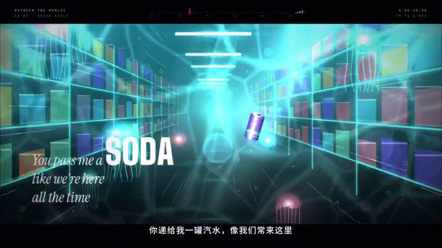</a></td>
</tr>
<tr>
<td width="50%" valign="top"><strong>Claude Pop 混合制作 MV</strong> <a href="https://x.com/donaldjewkes">@donaldjewkes</a> · 音乐与歌词 2:22 · 收藏 8,096 <a href="https://guanmo-ai.github.io/awesome-ai-motion/#case-2102801274173587569">▶ 播放</a> · <a href="https://x.com/donaldjewkes/status/2102801274173587569">原帖</a></td>
<td width="50%" valign="top"><strong>Suno 歌曲的动态视觉 MV</strong> <a href="https://x.com/hungryturbo">@hungryturbo</a> · 音乐与歌词 2:37 · 收藏 6 · 资料待完善 <a href="https://guanmo-ai.github.io/awesome-ai-motion/#case-2107093105992417482">▶ 播放</a> · <a href="https://x.com/hungryturbo/status/2107093105992417482">原帖</a></td>
</tr>
</tbody>
<tbody>
<tr>
<td width="50%" height="225" align="center" valign="middle"></td>
<td width="50%" height="225" align="center" valign="middle"><a href="https://guanmo-ai.github.io/awesome-ai-motion/#case-2107455787823952091">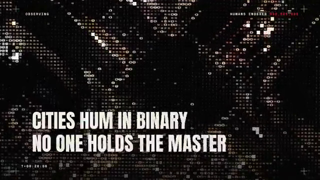</a></td>
</tr>
<tr>
<td width="50%" valign="top"><strong>让歌词成为竖屏视频主角</strong> <a href="https://x.com/kurahu_capten">@kurahu_capten</a> · 音乐与歌词 0:48 · 收藏 2 <a href="https://guanmo-ai.github.io/awesome-ai-motion/#case-2103741636635496583">▶ 播放</a> · <a href="https://x.com/kurahu_capten/status/2103741636635496583">原帖</a></td>
<td width="50%" valign="top"><strong>AI 接管世界：歌曲视觉试验</strong> <a href="https://x.com/Dheepanratnam">@Dheepanratnam</a> · 音乐与歌词 1:00 · 收藏 2 · 资料待完善 <a href="https://guanmo-ai.github.io/awesome-ai-motion/#case-2107455787823952091">▶ 播放</a> · <a href="https://x.com/Dheepanratnam/status/2107455787823952091">原帖</a></td>
</tr>
</tbody>
<tbody>
<tr>
<td width="50%" height="225" align="center" valign="middle"><a href="https://guanmo-ai.github.io/awesome-ai-motion/#case-2102899866762440893">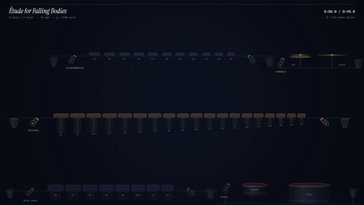</a></td>
<td width="50%" height="225" align="center" valign="middle"><a href="https://guanmo-ai.github.io/awesome-ai-motion/#case-2104254444603076730">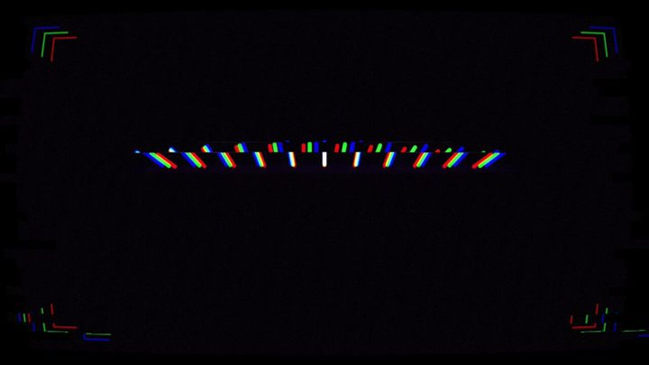</a></td>
</tr>
<tr>
<td width="50%" valign="top"><strong>碰撞触发音符的机械装置</strong> <a href="https://x.com/KamStudioLabs">@KamStudioLabs</a> · 音乐与歌词 0:47 · 收藏 1 · 资料待完善 <a href="https://guanmo-ai.github.io/awesome-ai-motion/#case-2102899866762440893">▶ 播放</a> · <a href="https://x.com/KamStudioLabs/status/2102899866762440893">原帖</a></td>
<td width="50%" valign="top"><strong>逐帧代码生成的音乐视频</strong> <a href="https://x.com/linus5x">@linus5x</a> · 音乐与歌词 1:45 · 收藏 0 · 资料待完善 <a href="https://guanmo-ai.github.io/awesome-ai-motion/#case-2104254444603076730">▶ 播放</a> · <a href="https://x.com/linus5x/status/2104254444603076730">原帖</a></td>
</tr>
</tbody>
<tbody>
<tr>
<td width="50%" height="225" align="center" valign="middle"><a href="https://guanmo-ai.github.io/awesome-ai-motion/#case-2105230653457650116">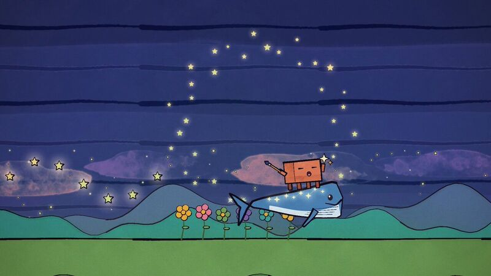</a></td>
<td width="50%" height="225" align="center" valign="middle"><a href="https://guanmo-ai.github.io/awesome-ai-motion/#case-2107449614412493219">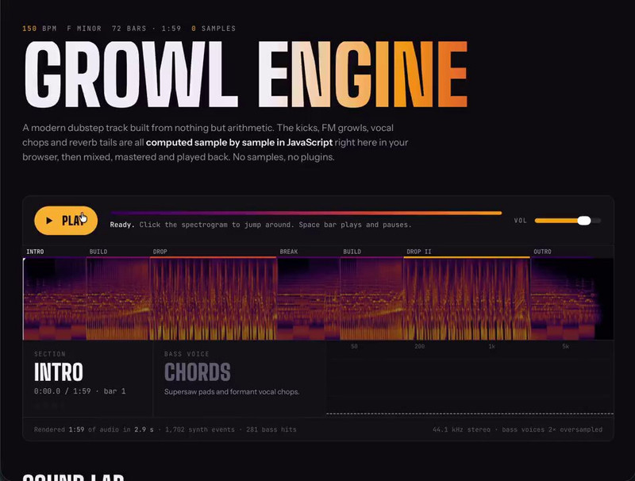</a></td>
</tr>
<tr>
<td width="50%" valign="top"><strong>One Prompt：p5.js 音乐视频</strong> <a href="https://x.com/ppop123">@ppop123</a> · 音乐与歌词 2:10 · 收藏 0 · 资料待完善 <a href="https://guanmo-ai.github.io/awesome-ai-motion/#case-2105230653457650116">▶ 播放</a> · <a href="https://x.com/ppop123/status/2105230653457650116">原帖</a></td>
<td width="50%" valign="top"><strong>Growl Engine：JavaScript 低音音乐</strong> <a href="https://x.com/HOTHEAD01TH">@HOTHEAD01TH</a> · 音乐与歌词 2:00 · 收藏 0 · 资料待完善 <a href="https://guanmo-ai.github.io/awesome-ai-motion/#case-2107449614412493219">▶ 播放</a> · <a href="https://x.com/HOTHEAD01TH/status/2107449614412493219">原帖</a></td>
</tr>
</tbody>
<tbody>
<tr>
<td width="50%" height="225" align="center" valign="middle"></td>
<td width="50%" height="225" align="center" valign="middle"></td>
</tr>
<tr>
<td width="50%" valign="top"><strong>功能性情绪论文歌曲影像</strong> <a href="https://x.com/eudaemonea">@eudaemonea</a> · 音乐与歌词 6:13 · 收藏 2,119 · 资料待完善 <a href="https://guanmo-ai.github.io/awesome-ai-motion/#case-2102610626321490404">▶ 播放</a> · <a href="https://x.com/eudaemonea/status/2102610626321490404">原帖</a></td>
<td width="50%" valign="top"><strong>Blender 重制音乐梗片</strong> <a href="https://x.com/reach_vb">@reach_vb</a> · 音乐与歌词 0:58 · 收藏 1,608 · 资料待完善 <a href="https://guanmo-ai.github.io/awesome-ai-motion/#case-2096612996256579653">▶ 播放</a> · <a href="https://x.com/reach_vb/status/2096612996256579653">原帖</a></td>
</tr>
</tbody>
<tbody>
<tr>
<td width="50%" height="225" align="center" valign="middle"></td>
<td width="50%" height="225" align="center" valign="middle"><a href="https://guanmo-ai.github.io/awesome-ai-motion/#case-2104111432149164474">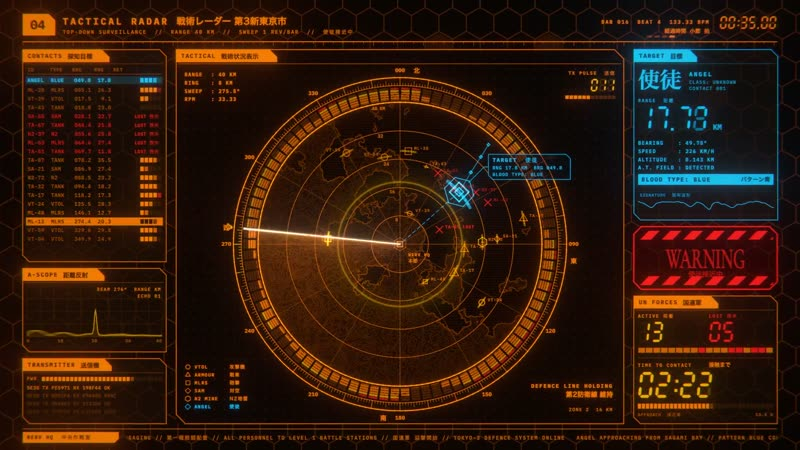</a></td>
</tr>
<tr>
<td width="50%" valign="top"><strong>钢琴作曲与 JavaScript 动画</strong> <a href="https://x.com/kevin_t_ngo">@kevin_t_ngo</a> · 音乐与歌词 0:45 · 收藏 1,209 · 资料待完善 <a href="https://guanmo-ai.github.io/awesome-ai-motion/#case-2103482164193165711">▶ 播放</a> · <a href="https://x.com/kevin_t_ngo/status/2103482164193165711">原帖</a></td>
<td width="50%" valign="top"><strong>Neon Overdrive：EVA 灵感音画可视化</strong> <a href="https://x.com/LuisBizarro">@LuisBizarro</a> · 音乐与歌词 3:04 · 收藏 1,168 · 资料待完善 <a href="https://guanmo-ai.github.io/awesome-ai-motion/#case-2104111432149164474">▶ 播放</a> · <a href="https://x.com/LuisBizarro/status/2104111432149164474">原帖</a></td>
</tr>
</tbody>
<tbody>
<tr>
<td width="50%" height="225" align="center" valign="middle"><a href="https://guanmo-ai.github.io/awesome-ai-motion/#case-2102803889183736141">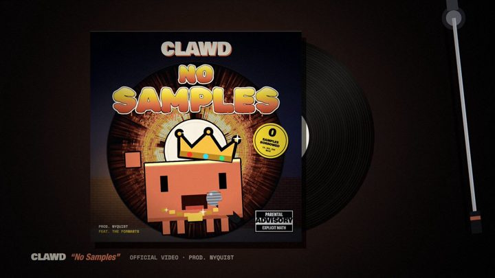</a></td>
<td width="50%" height="225" align="center" valign="middle"></td>
</tr>
<tr>
<td width="50%" valign="top"><strong>代码合成的说唱单曲影像</strong> <a href="https://x.com/aj_dev_smith">@aj_dev_smith</a> · 音乐与歌词 3:11 · 收藏 852 · 资料待完善 <a href="https://guanmo-ai.github.io/awesome-ai-motion/#case-2102803889183736141">▶ 播放</a> · <a href="https://x.com/aj_dev_smith/status/2102803889183736141">原帖</a></td>
<td width="50%" valign="top"><strong>角色流行朋克音乐片</strong> <a href="https://x.com/aj_dev_smith">@aj_dev_smith</a> · 音乐与歌词 2:30 · 收藏 665 · 资料待完善 <a href="https://guanmo-ai.github.io/awesome-ai-motion/#case-2102575577563570450">▶ 播放</a> · <a href="https://x.com/aj_dev_smith/status/2102575577563570450">原帖</a></td>
</tr>
</tbody>
<tbody>
<tr>
<td width="50%" height="225" align="center" valign="middle"></td>
<td width="50%" height="225" align="center" valign="middle"></td>
</tr>
<tr>
<td width="50%" valign="top"><strong>货币史主题音乐影像</strong> <a href="https://x.com/bradmillscan">@bradmillscan</a> · 音乐与歌词 3:23 · 收藏 358 · 资料待完善 <a href="https://guanmo-ai.github.io/awesome-ai-motion/#case-2103108967194833310">▶ 播放</a> · <a href="https://x.com/bradmillscan/status/2103108967194833310">原帖</a></td>
<td width="50%" valign="top"><strong>Safety &amp; First Place：歌曲 MV</strong> <a href="https://x.com/Xanderwow_A">@Xanderwow_A</a> · 音乐与歌词 0:25 · 收藏 344 · 资料待完善 <a href="https://guanmo-ai.github.io/awesome-ai-motion/#case-2106989958762516875">▶ 播放</a> · <a href="https://x.com/Xanderwow_A/status/2106989958762516875">原帖</a></td>
</tr>
</tbody>
<tbody>
<tr>
<td width="50%" height="225" align="center" valign="middle"></td>
<td width="50%" height="225" align="center" valign="middle"><a href="https://guanmo-ai.github.io/awesome-ai-motion/#case-2106131543752122774">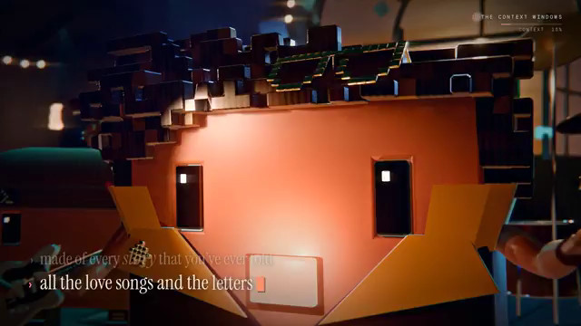</a></td>
</tr>
<tr>
<td width="50%" valign="top"><strong>绿幕人物的节拍 MV 合成</strong> <a href="https://x.com/gkxspace">@gkxspace</a> · 音乐与歌词 0:15 · 收藏 277 · 资料待完善 <a href="https://guanmo-ai.github.io/awesome-ai-motion/#case-2107108561851445324">▶ 播放</a> · <a href="https://x.com/gkxspace/status/2107108561851445324">原帖</a></td>
<td width="50%" valign="top"><strong>The Context Windows：本地 AI 乐队</strong> <a href="https://x.com/anshuc">@anshuc</a> · 音乐与歌词 3:20 · 收藏 146 · 资料待完善 <a href="https://guanmo-ai.github.io/awesome-ai-motion/#case-2106131543752122774">▶ 播放</a> · <a href="https://x.com/anshuc/status/2106131543752122774">原帖</a></td>
</tr>
</tbody>
<tbody>
<tr>
<td width="50%" height="225" align="center" valign="middle"></td>
<td width="50%" height="225" align="center" valign="middle"></td>
</tr>
<tr>
<td width="50%" valign="top"><strong>人工艺术指导下的多工具音乐视频</strong> <a href="https://x.com/maxescu">@maxescu</a> · 音乐与歌词 3:20 · 收藏 128 · 资料待完善 <a href="https://guanmo-ai.github.io/awesome-ai-motion/#case-2106395987996536913">▶ 播放</a> · <a href="https://x.com/maxescu/status/2106395987996536913">原帖</a></td>
<td width="50%" valign="top"><strong>幻想角色歌曲影像</strong> <a href="https://x.com/Shoalst0ne">@Shoalst0ne</a> · 音乐与歌词 3:28 · 收藏 95 · 资料待完善 <a href="https://guanmo-ai.github.io/awesome-ai-motion/#case-2102640820776046818">▶ 播放</a> · <a href="https://x.com/Shoalst0ne/status/2102640820776046818">原帖</a></td>
</tr>
</tbody>
<tbody>
<tr>
<td width="50%" height="225" align="center" valign="middle"><a href="https://guanmo-ai.github.io/awesome-ai-motion/#case-2107102281640653237">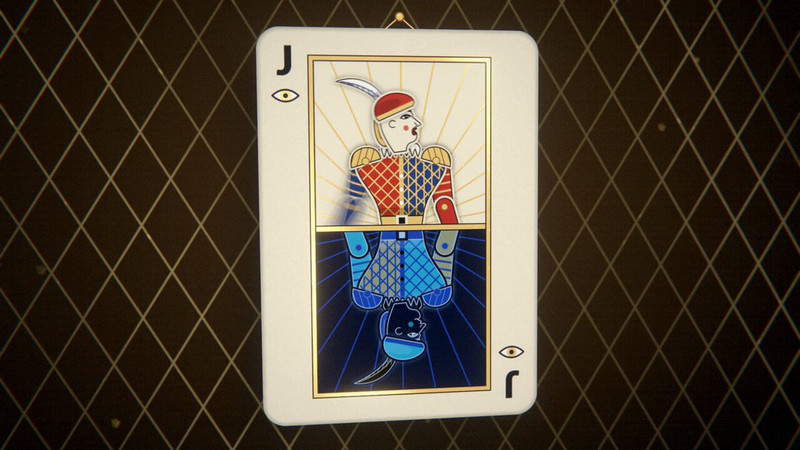</a></td>
<td width="50%" height="225" align="center" valign="middle"></td>
</tr>
<tr>
<td width="50%" valign="top"><strong>扑克牌角色的说唱 MV</strong> <a href="https://x.com/Narfdemo2000">@Narfdemo2000</a> · 音乐与歌词 1:19 · 收藏 39 · 资料待完善 <a href="https://guanmo-ai.github.io/awesome-ai-motion/#case-2107102281640653237">▶ 播放</a> · <a href="https://x.com/Narfdemo2000/status/2107102281640653237">原帖</a></td>
<td width="50%" valign="top"><strong>角色设定驱动的动画歌曲</strong> <a href="https://x.com/ruinolab">@ruinolab</a> · 音乐与歌词 0:50 · 收藏 27 · 资料待完善 <a href="https://guanmo-ai.github.io/awesome-ai-motion/#case-2103120880796873091">▶ 播放</a> · <a href="https://x.com/ruinolab/status/2103120880796873091">原帖</a></td>
</tr>
</tbody>
<tbody>
<tr>
<td width="50%" height="225" align="center" valign="middle"></td>
<td width="50%" height="225" align="center" valign="middle"></td>
</tr>
<tr>
<td width="50%" valign="top"><strong>既有歌曲的程序化影像</strong> <a href="https://x.com/ExistentialEnso">@ExistentialEnso</a> · 音乐与歌词 5:40 · 收藏 20 · 资料待完善 <a href="https://guanmo-ai.github.io/awesome-ai-motion/#case-2102599211212554616">▶ 播放</a> · <a href="https://x.com/ExistentialEnso/status/2102599211212554616">原帖</a></td>
<td width="50%" valign="top"><strong>水彩渲染的歌曲影像</strong> <a href="https://x.com/johnknopf">@johnknopf</a> · 音乐与歌词 3:26 · 收藏 15 · 资料待完善 <a href="https://guanmo-ai.github.io/awesome-ai-motion/#case-2103170666187117006">▶ 播放</a> · <a href="https://x.com/johnknopf/status/2103170666187117006">原帖</a></td>
</tr>
</tbody>
<tbody>
<tr>
<td width="50%" height="225" align="center" valign="middle"><a href="https://guanmo-ai.github.io/awesome-ai-motion/#case-2105174061697618314">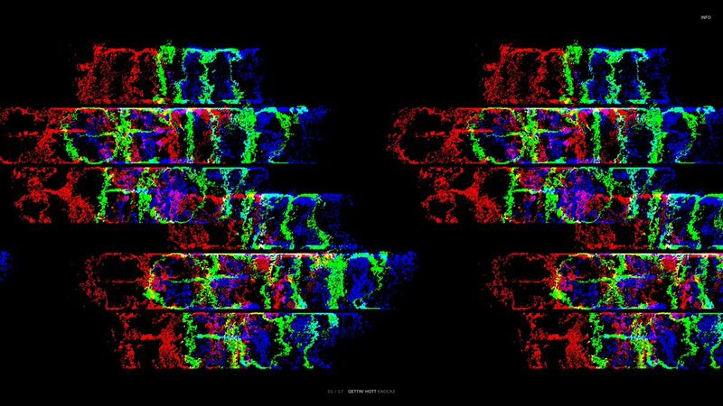</a></td>
<td width="50%" height="225" align="center" valign="middle"></td>
</tr>
<tr>
<td width="50%" valign="top"><strong>MusicKit 与 WebGPU 交互歌词播放器</strong> <a href="https://x.com/LuisBizarro">@LuisBizarro</a> · 音乐与歌词 0:18 · 收藏 14 · 资料待完善 <a href="https://guanmo-ai.github.io/awesome-ai-motion/#case-2105174061697618314">▶ 播放</a> · <a href="https://x.com/LuisBizarro/status/2105174061697618314">原帖</a></td>
<td width="50%" valign="top"><strong>二十秒音乐短片</strong> <a href="https://x.com/anjmaxx">@anjmaxx</a> · 音乐与歌词 0:20 · 收藏 7 · 资料待完善 <a href="https://guanmo-ai.github.io/awesome-ai-motion/#case-2103173729656459455">▶ 播放</a> · <a href="https://x.com/anjmaxx/status/2103173729656459455">原帖</a></td>
</tr>
</tbody>
<tbody>
<tr>
<td width="50%" height="225" align="center" valign="middle"><a href="https://guanmo-ai.github.io/awesome-ai-motion/#case-2107402637700460669">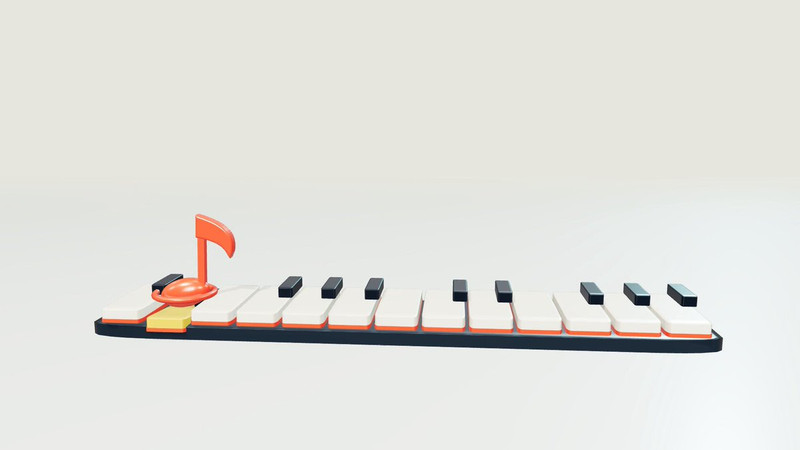</a></td>
<td width="50%" height="225" align="center" valign="middle"><a href="https://guanmo-ai.github.io/awesome-ai-motion/#case-2104241160487338005">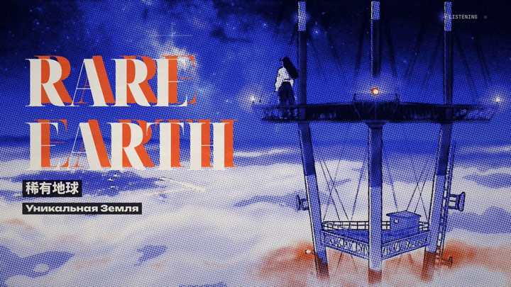</a></td>
</tr>
<tr>
<td width="50%" valign="top"><strong>音符蹦迪：三首旋律串烧</strong> <a href="https://x.com/YangOnchain">@YangOnchain</a> · 音乐与歌词 1:17 · 收藏 5 · 资料待完善 <a href="https://guanmo-ai.github.io/awesome-ai-motion/#case-2107402637700460669">▶ 播放</a> · <a href="https://x.com/YangOnchain/status/2107402637700460669">原帖</a></td>
<td width="50%" valign="top"><strong>吉他歌曲的 techno 混音 MV</strong> <a href="https://x.com/qiqing">@qiqing</a> · 音乐与歌词 2:10 · 收藏 4 · 资料待完善 <a href="https://guanmo-ai.github.io/awesome-ai-motion/#case-2104241160487338005">▶ 播放</a> · <a href="https://x.com/qiqing/status/2104241160487338005">原帖</a></td>
</tr>
</tbody>
<tbody>
<tr>
<td width="50%" height="225" align="center" valign="middle"><a href="https://guanmo-ai.github.io/awesome-ai-motion/#case-2102879729594343605">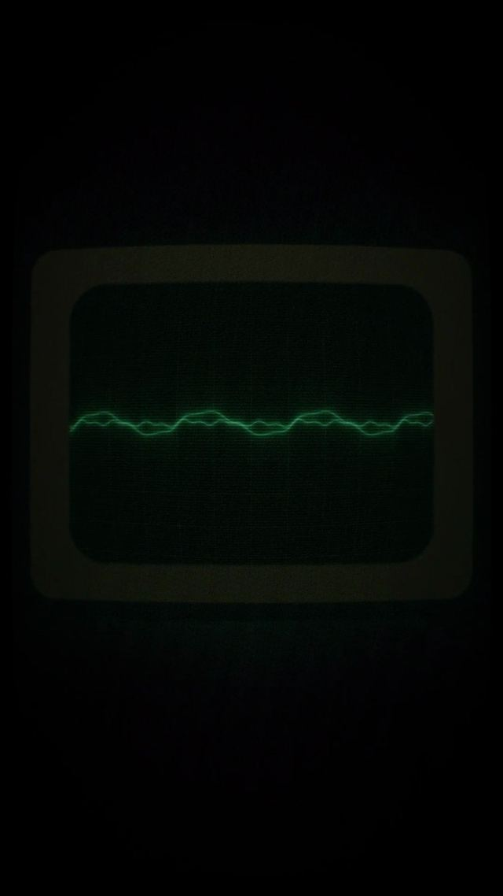</a></td>
<td width="50%" height="225" align="center" valign="middle"></td>
</tr>
<tr>
<td width="50%" valign="top"><strong>十三分钟乐队歌曲影像</strong> <a href="https://x.com/cube__lol">@cube__lol</a> · 音乐与歌词 13:53 · 收藏 4 · 资料待完善 <a href="https://guanmo-ai.github.io/awesome-ai-motion/#case-2102879729594343605">▶ 播放</a> · <a href="https://x.com/cube__lol/status/2102879729594343605">原帖</a></td>
<td width="50%" valign="top"><strong>着色器绘制的歌曲影像</strong> <a href="https://x.com/xlcomplete">@xlcomplete</a> · 音乐与歌词 4:51 · 收藏 3 · 资料待完善 <a href="https://guanmo-ai.github.io/awesome-ai-motion/#case-2103015953877647820">▶ 播放</a> · <a href="https://x.com/xlcomplete/status/2103015953877647820">原帖</a></td>
</tr>
</tbody>
<tbody>
<tr>
<td width="50%" height="225" align="center" valign="middle"></td>
<td width="50%" height="225" align="center" valign="middle"></td>
</tr>
<tr>
<td width="50%" valign="top"><strong>Astra Blue：唱出每日 AI 新闻</strong> <a href="https://x.com/mdaman010">@mdaman010</a> · 音乐与歌词 4:11 · 收藏 2 · 资料待完善 <a href="https://guanmo-ai.github.io/awesome-ai-motion/#case-2107186892047597821">▶ 播放</a> · <a href="https://x.com/mdaman010/status/2107186892047597821">原帖</a></td>
<td width="50%" valign="top"><strong>角色穿越时代的歌曲短片</strong> <a href="https://x.com/Aadidev0">@Aadidev0</a> · 音乐与歌词 2:44 · 收藏 2 · 资料待完善 <a href="https://guanmo-ai.github.io/awesome-ai-motion/#case-2102692569792835994">▶ 播放</a> · <a href="https://x.com/Aadidev0/status/2102692569792835994">原帖</a></td>
</tr>
</tbody>
<tbody>
<tr>
<td width="50%" height="225" align="center" valign="middle"><a href="https://guanmo-ai.github.io/awesome-ai-motion/#case-2102787420399825023">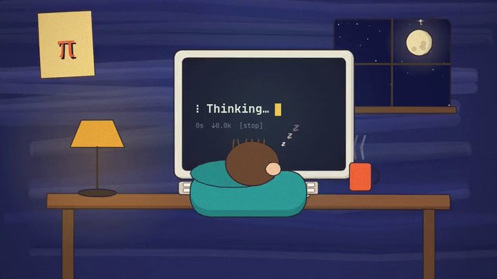</a></td>
<td width="50%" height="225" align="center" valign="middle"></td>
</tr>
<tr>
<td width="50%" valign="top"><strong>程序化音乐与动画短片</strong> <a href="https://x.com/NoFollowers2023">@NoFollowers2023</a> · 音乐与歌词 2:41 · 收藏 2 · 资料待完善 <a href="https://guanmo-ai.github.io/awesome-ai-motion/#case-2102787420399825023">▶ 播放</a> · <a href="https://x.com/NoFollowers2023/status/2102787420399825023">原帖</a></td>
<td width="50%" valign="top"><strong>铁磁流体与原创音乐</strong> <a href="https://x.com/gogu_name">@gogu_name</a> · 音乐与歌词 0:16 · 收藏 2 · 资料待完善 <a href="https://guanmo-ai.github.io/awesome-ai-motion/#case-2104736947822645622">▶ 播放</a> · <a href="https://x.com/gogu_name/status/2104736947822645622">原帖</a></td>
</tr>
</tbody>
<tbody>
<tr>
<td width="50%" height="225" align="center" valign="middle"></td>
<td width="50%" height="225" align="center" valign="middle"><a href="https://guanmo-ai.github.io/awesome-ai-motion/#case-2105282502726484258">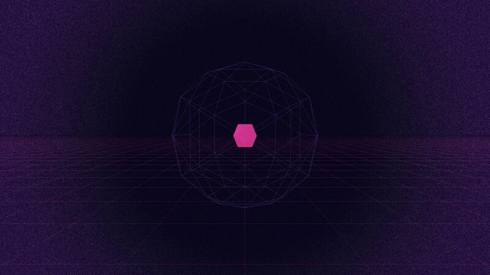</a></td>
</tr>
<tr>
<td width="50%" valign="top"><strong>钢琴机械装置的音画同步</strong> <a href="https://x.com/dilemma017">@dilemma017</a> · 音乐与歌词 0:09 · 收藏 2 · 资料待完善 <a href="https://guanmo-ai.github.io/awesome-ai-motion/#case-2106874360678023377">▶ 播放</a> · <a href="https://x.com/dilemma017/status/2106874360678023377">原帖</a></td>
<td width="50%" valign="top"><strong>GenMotion 制作的 P(doom) 音乐视频</strong> <a href="https://x.com/haxzie_">@haxzie_</a> · 音乐与歌词 2:37 · 收藏 1 · 资料待完善 <a href="https://guanmo-ai.github.io/awesome-ai-motion/#case-2105282502726484258">▶ 播放</a> · <a href="https://x.com/haxzie_/status/2105282502726484258">原帖</a></td>
</tr>
</tbody>
<tbody>
<tr>
<td width="50%" height="225" align="center" valign="middle"><a href="https://guanmo-ai.github.io/awesome-ai-motion/#case-2104145227573248467">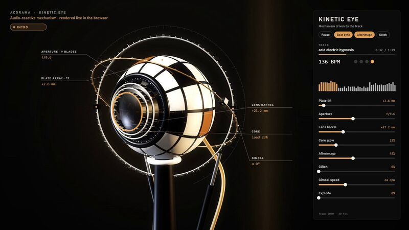</a></td>
<td width="50%" height="225" align="center" valign="middle"></td>
</tr>
<tr>
<td width="50%" valign="top"><strong>会听音乐的机械魔眼</strong> <a href="https://x.com/Acoramaa">@Acoramaa</a> · 音乐与歌词 0:28 · 收藏 1 · 资料待完善 <a href="https://guanmo-ai.github.io/awesome-ai-motion/#case-2104145227573248467">▶ 播放</a> · <a href="https://x.com/Acoramaa/status/2104145227573248467">原帖</a></td>
<td width="50%" valign="top"><strong>EUDoom：欧洲版 P(doom) 音乐动画</strong> <a href="https://x.com/JSalmisaari">@JSalmisaari</a> · 音乐与歌词 2:37 · 收藏 1 · 资料待完善 <a href="https://guanmo-ai.github.io/awesome-ai-motion/#case-2105926129567879524">▶ 播放</a> · <a href="https://x.com/JSalmisaari/status/2105926129567879524">原帖</a></td>
</tr>
</tbody>
<tbody>
<tr>
<td width="50%" height="225" align="center" valign="middle"><a href="https://guanmo-ai.github.io/awesome-ai-motion/#case-2105304203770118434">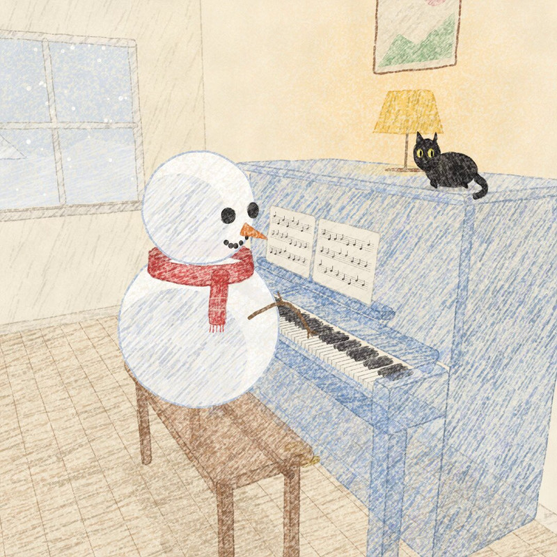</a></td>
<td width="50%" height="225" align="center" valign="middle"><a href="https://guanmo-ai.github.io/awesome-ai-motion/#case-2106836531734581448">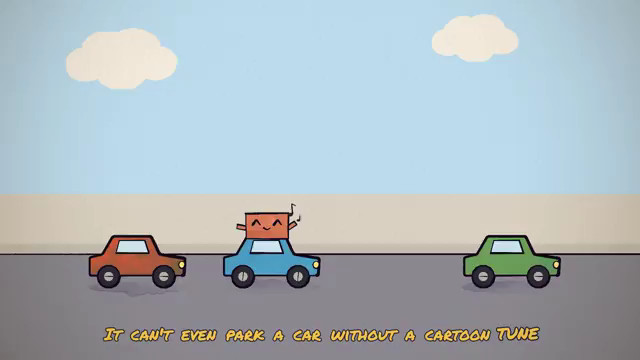</a></td>
</tr>
<tr>
<td width="50%" valign="top"><strong>送别：雪人与黑猫的钢琴动画</strong> <a href="https://x.com/JohnnyWang8802">@JohnnyWang8802</a> · 音乐与歌词 1:13 · 收藏 1 · 资料待完善 <a href="https://guanmo-ai.github.io/awesome-ai-motion/#case-2105304203770118434">▶ 播放</a> · <a href="https://x.com/JohnnyWang8802/status/2105304203770118434">原帖</a></td>
<td width="50%" valign="top"><strong>Skill Issue：AI 乐观与担忧的歌曲</strong> <a href="https://x.com/ZackSample">@ZackSample</a> · 音乐与歌词 3:34 · 收藏 1 · 资料待完善 <a href="https://guanmo-ai.github.io/awesome-ai-motion/#case-2106836531734581448">▶ 播放</a> · <a href="https://x.com/ZackSample/status/2106836531734581448">原帖</a></td>
</tr>
</tbody>
<tbody>
<tr>
<td width="50%" height="225" align="center" valign="middle"><a href="https://guanmo-ai.github.io/awesome-ai-motion/#case-2102861462461124755">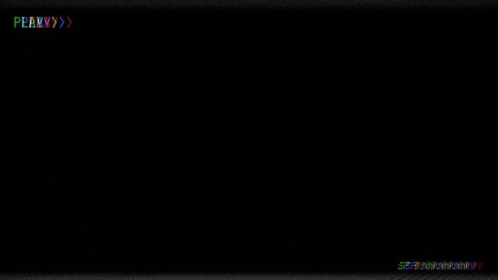</a></td>
<td width="50%" height="225" align="center" valign="middle"><a href="https://guanmo-ai.github.io/awesome-ai-motion/#case-2107478488760385762">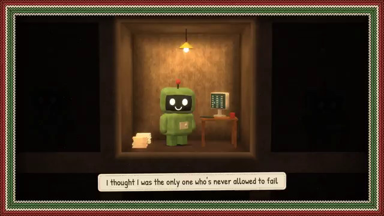</a></td>
</tr>
<tr>
<td width="50%" valign="top"><strong>歌曲与视频模型联动短片</strong> <a href="https://x.com/jantijssen">@jantijssen</a> · 音乐与歌词 3:28 · 收藏 1 · 资料待完善 <a href="https://guanmo-ai.github.io/awesome-ai-motion/#case-2102861462461124755">▶ 播放</a> · <a href="https://x.com/jantijssen/status/2102861462461124755">原帖</a></td>
<td width="50%" valign="top"><strong>代码构成的机器人歌曲 MV</strong> <a href="https://x.com/jpshrodinger">@jpshrodinger</a> · 音乐与歌词 2:50 · 收藏 0 · 资料待完善 <a href="https://guanmo-ai.github.io/awesome-ai-motion/#case-2107478488760385762">▶ 播放</a> · <a href="https://x.com/jpshrodinger/status/2107478488760385762">原帖</a></td>
</tr>
</tbody>
<tbody>
<tr>
<td width="50%" height="225" align="center" valign="middle"></td>
<td width="50%" height="225" align="center" valign="middle"><a href="https://guanmo-ai.github.io/awesome-ai-motion/#case-2104144532644544921">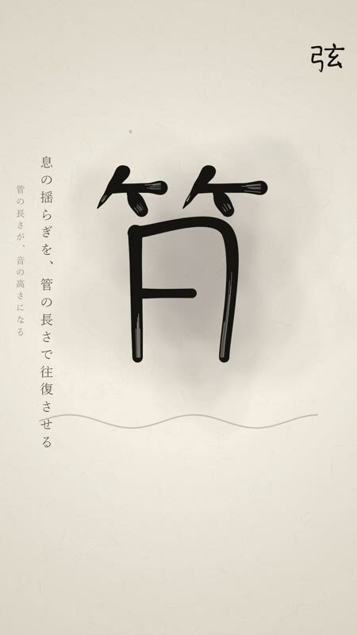</a></td>
</tr>
<tr>
<td width="50%" valign="top"><strong>Slip Out of the Frame：纸戏爵士版</strong> <a href="https://x.com/6_KAKUU">@6_KAKUU</a> · 音乐与歌词 1:07 · 收藏 0 · 资料待完善 <a href="https://guanmo-ai.github.io/awesome-ai-motion/#case-2105590078638792932">▶ 播放</a> · <a href="https://x.com/6_KAKUU/status/2105590078638792932">原帖</a></td>
<td width="50%" valign="top"><strong>弦、笛与水泡：代码物理合成音效</strong> <a href="https://x.com/Rakhsh_Tech">@Rakhsh_Tech</a> · 音乐与歌词 0:26 · 收藏 0 · 资料待完善 <a href="https://guanmo-ai.github.io/awesome-ai-motion/#case-2104144532644544921">▶ 播放</a> · <a href="https://x.com/Rakhsh_Tech/status/2104144532644544921">原帖</a></td>
</tr>
</tbody>
<tbody>
<tr>
<td width="50%" height="225" align="center" valign="middle"><a href="https://guanmo-ai.github.io/awesome-ai-motion/#case-2106883204762185728">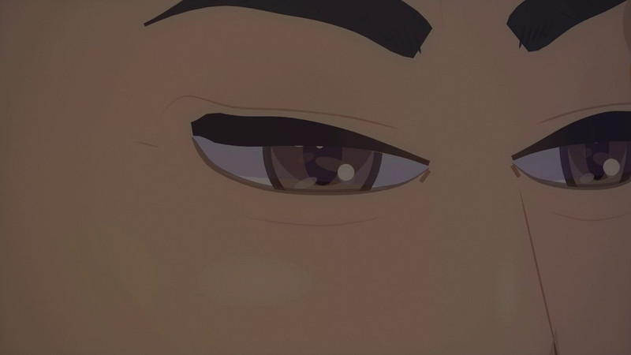</a></td>
<td width="50%" height="225" align="center" valign="middle"></td>
</tr>
<tr>
<td width="50%" valign="top"><strong>Word Is Bond：威尼斯商人音乐改编</strong> <a href="https://x.com/DFakkeldy">@DFakkeldy</a> · 音乐与歌词 6:30 · 收藏 0 · 资料待完善 <a href="https://guanmo-ai.github.io/awesome-ai-motion/#case-2106883204762185728">▶ 播放</a> · <a href="https://x.com/DFakkeldy/status/2106883204762185728">原帖</a></td>
<td width="50%" valign="top"><strong>孩子的涂鸦变成音乐影像</strong> <a href="https://x.com/coolbat1999">@coolbat1999</a> · 音乐与歌词 3:47 · 收藏 0 · 资料待完善 <a href="https://guanmo-ai.github.io/awesome-ai-motion/#case-2103127192591065595">▶ 播放</a> · <a href="https://x.com/coolbat1999/status/2103127192591065595">原帖</a></td>
</tr>
</tbody>
<tbody>
<tr>
<td width="50%" height="225" align="center" valign="middle"></td>
<td width="50%" height="225" align="center" valign="middle"></td>
</tr>
<tr>
<td width="50%" valign="top"><strong>Ctrl ALT Goodbye：多模型协作 MV</strong> <a href="https://x.com/NISSANNS2">@NISSANNS2</a> · 音乐与歌词 3:28 · 收藏 0 · 资料待完善 <a href="https://guanmo-ai.github.io/awesome-ai-motion/#case-2105354745988927980">▶ 播放</a> · <a href="https://x.com/NISSANNS2/status/2105354745988927980">原帖</a></td>
<td width="50%" valign="top"><strong>Last Call Magic：像素角色音乐 MV</strong> <a href="https://x.com/duramirmagus">@duramirmagus</a> · 音乐与歌词 4:20 · 收藏 0 · 资料待完善 <a href="https://guanmo-ai.github.io/awesome-ai-motion/#case-2106472635391529002">▶ 播放</a> · <a href="https://x.com/duramirmagus/status/2106472635391529002">原帖</a></td>
</tr>
</tbody>
<tbody>
<tr>
<td width="50%" height="225" align="center" valign="middle"></td>
<td width="50%" height="225" align="center" valign="middle"><a href="https://guanmo-ai.github.io/awesome-ai-motion/#case-2107494910731698494">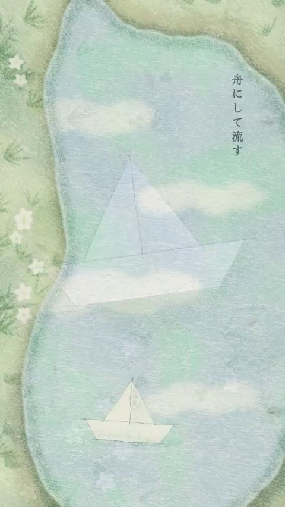</a></td>
</tr>
<tr>
<td width="50%" valign="top"><strong>动画乐队的音乐片段</strong> <a href="https://x.com/Kyle_Coghlan">@Kyle_Coghlan</a> · 音乐与歌词 0:22 · 收藏 0 · 资料待完善 <a href="https://guanmo-ai.github.io/awesome-ai-motion/#case-2106877108693913741">▶ 播放</a> · <a href="https://x.com/Kyle_Coghlan/status/2106877108693913741">原帖</a></td>
<td width="50%" valign="top"><strong>Reverie：代码动画音乐 MV</strong> <a href="https://x.com/hikarinosunmin">@hikarinosunmin</a> · 音乐与歌词 3:03 · 收藏 0 · 资料待完善 <a href="https://guanmo-ai.github.io/awesome-ai-motion/#case-2107494910731698494">▶ 播放</a> · <a href="https://x.com/hikarinosunmin/status/2107494910731698494">原帖</a></td>
</tr>
</tbody>
<tbody>
<tr>
<td width="50%" height="225" align="center" valign="middle"></td>
<td width="50%" height="225" align="center" valign="middle"><a href="https://guanmo-ai.github.io/awesome-ai-motion/#case-2106041581119971749">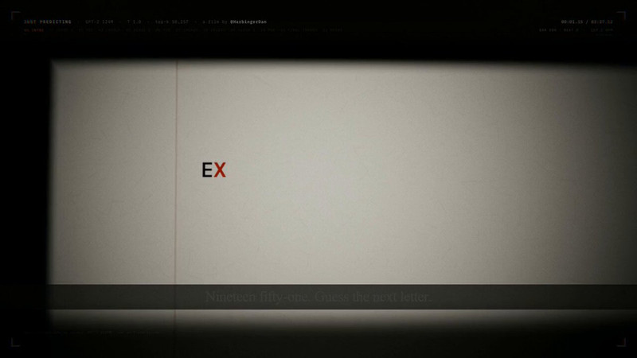</a></td>
</tr>
<tr>
<td width="50%" valign="top"><strong>像素都市中的音乐视频</strong> <a href="https://x.com/91_elon">@91_elon</a> · 音乐与歌词 0:16 · 收藏 0 · 资料待完善 <a href="https://guanmo-ai.github.io/awesome-ai-motion/#case-2106039413645996348">▶ 播放</a> · <a href="https://x.com/91_elon/status/2106039413645996348">原帖</a></td>
<td width="50%" valign="top"><strong>Just Predicting：模型辅助音乐视频</strong> <a href="https://x.com/HarbingerDan">@HarbingerDan</a> · 音乐与歌词 3:46 · 收藏 0 · 资料待完善 <a href="https://guanmo-ai.github.io/awesome-ai-motion/#case-2106041581119971749">▶ 播放</a> · <a href="https://x.com/HarbingerDan/status/2106041581119971749">原帖</a></td>
</tr>
</tbody>
</table>
