[← All categories](../README.en.md#browse)

# Product & marketing

168 works. Click a cover to play; works without gallery video open on X.

<table>
<tbody>
<tr>
<td width="50%" height="225" align="center" valign="middle"></td>
<td width="50%" height="225" align="center" valign="middle"></td>
</tr>
<tr>
<td width="50%" valign="top"><strong>A character-led Pocketsflow product explainer</strong> <a href="https://x.com/achxvi">@achxvi</a> · Product &amp; marketing 0:15 · Bookmarks 2,005 <a href="https://guanmo-ai.github.io/awesome-ai-motion/?lang=en#case-2103918792845963545">▶ Play</a> · <a href="https://x.com/achxvi/status/2103918792845963545">Original post</a></td>
<td width="50%" valign="top"><strong>A one-line prompt for an inference startup launch</strong> <a href="https://x.com/deedydas">@deedydas</a> · Product &amp; marketing 0:26 · Bookmarks 4,697 <a href="https://guanmo-ai.github.io/awesome-ai-motion/?lang=en#case-2102787937482252537">▶ Play</a> · <a href="https://x.com/deedydas/status/2102787937482252537">Original post</a></td>
</tr>
</tbody>
<tbody>
<tr>
<td width="50%" height="225" align="center" valign="middle"><a href="https://guanmo-ai.github.io/awesome-ai-motion/?lang=en#case-2103835273813496100">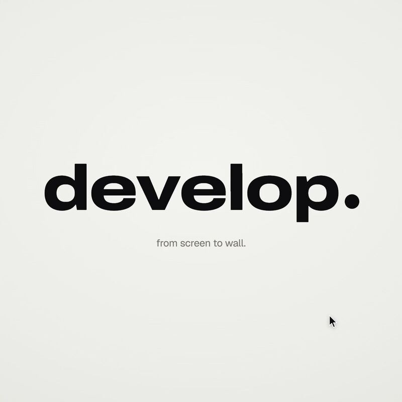</a></td>
<td width="50%" height="225" align="center" valign="middle"></td>
</tr>
<tr>
<td width="50%" valign="top"><strong>A continuous launch film with shape morphs and liquid glass</strong> <a href="https://x.com/twoclipping">@twoclipping</a> · Product &amp; marketing 0:29 · Bookmarks 3,745 <a href="https://guanmo-ai.github.io/awesome-ai-motion/?lang=en#case-2103835273813496100">▶ Play</a> · <a href="https://x.com/twoclipping/status/2103835273813496100">Original post</a></td>
<td width="50%" valign="top"><strong>Beat-Synced Product Motion Ad</strong> <a href="https://x.com/twoclipping">@twoclipping</a> · Product &amp; marketing 0:20 · Bookmarks 1,422 · Details pending <a href="https://guanmo-ai.github.io/awesome-ai-motion/?lang=en#case-2102554209166000267">▶ Play</a> · <a href="https://x.com/twoclipping/status/2102554209166000267">Original post</a></td>
</tr>
</tbody>
<tbody>
<tr>
<td width="50%" height="225" align="center" valign="middle"></td>
<td width="50%" height="225" align="center" valign="middle"></td>
</tr>
<tr>
<td width="50%" valign="top"><strong>Explain a business in five scenes</strong> <a href="https://x.com/alex_prompter">@alex_prompter</a> · Product &amp; marketing 0:35 · Bookmarks 659 <a href="https://guanmo-ai.github.io/awesome-ai-motion/?lang=en#case-2103499977632997524">▶ Play</a> · <a href="https://x.com/alex_prompter/status/2103499977632997524">Original post</a></td>
<td width="50%" valign="top"><strong>Automated Talking-Head Edit</strong> <a href="https://x.com/sab8a">@sab8a</a> · Product &amp; marketing 0:37 · Bookmarks 581 · Details pending <a href="https://guanmo-ai.github.io/awesome-ai-motion/?lang=en#case-2103144778481475686">▶ Play</a> · <a href="https://x.com/sab8a/status/2103144778481475686">Original post</a></td>
</tr>
</tbody>
<tbody>
<tr>
<td width="50%" height="225" align="center" valign="middle"></td>
<td width="50%" height="225" align="center" valign="middle"></td>
</tr>
<tr>
<td width="50%" valign="top"><strong>Punchy Promo for a Writing Tool</strong> <a href="https://x.com/shribuilds">@shribuilds</a> · Product &amp; marketing 0:41 · Bookmarks 383 · Details pending <a href="https://guanmo-ai.github.io/awesome-ai-motion/?lang=en#case-2102827288190689364">▶ Play</a> · <a href="https://x.com/shribuilds/status/2102827288190689364">Original post</a></td>
<td width="50%" valign="top"><strong>Inbox Zero: a code-based product-video workflow</strong> <a href="https://x.com/elie2222">@elie2222</a> · Product &amp; marketing 0:58 · Bookmarks 371 · Details pending <a href="https://guanmo-ai.github.io/awesome-ai-motion/?lang=en#case-2107186094777434454">▶ Play</a> · <a href="https://x.com/elie2222/status/2107186094777434454">Original post</a></td>
</tr>
</tbody>
<tbody>
<tr>
<td width="50%" height="225" align="center" valign="middle"></td>
<td width="50%" height="225" align="center" valign="middle"><a href="https://guanmo-ai.github.io/awesome-ai-motion/?lang=en#case-2103800569584562538">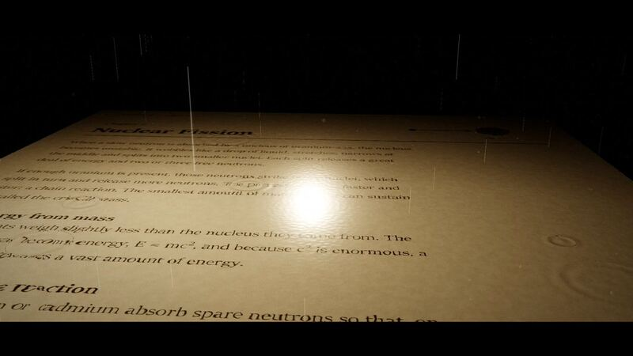</a></td>
</tr>
<tr>
<td width="50%" valign="top"><strong>MakerMap: a continuous product journey</strong> <a href="https://x.com/verbove">@verbove</a> · Product &amp; marketing 0:20 · Bookmarks 334 <a href="https://guanmo-ai.github.io/awesome-ai-motion/?lang=en#case-2103483957266268381">▶ Play</a> · <a href="https://x.com/verbove/status/2103483957266268381">Original post</a></td>
<td width="50%" valign="top"><strong>Distilbook: score inspiration and a composition prompt</strong> <a href="https://x.com/ajith_io">@ajith_io</a> · Product &amp; marketing 0:40 · Bookmarks 57 <a href="https://guanmo-ai.github.io/awesome-ai-motion/?lang=en#case-2103800569584562538">▶ Play</a> · <a href="https://x.com/ajith_io/status/2103800569584562538">Original post</a></td>
</tr>
</tbody>
<tbody>
<tr>
<td width="50%" height="225" align="center" valign="middle"><a href="https://guanmo-ai.github.io/awesome-ai-motion/?lang=en#case-2106640261623537875">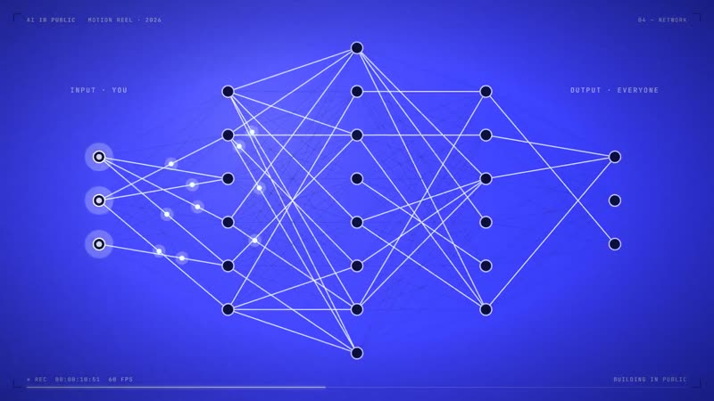</a></td>
<td width="50%" height="225" align="center" valign="middle"></td>
</tr>
<tr>
<td width="50%" valign="top"><strong>AI In Public: visuals and sound written in code</strong> <a href="https://x.com/humzaakhalid">@humzaakhalid</a> · Product &amp; marketing 0:24 · Bookmarks 56 <a href="https://guanmo-ai.github.io/awesome-ai-motion/?lang=en#case-2106640261623537875">▶ Play</a> · <a href="https://x.com/humzaakhalid/status/2106640261623537875">Original post</a></td>
<td width="50%" valign="top"><strong>A 30-second product motion brief</strong> <a href="https://x.com/sudo_kiran">@sudo_kiran</a> · Product &amp; marketing 0:30 · Bookmarks 11 <a href="https://guanmo-ai.github.io/awesome-ai-motion/?lang=en#case-2103761658745335993">▶ Play</a> · <a href="https://x.com/sudo_kiran/status/2103761658745335993">Original post</a></td>
</tr>
</tbody>
<tbody>
<tr>
<td width="50%" height="225" align="center" valign="middle"><a href="https://guanmo-ai.github.io/awesome-ai-motion/?lang=en#case-2104336637752955094">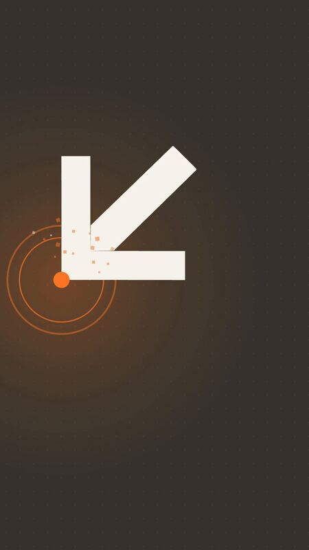</a></td>
<td width="50%" height="225" align="center" valign="middle"></td>
</tr>
<tr>
<td width="50%" valign="top"><strong>Onde Fica: real app footage and a mixed-tool reel</strong> <a href="https://x.com/jesscaroline7">@jesscaroline7</a> · Product &amp; marketing 1:00 · Bookmarks 8 <a href="https://guanmo-ai.github.io/awesome-ai-motion/?lang=en#case-2104336637752955094">▶ Play</a> · <a href="https://x.com/jesscaroline7/status/2104336637752955094">Original post</a></td>
<td width="50%" valign="top"><strong>Ad for a UI Components Product</strong> <a href="https://x.com/deweytn">@deweytn</a> · Product &amp; marketing 0:26 · Bookmarks 4 · Details pending <a href="https://guanmo-ai.github.io/awesome-ai-motion/?lang=en#case-2102787822855893072">▶ Play</a> · <a href="https://x.com/deweytn/status/2102787822855893072">Original post</a></td>
</tr>
</tbody>
<tbody>
<tr>
<td width="50%" height="225" align="center" valign="middle"></td>
<td width="50%" height="225" align="center" valign="middle"><a href="https://guanmo-ai.github.io/awesome-ai-motion/?lang=en#case-2108326197516198346">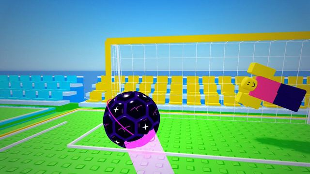</a></td>
</tr>
<tr>
<td width="50%" valign="top"><strong>Hoplite feature launch animation</strong> <a href="https://x.com/ryan_morr">@ryan_morr</a> · Product &amp; marketing 0:32 · Bookmarks 2 · Details pending <a href="https://guanmo-ai.github.io/awesome-ai-motion/?lang=en#case-2104249941136666741">▶ Play</a> · <a href="https://x.com/ryan_morr/status/2104249941136666741">Original post</a></td>
<td width="50%" valign="top"><strong>A One-line Trailer Test for a Roblox Game</strong> <a href="https://x.com/Aryanpxcr7">@Aryanpxcr7</a> · Product &amp; marketing 0:41 · Bookmarks 1 · Details pending <a href="https://guanmo-ai.github.io/awesome-ai-motion/?lang=en#case-2108326197516198346">▶ Play</a> · <a href="https://x.com/Aryanpxcr7/status/2108326197516198346">Original post</a></td>
</tr>
</tbody>
<tbody>
<tr>
<td width="50%" height="225" align="center" valign="middle"><a href="https://guanmo-ai.github.io/awesome-ai-motion/?lang=en#case-2105567585680941521">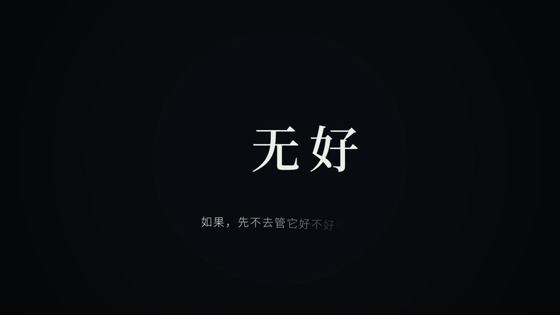</a></td>
<td width="50%" height="225" align="center" valign="middle"><a href="https://guanmo-ai.github.io/awesome-ai-motion/?lang=en#case-2106057217040368042">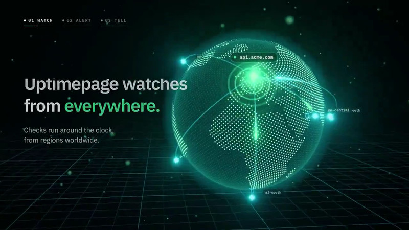</a></td>
</tr>
<tr>
<td width="50%" valign="top"><strong>A one-minute concept promo for a podcast</strong> <a href="https://x.com/wuhao1031">@wuhao1031</a> · Product &amp; marketing 1:00 · Bookmarks 0 · Details pending <a href="https://guanmo-ai.github.io/awesome-ai-motion/?lang=en#case-2105567585680941521">▶ Play</a> · <a href="https://x.com/wuhao1031/status/2105567585680941521">Original post</a></td>
<td width="50%" valign="top"><strong>Uptimepage: a 30-second Three.js promo</strong> <a href="https://x.com/kevindatas">@kevindatas</a> · Product &amp; marketing 0:30 · Bookmarks 0 · Details pending <a href="https://guanmo-ai.github.io/awesome-ai-motion/?lang=en#case-2106057217040368042">▶ Play</a> · <a href="https://x.com/kevindatas/status/2106057217040368042">Original post</a></td>
</tr>
</tbody>
<tbody>
<tr>
<td width="50%" height="225" align="center" valign="middle"></td>
<td width="50%" height="225" align="center" valign="middle"></td>
</tr>
<tr>
<td width="50%" valign="top"><strong>A Glaido Product Demo with a Jingle</strong> <a href="https://x.com/AIJackRoberts">@AIJackRoberts</a> · Product &amp; marketing 0:26 · Bookmarks 0 · Details pending <a href="https://guanmo-ai.github.io/awesome-ai-motion/?lang=en#case-2107869205588848985">▶ Play</a> · <a href="https://x.com/AIJackRoberts/status/2107869205588848985">Original post</a></td>
<td width="50%" valign="top"><strong>An analytics product made from real web assets</strong> <a href="https://x.com/zigapoto">@zigapoto</a> · Product &amp; marketing 1:00 · Bookmarks 0 <a href="https://guanmo-ai.github.io/awesome-ai-motion/?lang=en#case-2103746671591256286">▶ Play</a> · <a href="https://x.com/zigapoto/status/2103746671591256286">Original post</a></td>
</tr>
</tbody>
<tbody>
<tr>
<td width="50%" height="225" align="center" valign="middle"></td>
<td width="50%" height="225" align="center" valign="middle"></td>
</tr>
<tr>
<td width="50%" valign="top"><strong>A promotional animation for deckuse</strong> <a href="https://x.com/feiflow">@feiflow</a> · Product &amp; marketing 1:05 · Bookmarks 0 <a href="https://guanmo-ai.github.io/awesome-ai-motion/?lang=en#case-2104039666093572362">▶ Play</a> · <a href="https://x.com/feiflow/status/2104039666093572362">Original post</a></td>
<td width="50%" valign="top"><strong>NextDoor: a second showreel experiment</strong> <a href="https://x.com/sankalpdomore">@sankalpdomore</a> · Product &amp; marketing 1:22 · Bookmarks 0 · Details pending <a href="https://guanmo-ai.github.io/awesome-ai-motion/?lang=en#case-2107498302388482100">▶ Play</a> · <a href="https://x.com/sankalpdomore/status/2107498302388482100">Original post</a></td>
</tr>
</tbody>
<tbody>
<tr>
<td width="50%" height="225" align="center" valign="middle"></td>
<td width="50%" height="225" align="center" valign="middle"></td>
</tr>
<tr>
<td width="50%" valign="top"><strong>Creative Promo from a Single Instruction</strong> <a href="https://x.com/nikomaster01">@nikomaster01</a> · Product &amp; marketing 0:47 · Bookmarks 0 · Details pending <a href="https://guanmo-ai.github.io/awesome-ai-motion/?lang=en#case-2104765209596612730">▶ Play</a> · <a href="https://x.com/nikomaster01/status/2104765209596612730">Original post</a></td>
<td width="50%" valign="top"><strong>A tile build revealing an advertisement</strong> <a href="https://x.com/tanabe_fragm">@tanabe_fragm</a> · Product &amp; marketing 0:30 · Bookmarks 0 · Details pending <a href="https://guanmo-ai.github.io/awesome-ai-motion/?lang=en#case-2107644501372322001">▶ Play</a> · <a href="https://x.com/tanabe_fragm/status/2107644501372322001">Original post</a></td>
</tr>
</tbody>
<tbody>
<tr>
<td width="50%" height="225" align="center" valign="middle"></td>
<td width="50%" height="225" align="center" valign="middle"></td>
</tr>
<tr>
<td width="50%" valign="top"><strong>Shotbase product launch animation</strong> <a href="https://x.com/Miguel07Code">@Miguel07Code</a> · Product &amp; marketing 0:58 · Bookmarks 1,683 · Details pending <a href="https://guanmo-ai.github.io/awesome-ai-motion/?lang=en#case-2102441708395041170">▶ Play</a> · <a href="https://x.com/Miguel07Code/status/2102441708395041170">Original post</a></td>
<td width="50%" valign="top"><strong>A Fully Coded Launch Film for a Fictional Calendar App</strong> <a href="https://x.com/LexnLin">@LexnLin</a> · Product &amp; marketing 0:33 · Bookmarks 1,240 · Details pending <a href="https://guanmo-ai.github.io/awesome-ai-motion/?lang=en#case-2104148233106723099">▶ Play</a> · <a href="https://x.com/LexnLin/status/2104148233106723099">Original post</a></td>
</tr>
</tbody>
<tbody>
<tr>
<td width="50%" height="225" align="center" valign="middle"></td>
<td width="50%" height="225" align="center" valign="middle"></td>
</tr>
<tr>
<td width="50%" valign="top"><strong>Personal website redesign trailer</strong> <a href="https://x.com/trq212">@trq212</a> · Product &amp; marketing 1:35 · Bookmarks 1,122 · Details pending <a href="https://guanmo-ai.github.io/awesome-ai-motion/?lang=en#case-2102477340920152162">▶ Play</a> · <a href="https://x.com/trq212/status/2102477340920152162">Original post</a></td>
<td width="50%" valign="top"><strong>Tutorial for Code-Drawn Product Ads</strong> <a href="https://x.com/Lucas_IA_">@Lucas_IA_</a> · Product &amp; marketing 1:12 · Bookmarks 1,119 · Details pending <a href="https://guanmo-ai.github.io/awesome-ai-motion/?lang=en#case-2103152093733253544">▶ Play</a> · <a href="https://x.com/Lucas_IA_/status/2103152093733253544">Original post</a></td>
</tr>
</tbody>
<tbody>
<tr>
<td width="50%" height="225" align="center" valign="middle"></td>
<td width="50%" height="225" align="center" valign="middle"></td>
</tr>
<tr>
<td width="50%" valign="top"><strong>Model-Built Launch Film</strong> <a href="https://x.com/athrix_codes">@athrix_codes</a> · Product &amp; marketing 0:53 · Bookmarks 951 · Details pending <a href="https://guanmo-ai.github.io/awesome-ai-motion/?lang=en#case-2096209514248958161">▶ Play</a> · <a href="https://x.com/athrix_codes/status/2096209514248958161">Original post</a></td>
<td width="50%" valign="top"><strong>Editable After Effects launch video</strong> <a href="https://x.com/seiiiiiiiiiiru">@seiiiiiiiiiiru</a> · Product &amp; marketing 0:30 · Bookmarks 597 · Details pending <a href="https://guanmo-ai.github.io/awesome-ai-motion/?lang=en#case-2102636308707287201">▶ Play</a> · <a href="https://x.com/seiiiiiiiiiiru/status/2102636308707287201">Original post</a></td>
</tr>
</tbody>
<tbody>
<tr>
<td width="50%" height="225" align="center" valign="middle"></td>
<td width="50%" height="225" align="center" valign="middle"></td>
</tr>
<tr>
<td width="50%" valign="top"><strong>Narration led After Effects ad</strong> <a href="https://x.com/seiiiiiiiiiiru">@seiiiiiiiiiiru</a> · Product &amp; marketing 0:29 · Bookmarks 588 · Details pending <a href="https://guanmo-ai.github.io/awesome-ai-motion/?lang=en#case-2103227982592831846">▶ Play</a> · <a href="https://x.com/seiiiiiiiiiiru/status/2103227982592831846">Original post</a></td>
<td width="50%" valign="top"><strong>Launch video from 13 speaking takes</strong> <a href="https://x.com/gregpr07">@gregpr07</a> · Product &amp; marketing 0:18 · Bookmarks 382 · Details pending <a href="https://guanmo-ai.github.io/awesome-ai-motion/?lang=en#case-2102984873351037161">▶ Play</a> · <a href="https://x.com/gregpr07/status/2102984873351037161">Original post</a></td>
</tr>
</tbody>
<tbody>
<tr>
<td width="50%" height="225" align="center" valign="middle"></td>
<td width="50%" height="225" align="center" valign="middle"></td>
</tr>
<tr>
<td width="50%" valign="top"><strong>Animated Mushroom Coffee Ad</strong> <a href="https://x.com/ladprofit">@ladprofit</a> · Product &amp; marketing 0:55 · Bookmarks 334 · Details pending <a href="https://guanmo-ai.github.io/awesome-ai-motion/?lang=en#case-2103148835270971419">▶ Play</a> · <a href="https://x.com/ladprofit/status/2103148835270971419">Original post</a></td>
<td width="50%" valign="top"><strong>Complete Promo for a Unified Chat App</strong> <a href="https://x.com/dhruvalgolakiya">@dhruvalgolakiya</a> · Product &amp; marketing 0:40 · Bookmarks 329 · Details pending <a href="https://guanmo-ai.github.io/awesome-ai-motion/?lang=en#case-2103037586663235713">▶ Play</a> · <a href="https://x.com/dhruvalgolakiya/status/2103037586663235713">Original post</a></td>
</tr>
</tbody>
<tbody>
<tr>
<td width="50%" height="225" align="center" valign="middle"></td>
<td width="50%" height="225" align="center" valign="middle"></td>
</tr>
<tr>
<td width="50%" valign="top"><strong>A PCB Enclosure and Printable Parts Promo</strong> <a href="https://x.com/VectorCrossProd">@VectorCrossProd</a> · Product &amp; marketing 0:10 · Bookmarks 271 · Details pending <a href="https://guanmo-ai.github.io/awesome-ai-motion/?lang=en#case-2104093497561436573">▶ Play</a> · <a href="https://x.com/VectorCrossProd/status/2104093497561436573">Original post</a></td>
<td width="50%" valign="top"><strong>Short Film from App Redesign Assets</strong> <a href="https://x.com/jackfriks">@jackfriks</a> · Product &amp; marketing 0:20 · Bookmarks 192 · Details pending <a href="https://guanmo-ai.github.io/awesome-ai-motion/?lang=en#case-2103132260589338762">▶ Play</a> · <a href="https://x.com/jackfriks/status/2103132260589338762">Original post</a></td>
</tr>
</tbody>
<tbody>
<tr>
<td width="50%" height="225" align="center" valign="middle"></td>
<td width="50%" height="225" align="center" valign="middle"></td>
</tr>
<tr>
<td width="50%" valign="top"><strong>Launch Animation of Claude Helping a Neighbourhood</strong> <a href="https://x.com/chetaslua">@chetaslua</a> · Product &amp; marketing 0:56 · Bookmarks 139 · Details pending <a href="https://guanmo-ai.github.io/awesome-ai-motion/?lang=en#case-2102370144546889735">▶ Play</a> · <a href="https://x.com/chetaslua/status/2102370144546889735">Original post</a></td>
<td width="50%" valign="top"><strong>A fashion poster with animated-character footage</strong> <a href="https://x.com/ponzponz15">@ponzponz15</a> · Product &amp; marketing 0:46 · Bookmarks 135 · Details pending <a href="https://guanmo-ai.github.io/awesome-ai-motion/?lang=en#case-2106266004515172366">▶ Play</a> · <a href="https://x.com/ponzponz15/status/2106266004515172366">Original post</a></td>
</tr>
</tbody>
<tbody>
<tr>
<td width="50%" height="225" align="center" valign="middle"></td>
<td width="50%" height="225" align="center" valign="middle"><a href="https://guanmo-ai.github.io/awesome-ai-motion/?lang=en#case-2105771088374288692">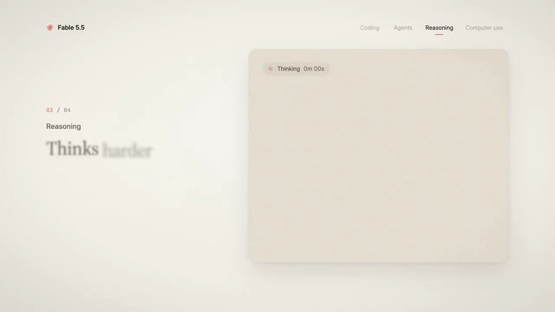</a></td>
</tr>
<tr>
<td width="50%" valign="top"><strong>Hoodie Merchandise Launch Motion</strong> <a href="https://x.com/bridgemindai">@bridgemindai</a> · Product &amp; marketing 0:30 · Bookmarks 127 · Details pending <a href="https://guanmo-ai.github.io/awesome-ai-motion/?lang=en#case-2102462889160286423">▶ Play</a> · <a href="https://x.com/bridgemindai/status/2102462889160286423">Original post</a></td>
<td width="50%" valign="top"><strong>A fictional model-launch video comparison</strong> <a href="https://x.com/mesmerlord">@mesmerlord</a> · Product &amp; marketing 1:20 · Bookmarks 122 · Details pending <a href="https://guanmo-ai.github.io/awesome-ai-motion/?lang=en#case-2105771088374288692">▶ Play</a> · <a href="https://x.com/mesmerlord/status/2105771088374288692">Original post</a></td>
</tr>
</tbody>
<tbody>
<tr>
<td width="50%" height="225" align="center" valign="middle"></td>
<td width="50%" height="225" align="center" valign="middle"></td>
</tr>
<tr>
<td width="50%" valign="top"><strong>Building a Roblox Game Trailer</strong> <a href="https://x.com/NiloTechInc">@NiloTechInc</a> · Product &amp; marketing 0:07 · Bookmarks 105 · Details pending <a href="https://guanmo-ai.github.io/awesome-ai-motion/?lang=en#case-2102741813719138661">▶ Play</a> · <a href="https://x.com/NiloTechInc/status/2102741813719138661">Original post</a></td>
<td width="50%" valign="top"><strong>Stream Launch Film: Original and Code Recreation</strong> <a href="https://x.com/JurgenPloeger">@JurgenPloeger</a> · Product &amp; marketing 0:48 · Bookmarks 97 · Details pending <a href="https://guanmo-ai.github.io/awesome-ai-motion/?lang=en#case-2104131805175844923">▶ Play</a> · <a href="https://x.com/JurgenPloeger/status/2104131805175844923">Original post</a></td>
</tr>
</tbody>
<tbody>
<tr>
<td width="50%" height="225" align="center" valign="middle"></td>
<td width="50%" height="225" align="center" valign="middle"></td>
</tr>
<tr>
<td width="50%" valign="top"><strong>Sixty-Second Siege Game Promo</strong> <a href="https://x.com/KanaWorks_AI">@KanaWorks_AI</a> · Product &amp; marketing 1:00 · Bookmarks 95 · Details pending <a href="https://guanmo-ai.github.io/awesome-ai-motion/?lang=en#case-2102684116525437206">▶ Play</a> · <a href="https://x.com/KanaWorks_AI/status/2102684116525437206">Original post</a></td>
<td width="50%" valign="top"><strong>From a Nine-panel Storyboard to a Beach Soda Ad</strong> <a href="https://x.com/wiliam_web3">@wiliam_web3</a> · Product &amp; marketing 0:15 · Bookmarks 80 · Details pending <a href="https://guanmo-ai.github.io/awesome-ai-motion/?lang=en#case-2108457382686941377">▶ Play</a> · <a href="https://x.com/wiliam_web3/status/2108457382686941377">Original post</a></td>
</tr>
</tbody>
<tbody>
<tr>
<td width="50%" height="225" align="center" valign="middle"></td>
<td width="50%" height="225" align="center" valign="middle"></td>
</tr>
<tr>
<td width="50%" valign="top"><strong>A GoodCase Weekly Product-update Short</strong> <a href="https://x.com/aiwarts">@aiwarts</a> · Product &amp; marketing 0:35 · Bookmarks 80 · Details pending <a href="https://guanmo-ai.github.io/awesome-ai-motion/?lang=en#case-2108208400106668282">▶ Play</a> · <a href="https://x.com/aiwarts/status/2108208400106668282">Original post</a></td>
<td width="50%" valign="top"><strong>A fictional shampoo comic commercial</strong> <a href="https://x.com/seiiiiiiiiiiru">@seiiiiiiiiiiru</a> · Product &amp; marketing 0:30 · Bookmarks 79 · Details pending <a href="https://guanmo-ai.github.io/awesome-ai-motion/?lang=en#case-2106310907899105704">▶ Play</a> · <a href="https://x.com/seiiiiiiiiiiru/status/2106310907899105704">Original post</a></td>
</tr>
</tbody>
<tbody>
<tr>
<td width="50%" height="225" align="center" valign="middle"><a href="https://guanmo-ai.github.io/awesome-ai-motion/?lang=en#case-2104610435571884086">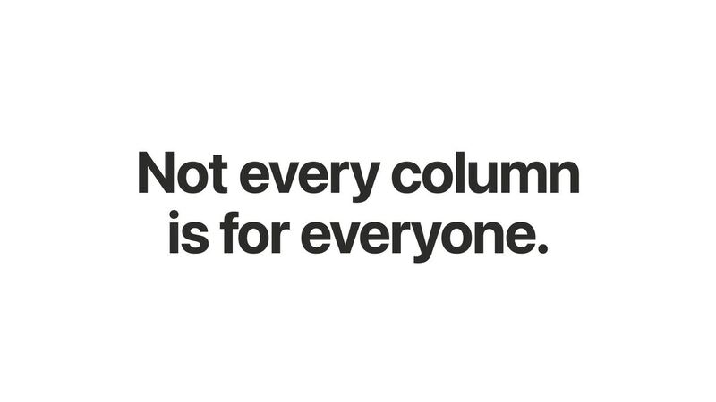</a></td>
<td width="50%" height="225" align="center" valign="middle"></td>
</tr>
<tr>
<td width="50%" valign="top"><strong>Notion column permissions: four directions to a final cut</strong> <a href="https://x.com/wustep">@wustep</a> · Product &amp; marketing 0:32 · Bookmarks 78 <a href="https://guanmo-ai.github.io/awesome-ai-motion/?lang=en#case-2104610435571884086">▶ Play</a> · <a href="https://x.com/wustep/status/2104610435571884086">Original post</a></td>
<td width="50%" valign="top"><strong>A clinic-visit memory app launch film</strong> <a href="https://x.com/seri_nonnon">@seri_nonnon</a> · Product &amp; marketing 0:43 · Bookmarks 56 <a href="https://guanmo-ai.github.io/awesome-ai-motion/?lang=en#case-2106192761632231813">▶ Play</a> · <a href="https://x.com/seri_nonnon/status/2106192761632231813">Original post</a></td>
</tr>
</tbody>
<tbody>
<tr>
<td width="50%" height="225" align="center" valign="middle"></td>
<td width="50%" height="225" align="center" valign="middle"></td>
</tr>
<tr>
<td width="50%" valign="top"><strong>Lip balm ad model comparison</strong> <a href="https://x.com/higgsfield_ai">@higgsfield_ai</a> · Product &amp; marketing 0:20 · Bookmarks 48 · Details pending <a href="https://guanmo-ai.github.io/awesome-ai-motion/?lang=en#case-2102913101926731879">▶ Play</a> · <a href="https://x.com/higgsfield_ai/status/2102913101926731879">Original post</a></td>
<td width="50%" valign="top"><strong>The Story of Yukon Research</strong> <a href="https://x.com/sreeramkannan">@sreeramkannan</a> · Product &amp; marketing 0:53 · Bookmarks 44 · Details pending <a href="https://guanmo-ai.github.io/awesome-ai-motion/?lang=en#case-2104027910004949132">▶ Play</a> · <a href="https://x.com/sreeramkannan/status/2104027910004949132">Original post</a></td>
</tr>
</tbody>
<tbody>
<tr>
<td width="50%" height="225" align="center" valign="middle"></td>
<td width="50%" height="225" align="center" valign="middle"><a href="https://guanmo-ai.github.io/awesome-ai-motion/?lang=en#case-2106323424473907257">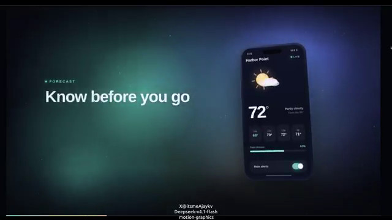</a></td>
</tr>
<tr>
<td width="50%" valign="top"><strong>A Software Ad with Gemini and Remotion</strong> <a href="https://x.com/WiFiMoneyGuy">@WiFiMoneyGuy</a> · Product &amp; marketing 0:29 · Bookmarks 44 · Details pending <a href="https://guanmo-ai.github.io/awesome-ai-motion/?lang=en#case-2103975338976182477">▶ Play</a> · <a href="https://x.com/WiFiMoneyGuy/status/2103975338976182477">Original post</a></td>
<td width="50%" valign="top"><strong>DeepSeek: a weather-app motion-graphics experiment</strong> <a href="https://x.com/ItsmeAjayKV">@ItsmeAjayKV</a> · Product &amp; marketing 0:25 · Bookmarks 43 · Details pending <a href="https://guanmo-ai.github.io/awesome-ai-motion/?lang=en#case-2106323424473907257">▶ Play</a> · <a href="https://x.com/ItsmeAjayKV/status/2106323424473907257">Original post</a></td>
</tr>
</tbody>
<tbody>
<tr>
<td width="50%" height="225" align="center" valign="middle"></td>
<td width="50%" height="225" align="center" valign="middle"><a href="https://guanmo-ai.github.io/awesome-ai-motion/?lang=en#case-2108384911245869197">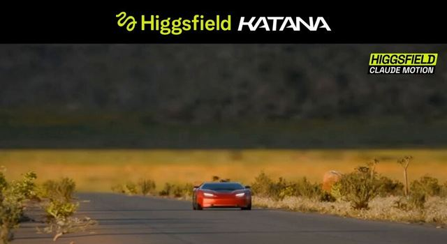</a></td>
</tr>
<tr>
<td width="50%" valign="top"><strong>QuanCard: a card-stack launch film</strong> <a href="https://x.com/luoleiorg">@luoleiorg</a> · Product &amp; marketing 0:42 · Bookmarks 39 · Details pending <a href="https://guanmo-ai.github.io/awesome-ai-motion/?lang=en#case-2107481547242873319">▶ Play</a> · <a href="https://x.com/luoleiorg/status/2107481547242873319">Original post</a></td>
<td width="50%" valign="top"><strong>A Three.js-coded Car Short</strong> <a href="https://x.com/higgsfield">@higgsfield</a> · Product &amp; marketing 0:30 · Bookmarks 37 · Details pending <a href="https://guanmo-ai.github.io/awesome-ai-motion/?lang=en#case-2108384911245869197">▶ Play</a> · <a href="https://x.com/higgsfield/status/2108384911245869197">Original post</a></td>
</tr>
</tbody>
<tbody>
<tr>
<td width="50%" height="225" align="center" valign="middle"></td>
<td width="50%" height="225" align="center" valign="middle"></td>
</tr>
<tr>
<td width="50%" valign="top"><strong>Futurepost extension motion reel</strong> <a href="https://x.com/allodev">@allodev</a> · Product &amp; marketing 0:25 · Bookmarks 33 <a href="https://guanmo-ai.github.io/awesome-ai-motion/?lang=en#case-2105414480910069765">▶ Play</a> · <a href="https://x.com/allodev/status/2105414480910069765">Original post</a></td>
<td width="50%" valign="top"><strong>A Vertical Product Film Using Blender Models</strong> <a href="https://x.com/yoshifujidesign">@yoshifujidesign</a> · Product &amp; marketing 0:30 · Bookmarks 33 · Details pending <a href="https://guanmo-ai.github.io/awesome-ai-motion/?lang=en#case-2103987596301119645">▶ Play</a> · <a href="https://x.com/yoshifujidesign/status/2103987596301119645">Original post</a></td>
</tr>
</tbody>
<tbody>
<tr>
<td width="50%" height="225" align="center" valign="middle"><a href="https://guanmo-ai.github.io/awesome-ai-motion/?lang=en#case-2105750054908891423">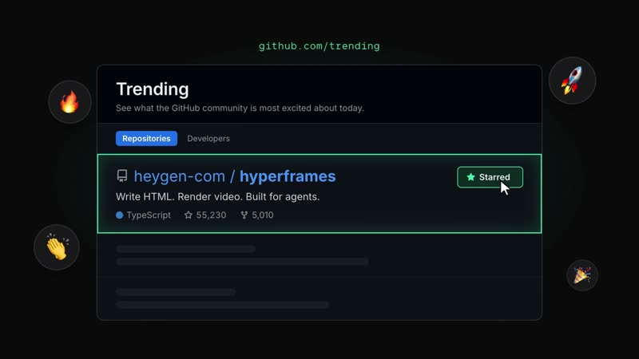</a></td>
<td width="50%" height="225" align="center" valign="middle"><a href="https://guanmo-ai.github.io/awesome-ai-motion/?lang=en#case-2107990570002252237">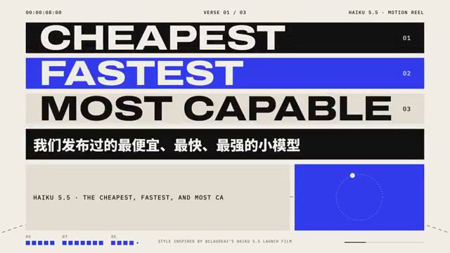</a></td>
</tr>
<tr>
<td width="50%" valign="top"><strong>A HyperFrames trending celebration film</strong> <a href="https://x.com/liu8in">@liu8in</a> · Product &amp; marketing 0:17 · Bookmarks 28 <a href="https://guanmo-ai.github.io/awesome-ai-motion/?lang=en#case-2105750054908891423">▶ Play</a> · <a href="https://x.com/liu8in/status/2105750054908891423">Original post</a></td>
<td width="50%" valign="top"><strong>A Haiku 5.5 Self-promotion Film</strong> <a href="https://x.com/LufzzLiz">@LufzzLiz</a> · Product &amp; marketing 0:30 · Bookmarks 27 · Details pending <a href="https://guanmo-ai.github.io/awesome-ai-motion/?lang=en#case-2107990570002252237">▶ Play</a> · <a href="https://x.com/LufzzLiz/status/2107990570002252237">Original post</a></td>
</tr>
</tbody>
<tbody>
<tr>
<td width="50%" height="225" align="center" valign="middle"></td>
<td width="50%" height="225" align="center" valign="middle"></td>
</tr>
<tr>
<td width="50%" valign="top"><strong>Rhythmic Edit of a Mobile App Capture</strong> <a href="https://x.com/reg_andr">@reg_andr</a> · Product &amp; marketing 0:54 · Bookmarks 26 · Details pending <a href="https://guanmo-ai.github.io/awesome-ai-motion/?lang=en#case-2103117698863390805">▶ Play</a> · <a href="https://x.com/reg_andr/status/2103117698863390805">Original post</a></td>
<td width="50%" valign="top"><strong>Browser Product Teaser Recut</strong> <a href="https://x.com/jake11moran">@jake11moran</a> · Product &amp; marketing 0:27 · Bookmarks 25 · Details pending <a href="https://guanmo-ai.github.io/awesome-ai-motion/?lang=en#case-2103237884564414633">▶ Play</a> · <a href="https://x.com/jake11moran/status/2103237884564414633">Original post</a></td>
</tr>
</tbody>
<tbody>
<tr>
<td width="50%" height="225" align="center" valign="middle"></td>
<td width="50%" height="225" align="center" valign="middle"></td>
</tr>
<tr>
<td width="50%" valign="top"><strong>Shillz: real UI and code-generated music</strong> <a href="https://x.com/colecornelll">@colecornelll</a> · Product &amp; marketing 0:15 · Bookmarks 24 <a href="https://guanmo-ai.github.io/awesome-ai-motion/?lang=en#case-2105751866051047465">▶ Play</a> · <a href="https://x.com/colecornelll/status/2105751866051047465">Original post</a></td>
<td width="50%" valign="top"><strong>A Code-Rendered Mac Launch Film</strong> <a href="https://x.com/charliejhills">@charliejhills</a> · Product &amp; marketing 0:20 · Bookmarks 21 · Details pending <a href="https://guanmo-ai.github.io/awesome-ai-motion/?lang=en#case-2104225890800705789">▶ Play</a> · <a href="https://x.com/charliejhills/status/2104225890800705789">Original post</a></td>
</tr>
</tbody>
<tbody>
<tr>
<td width="50%" height="225" align="center" valign="middle"></td>
<td width="50%" height="225" align="center" valign="middle"></td>
</tr>
<tr>
<td width="50%" valign="top"><strong>A Sonnet Concept Car Generated in Code</strong> <a href="https://x.com/techartist_">@techartist_</a> · Product &amp; marketing 0:18 · Bookmarks 18 · Details pending <a href="https://guanmo-ai.github.io/awesome-ai-motion/?lang=en#case-2104715277120180702">▶ Play</a> · <a href="https://x.com/techartist_/status/2104715277120180702">Original post</a></td>
<td width="50%" valign="top"><strong>Nine-Scene Product Launch Film</strong> <a href="https://x.com/ish_creative">@ish_creative</a> · Product &amp; marketing 0:30 · Bookmarks 18 · Details pending <a href="https://guanmo-ai.github.io/awesome-ai-motion/?lang=en#case-2102966807376334856">▶ Play</a> · <a href="https://x.com/ish_creative/status/2102966807376334856">Original post</a></td>
</tr>
</tbody>
<tbody>
<tr>
<td width="50%" height="225" align="center" valign="middle"></td>
<td width="50%" height="225" align="center" valign="middle"></td>
</tr>
<tr>
<td width="50%" valign="top"><strong>Animated Football Player Recommendations</strong> <a href="https://x.com/Luchigatica">@Luchigatica</a> · Product &amp; marketing 0:39 · Bookmarks 14 · Details pending <a href="https://guanmo-ai.github.io/awesome-ai-motion/?lang=en#case-2102853289259729328">▶ Play</a> · <a href="https://x.com/Luchigatica/status/2102853289259729328">Original post</a></td>
<td width="50%" valign="top"><strong>A HanaAgent 1.0 Promo Experiment</strong> <a href="https://x.com/lilililiMozi">@lilililiMozi</a> · Product &amp; marketing 0:58 · Bookmarks 14 · Details pending <a href="https://guanmo-ai.github.io/awesome-ai-motion/?lang=en#case-2108115329948037522">▶ Play</a> · <a href="https://x.com/lilililiMozi/status/2108115329948037522">Original post</a></td>
</tr>
</tbody>
<tbody>
<tr>
<td width="50%" height="225" align="center" valign="middle"></td>
<td width="50%" height="225" align="center" valign="middle"></td>
</tr>
<tr>
<td width="50%" valign="top"><strong>Tokyo Tower in a 3D Promo Sequence</strong> <a href="https://x.com/Maruo_0314">@Maruo_0314</a> · Product &amp; marketing 0:15 · Bookmarks 13 · Details pending <a href="https://guanmo-ai.github.io/awesome-ai-motion/?lang=en#case-2104159752095998343">▶ Play</a> · <a href="https://x.com/Maruo_0314/status/2104159752095998343">Original post</a></td>
<td width="50%" valign="top"><strong>Forty-Two-Second Help Service Launch Film</strong> <a href="https://x.com/azhar_builds">@azhar_builds</a> · Product &amp; marketing 0:42 · Bookmarks 9 · Details pending <a href="https://guanmo-ai.github.io/awesome-ai-motion/?lang=en#case-2103075805098070315">▶ Play</a> · <a href="https://x.com/azhar_builds/status/2103075805098070315">Original post</a></td>
</tr>
</tbody>
<tbody>
<tr>
<td width="50%" height="225" align="center" valign="middle"></td>
<td width="50%" height="225" align="center" valign="middle"></td>
</tr>
<tr>
<td width="50%" valign="top"><strong>Remotion promo for an open source project</strong> <a href="https://x.com/canghe">@canghe</a> · Product &amp; marketing 0:34 · Bookmarks 9 · Details pending <a href="https://guanmo-ai.github.io/awesome-ai-motion/?lang=en#case-2104225521869705468">▶ Play</a> · <a href="https://x.com/canghe/status/2104225521869705468">Original post</a></td>
<td width="50%" valign="top"><strong>Nafa: a Product Marketing Film from One Workflow</strong> <a href="https://x.com/SaadPastaDev">@SaadPastaDev</a> · Product &amp; marketing 0:25 · Bookmarks 6 · Details pending <a href="https://guanmo-ai.github.io/awesome-ai-motion/?lang=en#case-2107741413769347341">▶ Play</a> · <a href="https://x.com/SaadPastaDev/status/2107741413769347341">Original post</a></td>
</tr>
</tbody>
<tbody>
<tr>
<td width="50%" height="225" align="center" valign="middle"></td>
<td width="50%" height="225" align="center" valign="middle"><a href="https://guanmo-ai.github.io/awesome-ai-motion/?lang=en#case-2108379423808635005">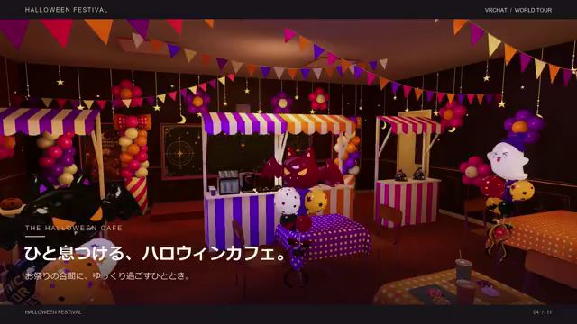</a></td>
</tr>
<tr>
<td width="50%" valign="top"><strong>own.page: a cinematic launch film</strong> <a href="https://x.com/ElitzaVasileva">@ElitzaVasileva</a> · Product &amp; marketing 0:45 · Bookmarks 6 · Details pending <a href="https://guanmo-ai.github.io/awesome-ai-motion/?lang=en#case-2107187734414582139">▶ Play</a> · <a href="https://x.com/ElitzaVasileva/status/2107187734414582139">Original post</a></td>
<td width="50%" valign="top"><strong>Halloween Festival: an Automatically Shot World Promo</strong> <a href="https://x.com/yuripi_2023">@yuripi_2023</a> · Product &amp; marketing 0:59 · Bookmarks 6 · Details pending <a href="https://guanmo-ai.github.io/awesome-ai-motion/?lang=en#case-2108379423808635005">▶ Play</a> · <a href="https://x.com/yuripi_2023/status/2108379423808635005">Original post</a></td>
</tr>
</tbody>
<tbody>
<tr>
<td width="50%" height="225" align="center" valign="middle"></td>
<td width="50%" height="225" align="center" valign="middle"></td>
</tr>
<tr>
<td width="50%" valign="top"><strong>Unofficial BLVCKOUT promo</strong> <a href="https://x.com/ystknsh">@ystknsh</a> · Product &amp; marketing 0:30 · Bookmarks 6 · Details pending <a href="https://guanmo-ai.github.io/awesome-ai-motion/?lang=en#case-2102766871007436993">▶ Play</a> · <a href="https://x.com/ystknsh/status/2102766871007436993">Original post</a></td>
<td width="50%" valign="top"><strong>Code Recreation of a Launch Film</strong> <a href="https://x.com/vikktorrrre">@vikktorrrre</a> · Product &amp; marketing 0:20 · Bookmarks 5 · Details pending <a href="https://guanmo-ai.github.io/awesome-ai-motion/?lang=en#case-2103104303808348305">▶ Play</a> · <a href="https://x.com/vikktorrrre/status/2103104303808348305">Original post</a></td>
</tr>
</tbody>
<tbody>
<tr>
<td width="50%" height="225" align="center" valign="middle"></td>
<td width="50%" height="225" align="center" valign="middle"></td>
</tr>
<tr>
<td width="50%" valign="top"><strong>Sorank Product Launch Motion</strong> <a href="https://x.com/thibaultbessonm">@thibaultbessonm</a> · Product &amp; marketing 1:14 · Bookmarks 5 · Details pending <a href="https://guanmo-ai.github.io/awesome-ai-motion/?lang=en#case-2105221575117324685">▶ Play</a> · <a href="https://x.com/thibaultbessonm/status/2105221575117324685">Original post</a></td>
<td width="50%" valign="top"><strong>An Anti-LinkedIn Launch Video</strong> <a href="https://x.com/MaxHirsch13">@MaxHirsch13</a> · Product &amp; marketing 0:20 · Bookmarks 4 · Details pending <a href="https://guanmo-ai.github.io/awesome-ai-motion/?lang=en#case-2107985883949600983">▶ Play</a> · <a href="https://x.com/MaxHirsch13/status/2107985883949600983">Original post</a></td>
</tr>
</tbody>
<tbody>
<tr>
<td width="50%" height="225" align="center" valign="middle"></td>
<td width="50%" height="225" align="center" valign="middle"></td>
</tr>
<tr>
<td width="50%" valign="top"><strong>YouWare Launch Video: Opus, Sol and Fable Compared</strong> <a href="https://x.com/yrzhe_top">@yrzhe_top</a> · Product &amp; marketing 0:40 · Bookmarks 4 · Details pending <a href="https://guanmo-ai.github.io/awesome-ai-motion/?lang=en#case-2102752585371226241">▶ Play</a> · <a href="https://x.com/yrzhe_top/status/2102752585371226241">Original post</a></td>
<td width="50%" valign="top"><strong>TopSlash product launch film</strong> <a href="https://x.com/EnvolDev">@EnvolDev</a> · Product &amp; marketing 0:57 · Bookmarks 4 <a href="https://guanmo-ai.github.io/awesome-ai-motion/?lang=en#case-2107547689819017555">▶ Play</a> · <a href="https://x.com/EnvolDev/status/2107547689819017555">Original post</a></td>
</tr>
</tbody>
<tbody>
<tr>
<td width="50%" height="225" align="center" valign="middle"></td>
<td width="50%" height="225" align="center" valign="middle"></td>
</tr>
<tr>
<td width="50%" valign="top"><strong>A Phone-led Promo for an Yingge Dance Game</strong> <a href="https://x.com/Gimi_min">@Gimi_min</a> · Product &amp; marketing 1:01 · Bookmarks 4 · Details pending <a href="https://guanmo-ai.github.io/awesome-ai-motion/?lang=en#case-2108477835463766340">▶ Play</a> · <a href="https://x.com/Gimi_min/status/2108477835463766340">Original post</a></td>
<td width="50%" valign="top"><strong>Model Launch Concept Film</strong> <a href="https://x.com/marcthecreatorr">@marcthecreatorr</a> · Product &amp; marketing 0:32 · Bookmarks 3 · Details pending <a href="https://guanmo-ai.github.io/awesome-ai-motion/?lang=en#case-2103133462798483752">▶ Play</a> · <a href="https://x.com/marcthecreatorr/status/2103133462798483752">Original post</a></td>
</tr>
</tbody>
<tbody>
<tr>
<td width="50%" height="225" align="center" valign="middle"><a href="https://guanmo-ai.github.io/awesome-ai-motion/?lang=en#case-2106414547569676331">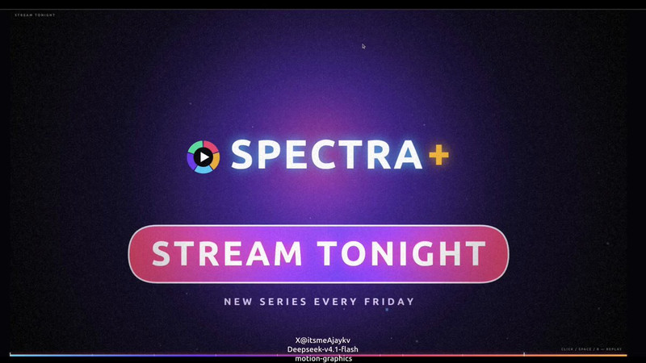</a></td>
<td width="50%" height="225" align="center" valign="middle"></td>
</tr>
<tr>
<td width="50%" valign="top"><strong>SPECTRA+: a DeepSeek motion experiment</strong> <a href="https://x.com/ItsmeAjayKV">@ItsmeAjayKV</a> · Product &amp; marketing 0:40 · Bookmarks 3 · Details pending <a href="https://guanmo-ai.github.io/awesome-ai-motion/?lang=en#case-2106414547569676331">▶ Play</a> · <a href="https://x.com/ItsmeAjayKV/status/2106414547569676331">Original post</a></td>
<td width="50%" valign="top"><strong>LongCat: a halftone launch film led by cat eyes</strong> <a href="https://x.com/LeowenAI">@LeowenAI</a> · Product &amp; marketing 0:25 · Bookmarks 3 <a href="https://guanmo-ai.github.io/awesome-ai-motion/?lang=en#case-2106666146456125931">▶ Play</a> · <a href="https://x.com/LeowenAI/status/2106666146456125931">Original post</a></td>
</tr>
</tbody>
<tbody>
<tr>
<td width="50%" height="225" align="center" valign="middle"></td>
<td width="50%" height="225" align="center" valign="middle"></td>
</tr>
<tr>
<td width="50%" valign="top"><strong>Motion Ad for a Productivity Site</strong> <a href="https://x.com/shushant_l">@shushant_l</a> · Product &amp; marketing 0:15 · Bookmarks 3 · Details pending <a href="https://guanmo-ai.github.io/awesome-ai-motion/?lang=en#case-2103829449359966629">▶ Play</a> · <a href="https://x.com/shushant_l/status/2103829449359966629">Original post</a></td>
<td width="50%" valign="top"><strong>KotoSearch: from product browsing to narration sync</strong> <a href="https://x.com/tetsu_tetsu333">@tetsu_tetsu333</a> · Product &amp; marketing 0:52 · Bookmarks 3 <a href="https://guanmo-ai.github.io/awesome-ai-motion/?lang=en#case-2106177888265576886">▶ Play</a> · <a href="https://x.com/tetsu_tetsu333/status/2106177888265576886">Original post</a></td>
</tr>
</tbody>
<tbody>
<tr>
<td width="50%" height="225" align="center" valign="middle"><a href="https://guanmo-ai.github.io/awesome-ai-motion/?lang=en#case-2106616126776230055">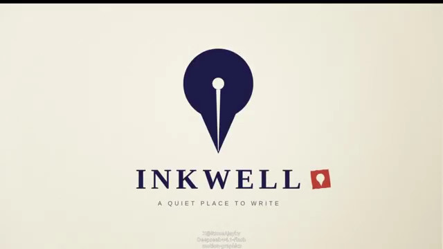</a></td>
<td width="50%" height="225" align="center" valign="middle"></td>
</tr>
<tr>
<td width="50%" valign="top"><strong>Inkwell: a DeepSeek brand-intro experiment</strong> <a href="https://x.com/ItsmeAjayKV">@ItsmeAjayKV</a> · Product &amp; marketing 0:38 · Bookmarks 2 · Details pending <a href="https://guanmo-ai.github.io/awesome-ai-motion/?lang=en#case-2106616126776230055">▶ Play</a> · <a href="https://x.com/ItsmeAjayKV/status/2106616126776230055">Original post</a></td>
<td width="50%" valign="top"><strong>Scroll+ product introduction film</strong> <a href="https://x.com/xenit_v0">@xenit_v0</a> · Product &amp; marketing 0:28 · Bookmarks 2 <a href="https://guanmo-ai.github.io/awesome-ai-motion/?lang=en#case-2106270979932532873">▶ Play</a> · <a href="https://x.com/xenit_v0/status/2106270979932532873">Original post</a></td>
</tr>
</tbody>
<tbody>
<tr>
<td width="50%" height="225" align="center" valign="middle"></td>
<td width="50%" height="225" align="center" valign="middle"></td>
</tr>
<tr>
<td width="50%" valign="top"><strong>Code-Rendered Brand Film</strong> <a href="https://x.com/Govindaiii">@Govindaiii</a> · Product &amp; marketing 0:52 · Bookmarks 2 · Details pending <a href="https://guanmo-ai.github.io/awesome-ai-motion/?lang=en#case-2102815918049132792">▶ Play</a> · <a href="https://x.com/Govindaiii/status/2102815918049132792">Original post</a></td>
<td width="50%" valign="top"><strong>Real Halloween Night: a VRChat World Promo</strong> <a href="https://x.com/yuripi_2023">@yuripi_2023</a> · Product &amp; marketing 1:00 · Bookmarks 2 · Details pending <a href="https://guanmo-ai.github.io/awesome-ai-motion/?lang=en#case-2108394968389951585">▶ Play</a> · <a href="https://x.com/yuripi_2023/status/2108394968389951585">Original post</a></td>
</tr>
</tbody>
<tbody>
<tr>
<td width="50%" height="225" align="center" valign="middle"></td>
<td width="50%" height="225" align="center" valign="middle"><a href="https://guanmo-ai.github.io/awesome-ai-motion/?lang=en#case-2106941357915058661">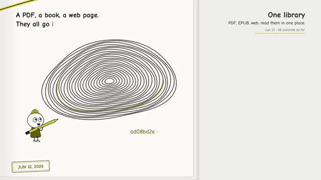</a></td>
</tr>
<tr>
<td width="50%" valign="top"><strong>An ad workflow with Claude and Seedance</strong> <a href="https://x.com/commonman_16">@commonman_16</a> · Product &amp; marketing 0:30 · Bookmarks 2 · Details pending <a href="https://guanmo-ai.github.io/awesome-ai-motion/?lang=en#case-2107497103643816445">▶ Play</a> · <a href="https://x.com/commonman_16/status/2107497103643816445">Original post</a></td>
<td width="50%" valign="top"><strong>Atlasnote-pro: a Git-history film</strong> <a href="https://x.com/Tao100086">@Tao100086</a> · Product &amp; marketing 2:06 · Bookmarks 2 · Details pending <a href="https://guanmo-ai.github.io/awesome-ai-motion/?lang=en#case-2106941357915058661">▶ Play</a> · <a href="https://x.com/Tao100086/status/2106941357915058661">Original post</a></td>
</tr>
</tbody>
<tbody>
<tr>
<td width="50%" height="225" align="center" valign="middle"></td>
<td width="50%" height="225" align="center" valign="middle"></td>
</tr>
<tr>
<td width="50%" valign="top"><strong>A Fictional Gym Campaign Ad</strong> <a href="https://x.com/husky__create">@husky__create</a> · Product &amp; marketing 0:30 · Bookmarks 2 · Details pending <a href="https://guanmo-ai.github.io/awesome-ai-motion/?lang=en#case-2108165831838544313">▶ Play</a> · <a href="https://x.com/husky__create/status/2108165831838544313">Original post</a></td>
<td width="50%" valign="top"><strong>Motion Experiments for an Ad Library</strong> <a href="https://x.com/uglyrobot">@uglyrobot</a> · Product &amp; marketing 0:20 · Bookmarks 1 · Details pending <a href="https://guanmo-ai.github.io/awesome-ai-motion/?lang=en#case-2104360004715446416">▶ Play</a> · <a href="https://x.com/uglyrobot/status/2104360004715446416">Original post</a></td>
</tr>
</tbody>
<tbody>
<tr>
<td width="50%" height="225" align="center" valign="middle"></td>
<td width="50%" height="225" align="center" valign="middle"></td>
</tr>
<tr>
<td width="50%" valign="top"><strong>Recall: a knowledge-app launch film</strong> <a href="https://x.com/shivamdesignin">@shivamdesignin</a> · Product &amp; marketing 0:48 · Bookmarks 1 · Details pending <a href="https://guanmo-ai.github.io/awesome-ai-motion/?lang=en#case-2106706231029314030">▶ Play</a> · <a href="https://x.com/shivamdesignin/status/2106706231029314030">Original post</a></td>
<td width="50%" valign="top"><strong>Promo for ten indie apps</strong> <a href="https://x.com/chapi13">@chapi13</a> · Product &amp; marketing 0:27 · Bookmarks 1 · Details pending <a href="https://guanmo-ai.github.io/awesome-ai-motion/?lang=en#case-2104206465863131449">▶ Play</a> · <a href="https://x.com/chapi13/status/2104206465863131449">Original post</a></td>
</tr>
</tbody>
<tbody>
<tr>
<td width="50%" height="225" align="center" valign="middle"><a href="https://guanmo-ai.github.io/awesome-ai-motion/?lang=en#case-2104528012746309680">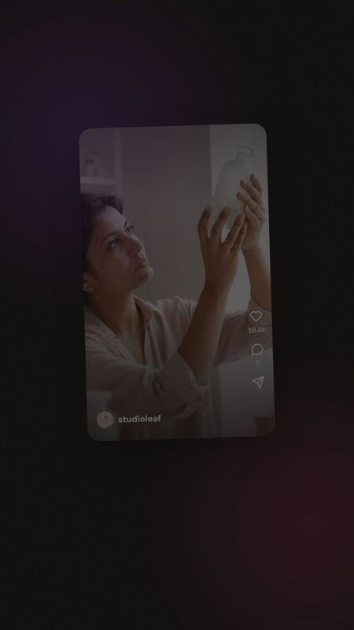</a></td>
<td width="50%" height="225" align="center" valign="middle"></td>
</tr>
<tr>
<td width="50%" valign="top"><strong>Synclify DM: one beat file for visuals and music</strong> <a href="https://x.com/apoorvjain25">@apoorvjain25</a> · Product &amp; marketing 0:51 · Bookmarks 1 <a href="https://guanmo-ai.github.io/awesome-ai-motion/?lang=en#case-2104528012746309680">▶ Play</a> · <a href="https://x.com/apoorvjain25/status/2104528012746309680">Original post</a></td>
<td width="50%" valign="top"><strong>Ply: A Mac App Launch Film</strong> <a href="https://x.com/Khazs0">@Khazs0</a> · Product &amp; marketing 0:38 · Bookmarks 1 · Details pending <a href="https://guanmo-ai.github.io/awesome-ai-motion/?lang=en#case-2104753708584095936">▶ Play</a> · <a href="https://x.com/Khazs0/status/2104753708584095936">Original post</a></td>
</tr>
</tbody>
<tbody>
<tr>
<td width="50%" height="225" align="center" valign="middle"></td>
<td width="50%" height="225" align="center" valign="middle"></td>
</tr>
<tr>
<td width="50%" valign="top"><strong>SEIRAN fictional EV advertisement</strong> <a href="https://x.com/ShionTabata">@ShionTabata</a> · Product &amp; marketing 0:15 · Bookmarks 1 · Details pending <a href="https://guanmo-ai.github.io/awesome-ai-motion/?lang=en#case-2107534399009104283">▶ Play</a> · <a href="https://x.com/ShionTabata/status/2107534399009104283">Original post</a></td>
<td width="50%" valign="top"><strong>A Vertical Promo Test for an Indie Game</strong> <a href="https://x.com/buluntus_dev">@buluntus_dev</a> · Product &amp; marketing 0:20 · Bookmarks 1 · Details pending <a href="https://guanmo-ai.github.io/awesome-ai-motion/?lang=en#case-2107915831900512276">▶ Play</a> · <a href="https://x.com/buluntus_dev/status/2107915831900512276">Original post</a></td>
</tr>
</tbody>
<tbody>
<tr>
<td width="50%" height="225" align="center" valign="middle"></td>
<td width="50%" height="225" align="center" valign="middle"></td>
</tr>
<tr>
<td width="50%" valign="top"><strong>A Namashkar Bharat Website Promo</strong> <a href="https://x.com/ajinkya_shejul">@ajinkya_shejul</a> · Product &amp; marketing 0:32 · Bookmarks 0 · Details pending <a href="https://guanmo-ai.github.io/awesome-ai-motion/?lang=en#case-2105221279100141928">▶ Play</a> · <a href="https://x.com/ajinkya_shejul/status/2105221279100141928">Original post</a></td>
<td width="50%" valign="top"><strong>Brand Explainer Using Existing Product UI</strong> <a href="https://x.com/imthatcarlos">@imthatcarlos</a> · Product &amp; marketing 0:59 · Bookmarks 0 · Details pending <a href="https://guanmo-ai.github.io/awesome-ai-motion/?lang=en#case-2102849219388133592">▶ Play</a> · <a href="https://x.com/imthatcarlos/status/2102849219388133592">Original post</a></td>
</tr>
</tbody>
<tbody>
<tr>
<td width="50%" height="225" align="center" valign="middle"></td>
<td width="50%" height="225" align="center" valign="middle"><a href="https://guanmo-ai.github.io/awesome-ai-motion/?lang=en#case-2105939128705802479">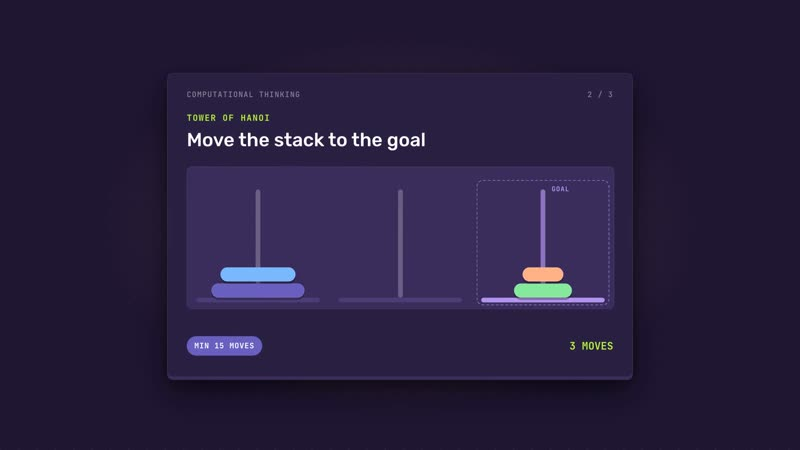</a></td>
</tr>
<tr>
<td width="50%" valign="top"><strong>Imagine MCP Launch Motion</strong> <a href="https://x.com/ImagineArt_X">@ImagineArt_X</a> · Product &amp; marketing 0:49 · Bookmarks 0 · Details pending <a href="https://guanmo-ai.github.io/awesome-ai-motion/?lang=en#case-2104771867781574928">▶ Play</a> · <a href="https://x.com/ImagineArt_X/status/2104771867781574928">Original post</a></td>
<td width="50%" valign="top"><strong>Lernok product teaser</strong> <a href="https://x.com/nehalmax">@nehalmax</a> · Product &amp; marketing 0:32 · Bookmarks 0 <a href="https://guanmo-ai.github.io/awesome-ai-motion/?lang=en#case-2105939128705802479">▶ Play</a> · <a href="https://x.com/nehalmax/status/2105939128705802479">Original post</a></td>
</tr>
</tbody>
<tbody>
<tr>
<td width="50%" height="225" align="center" valign="middle"></td>
<td width="50%" height="225" align="center" valign="middle"></td>
</tr>
<tr>
<td width="50%" valign="top"><strong>A Playbook Promo from a Website Link</strong> <a href="https://x.com/chuhaiqu">@chuhaiqu</a> · Product &amp; marketing 0:25 · Bookmarks 0 · Details pending <a href="https://guanmo-ai.github.io/awesome-ai-motion/?lang=en#case-2104359673382175100">▶ Play</a> · <a href="https://x.com/chuhaiqu/status/2104359673382175100">Original post</a></td>
<td width="50%" valign="top"><strong>A 60-Second Product Launch Film in HTML and GSAP</strong> <a href="https://x.com/maheshdhiman">@maheshdhiman</a> · Product &amp; marketing 1:00 · Bookmarks 0 · Details pending <a href="https://guanmo-ai.github.io/awesome-ai-motion/?lang=en#case-2104607774793679182">▶ Play</a> · <a href="https://x.com/maheshdhiman/status/2104607774793679182">Original post</a></td>
</tr>
</tbody>
<tbody>
<tr>
<td width="50%" height="225" align="center" valign="middle"></td>
<td width="50%" height="225" align="center" valign="middle"></td>
</tr>
<tr>
<td width="50%" valign="top"><strong>grouped.news: A Launch Ad Using Site Design Tokens</strong> <a href="https://x.com/l3d1c">@l3d1c</a> · Product &amp; marketing 0:34 · Bookmarks 0 · Details pending <a href="https://guanmo-ai.github.io/awesome-ai-motion/?lang=en#case-2104649028193632524">▶ Play</a> · <a href="https://x.com/l3d1c/status/2104649028193632524">Original post</a></td>
<td width="50%" valign="top"><strong>An HTML showreel for a personal résumé</strong> <a href="https://x.com/offcod8">@offcod8</a> · Product &amp; marketing 0:41 · Bookmarks 0 · Details pending <a href="https://guanmo-ai.github.io/awesome-ai-motion/?lang=en#case-2107367341973717334">▶ Play</a> · <a href="https://x.com/offcod8/status/2107367341973717334">Original post</a></td>
</tr>
</tbody>
<tbody>
<tr>
<td width="50%" height="225" align="center" valign="middle"></td>
<td width="50%" height="225" align="center" valign="middle"><a href="https://guanmo-ai.github.io/awesome-ai-motion/?lang=en#case-2106483328635592921">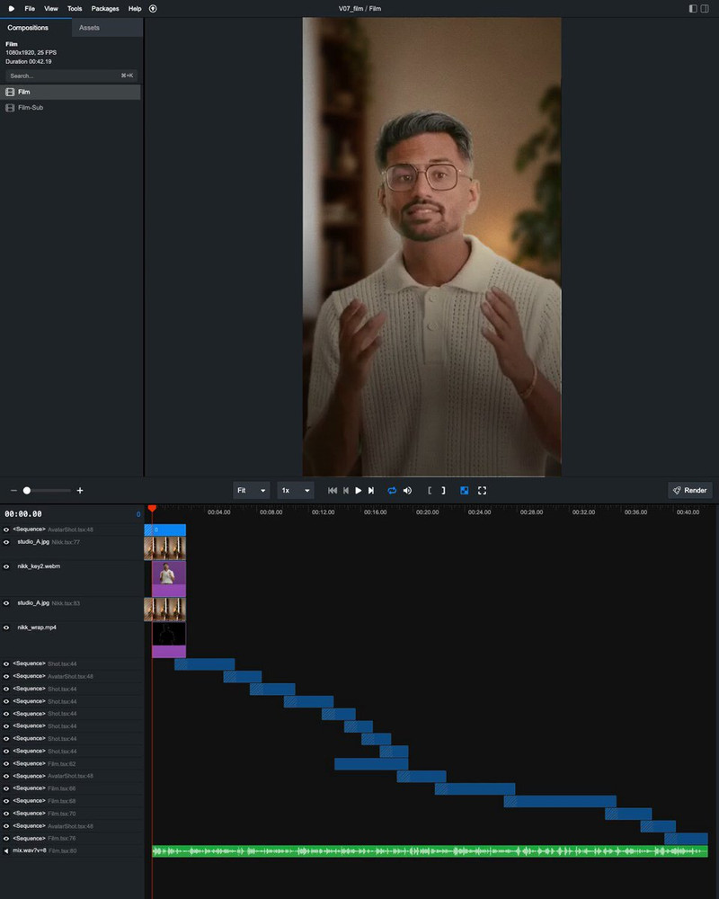</a></td>
</tr>
<tr>
<td width="50%" valign="top"><strong>Dexter: a Framer Plugin Explainer</strong> <a href="https://x.com/Gacheruthegreat">@Gacheruthegreat</a> · Product &amp; marketing 0:58 · Bookmarks 0 · Details pending <a href="https://guanmo-ai.github.io/awesome-ai-motion/?lang=en#case-2108097480437219614">▶ Play</a> · <a href="https://x.com/Gacheruthegreat/status/2108097480437219614">Original post</a></td>
<td width="50%" valign="top"><strong>An AI-avatar composition in Remotion</strong> <a href="https://x.com/pranavclickks">@pranavclickks</a> · Product &amp; marketing 0:44 · Bookmarks 0 · Details pending <a href="https://guanmo-ai.github.io/awesome-ai-motion/?lang=en#case-2106483328635592921">▶ Play</a> · <a href="https://x.com/pranavclickks/status/2106483328635592921">Original post</a></td>
</tr>
</tbody>
<tbody>
<tr>
<td width="50%" height="225" align="center" valign="middle"></td>
<td width="50%" height="225" align="center" valign="middle"><a href="https://guanmo-ai.github.io/awesome-ai-motion/?lang=en#case-2107809209593004331">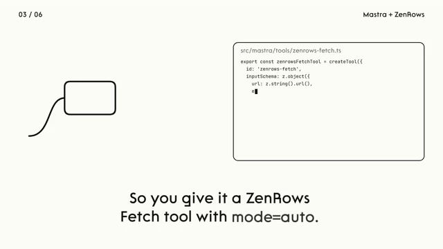</a></td>
</tr>
<tr>
<td width="50%" valign="top"><strong>Cardilife: bilingual films from one project</strong> <a href="https://x.com/DengenT">@DengenT</a> · Product &amp; marketing 0:56 · Bookmarks 0 <a href="https://guanmo-ai.github.io/awesome-ai-motion/?lang=en#case-2107425308773412996">▶ Play</a> · <a href="https://x.com/DengenT/status/2107425308773412996">Original post</a></td>
<td width="50%" valign="top"><strong>A Remotion Explainer about ZenRows Fetching</strong> <a href="https://x.com/xamfonos_">@xamfonos_</a> · Product &amp; marketing 0:45 · Bookmarks 0 · Details pending <a href="https://guanmo-ai.github.io/awesome-ai-motion/?lang=en#case-2107809209593004331">▶ Play</a> · <a href="https://x.com/xamfonos_/status/2107809209593004331">Original post</a></td>
</tr>
</tbody>
<tbody>
<tr>
<td width="50%" height="225" align="center" valign="middle"></td>
<td width="50%" height="225" align="center" valign="middle"><a href="https://guanmo-ai.github.io/awesome-ai-motion/?lang=en#case-2103885710734540960">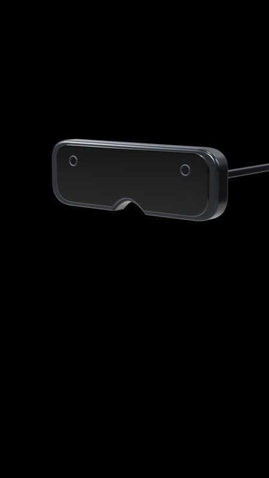</a></td>
</tr>
<tr>
<td width="50%" valign="top"><strong>A 3D commercial for a fictional drink</strong> <a href="https://x.com/_petert">@_petert</a> · Product &amp; marketing 0:24 · Bookmarks 0 <a href="https://guanmo-ai.github.io/awesome-ai-motion/?lang=en#case-2103885113528635793">▶ Play</a> · <a href="https://x.com/_petert/status/2103885113528635793">Original post</a></td>
<td width="50%" valign="top"><strong>A mixed-tool Meta VR introduction</strong> <a href="https://x.com/_petert">@_petert</a> · Product &amp; marketing 0:30 · Bookmarks 0 <a href="https://guanmo-ai.github.io/awesome-ai-motion/?lang=en#case-2103885710734540960">▶ Play</a> · <a href="https://x.com/_petert/status/2103885710734540960">Original post</a></td>
</tr>
</tbody>
<tbody>
<tr>
<td width="50%" height="225" align="center" valign="middle"></td>
<td width="50%" height="225" align="center" valign="middle"></td>
</tr>
<tr>
<td width="50%" valign="top"><strong>A one-pass Lysa product teaser</strong> <a href="https://x.com/devarshukani">@devarshukani</a> · Product &amp; marketing 0:22 · Bookmarks 0 <a href="https://guanmo-ai.github.io/awesome-ai-motion/?lang=en#case-2104432185277341827">▶ Play</a> · <a href="https://x.com/devarshukani/status/2104432185277341827">Original post</a></td>
<td width="50%" valign="top"><strong>A Stylized HyperFrames Commercial Experiment</strong> <a href="https://x.com/washow_cfo">@washow_cfo</a> · Product &amp; marketing 0:37 · Bookmarks 0 · Details pending <a href="https://guanmo-ai.github.io/awesome-ai-motion/?lang=en#case-2104595346882175311">▶ Play</a> · <a href="https://x.com/washow_cfo/status/2104595346882175311">Original post</a></td>
</tr>
</tbody>
<tbody>
<tr>
<td width="50%" height="225" align="center" valign="middle"><a href="https://guanmo-ai.github.io/awesome-ai-motion/?lang=en#case-2105666912097358187">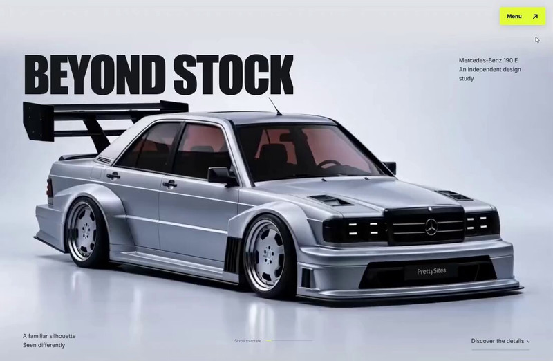</a></td>
<td width="50%" height="225" align="center" valign="middle"><a href="https://guanmo-ai.github.io/awesome-ai-motion/?lang=en#case-2105976102074437835">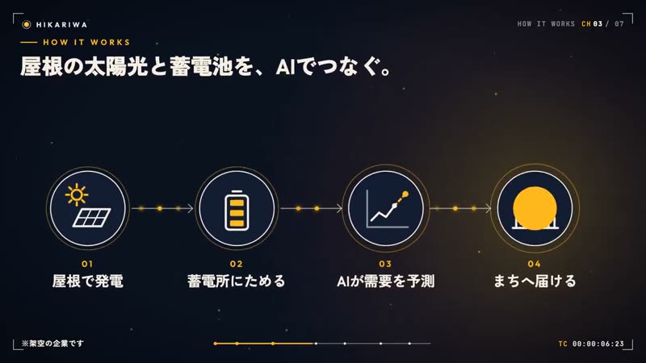</a></td>
</tr>
<tr>
<td width="50%" valign="top"><strong>A car showcase with editorial typography</strong> <a href="https://x.com/msbr_dev">@msbr_dev</a> · Product &amp; marketing 0:28 · Bookmarks 0 · Details pending <a href="https://guanmo-ai.github.io/awesome-ai-motion/?lang=en#case-2105666912097358187">▶ Play</a> · <a href="https://x.com/msbr_dev/status/2105666912097358187">Original post</a></td>
<td width="50%" valign="top"><strong>A fifteen-second fictional business reel</strong> <a href="https://x.com/asei_ikarashi">@asei_ikarashi</a> · Product &amp; marketing 0:15 · Bookmarks 0 <a href="https://guanmo-ai.github.io/awesome-ai-motion/?lang=en#case-2105976102074437835">▶ Play</a> · <a href="https://x.com/asei_ikarashi/status/2105976102074437835">Original post</a></td>
</tr>
</tbody>
<tbody>
<tr>
<td width="50%" height="225" align="center" valign="middle"><a href="https://guanmo-ai.github.io/awesome-ai-motion/?lang=en#case-2106067189300113572">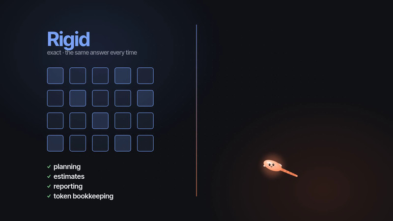</a></td>
<td width="50%" height="225" align="center" valign="middle"></td>
</tr>
<tr>
<td width="50%" valign="top"><strong>An explainer for the dplanner project</strong> <a href="https://x.com/knutsi">@knutsi</a> · Product &amp; marketing 1:40 · Bookmarks 0 · Details pending <a href="https://guanmo-ai.github.io/awesome-ai-motion/?lang=en#case-2106067189300113572">▶ Play</a> · <a href="https://x.com/knutsi/status/2106067189300113572">Original post</a></td>
<td width="50%" valign="top"><strong>Agent HUD: motion graphics for an iPhone Duo interface</strong> <a href="https://x.com/Jazzen_Chen">@Jazzen_Chen</a> · Product &amp; marketing 0:30 · Bookmarks 0 · Details pending <a href="https://guanmo-ai.github.io/awesome-ai-motion/?lang=en#case-2106442652522885551">▶ Play</a> · <a href="https://x.com/Jazzen_Chen/status/2106442652522885551">Original post</a></td>
</tr>
</tbody>
<tbody>
<tr>
<td width="50%" height="225" align="center" valign="middle"><a href="https://guanmo-ai.github.io/awesome-ai-motion/?lang=en#case-2106755940326523082">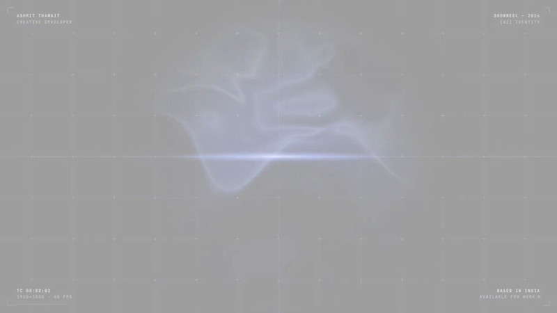</a></td>
<td width="50%" height="225" align="center" valign="middle"></td>
</tr>
<tr>
<td width="50%" valign="top"><strong>A freelance web-design showreel</strong> <a href="https://x.com/ashh_codes">@ashh_codes</a> · Product &amp; marketing 0:21 · Bookmarks 0 · Details pending <a href="https://guanmo-ai.github.io/awesome-ai-motion/?lang=en#case-2106755940326523082">▶ Play</a> · <a href="https://x.com/ashh_codes/status/2106755940326523082">Original post</a></td>
<td width="50%" valign="top"><strong>Terminator Line: a Code-made News Product Ad</strong> <a href="https://x.com/finderlzy">@finderlzy</a> · Product &amp; marketing 0:30 · Bookmarks 0 · Details pending <a href="https://guanmo-ai.github.io/awesome-ai-motion/?lang=en#case-2107794301891842359">▶ Play</a> · <a href="https://x.com/finderlzy/status/2107794301891842359">Original post</a></td>
</tr>
</tbody>
<tbody>
<tr>
<td width="50%" height="225" align="center" valign="middle"></td>
<td width="50%" height="225" align="center" valign="middle"></td>
</tr>
<tr>
<td width="50%" valign="top"><strong>A Tama.dev Episode Five Event Promo</strong> <a href="https://x.com/asagayanaoki">@asagayanaoki</a> · Product &amp; marketing 0:15 · Bookmarks 0 · Details pending <a href="https://guanmo-ai.github.io/awesome-ai-motion/?lang=en#case-2108333603377877195">▶ Play</a> · <a href="https://x.com/asagayanaoki/status/2108333603377877195">Original post</a></td>
<td width="50%" valign="top"><strong>Party Monster: a Party Mini-game App</strong> <a href="https://x.com/feeyarcat">@feeyarcat</a> · Product &amp; marketing 1:46 · Bookmarks 0 · Details pending <a href="https://guanmo-ai.github.io/awesome-ai-motion/?lang=en#case-2108414058718547983">▶ Play</a> · <a href="https://x.com/feeyarcat/status/2108414058718547983">Original post</a></td>
</tr>
</tbody>
<tbody>
<tr>
<td width="50%" height="225" align="center" valign="middle"></td>
<td width="50%" height="225" align="center" valign="middle"><a href="https://guanmo-ai.github.io/awesome-ai-motion/?lang=en#case-2104206756482334921">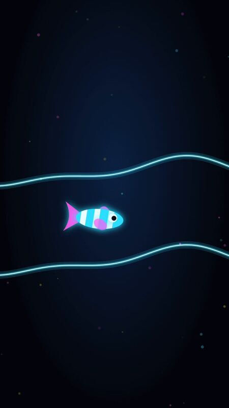</a></td>
</tr>
<tr>
<td width="50%" valign="top"><strong>A Fictional Winter-course Ad</strong> <a href="https://x.com/husky__create">@husky__create</a> · Product &amp; marketing 0:30 · Bookmarks 0 · Details pending <a href="https://guanmo-ai.github.io/awesome-ai-motion/?lang=en#case-2108497996430414330">▶ Play</a> · <a href="https://x.com/husky__create/status/2108497996430414330">Original post</a></td>
<td width="50%" valign="top"><strong>BIRIBIRI: real replays into bilingual game trailers</strong> <a href="https://x.com/mappletour">@mappletour</a> · Product &amp; marketing 0:32 · Bookmarks 0 <a href="https://guanmo-ai.github.io/awesome-ai-motion/?lang=en#case-2104206756482334921">▶ Play</a> · <a href="https://x.com/mappletour/status/2104206756482334921">Original post</a></td>
</tr>
</tbody>
<tbody>
<tr>
<td width="50%" height="225" align="center" valign="middle"></td>
<td width="50%" height="225" align="center" valign="middle"></td>
</tr>
<tr>
<td width="50%" valign="top"><strong>Moveno website material promo</strong> <a href="https://x.com/DannyVerkissen">@DannyVerkissen</a> · Product &amp; marketing 0:46 · Bookmarks 0 · Details pending <a href="https://guanmo-ai.github.io/awesome-ai-motion/?lang=en#case-2104212402875101463">▶ Play</a> · <a href="https://x.com/DannyVerkissen/status/2104212402875101463">Original post</a></td>
<td width="50%" valign="top"><strong>Social video from reference screenshots</strong> <a href="https://x.com/itsyashf">@itsyashf</a> · Product &amp; marketing 0:15 · Bookmarks 0 · Details pending <a href="https://guanmo-ai.github.io/awesome-ai-motion/?lang=en#case-2104227261142692347">▶ Play</a> · <a href="https://x.com/itsyashf/status/2104227261142692347">Original post</a></td>
</tr>
</tbody>
<tbody>
<tr>
<td width="50%" height="225" align="center" valign="middle"></td>
<td width="50%" height="225" align="center" valign="middle"></td>
</tr>
<tr>
<td width="50%" valign="top"><strong>A SaaS Ad with Seedance and HyperFrames</strong> <a href="https://x.com/farooqsheik">@farooqsheik</a> · Product &amp; marketing 1:09 · Bookmarks 0 · Details pending <a href="https://guanmo-ai.github.io/awesome-ai-motion/?lang=en#case-2104548405565595747">▶ Play</a> · <a href="https://x.com/farooqsheik/status/2104548405565595747">Original post</a></td>
<td width="50%" valign="top"><strong>Kan Bağı: Open-Source Blood Donation App Promo</strong> <a href="https://x.com/bedirhantongdev">@bedirhantongdev</a> · Product &amp; marketing 0:32 · Bookmarks 0 · Details pending <a href="https://guanmo-ai.github.io/awesome-ai-motion/?lang=en#case-2104628062771888552">▶ Play</a> · <a href="https://x.com/bedirhantongdev/status/2104628062771888552">Original post</a></td>
</tr>
</tbody>
<tbody>
<tr>
<td width="50%" height="225" align="center" valign="middle"></td>
<td width="50%" height="225" align="center" valign="middle"></td>
</tr>
<tr>
<td width="50%" valign="top"><strong>Onlya: A Claude and HyperFrames Promo</strong> <a href="https://x.com/polovlad1">@polovlad1</a> · Product &amp; marketing 0:37 · Bookmarks 0 · Details pending <a href="https://guanmo-ai.github.io/awesome-ai-motion/?lang=en#case-2104678989616795662">▶ Play</a> · <a href="https://x.com/polovlad1/status/2104678989616795662">Original post</a></td>
<td width="50%" valign="top"><strong>A Product Promo in HTML, CSS and JavaScript</strong> <a href="https://x.com/FranzmeierRandy">@FranzmeierRandy</a> · Product &amp; marketing 0:30 · Bookmarks 0 · Details pending <a href="https://guanmo-ai.github.io/awesome-ai-motion/?lang=en#case-2104736355905360348">▶ Play</a> · <a href="https://x.com/FranzmeierRandy/status/2104736355905360348">Original post</a></td>
</tr>
</tbody>
<tbody>
<tr>
<td width="50%" height="225" align="center" valign="middle"></td>
<td width="50%" height="225" align="center" valign="middle"></td>
</tr>
<tr>
<td width="50%" valign="top"><strong>OpenSend product promo</strong> <a href="https://x.com/codewithkamal">@codewithkamal</a> · Product &amp; marketing 0:46 · Bookmarks 0 · Details pending <a href="https://guanmo-ai.github.io/awesome-ai-motion/?lang=en#case-2105346293724045443">▶ Play</a> · <a href="https://x.com/codewithkamal/status/2105346293724045443">Original post</a></td>
<td width="50%" valign="top"><strong>A Project256 website-to-video explainer</strong> <a href="https://x.com/0xzxch">@0xzxch</a> · Product &amp; marketing 2:19 · Bookmarks 0 · Details pending <a href="https://guanmo-ai.github.io/awesome-ai-motion/?lang=en#case-2106066675166531796">▶ Play</a> · <a href="https://x.com/0xzxch/status/2106066675166531796">Original post</a></td>
</tr>
</tbody>
<tbody>
<tr>
<td width="50%" height="225" align="center" valign="middle"></td>
<td width="50%" height="225" align="center" valign="middle"></td>
</tr>
<tr>
<td width="50%" valign="top"><strong>A launch film built from one video reference</strong> <a href="https://x.com/Sonali_Sahu_09">@Sonali_Sahu_09</a> · Product &amp; marketing 0:46 · Bookmarks 0 <a href="https://guanmo-ai.github.io/awesome-ai-motion/?lang=en#case-2106265463378350200">▶ Play</a> · <a href="https://x.com/Sonali_Sahu_09/status/2106265463378350200">Original post</a></td>
<td width="50%" valign="top"><strong>A dim-sum restaurant film with HyperFrames</strong> <a href="https://x.com/realunclena">@realunclena</a> · Product &amp; marketing 0:22 · Bookmarks 0 · Details pending <a href="https://guanmo-ai.github.io/awesome-ai-motion/?lang=en#case-2107352553382195584">▶ Play</a> · <a href="https://x.com/realunclena/status/2107352553382195584">Original post</a></td>
</tr>
</tbody>
<tbody>
<tr>
<td width="50%" height="225" align="center" valign="middle"><a href="https://guanmo-ai.github.io/awesome-ai-motion/?lang=en#case-2107369442602876972">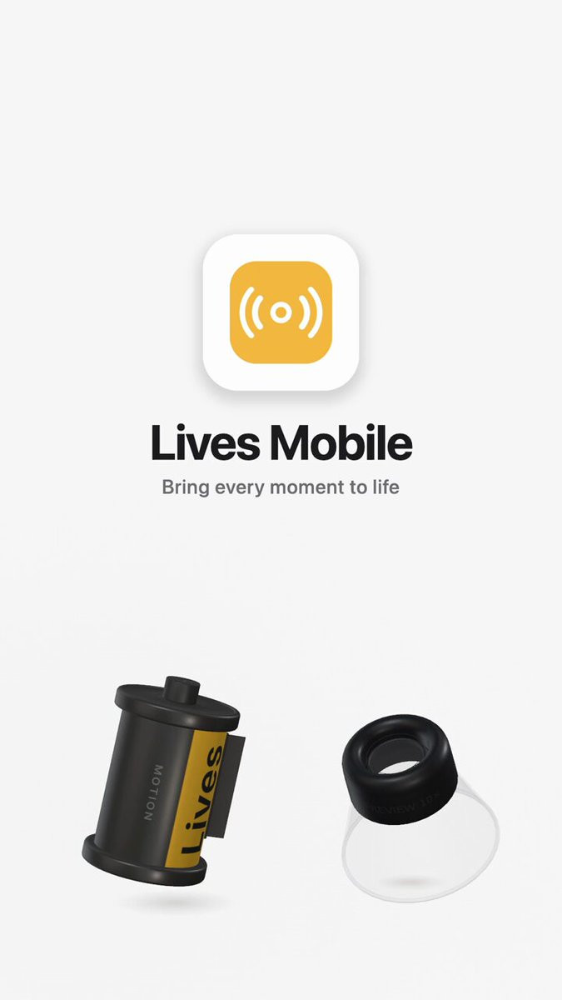</a></td>
<td width="50%" height="225" align="center" valign="middle"><a href="https://guanmo-ai.github.io/awesome-ai-motion/?lang=en#case-2107499626265784473">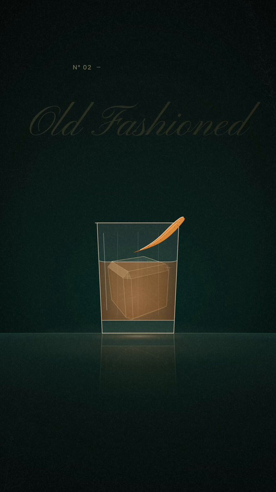</a></td>
</tr>
<tr>
<td width="50%" valign="top"><strong>Lives Mobile: film and loupe animation</strong> <a href="https://x.com/ohmyangboy">@ohmyangboy</a> · Product &amp; marketing 0:57 · Bookmarks 0 · Details pending <a href="https://guanmo-ai.github.io/awesome-ai-motion/?lang=en#case-2107369442602876972">▶ Play</a> · <a href="https://x.com/ohmyangboy/status/2107369442602876972">Original post</a></td>
<td width="50%" valign="top"><strong>Old Fashioned: a cocktail-series film</strong> <a href="https://x.com/onmanjrekar">@onmanjrekar</a> · Product &amp; marketing 0:42 · Bookmarks 0 · Details pending <a href="https://guanmo-ai.github.io/awesome-ai-motion/?lang=en#case-2107499626265784473">▶ Play</a> · <a href="https://x.com/onmanjrekar/status/2107499626265784473">Original post</a></td>
</tr>
</tbody>
<tbody>
<tr>
<td width="50%" height="225" align="center" valign="middle"><a href="https://guanmo-ai.github.io/awesome-ai-motion/?lang=en#case-2107828023076811083">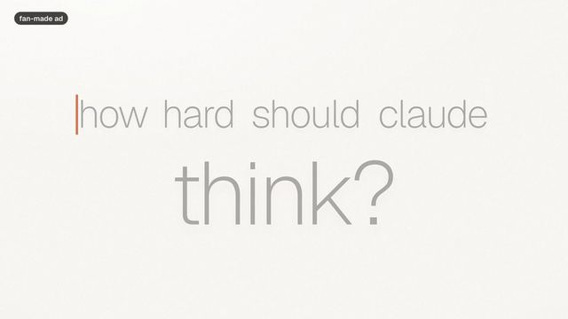</a></td>
<td width="50%" height="225" align="center" valign="middle"></td>
</tr>
<tr>
<td width="50%" valign="top"><strong>A Fan-made Claude Thinking Ad</strong> <a href="https://x.com/Phavorism">@Phavorism</a> · Product &amp; marketing 0:33 · Bookmarks 0 · Details pending <a href="https://guanmo-ai.github.io/awesome-ai-motion/?lang=en#case-2107828023076811083">▶ Play</a> · <a href="https://x.com/Phavorism/status/2107828023076811083">Original post</a></td>
<td width="50%" valign="top"><strong>A Seedance Portfolio: Generation, Editing and Music</strong> <a href="https://x.com/take_freelance">@take_freelance</a> · Product &amp; marketing 0:57 · Bookmarks 0 · Details pending <a href="https://guanmo-ai.github.io/awesome-ai-motion/?lang=en#case-2108513994336297044">▶ Play</a> · <a href="https://x.com/take_freelance/status/2108513994336297044">Original post</a></td>
</tr>
</tbody>
<tbody>
<tr>
<td width="50%" height="225" align="center" valign="middle"></td>
<td width="50%" height="225" align="center" valign="middle"></td>
</tr>
<tr>
<td width="50%" valign="top"><strong>Short Film Introducing a New Project</strong> <a href="https://x.com/haidaulau">@haidaulau</a> · Product &amp; marketing 2:29 · Bookmarks 0 · Details pending <a href="https://guanmo-ai.github.io/awesome-ai-motion/?lang=en#case-2103015561076564319">▶ Play</a> · <a href="https://x.com/haidaulau/status/2103015561076564319">Original post</a></td>
<td width="50%" valign="top"><strong>Bilingual Promo for a Reading App</strong> <a href="https://x.com/WangYeruo">@WangYeruo</a> · Product &amp; marketing 0:44 · Bookmarks 0 · Details pending <a href="https://guanmo-ai.github.io/awesome-ai-motion/?lang=en#case-2103108551799632050">▶ Play</a> · <a href="https://x.com/WangYeruo/status/2103108551799632050">Original post</a></td>
</tr>
</tbody>
<tbody>
<tr>
<td width="50%" height="225" align="center" valign="middle"></td>
<td width="50%" height="225" align="center" valign="middle"></td>
</tr>
<tr>
<td width="50%" valign="top"><strong>Editing a Catapult Sketch-to-Simulation Demo</strong> <a href="https://x.com/BrainWavePub">@BrainWavePub</a> · Product &amp; marketing 0:53 · Bookmarks 0 · Details pending <a href="https://guanmo-ai.github.io/awesome-ai-motion/?lang=en#case-2104180455813812667">▶ Play</a> · <a href="https://x.com/BrainWavePub/status/2104180455813812667">Original post</a></td>
<td width="50%" valign="top"><strong>Moonshoot product launch video</strong> <a href="https://x.com/bekamakhar">@bekamakhar</a> · Product &amp; marketing 0:24 · Bookmarks 0 · Details pending <a href="https://guanmo-ai.github.io/awesome-ai-motion/?lang=en#case-2104240538941538517">▶ Play</a> · <a href="https://x.com/bekamakhar/status/2104240538941538517">Original post</a></td>
</tr>
</tbody>
<tbody>
<tr>
<td width="50%" height="225" align="center" valign="middle"></td>
<td width="50%" height="225" align="center" valign="middle"></td>
</tr>
<tr>
<td width="50%" valign="top"><strong>AKAI Cinematic Product Clip</strong> <a href="https://x.com/rao_abhi_17">@rao_abhi_17</a> · Product &amp; marketing 0:29 · Bookmarks 0 · Details pending <a href="https://guanmo-ai.github.io/awesome-ai-motion/?lang=en#case-2104773492491346349">▶ Play</a> · <a href="https://x.com/rao_abhi_17/status/2104773492491346349">Original post</a></td>
<td width="50%" valign="top"><strong>An IdeaVim Product Promo</strong> <a href="https://x.com/ideavim">@ideavim</a> · Product &amp; marketing 0:30 · Bookmarks 0 · Details pending <a href="https://guanmo-ai.github.io/awesome-ai-motion/?lang=en#case-2105231699407986785">▶ Play</a> · <a href="https://x.com/ideavim/status/2105231699407986785">Original post</a></td>
</tr>
</tbody>
<tbody>
<tr>
<td width="50%" height="225" align="center" valign="middle"><a href="https://guanmo-ai.github.io/awesome-ai-motion/?lang=en#case-2105560227622076768">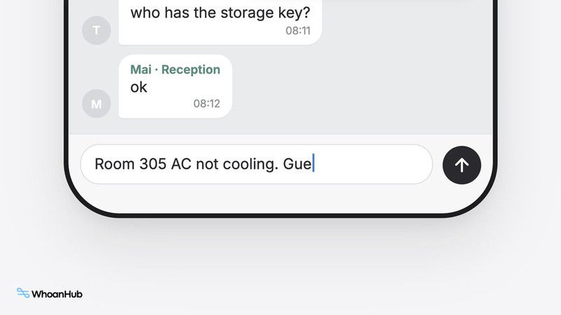</a></td>
<td width="50%" height="225" align="center" valign="middle"></td>
</tr>
<tr>
<td width="50%" valign="top"><strong>WhoonHub: a startup product-demo experiment</strong> <a href="https://x.com/huannguyenduc28">@huannguyenduc28</a> · Product &amp; marketing 0:27 · Bookmarks 0 · Details pending <a href="https://guanmo-ai.github.io/awesome-ai-motion/?lang=en#case-2105560227622076768">▶ Play</a> · <a href="https://x.com/huannguyenduc28/status/2105560227622076768">Original post</a></td>
<td width="50%" valign="top"><strong>A short video built around mobile messaging</strong> <a href="https://x.com/aeng_t5">@aeng_t5</a> · Product &amp; marketing 0:44 · Bookmarks 0 · Details pending <a href="https://guanmo-ai.github.io/awesome-ai-motion/?lang=en#case-2106044513177194584">▶ Play</a> · <a href="https://x.com/aeng_t5/status/2106044513177194584">Original post</a></td>
</tr>
</tbody>
<tbody>
<tr>
<td width="50%" height="225" align="center" valign="middle"></td>
<td width="50%" height="225" align="center" valign="middle"><a href="https://guanmo-ai.github.io/awesome-ai-motion/?lang=en#case-2106659260683948113">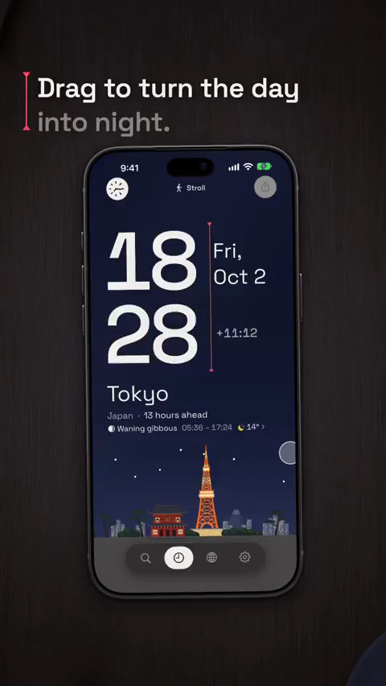</a></td>
</tr>
<tr>
<td width="50%" valign="top"><strong>An app ad with interface motion graphics</strong> <a href="https://x.com/join_devana">@join_devana</a> · Product &amp; marketing 0:49 · Bookmarks 0 · Details pending <a href="https://guanmo-ai.github.io/awesome-ai-motion/?lang=en#case-2106066980730011908">▶ Play</a> · <a href="https://x.com/join_devana/status/2106066980730011908">Original post</a></td>
<td width="50%" valign="top"><strong>Hourline: a 15-second world-clock app ad</strong> <a href="https://x.com/LiveTranscriber">@LiveTranscriber</a> · Product &amp; marketing 0:15 · Bookmarks 0 · Details pending <a href="https://guanmo-ai.github.io/awesome-ai-motion/?lang=en#case-2106659260683948113">▶ Play</a> · <a href="https://x.com/LiveTranscriber/status/2106659260683948113">Original post</a></td>
</tr>
</tbody>
<tbody>
<tr>
<td width="50%" height="225" align="center" valign="middle"></td>
<td width="50%" height="225" align="center" valign="middle"></td>
</tr>
<tr>
<td width="50%" valign="top"><strong>Litra: a reading-app launch film</strong> <a href="https://x.com/xserart">@xserart</a> · Product &amp; marketing 0:30 · Bookmarks 0 · Details pending <a href="https://guanmo-ai.github.io/awesome-ai-motion/?lang=en#case-2107149734100062383">▶ Play</a> · <a href="https://x.com/xserart/status/2107149734100062383">Original post</a></td>
<td width="50%" valign="top"><strong>An iterated Synclify Link in Bio launch film</strong> <a href="https://x.com/apoorvjain25">@apoorvjain25</a> · Product &amp; marketing 0:30 · Bookmarks 0 <a href="https://guanmo-ai.github.io/awesome-ai-motion/?lang=en#case-2107157871356150112">▶ Play</a> · <a href="https://x.com/apoorvjain25/status/2107157871356150112">Original post</a></td>
</tr>
</tbody>
<tbody>
<tr>
<td width="50%" height="225" align="center" valign="middle"><a href="https://guanmo-ai.github.io/awesome-ai-motion/?lang=en#case-2107397947168362555">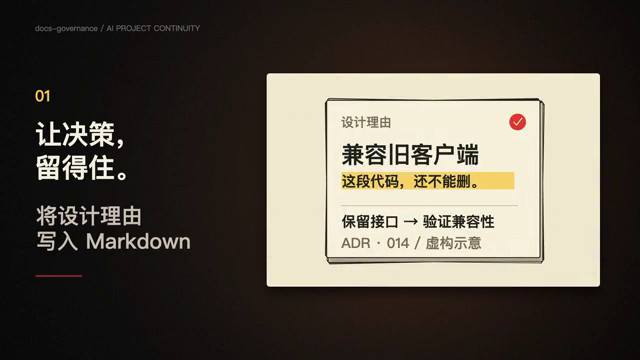</a></td>
<td width="50%" height="225" align="center" valign="middle"><a href="https://guanmo-ai.github.io/awesome-ai-motion/?lang=en#case-2107422149300600951">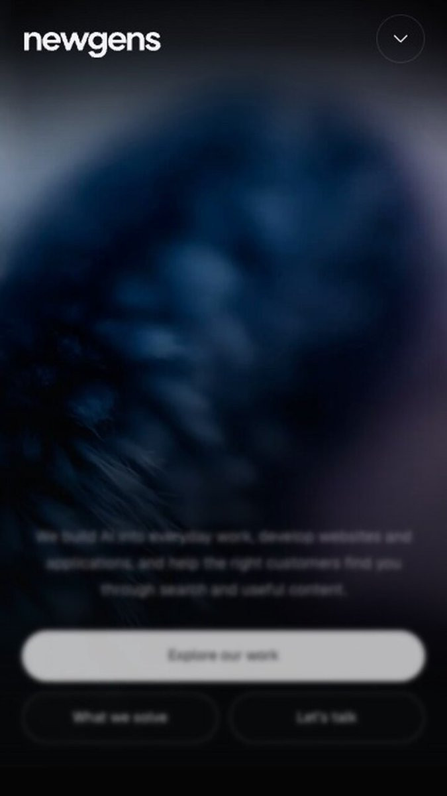</a></td>
</tr>
<tr>
<td width="50%" valign="top"><strong>docs-governance: a documentation-tool film</strong> <a href="https://x.com/GdML1b0OFr90679">@GdML1b0OFr90679</a> · Product &amp; marketing 0:28 · Bookmarks 0 · Details pending <a href="https://guanmo-ai.github.io/awesome-ai-motion/?lang=en#case-2107397947168362555">▶ Play</a> · <a href="https://x.com/GdML1b0OFr90679/status/2107397947168362555">Original post</a></td>
<td width="50%" valign="top"><strong>Newgens: a Blender website animation</strong> <a href="https://x.com/jammingrat">@jammingrat</a> · Product &amp; marketing 0:24 · Bookmarks 0 · Details pending <a href="https://guanmo-ai.github.io/awesome-ai-motion/?lang=en#case-2107422149300600951">▶ Play</a> · <a href="https://x.com/jammingrat/status/2107422149300600951">Original post</a></td>
</tr>
</tbody>
<tbody>
<tr>
<td width="50%" height="225" align="center" valign="middle"></td>
<td width="50%" height="225" align="center" valign="middle"><a href="https://guanmo-ai.github.io/awesome-ai-motion/?lang=en#case-2107465618668871824">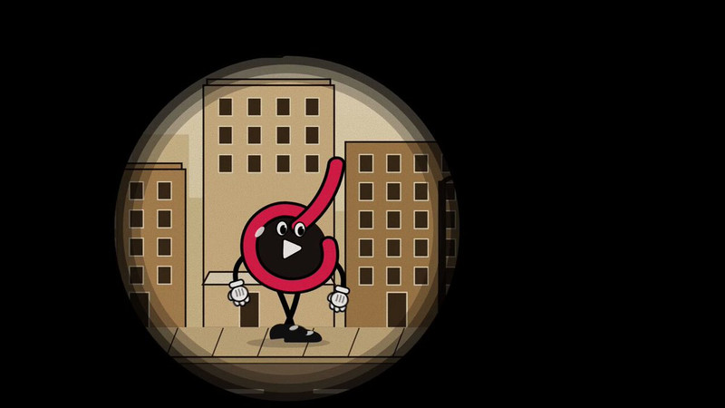</a></td>
</tr>
<tr>
<td width="50%" valign="top"><strong>Skills Manager: discovery and installation</strong> <a href="https://x.com/JayTL00">@JayTL00</a> · Product &amp; marketing 1:24 · Bookmarks 0 · Details pending <a href="https://guanmo-ai.github.io/awesome-ai-motion/?lang=en#case-2107453817071804670">▶ Play</a> · <a href="https://x.com/JayTL00/status/2107453817071804670">Original post</a></td>
<td width="50%" valign="top"><strong>A musical character-logo animation</strong> <a href="https://x.com/isaac_shrem">@isaac_shrem</a> · Product &amp; marketing 0:32 · Bookmarks 0 · Details pending <a href="https://guanmo-ai.github.io/awesome-ai-motion/?lang=en#case-2107465618668871824">▶ Play</a> · <a href="https://x.com/isaac_shrem/status/2107465618668871824">Original post</a></td>
</tr>
</tbody>
<tbody>
<tr>
<td width="50%" height="225" align="center" valign="middle"></td>
<td width="50%" height="225" align="center" valign="middle"></td>
</tr>
<tr>
<td width="50%" valign="top"><strong>Cortex: an agent-memory concept film</strong> <a href="https://x.com/FredericZ0">@FredericZ0</a> · Product &amp; marketing 0:48 · Bookmarks 0 · Details pending <a href="https://guanmo-ai.github.io/awesome-ai-motion/?lang=en#case-2107477830661796205">▶ Play</a> · <a href="https://x.com/FredericZ0/status/2107477830661796205">Original post</a></td>
<td width="50%" valign="top"><strong>Jarlo: a coin-jar budgeting concept</strong> <a href="https://x.com/Issayaui">@Issayaui</a> · Product &amp; marketing 0:29 · Bookmarks 0 · Details pending <a href="https://guanmo-ai.github.io/awesome-ai-motion/?lang=en#case-2107499606494126235">▶ Play</a> · <a href="https://x.com/Issayaui/status/2107499606494126235">Original post</a></td>
</tr>
</tbody>
<tbody>
<tr>
<td width="50%" height="225" align="center" valign="middle"></td>
<td width="50%" height="225" align="center" valign="middle"></td>
</tr>
<tr>
<td width="50%" valign="top"><strong>WITCH LICKS: a fictional Halloween ad</strong> <a href="https://x.com/HadesDesign">@HadesDesign</a> · Product &amp; marketing 1:30 · Bookmarks 0 · Details pending <a href="https://guanmo-ai.github.io/awesome-ai-motion/?lang=en#case-2107501993057005676">▶ Play</a> · <a href="https://x.com/HadesDesign/status/2107501993057005676">Original post</a></td>
<td width="50%" valign="top"><strong>Tokyo Coffee logo-process promotion</strong> <a href="https://x.com/FineCodex">@FineCodex</a> · Product &amp; marketing 0:08 · Bookmarks 0 · Details pending <a href="https://guanmo-ai.github.io/awesome-ai-motion/?lang=en#case-2107534435969360076">▶ Play</a> · <a href="https://x.com/FineCodex/status/2107534435969360076">Original post</a></td>
</tr>
</tbody>
<tbody>
<tr>
<td width="50%" height="225" align="center" valign="middle"></td>
<td width="50%" height="225" align="center" valign="middle"></td>
</tr>
<tr>
<td width="50%" valign="top"><strong>Six felt characters weaving a logo</strong> <a href="https://x.com/YuanA41755085">@YuanA41755085</a> · Product &amp; marketing 0:40 · Bookmarks 0 · Details pending <a href="https://guanmo-ai.github.io/awesome-ai-motion/?lang=en#case-2107627715105079492">▶ Play</a> · <a href="https://x.com/YuanA41755085/status/2107627715105079492">Original post</a></td>
<td width="50%" valign="top"><strong>IDEA → BUILD → SHIP flat motion</strong> <a href="https://x.com/zyon1527">@zyon1527</a> · Product &amp; marketing 0:10 · Bookmarks 0 · Details pending <a href="https://guanmo-ai.github.io/awesome-ai-motion/?lang=en#case-2107630220555481511">▶ Play</a> · <a href="https://x.com/zyon1527/status/2107630220555481511">Original post</a></td>
</tr>
</tbody>
<tbody>
<tr>
<td width="50%" height="225" align="center" valign="middle"><a href="https://guanmo-ai.github.io/awesome-ai-motion/?lang=en#case-2107632257653408098">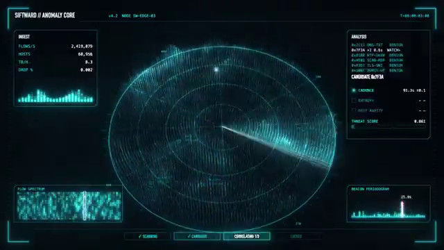</a></td>
<td width="50%" height="225" align="center" valign="middle"><a href="https://guanmo-ai.github.io/awesome-ai-motion/?lang=en#case-2107663573048803633">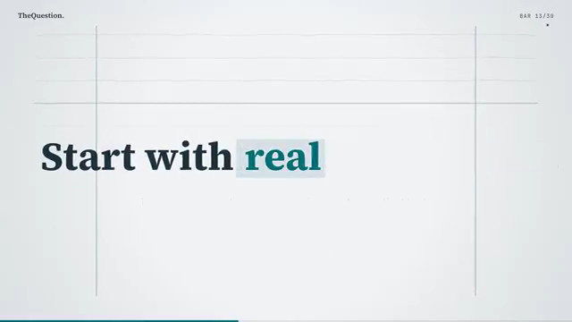</a></td>
</tr>
<tr>
<td width="50%" valign="top"><strong>SIFTWARD anomaly-detection HUD film</strong> <a href="https://x.com/zyon1527">@zyon1527</a> · Product &amp; marketing 0:10 · Bookmarks 0 · Details pending <a href="https://guanmo-ai.github.io/awesome-ai-motion/?lang=en#case-2107632257653408098">▶ Play</a> · <a href="https://x.com/zyon1527/status/2107632257653408098">Original post</a></td>
<td width="50%" valign="top"><strong>A Claude-orchestrated self-introduction</strong> <a href="https://x.com/flyfox666">@flyfox666</a> · Product &amp; marketing 1:00 · Bookmarks 0 · Details pending <a href="https://guanmo-ai.github.io/awesome-ai-motion/?lang=en#case-2107663573048803633">▶ Play</a> · <a href="https://x.com/flyfox666/status/2107663573048803633">Original post</a></td>
</tr>
</tbody>
<tbody>
<tr>
<td width="50%" height="225" align="center" valign="middle"></td>
<td width="50%" height="225" align="center" valign="middle"></td>
</tr>
<tr>
<td width="50%" valign="top"><strong>An Aidelly Business Motion Explainer</strong> <a href="https://x.com/wilzerjb">@wilzerjb</a> · Product &amp; marketing 0:46 · Bookmarks 0 · Details pending <a href="https://guanmo-ai.github.io/awesome-ai-motion/?lang=en#case-2107892042320007630">▶ Play</a> · <a href="https://x.com/wilzerjb/status/2107892042320007630">Original post</a></td>
<td width="50%" valign="top"><strong>OfficeLint: a Presentation-checking Tool Promo</strong> <a href="https://x.com/feiflow">@feiflow</a> · Product &amp; marketing 0:46 · Bookmarks 0 · Details pending <a href="https://guanmo-ai.github.io/awesome-ai-motion/?lang=en#case-2108102749493834189">▶ Play</a> · <a href="https://x.com/feiflow/status/2108102749493834189">Original post</a></td>
</tr>
</tbody>
<tbody>
<tr>
<td width="50%" height="225" align="center" valign="middle"></td>
<td width="50%" height="225" align="center" valign="middle"></td>
</tr>
<tr>
<td width="50%" valign="top"><strong>A Looping Promo for a Board-game Event</strong> <a href="https://x.com/FujiHamlet27331">@FujiHamlet27331</a> · Product &amp; marketing 0:57 · Bookmarks 0 · Details pending <a href="https://guanmo-ai.github.io/awesome-ai-motion/?lang=en#case-2108173852715176322">▶ Play</a> · <a href="https://x.com/FujiHamlet27331/status/2108173852715176322">Original post</a></td>
<td width="50%" valign="top"><strong>Men-dokoro Gokoku: a Fictional Ramen Ad</strong> <a href="https://x.com/mOAHi3nTJf40509">@mOAHi3nTJf40509</a> · Product &amp; marketing 1:54 · Bookmarks 0 · Details pending <a href="https://guanmo-ai.github.io/awesome-ai-motion/?lang=en#case-2108196031003578746">▶ Play</a> · <a href="https://x.com/mOAHi3nTJf40509/status/2108196031003578746">Original post</a></td>
</tr>
</tbody>
<tbody>
<tr>
<td width="50%" height="225" align="center" valign="middle"></td>
<td width="50%" height="225" align="center" valign="middle"></td>
</tr>
<tr>
<td width="50%" valign="top"><strong>Opus and Sonnet Compare a Personal Intro Ad</strong> <a href="https://x.com/zou_aidouga">@zou_aidouga</a> · Product &amp; marketing 0:20 · Bookmarks 0 · Details pending <a href="https://guanmo-ai.github.io/awesome-ai-motion/?lang=en#case-2108392443112731082">▶ Play</a> · <a href="https://x.com/zou_aidouga/status/2108392443112731082">Original post</a></td>
<td width="50%" valign="top"><strong>A VTuber Short Edited with Codex 6.1 Sol</strong> <a href="https://x.com/nun_game0">@nun_game0</a> · Product &amp; marketing 0:59 · Bookmarks 0 · Details pending <a href="https://guanmo-ai.github.io/awesome-ai-motion/?lang=en#case-2108501717851750420">▶ Play</a> · <a href="https://x.com/nun_game0/status/2108501717851750420">Original post</a></td>
</tr>
</tbody>
</table>
