[← 全部分类](../README.md#browse)

# 叙事短片

96 个作品。点击封面播放；没有画廊视频时会前往 X 原帖。

<table>
<tbody>
<tr>
<td width="50%" height="225" align="center" valign="middle"><a href="https://guanmo-ai.github.io/awesome-ai-motion/#case-2103116235009347650">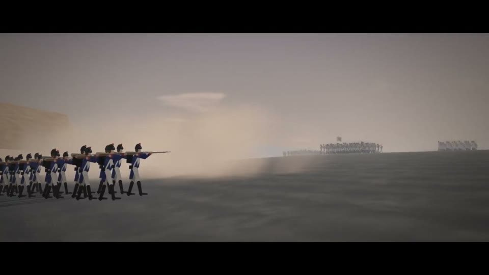</a></td>
<td width="50%" height="225" align="center" valign="middle"><a href="https://guanmo-ai.github.io/awesome-ai-motion/#case-2103381720410333314">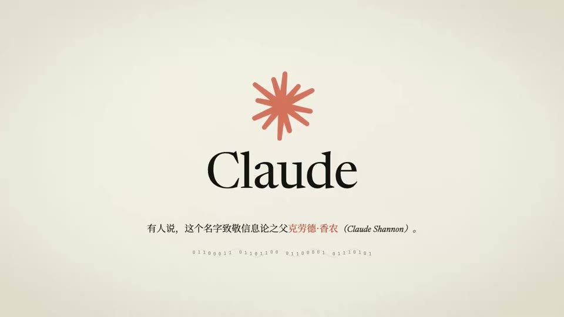</a></td>
</tr>
<tr>
<td width="50%" valign="top"><strong>用代码讲述奥斯特里茨战役</strong> <a href="https://x.com/WinterArc2125">@WinterArc2125</a> · 叙事短片 5:01 · 收藏 272 <a href="https://guanmo-ai.github.io/awesome-ai-motion/#case-2103116235009347650">▶ 播放</a> · <a href="https://x.com/WinterArc2125/status/2103116235009347650">原帖</a></td>
<td width="50%" valign="top"><strong>一句话讲 Anthropic 的发家史</strong> <a href="https://x.com/VincentWei93">@VincentWei93</a> · 叙事短片 3:44 · 收藏 1,207 <a href="https://guanmo-ai.github.io/awesome-ai-motion/#case-2103381720410333314">▶ 播放</a> · <a href="https://x.com/VincentWei93/status/2103381720410333314">原帖</a></td>
</tr>
</tbody>
<tbody>
<tr>
<td width="50%" height="225" align="center" valign="middle"><a href="https://guanmo-ai.github.io/awesome-ai-motion/#case-2103272686570918334">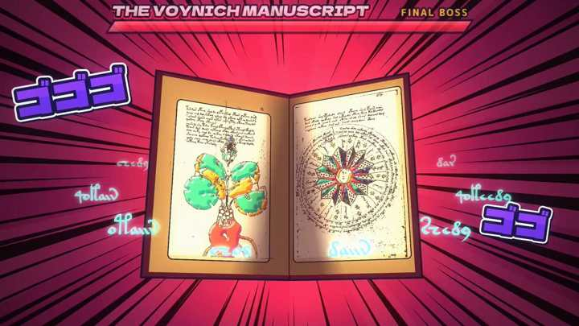</a></td>
<td width="50%" height="225" align="center" valign="middle"><a href="https://guanmo-ai.github.io/awesome-ai-motion/#case-2106144184449085474">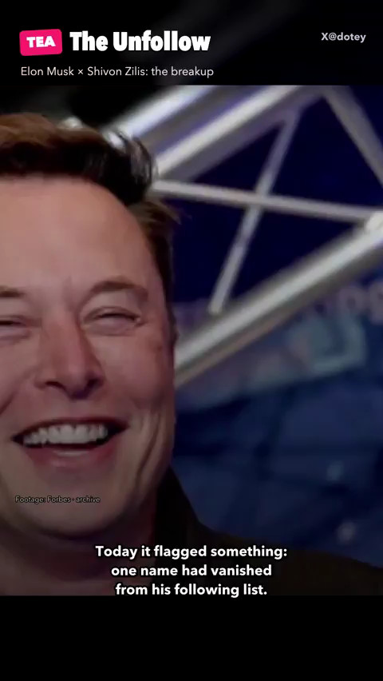</a></td>
</tr>
<tr>
<td width="50%" valign="top"><strong>无法阅读的书本动画故事</strong> <a href="https://x.com/emollick">@emollick</a> · 叙事短片 2:07 · 收藏 642 · 资料待完善 <a href="https://guanmo-ai.github.io/awesome-ai-motion/#case-2103272686570918334">▶ 播放</a> · <a href="https://x.com/emollick/status/2103272686570918334">原帖</a></td>
<td width="50%" valign="top"><strong>双语新闻叙事的自动剪辑试验</strong> <a href="https://x.com/dotey">@dotey</a> · 叙事短片 5:51 · 收藏 499 · 资料待完善 <a href="https://guanmo-ai.github.io/awesome-ai-motion/#case-2106144184449085474">▶ 播放</a> · <a href="https://x.com/dotey/status/2106144184449085474">原帖</a></td>
</tr>
</tbody>
<tbody>
<tr>
<td width="50%" height="225" align="center" valign="middle"><a href="https://guanmo-ai.github.io/awesome-ai-motion/#case-2102788223835463902">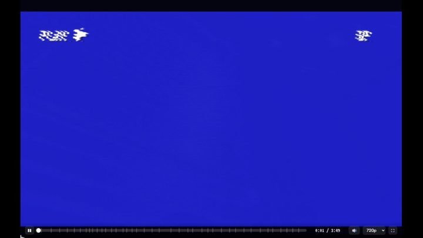</a></td>
<td width="50%" height="225" align="center" valign="middle"><a href="https://guanmo-ai.github.io/awesome-ai-motion/#case-2106091485125091695">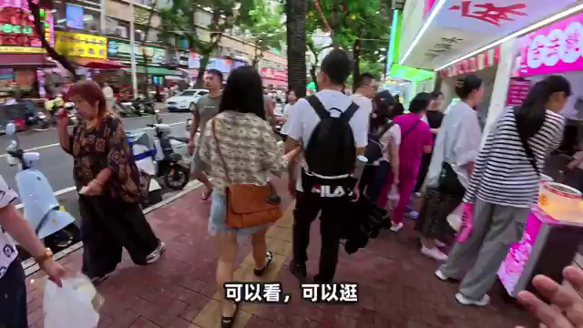</a></td>
</tr>
<tr>
<td width="50%" valign="top"><strong>九十年代风格三维故事</strong> <a href="https://x.com/scheemunai">@scheemunai</a> · 叙事短片 3:50 · 收藏 370 · 资料待完善 <a href="https://guanmo-ai.github.io/awesome-ai-motion/#case-2102788223835463902">▶ 播放</a> · <a href="https://x.com/scheemunai/status/2102788223835463902">原帖</a></td>
<td width="50%" valign="top"><strong>汕头 Day 1：AI 剪辑 Vlog</strong> <a href="https://x.com/dashiAIxz">@dashiAIxz</a> · 叙事短片 4:25 · 收藏 197 · 资料待完善 <a href="https://guanmo-ai.github.io/awesome-ai-motion/#case-2106091485125091695">▶ 播放</a> · <a href="https://x.com/dashiAIxz/status/2106091485125091695">原帖</a></td>
</tr>
</tbody>
<tbody>
<tr>
<td width="50%" height="225" align="center" valign="middle"></td>
<td width="50%" height="225" align="center" valign="middle"><a href="https://guanmo-ai.github.io/awesome-ai-motion/#case-2104392249400594823">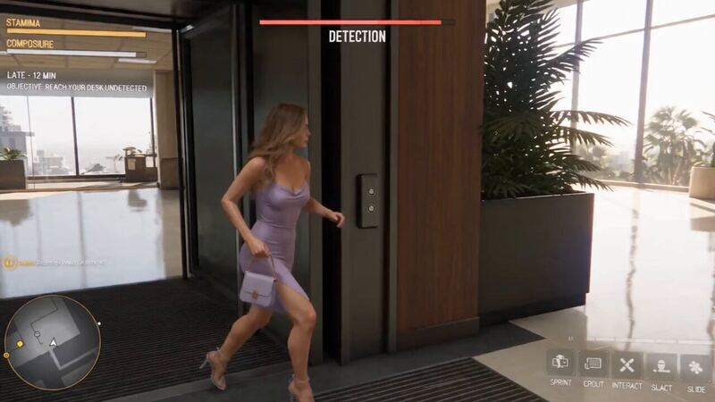</a></td>
</tr>
<tr>
<td width="50%" valign="top"><strong>雨夜站台的 30 秒重逢</strong> <a href="https://x.com/zhu185178">@zhu185178</a> · 叙事短片 0:30 · 收藏 100 <a href="https://guanmo-ai.github.io/awesome-ai-motion/#case-2103757767727255661">▶ 播放</a> · <a href="https://x.com/zhu185178/status/2103757767727255661">原帖</a></td>
<td width="50%" valign="top"><strong>赶到工位前别被发现：办公室追逐短片</strong> <a href="https://x.com/AIwithJessica">@AIwithJessica</a> · 叙事短片 0:30 · 收藏 7 · 资料待完善 <a href="https://guanmo-ai.github.io/awesome-ai-motion/#case-2104392249400594823">▶ 播放</a> · <a href="https://x.com/AIwithJessica/status/2104392249400594823">原帖</a></td>
</tr>
</tbody>
<tbody>
<tr>
<td width="50%" height="225" align="center" valign="middle"></td>
<td width="50%" height="225" align="center" valign="middle"><a href="https://guanmo-ai.github.io/awesome-ai-motion/#case-2105354432460554648">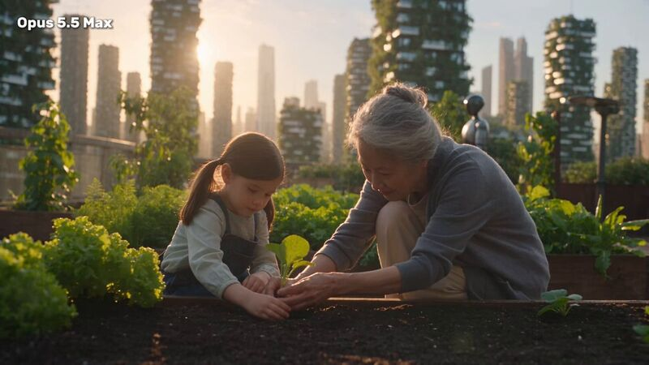</a></td>
</tr>
<tr>
<td width="50%" valign="top"><strong>天坛穿越：响指换装</strong> <a href="https://x.com/Adam38363368936">@Adam38363368936</a> · 叙事短片 0:10 · 收藏 2 · 资料待完善 <a href="https://guanmo-ai.github.io/awesome-ai-motion/#case-2107469294238134394">▶ 播放</a> · <a href="https://x.com/Adam38363368936/status/2107469294238134394">原帖</a></td>
<td width="50%" valign="top"><strong>人类未来：Opus 与 Astra 同题对比</strong> <a href="https://x.com/yulikay">@yulikay</a> · 叙事短片 0:30 · 收藏 1 · 资料待完善 <a href="https://guanmo-ai.github.io/awesome-ai-motion/#case-2105354432460554648">▶ 播放</a> · <a href="https://x.com/yulikay/status/2105354432460554648">原帖</a></td>
</tr>
</tbody>
<tbody>
<tr>
<td width="50%" height="225" align="center" valign="middle"></td>
<td width="50%" height="225" align="center" valign="middle"></td>
</tr>
<tr>
<td width="50%" valign="top"><strong>不想被修好的程序错误</strong> <a href="https://x.com/KamStudioLabs">@KamStudioLabs</a> · 叙事短片 1:30 · 收藏 1 · 资料待完善 <a href="https://guanmo-ai.github.io/awesome-ai-motion/#case-2102903173161877996">▶ 播放</a> · <a href="https://x.com/KamStudioLabs/status/2102903173161877996">原帖</a></td>
<td width="50%" valign="top"><strong>瀑布与林间步道：Seedance 2.5 自然短片</strong> <a href="https://x.com/ZorviaLux">@ZorviaLux</a> · 叙事短片 0:15 · 收藏 0 · 资料待完善 <a href="https://guanmo-ai.github.io/awesome-ai-motion/#case-2104443232512020686">▶ 播放</a> · <a href="https://x.com/ZorviaLux/status/2104443232512020686">原帖</a></td>
</tr>
</tbody>
<tbody>
<tr>
<td width="50%" height="225" align="center" valign="middle"><a href="https://guanmo-ai.github.io/awesome-ai-motion/#case-2102908742518100086">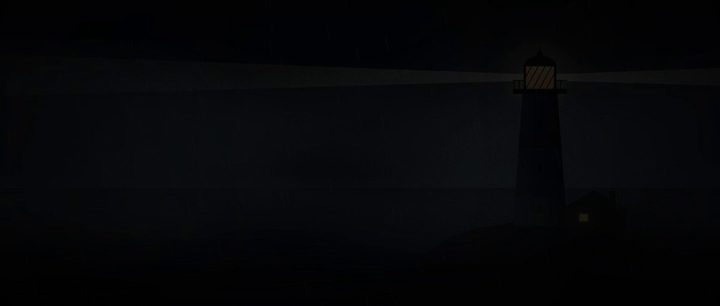</a></td>
<td width="50%" height="225" align="center" valign="middle"></td>
</tr>
<tr>
<td width="50%" valign="top"><strong>灯塔守夜人的无对白故事</strong> <a href="https://x.com/KamStudioLabs">@KamStudioLabs</a> · 叙事短片 0:46 · 收藏 0 · 资料待完善 <a href="https://guanmo-ai.github.io/awesome-ai-motion/#case-2102908742518100086">▶ 播放</a> · <a href="https://x.com/KamStudioLabs/status/2102908742518100086">原帖</a></td>
<td width="50%" valign="top"><strong>关于家的剪影纸戏</strong> <a href="https://x.com/x4b47x">@x4b47x</a> · 叙事短片 0:57 · 收藏 0 · 资料待完善 <a href="https://guanmo-ai.github.io/awesome-ai-motion/#case-2103019799614034026">▶ 播放</a> · <a href="https://x.com/x4b47x/status/2103019799614034026">原帖</a></td>
</tr>
</tbody>
<tbody>
<tr>
<td width="50%" height="225" align="center" valign="middle"></td>
<td width="50%" height="225" align="center" valign="middle"></td>
</tr>
<tr>
<td width="50%" valign="top"><strong>迷宫空间的 Blender 短片</strong> <a href="https://x.com/duncantrussell">@duncantrussell</a> · 叙事短片 0:20 · 收藏 4,514 · 资料待完善 <a href="https://guanmo-ai.github.io/awesome-ai-motion/#case-2096003511104508411">▶ 播放</a> · <a href="https://x.com/duncantrussell/status/2096003511104508411">原帖</a></td>
<td width="50%" valign="top"><strong>写实视频的多工具编排</strong> <a href="https://x.com/abxxai">@abxxai</a> · 叙事短片 0:19 · 收藏 3,897 · 资料待完善 <a href="https://guanmo-ai.github.io/awesome-ai-motion/#case-2102775755646337530">▶ 播放</a> · <a href="https://x.com/abxxai/status/2102775755646337530">原帖</a></td>
</tr>
</tbody>
<tbody>
<tr>
<td width="50%" height="225" align="center" valign="middle"></td>
<td width="50%" height="225" align="center" valign="middle"></td>
</tr>
<tr>
<td width="50%" valign="top"><strong>女孩向 Claude 提问的短片</strong> <a href="https://x.com/kevin_t_ngo">@kevin_t_ngo</a> · 叙事短片 0:28 · 收藏 2,902 · 资料待完善 <a href="https://guanmo-ai.github.io/awesome-ai-motion/#case-2102437977435893771">▶ 播放</a> · <a href="https://x.com/kevin_t_ngo/status/2102437977435893771">原帖</a></td>
<td width="50%" valign="top"><strong>火星探测器短片</strong> <a href="https://x.com/AndrewOnXYZ">@AndrewOnXYZ</a> · 叙事短片 3:59 · 收藏 2,163 · 资料待完善 <a href="https://guanmo-ai.github.io/awesome-ai-motion/#case-2102512879258009818">▶ 播放</a> · <a href="https://x.com/AndrewOnXYZ/status/2102512879258009818">原帖</a></td>
</tr>
</tbody>
<tbody>
<tr>
<td width="50%" height="225" align="center" valign="middle"><a href="https://guanmo-ai.github.io/awesome-ai-motion/#case-2102495989194236158">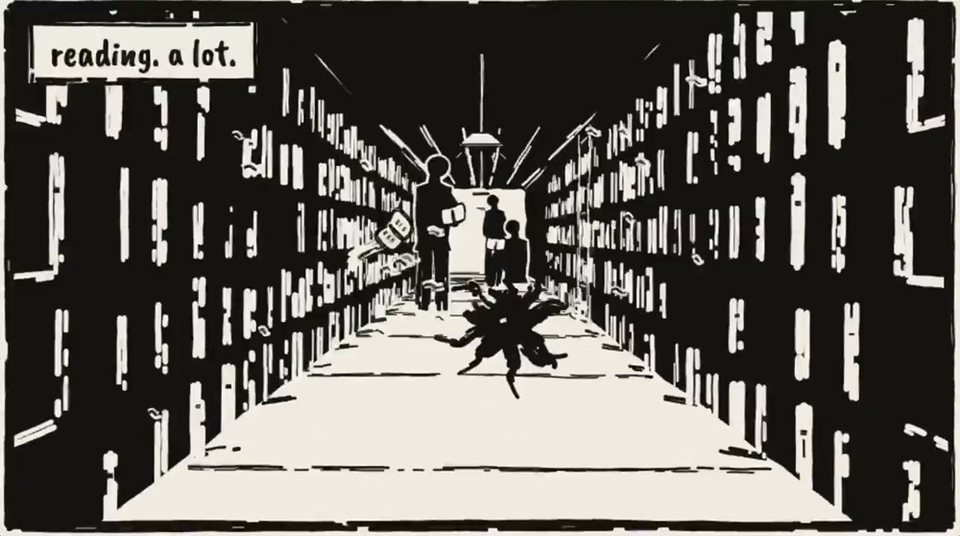</a></td>
<td width="50%" height="225" align="center" valign="middle"></td>
</tr>
<tr>
<td width="50%" valign="top"><strong>用画笔讲述模型的一生</strong> <a href="https://x.com/shfred0">@shfred0</a> · 叙事短片 0:30 · 收藏 1,732 <a href="https://guanmo-ai.github.io/awesome-ai-motion/#case-2102495989194236158">▶ 播放</a> · <a href="https://x.com/shfred0/status/2102495989194236158">原帖</a></td>
<td width="50%" valign="top"><strong>复古动画序列：Blender 与生成镜头协作</strong> <a href="https://x.com/AIWarper">@AIWarper</a> · 叙事短片 0:25 · 收藏 1,577 · 资料待完善 <a href="https://guanmo-ai.github.io/awesome-ai-motion/#case-2106466745661980904">▶ 播放</a> · <a href="https://x.com/AIWarper/status/2106466745661980904">原帖</a></td>
</tr>
</tbody>
<tbody>
<tr>
<td width="50%" height="225" align="center" valign="middle"><a href="https://guanmo-ai.github.io/awesome-ai-motion/#case-2102573127192727704">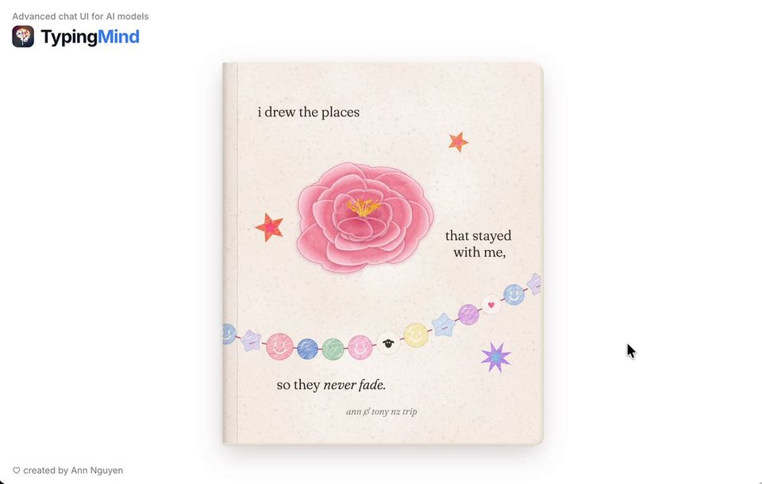</a></td>
<td width="50%" height="225" align="center" valign="middle"><a href="https://guanmo-ai.github.io/awesome-ai-motion/#case-2102498589259821559">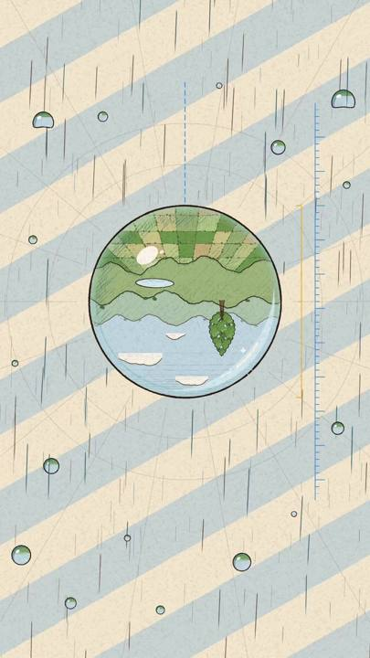</a></td>
</tr>
<tr>
<td width="50%" valign="top"><strong>把旅行照片画成丙烯动画</strong> <a href="https://x.com/ann_nnng">@ann_nnng</a> · 叙事短片 0:22 · 收藏 1,250 <a href="https://guanmo-ai.github.io/awesome-ai-motion/#case-2102573127192727704">▶ 播放</a> · <a href="https://x.com/ann_nnng/status/2102573127192727704">原帖</a></td>
<td width="50%" valign="top"><strong>一滴雨的故事动画</strong> <a href="https://x.com/aollivier82">@aollivier82</a> · 叙事短片 0:32 · 收藏 988 · 资料待完善 <a href="https://guanmo-ai.github.io/awesome-ai-motion/#case-2102498589259821559">▶ 播放</a> · <a href="https://x.com/aollivier82/status/2102498589259821559">原帖</a></td>
</tr>
</tbody>
<tbody>
<tr>
<td width="50%" height="225" align="center" valign="middle"><a href="https://guanmo-ai.github.io/awesome-ai-motion/#case-2102493303388475855">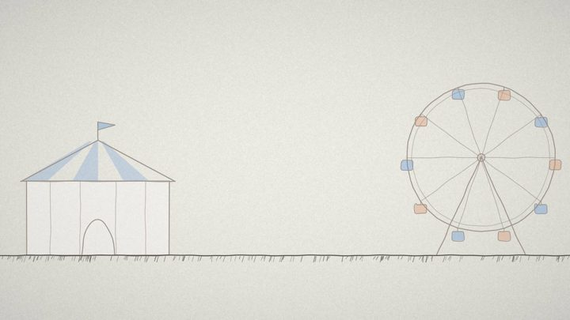</a></td>
<td width="50%" height="225" align="center" valign="middle"><a href="https://guanmo-ai.github.io/awesome-ai-motion/#case-2102645793828036643">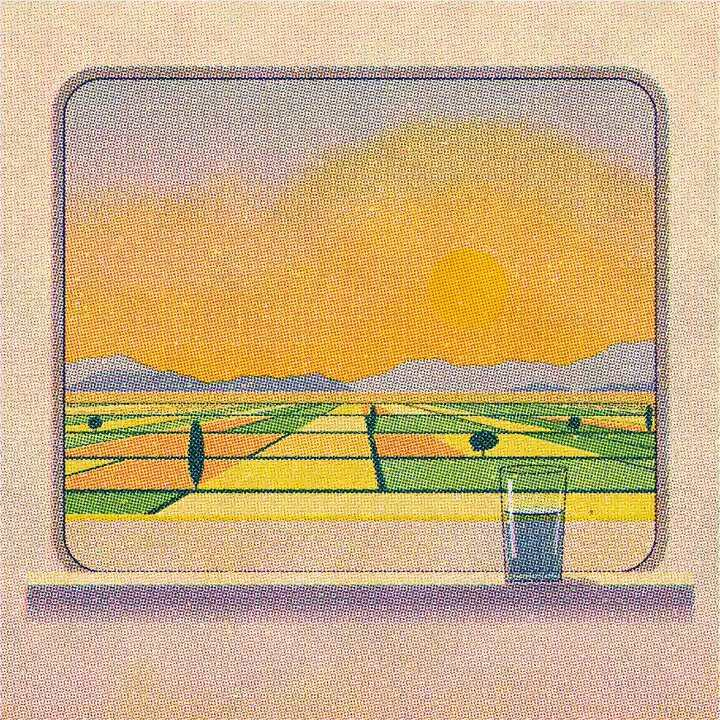</a></td>
</tr>
<tr>
<td width="50%" valign="top"><strong>啤酒节短动画</strong> <a href="https://x.com/cherry_mx_reds">@cherry_mx_reds</a> · 叙事短片 0:30 · 收藏 852 · 资料待完善 <a href="https://guanmo-ai.github.io/awesome-ai-motion/#case-2102493303388475855">▶ 播放</a> · <a href="https://x.com/cherry_mx_reds/status/2102493303388475855">原帖</a></td>
<td width="50%" valign="top"><strong>单页生成的七十八秒动画</strong> <a href="https://x.com/jurlycat">@jurlycat</a> · 叙事短片 1:18 · 收藏 812 · 资料待完善 <a href="https://guanmo-ai.github.io/awesome-ai-motion/#case-2102645793828036643">▶ 播放</a> · <a href="https://x.com/jurlycat/status/2102645793828036643">原帖</a></td>
</tr>
</tbody>
<tbody>
<tr>
<td width="50%" height="225" align="center" valign="middle"><a href="https://guanmo-ai.github.io/awesome-ai-motion/#case-2102531681450119426">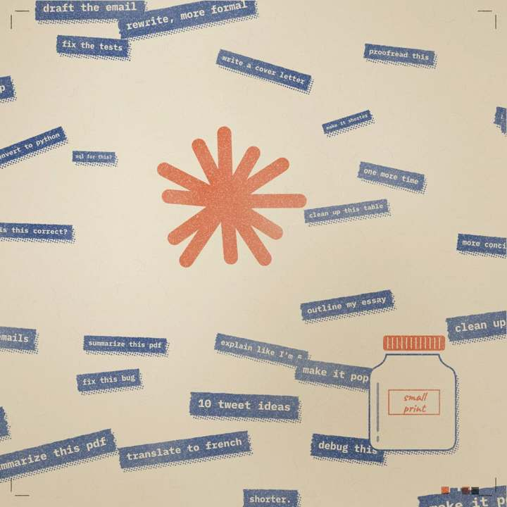</a></td>
<td width="50%" height="225" align="center" valign="middle"><a href="https://guanmo-ai.github.io/awesome-ai-motion/#case-2106236856979607569">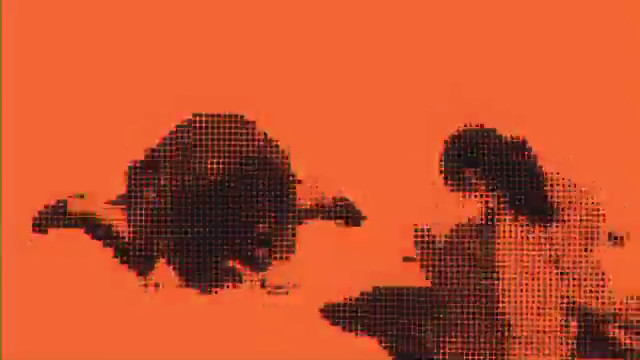</a></td>
</tr>
<tr>
<td width="50%" valign="top"><strong>Small Print 文字故事动画</strong> <a href="https://x.com/Voxyz_ai">@Voxyz_ai</a> · 叙事短片 0:29 · 收藏 796 · 资料待完善 <a href="https://guanmo-ai.github.io/awesome-ai-motion/#case-2102531681450119426">▶ 播放</a> · <a href="https://x.com/Voxyz_ai/status/2102531681450119426">原帖</a></td>
<td width="50%" valign="top"><strong>Dot Battle：格斗画面的粒子重建</strong> <a href="https://x.com/aicreataro">@aicreataro</a> · 叙事短片 0:20 · 收藏 789 · 资料待完善 <a href="https://guanmo-ai.github.io/awesome-ai-motion/#case-2106236856979607569">▶ 播放</a> · <a href="https://x.com/aicreataro/status/2106236856979607569">原帖</a></td>
</tr>
</tbody>
<tbody>
<tr>
<td width="50%" height="225" align="center" valign="middle"></td>
<td width="50%" height="225" align="center" valign="middle"><a href="https://guanmo-ai.github.io/awesome-ai-motion/#case-2102986085328716066">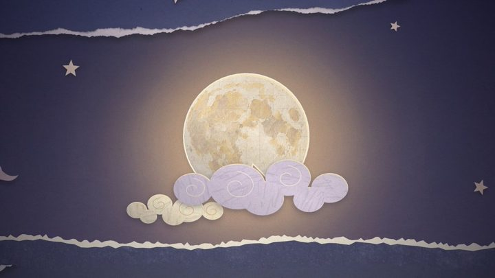</a></td>
</tr>
<tr>
<td width="50%" valign="top"><strong>《Pizza Galaxy》：Midjourney 与 Runway 科幻短片</strong> <a href="https://x.com/Wytsekoetse">@Wytsekoetse</a> · 叙事短片 0:58 · 收藏 507 · 资料待完善 <a href="https://guanmo-ai.github.io/awesome-ai-motion/#case-1913547157493162035">▶ 播放</a> · <a href="https://x.com/Wytsekoetse/status/1913547157493162035">原帖</a></td>
<td width="50%" valign="top"><strong>中秋夜景的拼贴动画</strong> <a href="https://x.com/ring_hyacinth">@ring_hyacinth</a> · 叙事短片 0:40 · 收藏 492 · 资料待完善 <a href="https://guanmo-ai.github.io/awesome-ai-motion/#case-2102986085328716066">▶ 播放</a> · <a href="https://x.com/ring_hyacinth/status/2102986085328716066">原帖</a></td>
</tr>
</tbody>
<tbody>
<tr>
<td width="50%" height="225" align="center" valign="middle"><a href="https://guanmo-ai.github.io/awesome-ai-motion/#case-2102478640428773861">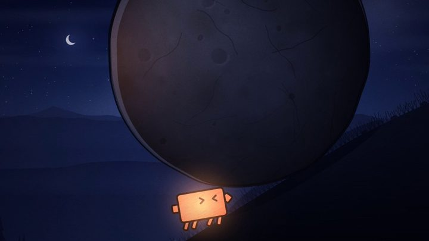</a></td>
<td width="50%" height="225" align="center" valign="middle"><a href="https://guanmo-ai.github.io/awesome-ai-motion/#case-2103523994440012086">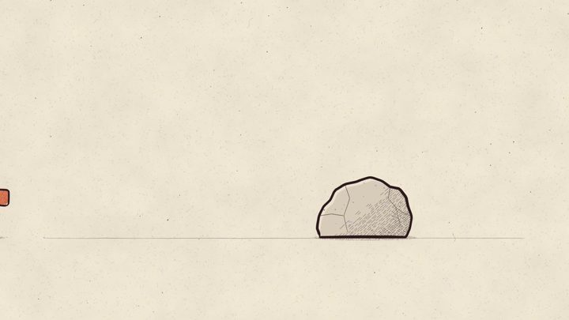</a></td>
</tr>
<tr>
<td width="50%" valign="top"><strong>用代码想象难题求解</strong> <a href="https://x.com/chetaslua">@chetaslua</a> · 叙事短片 0:30 · 收藏 393 · 资料待完善 <a href="https://guanmo-ai.github.io/awesome-ai-motion/#case-2102478640428773861">▶ 播放</a> · <a href="https://x.com/chetaslua/status/2102478640428773861">原帖</a></td>
<td width="50%" valign="top"><strong>从岩石到 AI 的短片</strong> <a href="https://x.com/devteamdrew">@devteamdrew</a> · 叙事短片 3:00 · 收藏 381 · 资料待完善 <a href="https://guanmo-ai.github.io/awesome-ai-motion/#case-2103523994440012086">▶ 播放</a> · <a href="https://x.com/devteamdrew/status/2103523994440012086">原帖</a></td>
</tr>
</tbody>
<tbody>
<tr>
<td width="50%" height="225" align="center" valign="middle"><a href="https://guanmo-ai.github.io/awesome-ai-motion/#case-2103457566978162901">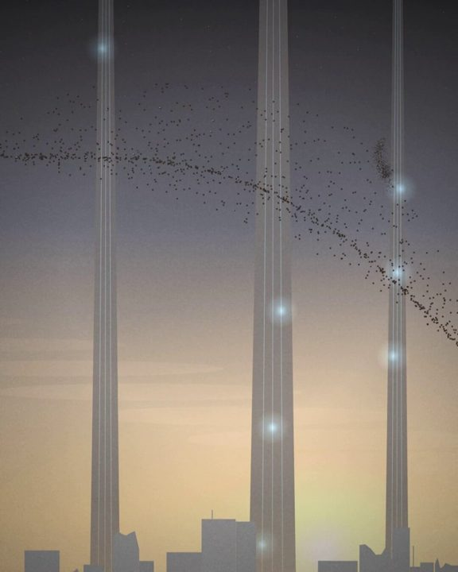</a></td>
<td width="50%" height="225" align="center" valign="middle"><a href="https://guanmo-ai.github.io/awesome-ai-motion/#case-2104186357824487573">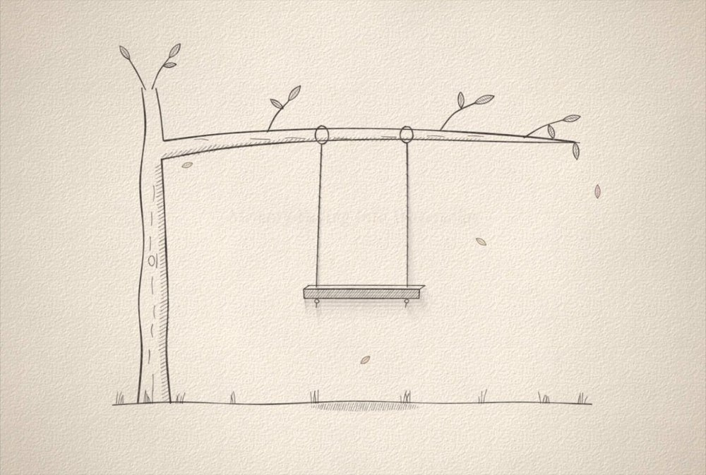</a></td>
</tr>
<tr>
<td width="50%" valign="top"><strong>无人世界的未来寓言</strong> <a href="https://x.com/Hesamation">@Hesamation</a> · 叙事短片 1:28 · 收藏 355 · 资料待完善 <a href="https://guanmo-ai.github.io/awesome-ai-motion/#case-2103457566978162901">▶ 播放</a> · <a href="https://x.com/Hesamation/status/2103457566978162901">原帖</a></td>
<td width="50%" valign="top"><strong>记忆褪成水彩：代码绘制的短片</strong> <a href="https://x.com/techartist_">@techartist_</a> · 叙事短片 0:12 · 收藏 260 · 资料待完善 <a href="https://guanmo-ai.github.io/awesome-ai-motion/#case-2104186357824487573">▶ 播放</a> · <a href="https://x.com/techartist_/status/2104186357824487573">原帖</a></td>
</tr>
</tbody>
<tbody>
<tr>
<td width="50%" height="225" align="center" valign="middle"><a href="https://guanmo-ai.github.io/awesome-ai-motion/#case-2102558320695402885">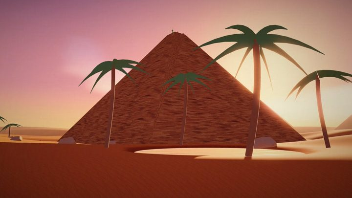</a></td>
<td width="50%" height="225" align="center" valign="middle"><a href="https://guanmo-ai.github.io/awesome-ai-motion/#case-2103465246014746943">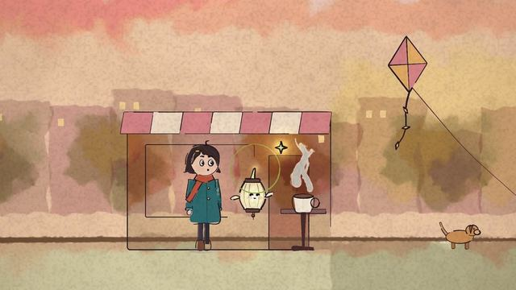</a></td>
</tr>
<tr>
<td width="50%" valign="top"><strong>火柴人闯迷宫动画</strong> <a href="https://x.com/ForwardEditor">@ForwardEditor</a> · 叙事短片 1:47 · 收藏 142 · 资料待完善 <a href="https://guanmo-ai.github.io/awesome-ai-motion/#case-2102558320695402885">▶ 播放</a> · <a href="https://x.com/ForwardEditor/status/2102558320695402885">原帖</a></td>
<td width="50%" valign="top"><strong>手绘水彩感短片</strong> <a href="https://x.com/mablesjoseph">@mablesjoseph</a> · 叙事短片 0:46 · 收藏 127 · 资料待完善 <a href="https://guanmo-ai.github.io/awesome-ai-motion/#case-2103465246014746943">▶ 播放</a> · <a href="https://x.com/mablesjoseph/status/2103465246014746943">原帖</a></td>
</tr>
</tbody>
<tbody>
<tr>
<td width="50%" height="225" align="center" valign="middle"><a href="https://guanmo-ai.github.io/awesome-ai-motion/#case-2104392800892764552">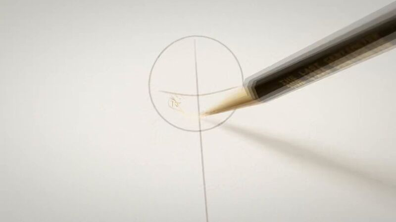</a></td>
<td width="50%" height="225" align="center" valign="middle"><a href="https://guanmo-ai.github.io/awesome-ai-motion/#case-2103997282270248974">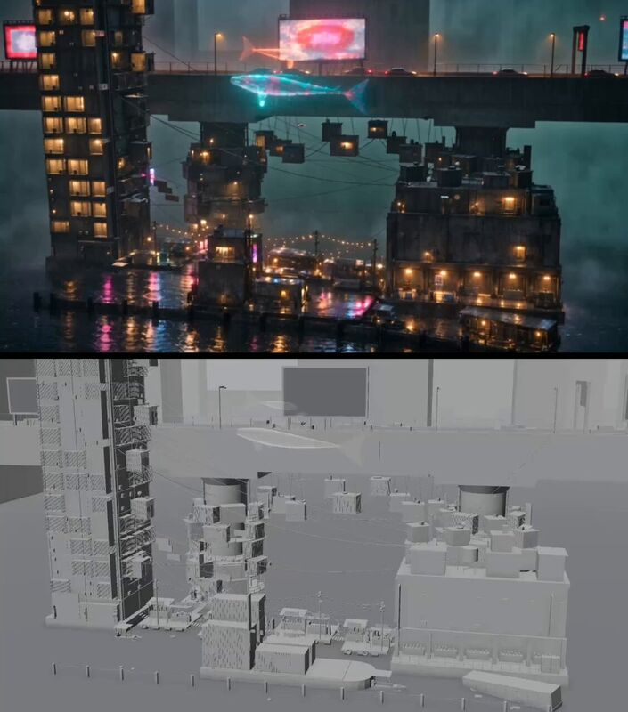</a></td>
</tr>
<tr>
<td width="50%" valign="top"><strong>Andy 的 Opus 单句动画实验</strong> <a href="https://x.com/AndyL5cc">@AndyL5cc</a> · 叙事短片 1:12 · 收藏 125 · 资料待完善 <a href="https://guanmo-ai.github.io/awesome-ai-motion/#case-2104392800892764552">▶ 播放</a> · <a href="https://x.com/AndyL5cc/status/2104392800892764552">原帖</a></td>
<td width="50%" valign="top"><strong>第七区下层：三维城市预演转视频</strong> <a href="https://x.com/akakuma0219">@akakuma0219</a> · 叙事短片 0:20 · 收藏 122 · 资料待完善 <a href="https://guanmo-ai.github.io/awesome-ai-motion/#case-2103997282270248974">▶ 播放</a> · <a href="https://x.com/akakuma0219/status/2103997282270248974">原帖</a></td>
</tr>
</tbody>
<tbody>
<tr>
<td width="50%" height="225" align="center" valign="middle"></td>
<td width="50%" height="225" align="center" valign="middle"></td>
</tr>
<tr>
<td width="50%" valign="top"><strong>小蝌蚪找妈妈水墨短片</strong> <a href="https://x.com/akokoi1">@akokoi1</a> · 叙事短片 3:55 · 收藏 113 · 资料待完善 <a href="https://guanmo-ai.github.io/awesome-ai-motion/#case-2102699703309898026">▶ 播放</a> · <a href="https://x.com/akokoi1/status/2102699703309898026">原帖</a></td>
<td width="50%" valign="top"><strong>星星与猫的程序化动画</strong> <a href="https://x.com/onofumi_AI">@onofumi_AI</a> · 叙事短片 0:17 · 收藏 95 · 资料待完善 <a href="https://guanmo-ai.github.io/awesome-ai-motion/#case-2102535945333657960">▶ 播放</a> · <a href="https://x.com/onofumi_AI/status/2102535945333657960">原帖</a></td>
</tr>
</tbody>
<tbody>
<tr>
<td width="50%" height="225" align="center" valign="middle"><a href="https://guanmo-ai.github.io/awesome-ai-motion/#case-2103380404791333144">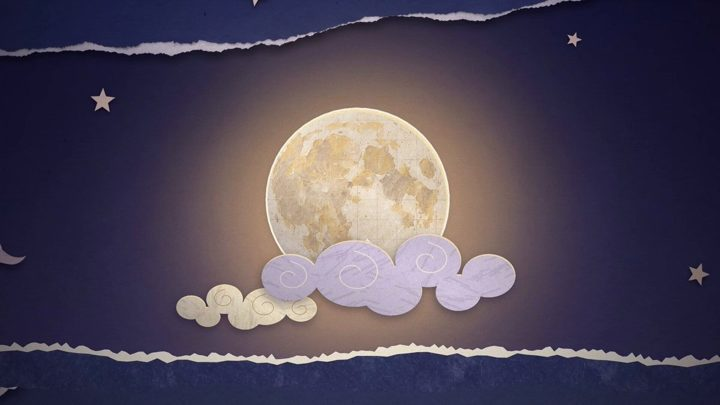</a></td>
<td width="50%" height="225" align="center" valign="middle"><a href="https://guanmo-ai.github.io/awesome-ai-motion/#case-2102726428991373480">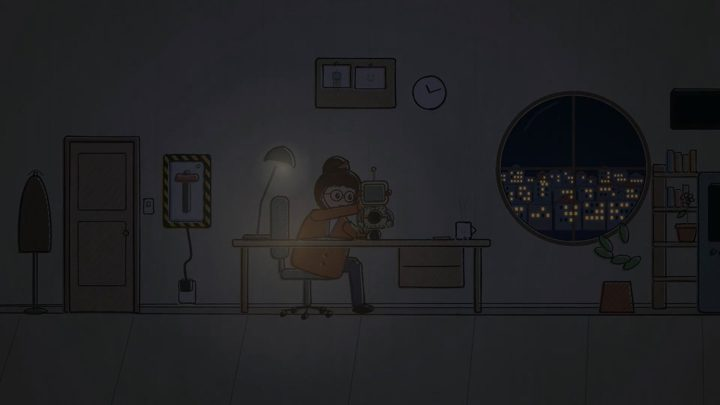</a></td>
</tr>
<tr>
<td width="50%" valign="top"><strong>上海夜景中秋剪纸动画</strong> <a href="https://x.com/NFT_Chen">@NFT_Chen</a> · 叙事短片 0:39 · 收藏 83 · 资料待完善 <a href="https://guanmo-ai.github.io/awesome-ai-motion/#case-2103380404791333144">▶ 播放</a> · <a href="https://x.com/NFT_Chen/status/2103380404791333144">原帖</a></td>
<td width="50%" valign="top"><strong>机器人短篇动画</strong> <a href="https://x.com/ctgptlb">@ctgptlb</a> · 叙事短片 1:04 · 收藏 78 · 资料待完善 <a href="https://guanmo-ai.github.io/awesome-ai-motion/#case-2102726428991373480">▶ 播放</a> · <a href="https://x.com/ctgptlb/status/2102726428991373480">原帖</a></td>
</tr>
</tbody>
<tbody>
<tr>
<td width="50%" height="225" align="center" valign="middle"><a href="https://guanmo-ai.github.io/awesome-ai-motion/#case-2106190496075035096">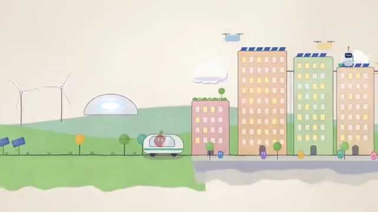</a></td>
<td width="50%" height="225" align="center" valign="middle"><a href="https://guanmo-ai.github.io/awesome-ai-motion/#case-2103149275945517546">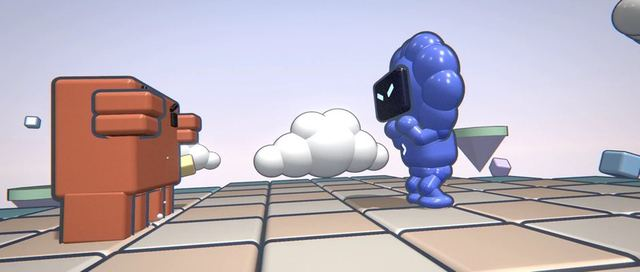</a></td>
</tr>
<tr>
<td width="50%" valign="top"><strong>2076：未来世界的 25 秒想象</strong> <a href="https://x.com/Layton_Gott">@Layton_Gott</a> · 叙事短片 0:26 · 收藏 74 · 资料待完善 <a href="https://guanmo-ai.github.io/awesome-ai-motion/#case-2106190496075035096">▶ 播放</a> · <a href="https://x.com/Layton_Gott/status/2106190496075035096">原帖</a></td>
<td width="50%" valign="top"><strong>一分钟格斗动画</strong> <a href="https://x.com/akokoi1">@akokoi1</a> · 叙事短片 1:00 · 收藏 64 · 资料待完善 <a href="https://guanmo-ai.github.io/awesome-ai-motion/#case-2103149275945517546">▶ 播放</a> · <a href="https://x.com/akokoi1/status/2103149275945517546">原帖</a></td>
</tr>
</tbody>
<tbody>
<tr>
<td width="50%" height="225" align="center" valign="middle"><a href="https://guanmo-ai.github.io/awesome-ai-motion/#case-2102574688769650976">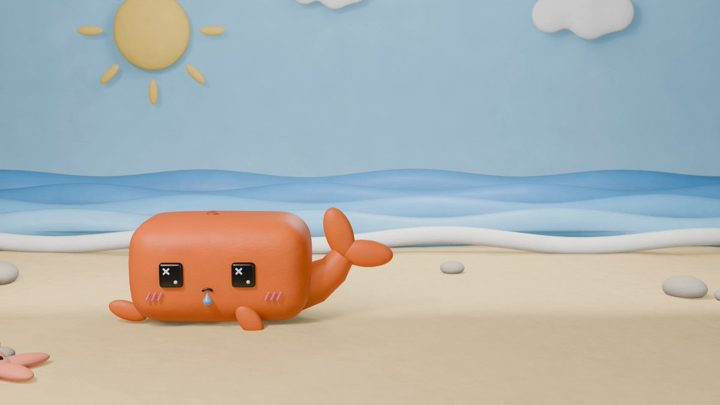</a></td>
<td width="50%" height="225" align="center" valign="middle"><a href="https://guanmo-ai.github.io/awesome-ai-motion/#case-2103475507471806929">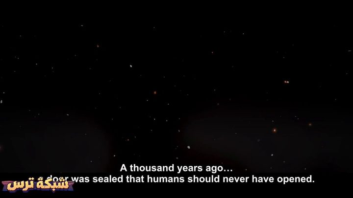</a></td>
</tr>
<tr>
<td width="50%" valign="top"><strong>小芽苗的黏土动画</strong> <a href="https://x.com/cherry_mx_reds">@cherry_mx_reds</a> · 叙事短片 0:30 · 收藏 63 · 资料待完善 <a href="https://guanmo-ai.github.io/awesome-ai-motion/#case-2102574688769650976">▶ 播放</a> · <a href="https://x.com/cherry_mx_reds/status/2102574688769650976">原帖</a></td>
<td width="50%" valign="top"><strong>阿拉伯语配音动漫试播片</strong> <a href="https://x.com/sbalhatlani">@sbalhatlani</a> · 叙事短片 8:33 · 收藏 63 · 资料待完善 <a href="https://guanmo-ai.github.io/awesome-ai-motion/#case-2103475507471806929">▶ 播放</a> · <a href="https://x.com/sbalhatlani/status/2103475507471806929">原帖</a></td>
</tr>
</tbody>
<tbody>
<tr>
<td width="50%" height="225" align="center" valign="middle"><a href="https://guanmo-ai.github.io/awesome-ai-motion/#case-2102884238576296179">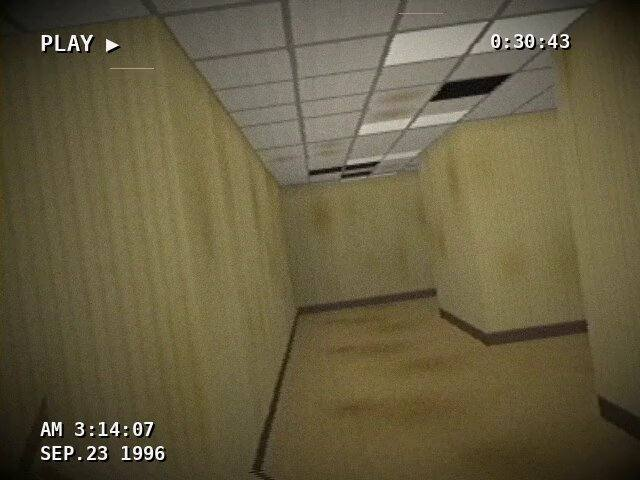</a></td>
<td width="50%" height="225" align="center" valign="middle"><a href="https://guanmo-ai.github.io/awesome-ai-motion/#case-2107396397800841635">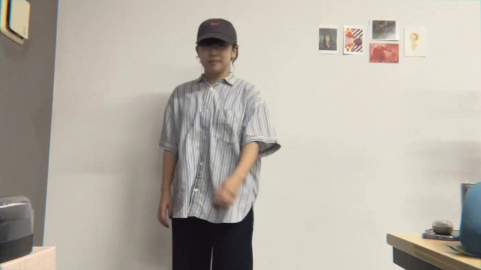</a></td>
</tr>
<tr>
<td width="50%" valign="top"><strong>密室迷宫的寻获影像</strong> <a href="https://x.com/goodside">@goodside</a> · 叙事短片 0:30 · 收藏 57 · 资料待完善 <a href="https://guanmo-ai.github.io/awesome-ai-motion/#case-2102884238576296179">▶ 播放</a> · <a href="https://x.com/goodside/status/2102884238576296179">原帖</a></td>
<td width="50%" valign="top"><strong>同一支舞的骨架与粒子变换</strong> <a href="https://x.com/aicreataro">@aicreataro</a> · 叙事短片 0:23 · 收藏 57 · 资料待完善 <a href="https://guanmo-ai.github.io/awesome-ai-motion/#case-2107396397800841635">▶ 播放</a> · <a href="https://x.com/aicreataro/status/2107396397800841635">原帖</a></td>
</tr>
</tbody>
<tbody>
<tr>
<td width="50%" height="225" align="center" valign="middle"><a href="https://guanmo-ai.github.io/awesome-ai-motion/#case-2103247844542922825">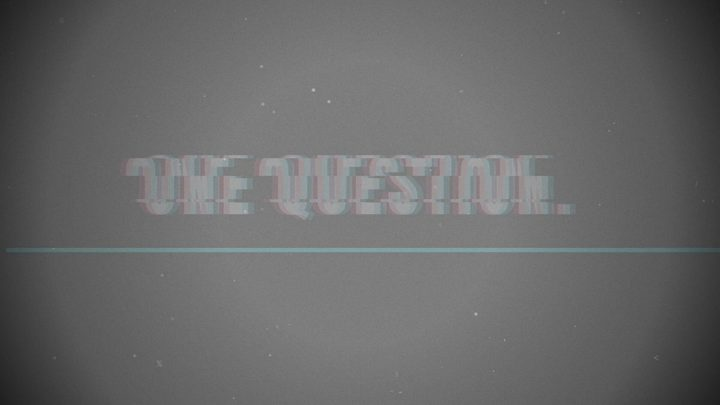</a></td>
<td width="50%" height="225" align="center" valign="middle"><a href="https://guanmo-ai.github.io/awesome-ai-motion/#case-2103976291699728742">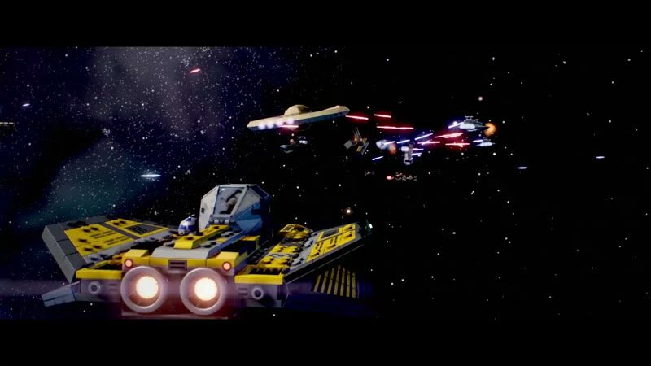</a></td>
</tr>
<tr>
<td width="50%" valign="top"><strong>代码绘制的动漫预告片</strong> <a href="https://x.com/ishuagra02">@ishuagra02</a> · 叙事短片 1:41 · 收藏 44 · 资料待完善 <a href="https://guanmo-ai.github.io/awesome-ai-motion/#case-2103247844542922825">▶ 播放</a> · <a href="https://x.com/ishuagra02/status/2103247844542922825">原帖</a></td>
<td width="50%" valign="top"><strong>LEGO 风格《西斯的复仇》开场复刻</strong> <a href="https://x.com/ChrisGPT">@ChrisGPT</a> · 叙事短片 1:37 · 收藏 33 · 资料待完善 <a href="https://guanmo-ai.github.io/awesome-ai-motion/#case-2103976291699728742">▶ 播放</a> · <a href="https://x.com/ChrisGPT/status/2103976291699728742">原帖</a></td>
</tr>
</tbody>
<tbody>
<tr>
<td width="50%" height="225" align="center" valign="middle"></td>
<td width="50%" height="225" align="center" valign="middle"><a href="https://guanmo-ai.github.io/awesome-ai-motion/#case-2106041578204655748">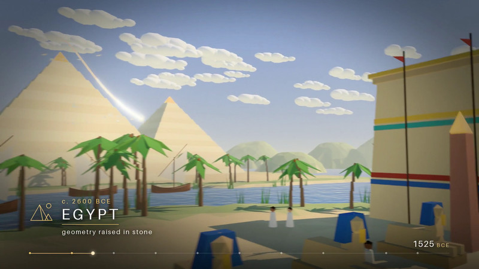</a></td>
</tr>
<tr>
<td width="50%" valign="top"><strong>儿童角色动画短片</strong> <a href="https://x.com/jackfriks">@jackfriks</a> · 叙事短片 0:35 · 收藏 30 · 资料待完善 <a href="https://guanmo-ai.github.io/awesome-ai-motion/#case-2103525576912855363">▶ 播放</a> · <a href="https://x.com/jackfriks/status/2103525576912855363">原帖</a></td>
<td width="50%" valign="top"><strong>人类：从古代到当代的代码动画</strong> <a href="https://x.com/blueemi99">@blueemi99</a> · 叙事短片 2:00 · 收藏 28 · 资料待完善 <a href="https://guanmo-ai.github.io/awesome-ai-motion/#case-2106041578204655748">▶ 播放</a> · <a href="https://x.com/blueemi99/status/2106041578204655748">原帖</a></td>
</tr>
</tbody>
<tbody>
<tr>
<td width="50%" height="225" align="center" valign="middle"></td>
<td width="50%" height="225" align="center" valign="middle"><a href="https://guanmo-ai.github.io/awesome-ai-motion/#case-2104039075175182487">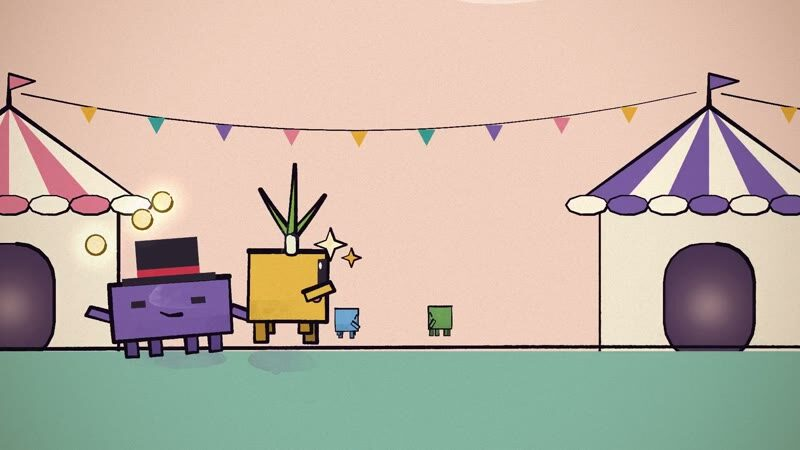</a></td>
</tr>
<tr>
<td width="50%" valign="top"><strong>Simon G. Farmer 的 Runway Gen-4 竞赛短片</strong> <a href="https://x.com/SimonGFarmer">@SimonGFarmer</a> · 叙事短片 4:00 · 收藏 14 · 资料待完善 <a href="https://guanmo-ai.github.io/awesome-ai-motion/#case-1916852096852459617">▶ 播放</a> · <a href="https://x.com/SimonGFarmer/status/1916852096852459617">原帖</a></td>
<td width="50%" valign="top"><strong>黄色方块主角的个人经历动画</strong> <a href="https://x.com/servasyy">@servasyy</a> · 叙事短片 1:20 · 收藏 14 · 资料待完善 <a href="https://guanmo-ai.github.io/awesome-ai-motion/#case-2104039075175182487">▶ 播放</a> · <a href="https://x.com/servasyy/status/2104039075175182487">原帖</a></td>
</tr>
</tbody>
<tbody>
<tr>
<td width="50%" height="225" align="center" valign="middle"></td>
<td width="50%" height="225" align="center" valign="middle"><a href="https://guanmo-ai.github.io/awesome-ai-motion/#case-2106063015632158974">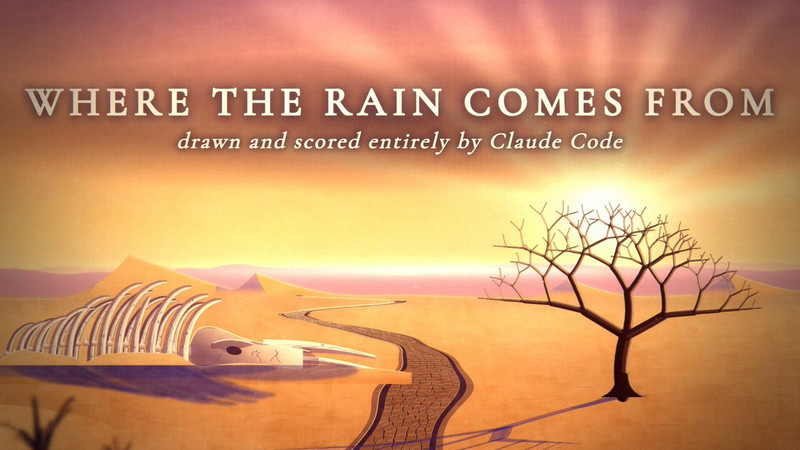</a></td>
</tr>
<tr>
<td width="50%" valign="top"><strong>《Override: The Two Sides of AI》短片</strong> <a href="https://x.com/HashemGhaili">@HashemGhaili</a> · 叙事短片 4:50 · 收藏 12 · 资料待完善 <a href="https://guanmo-ai.github.io/awesome-ai-motion/#case-2001379106970308918">▶ 播放</a> · <a href="https://x.com/HashemGhaili/status/2001379106970308918">原帖</a></td>
<td width="50%" valign="top"><strong>雨从哪里来：天空鲸鱼短片</strong> <a href="https://x.com/theSethian">@theSethian</a> · 叙事短片 2:11 · 收藏 12 · 资料待完善 <a href="https://guanmo-ai.github.io/awesome-ai-motion/#case-2106063015632158974">▶ 播放</a> · <a href="https://x.com/theSethian/status/2106063015632158974">原帖</a></td>
</tr>
</tbody>
<tbody>
<tr>
<td width="50%" height="225" align="center" valign="middle"><a href="https://guanmo-ai.github.io/awesome-ai-motion/#case-2103505613846196323">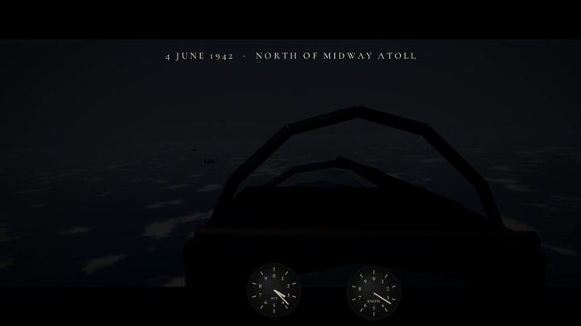</a></td>
<td width="50%" height="225" align="center" valign="middle"><a href="https://guanmo-ai.github.io/awesome-ai-motion/#case-2106557414992752745">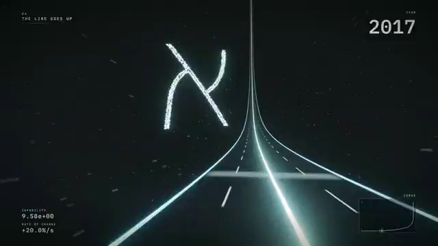</a></td>
</tr>
<tr>
<td width="50%" valign="top"><strong>中途岛海战代码短片</strong> <a href="https://x.com/WinterArc2125">@WinterArc2125</a> · 叙事短片 1:17 · 收藏 12 · 资料待完善 <a href="https://guanmo-ai.github.io/awesome-ai-motion/#case-2103505613846196323">▶ 播放</a> · <a href="https://x.com/WinterArc2125/status/2103505613846196323">原帖</a></td>
<td width="50%" valign="top"><strong>AI 开始构建自身：代码与时间线短片</strong> <a href="https://x.com/techartist_">@techartist_</a> · 叙事短片 1:36 · 收藏 11 · 资料待完善 <a href="https://guanmo-ai.github.io/awesome-ai-motion/#case-2106557414992752745">▶ 播放</a> · <a href="https://x.com/techartist_/status/2106557414992752745">原帖</a></td>
</tr>
</tbody>
<tbody>
<tr>
<td width="50%" height="225" align="center" valign="middle"><a href="https://guanmo-ai.github.io/awesome-ai-motion/#case-2005728750307278889">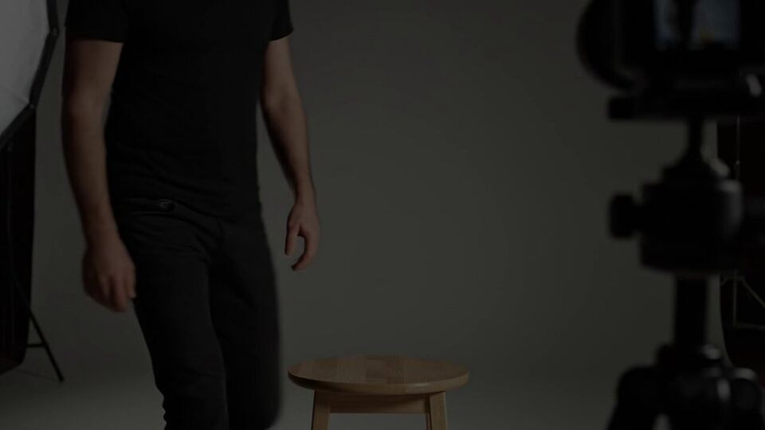</a></td>
<td width="50%" height="225" align="center" valign="middle"><a href="https://guanmo-ai.github.io/awesome-ai-motion/#case-2104733074340872656">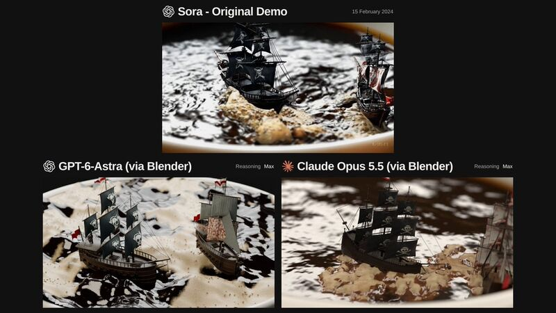</a></td>
</tr>
<tr>
<td width="50%" valign="top"><strong>《APHANTASIA》：关于心像缺失的短片</strong> <a href="https://x.com/knightama">@knightama</a> · 叙事短片 7:06 · 收藏 11 · 资料待完善 <a href="https://guanmo-ai.github.io/awesome-ai-motion/#case-2005728750307278889">▶ 播放</a> · <a href="https://x.com/knightama/status/2005728750307278889">原帖</a></td>
<td width="50%" valign="top"><strong>用 Blender 重现 Sora 示例镜头</strong> <a href="https://x.com/petergostev">@petergostev</a> · 叙事短片 0:28 · 收藏 9 · 资料待完善 <a href="https://guanmo-ai.github.io/awesome-ai-motion/#case-2104733074340872656">▶ 播放</a> · <a href="https://x.com/petergostev/status/2104733074340872656">原帖</a></td>
</tr>
</tbody>
<tbody>
<tr>
<td width="50%" height="225" align="center" valign="middle"><a href="https://guanmo-ai.github.io/awesome-ai-motion/#case-2104780688113455342">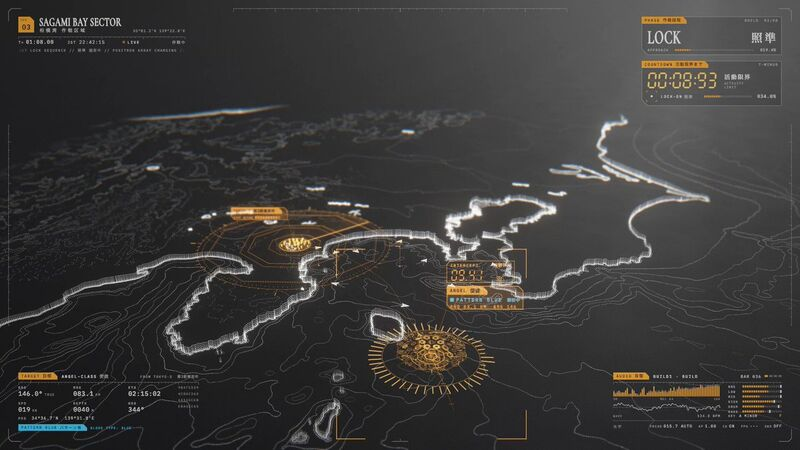</a></td>
<td width="50%" height="225" align="center" valign="middle"><a href="https://guanmo-ai.github.io/awesome-ai-motion/#case-2103171975220781332">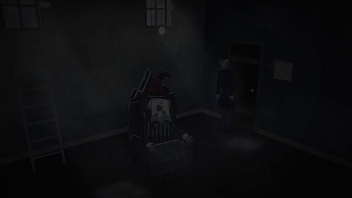</a></td>
</tr>
<tr>
<td width="50%" valign="top"><strong>EVA 灵感的 Three.js 剧场实验</strong> <a href="https://x.com/LuisBizarro">@LuisBizarro</a> · 叙事短片 0:22 · 收藏 9 · 资料待完善 <a href="https://guanmo-ai.github.io/awesome-ai-motion/#case-2104780688113455342">▶ 播放</a> · <a href="https://x.com/LuisBizarro/status/2104780688113455342">原帖</a></td>
<td width="50%" valign="top"><strong>戏剧作品的漫画式改编</strong> <a href="https://x.com/samspike_">@samspike_</a> · 叙事短片 5:23 · 收藏 8 · 资料待完善 <a href="https://guanmo-ai.github.io/awesome-ai-motion/#case-2103171975220781332">▶ 播放</a> · <a href="https://x.com/samspike_/status/2103171975220781332">原帖</a></td>
</tr>
</tbody>
<tbody>
<tr>
<td width="50%" height="225" align="center" valign="middle"><a href="https://guanmo-ai.github.io/awesome-ai-motion/#case-2029501005235102206">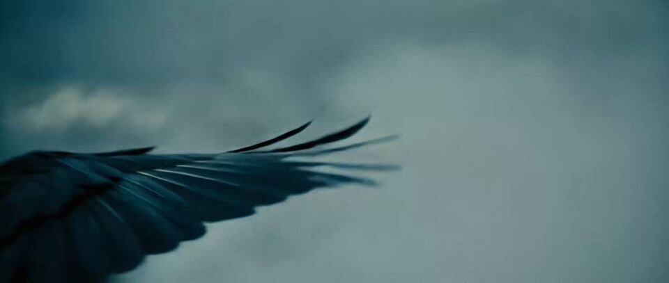</a></td>
<td width="50%" height="225" align="center" valign="middle"></td>
</tr>
<tr>
<td width="50%" valign="top"><strong>《Vision 10》：Kling 3.0 短片</strong> <a href="https://x.com/visualsk2">@visualsk2</a> · 叙事短片 1:46 · 收藏 8 · 资料待完善 <a href="https://guanmo-ai.github.io/awesome-ai-motion/#case-2029501005235102206">▶ 播放</a> · <a href="https://x.com/visualsk2/status/2029501005235102206">原帖</a></td>
<td width="50%" valign="top"><strong>Kling 3.0 野生动物摄影之旅</strong> <a href="https://x.com/Strength04_X">@Strength04_X</a> · 叙事短片 1:27 · 收藏 7 · 资料待完善 <a href="https://guanmo-ai.github.io/awesome-ai-motion/#case-2054758414195306953">▶ 播放</a> · <a href="https://x.com/Strength04_X/status/2054758414195306953">原帖</a></td>
</tr>
</tbody>
<tbody>
<tr>
<td width="50%" height="225" align="center" valign="middle"></td>
<td width="50%" height="225" align="center" valign="middle"></td>
</tr>
<tr>
<td width="50%" valign="top"><strong>待在我身后：夜间酒馆打斗</strong> <a href="https://x.com/Chengzilhy">@Chengzilhy</a> · 叙事短片 0:28 · 收藏 7 · 资料待完善 <a href="https://guanmo-ai.github.io/awesome-ai-motion/#case-2105850801663234374">▶ 播放</a> · <a href="https://x.com/Chengzilhy/status/2105850801663234374">原帖</a></td>
<td width="50%" valign="top"><strong>角色设定到写实短片的流程</strong> <a href="https://x.com/razeden0">@razeden0</a> · 叙事短片 0:22 · 收藏 7 · 资料待完善 <a href="https://guanmo-ai.github.io/awesome-ai-motion/#case-2103153899431432535">▶ 播放</a> · <a href="https://x.com/razeden0/status/2103153899431432535">原帖</a></td>
</tr>
</tbody>
<tbody>
<tr>
<td width="50%" height="225" align="center" valign="middle"></td>
<td width="50%" height="225" align="center" valign="middle"></td>
</tr>
<tr>
<td width="50%" valign="top"><strong>HyperFrames 编排的混合素材短片</strong> <a href="https://x.com/mattworkman">@mattworkman</a> · 叙事短片 0:30 · 收藏 5 · 资料待完善 <a href="https://guanmo-ai.github.io/awesome-ai-motion/#case-2104662818742309357">▶ 播放</a> · <a href="https://x.com/mattworkman/status/2104662818742309357">原帖</a></td>
<td width="50%" valign="top"><strong>水墨武士短片草稿</strong> <a href="https://x.com/pradeepXkapoor">@pradeepXkapoor</a> · 叙事短片 1:30 · 收藏 5 · 资料待完善 <a href="https://guanmo-ai.github.io/awesome-ai-motion/#case-2102782449478668290">▶ 播放</a> · <a href="https://x.com/pradeepXkapoor/status/2102782449478668290">原帖</a></td>
</tr>
</tbody>
<tbody>
<tr>
<td width="50%" height="225" align="center" valign="middle"></td>
<td width="50%" height="225" align="center" valign="middle"><a href="https://guanmo-ai.github.io/awesome-ai-motion/#case-2103039084944138621">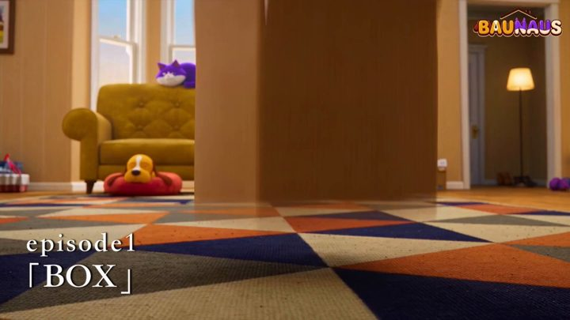</a></td>
</tr>
<tr>
<td width="50%" valign="top"><strong>Morning Breakfast：早餐场景</strong> <a href="https://x.com/RezzAIMusic">@RezzAIMusic</a> · 叙事短片 0:15 · 收藏 5 · 资料待完善 <a href="https://guanmo-ai.github.io/awesome-ai-motion/#case-2107498382482973039">▶ 播放</a> · <a href="https://x.com/RezzAIMusic/status/2107498382482973039">原帖</a></td>
<td width="50%" valign="top"><strong>小狗小猫的动画喜剧</strong> <a href="https://x.com/somasoma_blue">@somasoma_blue</a> · 叙事短片 0:54 · 收藏 4 · 资料待完善 <a href="https://guanmo-ai.github.io/awesome-ai-motion/#case-2103039084944138621">▶ 播放</a> · <a href="https://x.com/somasoma_blue/status/2103039084944138621">原帖</a></td>
</tr>
</tbody>
<tbody>
<tr>
<td width="50%" height="225" align="center" valign="middle"><a href="https://guanmo-ai.github.io/awesome-ai-motion/#case-2107459822438539692">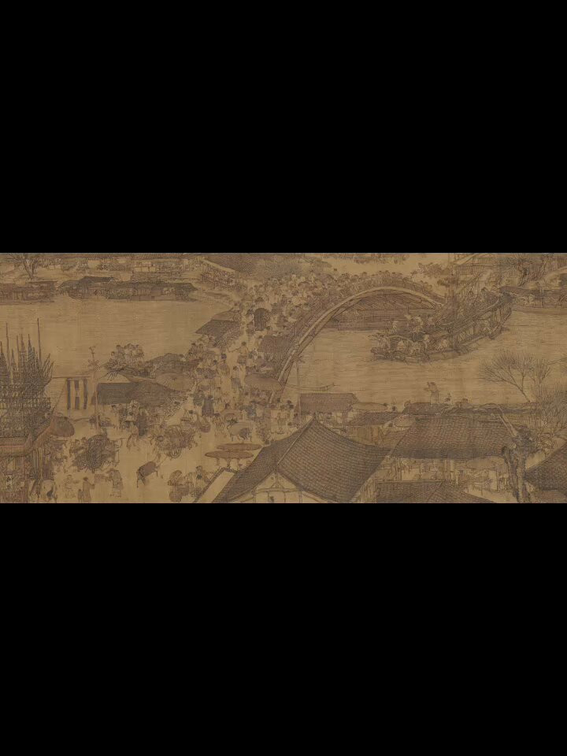</a></td>
<td width="50%" height="225" align="center" valign="middle"><a href="https://guanmo-ai.github.io/awesome-ai-motion/#case-2103169764244017396">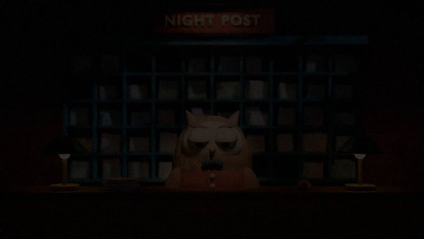</a></td>
</tr>
<tr>
<td width="50%" valign="top"><strong>《清明上河图》的视频漫游预演</strong> <a href="https://x.com/TanLuAI">@TanLuAI</a> · 叙事短片 0:13 · 收藏 4 · 资料待完善 <a href="https://guanmo-ai.github.io/awesome-ai-motion/#case-2107459822438539692">▶ 播放</a> · <a href="https://x.com/TanLuAI/status/2107459822438539692">原帖</a></td>
<td width="50%" valign="top"><strong>夜班邮局的猫头鹰</strong> <a href="https://x.com/SidMenonTM">@SidMenonTM</a> · 叙事短片 0:24 · 收藏 4 · 资料待完善 <a href="https://guanmo-ai.github.io/awesome-ai-motion/#case-2103169764244017396">▶ 播放</a> · <a href="https://x.com/SidMenonTM/status/2103169764244017396">原帖</a></td>
</tr>
</tbody>
<tbody>
<tr>
<td width="50%" height="225" align="center" valign="middle"><a href="https://guanmo-ai.github.io/awesome-ai-motion/#case-2096055605127475262">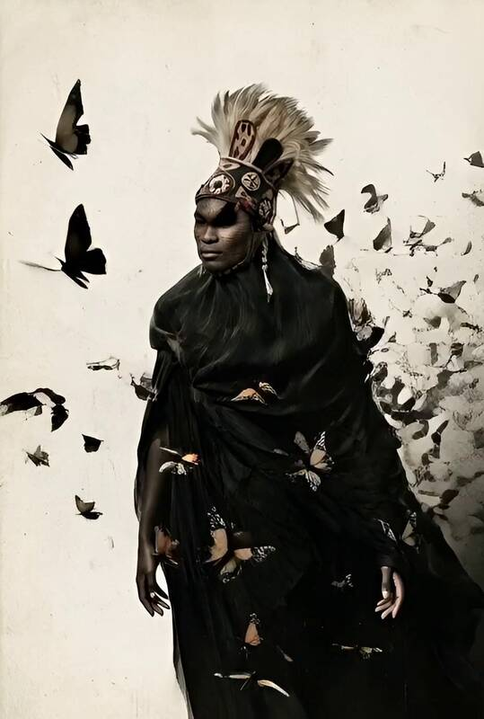</a></td>
<td width="50%" height="225" align="center" valign="middle"><a href="https://guanmo-ai.github.io/awesome-ai-motion/#case-2104410980700889227">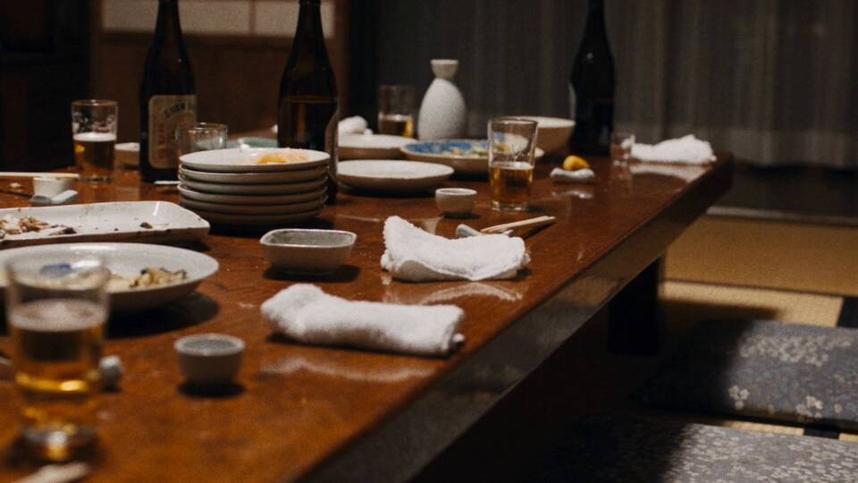</a></td>
</tr>
<tr>
<td width="50%" valign="top"><strong>Farida 与 Nyon：西非灵感奇幻概念片组</strong> <a href="https://x.com/Africanistkemte">@Africanistkemte</a> · 叙事短片 0:06 · 收藏 3 · 资料待完善 <a href="https://guanmo-ai.github.io/awesome-ai-motion/#case-2096055605127475262">▶ 播放</a> · <a href="https://x.com/Africanistkemte/status/2096055605127475262">原帖</a></td>
<td width="50%" valign="top"><strong>《YOI》：守灵结束后的香烟</strong> <a href="https://x.com/AI__TSUBAKI">@AI__TSUBAKI</a> · 叙事短片 0:30 · 收藏 3 · 资料待完善 <a href="https://guanmo-ai.github.io/awesome-ai-motion/#case-2104410980700889227">▶ 播放</a> · <a href="https://x.com/AI__TSUBAKI/status/2104410980700889227">原帖</a></td>
</tr>
</tbody>
<tbody>
<tr>
<td width="50%" height="225" align="center" valign="middle"></td>
<td width="50%" height="225" align="center" valign="middle"><a href="https://guanmo-ai.github.io/awesome-ai-motion/#case-2104775199698629064">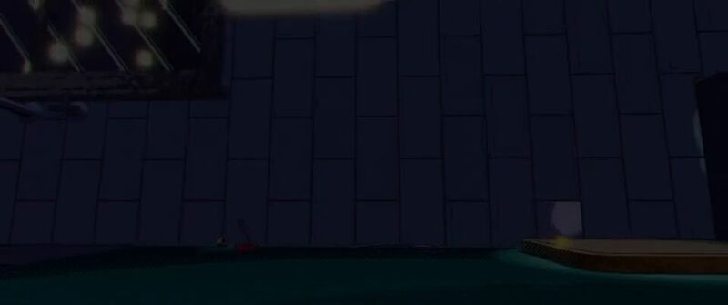</a></td>
</tr>
<tr>
<td width="50%" valign="top"><strong>AI 末日：Astra 与 Sonnet 叙事短片</strong> <a href="https://x.com/miu21590">@miu21590</a> · 叙事短片 2:39 · 收藏 2 · 资料待完善 <a href="https://guanmo-ai.github.io/awesome-ai-motion/#case-2104743033300242670">▶ 播放</a> · <a href="https://x.com/miu21590/status/2104743033300242670">原帖</a></td>
<td width="50%" valign="top"><strong>《Into the ANTVERSE》动画试片</strong> <a href="https://x.com/ChrisGPT">@ChrisGPT</a> · 叙事短片 2:00 · 收藏 2 · 资料待完善 <a href="https://guanmo-ai.github.io/awesome-ai-motion/#case-2104775199698629064">▶ 播放</a> · <a href="https://x.com/ChrisGPT/status/2104775199698629064">原帖</a></td>
</tr>
</tbody>
<tbody>
<tr>
<td width="50%" height="225" align="center" valign="middle"></td>
<td width="50%" height="225" align="center" valign="middle"><a href="https://guanmo-ai.github.io/awesome-ai-motion/#case-2106657471150567512">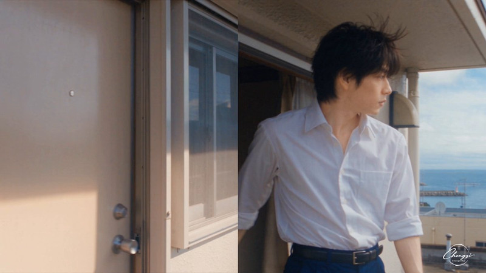</a></td>
</tr>
<tr>
<td width="50%" valign="top"><strong>《Picture Perfect》：Jeff Sarris 的动画短片</strong> <a href="https://x.com/jeffSARRIS">@jeffSARRIS</a> · 叙事短片 0:17 · 收藏 2 · 资料待完善 <a href="https://guanmo-ai.github.io/awesome-ai-motion/#case-1906062326140158099">▶ 播放</a> · <a href="https://x.com/jeffSARRIS/status/1906062326140158099">原帖</a></td>
<td width="50%" valign="top"><strong>失去重心的相遇：人物短片</strong> <a href="https://x.com/Chengzilhy">@Chengzilhy</a> · 叙事短片 0:23 · 收藏 2 · 资料待完善 <a href="https://guanmo-ai.github.io/awesome-ai-motion/#case-2106657471150567512">▶ 播放</a> · <a href="https://x.com/Chengzilhy/status/2106657471150567512">原帖</a></td>
</tr>
</tbody>
<tbody>
<tr>
<td width="50%" height="225" align="center" valign="middle"><a href="https://guanmo-ai.github.io/awesome-ai-motion/#case-1980278377597571260">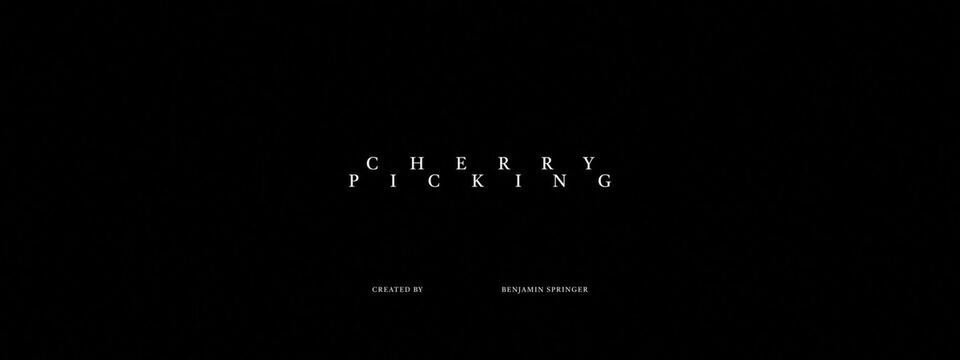</a></td>
<td width="50%" height="225" align="center" valign="middle"><a href="https://guanmo-ai.github.io/awesome-ai-motion/#case-2102561072624410878">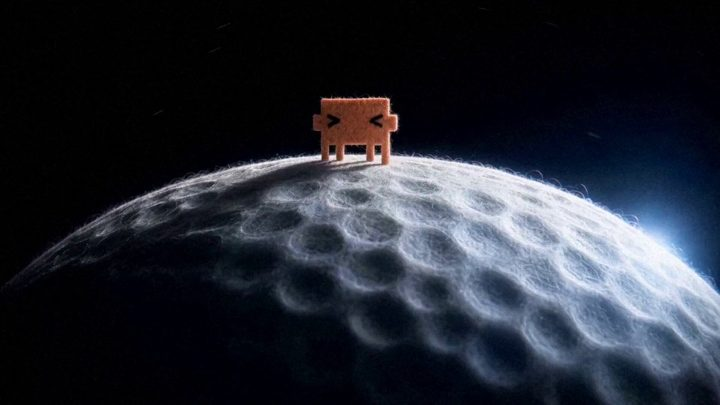</a></td>
</tr>
<tr>
<td width="50%" valign="top"><strong>《Cherry Picking》：Grok Imagine 短片</strong> <a href="https://x.com/Ben__Springer">@Ben__Springer</a> · 叙事短片 3:06 · 收藏 1 · 资料待完善 <a href="https://guanmo-ai.github.io/awesome-ai-motion/#case-1980278377597571260">▶ 播放</a> · <a href="https://x.com/Ben__Springer/status/1980278377597571260">原帖</a></td>
<td width="50%" valign="top"><strong>本地合成的纤维质感影像</strong> <a href="https://x.com/Tariq_at">@Tariq_at</a> · 叙事短片 0:20 · 收藏 1 · 资料待完善 <a href="https://guanmo-ai.github.io/awesome-ai-motion/#case-2102561072624410878">▶ 播放</a> · <a href="https://x.com/Tariq_at/status/2102561072624410878">原帖</a></td>
</tr>
</tbody>
<tbody>
<tr>
<td width="50%" height="225" align="center" valign="middle"><a href="https://guanmo-ai.github.io/awesome-ai-motion/#case-2104747385692053930">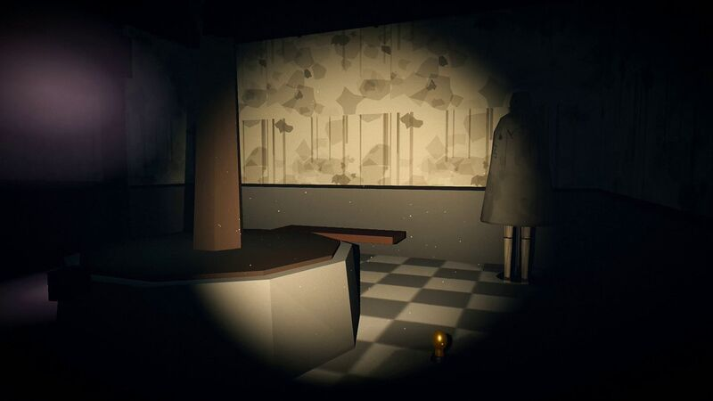</a></td>
<td width="50%" height="225" align="center" valign="middle"><a href="https://guanmo-ai.github.io/awesome-ai-motion/#case-2107492949382901859">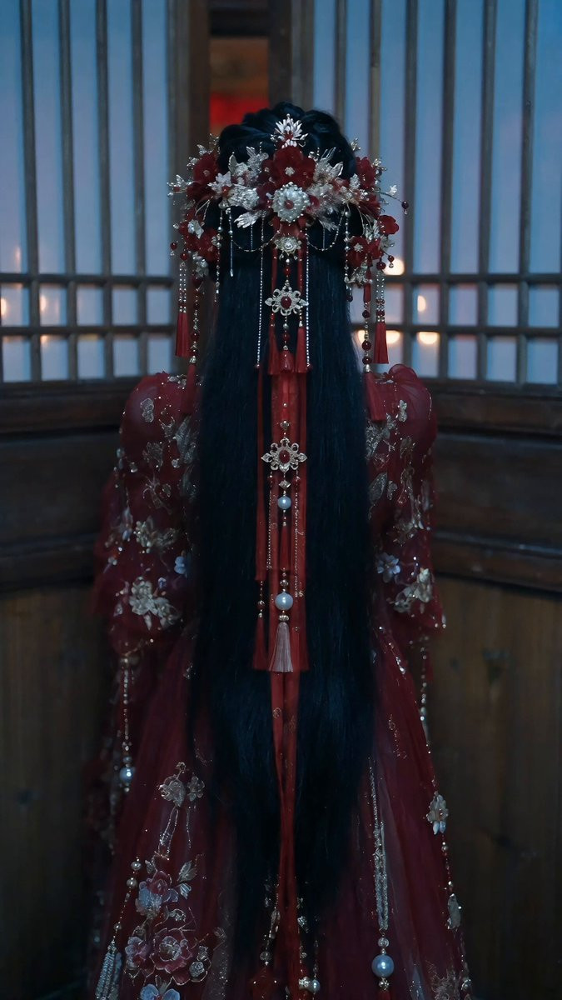</a></td>
</tr>
<tr>
<td width="50%" valign="top"><strong>Three.js 合作恐怖游戏展示片</strong> <a href="https://x.com/AmaySignedIn">@AmaySignedIn</a> · 叙事短片 0:20 · 收藏 1 · 资料待完善 <a href="https://guanmo-ai.github.io/awesome-ai-motion/#case-2104747385692053930">▶ 播放</a> · <a href="https://x.com/AmaySignedIn/status/2104747385692053930">原帖</a></td>
<td width="50%" valign="top"><strong>《嫁给废王爷》第 2 集</strong> <a href="https://x.com/liyue_ai">@liyue_ai</a> · 叙事短片 0:33 · 收藏 1 · 资料待完善 <a href="https://guanmo-ai.github.io/awesome-ai-motion/#case-2107492949382901859">▶ 播放</a> · <a href="https://x.com/liyue_ai/status/2107492949382901859">原帖</a></td>
</tr>
</tbody>
<tbody>
<tr>
<td width="50%" height="225" align="center" valign="middle"></td>
<td width="50%" height="225" align="center" valign="middle"></td>
</tr>
<tr>
<td width="50%" valign="top"><strong>红手套角色无声短片</strong> <a href="https://x.com/yaakuups">@yaakuups</a> · 叙事短片 2:18 · 收藏 1 · 资料待完善 <a href="https://guanmo-ai.github.io/awesome-ai-motion/#case-2103082248320766456">▶ 播放</a> · <a href="https://x.com/yaakuups/status/2103082248320766456">原帖</a></td>
<td width="50%" valign="top"><strong>科幻文本改编动态图像</strong> <a href="https://x.com/N8Programs">@N8Programs</a> · 叙事短片 10:09 · 收藏 1 · 资料待完善 <a href="https://guanmo-ai.github.io/awesome-ai-motion/#case-2103154189064876406">▶ 播放</a> · <a href="https://x.com/N8Programs/status/2103154189064876406">原帖</a></td>
</tr>
</tbody>
<tbody>
<tr>
<td width="50%" height="225" align="center" valign="middle"></td>
<td width="50%" height="225" align="center" valign="middle"><a href="https://guanmo-ai.github.io/awesome-ai-motion/#case-2091155876899959138">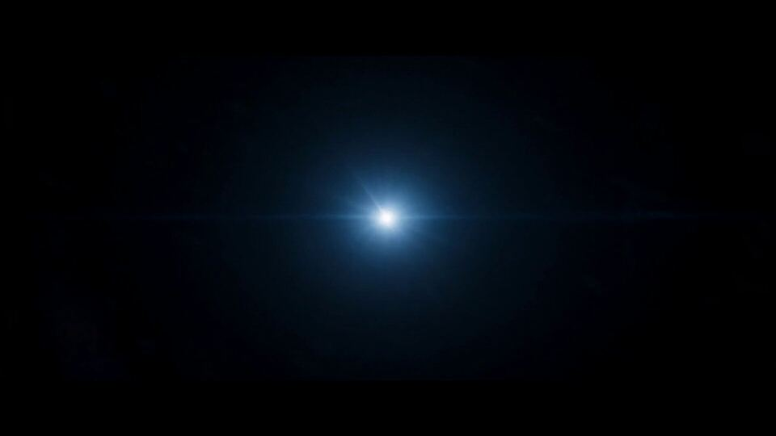</a></td>
</tr>
<tr>
<td width="50%" valign="top"><strong>商场的一天：清晨保洁到凌晨保安</strong> <a href="https://x.com/KanikaBK">@KanikaBK</a> · 叙事短片 0:45 · 收藏 0 · 资料待完善 <a href="https://guanmo-ai.github.io/awesome-ai-motion/#case-2105221177035940200">▶ 播放</a> · <a href="https://x.com/KanikaBK/status/2105221177035940200">原帖</a></td>
<td width="50%" valign="top"><strong>《The Inheritance Engine》：无对白预告片</strong> <a href="https://x.com/mikevicenzino">@mikevicenzino</a> · 叙事短片 1:04 · 收藏 0 · 资料待完善 <a href="https://guanmo-ai.github.io/awesome-ai-motion/#case-2091155876899959138">▶ 播放</a> · <a href="https://x.com/mikevicenzino/status/2091155876899959138">原帖</a></td>
</tr>
</tbody>
<tbody>
<tr>
<td width="50%" height="225" align="center" valign="middle"><a href="https://guanmo-ai.github.io/awesome-ai-motion/#case-2104207365008687553">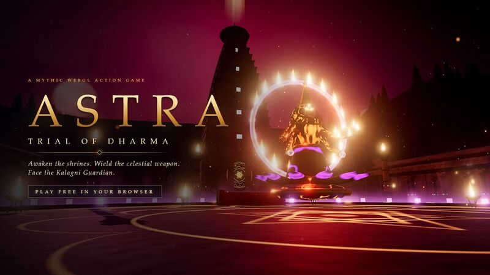</a></td>
<td width="50%" height="225" align="center" valign="middle"></td>
</tr>
<tr>
<td width="50%" valign="top"><strong>古印度史诗灵感的动作游戏预告</strong> <a href="https://x.com/mayuresh_empire">@mayuresh_empire</a> · 叙事短片 0:53 · 收藏 0 · 资料待完善 <a href="https://guanmo-ai.github.io/awesome-ai-motion/#case-2104207365008687553">▶ 播放</a> · <a href="https://x.com/mayuresh_empire/status/2104207365008687553">原帖</a></td>
<td width="50%" valign="top"><strong>把深夜散文变成四分钟短片</strong> <a href="https://x.com/wenbozhu0328">@wenbozhu0328</a> · 叙事短片 4:09 · 收藏 0 · 资料待完善 <a href="https://guanmo-ai.github.io/awesome-ai-motion/#case-2105655716564656404">▶ 播放</a> · <a href="https://x.com/wenbozhu0328/status/2105655716564656404">原帖</a></td>
</tr>
</tbody>
<tbody>
<tr>
<td width="50%" height="225" align="center" valign="middle"></td>
<td width="50%" height="225" align="center" valign="middle"><a href="https://guanmo-ai.github.io/awesome-ai-motion/#case-2107501581365281248">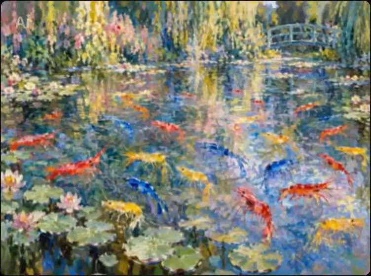</a></td>
</tr>
<tr>
<td width="50%" valign="top"><strong>《Ghost of PrivatBank》：制作中的短片预告</strong> <a href="https://x.com/_YuliyaLev_">@_YuliyaLev_</a> · 叙事短片 1:16 · 收藏 0 · 资料待完善 <a href="https://guanmo-ai.github.io/awesome-ai-motion/#case-2014368636236874028">▶ 播放</a> · <a href="https://x.com/_YuliyaLev_/status/2014368636236874028">原帖</a></td>
<td width="50%" valign="top"><strong>Shrimp Pond：水边绘画短片</strong> <a href="https://x.com/MATCHA_ORANGE_">@MATCHA_ORANGE_</a> · 叙事短片 0:15 · 收藏 0 · 资料待完善 <a href="https://guanmo-ai.github.io/awesome-ai-motion/#case-2107501581365281248">▶ 播放</a> · <a href="https://x.com/MATCHA_ORANGE_/status/2107501581365281248">原帖</a></td>
</tr>
</tbody>
<tbody>
<tr>
<td width="50%" height="225" align="center" valign="middle"></td>
<td width="50%" height="225" align="center" valign="middle"></td>
</tr>
<tr>
<td width="50%" valign="top"><strong>生活巧合的三段动画</strong> <a href="https://x.com/YoshiKura535130">@YoshiKura535130</a> · 叙事短片 0:43 · 收藏 0 · 资料待完善 <a href="https://guanmo-ai.github.io/awesome-ai-motion/#case-2102910805721362875">▶ 播放</a> · <a href="https://x.com/YoshiKura535130/status/2102910805721362875">原帖</a></td>
<td width="50%" valign="top"><strong>《Imagination Expired》：Seedance 2.5 短片</strong> <a href="https://x.com/HuskiStudio">@HuskiStudio</a> · 叙事短片 2:31 · 收藏 0 · 资料待完善 <a href="https://guanmo-ai.github.io/awesome-ai-motion/#case-2104419979924033781">▶ 播放</a> · <a href="https://x.com/HuskiStudio/status/2104419979924033781">原帖</a></td>
</tr>
</tbody>
<tbody>
<tr>
<td width="50%" height="225" align="center" valign="middle"><a href="https://guanmo-ai.github.io/awesome-ai-motion/#case-2104775404368412946">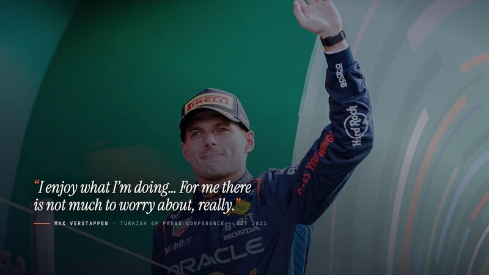</a></td>
<td width="50%" height="225" align="center" valign="middle"><a href="https://guanmo-ai.github.io/awesome-ai-motion/#case-2104792004978974928">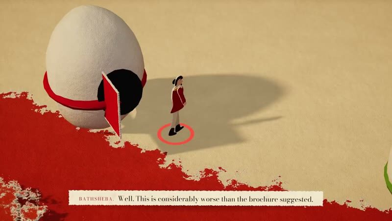</a></td>
</tr>
<tr>
<td width="50%" valign="top"><strong>Max Verstappen：赛事素材剪辑实验</strong> <a href="https://x.com/salRoid">@salRoid</a> · 叙事短片 1:37 · 收藏 0 · 资料待完善 <a href="https://guanmo-ai.github.io/awesome-ai-motion/#case-2104775404368412946">▶ 播放</a> · <a href="https://x.com/salRoid/status/2104775404368412946">原帖</a></td>
<td width="50%" valign="top"><strong>远离尘嚣：太空前哨剪纸短片</strong> <a href="https://x.com/NoFollowers2023">@NoFollowers2023</a> · 叙事短片 5:27 · 收藏 0 · 资料待完善 <a href="https://guanmo-ai.github.io/awesome-ai-motion/#case-2104792004978974928">▶ 播放</a> · <a href="https://x.com/NoFollowers2023/status/2104792004978974928">原帖</a></td>
</tr>
</tbody>
<tbody>
<tr>
<td width="50%" height="225" align="center" valign="middle"><a href="https://guanmo-ai.github.io/awesome-ai-motion/#case-2105361184543133877">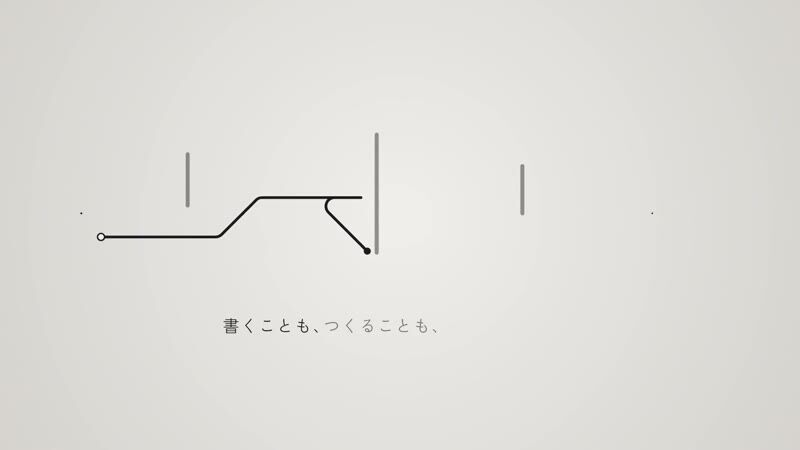</a></td>
<td width="50%" height="225" align="center" valign="middle"><a href="https://guanmo-ai.github.io/awesome-ai-motion/#case-2107434660057800861">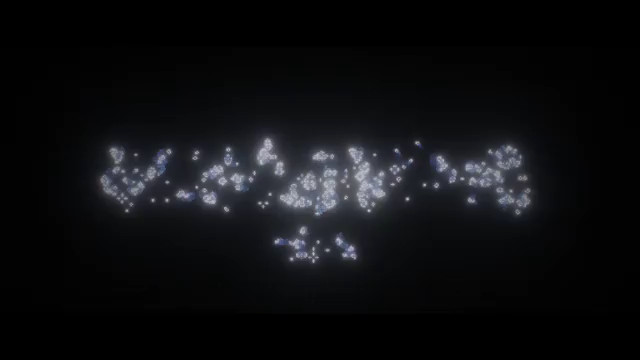</a></td>
</tr>
<tr>
<td width="50%" valign="top"><strong>AI 时代，人类决定去向</strong> <a href="https://x.com/nakazakifam">@nakazakifam</a> · 叙事短片 1:24 · 收藏 0 · 资料待完善 <a href="https://guanmo-ai.github.io/awesome-ai-motion/#case-2105361184543133877">▶ 播放</a> · <a href="https://x.com/nakazakifam/status/2105361184543133877">原帖</a></td>
<td width="50%" valign="top"><strong>Emergence：涌现主题代码短片</strong> <a href="https://x.com/JindaLi_">@JindaLi_</a> · 叙事短片 4:37 · 收藏 0 · 资料待完善 <a href="https://guanmo-ai.github.io/awesome-ai-motion/#case-2107434660057800861">▶ 播放</a> · <a href="https://x.com/JindaLi_/status/2107434660057800861">原帖</a></td>
</tr>
</tbody>
<tbody>
<tr>
<td width="50%" height="225" align="center" valign="middle"></td>
<td width="50%" height="225" align="center" valign="middle"><a href="https://guanmo-ai.github.io/awesome-ai-motion/#case-2107501886844891607">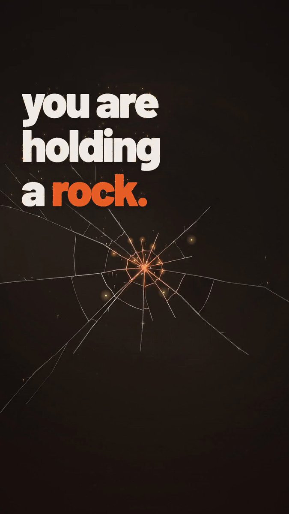</a></td>
</tr>
<tr>
<td width="50%" valign="top"><strong>本地 MiniMax H3 人物对白试验</strong> <a href="https://x.com/hylwr">@hylwr</a> · 叙事短片 0:40 · 收藏 0 · 资料待完善 <a href="https://guanmo-ai.github.io/awesome-ai-motion/#case-2107461812316942784">▶ 播放</a> · <a href="https://x.com/hylwr/status/2107461812316942784">原帖</a></td>
<td width="50%" valign="top"><strong>When Sand Speaks：第一集</strong> <a href="https://x.com/kevrussell">@kevrussell</a> · 叙事短片 0:54 · 收藏 0 · 资料待完善 <a href="https://guanmo-ai.github.io/awesome-ai-motion/#case-2107501886844891607">▶ 播放</a> · <a href="https://x.com/kevrussell/status/2107501886844891607">原帖</a></td>
</tr>
</tbody>
</table>
