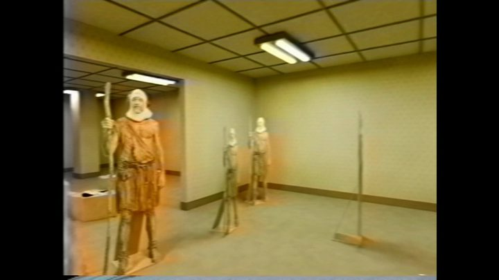

[← 返回图库](../browse/stories.md) · [English](2096003511104508411.en.md)

# 迷宫空间的 Blender 短片

**[Duncan Trussell · @duncantrussell](https://x.com/duncantrussell)** · 叙事短片 · 20s

> 发现池 · 来源已核对，编目资料待完善。

**[▶ 打开画廊播放](https://guanmo-ai.github.io/awesome-ai-motion/#case-2096003511104508411)** · [作者原帖](https://x.com/duncantrussell/status/2096003511104508411)

点击封面打开画廊播放。

Duncan Trussell 发布的迷宫空间的 Blender 短片。制作方式依据作者原帖说明；来源已核对，完整音画待审看。

未取得作者公开提示词。 [查看作者原帖](https://x.com/duncantrussell/status/2096003511104508411)

收藏 4,514 · 点赞 9,552 · 浏览 6,378,921

## 来源记录

- 作品原帖: [@duncantrussell](https://x.com/duncantrussell/status/2096003511104508411) · 2026-09-04T22:32:33+00:00
- 模型归因: GPT-6 Astra · [作者说明](https://x.com/duncantrussell/status/2096003511104508411)
- 提示词查阅记录: [作者原帖](https://x.com/duncantrussell/status/2096003511104508411) · 2026-09-27 17:08 UTC
- 封面来源: [原帖封面来源](https://pbs.twimg.com/amplify_video_thumb/2096003209957609472/img/nah7J4WwfPpfBjJa.jpg)
- 互动快照: [X 原帖](https://x.com/duncantrussell/status/2096003511104508411) · 2026-09-27 17:08 UTC
- 画廊原视频: [原帖媒体记录](https://x.com/duncantrussell/status/2096003511104508411) · 2026-09-27 17:10 UTC · 已核对原帖媒体对应与媒体响应；外部引用，不重新上传

模型依据来自作者自述，未独立重跑提示词，也未对音画作统一质量评级。视频引用作者原帖媒体，未由本站重新上传，转载许可未确认。
