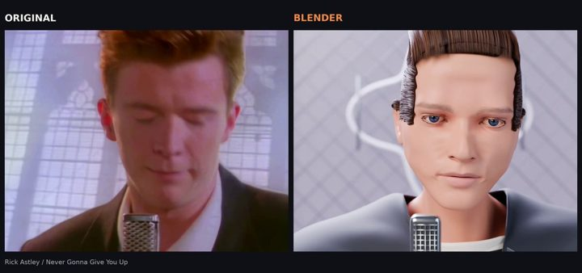

[← 返回图库](../browse/music.md) · [English](2096612996256579653.en.md)

# Blender 重制音乐梗片

**[Vaibhav (VB) Srivastav · @reach\_vb](https://x.com/reach_vb)** · 音乐与歌词 · 58s

> 发现池 · 已核对作者原帖与媒体来源，尚未完整审看。

**[▶ 观看原视频](https://video.twimg.com/amplify_video/2096612896734367744/vid/avc1/3200x1500/wOxxWNC4AYTWoLgE.mp4?tag=29)**

[作者原帖](https://x.com/reach_vb/status/2096612996256579653)

Vaibhav (VB) Srivastav 发布的Blender 重制音乐梗片。制作方式依据作者原帖说明；来源已核对，完整音画待审看。

未取得作者公开提示词。 [查看作者原帖](https://x.com/reach_vb/status/2096612996256579653)

收藏 1,608 · 点赞 8,666 · 浏览 7,357,328

## 来源记录

- 作品原帖: [@reach\_vb](https://x.com/reach_vb/status/2096612996256579653) · 2026-09-06T14:54:26+00:00
- 模型归因: GPT-6 Astra · [作者说明](https://x.com/reach_vb/status/2096612996256579653)
- 提示词查阅记录: [作者原帖](https://x.com/reach_vb/status/2096612996256579653) · 2026-09-27 17:08 UTC
- 封面来源: [原媒体](https://pbs.twimg.com/amplify_video_thumb/2096612896734367744/img/gG87Jkr02i3dXWhn.jpg)
- 互动数据: [X](https://x.com/reach_vb/status/2096612996256579653) · 2026-09-27 17:08 UTC · 第三方匿名读取，非 X 官方 API
- 发现入口: [资料页](https://github.com/theolundqvist/frontier-games/blob/f3f6e3b80e921c66d08d157cca0d26da676a2e29/README.md)
- 画廊原视频: [原帖媒体](https://video.twimg.com/amplify_video/2096612896734367744/vid/avc1/3200x1500/wOxxWNC4AYTWoLgE.mp4?tag=29) · 2026-09-27 17:10 UTC · 已核对原帖媒体对应与媒体响应；外部引用，不重新上传

模型依据来自作者自述，未独立重跑提示词，也未对音画作统一质量评级。视频引用作者原帖媒体，未由本站重新上传，转载许可未确认。
