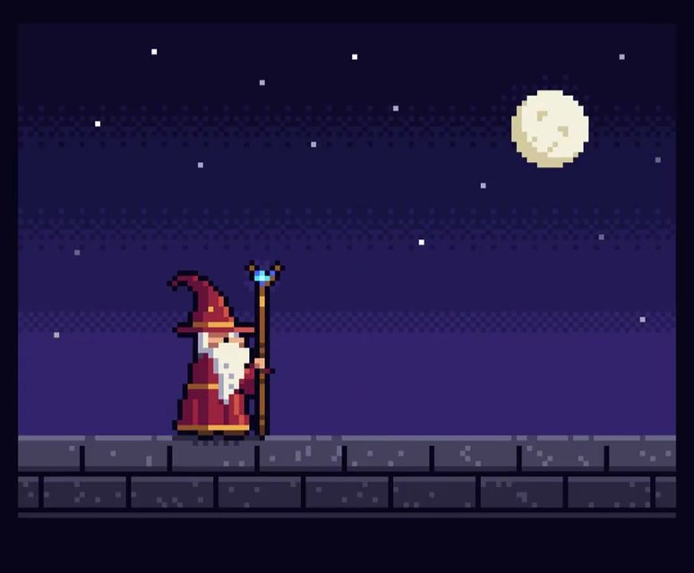

[← 返回图库](../browse/characters.md) · [English](2102476258948927543.en.md)

<a id="case-2102476258948927543"></a>

# 像素巫师的施法循环

**[Majid Manzarpour · @majidmanzarpour](https://x.com/majidmanzarpour)** · 角色动画 · 11s

**[▶ 打开画廊播放](https://guanmo-ai.github.io/awesome-ai-motion/#case-2102476258948927543)** · [作者原帖](https://x.com/majidmanzarpour/status/2102476258948927543)

点击封面打开画廊播放。

[](https://guanmo-ai.github.io/awesome-ai-motion/#case-2102476258948927543)


完整规格覆盖像素尺寸、调色板、角色动作与循环，适合学习精确约束。

## 可以借鉴什么

先限制像素尺寸和色盘，再设计施法循环，能让小角色保持清晰辨识度。

**开始尝试** · 根据作者公开资料整理的编辑建议，并非作者完整操作记录。

1. 定好 128×96 画布、约 24 色色盘和巫师剪影。
2. 用待机、蓄力、施法、复位四段动作画循环。
3. 放大播放，检查像素边缘、动作识别和首尾衔接。

原文提到的工具：HTML · JavaScript · Canvas 2D

[资料出处 1](https://x.com/majidmanzarpour/status/2102476499387383834)

> 使用前: 纯 HTML / Canvas 2D 的规格型提示词；无需外部素材。

**作者公开提示词** · [出处](https://x.com/majidmanzarpour/status/2102476499387383834) · [纯文本](../prompts/2102476258948927543.txt)

<details>
<summary>展开原文 · 2,209 字符</summary>

```text
Create a single self-contained HTML file that renders an animated pixel art wizard casting a spell, using vanilla JavaScript and Canvas 2D. No external assets, libraries, or network requests.

RENDERING
- Draw everything to an offscreen canvas at a fixed logical resolution of 128x96, then blit to a fullscreen display canvas scaled by the largest integer factor that fits the window, centered, with imageSmoothingEnabled = false and CSS image-rendering: pixelated.
- All drawing snaps to integer coordinates on the logical canvas. No sub-pixel positions, anti-aliasing, gradients, or shadowBlur.
- Fixed palette of ~24 hex colors: deep blues/purples for night sky, warm robe tones, 3-4 bright magic colors. Every pixel comes from this palette.

CHARACTER
- Build the wizard procedurally from filled rects and pixel runs, ~24x32 logical pixels: pointed hat with a bend, long beard, two-shade robe with darker outline, staff with a gem at the tip.
- Parameterize the pose (staff angle, arm raise, head tilt, robe sway). Animate parameters smoothly, then quantize to the pixel grid each frame so motion reads at an 8-12 fps pixel animation feel even though the loop runs at 60fps.

ANIMATION
- Looping state machine: IDLE (2-frame bob, beard sway) -> CHARGE (staff raises, gem flickers, sparks spiral inward) -> CAST (bright burst, projectile fires across the scene, 1-2 pixel screen shake) -> RECOVER (settle back). Ease pose parameters between keyframes.
- Pooled allocation-free particle system: preallocate and reuse. Sparks orbit the gem during CHARGE, explode outward on CAST, each particle stepping its palette index from white to magic color to dark before despawn. Snap particle positions to the grid when drawing.
- Fixed 60hz timestep update with rAF rendering. Zero object allocation inside the loop.

SCENE
- Minimal background: dark sky, a few twinkling 1px stars, moon, stone floor line. Character silhouette must read clearly.
- Subtle 1px rim light on the wizard from the gem, brightening during CHARGE and CAST.

QUALITY BAR
- Crisp pixels at any window size, seamless loop, stable 60fps, readable silhouette. Should look like a polished 16-bit sprite animation, not vector shapes scaled down.
```

</details>

<sub>收藏 2,639 · 点赞 2,527 · 浏览 436,780</sub>


## 来源记录

- 作品原帖: [@majidmanzarpour](https://x.com/majidmanzarpour/status/2102476258948927543) · Tue Sep 22 19:12:56 +0000 2026
- 模型归因: Claude Opus 5.5 · [作者说明](https://x.com/majidmanzarpour/status/2102476258948927543)
- 提示词出处: [作者原帖](https://x.com/majidmanzarpour/status/2102476499387383834) · 2026-09-27 04:57 UTC
- 封面来源: [原帖封面来源](https://x.com/majidmanzarpour/status/2102476258948927543) · 3.8s
- 互动快照: [X 原帖](https://x.com/majidmanzarpour/status/2102476258948927543) · 2026-09-27 04:57 UTC
- 画廊原视频: [原帖媒体记录](https://x.com/majidmanzarpour/status/2102476258948927543) · 2026-09-27 11:17 UTC · 已核对原帖媒体对应与媒体响应；外部引用，不重新上传

模型依据来自作者自述，未独立重跑提示词，也未对音画作统一质量评级。视频引用作者原帖媒体，未由本站重新上传，转载许可未确认。
