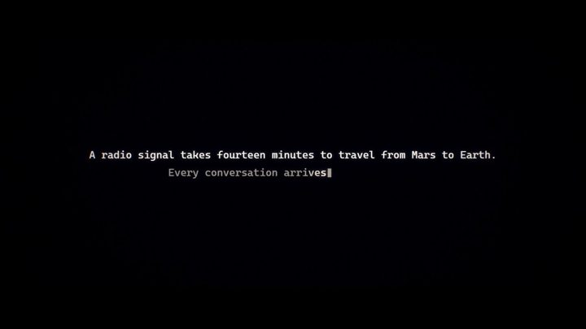

[← 返回图库](../browse/stories.md) · [English](2102512879258009818.en.md)

# 火星探测器短片

**[AndrewOnXYZ · @AndrewOnXYZ](https://x.com/AndrewOnXYZ)** · 叙事短片 · 239s

> 发现池 · 已核对作者原帖与媒体来源，尚未完整审看。

**[▶ 打开画廊播放](https://guanmo-ai.github.io/awesome-ai-motion/#case-2102512879258009818)** · [作者原帖](https://x.com/AndrewOnXYZ/status/2102512879258009818)

点击封面打开画廊播放。

AndrewOnXYZ 发布的火星探测器短片。制作方式依据作者原帖说明；来源已核对，完整音画待审看。

未取得作者公开提示词。 [查看作者原帖](https://x.com/AndrewOnXYZ/status/2102512879258009818)

收藏 2,163 · 点赞 3,028 · 浏览 374,503

## 来源记录

- 作品原帖: [@AndrewOnXYZ](https://x.com/AndrewOnXYZ/status/2102512879258009818) · 2026-09-22T21:38:27+00:00
- 模型归因: Claude Opus 5.5 · [作者说明](https://x.com/AndrewOnXYZ/status/2102512879258009818)
- 提示词查阅记录: [作者原帖](https://x.com/AndrewOnXYZ/status/2102512879258009818) · 2026-09-27 17:07 UTC
- 封面来源: [原帖封面来源](https://pbs.twimg.com/amplify_video_thumb/2102512551380619264/img/bRsZ7nsJGMppd8Sl.jpg)
- 互动快照: [X 原帖](https://x.com/AndrewOnXYZ/status/2102512879258009818) · 2026-09-27 17:07 UTC
- 画廊原视频: [原帖媒体记录](https://x.com/AndrewOnXYZ/status/2102512879258009818) · 2026-09-27 17:09 UTC · 已核对原帖媒体对应与媒体响应；外部引用，不重新上传

模型依据来自作者自述，未独立重跑提示词，也未对音画作统一质量评级。视频引用作者原帖媒体，未由本站重新上传，转载许可未确认。
