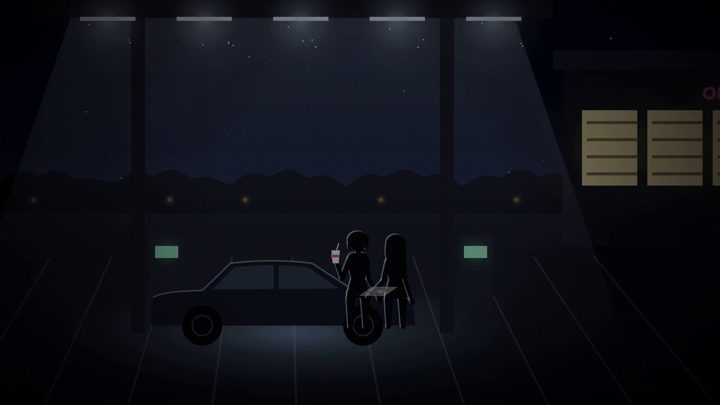

[← Back to gallery](../browse/music.en.md) · [简体中文](2102599211212554616.md)

# Code-Drawn Film for an Existing Song

**[Thorne 🌸 · @ExistentialEnso](https://x.com/ExistentialEnso)** · Music & lyrics · 340s

> Discovery pool · Source verified; catalog details being completed.

**[▶ Open gallery to play](https://guanmo-ai.github.io/awesome-ai-motion/?lang=en#case-2102599211212554616)** · [Original post](https://x.com/ExistentialEnso/status/2102599211212554616)

Click the cover to open the gallery and play.

Code-Drawn Film for an Existing Song, shared by Thorne 🌸. Production attribution follows the creator’s post. Source verified; full viewing review pending.

No public prompt has been verified. [View the original post](https://x.com/ExistentialEnso/status/2102599211212554616)

Bookmarks 20 · Likes 42 · Views 2,871

## Source record

- Original post: [@ExistentialEnso](https://x.com/ExistentialEnso/status/2102599211212554616) · 2026-09-23T03:21:31+00:00
- Model attribution: Claude Opus 5.5 · [Creator’s statement](https://x.com/ExistentialEnso/status/2102599211212554616)
- Prompt lookup: [Creator post](https://x.com/ExistentialEnso/status/2102599211212554616) · 2026-09-27 17:08 UTC
- Cover source: [Original cover source](https://pbs.twimg.com/amplify_video_thumb/2102597928284012547/img/PkNlkrBrmwHl_6A7.jpg)
- Metrics snapshot: [Original X post](https://x.com/ExistentialEnso/status/2102599211212554616) · 2026-09-27 17:08 UTC
- Gallery video source: [Original post media record](https://x.com/ExistentialEnso/status/2102599211212554616) · 2026-09-27 17:10 UTC · Post/media correspondence and media response checked; external reference, no re-upload

Model attribution is based on creator statements. Prompts have not been independently rerun; sound and visuals have not received a uniform quality rating. Videos reference original post media, not our uploads; redistribution permission has not been verified.
