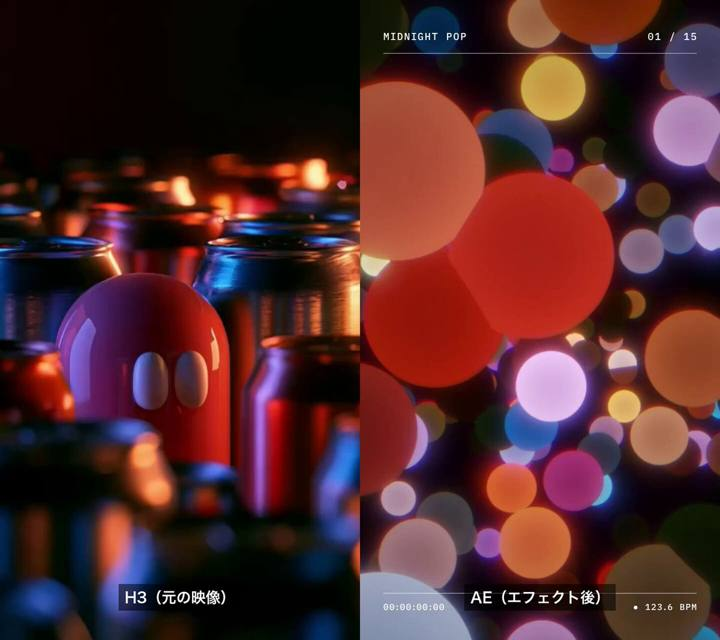

[← 返回图库](../browse/motion.md) · [English](2102656273112326609.en.md)

# AI 视频的 After Effects 再加工

**[aicreataro · @aicreataro](https://x.com/aicreataro)** · 短动效 · 15s

> 发现池 · 已核对作者原帖与媒体来源，尚未完整审看。

**[▶ 观看原视频](https://video.twimg.com/amplify_video/2102656011614162944/vid/avc1/1440x1280/gW1D2yKSHQyCWwhS.mp4?tag=29)**

[作者原帖](https://x.com/aicreataro/status/2102656273112326609)

aicreataro 发布的AI 视频的 After Effects 再加工。制作方式依据作者原帖说明；来源已核对，完整音画待审看。

未取得作者公开提示词。 [查看作者原帖](https://x.com/aicreataro/status/2102656273112326609)

收藏 433 · 点赞 452 · 浏览 47,799

## 来源记录

- 作品原帖: [@aicreataro](https://x.com/aicreataro/status/2102656273112326609) · 2026-09-23T07:08:15+00:00
- 模型归因: Claude Opus 5.5 · [作者说明](https://x.com/aicreataro/status/2102656273112326609)
- 提示词查阅记录: [作者原帖](https://x.com/aicreataro/status/2102656273112326609) · 2026-09-27 17:07 UTC
- 封面来源: [原媒体](https://pbs.twimg.com/amplify_video_thumb/2102656011614162944/img/jBG_jkOUnlaU7x3h.jpg)
- 互动数据: [X](https://x.com/aicreataro/status/2102656273112326609) · 2026-09-27 17:07 UTC · 第三方匿名读取，非 X 官方 API
- 发现入口: [资料页](https://github.com/athemeroy/awesome-opus-5-5-videos/blob/f0728e6fd1e5ec496815c1c7ba115bc70e3a31f9/data/cases.csv)
- 画廊原视频: [原帖媒体](https://video.twimg.com/amplify_video/2102656011614162944/vid/avc1/1440x1280/gW1D2yKSHQyCWwhS.mp4?tag=29) · 2026-09-27 17:10 UTC · 已核对原帖媒体对应与媒体响应；外部引用，不重新上传

模型依据来自作者自述，未独立重跑提示词，也未对音画作统一质量评级。视频引用作者原帖媒体，未由本站重新上传，转载许可未确认。
