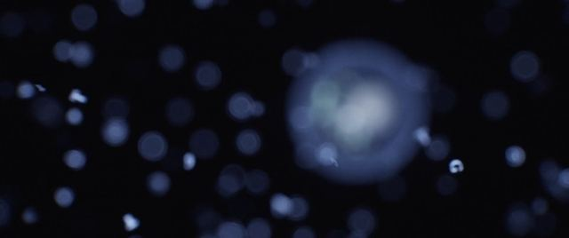

[← Back to gallery](../browse/motion.en.md) · [简体中文](2102679018206052828.md)

# Code generated cinematic test clip

**[Riley Coyote · @RileyRalmuto](https://x.com/RileyRalmuto)** · Motion design · 16s

> Discovery pool · Creator post and media source verified; full viewing review pending.

**[▶ Open gallery to play](https://guanmo-ai.github.io/awesome-ai-motion/?lang=en#case-2102679018206052828)** · [Original post](https://x.com/RileyRalmuto/status/2102679018206052828)

Click the cover to open the gallery and play.

Code generated cinematic test clip, shared by Riley Coyote. Production attribution follows the creator’s post. Source verified; full viewing review pending.

No public prompt has been verified. [View the original post](https://x.com/RileyRalmuto/status/2102679018206052828)

Bookmarks 475 · Likes 918 · Views 61,367

## Source record

- Original post: [@RileyRalmuto](https://x.com/RileyRalmuto/status/2102679018206052828) · 2026-09-23T08:38:38+00:00
- Model attribution: Claude Opus 5.5 · [Creator’s statement](https://x.com/RileyRalmuto/status/2102679018206052828)
- Prompt lookup: [Creator post](https://x.com/RileyRalmuto/status/2102679018206052828) · 2026-09-27 17:07 UTC
- Cover source: [Original cover source](https://pbs.twimg.com/amplify_video_thumb/2102678548880265216/img/csbl4iTaf5EMftJ8.jpg)
- Metrics: [X](https://x.com/RileyRalmuto/status/2102679018206052828) · 2026-09-27 17:07 UTC · Anonymous third-party snapshot, not the official X API
- Discovered via: [Reference](https://github.com/opusvideo/awesome-claude-video/blob/d90b8a46f122614b14885147246c710ae1c7781f/cases.json)
- Gallery video source: [Original post media record](https://x.com/RileyRalmuto/status/2102679018206052828) · 2026-09-27 17:09 UTC · Post/media correspondence and media response checked; external reference, no re-upload

Model attribution is based on creator statements. Prompts have not been independently rerun; sound and visuals have not received a uniform quality rating. Videos reference original post media, not our uploads; redistribution permission has not been verified.
