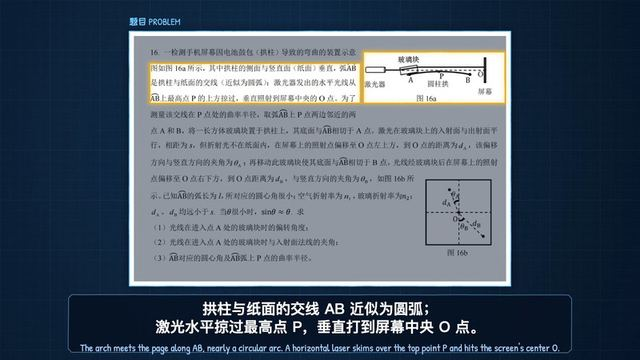

[← Back to gallery](../browse/education.en.md) · [简体中文](2102680453912449223.md)

# Physics contest problem explainer

**[WY · @akokoi1](https://x.com/akokoi1)** · Education & explainers · 189s

> Discovery pool · Creator post and media source verified; full viewing review pending.

**[▶ Open gallery to play](https://guanmo-ai.github.io/awesome-ai-motion/?lang=en#case-2102680453912449223)** · [Original post](https://x.com/akokoi1/status/2102680453912449223)

Click the cover to open the gallery and play.

Physics contest problem explainer, shared by WY. Production attribution follows the creator’s post. Source verified; full viewing review pending.

No public prompt has been verified. [View the original post](https://x.com/akokoi1/status/2102680453912449223)

Bookmarks 201 · Likes 237 · Views 47,868

## Source record

- Original post: [@akokoi1](https://x.com/akokoi1/status/2102680453912449223) · 2026-09-23T08:44:20+00:00
- Model attribution: Claude Opus 5.5 · [Creator’s statement](https://x.com/akokoi1/status/2102680453912449223)
- Prompt lookup: [Creator post](https://x.com/akokoi1/status/2102680453912449223) · 2026-09-27 17:07 UTC
- Cover source: [Original cover source](https://pbs.twimg.com/amplify_video_thumb/2102675543351275520/img/7dqJbXUxKyw1EJOI.jpg)
- Metrics: [X](https://x.com/akokoi1/status/2102680453912449223) · 2026-09-27 17:07 UTC · Anonymous third-party snapshot, not the official X API
- Discovered via: [Reference](https://github.com/opusvideo/awesome-claude-video/blob/d90b8a46f122614b14885147246c710ae1c7781f/cases.json)
- Gallery video source: [Original post media record](https://x.com/akokoi1/status/2102680453912449223) · 2026-09-27 17:09 UTC · Post/media correspondence and media response checked; external reference, no re-upload

Model attribution is based on creator statements. Prompts have not been independently rerun; sound and visuals have not received a uniform quality rating. Videos reference original post media, not our uploads; redistribution permission has not been verified.
