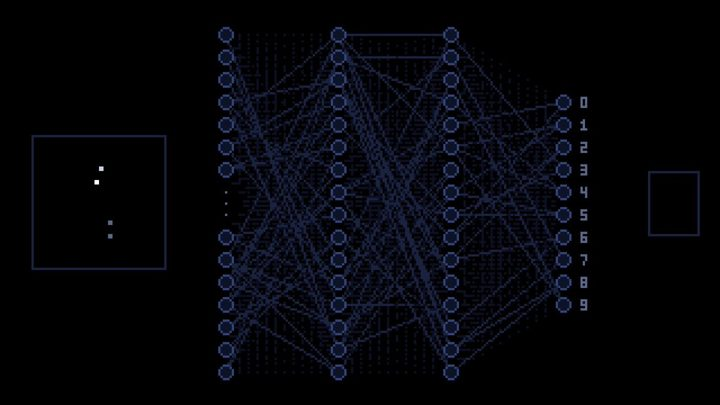

[← Back to gallery](../browse/education.en.md) · [简体中文](2102737776219168939.md)

# Pixel Art Neural Network Training

**[Carlos Santana · @DotCSV](https://x.com/DotCSV)** · Education & explainers · 56s

> Discovery pool · Source verified; catalog details being completed.

**[▶ Open gallery to play](https://guanmo-ai.github.io/awesome-ai-motion/?lang=en#case-2102737776219168939)** · [Original post](https://x.com/DotCSV/status/2102737776219168939)

Click the cover to open the gallery and play.

Pixel Art Neural Network Training, shared by Carlos Santana. Production attribution follows the creator’s post. Source verified; full viewing review pending.

No public prompt has been verified. [View the original post](https://x.com/DotCSV/status/2102737776219168939)

Bookmarks 3,196 · Likes 9,243 · Views 563,728

## Source record

- Original post: [@DotCSV](https://x.com/DotCSV/status/2102737776219168939) · 2026-09-23T12:32:07+00:00
- Model attribution: Claude Opus 5.5 · [Creator’s statement](https://x.com/DotCSV/status/2102737776219168939)
- Prompt lookup: [Creator post](https://x.com/DotCSV/status/2102737776219168939) · 2026-09-27 17:07 UTC
- Cover source: [Original cover source](https://pbs.twimg.com/amplify_video_thumb/2102736360750579712/img/dCHBu9qqCypGbT9v.jpg)
- Metrics snapshot: [Original X post](https://x.com/DotCSV/status/2102737776219168939) · 2026-09-27 17:07 UTC
- Gallery video source: [Original post media record](https://x.com/DotCSV/status/2102737776219168939) · 2026-09-27 17:10 UTC · Post/media correspondence and media response checked; external reference, no re-upload

Model attribution is based on creator statements. Prompts have not been independently rerun; sound and visuals have not received a uniform quality rating. Videos reference original post media, not our uploads; redistribution permission has not been verified.
