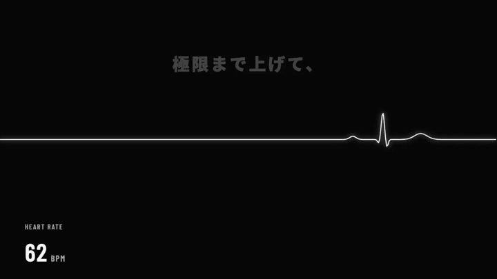

[← 返回图库](../browse/product.md) · [English](2102766871007436993.en.md)

# BLVCKOUT 非官方宣传片

**[Yasutaka Nishii · @ystknsh](https://x.com/ystknsh)** · 产品宣传 · 30s

> 发现池 · 已核对作者原帖与媒体来源，尚未完整审看。

**[▶ 观看原视频](https://video.twimg.com/amplify_video/2102766753185234944/vid/avc1/1280x720/xcGLi8UJ2ya_kG2R.mp4?tag=14)**

[作者原帖](https://x.com/ystknsh/status/2102766871007436993)

Yasutaka Nishii 发布的BLVCKOUT 非官方宣传片。制作方式依据作者原帖说明；来源已核对，完整音画待审看。

未取得作者公开提示词。 [查看作者原帖](https://x.com/ystknsh/status/2102766871007436993)

收藏 6 · 点赞 11 · 浏览 18,769

## 来源记录

- 作品原帖: [@ystknsh](https://x.com/ystknsh/status/2102766871007436993) · 2026-09-23T14:27:44+00:00
- 模型归因: Claude Opus 5.5 · [作者说明](https://x.com/ystknsh/status/2102766871007436993)
- 提示词查阅记录: [作者原帖](https://x.com/ystknsh/status/2102766871007436993) · 2026-09-27 17:07 UTC
- 封面来源: [原媒体](https://pbs.twimg.com/amplify_video_thumb/2102766753185234944/img/nODn581rp6PulfEW.jpg)
- 互动数据: [X](https://x.com/ystknsh/status/2102766871007436993) · 2026-09-27 17:07 UTC · 第三方匿名读取，非 X 官方 API
- 发现入口: [资料页](https://github.com/opusvideo/awesome-claude-video/blob/d90b8a46f122614b14885147246c710ae1c7781f/cases.json)
- 画廊原视频: [原帖媒体](https://video.twimg.com/amplify_video/2102766753185234944/vid/avc1/1280x720/xcGLi8UJ2ya_kG2R.mp4?tag=14) · 2026-09-27 17:09 UTC · 已核对原帖媒体对应与媒体响应；外部引用，不重新上传

模型依据来自作者自述，未独立重跑提示词，也未对音画作统一质量评级。视频引用作者原帖媒体，未由本站重新上传，转载许可未确认。
