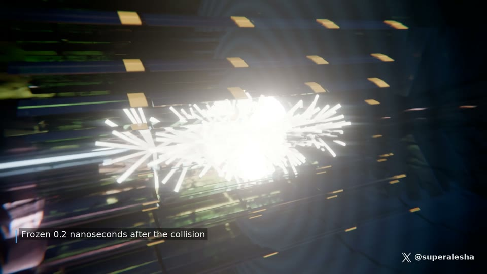

[← 返回图库](../browse/education.md) · [English](2102779758408774104.en.md)

<a id="case-2102779758408774104"></a>

# 走进强子对撞机的质子碰撞

**[Alexey Fateev · @superalesha](https://x.com/superalesha)** · 知识讲解 · 34s

**[▶ 打开画廊播放](https://guanmo-ai.github.io/awesome-ai-motion/#case-2102779758408774104)** · [作者原帖](https://x.com/superalesha/status/2102779758408774104)

点击封面打开画廊播放。

[](https://guanmo-ai.github.io/awesome-ai-motion/#case-2102779758408774104)


从磁体隧道进入探测器，展示质子碰撞与粒子轨迹；作者说明由代码生成 Blender 场景与声音。

> 使用前: 作者任务描述，不是完整提示词；几何、材质、镜头和声音由代码生成。粒子轨迹的物理准确性未独立核验。

**作者任务描述 · 非完整提示词** · [出处](https://x.com/superalesha/status/2102779758408774104) · [纯文本](../prompts/2102779758408774104.txt)

```text
I asked it to create a proton collision scene in the Large Hadron Collider - from the magnet tunnel to the particle burst inside the detector.
```

<details>
<summary>中文译文</summary>

```text
我让它制作大型强子对撞机中的质子碰撞场景：从磁体隧道一直到探测器内部的粒子爆发。
```

</details>

<sub>收藏 300 · 点赞 614 · 浏览 78,967</sub>


## 来源记录

- 作品原帖: [@superalesha](https://x.com/superalesha/status/2102779758408774104) · Wed Sep 23 15:18:56 +0000 2026
- 模型归因: Claude Opus 5.5 · [作者说明](https://x.com/superalesha/status/2102779758408774104)
- 提示词出处: [作者原帖](https://x.com/superalesha/status/2102779758408774104) · 2026-09-27 11:13 UTC
- 封面来源: [原帖封面来源](https://x.com/superalesha/status/2102779758408774104) · 24s
- 互动数据: [X](https://x.com/superalesha/status/2102779758408774104) · 2026-09-27 11:13 UTC · 第三方匿名读取，非 X 官方 API
- 发现入口: [资料页](https://github.com/theolundqvist/frontier-games)
- 画廊原视频: [原帖媒体记录](https://x.com/superalesha/status/2102779758408774104) · 2026-09-27 11:17 UTC · 已核对原帖媒体对应与媒体响应；外部引用，不重新上传

模型依据来自作者自述，未独立重跑提示词，也未对音画作统一质量评级。视频引用作者原帖媒体，未由本站重新上传，转载许可未确认。
