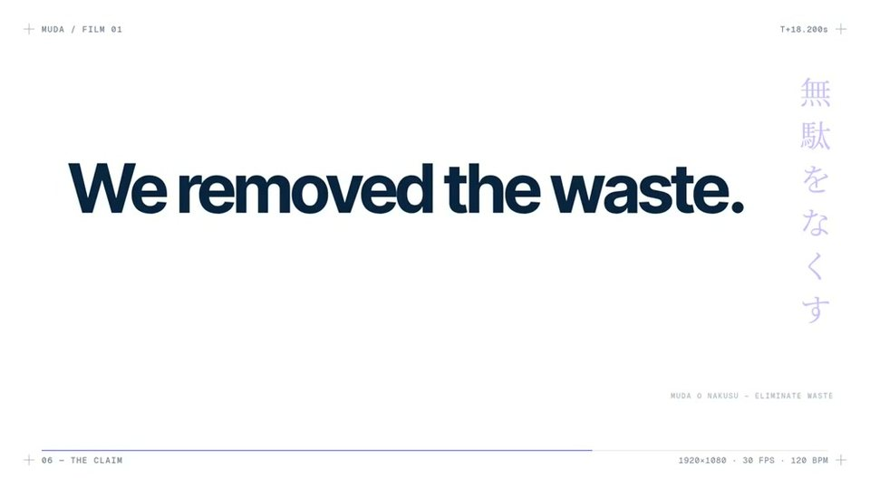

[← Back to gallery](../browse/product.en.md) · [简体中文](2102787937482252537.md)

<a id="case-2102787937482252537"></a>

# A one-line prompt for an inference startup launch

**[Deedy · @deedydas](https://x.com/deedydas)** · Product & marketing · 26s

**[▶ Open gallery to play](https://guanmo-ai.github.io/awesome-ai-motion/?lang=en#case-2102787937482252537)** · [Original post](https://x.com/deedydas/status/2102787937482252537)

Click the cover to open the gallery and play.

[](https://guanmo-ai.github.io/awesome-ai-motion/?lang=en#case-2102787937482252537)


A concise launch film that makes an abstract inference service easier to explain.

**Creator’s public prompt** · [Source](https://x.com/deedydas/status/2102787937482252537) · [Plain text](../prompts/2102787937482252537.txt)

```text
make a modern slick and punchy video for a modern startup that works on inference
```

<sub>Bookmarks 4,697 · Likes 3,242 · Views 337,803</sub>


## Source record

- Original post: [@deedydas](https://x.com/deedydas/status/2102787937482252537) · Wed Sep 23 15:51:26 +0000 2026
- Model attribution: Claude Opus 5.5 · [Creator’s statement](https://x.com/deedydas/status/2102787937482252537)
- Prompt source: [Creator post](https://x.com/deedydas/status/2102787937482252537) · 2026-09-27 04:57 UTC
- Cover source: [Original cover source](https://x.com/deedydas/status/2102787937482252537) · 18.2s
- Metrics snapshot: [Original X post](https://x.com/deedydas/status/2102787937482252537) · 2026-09-27 04:57 UTC
- Gallery video source: [Original post media record](https://x.com/deedydas/status/2102787937482252537) · 2026-09-27 11:17 UTC · Post/media correspondence and media response checked; external reference, no re-upload

Model attribution is based on creator statements. Prompts have not been independently rerun; sound and visuals have not received a uniform quality rating. Videos reference original post media, not our uploads; redistribution permission has not been verified.
