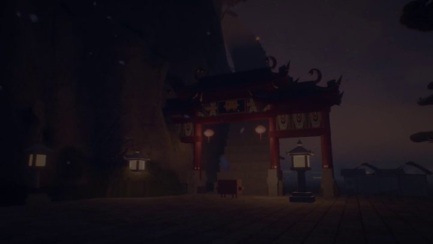

[← Back to gallery](../browse/motion.en.md) · [简体中文](2102788371114246177.md)

# Training Montage of an AI Model

**[Ishu Agrawal · @ishuagra02](https://x.com/ishuagra02)** · Motion design · 30s

> Discovery pool · Source verified; catalog details being completed.

**[▶ Open gallery to play](https://guanmo-ai.github.io/awesome-ai-motion/?lang=en#case-2102788371114246177)** · [Original post](https://x.com/ishuagra02/status/2102788371114246177)

Click the cover to open the gallery and play.

Training Montage of an AI Model, shared by Ishu Agrawal. Production attribution follows the creator’s post. Source verified; full viewing review pending.

No public prompt has been verified. [View the original post](https://x.com/ishuagra02/status/2102788371114246177)

Bookmarks 195 · Likes 329 · Views 15,629

## Source record

- Original post: [@ishuagra02](https://x.com/ishuagra02/status/2102788371114246177) · 2026-09-23T15:53:10+00:00
- Model attribution: Claude Opus 5.5 · [Creator’s statement](https://x.com/ishuagra02/status/2102788371114246177)
- Prompt lookup: [Creator post](https://x.com/ishuagra02/status/2102788371114246177) · 2026-09-27 17:08 UTC
- Cover source: [Original cover source](https://pbs.twimg.com/amplify_video_thumb/2102787398966927360/img/QRd92HJSVkpgAoy2.jpg)
- Metrics snapshot: [Original X post](https://x.com/ishuagra02/status/2102788371114246177) · 2026-09-27 17:08 UTC
- Gallery video source: [Original post media record](https://x.com/ishuagra02/status/2102788371114246177) · 2026-09-27 17:10 UTC · Post/media correspondence and media response checked; external reference, no re-upload

Model attribution is based on creator statements. Prompts have not been independently rerun; sound and visuals have not received a uniform quality rating. Videos reference original post media, not our uploads; redistribution permission has not been verified.
