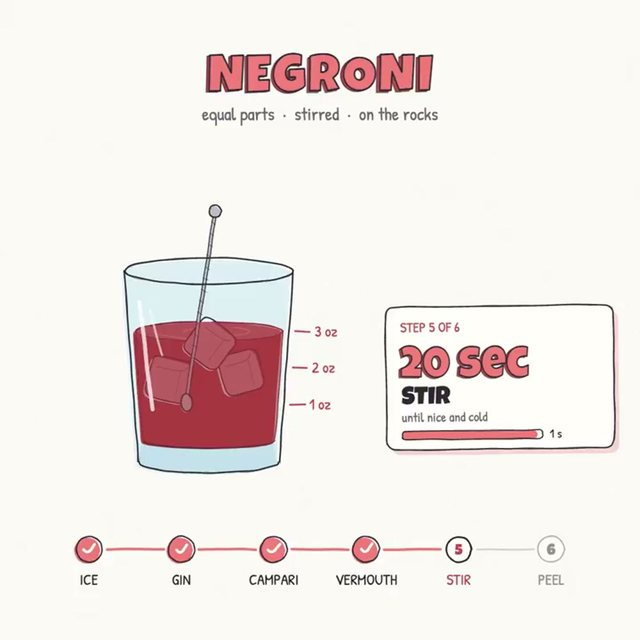

[← 返回图库](../browse/education.md) · [English](2102853258582880547.en.md)

<a id="case-2102853258582880547"></a>

# 让鸡尾酒配方动起来

**[Rory Flynn · @Ror\_Fly](https://x.com/Ror_Fly)** · 知识讲解 · 30s

**[▶ 观看原视频](https://video.twimg.com/amplify_video/2102853041246347264/vid/avc1/720x720/vW1QSV3nbAKczNx5.mp4?tag=29)**

[](https://video.twimg.com/amplify_video/2102853041246347264/vid/avc1/720x720/vW1QSV3nbAKczNx5.mp4?tag=29)

[作者原帖](https://x.com/Ror_Fly/status/2102853258582880547)

从空杯到成品，随着原料加入显示名称和用量；适合步骤型教程。

> 使用前: 作者提供了一张参考图，使用时需自行准备对应配方或参考图。

**作者公开提示词** · [出处](https://x.com/Ror_Fly/status/2102853258582880547) · [纯文本](../prompts/2102853258582880547.txt)

```text
We're going to try a little test. Do you think you could render a recipe motion graphic animation using javascript or html (w/e you think will produce the best) to show the full recipe from start to finish (empty glass to completed cocktail) - Explainer video style - Showing the recipe ingreidents + measurements as they're going into the cup. Should be a 30s video.
```

<details>
<summary>中文译文</summary>

```text
我们来做个小测试。你能用 JavaScript 或 HTML（选择你认为效果最好的方式）渲染一段配方动态图形动画，完整展示从空杯到调好鸡尾酒的过程吗？采用讲解视频风格，在原料加入杯中时显示原料和用量。时长应为 30 秒。
```

</details>

<sub>收藏 1,442 · 点赞 1,011 · 浏览 73,160</sub>


## 来源记录

- 作品原帖: [@Ror\_Fly](https://x.com/Ror_Fly/status/2102853258582880547) · Wed Sep 23 20:11:00 +0000 2026
- 模型归因: Claude Opus 5.5 · [作者说明](https://x.com/Ror_Fly/status/2102853258582880547)
- 提示词出处: [作者原帖](https://x.com/Ror_Fly/status/2102853258582880547) · 2026-09-27 04:57 UTC
- 封面来源: [原媒体](https://video.twimg.com/amplify_video/2102853041246347264/vid/avc1/720x720/vW1QSV3nbAKczNx5.mp4?tag=29) · 24s
- 互动数据: [X](https://x.com/Ror_Fly/status/2102853258582880547) · 2026-09-27 04:57 UTC · 第三方匿名读取，非 X 官方 API
- 发现入口: [资料页](https://github.com/opusvideo/awesome-claude-video)
- 画廊原视频: [原帖媒体](https://video.twimg.com/amplify_video/2102853041246347264/vid/avc1/720x720/vW1QSV3nbAKczNx5.mp4?tag=29) · 2026-09-27 11:17 UTC · 已核对原帖媒体对应与媒体响应；外部引用，不重新上传

模型依据来自作者自述，未独立重跑提示词，也未对音画作统一质量评级。视频引用作者原帖媒体，未由本站重新上传，转载许可未确认。
