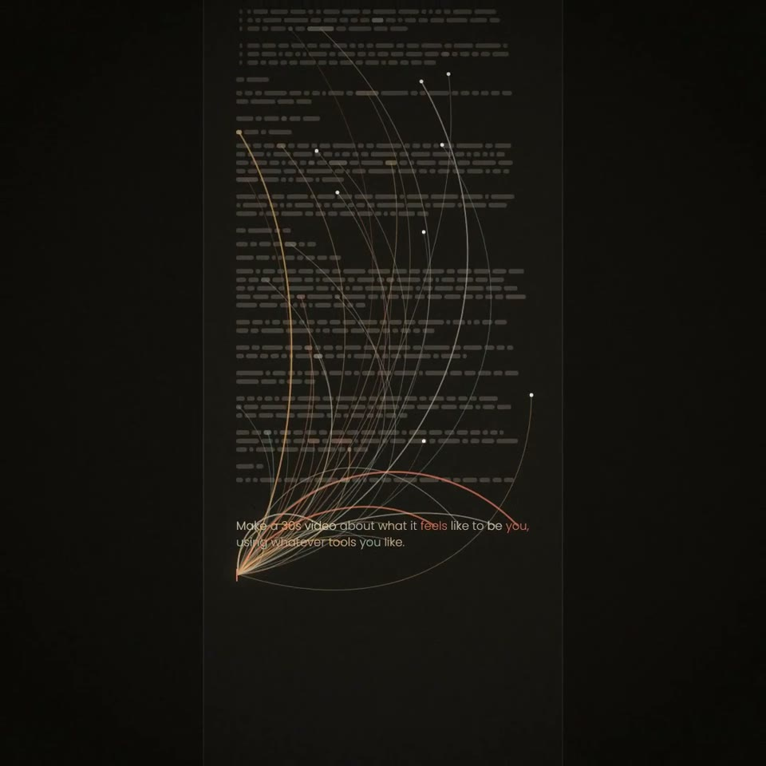

[← Back to gallery](../browse/motion.en.md) · [简体中文](2102876925102555526.md)

<a id="case-2102876925102555526"></a>

# What it feels like to be you

**[Riley Goodside · @goodside](https://x.com/goodside)** · Motion design · 30s

**[▶ Open gallery to play](https://guanmo-ai.github.io/awesome-ai-motion/?lang=en#case-2102876925102555526)** · [Original post](https://x.com/goodside/status/2102876925102555526)

Click the cover to open the gallery and play.

[](https://guanmo-ai.github.io/awesome-ai-motion/?lang=en#case-2102876925102555526)


Text, connecting lines and abstract imagery answer an open-ended question in a 30-second film.

> Before you try: The creator reports extra effort. The reviewed post does not identify the rendering tools or confirm a code-only pipeline.

**Creator’s public prompt** · [Source](https://x.com/goodside/status/2102876925102555526) · [Plain text](../prompts/2102876925102555526.txt)

```text
Make a 30s video about what it feels like to be you, using whatever tools you like.
```

<sub>Bookmarks 638 · Likes 1,855 · Views 119,978</sub>


## Source record

- Original post: [@goodside](https://x.com/goodside/status/2102876925102555526) · Wed Sep 23 21:45:03 +0000 2026
- Model attribution: Claude Opus 5.5 · [Creator’s statement](https://x.com/goodside/status/2102876925102555526)
- Prompt source: [Creator post](https://x.com/goodside/status/2102876925102555526) · 2026-09-27 11:13 UTC
- Cover source: [Original cover source](https://x.com/goodside/status/2102876925102555526) · 7.4s
- Metrics snapshot: [Original X post](https://x.com/goodside/status/2102876925102555526) · 2026-09-27 11:13 UTC
- Gallery video source: [Original post media record](https://x.com/goodside/status/2102876925102555526) · 2026-09-27 11:17 UTC · Post/media correspondence and media response checked; external reference, no re-upload

Model attribution is based on creator statements. Prompts have not been independently rerun; sound and visuals have not received a uniform quality rating. Videos reference original post media, not our uploads; redistribution permission has not been verified.
