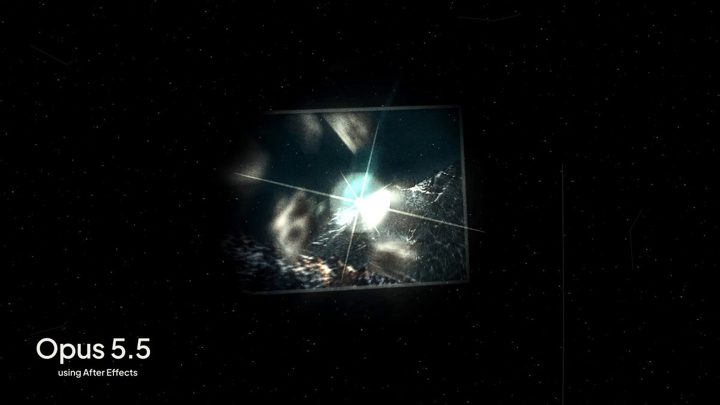

[← Back to gallery](../browse/motion.en.md) · [简体中文](2102911234526048706.md)

# Multi-Round After Effects Production Test

**[Kris · @throughiris\_](https://x.com/throughiris_)** · Motion design · 12s

> Discovery pool · Creator post and media source verified; full viewing review pending.

**[▶ Watch video](https://video.twimg.com/amplify_video/2102909490500886528/vid/avc1/1920x1080/p7YQUKcxUxi9n9LX.mp4?tag=29)**

[Original post](https://x.com/throughiris_/status/2102911234526048706)

Multi-Round After Effects Production Test, shared by Kris. Production attribution follows the creator’s post. Source verified; full viewing review pending.

No public prompt has been verified. [View the original post](https://x.com/throughiris_/status/2102911234526048706)

Bookmarks 0 · Likes 0 · Views 48

## Source record

- Original post: [@throughiris\_](https://x.com/throughiris_/status/2102911234526048706) · 2026-09-24T00:01:23+00:00
- Model attribution: Claude Opus 5.5 · [Creator’s statement](https://x.com/throughiris_/status/2102911234526048706)
- Prompt lookup: [Creator post](https://x.com/throughiris_/status/2102911234526048706) · 2026-09-27 17:08 UTC
- Cover source: [Original media](https://pbs.twimg.com/amplify_video_thumb/2102909490500886528/img/_ILnllFZS9Ugk1aO.jpg)
- Metrics: [X](https://x.com/throughiris_/status/2102911234526048706) · 2026-09-27 17:08 UTC · Anonymous third-party snapshot, not the official X API
- Discovered via: [Reference](https://github.com/athemeroy/awesome-opus-5-5-videos/blob/f0728e6fd1e5ec496815c1c7ba115bc70e3a31f9/data/cases.csv)
- Gallery video source: [Original post media](https://video.twimg.com/amplify_video/2102909490500886528/vid/avc1/1920x1080/p7YQUKcxUxi9n9LX.mp4?tag=29) · 2026-09-27 17:10 UTC · Post/media correspondence and media response checked; external reference, no re-upload

Model attribution is based on creator statements. Prompts have not been independently rerun; sound and visuals have not received a uniform quality rating. Videos reference original post media, not our uploads; redistribution permission has not been verified.
