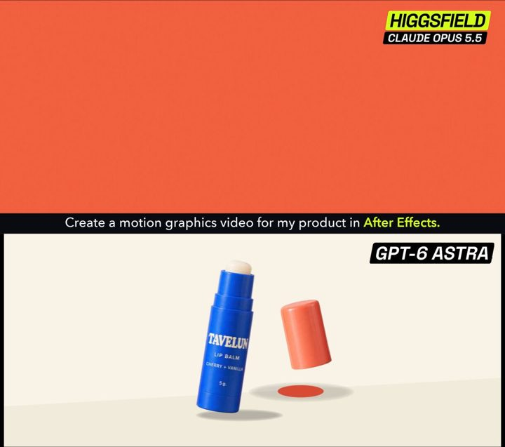

[← Back to gallery](../browse/product.en.md) · [简体中文](2102913101926731879.md)

<a id="case-2102913101926731879"></a>

# Lip balm ad model comparison

**[Higgsfield AI 🧩 · @higgsfield\_ai](https://x.com/higgsfield_ai)** · Product & marketing · 20s

> Discovery pool · Creator post and media source verified; full viewing review pending.

**[▶ Open gallery to play](https://guanmo-ai.github.io/awesome-ai-motion/?lang=en#case-2102913101926731879)** · [Original post](https://x.com/higgsfield_ai/status/2102913101926731879)

Click the cover to open the gallery and play.

[](https://guanmo-ai.github.io/awesome-ai-motion/?lang=en#case-2102913101926731879)


Lip balm ad model comparison, shared by Higgsfield AI 🧩. Production attribution follows the creator’s post. Source verified; full viewing review pending.

**Author brief · not the complete prompt** · [Source](https://x.com/higgsfield_ai/status/2102913101926731879) · [Plain text](../prompts/2102913101926731879.txt)

```text
Both got the same brand assets and the same task: make a 20-second product video in After Effects, timed to music.
```

<sub>Bookmarks 48 · Likes 107 · Views 15,611</sub>


## Source record

- Original post: [@higgsfield\_ai](https://x.com/higgsfield_ai/status/2102913101926731879) · 2026-09-24T00:08:48+00:00
- Model attribution: Claude Opus 5.5 · [Creator’s statement](https://x.com/higgsfield_ai/status/2102913101926731879)
- Prompt source: [Creator post](https://x.com/higgsfield_ai/status/2102913101926731879) · 2026-09-27 17:07 UTC
- Cover source: [Original cover source](https://pbs.twimg.com/amplify_video_thumb/2102912880102559744/img/WT0cvOXSUc7cXqBl.jpg)
- Metrics snapshot: [Original X post](https://x.com/higgsfield_ai/status/2102913101926731879) · 2026-09-27 17:07 UTC
- Gallery video source: [Original post media record](https://x.com/higgsfield_ai/status/2102913101926731879) · 2026-09-27 17:09 UTC · Post/media correspondence and media response checked; external reference, no re-upload

Model attribution is based on creator statements. Prompts have not been independently rerun; sound and visuals have not received a uniform quality rating. Videos reference original post media, not our uploads; redistribution permission has not been verified.
