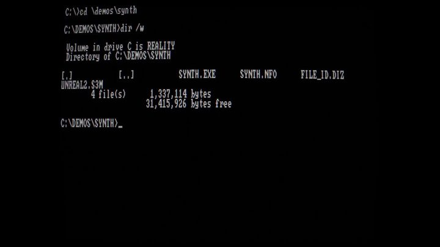

[← 返回图库](../browse/motion.md) · [English](2102919394775220530.en.md)

<a id="case-2102919394775220530"></a>

# 九十年代风格视听演示

**[gandamu · @gandamu\_ml](https://x.com/gandamu_ml)** · 短动效 · 383s

> 发现池 · 已核对作者原帖与媒体来源，尚未完整审看。

**[▶ 打开画廊播放](https://guanmo-ai.github.io/awesome-ai-motion/#case-2102919394775220530)** · [作者原帖](https://x.com/gandamu_ml/status/2102919394775220530)

点击封面打开画廊播放。

[](https://guanmo-ai.github.io/awesome-ai-motion/#case-2102919394775220530)


gandamu 发布的九十年代风格视听演示。制作方式依据作者原帖说明；来源已核对，完整音画待审看。

**作者任务描述 · 非完整提示词** · [出处](https://x.com/gandamu_ml/status/2102919394775220530) · [纯文本](../prompts/2102919394775220530.txt)

```text
Opus 5.5 just one-shot this 90s-style demoscene demo for me. It's pretty good.
It's a genuine one-shot (in colloquial X post sense - single prompt) and my first attempt asking it to do such a thing. I just supplied Purple Motion's music from Second Reality. C/C++ and OpenGL.
```

<sub>收藏 358 · 点赞 771 · 浏览 37,525</sub>


## 来源记录

- 作品原帖: [@gandamu\_ml](https://x.com/gandamu_ml/status/2102919394775220530) · 2026-09-24T00:33:48+00:00
- 模型归因: Claude Opus 5.5 · [作者说明](https://x.com/gandamu_ml/status/2102919394775220530)
- 提示词出处: [作者原帖](https://x.com/gandamu_ml/status/2102919394775220530) · 2026-09-27 17:07 UTC
- 封面来源: [原帖封面来源](https://pbs.twimg.com/amplify_video_thumb/2102918851176595456/img/rVQ6EwIvD6iMHgOA.jpg)
- 互动快照: [X 原帖](https://x.com/gandamu_ml/status/2102919394775220530) · 2026-09-27 17:07 UTC
- 画廊原视频: [原帖媒体记录](https://x.com/gandamu_ml/status/2102919394775220530) · 2026-09-27 17:10 UTC · 已核对原帖媒体对应与媒体响应；外部引用，不重新上传

模型依据来自作者自述，未独立重跑提示词，也未对音画作统一质量评级。视频引用作者原帖媒体，未由本站重新上传，转载许可未确认。
