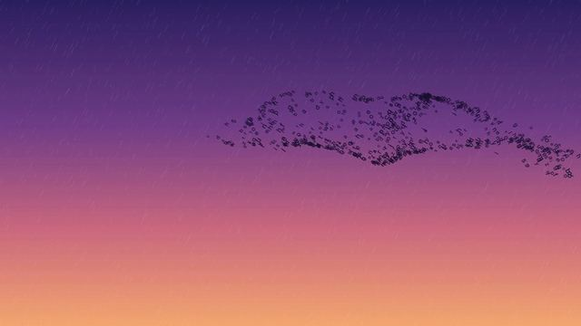

[← Back to gallery](../browse/motion.en.md) · [简体中文](2103024907965612250.md)

# One-Prompt Animation Experiment

**[Pivi · @pivi\_\_\_](https://x.com/pivi___)** · Motion design · 33s

> Discovery pool · Creator post and media source verified; full viewing review pending.

**[▶ Open gallery to play](https://guanmo-ai.github.io/awesome-ai-motion/?lang=en#case-2103024907965612250)** · [Original post](https://x.com/pivi___/status/2103024907965612250)

Click the cover to open the gallery and play.

One-Prompt Animation Experiment, shared by Pivi. Production attribution follows the creator’s post. Source verified; full viewing review pending.

No public prompt has been verified. [View the original post](https://x.com/pivi___/status/2103024907965612250)

Bookmarks 233 · Likes 245 · Views 65,771

## Source record

- Original post: [@pivi\_\_\_](https://x.com/pivi___/status/2103024907965612250) · 2026-09-24T07:33:05+00:00
- Model attribution: Claude Opus 5.5 · [Creator’s statement](https://x.com/pivi___/status/2103024907965612250)
- Prompt lookup: [Creator post](https://x.com/pivi___/status/2103024907965612250) · 2026-09-27 17:08 UTC
- Cover source: [Original cover source](https://pbs.twimg.com/amplify_video_thumb/2103024492259704832/img/5q-x5LkEYRWadnpc.jpg)
- Metrics: [X](https://x.com/pivi___/status/2103024907965612250) · 2026-09-27 17:08 UTC · Anonymous third-party snapshot, not the official X API
- Discovered via: [Reference](https://github.com/athemeroy/awesome-opus-5-5-videos/blob/f0728e6fd1e5ec496815c1c7ba115bc70e3a31f9/data/cases.csv)
- Gallery video source: [Original post media record](https://x.com/pivi___/status/2103024907965612250) · 2026-09-27 17:10 UTC · Post/media correspondence and media response checked; external reference, no re-upload

Model attribution is based on creator statements. Prompts have not been independently rerun; sound and visuals have not received a uniform quality rating. Videos reference original post media, not our uploads; redistribution permission has not been verified.
