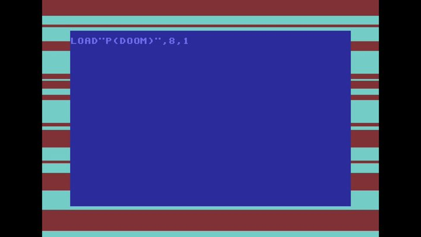

[← 返回图库](../browse/characters.md) · [English](2103028027861152225.en.md)

<a id="case-2103028027861152225"></a>

# 复古电脑演示场景

**[cromwellian · @cromwellian](https://x.com/cromwellian)** · 角色动画 · 164s

> 发现池 · 已核对作者原帖与媒体来源，尚未完整审看。

**[▶ 观看原视频](https://video.twimg.com/amplify_video/2103027515736633345/vid/avc1/1920x1080/uZjDnCBaZF_VKmLc.mp4?tag=29)**

[](https://video.twimg.com/amplify_video/2103027515736633345/vid/avc1/1920x1080/uZjDnCBaZF_VKmLc.mp4?tag=29)

[作者原帖](https://x.com/cromwellian/status/2103028027861152225)

cromwellian 发布的复古电脑演示场景。制作方式依据作者原帖说明；来源已核对，完整音画待审看。

**作者任务描述 · 非完整提示词** · [出处](https://x.com/cromwellian/status/2103028027861152225) · [纯文本](../prompts/2103028027861152225.txt)

```text
I'm Upping My P(doom) C64 Demoscene version. I asked Opus 5.5 to make SID/VIC version in the style of C64 demos using rasterbars, scrollers, sprites, FLD, etc.  It wrote a VIC and SID emulator using Javascript, and proceeding to code up the demo using the lyrics. It failed fetching the music video, so the SID music doesn't really correspond, but not bad for a first try.
```

<sub>收藏 1 · 点赞 9 · 浏览 536</sub>


## 来源记录

- 作品原帖: [@cromwellian](https://x.com/cromwellian/status/2103028027861152225) · 2026-09-24T07:45:28+00:00
- 模型归因: Claude Opus 5.5 · [作者说明](https://x.com/cromwellian/status/2103028027861152225)
- 提示词出处: [作者原帖](https://x.com/cromwellian/status/2103028027861152225) · 2026-09-27 17:08 UTC
- 封面来源: [原媒体](https://pbs.twimg.com/amplify_video_thumb/2103027515736633345/img/IX-n-KClkGzcJw0G.jpg)
- 互动数据: [X](https://x.com/cromwellian/status/2103028027861152225) · 2026-09-27 17:08 UTC · 第三方匿名读取，非 X 官方 API
- 发现入口: [资料页](https://github.com/athemeroy/awesome-opus-5-5-videos/blob/f0728e6fd1e5ec496815c1c7ba115bc70e3a31f9/data/cases.csv)
- 画廊原视频: [原帖媒体](https://video.twimg.com/amplify_video/2103027515736633345/vid/avc1/1920x1080/uZjDnCBaZF_VKmLc.mp4?tag=29) · 2026-09-27 17:10 UTC · 已核对原帖媒体对应与媒体响应；外部引用，不重新上传

模型依据来自作者自述，未独立重跑提示词，也未对音画作统一质量评级。视频引用作者原帖媒体，未由本站重新上传，转载许可未确认。
