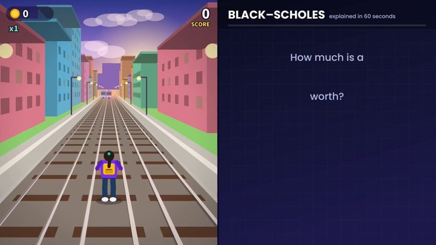

[← Back to gallery](../browse/education.en.md) · [简体中文](2103171088637419631.md)

<a id="case-2103171088637419631"></a>

# Option Formula Beside a Runner Game

**[Riley Goodside · @goodside](https://x.com/goodside)** · Education & explainers · 60s

> Discovery pool · Creator post and media source verified; full viewing review pending.

**[▶ Open gallery to play](https://guanmo-ai.github.io/awesome-ai-motion/?lang=en#case-2103171088637419631)** · [Original post](https://x.com/goodside/status/2103171088637419631)

Click the cover to open the gallery and play.

[](https://guanmo-ai.github.io/awesome-ai-motion/?lang=en#case-2103171088637419631)


Option Formula Beside a Runner Game, shared by Riley Goodside. Production attribution follows the creator’s post. Source verified; full viewing review pending.

**Creator’s public prompt** · [Source](https://x.com/goodside/status/2103171088637419631) · [Plain text](../prompts/2103171088637419631.txt)

```text
Create a 1 minute video where the right half explains the Black-Scholes formula with voiceover and visuals and the left half plays a generic knockoff of Subway Surfers
```

<sub>Bookmarks 45 · Likes 168 · Views 13,092</sub>


## Source record

- Original post: [@goodside](https://x.com/goodside/status/2103171088637419631) · 2026-09-24T17:13:57+00:00
- Model attribution: Claude Opus 5.5 · [Creator’s statement](https://x.com/goodside/status/2103171088637419631)
- Prompt source: [Creator post](https://x.com/goodside/status/2103171088637419631) · 2026-09-27 17:07 UTC
- Cover source: [Original cover source](https://pbs.twimg.com/amplify_video_thumb/2103171023721959425/img/HN6YHIiKeua9ng6q.jpg)
- Metrics snapshot: [Original X post](https://x.com/goodside/status/2103171088637419631) · 2026-09-27 17:07 UTC
- Gallery video source: [Original post media record](https://x.com/goodside/status/2103171088637419631) · 2026-09-27 17:10 UTC · Post/media correspondence and media response checked; external reference, no re-upload

Model attribution is based on creator statements. Prompts have not been independently rerun; sound and visuals have not received a uniform quality rating. Videos reference original post media, not our uploads; redistribution permission has not been verified.
