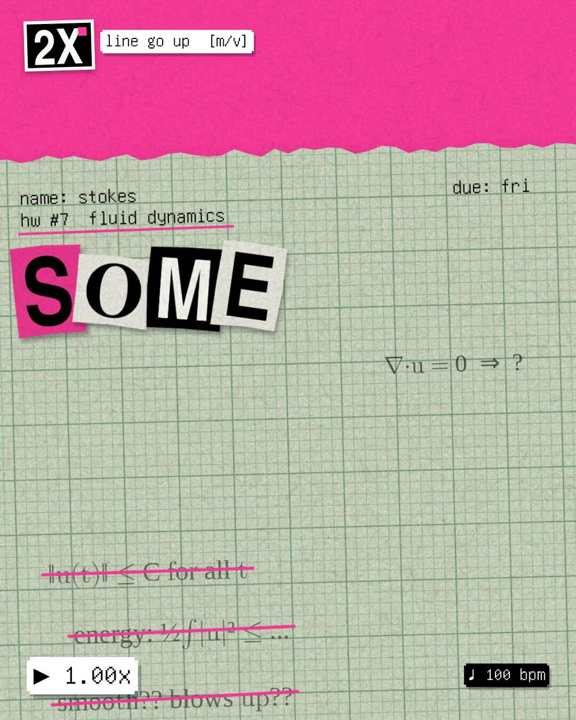

[← 返回图库](../browse/music.md) · [English](2103173729656459455.en.md)

# 二十秒音乐短片

**[anj · @anjmaxx](https://x.com/anjmaxx)** · 音乐与歌词 · 20s

> 发现池 · 已核对作者原帖与媒体来源，尚未完整审看。

**[▶ 观看原视频](https://video.twimg.com/amplify_video/2103170637623922688/vid/avc1/1080x1350/GufiQ4ikr6Ej8yv5.mp4?tag=29)**

[作者原帖](https://x.com/anjmaxx/status/2103173729656459455)

anj 发布的二十秒音乐短片。制作方式依据作者原帖说明；来源已核对，完整音画待审看。

未取得作者公开提示词。 [查看作者原帖](https://x.com/anjmaxx/status/2103173729656459455)

收藏 7 · 点赞 10 · 浏览 816

## 来源记录

- 作品原帖: [@anjmaxx](https://x.com/anjmaxx/status/2103173729656459455) · 2026-09-24T17:24:26+00:00
- 模型归因: Claude Opus 5.5 · [作者说明](https://x.com/anjmaxx/status/2103173729656459455)
- 提示词查阅记录: [作者原帖](https://x.com/anjmaxx/status/2103173729656459455) · 2026-09-27 17:08 UTC
- 封面来源: [原媒体](https://pbs.twimg.com/amplify_video_thumb/2103170637623922688/img/evTL55F1PySRV5f4.jpg)
- 互动数据: [X](https://x.com/anjmaxx/status/2103173729656459455) · 2026-09-27 17:08 UTC · 第三方匿名读取，非 X 官方 API
- 发现入口: [资料页](https://github.com/athemeroy/awesome-opus-5-5-videos/blob/f0728e6fd1e5ec496815c1c7ba115bc70e3a31f9/data/cases.csv)
- 画廊原视频: [原帖媒体](https://video.twimg.com/amplify_video/2103170637623922688/vid/avc1/1080x1350/GufiQ4ikr6Ej8yv5.mp4?tag=29) · 2026-09-27 17:10 UTC · 已核对原帖媒体对应与媒体响应；外部引用，不重新上传

模型依据来自作者自述，未独立重跑提示词，也未对音画作统一质量评级。视频引用作者原帖媒体，未由本站重新上传，转载许可未确认。
