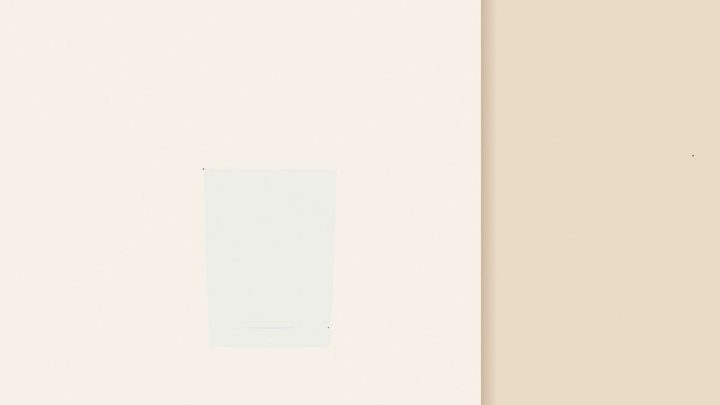

[← 返回图库](../browse/education.md) · [English](2103418429248069973.en.md)

<a id="case-2103418429248069973"></a>

# 鸡尾酒制作过程动效

**[Sarutobi Sasuke🥷 · @Sarut0biSasuke](https://x.com/Sarut0biSasuke)** · 知识讲解 · 30s

> 发现池 · 已核对作者原帖与媒体来源，尚未完整审看。

**[▶ 在 X 原帖观看](https://x.com/Sarut0biSasuke/status/2103418429248069973)**

[](https://x.com/Sarut0biSasuke/status/2103418429248069973)


Sarutobi Sasuke🥷 发布的鸡尾酒制作过程动效。制作方式依据作者原帖说明；来源已核对，完整音画待审看。

**作者公开提示词** · [出处](https://x.com/Sarut0biSasuke/status/2103418429248069973) · [纯文本](../prompts/2103418429248069973.txt)

```text
Render a recipe motion graphic animation using JavaScript or HTML (whatever you think will produce the best result) to show the full recipe for a White Russian from start to finish, empty glass to completed cocktail. Explainer video style, showing the ingredients and measurements as they go into the glass. It should be a 30s video.
```

<sub>收藏 1 · 点赞 19 · 浏览 870</sub>


## 来源记录

- 作品原帖: [@Sarut0biSasuke](https://x.com/Sarut0biSasuke/status/2103418429248069973) · 2026-09-25T09:36:47+00:00
- 模型归因: Claude Opus 5.5 · [作者说明](https://x.com/Sarut0biSasuke/status/2103418429248069973)
- 提示词出处: [作者原帖](https://x.com/Sarut0biSasuke/status/2103418429248069973) · 2026-09-27 17:08 UTC
- 封面来源: [原帖封面来源](https://pbs.twimg.com/amplify_video_thumb/2103418324017156096/img/--H01siR-2EJvhd7.jpg)
- 互动数据: [X](https://x.com/Sarut0biSasuke/status/2103418429248069973) · 2026-09-27 17:08 UTC · 第三方匿名读取，非 X 官方 API
- 发现入口: [资料页](https://github.com/athemeroy/awesome-opus-5-5-videos/blob/f0728e6fd1e5ec496815c1c7ba115bc70e3a31f9/data/cases.csv)
- 画廊原视频: [原帖媒体记录](https://x.com/Sarut0biSasuke/status/2103418429248069973) · 2026-09-27 17:10 UTC · 已核对原帖媒体对应与媒体响应；外部引用，不重新上传

模型依据来自作者自述，未独立重跑提示词，也未对音画作统一质量评级。视频引用作者原帖媒体，未由本站重新上传，转载许可未确认。
