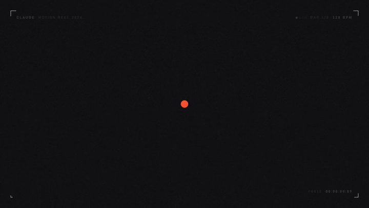

[← 返回图库](../browse/motion.md) · [English](2103449416325890146.en.md)

<a id="case-2103449416325890146"></a>

# 十五秒动态图形作品集

**[Ajith · @ajith\_io](https://x.com/ajith_io)** · 短动效 · 15s

> 发现池 · 已核对作者原帖与媒体来源，尚未完整审看。

**[▶ 观看原视频](https://video.twimg.com/amplify_video/2103449259869863936/vid/avc1/1920x1080/gLl6GZWastLVE2fr.mp4?tag=29)**

[](https://video.twimg.com/amplify_video/2103449259869863936/vid/avc1/1920x1080/gLl6GZWastLVE2fr.mp4?tag=29)

[作者原帖](https://x.com/ajith_io/status/2103449416325890146)

Ajith 发布的十五秒动态图形作品集。制作方式依据作者原帖说明；来源已核对，完整音画待审看。

**作者公开提示词** · [出处](https://x.com/ajith_io/status/2103449416325890146) · [纯文本](../prompts/2103449416325890146.txt)

```text
make a dynamic 15-second motion graphics video that shows what an incredible motion designer you are, like it's your showreel for a résumé. go all out.
```

<sub>收藏 4,403 · 点赞 3,742 · 浏览 535,691</sub>


## 来源记录

- 作品原帖: [@ajith\_io](https://x.com/ajith_io/status/2103449416325890146) · 2026-09-25T11:39:55+00:00
- 模型归因: Claude Opus 5.5 · [作者说明](https://x.com/ajith_io/status/2103449416325890146)
- 提示词出处: [作者原帖](https://x.com/ajith_io/status/2103449416325890146) · 2026-09-27 17:08 UTC
- 封面来源: [原媒体](https://pbs.twimg.com/amplify_video_thumb/2103449259869863936/img/xFjCDtYklW-hfg7m.jpg)
- 互动数据: [X](https://x.com/ajith_io/status/2103449416325890146) · 2026-09-27 17:08 UTC · 第三方匿名读取，非 X 官方 API
- 发现入口: [资料页](https://github.com/athemeroy/awesome-opus-5-5-videos/blob/f0728e6fd1e5ec496815c1c7ba115bc70e3a31f9/data/cases.csv)
- 画廊原视频: [原帖媒体](https://video.twimg.com/amplify_video/2103449259869863936/vid/avc1/1920x1080/gLl6GZWastLVE2fr.mp4?tag=29) · 2026-09-27 17:10 UTC · 已核对原帖媒体对应与媒体响应；外部引用，不重新上传

模型依据来自作者自述，未独立重跑提示词，也未对音画作统一质量评级。视频引用作者原帖媒体，未由本站重新上传，转载许可未确认。
