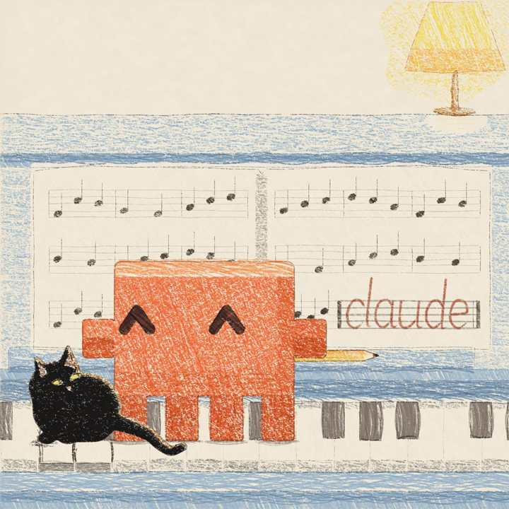

[← 返回图库](../browse/music.md) · [English](2103482164193165711.en.md)

<a id="case-2103482164193165711"></a>

# 钢琴作曲与 JavaScript 动画

**[Kevin Ngo · @kevin\_t\_ngo](https://x.com/kevin_t_ngo)** · 音乐与歌词 · 45s

> 发现池 · 已核对作者原帖与媒体来源，尚未完整审看。

**[▶ 打开画廊播放](https://guanmo-ai.github.io/awesome-ai-motion/#case-2103482164193165711)** · [作者原帖](https://x.com/kevin_t_ngo/status/2103482164193165711)

点击封面打开画廊播放。

[](https://guanmo-ai.github.io/awesome-ai-motion/#case-2103482164193165711)


Kevin Ngo 发布的钢琴作曲与 JavaScript 动画。制作方式依据作者原帖说明；来源已核对，完整音画待审看。

**作者任务描述 · 非完整提示词** · [出处](https://x.com/kevin_t_ngo/status/2103482164193165711) · [纯文本](../prompts/2103482164193165711.txt)

```text
I asked Claude Opus 5.5 to compose piano music.
```

<sub>收藏 1,209 · 点赞 3,035 · 浏览 126,578</sub>


## 来源记录

- 作品原帖: [@kevin\_t\_ngo](https://x.com/kevin_t_ngo/status/2103482164193165711) · 2026-09-25T13:50:03+00:00
- 模型归因: Claude Opus 5.5 · [作者说明](https://x.com/kevin_t_ngo/status/2103482164193165711)
- 提示词出处: [作者原帖](https://x.com/kevin_t_ngo/status/2103482164193165711) · 2026-09-27 17:13 UTC
- 封面来源: [原帖封面来源](https://pbs.twimg.com/amplify_video_thumb/2103481392843911168/img/Brd6KaCObKB6bY0C.jpg)
- 互动数据: [X](https://x.com/kevin_t_ngo/status/2103482164193165711) · 2026-09-27 17:13 UTC · 第三方匿名读取，非 X 官方 API
- 发现入口: Grok public X search
- 画廊原视频: [原帖媒体记录](https://x.com/kevin_t_ngo/status/2103482164193165711) · 2026-09-27 17:14 UTC · 已核对原帖媒体对应与媒体响应；外部引用，不重新上传

模型依据来自作者自述，未独立重跑提示词，也未对音画作统一质量评级。视频引用作者原帖媒体，未由本站重新上传，转载许可未确认。
