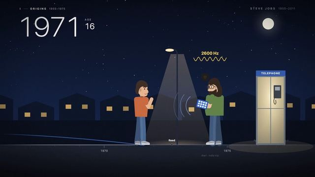

[← Back to gallery](../browse/education.en.md) · [简体中文](2103482545111232946.md)

<a id="case-2103482545111232946"></a>

# Code-Drawn Life of Steve Jobs

**[onur ozcan · @oozn](https://x.com/oozn)** · Education & explainers · 119s

> Discovery pool · Creator post and media source verified; full viewing review pending.

**[▶ Open gallery to play](https://guanmo-ai.github.io/awesome-ai-motion/?lang=en#case-2103482545111232946)** · [Original post](https://x.com/oozn/status/2103482545111232946)

Click the cover to open the gallery and play.

[](https://guanmo-ai.github.io/awesome-ai-motion/?lang=en#case-2103482545111232946)


Code-Drawn Life of Steve Jobs, shared by onur ozcan. Production attribution follows the creator’s post. Source verified; full viewing review pending.

**Author brief · not the complete prompt** · [Source](https://x.com/oozn/status/2103482545111232946) · [Plain text](../prompts/2103482545111232946.txt)

```text
after seeing its animating capabilities i got curious and asked it to tell the story of steve jobs as an animation.
```

<sub>Bookmarks 254 · Likes 190 · Views 17,622</sub>


## Source record

- Original post: [@oozn](https://x.com/oozn/status/2103482545111232946) · 2026-09-25T13:51:34+00:00
- Model attribution: Claude Opus 5.5 · [Creator’s statement](https://x.com/oozn/status/2103482545111232946)
- Prompt source: [Creator post](https://x.com/oozn/status/2103482545111232946) · 2026-09-27 17:08 UTC
- Cover source: [Original cover source](https://pbs.twimg.com/amplify_video_thumb/2103480985669021696/img/zkb2Z6PCjYhsCpur.jpg)
- Metrics snapshot: [Original X post](https://x.com/oozn/status/2103482545111232946) · 2026-09-27 17:08 UTC
- Gallery video source: [Original post media record](https://x.com/oozn/status/2103482545111232946) · 2026-09-27 17:10 UTC · Post/media correspondence and media response checked; external reference, no re-upload

Model attribution is based on creator statements. Prompts have not been independently rerun; sound and visuals have not received a uniform quality rating. Videos reference original post media, not our uploads; redistribution permission has not been verified.
