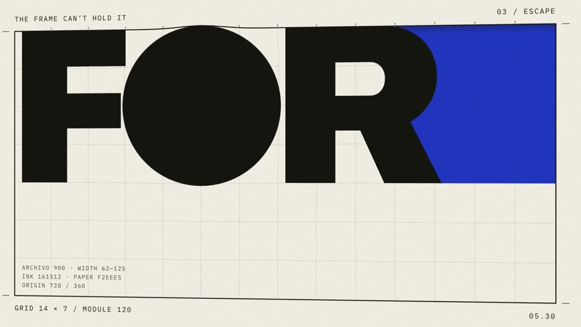

[← Back to gallery](../browse/motion.en.md) · [简体中文](2103502614134718609.md)

<a id="case-2103502614134718609"></a>

# A poster breaks out of its own frame

**[Pankaj Kumar · @pankajkumar\_dev](https://x.com/pankajkumar_dev)** · Motion design · 30s

**[▶ Open gallery to play](https://guanmo-ai.github.io/awesome-ai-motion/?lang=en#case-2103502614134718609)** · [Original post](https://x.com/pankajkumar_dev/status/2103502614134718609)

Click the cover to open the gallery and play.

[](https://guanmo-ai.github.io/awesome-ai-motion/?lang=en#case-2103502614134718609)


Typography and colored shapes break free of a poster, with camera motion and sound driving a 30-second piece.

## What to learn

Letting poster elements cross the frame can give a flat design a sense of space.

**Try it yourself** · Editorial suggestions based on public source material, not a complete record of the creator’s process.

1. Prepare a poster with clear layers and a visible frame.
2. Use the breakout as the task; try an approach, crossing and return.
3. Play the result and check depth at the crossing and text legibility.

[Source 1](https://x.com/pankajkumar_dev/status/2103502614134718609)

> Before you try: The creator publishes this one-line prompt and attributes animation, camera moves, sound and music to the model.

**Creator’s public prompt** · [Source](https://x.com/pankajkumar_dev/status/2103502614134718609) · [Plain text](../prompts/2103502614134718609.txt)

```text
create a motion design video of a poster breaking out of its own frame.
```

<sub>Bookmarks 16 · Likes 35 · Views 3,611</sub>


## Source record

- Original post: [@pankajkumar\_dev](https://x.com/pankajkumar_dev/status/2103502614134718609) · Fri Sep 25 15:11:19 +0000 2026
- Model attribution: Claude Opus 5.5 · [Creator’s statement](https://x.com/pankajkumar_dev/status/2103502614134718609)
- Prompt source: [Creator post](https://x.com/pankajkumar_dev/status/2103502614134718609) · 2026-09-27 11:13 UTC
- Cover source: [Original cover source](https://x.com/pankajkumar_dev/status/2103502614134718609) · 5.5s
- Metrics snapshot: [Original X post](https://x.com/pankajkumar_dev/status/2103502614134718609) · 2026-09-27 11:13 UTC
- Gallery video source: [Original post media record](https://x.com/pankajkumar_dev/status/2103502614134718609) · 2026-09-27 11:17 UTC · Post/media correspondence and media response checked; external reference, no re-upload

Model attribution is based on creator statements. Prompts have not been independently rerun; sound and visuals have not received a uniform quality rating. Videos reference original post media, not our uploads; redistribution permission has not been verified.
