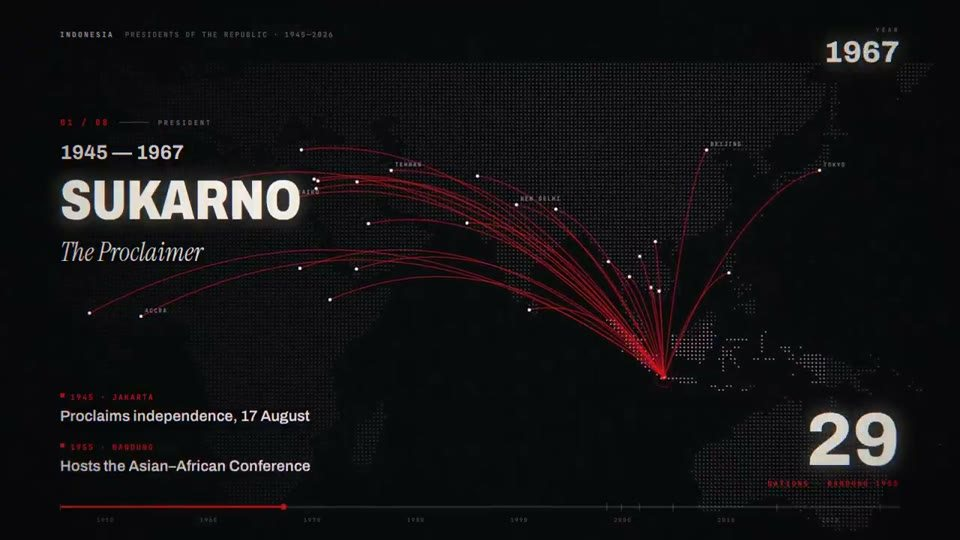

[← Back to gallery](../browse/education.en.md) · [简体中文](2103511590884815282.md)

<a id="case-2103511590884815282"></a>

# 81 years of Indonesian history

**[Sonny · @sonnylazuardi](https://x.com/sonnylazuardi)** · Education & explainers · 53s

**[▶ Open gallery to play](https://guanmo-ai.github.io/awesome-ai-motion/?lang=en#case-2103511590884815282)** · [Original post](https://x.com/sonnylazuardi/status/2103511590884815282)

Click the cover to open the gallery and play.

[](https://guanmo-ai.github.io/awesome-ai-motion/?lang=en#case-2103511590884815282)


Presidents and maps connect a historical narrative with regionally inspired music.

**Creator’s public prompt** · [Source](https://x.com/sonnylazuardi/status/2103660301132685418) · [Plain text](../prompts/2103511590884815282.txt)

```text
make a dynamic motion graphics video that shows what an incredible motion designer you are, like it's your showreel for a résumé. go all out.

generate reel but for impressive story, the history of Indonesia, first president until now , surprise me with interesting storyboard
```

<sub>Bookmarks 102 · Likes 155 · Views 11,580</sub>


## Source record

- Original post: [@sonnylazuardi](https://x.com/sonnylazuardi/status/2103511590884815282) · Fri Sep 25 15:46:59 +0000 2026
- Model attribution: Claude Opus 5.5 · [Creator’s statement](https://x.com/sonnylazuardi/status/2103511590884815282)
- Prompt source: [Creator post](https://x.com/sonnylazuardi/status/2103660301132685418) · 2026-09-27 04:57 UTC
- Cover source: [Original cover source](https://x.com/sonnylazuardi/status/2103511590884815282) · 11.62s
- Metrics: [X](https://x.com/sonnylazuardi/status/2103511590884815282) · 2026-09-27 04:57 UTC · Anonymous third-party snapshot, not the official X API
- Discovered via: [Reference](https://github.com/opusvideo/awesome-claude-video)
- Gallery video source: [Original post media record](https://x.com/sonnylazuardi/status/2103511590884815282) · 2026-09-27 11:17 UTC · Post/media correspondence and media response checked; external reference, no re-upload

Model attribution is based on creator statements. Prompts have not been independently rerun; sound and visuals have not received a uniform quality rating. Videos reference original post media, not our uploads; redistribution permission has not been verified.
