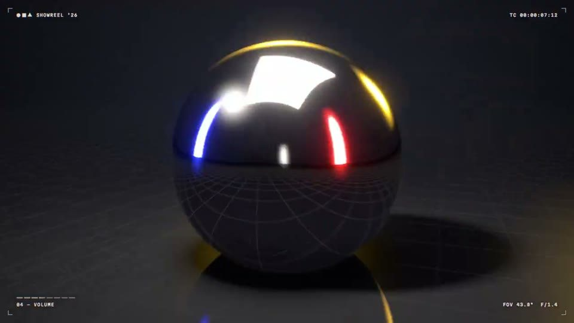

[← 返回案例库](../README.md#case-2103742861971726495)

<a id="case-2103742861971726495"></a>

### 18. 同一动效任务的无品牌与品牌版

[](https://x.com/lukasersil/status/2103742861971726495)

**[Lukáš Eršil · @lukasersil](https://x.com/lukasersil)** · [观看原帖](https://x.com/lukasersil/status/2103742861971726495) · 短动效 · 15 秒

作者同时展示两条视频，可对照品牌素材对成片的影响。

收藏 **98** · 点赞 **68** · 浏览 **7,400**

**作者公开提示词** · [出处](https://x.com/lukasersil/status/2103742861971726495) · [纯文本](../prompts/2103742861971726495.txt)

<details>
<summary>展开原文（744 字符）</summary>

```text
Create a bold, dynamic 15-second motion graphics showreel that feels like the ultimate portfolio piece of an exceptionally talented motion designer. Showcase a wide range of advanced techniques: kinetic typography, smooth transitions, 2D and 3D animation, abstract geometry, fluid simulations, particles, distortion, creative masking, compositing, lighting, depth, and seamless camera movement. Keep the pacing fast, confident, and visually surprising, with every shot transitioning naturally into the next. Make it feel meticulously art-directed rather than like a random collection of effects. Push the creativity, polish, timing, and visual impact as far as possible. This should feel like the opening reel that gets a motion designer hired.
```

</details>

原帖有两条视频：第一条无作者品牌，第二条使用其品牌素材包。封面对应第一条。

[来源与数据快照](../cases/2103742861971726495.md)

## 来源记录

- 作者原帖：[lukasersil](https://x.com/lukasersil/status/2103742861971726495)；原帖时间：Sat Sep 26 07:05:58 +0000 2026。
- 模型：Claude Opus 5.5，作者公开说明，未独立复现。[作者说明](https://x.com/lukasersil/status/2103742861971726495)
- 提示词：作者公开原文；[原始出处](https://x.com/lukasersil/status/2103742861971726495)；核对时间：2026-09-27 04:59 UTC。
- 封面：视频截图（7.2 秒）；[媒体来源](https://video.twimg.com/amplify_video/2103741580578295808/vid/avc1/1280x720/jCU8pHeci4wg_LGR.mp4?tag=29)。封面归原作者所有。
- 互动指标：[匿名读取来源](https://x.com/lukasersil/status/2103742861971726495)；2026-09-27 04:59 UTC；公开数据快照。
- 发现入口：[资料页](https://youmind.com/zh-CN/video-prompts/advanced-motion-showreel-prompt-11373)。
- 原帖视频附件已核对；没有独立重跑提示词，也未对声音和完整视频作统一质量评级。
- 原帖包含 2 个视频，本封面对应该帖第一条视频。
