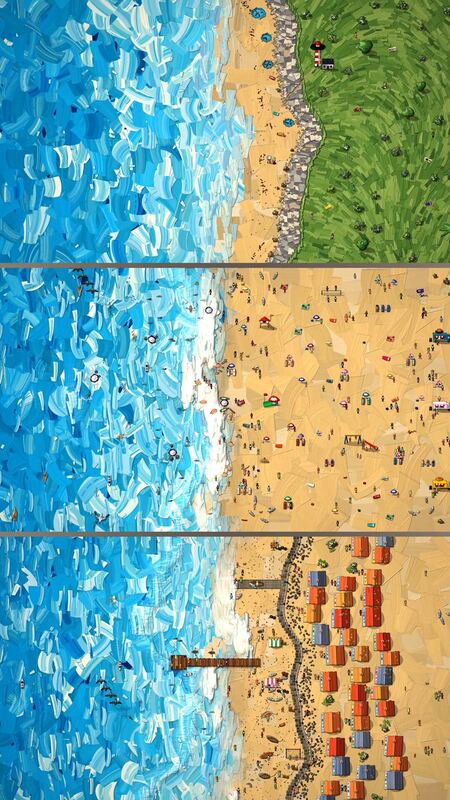

[← 返回图库](../browse/interactive.md) · [English](2103830083446415751.en.md)

# Low Tide：可玩的海滩绘画与自动预告

**[Ibrahim Boona · @boona11](https://x.com/boona11)** · 交互演示 · 31s

**[▶ 打开画廊播放](https://guanmo-ai.github.io/awesome-ai-motion/#case-2103830083446415751)** · [作者原帖](https://x.com/boona11/status/2103830083446415751)

点击封面打开画廊播放。

[Low Tide 游戏入口](https://low-tide.netlify.app/)

作者说明 Opus 5.5 制作海滩游戏后自行游玩、录制、作曲与剪辑预告；公开页面可查玩法与控制，未取得这支预告的完整制作工程。

## 源码与网页

- **公开网页**：[Low Tide 游戏入口](https://low-tide.netlify.app/)
  作者直接链接的游戏页面可查玩法与操作；这是游戏入口，未取得视频预告的完整制作工程。
  [链接出处](https://x.com/boona11/status/2103830083446415751) · 链接核对 2026-10-10 04:57 UTC

## 可以借鉴什么

把游玩、录制与预告制作连起来，可以让镜头围绕真实玩法事件展开。

**开始尝试** · 根据作者公开资料整理的编辑建议，并非作者完整操作记录。

1. 先让游戏玩法成立，再选择可展示的游玩路线。
2. 录制能够表现玩法与画风的事件，按预告结构安排镜头。
3. 配上音乐并检查动作与切点，再对照游戏实况审看。

原文提到的工具：Opus 5.5

[资料出处 1](https://x.com/boona11/status/2103830083446415751)

作者任务描述 · 非完整提示词。完整指令尚未取得，请查看作者原帖。 [查看作者原帖](https://x.com/boona11/status/2103830083446415751)

收藏 0 · 点赞 0 · 浏览 533

## 来源记录

- 作品原帖: [@boona11](https://x.com/boona11/status/2103830083446415751) · 2026-09-26T12:52:33+00:00
- 模型归因: Opus 5.5 · [作者说明](https://x.com/boona11/status/2103830083446415751)
- 提示词出处: [作者原帖](https://x.com/boona11/status/2103830083446415751) · 2026-10-10 04:55 UTC
- 封面来源: [原帖封面来源](https://pbs.twimg.com/amplify_video_thumb/2103829915430789120/img/hxztZ5JO0pIIDQOq.jpg)
- 互动快照: [X 原帖](https://x.com/boona11/status/2103830083446415751) · 2026-10-10 04:55 UTC
- 画廊原视频: [原帖媒体记录](https://x.com/boona11/status/2103830083446415751) · 2026-10-10 04:57 UTC · 已核对原帖媒体对应与媒体响应；外部引用，不重新上传

模型依据来自作者自述，未独立重跑提示词，也未对音画作统一质量评级。视频引用作者原帖媒体，未由本站重新上传，转载许可未确认。
