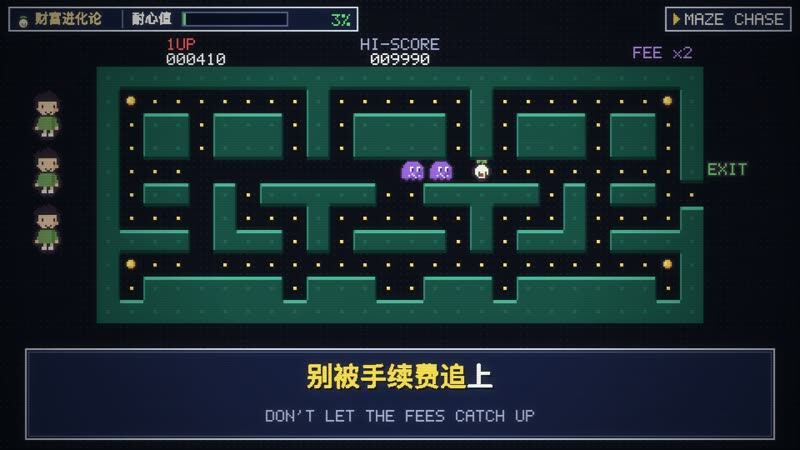

[← Back to gallery](../browse/interactive.en.md) · [简体中文](2103870009877635565.md)

# Compound QUEST: concepts as pixel-game levels

**[Charles｜0xPai.eth · @0xpai\_eth](https://x.com/0xpai_eth)** · 3D & interactive · 40s

**[▶ Open gallery to play](https://guanmo-ai.github.io/awesome-ai-motion/?lang=en#case-2103870009877635565)** · [Original post](https://x.com/0xpai_eth/status/2103870009877635565)

Click the cover to open the gallery and play.

The creator uses Opus 5.5 to turn a family-finance theme into a retro pixel game with traps, enemies and progression, then makes a trailer. A public playable link was not verified.

Author brief · not the complete prompt. The complete instructions have not been verified; see the creator’s post. [View the original post](https://x.com/0xpai_eth/status/2103870009877635565)

Bookmarks 0 · Likes 0 · Views 755

## Source record

- Original post: [@0xpai\_eth](https://x.com/0xpai_eth/status/2103870009877635565) · 2026-09-26T15:31:13+00:00
- Model attribution: Opus 5.5 · [Creator’s statement](https://x.com/0xpai_eth/status/2103870009877635565)
- Prompt source: [Creator post](https://x.com/0xpai_eth/status/2103870009877635565) · 2026-10-10 04:55 UTC
- Cover source: [Original cover source](https://x.com/0xpai_eth/status/2103870009877635565) · 18s
- Metrics snapshot: [Original X post](https://x.com/0xpai_eth/status/2103870009877635565) · 2026-10-10 04:55 UTC
- Gallery video source: [Original post media record](https://x.com/0xpai_eth/status/2103870009877635565) · 2026-10-10 04:56 UTC · Post/media correspondence and media response checked; external reference, no re-upload

Model attribution is based on creator statements. Prompts have not been independently rerun; sound and visuals have not received a uniform quality rating. Videos reference original post media, not our uploads; redistribution permission has not been verified.
