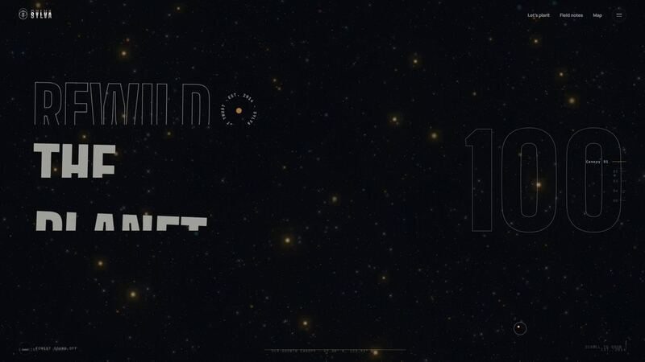

[← Back to gallery](../browse/interactive.en.md) · [简体中文](2103876499262800291.md)

# A 3D forest-conservation website experiment

**[Souradip Pal · @Souradip3000](https://x.com/Souradip3000)** · 3D & interactive · 25s

**[▶ Open gallery to play](https://guanmo-ai.github.io/awesome-ai-motion/?lang=en#case-2103876499262800291)** · [Original post](https://x.com/Souradip3000/status/2103876499262800291)

Click the cover to open the gallery and play.

The creator asks Opus 5.5 for a forest-conservation website using a Pinterest 3D reference and reports a single HTML output, without a verified public file link.

Author brief · not the complete prompt. The complete instructions have not been verified; see the creator’s post. [View the original post](https://x.com/Souradip3000/status/2103876499262800291)

Bookmarks 5 · Likes 5 · Views 709

## Source record

- Original post: [@Souradip3000](https://x.com/Souradip3000/status/2103876499262800291) · 2026-09-26T15:57:00+00:00
- Model attribution: Opus 5.5 · [Creator’s statement](https://x.com/Souradip3000/status/2103876499262800291)
- Prompt source: [Creator post](https://x.com/Souradip3000/status/2103876499262800291) · 2026-10-10 04:55 UTC
- Cover source: [Original cover source](https://pbs.twimg.com/amplify_video_thumb/2103785667553902592/img/-jPFfRgw9sNb4J94.jpg)
- Metrics snapshot: [Original X post](https://x.com/Souradip3000/status/2103876499262800291) · 2026-10-10 04:55 UTC
- Gallery video source: [Original post media record](https://x.com/Souradip3000/status/2103876499262800291) · 2026-10-10 04:57 UTC · Post/media correspondence and media response checked; external reference, no re-upload

Model attribution is based on creator statements. Prompts have not been independently rerun; sound and visuals have not received a uniform quality rating. Videos reference original post media, not our uploads; redistribution permission has not been verified.
