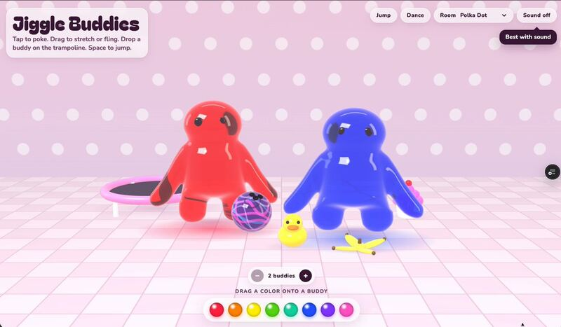

[← 返回图库](../browse/interactive.md) · [English](2103876982819954689.en.md)

# Jiggle Buddies：透明果冻角色互动

**[Angie Carel · @angie\_carel](https://x.com/angie_carel)** · 交互演示 · 41s

**[▶ 打开画廊播放](https://guanmo-ai.github.io/awesome-ai-motion/#case-2103876982819954689)** · [作者原帖](https://x.com/angie_carel/status/2103876982819954689)

点击封面打开画廊播放。

[Jiggle Buddies 与公开 HTML](https://www.angiecarel.com/jiggle-buddies)

作者测试 Opus 5.5 的反射、透明和弹性运动能力，制作可戳、拉伸与抛掷角色的 Jiggle Buddies，并公开网页入口。

## 源码与网页

- **直接源码**：[Jiggle Buddies 与公开 HTML](https://www.angiecarel.com/jiggle-buddies) · 未标明许可
  作者直接链接的游戏页包含可读的内联实现；浏览器可显示三维果冻角色和互动按钮，未核得整个项目的复用许可。
  [链接出处](https://x.com/angie_carel/status/2103876982819954689) · 链接核对 2026-10-10 04:56 UTC

作者任务描述 · 非完整提示词。完整指令尚未取得，请查看作者原帖。 [查看作者原帖](https://x.com/angie_carel/status/2103876982819954689)

收藏 1 · 点赞 3 · 浏览 227

## 来源记录

- 作品原帖: [@angie\_carel](https://x.com/angie_carel/status/2103876982819954689) · 2026-09-26T15:58:55+00:00
- 模型归因: Opus 5.5 · [作者说明](https://x.com/angie_carel/status/2103876982819954689)
- 提示词出处: [作者原帖](https://x.com/angie_carel/status/2103876982819954689) · 2026-10-10 04:55 UTC
- 封面来源: [原帖封面来源](https://pbs.twimg.com/amplify_video_thumb/2103876888661811200/img/9LW5Hya7M86UddKG.jpg)
- 互动快照: [X 原帖](https://x.com/angie_carel/status/2103876982819954689) · 2026-10-10 04:55 UTC
- 画廊原视频: [原帖媒体记录](https://x.com/angie_carel/status/2103876982819954689) · 2026-10-10 04:56 UTC · 已核对原帖媒体对应与媒体响应；外部引用，不重新上传

模型依据来自作者自述，未独立重跑提示词，也未对音画作统一质量评级。视频引用作者原帖媒体，未由本站重新上传，转载许可未确认。
