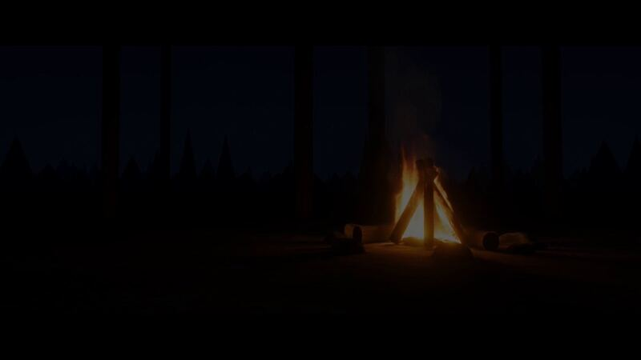

[← 返回图库](../browse/stories.md) · [English](2103881538592981110.en.md)

# GPU 火焰模拟与离线电影运镜

**[Nathan Wilbanks · @NathanWilbanks\_](https://x.com/NathanWilbanks_)** · 叙事短片 · 38s

**[▶ 打开画廊播放](https://guanmo-ai.github.io/awesome-ai-motion/#case-2103881538592981110)** · [作者原帖](https://x.com/NathanWilbanks_/status/2103881538592981110)

点击封面打开画廊播放。

作者说明 Opus 5.5 用 JavaScript 制作 GPU 三维流体火焰，反复检查渲染后离线输出 38 秒影片，并以燃烧变化驱动声音；物理与性能描述来自作者自述。

## 可以借鉴什么

模拟、离线镜头与声音可以共同读取场景变化，但渲染结果需要反复检查。

**开始尝试** · 根据作者公开资料整理的编辑建议，并非作者完整操作记录。

1. 先让火焰与烟雾在固定时间下稳定发展，再安排镜头。
2. 分次渲染检查形态和伪影，按具体问题修改模拟。
3. 离线输出运镜，并把声音与燃烧事件对齐后审看。

原文提到的工具：Opus 5.5 · JavaScript · GPU

[资料出处 1](https://x.com/NathanWilbanks_/status/2103881538592981110)

作者任务描述 · 非完整提示词。完整指令尚未取得，请查看作者原帖。 [查看作者原帖](https://x.com/NathanWilbanks_/status/2103881538592981110)

收藏 10 · 点赞 17 · 浏览 1,049

## 来源记录

- 作品原帖: [@NathanWilbanks\_](https://x.com/NathanWilbanks_/status/2103881538592981110) · 2026-09-26T16:17:01+00:00
- 模型归因: Opus 5.5 · [作者说明](https://x.com/NathanWilbanks_/status/2103881538592981110)
- 提示词出处: [作者原帖](https://x.com/NathanWilbanks_/status/2103881538592981110) · 2026-10-10 04:55 UTC
- 封面来源: [原帖封面来源](https://pbs.twimg.com/amplify_video_thumb/2103881088577802241/img/RPp9fVmdhQiYIr-s.jpg)
- 互动快照: [X 原帖](https://x.com/NathanWilbanks_/status/2103881538592981110) · 2026-10-10 04:55 UTC
- 画廊原视频: [原帖媒体记录](https://x.com/NathanWilbanks_/status/2103881538592981110) · 2026-10-10 04:56 UTC · 已核对原帖媒体对应与媒体响应；外部引用，不重新上传

模型依据来自作者自述，未独立重跑提示词，也未对音画作统一质量评级。视频引用作者原帖媒体，未由本站重新上传，转载许可未确认。
