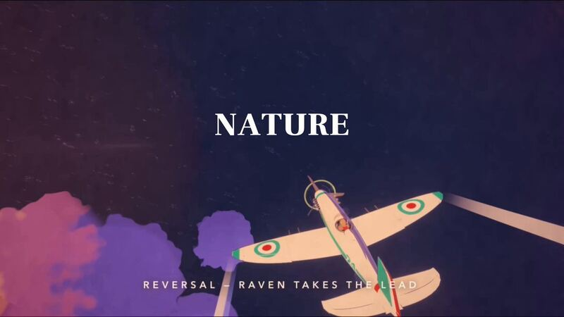

[← 返回图库](../browse/stories.md) · [English](2103882415299350878.en.md)

# 日落海面上的三维空战场景

**[SuSu\_酥酥👅 · @NFT\_Chen](https://x.com/NFT_Chen)** · 叙事短片 · 14s

**[▶ 打开画廊播放](https://guanmo-ai.github.io/awesome-ai-motion/#case-2103882415299350878)** · [作者原帖](https://x.com/NFT_Chen/status/2103882415299350878)

点击封面打开画廊播放。

作者公开单句指令，让 Opus 5.5 与 Three.js 制作《红猪》主题空战场景，任务包含飞机配色、云层、海面反光与运镜；作者称一次完成。

作者已公开指令；本站仅提供原帖入口，不再分发全文或译文。 [查看作者原文](https://x.com/NFT_Chen/status/2103882415299350878)

收藏 53 · 点赞 75 · 浏览 21,174

## 来源记录

- 作品原帖: [@NFT\_Chen](https://x.com/NFT_Chen/status/2103882415299350878) · 2026-09-26T16:20:30+00:00
- 模型归因: Opus 5.5 · [作者说明](https://x.com/NFT_Chen/status/2103882415299350878)
- 提示词出处: [作者原帖](https://x.com/NFT_Chen/status/2103882415299350878) · 2026-10-10 04:55 UTC
- 封面来源: [原帖封面来源](https://pbs.twimg.com/amplify_video_thumb/2103880839578935296/img/XBck3sW2y_nMIUEu.jpg)
- 互动快照: [X 原帖](https://x.com/NFT_Chen/status/2103882415299350878) · 2026-10-10 04:55 UTC
- 画廊原视频: [原帖媒体记录](https://x.com/NFT_Chen/status/2103882415299350878) · 2026-10-10 04:57 UTC · 已核对原帖媒体对应与媒体响应；外部引用，不重新上传

模型依据来自作者自述，未独立重跑提示词，也未对音画作统一质量评级。视频引用作者原帖媒体，未由本站重新上传，转载许可未确认。
